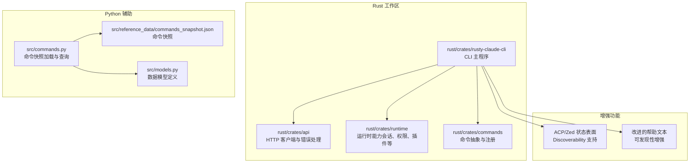
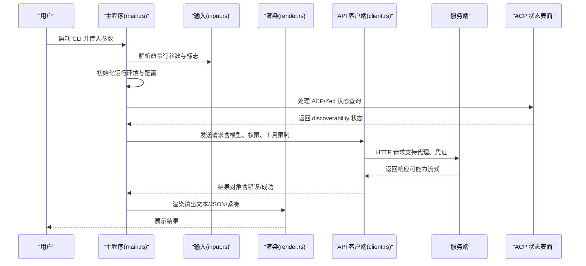
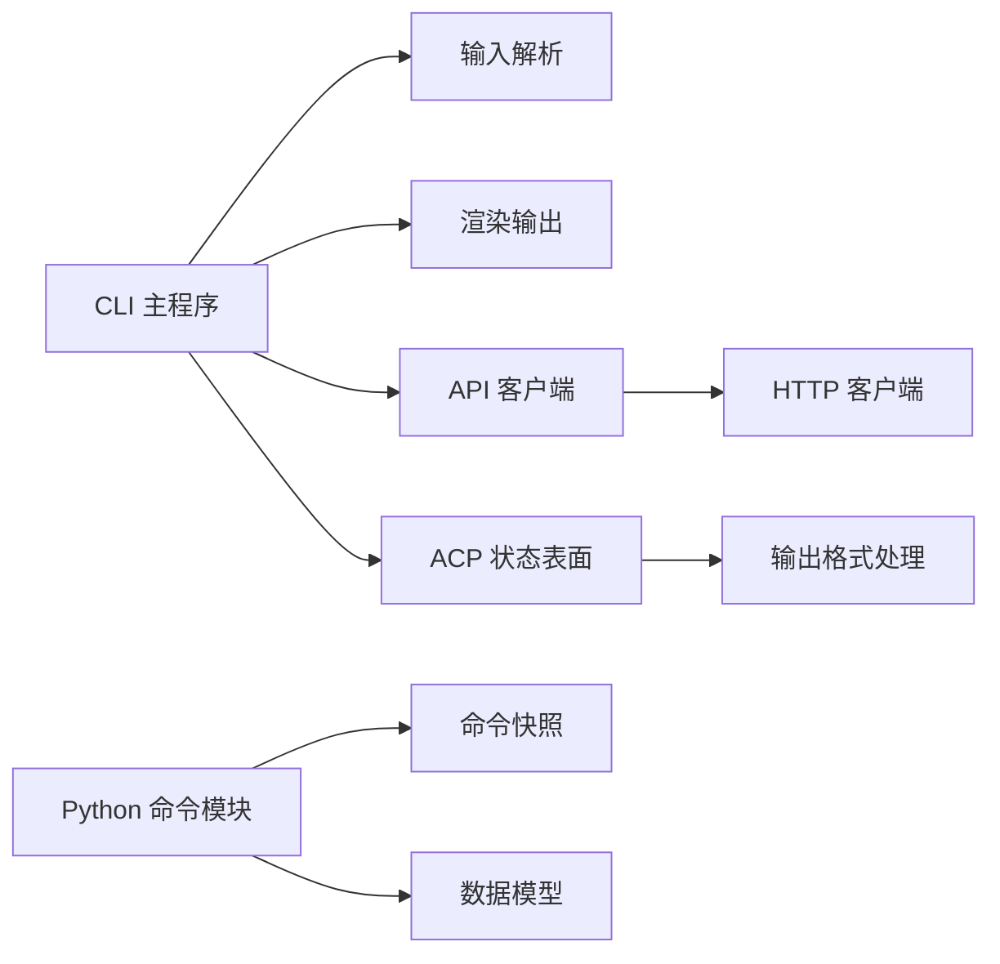

# CLI 命令参考

<cite>
**本文引用的文件**
- [README.md](file://README.md)
- [USAGE.md](file://USAGE.md)
- [Cargo.toml](file://rust/Cargo.toml)
- [commands.py](file://src/commands.py)
- [models.py](file://src/models.py)
- [commands_snapshot.json](file://src/reference_data/commands_snapshot.json)
- [main.rs](file://rust/crates/rusty-claude-cli/src/main.rs)
- [input.rs](file://rust/crates/rusty-claude-cli/src/input.rs)
- [render.rs](file://rust/crates/rusty-claude-cli/src/render.rs)
- [init.rs](file://rust/crates/rusty-claude-cli/src/init.rs)
- [client.rs](file://rust/crates/api/src/client.rs)
- [http_client.rs](file://rust/crates/api/src/http_client.rs)
- [lib.rs](file://rust/crates/commands/src/lib.rs)
- [output_format_contract.rs](file://rust/crates/rusty-claude-cli/tests/output_format_contract.rs)
- [ROADMAP.md](file://ROADMAP.md)
</cite>

## 更新摘要
**所做更改**
- 新增 ACP/Zed 状态表面和 discoverability 功能章节
- 更新帮助文本改进和可发现性增强
- 添加新的 acp 命令及其 JSON 输出格式规范
- 更新命令别名和状态报告功能
- 增强 CLI 可发现性改进的详细说明

## 目录
1. [简介](#简介)
2. [项目结构](#项目结构)
3. [核心组件](#核心组件)
4. [架构总览](#架构总览)
5. [详细组件分析](#详细组件分析)
6. [依赖分析](#依赖分析)
7. [性能考虑](#性能考虑)
8. [故障排查指南](#故障排查指南)
9. [结论](#结论)
10. [附录](#附录)

## 简介
本参考文档面向使用 claw CLI 的用户与自动化集成开发者，系统性梳理命令体系、参数与标志、输出格式、错误处理、会话管理、配置与认证等关键主题。重点覆盖以下方面：
- 基础命令：prompt、session、doctor 等
- Slash 命令：REPL 内交互式命令（如 /help、/status、/cost、/config、/session、/model、/permissions、/export）
- 配置命令与调试命令：doctor、config、permissions、model、export 等
- 一次性提示与脚本化输出：--output-format、--resume、--model、--permission-mode、--allowed-tools 等
- 会话管理与回放：--resume latest 及其组合用法
- **新增**：ACP/Zed 状态表面和 discoverability 功能
- **新增**：增强的 CLI 可发现性改进
- 最佳实践与高级技巧：代理、模型别名、权限模式、本地与兼容服务接入
- 命令别名与自动化脚本集成建议

## 项目结构
仓库采用多工作区组织，核心 CLI 实现在 Rust 工作区中，配套的 Python 辅助模块用于命令镜像快照与索引构建。



**图表来源**
- [Cargo.toml:1-23](file://rust/Cargo.toml#L1-L23)
- [commands.py:1-91](file://src/commands.py#L1-91)
- [models.py:1-50](file://src/models.py#L1-50)
- [commands_snapshot.json:1-800](file://src/reference_data/commands_snapshot.json#L1-800)

**章节来源**
- [Cargo.toml:1-23](file://rust/Cargo.toml#L1-L23)
- [README.md:31-36](file://README.md#L31-L36)

## 核心组件
- CLI 主程序与输入渲染
  - 主入口负责解析命令行参数、初始化运行环境、选择输出样式与交互模式，并将请求路由到后端 API。
  - 输入解析与渲染模块分别承担命令行输入处理与结果渲染职责。
- API 客户端
  - 提供统一的 HTTP 客户端封装、错误类型与 SSE 流式响应支持，支撑 CLI 的请求发送与结果接收。
- 命令快照与查询
  - Python 模块从 JSON 快照加载命令条目，提供名称匹配、过滤与索引渲染能力；在当前仓库中，这些命令以"镜像"形式存在，代表已迁移或计划迁移的命令集合。
- **新增**：ACP/Zed 状态表面
  - 提供编辑器集成状态报告，当前为 discoverability 仅支持，不启动实际的编辑器守护进程。
- **新增**：增强的可发现性功能
  - 改进的帮助文本结构，提供更清晰的命令分类和使用指导。

**章节来源**
- [main.rs](file://rust/crates/rusty-claude-cli/src/main.rs)
- [input.rs](file://rust/crates/rusty-claude-cli/src/input.rs)
- [render.rs](file://rust/crates/rusty-claude-cli/src/render.rs)
- [client.rs](file://rust/crates/api/src/client.rs)
- [http_client.rs](file://rust/crates/api/src/http_client.rs)
- [commands.py:13-91](file://src/commands.py#L13-L91)
- [models.py:14-50](file://src/models.py#L14-L50)
- [commands_snapshot.json:1-800](file://src/reference_data/commands_snapshot.json#L1-800)

## 架构总览
下图展示 CLI 从启动到输出的关键调用链路，包括参数解析、会话恢复、权限与模型选择、HTTP 请求与流式响应处理，以及新增的 ACP 状态表面功能。



**图表来源**
- [main.rs](file://rust/crates/rusty-claude-cli/src/main.rs)
- [input.rs](file://rust/crates/rusty-claude-cli/src/input.rs)
- [render.rs](file://rust/crates/rusty-claude-cli/src/render.rs)
- [client.rs](file://rust/crates/api/src/client.rs)
- [http_client.rs](file://rust/crates/api/src/http_client.rs)

## 详细组件分析

### 命令与参数总览
- 一次性提示与脚本化输出
  - 语法：claw [flags] prompt "你的提示词"
  - 关键标志
    - --output-format：设置输出格式（如 json），便于脚本化消费
    - --model：指定模型别名或完整模型名
    - --permission-mode：设置权限模式（如 read-only、workspace-write、danger-full-access）
    - --allowed-tools：限制允许使用的工具（逗号分隔）
  - 示例
    - 一次性提示：./target/debug/claw prompt "summarize this repository"
    - JSON 输出：./target/debug/claw --output-format json prompt "status"
    - 权限控制：./target/debug/claw --permission-mode read-only prompt "summarize Cargo.toml"
    - 指定模型：./target/debug/claw --model sonnet prompt "review this diff"
- 会话管理与回放
  - 语法：claw --resume latest [可选命令列表]
  - 说明：REPL 会话保存在 .claw/sessions/ 下，--resume latest 可快速恢复最新会话并执行后续命令
  - 示例：./target/debug/claw --resume latest /doctor
- 交互式 REPL
  - 语法：claw
  - 在 REPL 中可使用 Slash 命令进行诊断、状态查看、导出等操作
- **新增**：ACP/Zed 状态表面
  - 语法：claw acp [serve]
  - 别名：claw --acp, claw -acp
  - 当前状态：discoverability only（仅状态报告，不启动守护进程）
  - 输出格式：支持文本和 JSON 两种格式
  - 追踪：ROADMAP #64a（discoverability）· ROADMAP #76（真实 ACP 支持）

**章节来源**
- [USAGE.md:53-82](file://USAGE.md#L53-L82)
- [USAGE.md:308-318](file://USAGE.md#L308-L318)
- [main.rs:5201-5246](file://rust/crates/rusty-claude-cli/src/main.rs#L5201-L5246)
- [output_format_contract.rs:50-65](file://rust/crates/rusty-claude-cli/tests/output_format_contract.rs#L50-L65)

### Slash 命令参考
以下为 REPL 内常用交互式命令（Slash 命令）的参考。这些命令在交互模式下通过前缀 / 使用，常用于诊断、状态查看、配置与导出。

- /help
  - 用途：显示帮助信息与可用命令列表
  - 适用场景：首次进入 REPL 或需要快速查阅命令
- /status
  - 用途：显示当前工作区状态与上下文摘要
  - 适用场景：日常检查、问题定位
- /cost
  - 用途：显示当前会话的用量统计（输入/输出 token）
  - 适用场景：成本控制与用量审计
- /config
  - 用途：查看与编辑配置项
  - 适用场景：调整行为、启用/禁用功能
- /session
  - 用途：列出与切换会话
  - 适用场景：多任务并行或历史回溯
- /model
  - 用途：查看/切换模型
  - 适用场景：不同任务选择合适模型
- /permissions
  - 用途：查看/调整权限模式
  - 适用场景：安全敏感任务或受限环境
- /export
  - 用途：导出会话内容或上下文
  - 适用场景：归档、分享或离线分析

**章节来源**
- [USAGE.md:318-318](file://USAGE.md#L318-L318)

### doctor 命令（健康检查）
- 用途：内置的预检诊断命令，验证环境、凭据与网络连通性
- 用法
  - 一次性运行：./target/debug/claw doctor
  - 会话恢复后运行：./target/debug/claw --resume latest /doctor
- 输出与错误
  - 成功：返回健康状态与环境摘要
  - 失败：返回具体错误原因（如缺少凭据、代理配置不当、模型不可用等）

**章节来源**
- [USAGE.md:3-17](file://USAGE.md#L3-L17)

### config 命令（配置）
- 用途：查看与编辑配置项
- 适用场景：调整行为、启用/禁用功能、设置别名与默认参数
- 配置文件解析顺序（后写覆盖先写）
  - ~/.claw.json
  - ~/.config/claw/settings.json
  - <仓库>/.claw.json
  - <仓库>/.claw/settings.json
  - <仓库>/.claw/settings.local.json

**章节来源**
- [USAGE.md:320-328](file://USAGE.md#L320-L328)

### permissions 命令（权限）
- 支持模式
  - read-only：只读访问
  - workspace-write：工作区写入
  - danger-full-access：全量访问（谨慎使用）
- 用法：./target/debug/claw --permission-mode <模式> prompt "你的提示"

**章节来源**
- [USAGE.md:84-88](file://USAGE.md#L84-L88)

### model 命令（模型）
- 别名
  - opus → claude-opus-4-6
  - sonnet → claude-sonnet-4-6
  - haiku → claude-haiku-4-5-20251213
- 自定义别名：在用户或项目设置中添加 aliases 字段
- 用法：./target/debug/claw --model <别名或完整模型名> prompt "你的提示"

**章节来源**
- [USAGE.md:90-94](file://USAGE.md#L90-L94)
- [USAGE.md:218-232](file://USAGE.md#L218-L232)

### export 命令（导出）
- 用途：导出会话内容或上下文，便于归档与离线分析
- 适用场景：合规审计、知识沉淀、迁移备份

**章节来源**
- [USAGE.md:318-318](file://USAGE.md#L318-L318)

### ACP/Zed 状态表面（新增）
- 用途：显示编辑器集成状态，当前为 discoverability 仅支持
- 语法
  - claw acp [serve] - 显示 ACP/Zed 状态
  - claw --acp - 别名形式
  - claw -acp - 短格式别名
- 当前状态
  - Status：discoverability only（仅 discoverability 支持）
  - Launch：`claw acp serve` / `claw --acp` / `claw -acp` 报告状态；无编辑器守护进程可用
  - Tracking：ROADMAP #76（真实 ACP 支持）
- 输出格式
  - 文本格式：人类可读的状态报告
  - JSON 格式：结构化输出，包含状态、支持性、消息等字段
- 推荐工作流
  - claw prompt TEXT - 一次性提示
  - claw - 使用 REPL
  - claw doctor - 健康检查

**章节来源**
- [main.rs:5201-5246](file://rust/crates/rusty-claude-cli/src/main.rs#L5201-L5246)
- [output_format_contract.rs:50-65](file://rust/crates/rusty-claude-cli/tests/output_format_contract.rs#L50-L65)
- [ROADMAP.md:1174](file://ROADMAP.md#L1174)

### 命令别名与自动化集成
- 命令别名
  - 用户可通过设置文件添加自定义别名，实现常用命令的简写
  - **新增**：ACP 命令别名支持（--acp, -acp）
- 脚本化建议
  - 使用 --output-format json 获取结构化输出，便于管道处理
  - 使用 --resume latest 批量执行多个命令，提升效率
  - 将权限模式与工具白名单固化到脚本参数中，确保可重复与安全
  - **新增**：利用 ACP 状态表面进行编辑器集成状态检查

**章节来源**
- [USAGE.md:220-230](file://USAGE.md#L220-L230)
- [USAGE.md:67-72](file://USAGE.md#L67-L72)
- [USAGE.md:314-316](file://USAGE.md#L314-L316)

## 依赖分析
- 组件耦合
  - CLI 主程序依赖输入解析、渲染与 API 客户端
  - API 客户端依赖 HTTP 客户端与错误类型
  - Python 辅助模块依赖 JSON 快照与数据模型，提供命令索引与查询能力
  - **新增**：ACP 状态表面依赖主程序的输出格式处理
- 外部依赖
  - HTTP 客户端支持标准代理变量（HTTP_PROXY、HTTPS_PROXY、NO_PROXY）
  - 支持多种提供商后端（Anthropic、OpenAI 兼容、xAI、DashScope）
  - **新增**：编辑器集成协议支持（当前为 discoverability 仅支持）



**图表来源**
- [main.rs](file://rust/crates/rusty-claude-cli/src/main.rs)
- [input.rs](file://rust/crates/rusty-claude-cli/src/input.rs)
- [render.rs](file://rust/crates/rusty-claude-cli/src/render.rs)
- [client.rs](file://rust/crates/api/src/client.rs)
- [http_client.rs](file://rust/crates/api/src/http_client.rs)
- [commands.py:13-91](file://src/commands.py#L13-L91)
- [models.py:14-50](file://src/models.py#L14-L50)
- [commands_snapshot.json:1-800](file://src/reference_data/commands_snapshot.json#L1-800)

**章节来源**
- [Cargo.toml:1-23](file://rust/Cargo.toml#L1-L23)
- [README.md:35-36](file://README.md#L35-L36)

## 性能考虑
- 输出格式
  - 使用 --output-format json 便于脚本化处理，减少解析开销
  - **新增**：ACP 状态表面的 JSON 输出格式优化
- 权限与工具限制
  - 通过 --permission-mode 与 --allowed-tools 缩小操作面，降低不必要的网络与计算消耗
- 会话复用
  - 使用 --resume latest 减少重复初始化与上下文构建时间
- 代理与网络
  - 正确配置代理变量可避免失败重试与超时，提升整体吞吐
- **新增**：ACP 状态查询的轻量级实现
  - 不启动实际守护进程，仅提供状态报告，减少资源消耗

## 故障排查指南
- 认证错误
  - 症状：401 未授权
  - 原因：将 API Key 放入了错误的环境变量（例如将 sk-ant-* 放入 ANTHROPIC_AUTH_TOKEN）
  - 处理：将密钥放入 ANTHROPIC_API_KEY，或将 OAuth Token 放入 ANTHROPIC_AUTH_TOKEN
- 代理问题
  - 症状：请求超时或被阻断
  - 处理：设置 HTTP_PROXY/HTTPS_PROXY/NO_PROXY，或使用统一 proxy_url 配置
- 模型不可用
  - 症状：模型名称解析失败或后端不支持
  - 处理：确认模型别名映射或直接使用完整模型名；必要时切换至兼容后端
- **新增**：ACP 状态表面问题
  - 症状：ACP 命令返回 discoverability only 状态
  - 原因：当前版本不支持真实的 ACP/Zed 协议
  - 处理：使用正常的终端界面（prompt、REPL、doctor）进行操作，等待 ROADMAP #76 完成

**章节来源**
- [USAGE.md:111-123](file://USAGE.md#L111-L123)
- [USAGE.md:253-294](file://USAGE.md#L253-L294)

## 结论
本参考文档系统梳理了 claw CLI 的命令体系、参数与标志、输出格式、错误处理与会话管理。结合 Slash 命令与 doctor 健康检查，用户可在交互与脚本化场景中高效完成日常任务。**新增的 ACP/Zed 状态表面功能提供了编辑器集成的 discoverability 支持，虽然当前不启动实际守护进程，但为未来的编辑器集成奠定了基础。** 建议在自动化脚本中固定权限模式与输出格式，并通过会话恢复机制提升批量任务的稳定性与效率。同时，关注 ROADMAP #76 的进展以获取完整的 ACP/Zed 集成功能。

## 附录

### 常用命令速查表
- 一次性提示：claw prompt "你的提示"
- JSON 输出：claw --output-format json prompt "你的提示"
- 权限控制：claw --permission-mode read-only prompt "你的提示"
- 指定模型：claw --model sonnet prompt "你的提示"
- 会话恢复：claw --resume latest /doctor
- 交互式 REPL：claw
- Slash 命令：/help、/status、/cost、/config、/session、/model、/permissions、/export
- **新增**：ACP 状态检查：claw acp, claw --acp, claw -acp
- **新增**：健康检查：claw doctor

**章节来源**
- [USAGE.md:53-82](file://USAGE.md#L53-L82)
- [USAGE.md:308-318](file://USAGE.md#L308-L318)

### ACP 状态表面 JSON 输出格式规范（新增）
当使用 --output-format json 时，ACP 命令返回以下结构：

```json
{
  "kind": "acp",
  "status": "discoverability_only",
  "supported": false,
  "serve_alias_only": true,
  "message": "ACP/Zed editor integration is not implemented in claw-code yet. `claw acp serve` is only a discoverability alias today; it does not launch a daemon or Zed-specific protocol endpoint. Use the normal terminal surfaces for now and track ROADMAP #76 for real ACP support.",
  "launch_command": null,
  "aliases": ["acp", "--acp", "-acp"],
  "discoverability_tracking": "ROADMAP #64a",
  "tracking": "ROADMAP #76",
  "recommended_workflows": [
    "claw prompt TEXT",
    "claw",
    "claw doctor"
  ]
}
```

**章节来源**
- [output_format_contract.rs:50-65](file://rust/crates/rusty-claude-cli/tests/output_format_contract.rs#L50-L65)
- [main.rs:5223-5243](file://rust/crates/rusty-claude-cli/src/main.rs#L5223-L5243)