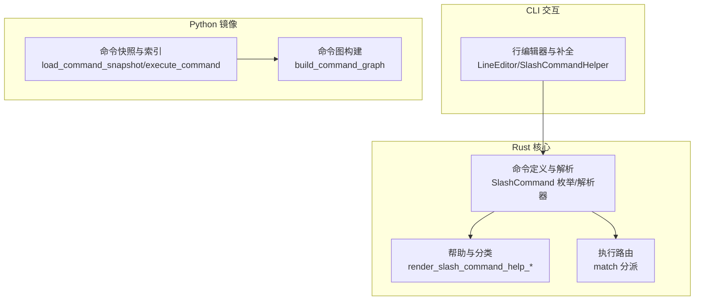
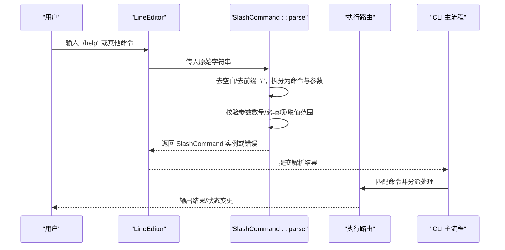
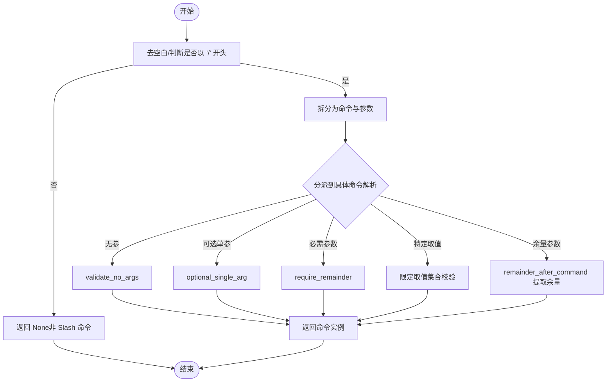
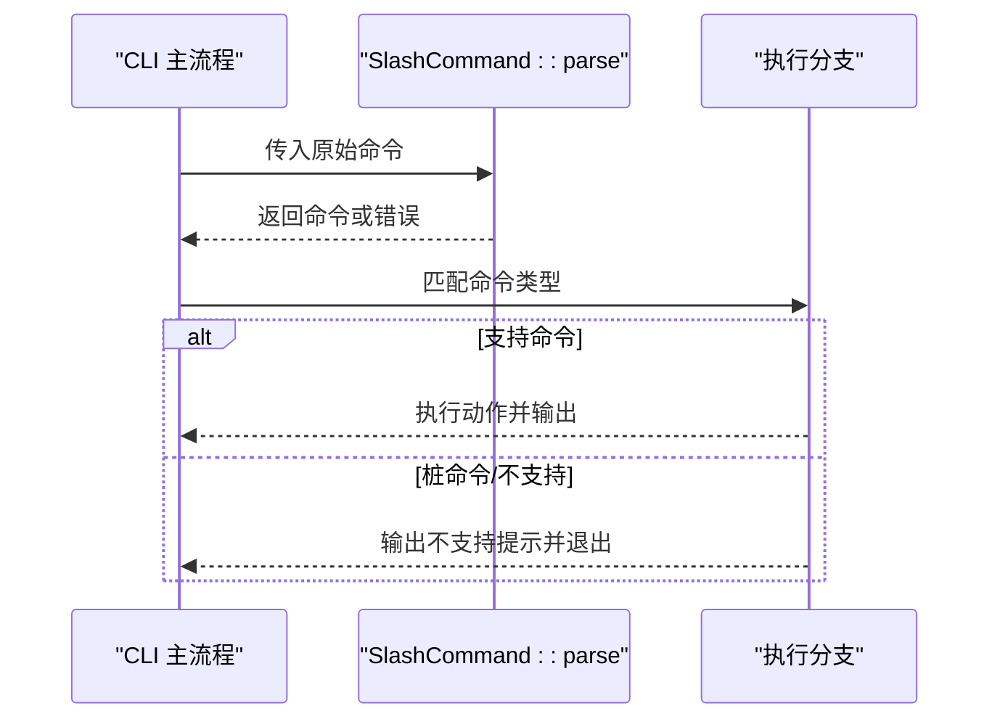
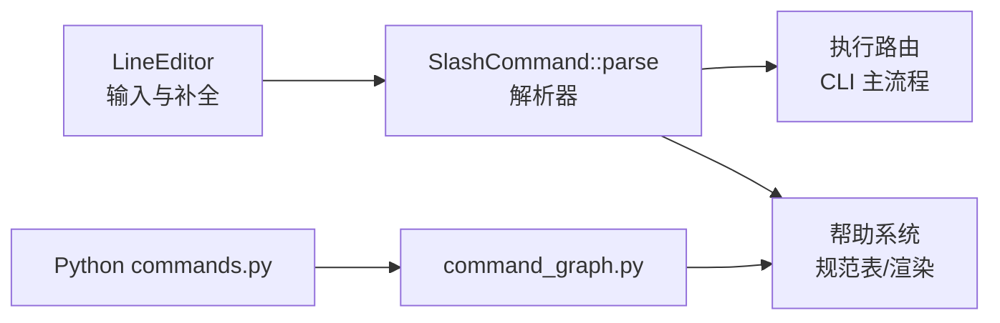

# Slash 命令

<cite>
**本文引用的文件**
- [rust\crates\commands\src\lib.rs](file://rust\crates\commands\src\lib.rs)
- [rust\crates\rusty-claude-cli\src\input.rs](file://rust\crates\rusty-claude-cli\src\input.rs)
- [rust\crates\rusty-claude-cli\src\main.rs](file://rust\crates\rusty-claude-cli\src\main.rs)
- [src\commands.py](file://src\commands.py)
- [src\command_graph.py](file://src\command_graph.py)
</cite>

## 目录
1. [简介](#简介)
2. [项目结构](#项目结构)
3. [核心组件](#核心组件)
4. [架构总览](#架构总览)
5. [详细组件分析](#详细组件分析)
6. [依赖分析](#依赖分析)
7. [性能考量](#性能考量)
8. [故障排查指南](#故障排查指南)
9. [结论](#结论)
10. [附录](#附录)

## 简介
本文件系统性阐述 Slash 命令体系：从命令格式、解析与执行机制，到命令清单、分类与别名、生命周期与状态管理、错误处理策略，以及在交互式 REPL 中的最佳实践与高级用法。Slash 命令以“/”开头，覆盖会话管理、工具调用、配置调整、调试诊断等多个维度，并通过统一的解析器与帮助系统提供一致的用户体验。

## 项目结构
Slash 命令系统主要由以下模块构成：
- Rust 解析与执行层：负责命令枚举、解析、校验、帮助渲染与执行路由
- CLI 交互层：提供交互式输入、补全、历史与中断处理
- Python 命令镜像层：用于命令快照、索引与展示（与 Rust 命令生态互补）

图表来源
- [rust\crates\commands\src\lib.rs](file://rust\crates\commands\src\lib.rs)
- [rust\crates\rusty-claude-cli\src\input.rs](file://rust\crates\rusty-claude-cli\src\input.rs)
- [src\commands.py](file://src\commands.py)
- [src\command_graph.py](file://src\command_graph.py)

章节来源
- [rust\crates\commands\src\lib.rs](file://rust\crates\commands\src\lib.rs)
- [rust\crates\rusty-claude-cli\src\input.rs](file://rust\crates\rusty-claude-cli\src\input.rs)
- [src\commands.py](file://src\commands.py)
- [src\command_graph.py](file://src\command_graph.py)

## 核心组件
- 命令枚举与解析
  - 定义了完整的 SlashCommand 枚举，涵盖 /help、/agents、/mcp、/skills、/plugins 等命令及其参数形态
  - 提供 validate_slash_command_input 与 parse 子函数族，完成前缀识别、参数切分、必填/可选参数校验、别名映射等
- 命令帮助与分类
  - 维护 SLASH_COMMAND_SPECS 规范表，含名称、别名、摘要、参数提示、是否支持恢复等
  - 渲染帮助文本，按 Session/Tools/Config/Debug 分类输出
- 执行路由
  - 在 CLI 主流程中根据解析结果进行分支处理，对不支持或桩命令给出明确提示
- 交互式输入与补全
  - LineEditor 封装 rustyline，提供补全、高亮、历史、中断处理
  - SlashCommandHelper 基于候选集进行前缀匹配补全

章节来源
- [rust\crates\commands\src\lib.rs](file://rust\crates\commands\src\lib.rs)
- [rust\crates\rusty-claude-cli\src\input.rs](file://rust\crates\rusty-claude-cli\src\input.rs)
- [rust\crates\rusty-claude-cli\src\main.rs](file://rust\crates\rusty-claude-cli\src\main.rs)

## 架构总览
Slash 命令从输入到执行的关键路径如下：

图表来源
- [rust\crates\commands\src\lib.rs](file://rust\crates\commands\src\lib.rs)
- [rust\crates\rusty-claude-cli\src\input.rs](file://rust\crates\rusty-claude-cli\src\input.rs)
- [rust\crates\rusty-claude-cli\src\main.rs](file://rust\crates\rusty-claude-cli\src\main.rs)

## 详细组件分析

### 命令解析与参数校验
- 命令识别
  - 仅以“/”开头的输入被视为 Slash 命令；否则返回未命中
  - 命令名大小写不敏感，且支持别名
- 参数切分与余量提取
  - 使用空白分割命令与参数
  - 对需要“剩余参数”的命令，提取命令后的整段作为余量
- 参数约束
  - 必需参数：require_remainder 要求必须提供
  - 可选单参：optional_single_arg 接受零个或一个值
  - 无参命令：validate_no_args 拒绝多余参数
  - 特定取值：parse_permissions_mode、parse_config_section 等限定合法值集合
- 错误信息
  - usage_error/command_error 统一生成带“Usage”提示的帮助消息
  - render_slash_command_help_detail 可附加命令详情

图表来源
- [rust\crates\commands\src\lib.rs](file://rust\crates\commands\src\lib.rs)

章节来源
- [rust\crates\commands\src\lib.rs](file://rust\crates\commands\src\lib.rs)

### 命令分类与帮助系统
- 规范表 SLASH_COMMAND_SPECS
  - 记录每个命令的名称、别名、摘要、参数提示、是否支持恢复
- 分类逻辑
  - 按名称映射到 Session/Tools/Config/Debug 四大类
- 帮助渲染
  - render_slash_command_help_filtered 按类别输出命令清单
  - render_slash_command_help_detail 输出单命令详细信息（含 Usage、别名、是否支持恢复）
- 命令建议
  - suggest_slash_commands 基于前缀与编辑距离生成候选

章节来源
- [rust\crates\commands\src\lib.rs](file://rust\crates\commands\src\lib.rs)

### 执行路由与生命周期
- 生命周期阶段
  - 输入阶段：LineEditor 读取与补全
  - 解析阶段：SlashCommand::parse 校验与构造命令对象
  - 分派阶段：CLI 主流程根据命令类型执行对应动作
  - 结束阶段：输出结果、更新状态、记录历史
- 不支持与桩命令处理
  - CLI 在调用解析器前先检查 STUB_COMMANDS，避免出现误导性的“Did you mean /X?”提示
  - 对不支持命令直接退出并输出明确信息

图表来源
- [rust\crates\rusty-claude-cli\src\main.rs](file://rust\crates\rusty-claude-cli\src\main.rs)
- [rust\crates\commands\src\lib.rs](file://rust\crates\commands\src\lib.rs)

章节来源
- [rust\crates\rusty-claude-cli\src\main.rs](file://rust\crates\rusty-claude-cli\src\main.rs)
- [rust\crates\commands\src\lib.rs](file://rust\crates\commands\src\lib.rs)

### 交互式 REPL 的补全与体验
- 补全机制
  - SlashCommandHelper 基于候选集进行前缀匹配
  - normalize_completions 过滤非 Slash 命令候选并去重
- 输入体验
  - LineEditor 支持历史、中断（Ctrl+C/EOF）、回车换行、终端检测
  - highlight/validator/hinter 等钩子增强编辑体验
- 与命令解析的衔接
  - slash_command_prefix 仅在光标位于末尾时触发 Slash 命令补全
  - 解析失败时，帮助系统提供清晰的 Usage 指引

章节来源
- [rust\crates\rusty-claude-cli\src\input.rs](file://rust\crates\rusty-claude-cli\src\input.rs)

### Python 命令镜像层（与 Rust 命令生态互补）
- 命令快照与索引
  - load_command_snapshot 从 JSON 加载已镜像命令
  - built_in_command_names/get_commands/find_commands/render_command_index 提供查询与展示能力
- 命令图构建
  - build_command_graph 按来源（插件/技能/内置）分类汇总

章节来源
- [src\commands.py](file://src\commands.py)
- [src\command_graph.py](file://src\command_graph.py)

## 依赖分析
- Rust 层内部耦合
  - SlashCommand 枚举与解析器紧密耦合，解析器依赖规范表与辅助校验函数
  - 执行路由依赖解析结果，CLI 主流程在解析后进行分支处理
- CLI 与解析器
  - LineEditor 仅负责输入与补全，不参与解析；解析由 Rust commands crate 完成
- Python 层与 Rust 层
  - Python commands.py 提供命令快照与索引，服务于上层展示与检索，不参与解析与执行

图表来源
- [rust\crates\commands\src\lib.rs](file://rust\crates\commands\src\lib.rs)
- [rust\crates\rusty-claude-cli\src\input.rs](file://rust\crates\rusty-claude-cli\src\input.rs)
- [rust\crates\rusty-claude-cli\src\main.rs](file://rust\crates\rusty-claude-cli\src\main.rs)
- [src\commands.py](file://src\commands.py)
- [src\command_graph.py](file://src\command_graph.py)

章节来源
- [rust\crates\commands\src\lib.rs](file://rust\crates\commands\src\lib.rs)
- [rust\crates\rusty-claude-cli\src\input.rs](file://rust\crates\rusty-claude-cli\src\input.rs)
- [rust\crates\rusty-claude-cli\src\main.rs](file://rust\crates\rusty-claude-cli\src\main.rs)
- [src\commands.py](file://src\commands.py)
- [src\command_graph.py](file://src\command_graph.py)

## 性能考量
- 解析复杂度
  - 命令识别与参数切分为 O(n)，其中 n 为输入长度
  - 校验与取值限定为常数时间
- 建议
  - 大量补全候选时，建议在上游过滤有效候选，减少 normalize_completions 的开销
  - 对高频命令可考虑缓存帮助文本与分类结果

## 故障排查指南
- 常见错误类型
  - 缺少命令名：提示“缺少 Slash 命令名”
  - 未知命令：提示“未知命令”，并提供建议
  - 参数过多/过少：提示“Usage”与期望参数
  - 取值非法：提示支持的取值集合
- 定位步骤
  - 使用 /help 查看可用命令与类别
  - 使用 /<command> --help 获取单命令详细用法
  - 检查是否误用了别名或大小写
  - 若提示“尚未实现”，确认当前构建是否包含该命令
- 交互问题
  - 补全无效：确认光标位于行末尾，且候选以“/”开头
  - 历史/中断行为异常：检查终端是否为交互式终端

章节来源
- [rust\crates\commands\src\lib.rs](file://rust\crates\commands\src\lib.rs)
- [rust\crates\rusty-claude-cli\src\input.rs](file://rust\crates\rusty-claude-cli\src\input.rs)
- [rust\crates\rusty-claude-cli\src\main.rs](file://rust\crates\rusty-claude-cli\src\main.rs)

## 结论
Slash 命令系统以统一的规范表与解析器为核心，结合 CLI 交互与帮助系统，提供了稳定、可扩展、易用的命令体验。通过严格的参数校验与一致的错误提示，用户可以高效地完成会话管理、工具调用、配置调整与调试诊断等任务。建议在实际使用中充分利用帮助系统与补全功能，并遵循各命令的参数约束与取值范围。

## 附录

### Slash 命令清单与语法要点
- 命令分类与别名
  - Session 类：/status、/history、/session、/clear、/compact、/rename、/copy、/tag、/context、/files、/exit、/summary 等
  - Tools 类：/help、/agents、/mcp、/skills、/plugins、/plan、/review、/tasks、/theme、/voice、/usage、/branch、/rewind、/ide、/output-style、/add-dir、/export 等
  - Config 类：/model、/permissions、/config、/memory、/theme、/voice、/color、/effort、/fast、/brief、/keybindings、/privacy-settings、/upgrade 等
  - Debug 类：/debug-tool-call、/doctor、/sandbox、/metrics 等
- 语法要点
  - 无参命令：/help、/status、/compact 等
  - 可选单参：/model claude-3、/permissions read-only 等
  - 必需参数：/teleport <symbol-or-path>、/session switch <session-id> 等
  - 余量参数：/agents list、/skills install ./path 等
  - 别名：/plugins、/marketplace 为 /plugin 的别名；/skill 为 /skills 的别名

章节来源
- [rust\crates\commands\src\lib.rs](file://rust\crates\commands\src\lib.rs)

### REPL 最佳实践与高级用法
- 使用建议
  - 先用 /help 浏览类别与命令，再用 /<command> --help 查看详细用法
  - 使用补全：在命令行末尾输入“/”后按 Tab 自动补全
  - 历史：使用上下方向键浏览历史输入
  - 中断：Ctrl+C 取消当前输入；EOF 退出 REPL
- 高级技巧
  - 使用 /session list/switch/fork/delete 管理会话
  - 使用 /plugins /marketplace /skills 安装与管理插件/技能
  - 使用 /mcp 管理 MCP 服务器与工具桥接
  - 使用 /config env/hooks/model/plugins 查看或设置配置段
  - 使用 /history [count] 查看最近对话片段

章节来源
- [rust\crates\commands\src\lib.rs](file://rust\crates\commands\src\lib.rs)
- [rust\crates\rusty-claude-cli\src\input.rs](file://rust\crates\rusty-claude-cli\src\input.rs)