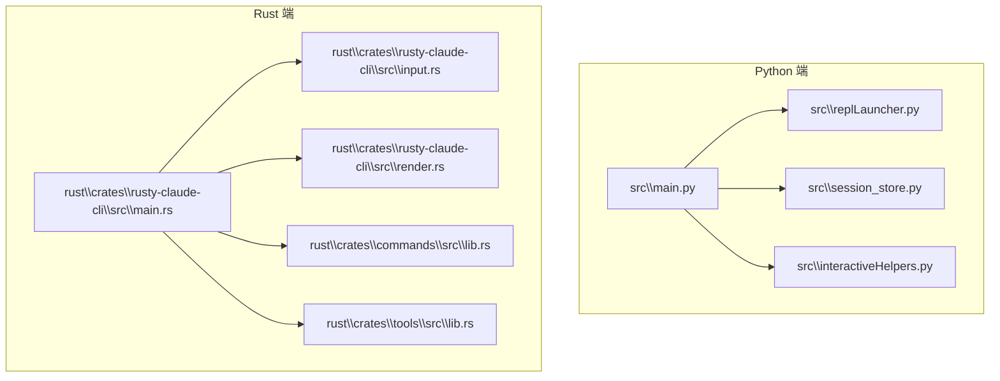
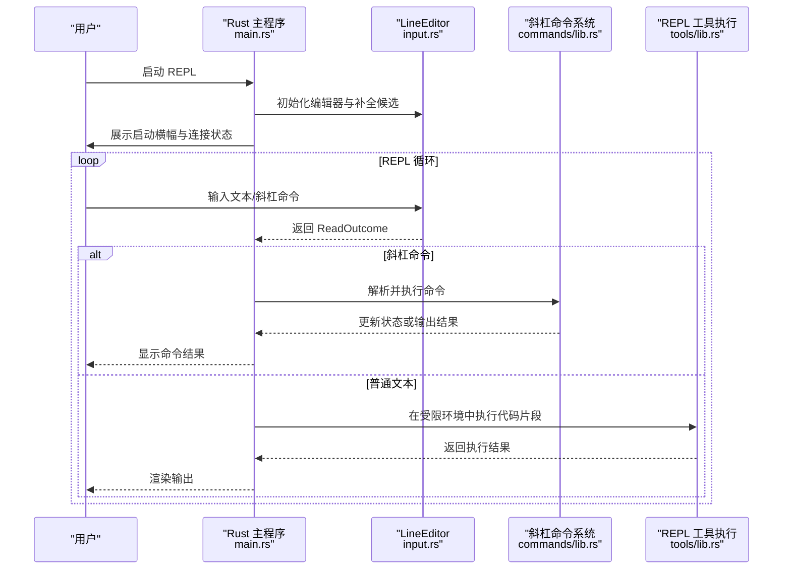
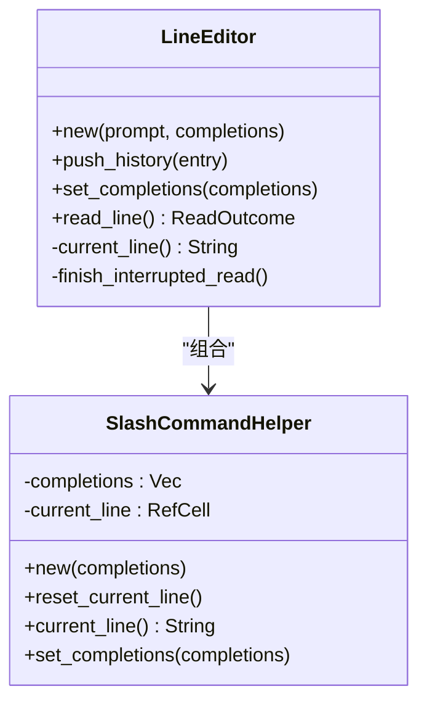
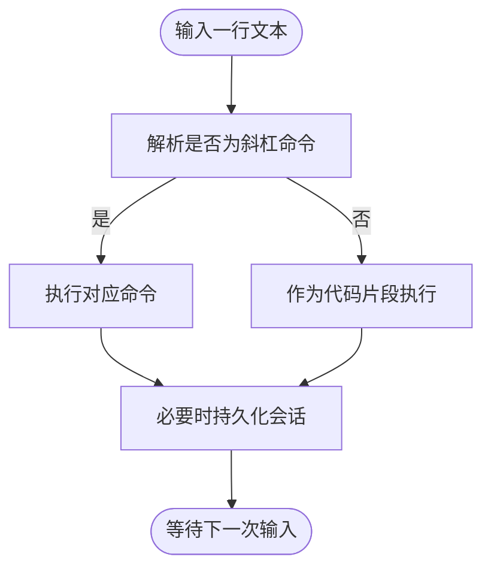
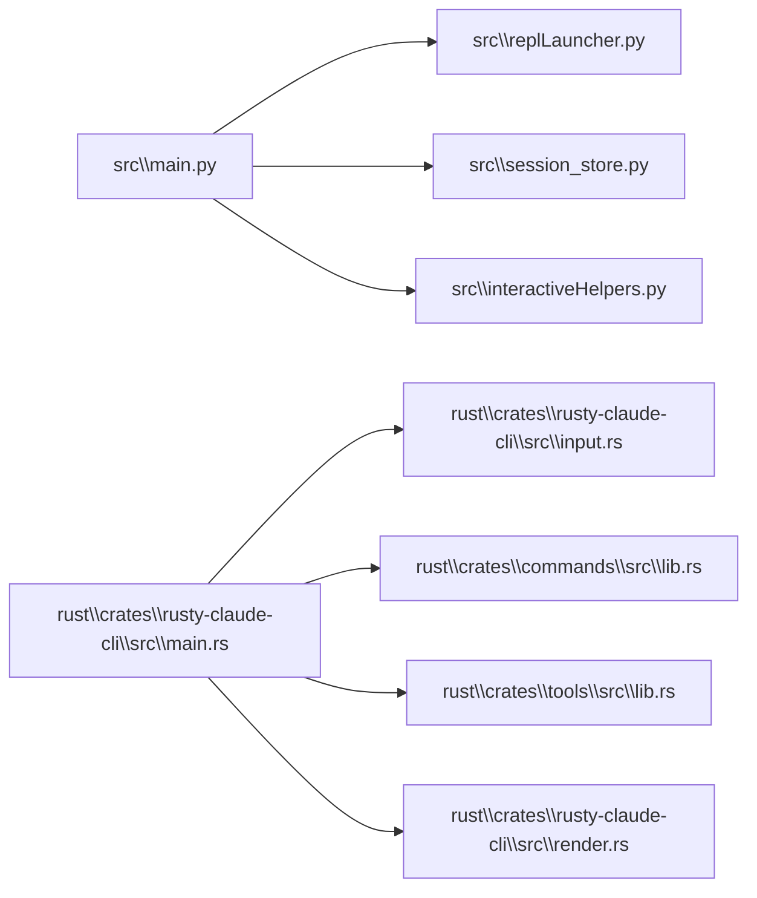

# 交互式 REPL

<cite>
**本文引用的文件**
- [src\replLauncher.py](file://src\replLauncher.py)
- [src\interactiveHelpers.py](file://src\interactiveHelpers.py)
- [src\main.py](file://src\main.py)
- [src\session_store.py](file://src\session_store.py)
- [rust\crates\rusty-claude-cli\src\main.rs](file://rust\crates\rusty-claude-cli\src\main.rs)
- [rust\crates\rusty-claude-cli\src\input.rs](file://rust\crates\rusty-claude-cli\src\input.rs)
- [rust\crates\rusty-claude-cli\src\render.rs](file://rust\crates\rusty-claude-cli\src\render.rs)
- [rust\crates\commands\src\lib.rs](file://rust\crates\commands\src\lib.rs)
- [rust\crates\tools\src\lib.rs](file://rust\crates\tools\src\lib.rs)
</cite>

## 目录
1. [简介](#简介)
2. [项目结构](#项目结构)
3. [核心组件](#核心组件)
4. [架构总览](#架构总览)
5. [详细组件分析](#详细组件分析)
6. [依赖关系分析](#依赖关系分析)
7. [性能考量](#性能考量)
8. [故障排除指南](#故障排除指南)
9. [结论](#结论)
10. [附录](#附录)

## 简介
本文件系统化阐述交互式 REPL（读取-求值-打印循环）模式的使用与实现细节，覆盖启动方式、键盘快捷键、命令历史、自动补全、会话管理、状态查看、实时输出显示、调试与探索性开发的最佳实践，并提供常见问题与排障建议。  
- Python 端当前仅提供 REPL 启动提示与辅助工具，实际交互式 REPL 主体由 Rust 实现。
- REPL 支持斜杠命令（/help、/status、/resume、/history 等）、历史记录导航、Tab 补全、多行输入、自动保存会话等。

## 项目结构
REPL 相关能力主要分布在以下模块：
- Python 端：启动提示与会话存取辅助
- Rust 端：REPL 循环、输入编辑器、斜杠命令解析与执行、渲染与终端交互

图表来源
- [src\main.py](file://src\main.py)
- [src\replLauncher.py](file://src\replLauncher.py)
- [src\session_store.py](file://src\session_store.py)
- [rust\crates\rusty-claude-cli\src\main.rs](file://rust\crates\rusty-claude-cli\src\main.rs)
- [rust\crates\rusty-claude-cli\src\input.rs](file://rust\crates\rusty-claude-cli\src\input.rs)
- [rust\crates\rusty-claude-cli\src\render.rs](file://rust\crates\rusty-claude-cli\src\render.rs)
- [rust\crates\commands\src\lib.rs](file://rust\crates\commands\src\lib.rs)
- [rust\crates\tools\src\lib.rs](file://rust\crates\tools\src\lib.rs)

章节来源
- [src\main.py](file://src\main.py)
- [src\replLauncher.py](file://src\replLauncher.py)
- [src\session_store.py](file://src\session_store.py)
- [rust\crates\rusty-claude-cli\src\main.rs](file://rust\crates\rusty-claude-cli\src\main.rs)
- [rust\crates\rusty-claude-cli\src\input.rs](file://rust\crates\rusty-claude-cli\src\input.rs)
- [rust\crates\rusty-claude-cli\src\render.rs](file://rust\crates\rusty-claude-cli\src\render.rs)
- [rust\crates\commands\src\lib.rs](file://rust\crates\commands\src\lib.rs)
- [rust\crates\tools\src\lib.rs](file://rust\crates\tools\src\lib.rs)

## 核心组件
- REPL 启动与循环
  - Rust 主程序负责进入 REPL 循环，初始化编辑器、展示横幅与连接状态，持续读取用户输入并分发处理。
  - 关键路径：[repl 启动与主循环:3056-3084](file://rust\crates\rusty-claude-cli\src\main.rs#L3056-L3084)
- 输入编辑器（LineEditor）
  - 基于 rustyline，支持历史记录、Tab 补全、多行输入（Shift+Enter/Ctrl+J）、中断处理（Ctrl+C）等。
  - 关键路径：[LineEditor 定义与行为:101-198](file://rust\crates\rusty-claude-cli\src\input.rs#L101-L198)
- 斜杠命令系统
  - 内置命令清单与帮助生成，支持 /help、/status、/resume、/history、/sandbox、/model、/permissions、/clear、/cost、/config、/mcp、/memory、/init、/diff、/version 等。
  - 关键路径：[斜杠命令规范与帮助:59-200](file://rust\crates\commands\src\lib.rs#L59-L200)
- 会话管理与持久化
  - Python 端提供会话存取接口；Rust 端提供自动保存与加载、会话列表与切换、清理确认等。
  - 关键路径：[Python 会话存取:19-36](file://src\session_store.py#L19-L36)，[Rust 会话操作与帮助:4850-4871](file://rust\crates\rusty-claude-cli\src\main.rs#L4850-L4871)
- 实时输出与渲染
  - 终端渲染器支持进度动画、高亮、表格与 Markdown 渲染，提升 REPL 输出可读性。
  - 关键路径：[渲染器与动画:48-116](file://rust\crates\rusty-claude-cli\src\render.rs#L48-L116)
- REPL 工具执行
  - 支持在 REPL 中直接运行 Python/JavaScript/Shell 代码片段，带超时控制与结果返回。
  - 关键路径：[REPL 执行与运行时解析:5486-5564](file://rust\crates\tools\src\lib.rs#L5486-L5564)

章节来源
- [rust\crates\rusty-claude-cli\src\main.rs:3056-3084](file://rust\crates\rusty-claude-cli\src\main.rs#L3056-L3084)
- [rust\crates\rusty-claude-cli\src\input.rs:101-198](file://rust\crates\rusty-claude-cli\src\input.rs#L101-L198)
- [rust\crates\commands\src\lib.rs:59-200](file://rust\crates\commands\src\lib.rs#L59-L200)
- [src\session_store.py:19-36](file://src\session_store.py#L19-L36)
- [rust\crates\rusty-claude-cli\src\render.rs:48-116](file://rust\crates\rusty-claude-cli\src\render.rs#L48-L116)
- [rust\crates\tools\src\lib.rs:5486-5564](file://rust\crates\tools\src\lib.rs#L5486-L5564)

## 架构总览
REPL 的运行时交互流程如下：

图表来源
- [rust\crates\rusty-claude-cli\src\main.rs:3056-3084](file://rust\crates\rusty-claude-cli\src\main.rs#L3056-L3084)
- [rust\crates\rusty-claude-cli\src\input.rs:101-198](file://rust\crates\rusty-claude-cli\src\input.rs#L101-L198)
- [rust\crates\commands\src\lib.rs](file://rust\crates\commands\src\lib.rs)
- [rust\crates\tools\src\lib.rs](file://rust\crates\tools\src\lib.rs)

## 详细组件分析

### REPL 启动与循环
- 启动流程
  - 解析模型、权限、工具限制等参数，初始化 LiveCli。
  - 创建 LineEditor 并设置补全候选，打印启动横幅与连接状态。
  - 进入主循环，根据输入类型分派到斜杠命令或工具执行。
- 关键路径
  - [repl 启动与主循环:3056-3084](file://rust\crates\rusty-claude-cli\src\main.rs#L3056-L3084)

章节来源
- [rust\crates\rusty-claude-cli\src\main.rs:3056-3084](file://rust\crates\rusty-claude-cli\src\main.rs#L3056-L3084)

### 输入编辑器（LineEditor）
- 功能特性
  - 历史记录：支持上下键浏览，空行不入历史。
  - 补全：仅对以“/”开头的斜杠命令进行补全，去重与规范化。
  - 多行输入：Shift+Enter 或 Ctrl+J 插入换行。
  - 中断处理：Ctrl+C 清空输入；EOF/中断退出 REPL。
- 关键路径
  - [LineEditor 结构与方法:101-198](file://rust\crates\rusty-claude-cli\src\input.rs#L101-L198)
  - [斜杠命令前缀提取与补全:200-220](file://rust\crates\rusty-claude-cli\src\input.rs#L200-L220)

图表来源
- [rust\crates\rusty-claude-cli\src\input.rs:101-198](file://rust\crates\rusty-claude-cli\src\input.rs#L101-L198)

章节来源
- [rust\crates\rusty-claude-cli\src\input.rs:101-198](file://rust\crates\rusty-claude-cli\src\input.rs#L101-L198)

### 斜杠命令系统
- 命令清单与语义
  - /help：显示命令帮助。
  - /status：显示当前会话状态快照。
  - /sandbox：显示沙箱隔离状态。
  - /compact：压缩本地会话历史。
  - /model [model]：查看或切换模型。
  - /permissions [mode]：查看或切换权限模式。
  - /clear [--confirm]：清空当前会话。
  - /cost：显示累计 token 使用量。
  - /resume <session-path>：加载已保存会话。
  - /config [env|hooks|model|plugins]：查看配置。
  - /mcp [list|show <server>|help]：查看 MCP 服务器。
  - /memory：查看指令记忆文件。
  - /init：为仓库生成 CLAUDE.md 起始模板。
  - /diff：显示工作区变更的 git diff。
  - /version：显示版本与构建信息。
  - /history [count]：显示提示词历史。
- 帮助生成与过滤
  - 提供分类化的帮助输出，包含键盘快捷键说明。
- 关键路径
  - [斜杠命令规范与帮助:59-200](file://rust\crates\commands\src\lib.rs#L59-L200)
  - [REPL 帮助文本:4850-4871](file://rust\crates\rusty-claude-cli\src\main.rs#L4850-L4871)

图表来源
- [rust\crates\commands\src\lib.rs:59-200](file://rust\crates\commands\src\lib.rs#L59-L200)
- [rust\crates\rusty-claude-cli\src\main.rs:3056-3084](file://rust\crates\rusty-claude-cli\src\main.rs#L3056-L3084)

章节来源
- [rust\crates\commands\src\lib.rs:59-200](file://rust\crates\commands\src\lib.rs#L59-L200)
- [rust\crates\rusty-claude-cli\src\main.rs:4850-4871](file://rust\crates\rusty-claude-cli\src\main.rs#L4850-L4871)

### 会话管理与状态查看
- 自动保存
  - REPL 会话自动保存至 .claw/sessions/<session-id>.jsonl，支持 /resume latest 快速恢复最新会话。
- 会话加载与查看
  - Python 端提供 load-session 接口用于读取已保存会话的基本信息。
- 状态快照
  - /status 命令输出当前模型、权限、分支、工作区、目录、会话 ID、会话路径等信息。
- 关键路径
  - [REPL 帮助中的自动保存与恢复说明:4850-4871](file://rust\crates\rusty-claude-cli\src\main.rs#L4850-L4871)
  - [Python 会话加载:27-36](file://src\session_store.py#L27-L36)

章节来源
- [src\session_store.py:27-36](file://src\session_store.py#L27-L36)
- [rust\crates\rusty-claude-cli\src\main.rs:4850-4871](file://rust\crates\rusty-claude-cli\src\main.rs#L4850-L4871)

### 实时输出显示与渲染
- 渲染器能力
  - 进度动画（Spinner）、高亮、表格与 Markdown 渲染，改善 REPL 输出体验。
- 关键路径
  - [渲染器与动画:48-116](file://rust\crates\rusty-claude-cli\src\render.rs#L48-L116)

章节来源
- [rust\crates\rusty-claude-cli\src\render.rs:48-116](file://rust\crates\rusty-claude-cli\src\render.rs#L48-L116)

### REPL 中的调试、测试与探索性开发
- 在 REPL 中直接执行 Python/JavaScript/Shell 代码片段，适合快速验证想法与小规模实验。
- 可通过 /history 查看最近提示词，结合 /sandbox、/diff、/config 等命令检查环境与配置。
- 使用 /clear 清理会话后重新开始，或用 /resume 切换到其他会话进行对比。

章节来源
- [rust\crates\tools\src\lib.rs:5486-5564](file://rust\crates\tools\src\lib.rs#L5486-L5564)
- [rust\crates\commands\src\lib.rs:59-200](file://rust\crates\commands\src\lib.rs#L59-L200)

## 依赖关系分析
- Python 端
  - main.py 提供命令子集与会话加载入口，replLauncher.py 当前仅返回提示信息，interactiveHelpers.py 提供简单格式化工具，session_store.py 提供会话存取。
- Rust 端
  - main.rs 作为 REPL 入口，依赖 input.rs（编辑器）、commands/lib.rs（命令系统）、tools/lib.rs（REPL 工具）、render.rs（渲染器）。

图表来源
- [src\main.py](file://src\main.py)
- [src\replLauncher.py](file://src\replLauncher.py)
- [src\session_store.py](file://src\session_store.py)
- [rust\crates\rusty-claude-cli\src\main.rs](file://rust\crates\rusty-claude-cli\src\main.rs)
- [rust\crates\rusty-claude-cli\src\input.rs](file://rust\crates\rusty-claude-cli\src\input.rs)
- [rust\crates\commands\src\lib.rs](file://rust\crates\commands\src\lib.rs)
- [rust\crates\tools\src\lib.rs](file://rust\crates\tools\src\lib.rs)
- [rust\crates\rusty-claude-cli\src\render.rs](file://rust\crates\rusty-claude-cli\src\render.rs)

章节来源
- [src\main.py](file://src\main.py)
- [src\replLauncher.py](file://src\replLauncher.py)
- [src\session_store.py](file://src\session_store.py)
- [rust\crates\rusty-claude-cli\src\main.rs](file://rust\crates\rusty-claude-cli\src\main.rs)
- [rust\crates\rusty-claude-cli\src\input.rs](file://rust\crates\rusty-claude-cli\src\input.rs)
- [rust\crates\commands\src\lib.rs](file://rust\crates\commands\src\lib.rs)
- [rust\crates\tools\src\lib.rs](file://rust\crates\tools\src\lib.rs)
- [rust\crates\rusty-claude-cli\src\render.rs](file://rust\crates\rusty-claude-cli\src\render.rs)

## 性能考量
- REPL 工具执行默认启用超时保护，避免长时间阻塞影响交互体验。
- 建议：
  - 对可能耗时的代码片段设置合理超时。
  - 使用 /compact 压缩会话历史，减少加载时间。
  - 使用 /history 限制显示数量，避免输出过长导致滚动困难。

章节来源
- [rust\crates\tools\src\lib.rs:5486-5564](file://rust\crates\tools\src\lib.rs#L5486-L5564)
- [rust\crates\commands\src\lib.rs:59-200](file://rust\crates\commands\src\lib.rs#L59-L200)

## 故障排除指南
- REPL 无法启动或提示“Python porting REPL is not interactive yet”
  - 说明：Python 端当前未实现交互式 REPL，需使用 Rust 版本。
  - 参考：[REPL 启动提示:4-6](file://src\replLauncher.py#L4-L6)
- 无法找到 Python/Node/Bash 运行时
  - REPL 执行需要相应语言运行时，请确保已安装并可在 PATH 中找到。
  - 参考：[运行时解析与错误提示:5545-5564](file://rust\crates\tools\src\lib.rs#L5545-L5564)
- REPL 执行超时
  - 默认超时触发时会返回错误信息，可适当调整超时阈值或优化代码。
  - 参考：[超时控制与错误返回:5500-5522](file://rust\crates\tools\src\lib.rs#L5500-L5522)
- 空代码或不支持的语言
  - 空代码会被拒绝；不支持的语言会报错。
  - 参考：[输入校验与错误处理:5486-5564](file://rust\crates\tools\src\lib.rs#L5486-L5564)
- 历史记录与补全异常
  - 确认输入以“/”开头的斜杠命令；非斜杠命令不会参与补全。
  - 参考：[补全与前缀提取:200-220](file://rust\crates\rusty-claude-cli\src\input.rs#L200-L220)

章节来源
- [src\replLauncher.py:4-6](file://src\replLauncher.py#L4-L6)
- [rust\crates\tools\src\lib.rs:5486-5564](file://rust\crates\tools\src\lib.rs#L5486-L5564)
- [rust\crates\rusty-claude-cli\src\input.rs:200-220](file://rust\crates\rusty-claude-cli\src\input.rs#L200-L220)

## 结论
- REPL 提供了完整的交互式开发体验：从输入编辑、命令分发到工具执行与会话管理，均围绕易用性与安全性设计。
- 建议优先使用 Rust 版本的 REPL，配合斜杠命令与自动保存机制，开展调试、测试与探索性开发。
- 遇到问题时，可借助 /help、/status、/history、/sandbox 等命令快速定位与诊断。

## 附录

### 键盘快捷键与常用命令速查
- 快捷键
  - Up/Down：浏览提示词历史
  - Ctrl-R：反向搜索历史
  - Tab：补全命令、模式与最近会话
  - Ctrl-C：清空输入（空输入时退出）
  - Shift+Enter / Ctrl+J：插入换行
- 常用命令
  - /help：命令帮助
  - /status：状态快照
  - /resume latest：恢复最新会话
  - /history [count]：查看最近提示词
  - /sandbox：沙箱状态
  - /model /permissions /clear /cost /config /mcp /memory /init /diff /version

章节来源
- [rust\crates\rusty-claude-cli\src\main.rs:4850-4871](file://rust\crates\rusty-claude-cli\src\main.rs#L4850-L4871)
- [rust\crates\commands\src\lib.rs:59-200](file://rust\crates\commands\src\lib.rs#L59-L200)