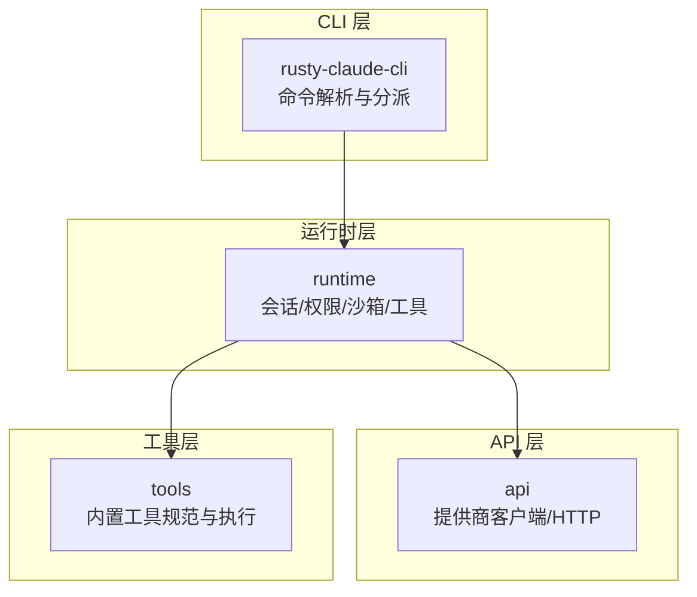
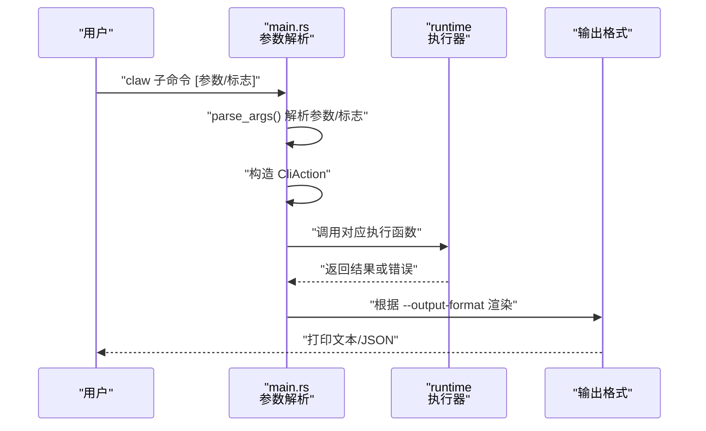
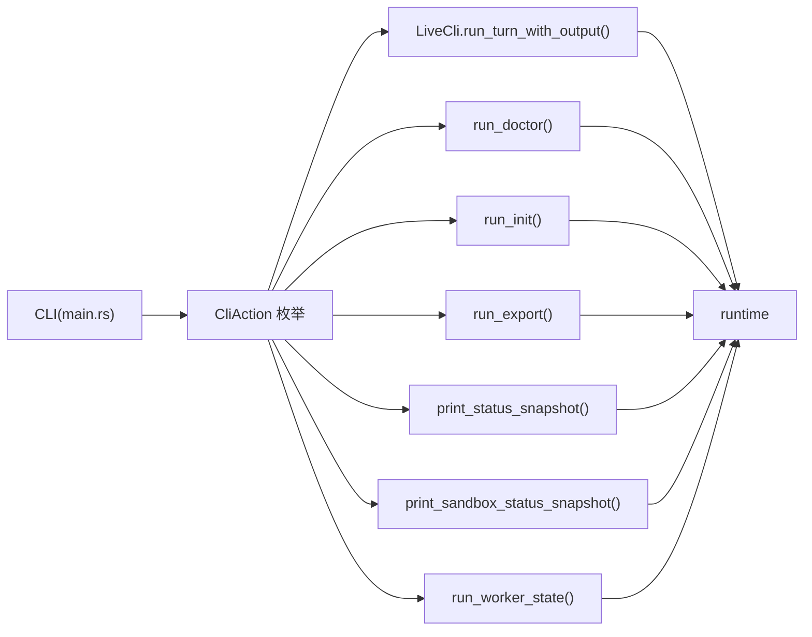

# 基础命令

<cite>
**本文引用的文件**
- [README.md](file://README.md)
- [USAGE.md](file://USAGE.md)
- [Cargo.toml](file://rust/Cargo.toml)
- [main.rs](file://rust/crates/rusty-claude-cli/src/main.rs)
- [init.rs](file://rust/crates/rusty-claude-cli/src/init.rs)
- [lib.rs（runtime）](file://rust/crates/runtime/src/lib.rs)
- [output_format_contract.rs](file://rust/crates/rusty-claude-cli/tests/output_format_contract.rs)
</cite>

## 目录
1. [简介](#简介)
2. [项目结构](#项目结构)
3. [核心组件](#核心组件)
4. [架构总览](#架构总览)
5. [详细组件分析](#详细组件分析)
6. [依赖分析](#依赖分析)
7. [性能考虑](#性能考虑)
8. [故障排查指南](#故障排查指南)
9. [结论](#结论)
10. [附录](#附录)

## 简介
本文件聚焦于 claw CLI 的“基础命令”，覆盖最常用的子命令与单字母别名：prompt、init、export、doctor、status、sandbox、state、version。内容包括：
- 完整语法与参数/标志说明
- 执行流程与输出格式
- 错误处理与 JSON 输出契约
- 最佳实践与常见组合用法
- 实际使用场景与示例路径

## 项目结构
- CLI 主体位于 Rust 工作区的 rusty-claude-cli crate，入口解析参数并分派到具体动作。
- 运行时能力由 runtime crate 提供，包括会话、权限、沙箱、工具执行等。
- 使用文档与快速上手见 USAGE.md；仓库根 README 指引构建与认证。

图表来源
- [Cargo.toml:1-23](file://rust/Cargo.toml#L1-L23)
- [lib.rs（runtime）:1-180](file://rust/crates/runtime/src/lib.rs#L1-L180)

章节来源
- [Cargo.toml:1-23](file://rust/Cargo.toml#L1-L23)
- [README.md:31-70](file://README.md#L31-L70)

## 核心组件
- 命令解析与分派：根据参数识别子命令、单字母别名、帮助主题与版本信息，并构造 CliAction。
- 运行时执行：根据 CliAction 调用相应函数（如 run_doctor、run_init、run_export、print_status_snapshot、print_sandbox_status_snapshot、run_worker_state），并与 runtime 交互。
- 输出格式：支持文本与 JSON 两种输出；JSON 用于脚本化与自动化集成。
- 错误处理：统一捕获异常并在文本模式输出人类可读错误，在 JSON 模式输出结构化错误对象；失败时进程退出码非零。

章节来源
- [main.rs:110-139](file://rust/crates/rusty-claude-cli/src/main.rs#L110-L139)
- [main.rs:180-277](file://rust/crates/rusty-claude-cli/src/main.rs#L180-L277)
- [output_format_contract.rs:1-41](file://rust/crates/rusty-claude-cli/tests/output_format_contract.rs#L1-L41)

## 架构总览
以下序列图展示了 CLI 参数到执行与输出的整体流程。

图表来源
- [main.rs:180-277](file://rust/crates/rusty-claude-cli/src/main.rs#L180-L277)
- [main.rs:110-139](file://rust/crates/rusty-claude-cli/src/main.rs#L110-L139)

## 详细组件分析

### 命令：prompt
- 用途：一次性对话（非 REPL）。可直接传入提示词，或通过 -p 快捷方式。
- 语法
  - claw prompt "<提示词>"
  - claw -p "<提示词>"
- 关键参数与标志
  - --model <模型别名或名称>
  - --output-format <text|json>
  - --permission-mode <read-only|workspace-write|danger-full-access>
  - --dangerously-skip-permissions
  - --allowed-tools <工具名[,工具名...]>
  - --allowedTools <同上>
  - --compact
  - --base-commit <提交哈希或引用>
  - --reasoning-effort <low|medium|high>
  - --allow-broad-cwd
  - -p 快捷传参（与 prompt 子命令等价）
- 行为说明
  - 若 stdin 非终端且未显式传入提示词，则从管道读取作为上下文拼接至提示词后方。
  - 在危险全权限模式下，允许从管道注入上下文；其他模式下保留 stdin 以供交互确认。
  - 支持推理努力级别与工作目录放宽策略。
- 输出
  - 文本模式：流式渲染或最终响应摘要。
  - JSON 模式：结构化输出，便于下游解析。
- 错误处理
  - 缺少提示词时报错；未知选项给出建议；JSON 模式下以结构化错误对象输出。
- 示例路径
  - [README.md:68-70](file://README.md#L68-L70)
  - [USAGE.md:53-72](file://USAGE.md#L53-L72)

章节来源
- [main.rs:222-249](file://rust/crates/rusty-claude-cli/src/main.rs#L222-L249)
- [main.rs:392-707](file://rust/crates/rusty-claude-cli/src/main.rs#L392-L707)
- [main.rs:110-139](file://rust/crates/rusty-claude-cli/src/main.rs#L110-L139)

### 命令：init
- 用途：初始化项目根目录，生成 .claw/、.claw.json、.gitignore 条目与 CLAUDE.md。
- 语法
  - claw init
- 行为说明
  - 若目标文件已存在则跳过；.gitignore 会追加必要条目而不破坏已有内容。
  - 生成的 CLAUDE.md 会基于仓库特征（语言、框架等）给出验证与结构建议。
- 输出
  - 文本模式：逐项报告创建/更新/跳过状态。
  - JSON 模式：结构化报告（测试契约验证）。
- 示例路径
  - [init.rs:80-112](file://rust/crates/rusty-claude-cli/src/init.rs#L80-L112)
  - [init.rs:162-217](file://rust/crates/rusty-claude-cli/src/init.rs#L162-L217)

章节来源
- [main.rs:252-252](file://rust/crates/rusty-claude-cli/src/main.rs#L252-L252)
- [main.rs:5369-5369](file://rust/crates/rusty-claude-cli/src/main.rs#L5369-L5369)
- [init.rs:80-112](file://rust/crates/rusty-claude-cli/src/init.rs#L80-L112)
- [output_format_contract.rs:1-41](file://rust/crates/rusty-claude-cli/tests/output_format_contract.rs#L1-L41)

### 命令：export
- 用途：导出会话记录到文件，支持指定会话引用与输出路径。
- 语法
  - claw export <会话引用> [--output-path <路径>] [--output-format <text|json>]
- 行为说明
  - 会话引用通常为最新会话标识；可结合 --output-path 指定导出文件。
- 输出
  - 文本/JSON 两种格式，遵循统一契约。
- 示例路径
  - [USAGE.md:308-318](file://USAGE.md#L308-L318)
  - [main.rs:257-257](file://rust/crates/rusty-claude-cli/src/main.rs#L257-L257)

章节来源
- [main.rs:257-257](file://rust/crates/rusty-claude-cli/src/main.rs#L257-L257)
- [main.rs:5957-5957](file://rust/crates/rusty-claude-cli/src/main.rs#L5957-L5957)

### 命令：doctor
- 用途：本地健康检查，诊断认证、配置、工作区、沙箱与构建元数据。
- 语法
  - claw doctor [--output-format <text|json>]
- 行为说明
  - 不发起上游请求，仅做本地诊断；若存在失败项，进程退出码非零。
- 输出
  - 文本模式：人类可读报告；JSON 模式：结构化诊断结果。
- 示例路径
  - [README.md:66-66](file://README.md#L66-L66)
  - [USAGE.md:3-17](file://USAGE.md#L3-L17)
  - [main.rs:250-250](file://rust/crates/rusty-claude-cli/src/main.rs#L250-L250)
  - [main.rs:1491-1504](file://rust/crates/rusty-claude-cli/src/main.rs#L1491-L1504)

章节来源
- [main.rs:1491-1504](file://rust/crates/rusty-claude-cli/src/main.rs#L1491-L1504)
- [main.rs:5158-5179](file://rust/crates/rusty-claude-cli/src/main.rs#L5158-L5179)

### 命令：status
- 用途：在不进入 REPL 的情况下，打印当前工作区快照（模型、权限、Git 状态、配置文件、沙箱状态等）。
- 语法
  - claw status [--output-format <text|json>]
- 行为说明
  - 输出包含模型、权限模式、Git 分支/摘要、发现的配置文件数量、内存指令文件数、沙箱状态等。
- 输出
  - 文本/JSON 两种格式。
- 示例路径
  - [USAGE.md:296-306](file://USAGE.md#L296-L306)
  - [main.rs:216-220](file://rust/crates/rusty-claude-cli/src/main.rs#L216-L220)
  - [main.rs:4872-4872](file://rust/crates/rusty-claude-cli/src/main.rs#L4872-L4872)

章节来源
- [main.rs:4872-4872](file://rust/crates/rusty-claude-cli/src/main.rs#L4872-L4872)
- [main.rs:5158-5179](file://rust/crates/rusty-claude-cli/src/main.rs#L5158-L5179)

### 命令：sandbox
- 用途：查看当前目录的沙箱与隔离状态（命名空间、网络、文件系统、回退原因等）。
- 语法
  - claw sandbox [--output-format <text|json>]
- 行为说明
  - 读取运行时配置并解析沙箱状态，输出启用/激活/受支持/文件系统模式等信息。
- 输出
  - 文本/JSON 两种格式。
- 示例路径
  - [USAGE.md:296-306](file://USAGE.md#L296-L306)
  - [main.rs:221-221](file://rust/crates/rusty-claude-cli/src/main.rs#L221-L221)
  - [main.rs:5119-5119](file://rust/crates/rusty-claude-cli/src/main.rs#L5119-L5119)

章节来源
- [main.rs:5119-5119](file://rust/crates/rusty-claude-cli/src/main.rs#L5119-L5119)
- [main.rs:5158-5179](file://rust/crates/rusty-claude-cli/src/main.rs#L5158-L5179)

### 命令：state
- 用途：读取并打印 .claw/worker-state.json 文件内容，用于外部观察者轮询 Worker 状态。
- 语法
  - claw state
- 行为说明
  - 若不存在状态文件，返回错误并退出码非零；否则打印状态。
- 输出
  - 文本模式：状态内容；JSON 模式：结构化输出（测试契约验证）。
- 示例路径
  - [main.rs:251-251](file://rust/crates/rusty-claude-cli/src/main.rs#L251-L251)
  - [main.rs:1515-1524](file://rust/crates/rusty-claude-cli/src/main.rs#L1515-L1524)

章节来源
- [main.rs:1515-1524](file://rust/crates/rusty-claude-cli/src/main.rs#L1515-L1524)
- [output_format_contract.rs:1-41](file://rust/crates/rusty-claude-cli/tests/output_format_contract.rs#L1-L41)

### 命令：version
- 用途：打印版本信息。
- 语法
  - claw version [--output-format <text|json>]
- 行为说明
  - JSON 模式下输出包含版本字段的结构化对象。
- 输出
  - 文本/JSON 两种格式。
- 示例路径
  - [main.rs:210-210](file://rust/crates/rusty-claude-cli/src/main.rs#L210-L210)
  - [output_format_contract.rs:25-33](file://rust/crates/rusty-claude-cli/tests/output_format_contract.rs#L25-L33)

章节来源
- [main.rs:210-210](file://rust/crates/rusty-claude-cli/src/main.rs#L210-L210)
- [output_format_contract.rs:25-33](file://rust/crates/rusty-claude-cli/tests/output_format_contract.rs#L25-L33)

### 单字母别名与帮助主题
- 单字母别名
  - status → claw status
  - sandbox → claw sandbox
  - doctor → claw doctor
  - state → claw state
  - version → claw version
- 帮助主题
  - claw status --help
  - claw sandbox --help
  - claw doctor --help

章节来源
- [main.rs:737-750](file://rust/crates/rusty-claude-cli/src/main.rs#L737-L750)
- [main.rs:709-721](file://rust/crates/rusty-claude-cli/src/main.rs#L709-L721)
- [main.rs:5158-5179](file://rust/crates/rusty-claude-cli/src/main.rs#L5158-L5179)

## 依赖分析
- CLI 与运行时的耦合
  - CLI 通过 CliAction 将高层意图传递给运行时；运行时负责会话、权限、沙箱与工具执行。
- 外部依赖
  - HTTP 客户端与提供商适配在 api crate 中实现；工具在 tools crate 中定义与执行。
- 错误传播
  - CLI 捕获错误并按输出格式进行渲染；JSON 模式下保持一致的错误结构，便于脚本解析。

图表来源
- [main.rs:216-257](file://rust/crates/rusty-claude-cli/src/main.rs#L216-L257)
- [lib.rs（runtime）:1-180](file://rust/crates/runtime/src/lib.rs#L1-L180)

章节来源
- [main.rs:216-257](file://rust/crates/rusty-claude-cli/src/main.rs#L216-L257)
- [lib.rs（runtime）:1-180](file://rust/crates/runtime/src/lib.rs#L1-L180)

## 性能考虑
- 输出格式选择
  - JSON 适合自动化流水线，减少解析成本；文本模式更易阅读。
- 权限模式影响
  - 交互式权限确认会占用 stdin，谨慎在管道场景使用需要交互的模式。
- 推理努力与工具限制
  - 合理设置 --reasoning-effort 与 --allowed-tools 可降低请求复杂度与等待时间。
- 沙箱状态
  - 沙箱降级或回退可能影响 I/O 性能，可通过 claw sandbox 与 doctor 检查。

## 故障排查指南
- JSON 输出一致性
  - 当 --output-format json 时，错误将以结构化对象输出，便于脚本解析与失败检测。
- doctor 失败
  - 若 doctor 报告失败项，需先修复认证、配置或沙箱问题后再继续。
- 管道输入
  - 在需要交互确认的权限模式下，管道输入会被保留以供交互确认；在危险全权限模式下才会自动注入管道内容。
- 版本与兼容性
  - 使用 version 确认二进制版本；避免使用已弃用的安装方式。

章节来源
- [main.rs:110-139](file://rust/crates/rusty-claude-cli/src/main.rs#L110-L139)
- [main.rs:1491-1504](file://rust/crates/rusty-claude-cli/src/main.rs#L1491-L1504)
- [main.rs:236-249](file://rust/crates/rusty-claude-cli/src/main.rs#L236-L249)

## 结论
- 基础命令覆盖了从健康检查、状态概览、沙箱诊断到一次性对话与初始化导出的核心场景。
- 统一的参数解析与输出格式契约使 CLI 易于在脚本与 CI 中集成。
- 建议优先使用 doctor 与 status/sandbox 作为日常排障与环境确认的起点。

## 附录
- 常见组合用法
  - 健康检查：claw doctor
  - 快速概览：claw status
  - 沙箱诊断：claw sandbox
  - 一次性任务：claw prompt "<任务描述>" 或 claw -p "<任务描述>"
  - 初始化项目：claw init
  - 导出会话：claw export latest --output-path ./out.jsonl
  - 观察 Worker：claw state
  - 查看版本：claw version
- 示例路径
  - [README.md:66-70](file://README.md#L66-L70)
  - [USAGE.md:3-17](file://USAGE.md#L3-L17)
  - [USAGE.md:296-318](file://USAGE.md#L296-L318)