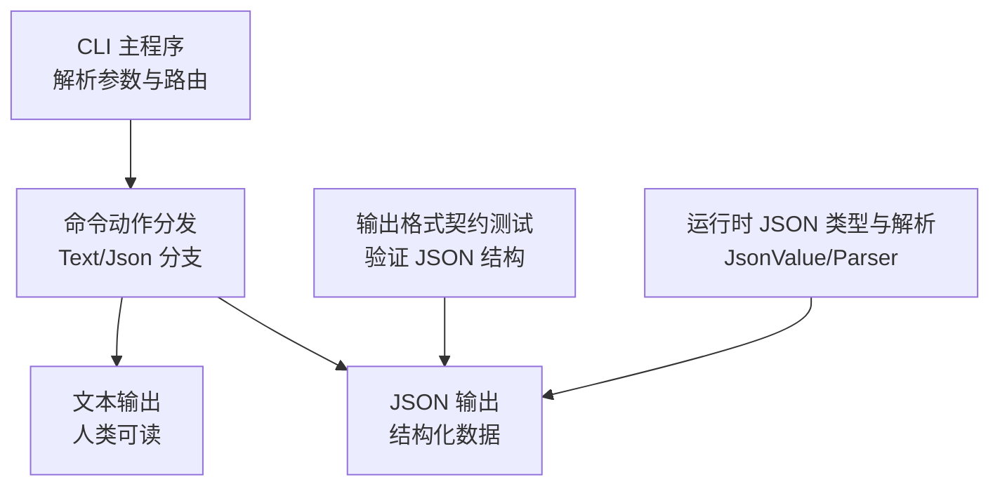
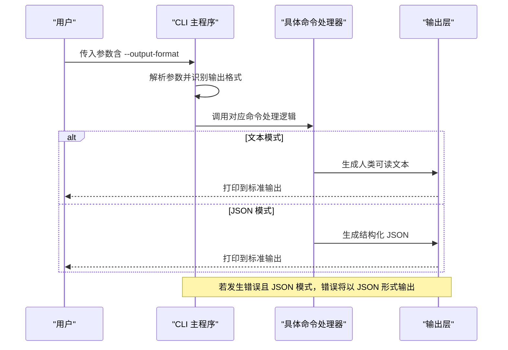
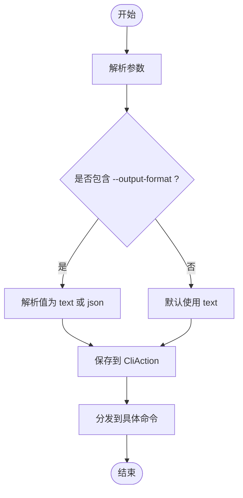
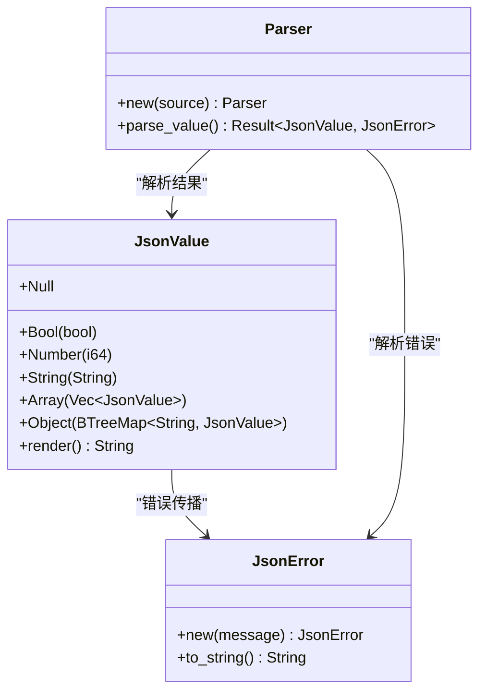
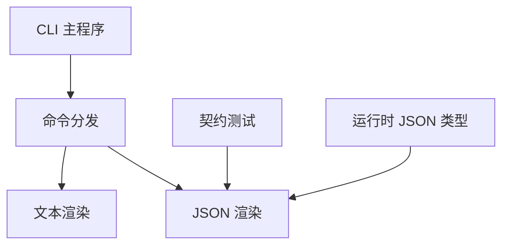

# 输出格式

<cite>
**本文引用的文件**
- [main.rs](file://rust/crates/rusty-claude-cli/src/main.rs)
- [output_format_contract.rs](file://rust/crates/rusty-claude-cli/tests/output_format_contract.rs)
- [commands/lib.rs](file://rust/crates/commands/src/lib.rs)
- [runtime/json.rs](file://rust/crates/runtime/src/json.rs)
- [runtime/mcp_server.rs](file://rust/crates/runtime/src/mcp_server.rs)
</cite>

## 目录
1. [简介](#简介)
2. [项目结构与定位](#项目结构与定位)
3. [核心组件与数据模型](#核心组件与数据模型)
4. [架构总览](#架构总览)
5. [详细组件分析](#详细组件分析)
6. [依赖关系分析](#依赖关系分析)
7. [性能与可扩展性](#性能与可扩展性)
8. [故障排查指南](#故障排查指南)
9. [结论](#结论)
10. [附录：最佳实践与用法示例](#附录最佳实践与用法示例)

## 简介
本文档系统化阐述命令行工具中的“输出格式”能力，重点覆盖 --output-format 选项的两种模式：text（文本）与 json（JSON）。我们将从设计目标、数据结构、错误处理、自动化脚本解析、以及最佳实践等维度，给出完整说明与图示。

## 项目结构与定位
- 输出格式能力由 CLI 主程序统一解析与分发，所有支持该选项的子命令都会根据当前模式选择文本或 JSON 输出。
- 测试模块提供了对关键命令在 JSON 模式下的契约验证，确保输出结构稳定一致。
- 运行时层包含通用 JSON 值类型与解析器，为复杂数据结构的序列化与反序列化提供基础。

图表来源
- [main.rs](file://rust/crates/rusty-claude-cli/src/main.rs)
- [output_format_contract.rs](file://rust/crates/rusty-claude-cli/tests/output_format_contract.rs)
- [runtime/json.rs](file://rust/crates/runtime/src/json.rs)

章节来源
- [main.rs](file://rust/crates/rusty-claude-cli/src/main.rs)
- [output_format_contract.rs](file://rust/crates/rusty-claude-cli/tests/output_format_contract.rs)
- [runtime/json.rs](file://rust/crates/runtime/src/json.rs)

## 核心组件与数据模型
- 输出格式枚举与解析
  - 枚举定义了两种模式：Text 与 Json。
  - 支持通过 --output-format text 或 --output-format json 设置；也支持短横线形式的内联值。
  - 解析失败会返回明确的错误提示，避免歧义。

- 错误输出的统一策略
  - 当启用 --output-format=json 时，错误也会以 JSON 形式输出，键名包含 type 与 error，便于下游脚本统一处理。

- 关键命令的 JSON 输出结构
  - help：包含 kind 与 message 字段。
  - version：包含 kind 与 version 字段。
  - status：包含 kind、model、permission_mode、usage、workspace、sandbox 等字段。
  - sandbox：包含 kind 与沙箱状态相关字段。
  - agents/mcp/skills：包含 kind、action、计数与列表等字段。
  - doctor/resume：包含 kind、message、summary、checks 等字段。
  - 其他命令如 dump-manifests、init、system-prompt 等亦遵循相同的 kind 字段约定。

章节来源
- [main.rs](file://rust/crates/rusty-claude-cli/src/main.rs)
- [output_format_contract.rs](file://rust/crates/rusty-claude-cli/tests/output_format_contract.rs)

## 架构总览
下图展示了参数解析、命令分发与输出分支的整体流程，以及 JSON 模式下的错误处理策略。

图表来源
- [main.rs](file://rust/crates/rusty-claude-cli/src/main.rs)

章节来源
- [main.rs](file://rust/crates/rusty-claude-cli/src/main.rs)

## 详细组件分析

### 组件一：参数解析与输出格式选择
- 功能要点
  - 支持 --output-format=text 与 --output-format=json 的显式设置。
  - 支持 --output-format=json 的内联写法（例如 --output-format=json）。
  - 解析阶段即确定后续所有命令的输出风格，保证一致性。

- 处理流程
  - 在解析阶段读取 argv，检测是否包含 --output-format 与其值。
  - 将解析结果保存在 CliAction 中，供后续命令处理使用。

图表来源
- [main.rs](file://rust/crates/rusty-claude-cli/src/main.rs)

章节来源
- [main.rs](file://rust/crates/rusty-claude-cli/src/main.rs)

### 组件二：命令输出分支（Text vs JSON）
- 文本模式
  - 面向人类阅读，采用格式化的字符串报告。
  - 适用于交互式终端与快速检查。

- JSON 模式
  - 面向自动化与集成，输出结构化数据，包含 kind 字段标识类型。
  - 便于脚本解析、日志采集与二次处理。

- 错误处理
  - 在 JSON 模式下，错误同样以 JSON 输出，包含 type 与 error 字段，便于统一捕获与处理。

章节来源
- [main.rs](file://rust/crates/rusty-claude-cli/src/main.rs)

### 组件三：关键命令的 JSON 数据结构示例与字段说明
以下为常见命令在 JSON 模式下的典型结构与字段说明（字段名称与层级均来自实际实现）：

- help
  - kind: 固定为 "help"
  - message: 帮助文本内容

- version
  - kind: 固定为 "version"
  - version: 版本号（来自构建常量）

- status
  - kind: 固定为 "status"
  - model: 当前模型名称（可能为空）
  - permission_mode: 权限模式
  - usage: 使用统计对象
    - messages: 消息数量
    - turns: 会话轮次
    - latest_total: 最新累计总 token 数
    - cumulative_input: 累计输入 token
    - cumulative_output: 累计输出 token
    - cumulative_total: 累计总 token
    - estimated_tokens: 估算 token
  - workspace: 工作区上下文对象
    - cwd: 当前工作目录
    - project_root: 项目根目录
    - git_branch: Git 分支
    - git_state: Git 状态摘要
    - changed_files/staged_files/unstaged_files/untracked_files: 文件变更统计
    - session/session_id: 会话路径与 ID
    - loaded_config_files/discovered_config_files: 配置文件加载与发现统计
    - memory_file_count: 记忆文件数量
  - sandbox: 沙箱状态对象
    - enabled/active/supported/in_container: 沙箱启用/激活/支持/容器内
    - requested_namespace/active_namespace/requested_network/active_network: 请求与激活的隔离配置
    - filesystem_mode/filesystem_active: 文件系统模式与激活状态
    - allowed_mounts/markers: 允许挂载点与容器标记
    - fallback_reason: 回退原因（可空）

- sandbox
  - kind: 固定为 "sandbox"
  - 字段同上 sandbox 对象

- agents/mcp/skills
  - kind: 固定为 "agents"/"mcp"/"skills"
  - action: 列表/操作动作
  - count/summary: 总数与摘要
  - agents/mcp/skills: 列表数组（元素包含名称、来源、活动状态等）

- doctor/resume
  - kind: 固定为 "doctor"/"status"
  - message: 文本消息
  - summary: 摘要对象（ok/warnings/failures）
  - checks: 检查项数组（每项含 name/status/summary/details）
  - workspace/sandbox: 上述对象（在 resume 模式下字段可能部分缺失）

章节来源
- [main.rs](file://rust/crates/rusty-claude-cli/src/main.rs)
- [output_format_contract.rs](file://rust/crates/rusty-claude-cli/tests/output_format_contract.rs)

### 组件四：运行时 JSON 类型与解析（支撑结构化输出）
- JsonValue
  - 提供统一的 JSON 值表示：Null、Bool、Number、String、Array、Object。
  - 支持渲染为字符串，便于序列化与调试。

- Parser
  - 提供从字符串解析 JSON 的能力，支持字面量、字符串、数组、对象与数字。
  - 错误类型 JsonError 提供清晰的错误信息。

- 应用场景
  - 作为内部数据结构，支撑复杂命令的 JSON 输出。
  - 也可用于解析外部 JSON 输入，便于脚本集成。

图表来源
- [runtime/json.rs](file://rust/crates/runtime/src/json.rs)

章节来源
- [runtime/json.rs](file://rust/crates/runtime/src/json.rs)

### 组件五：JSON-RPC 场景中的 JSON 值（与输出格式协同）
- 在 MCP 服务器等 JSON-RPC 场景中，请求与响应体同样使用结构化 JSON。
- 这与 CLI 的 JSON 输出模式相辅相成，便于统一处理与调试。

章节来源
- [runtime/mcp_server.rs](file://rust/crates/runtime/src/mcp_server.rs)

## 依赖关系分析
- CLI 主程序依赖命令分发与运行时上下文，决定输出格式后，将统一调用相应渲染函数。
- 测试模块通过执行命令并断言输出 JSON 的结构，确保契约稳定。
- 运行时 JSON 类型为结构化输出提供基础，保证字段与层级的一致性。

图表来源
- [main.rs](file://rust/crates/rusty-claude-cli/src/main.rs)
- [output_format_contract.rs](file://rust/crates/rusty-claude-cli/tests/output_format_contract.rs)
- [runtime/json.rs](file://rust/crates/runtime/src/json.rs)

章节来源
- [main.rs](file://rust/crates/rusty-claude-cli/src/main.rs)
- [output_format_contract.rs](file://rust/crates/rusty-claude-cli/tests/output_format_contract.rs)
- [runtime/json.rs](file://rust/crates/runtime/src/json.rs)

## 性能与可扩展性
- 性能特征
  - 文本模式侧重可读性，JSON 模式侧重结构化与可解析性。
  - JSON 输出通常略高于文本模式的序列化开销，但差异在命令级输出场景中可忽略。
- 可扩展性
  - 新增命令只需在对应处理器中判断输出格式并按需生成 JSON 对象。
  - 通过统一的 kind 字段与字段命名规范，保持对外接口稳定。

[本节为通用建议，无需特定文件引用]

## 故障排查指南
- 常见问题
  - 未知的 --output-format 值：解析器会返回明确错误，提示期望值为 text 或 json。
  - JSON 模式下错误输出：若命令执行失败，错误将以 JSON 形式输出，包含 type 与 error 字段，便于脚本捕获。
  - 契约不匹配：测试模块验证了 help/version/status/sandbox/agents/mcp/skills/doctor/resume 等命令的 JSON 结构，若出现字段缺失或类型不符，应优先检查对应命令的渲染逻辑。

- 排查步骤
  - 确认参数顺序与拼写正确（--output-format=json）。
  - 在脚本中先解析 JSON，再访问字段，避免直接打印原始输出。
  - 如需定位错误，可在本地以 JSON 模式运行并检查 error 字段。

章节来源
- [main.rs](file://rust/crates/rusty-claude-cli/src/main.rs)
- [output_format_contract.rs](file://rust/crates/rusty-claude-cli/tests/output_format_contract.rs)

## 结论
--output-format 提供了统一的文本与 JSON 输出能力，既满足交互式使用，又便于自动化集成。通过稳定的 JSON 结构与错误输出策略，开发者可以轻松在脚本中解析与处理命令输出，并结合测试契约保障长期兼容性。

[本节为总结，无需特定文件引用]

## 附录：最佳实践与用法示例
- 在自动化脚本中使用 JSON 输出
  - 始终显式指定 --output-format=json，确保输出结构稳定。
  - 使用 JSON 解析器读取输出，优先访问 kind 字段以区分命令类型。
  - 对于错误场景，检查 type 与 error 字段，避免直接解析文本。

- 输出重定向与管道
  - 将 JSON 输出重定向到文件以便离线分析。
  - 使用管道将命令输出传递给 jq、python -m json.tool 等工具进行过滤与格式化。

- 批处理与并发
  - 在批处理场景中，为每个任务单独指定 --output-format=json 并记录任务标识（如会话 ID 或命令行参数）。
  - 对多个命令的输出进行合并时，建议在 JSON 层添加元数据（如时间戳、任务 ID），便于溯源。

- 与运行时 JSON 类型协作
  - 对需要自定义结构的命令，可参考 JsonValue 的组织方式，确保字段层级清晰、命名一致。

章节来源
- [main.rs](file://rust/crates/rusty-claude-cli/src/main.rs)
- [output_format_contract.rs](file://rust/crates/rusty-claude-cli/tests/output_format_contract.rs)
- [runtime/json.rs](file://rust/crates/runtime/src/json.rs)