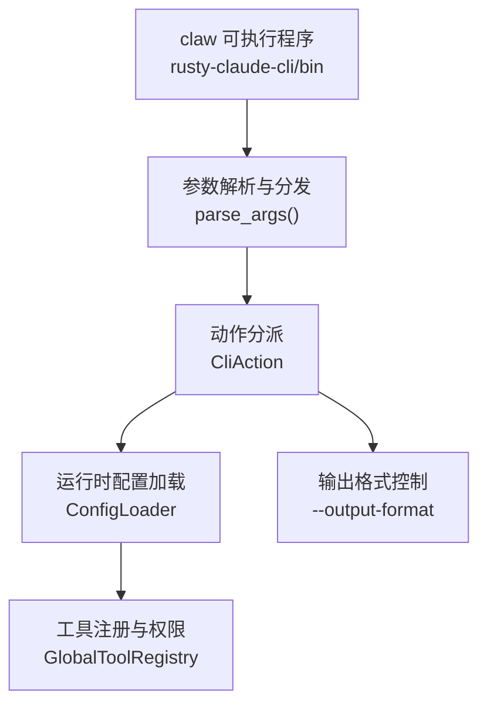
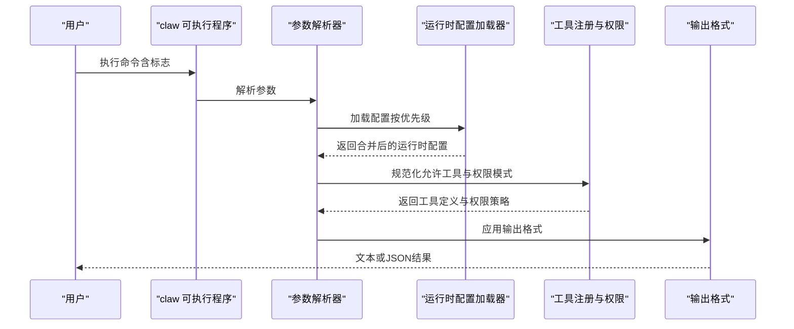
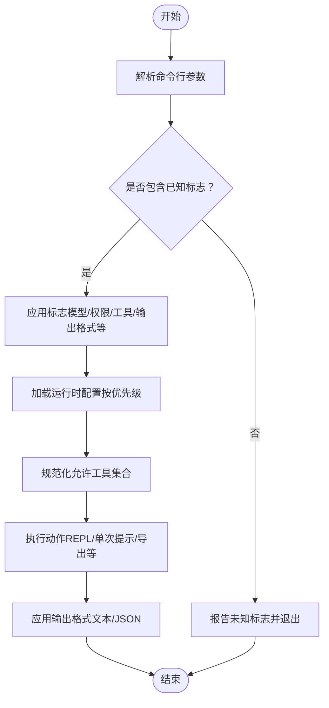
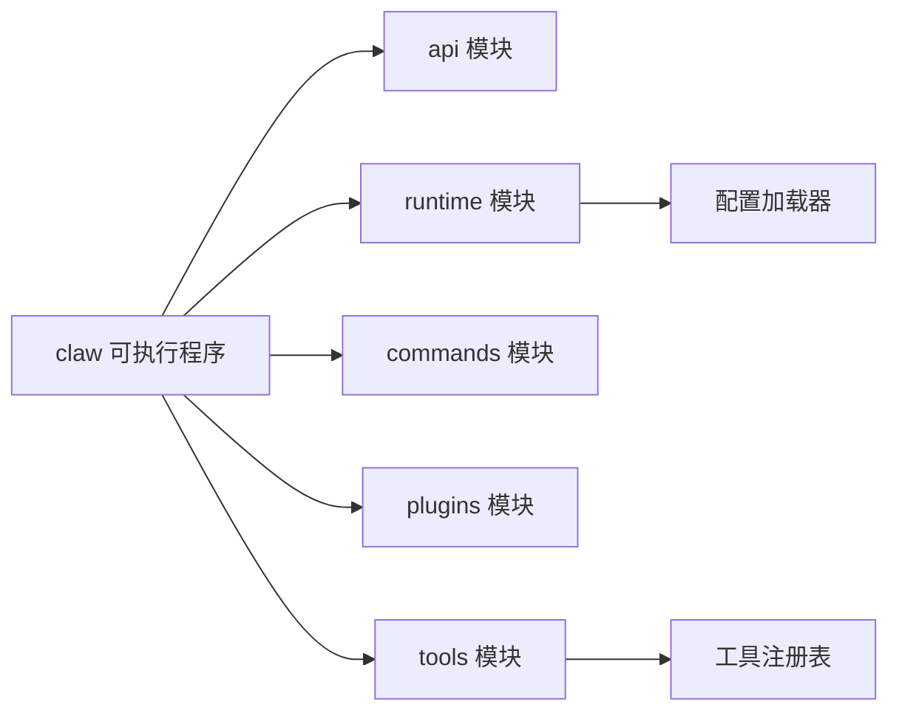

# 配置选项

<cite>
**本文引用的文件**
- [rusty-claude-cli 源码 main.rs](file://rust/README.md)
- [运行时配置 config.rs](file://rust/USAGE.md)
- [工具注册与权限工具 lib.rs](file://rust/USAGE.md)
- [命令模块 commands/lib.rs](file://rust/USAGE.md)
- [Cargo.toml（CLI）](file://rust/Cargo.toml)
- [使用手册 USAGE.md](file://USAGE.md)
</cite>

## 目录
1. [简介](#简介)
2. [项目结构](#项目结构)
3. [核心组件](#核心组件)
4. [架构总览](#架构总览)
5. [详细组件分析](#详细组件分析)
6. [依赖关系分析](#依赖关系分析)
7. [性能考量](#性能考量)
8. [故障排除指南](#故障排除指南)
9. [结论](#结论)
10. [附录](#附录)

## 简介
本文件系统性梳理 claw CLI 的配置选项与行为，覆盖命令行标志、环境变量、配置文件优先级、默认值、取值范围、使用场景与最佳实践，并提供常见问题排查建议。目标读者既包括需要快速上手的用户，也包括希望深入理解实现细节的开发者。

## 项目结构
- CLI 可执行程序由 Rust 工作区中的 crates 构建产出，入口为 rusty-claude-cli 模块。
- 运行时配置通过运行时配置加载器解析多级配置文件并合并生效。
- 工具与权限控制由工具注册表与权限模式共同决定。

图表来源
- [Cargo.toml（CLI）](file://rust/Cargo.toml)
- [rusty-claude-cli 源码 main.rs](file://rust/README.md)
- [运行时配置 config.rs](file://rust/USAGE.md)

章节来源
- [Cargo.toml（CLI）](file://rust/Cargo.toml)
- [rusty-claude-cli 源码 main.rs](file://rust/README.md)
- [运行时配置 config.rs](file://rust/USAGE.md)

## 核心组件
- 命令行参数解析：负责识别并解析所有支持的标志与子命令，生成内部动作对象。
- 运行时配置加载：按优先级发现并合并配置文件，提供模型别名、权限模式等运行时设置。
- 工具与权限：根据允许的工具集合与权限模式，约束工具调用范围与交互方式。
- 输出格式：统一控制文本或 JSON 输出，便于脚本化集成。

章节来源
- [rusty-claude-cli 源码 main.rs](file://rust/README.md)
- [运行时配置 config.rs](file://rust/USAGE.md)
- [工具注册与权限工具 lib.rs](file://rust/USAGE.md)

## 架构总览
下图展示从命令行到运行时配置与工具执行的关键路径：

图表来源
- [rusty-claude-cli 源码 main.rs](file://rust/README.md)
- [运行时配置 config.rs](file://rust/USAGE.md)
- [工具注册与权限工具 lib.rs](file://rust/USAGE.md)

## 详细组件分析

### 命令行标志与选项
以下为已支持的命令行标志与其行为、默认值、取值范围与使用场景说明。所有标志均在参数解析阶段被识别与处理。

- --model
  - 作用：指定模型名称或别名；支持内置别名（如 opus、sonnet、haiku）与用户自定义别名。
  - 默认值：内置默认模型。
  - 取值范围：字符串；若非内置别名则透传给后端；可通过配置文件添加别名映射。
  - 使用场景：选择不同推理能力与上下文窗口的模型；在 CI 或自动化中固定模型以保证一致性。
  - 示例：--model sonnet、--model haiku、--model claude-sonnet-4-6。
  - 注意：模型别名解析会优先使用当前目录下的配置别名，再回退到内置别名表。

- --output-format
  - 作用：控制输出格式为文本或 JSON。
  - 默认值：text。
  - 取值范围：text、json。
  - 使用场景：脚本化调用、下游工具解析、CI 日志结构化输出。
  - 示例：--output-format json。
  - 错误提示：当取值非法时返回明确错误消息，提示期望的取值。

- --permission-mode
  - 作用：设置权限模式，影响工具调用与交互式授权提示。
  - 默认值：未显式设置时，优先读取环境变量，其次读取配置文件，最后回退到危险全权访问。
  - 取值范围：read-only、workspace-write、danger-full-access。
  - 使用场景：安全敏感环境限制工具写入；开发调试阶段开启更宽松权限；CI 中可强制只读。
  - 示例：--permission-mode read-only、--permission-mode workspace-write。

- --dangerously-skip-permissions
  - 作用：强制将权限模式设为危险全权访问（danger-full-access），跳过交互式授权。
  - 默认值：无；仅在显式传入时生效。
  - 使用场景：CI 或自动化脚本中无需人工确认的场景；需谨慎使用。
  - 注意：该标志会覆盖其他权限模式来源。

- --allowed-tools 或 --allowedTools
  - 作用：限定本次运行可用的工具集合；支持多次传入或逗号分隔列表。
  - 默认值：不传入时不限定工具集合。
  - 取值范围：工具名称（来自全局工具注册表）。
  - 使用场景：最小权限原则、安全隔离、仅允许特定工具完成任务。
  - 示例：--allowed-tools read_file,write_file、--allowed-tools glob。

- --base-commit
  - 作用：指定基线提交，用于差异上下文与“陈旧基线”预检。
  - 默认值：无；未设置时按运行时逻辑进行预检。
  - 使用场景：在变更较大或分支较远时，明确基线以减少无关上下文。
  - 示例：--base-commit HEAD~3。

- --reasoning-effort
  - 作用：设置模型推理努力程度，影响温度与采样策略。
  - 默认值：无；未设置时使用模型默认策略。
  - 取值范围：low、medium、high。
  - 使用场景：对需要深度思考的任务提升推理质量；高努力可能增加成本与延迟。
  - 示例：--reasoning-effort high。

- --allow-broad-cwd
  - 作用：允许在较宽泛的工作目录范围内执行（与沙箱策略相关）。
  - 默认值：false；未显式传入时不启用。
  - 使用场景：CI 或容器内受限环境，需要放宽工作目录限制。
  - 注意：与权限模式配合使用，确保安全边界清晰。

- --compact
  - 作用：紧凑输出模式，减少冗余信息。
  - 默认值：false。
  - 使用场景：日志压缩、机器可读输出优化。

- -p
  - 作用：简短一次性提示模式；将剩余参数作为提示词直接发送。
  - 默认值：无；仅在显式传入时生效。
  - 使用场景：快速命令行调用，避免进入 REPL。

- --print
  - 作用：兼容模式，使输出非交互式（等价于 --output-format text）。
  - 默认值：无；仅在显式传入时生效。
  - 使用场景：与上游工具链兼容。

- --resume
  - 作用：从指定会话恢复执行后续命令；可与会话路径或别名（如 latest）结合。
  - 默认值：无；仅在显式传入时生效。
  - 使用场景：中断后继续、批量命令串行执行。

章节来源
- [rusty-claude-cli 源码 main.rs](file://rust/README.md)
- [使用手册 USAGE.md](file://USAGE.md)

### 环境变量与配置文件优先级
- 环境变量
  - RUSTY_CLAUDE_PERMISSION_MODE：用于设置默认权限模式，优先于配置文件。
  - ANTHROPIC_API_KEY / ANTHROPIC_AUTH_TOKEN：认证凭据，用于 Anthropic 兼容后端。
  - ANTHROPIC_BASE_URL / OPENAI_BASE_URL / XAI_BASE_URL / DASHSCOPE_BASE_URL：后端服务地址。
  - HTTP_PROXY / HTTPS_PROXY / NO_PROXY：HTTP 代理配置。
  - CLAW_CONFIG_HOME：自定义用户级配置根目录。

- 配置文件（按发现顺序，后者覆盖前者）
  - 用户级：~/.claw.json 或 ~/.config/claw/settings.json
  - 项目级：<repo>/.claw.json
  - 项目级：.claw/settings.json
  - 本地级：.claw/settings.local.json
  - 合并规则：键值逐层覆盖，对象类型采用深合并；未知字段会触发校验错误并给出建议。

- 模型别名
  - 支持在配置文件中定义别名映射，优先于内置别名；解析时先查配置，再查内置表。

- 权限模式解析顺序
  - CLI 显式标志 > 环境变量 > 配置文件 > 默认危险全权访问。

章节来源
- [运行时配置 config.rs](file://rust/USAGE.md)
- [rusty-claude-cli 源码 main.rs](file://rust/README.md)
- [使用手册 USAGE.md](file://USAGE.md)

### 选项组合与最佳实践
- 安全优先
  - 在 CI 或共享环境默认使用 --permission-mode read-only；仅在必要时临时放宽。
  - 结合 --allowed-tools 限定工具集，遵循最小权限原则。

- 脚本化与结构化输出
  - 使用 --output-format json 以便下游工具解析；在失败时也会输出结构化错误对象。

- 模型与推理
  - 对需要深度思考的任务使用 --reasoning-effort high；对常规任务保持默认或 low。
  - 固定 --model 以保证结果稳定性与成本可控。

- 会话与恢复
  - 使用 --resume latest 或具体会话路径恢复执行；结合 /export 导出结果。

- 代理与网络
  - 通过 HTTP_PROXY/HTTPS_PROXY/NO_PROXY 控制网络访问；必要时在配置中设置统一代理。

- 配置优先级
  - 本地配置覆盖项目配置；用户配置覆盖项目配置；环境变量覆盖配置文件。

章节来源
- [rusty-claude-cli 源码 main.rs](file://rust/README.md)
- [使用手册 USAGE.md](file://USAGE.md)

### 数据流与处理逻辑
下图展示一次典型命令的处理流程：

图表来源
- [rusty-claude-cli 源码 main.rs](file://rust/README.md)
- [运行时配置 config.rs](file://rust/USAGE.md)

## 依赖关系分析
- CLI 二进制依赖 api、commands、runtime、plugins、tools 等模块。
- 参数解析依赖运行时配置加载器以解析模型别名与权限模式。
- 工具执行依赖工具注册表与权限模式共同约束。

图表来源
- [Cargo.toml（CLI）](file://rust/Cargo.toml)
- [rusty-claude-cli 源码 main.rs](file://rust/README.md)
- [运行时配置 config.rs](file://rust/USAGE.md)
- [工具注册与权限工具 lib.rs](file://rust/USAGE.md)

章节来源
- [Cargo.toml（CLI）](file://rust/Cargo.toml)
- [rusty-claude-cli 源码 main.rs](file://rust/README.md)
- [运行时配置 config.rs](file://rust/USAGE.md)
- [工具注册与权限工具 lib.rs](file://rust/USAGE.md)

## 性能考量
- 输出格式切换：JSON 输出会增加序列化开销，适合脚本但可能影响实时性。
- 工具集合：限制 --allowed-tools 可减少工具枚举与初始化时间。
- 权限模式：严格模式会增加授权检查与提示交互，影响响应速度。
- 模型选择：大模型与高推理努力会显著增加延迟与成本。

## 故障排除指南
- 未知标志
  - 现象：提示 unknown option 并给出相近建议。
  - 处理：检查拼写；参考 --help 获取可用选项清单。

- 输出格式非法
  - 现象：--output-format 取值不在 text/json 时返回错误。
  - 处理：修正为 text 或 json。

- 权限模式非法
  - 现象：--permission-mode 取值不在 read-only/workspace-write/danger-full-access 时返回错误。
  - 处理：使用受支持的模式；或移除标志以回退到默认。

- 缺少必需参数
  - 现象：某些标志缺少对应值时返回错误。
  - 处理：为标志提供正确参数值。

- 权限不足或被拒绝
  - 现象：在严格权限模式下工具调用被拒绝。
  - 处理：使用 --allowed-tools 指定所需工具；或调整 --permission-mode。

- 认证失败
  - 现象：401 未授权；可能因凭据形状不匹配。
  - 处理：确保将 sk-ant-* 放入 ANTHROPIC_API_KEY，Bearer 形态放入 ANTHROPIC_AUTH_TOKEN；或使用模型前缀路由到正确后端。

- 配置文件解析错误
  - 现象：配置文件格式错误或包含未知字段。
  - 处理：检查 JSON 格式；移除未知字段；参考配置文件优先级与合并规则。

章节来源
- [rusty-claude-cli 源码 main.rs](file://rust/README.md)
- [使用手册 USAGE.md](file://USAGE.md)

## 结论
claw CLI 提供了灵活且安全的配置体系：通过命令行标志、环境变量与配置文件的多层优先级，用户可以在不同场景下精确控制模型、权限、工具与输出格式。遵循最小权限原则、固定模型与推理努力、合理使用会话恢复与代理配置，可获得稳定、可重复且安全的体验。

## 附录
- 快速参考
  - 模型别名：opus → claude-opus-4-6；sonnet → claude-sonnet-4-6；haiku → claude-haiku-4-5-20251213。
  - 权限模式：read-only、workspace-write、danger-full-access。
  - 输出格式：text、json。
  - 配置文件优先级：用户级 > 项目级 > 本地级；后者覆盖前者。

章节来源
- [使用手册 USAGE.md](file://USAGE.md)