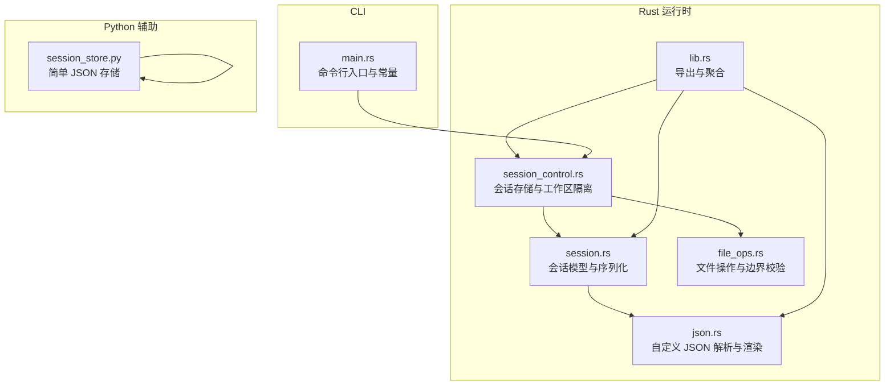
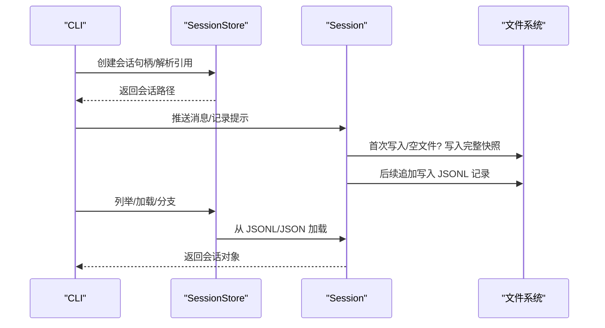
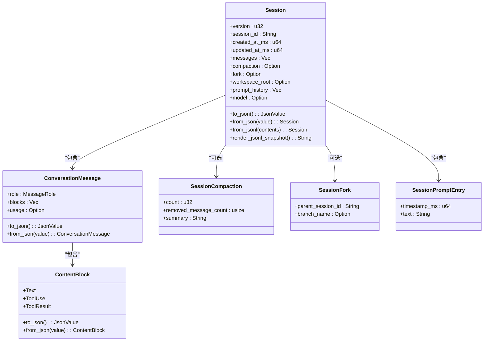
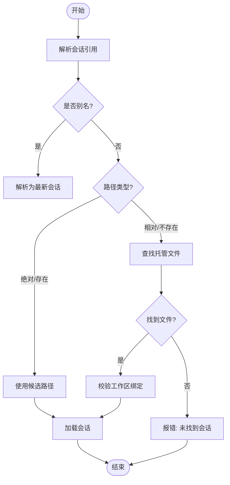
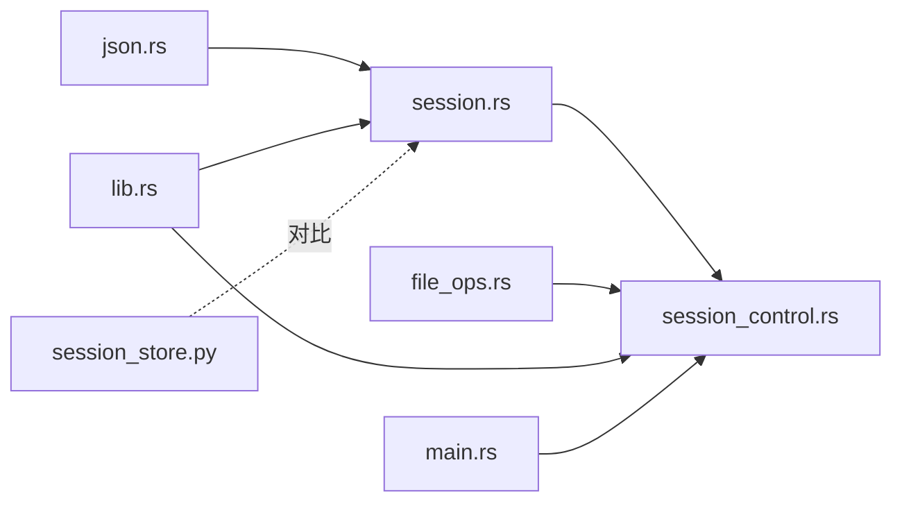

# 会话持久化

<cite>
**本文档引用的文件**
- [session.rs](file://rust/crates/runtime/src/session.rs)
- [session_control.rs](file://rust/crates/runtime/src/session_control.rs)
- [json.rs](file://rust/crates/runtime/src/json.rs)
- [file_ops.rs](file://rust/crates/runtime/src/file_ops.rs)
- [lib.rs](file://rust/crates/runtime/src/lib.rs)
- [main.rs](file://rust/crates/rusty-claude-cli/src/main.rs)
- [session_store.py](file://src/session_store.py)
- [session-1775007453382.json](file://rust/.claude/sessions/session-1775007453382.json)
- [session-newer.jsonl](file://rust/./crates/rusty-claude-cli/.claw/sessions/session-newer.jsonl)
</cite>

## 目录
1. [简介](#简介)
2. [项目结构](#项目结构)
3. [核心组件](#核心组件)
4. [架构总览](#架构总览)
5. [详细组件分析](#详细组件分析)
6. [依赖关系分析](#依赖关系分析)
7. [性能考虑](#性能考虑)
8. [故障排查指南](#故障排查指南)
9. [结论](#结论)
10. [附录](#附录)

## 简介
本文件系统性阐述代码库中的会话持久化机制，覆盖以下方面：
- 会话数据的序列化格式（JSON 与 JSONL）
- 存储策略与文件组织结构
- 数据完整性校验与并发访问控制
- 备份、恢复与迁移策略
- 性能优化、磁盘空间管理与清理策略
- 会话持久化与内存缓存的关系
- 持久化失败的处理机制与数据恢复方案

## 项目结构
会话持久化由 Rust 运行时模块与 Python 辅助模块共同实现，采用“JSONL 主流格式 + JSON 兼容”的双格式策略，并通过工作区隔离与指纹命名避免多实例冲突。

**图表来源**
- [session.rs:1-120](file://rust/crates/runtime/src/session.rs#L1-L120)
- [session_control.rs:1-60](file://rust/crates/runtime/src/session_control.rs#L1-L60)
- [json.rs:1-60](file://rust/crates/runtime/src/json.rs#L1-L60)
- [file_ops.rs:1-40](file://rust/crates/runtime/src/file_ops.rs#L1-L40)
- [lib.rs:1-60](file://rust/crates/runtime/src/lib.rs#L1-L60)
- [main.rs:70-90](file://rust/crates/rusty-claude-cli/src/main.rs#L70-L90)
- [session_store.py:1-36](file://src/session_store.py#L1-L36)

**章节来源**
- [session.rs:1-120](file://rust/crates/runtime/src/session.rs#L1-L120)
- [session_control.rs:1-60](file://rust/crates/runtime/src/session_control.rs#L1-L60)
- [json.rs:1-60](file://rust/crates/runtime/src/json.rs#L1-L60)
- [file_ops.rs:1-40](file://rust/crates/runtime/src/file_ops.rs#L1-L40)
- [lib.rs:1-60](file://rust/crates/runtime/src/lib.rs#L1-L60)
- [main.rs:70-90](file://rust/crates/rusty-claude-cli/src/main.rs#L70-L90)
- [session_store.py:1-36](file://src/session_store.py#L1-L36)

## 核心组件
- 会话模型与序列化：定义消息角色、内容块、提示历史等结构，并提供 JSON 与 JSONL 的双向转换。
- 会话存储与工作区隔离：按工作区指纹命名目录，避免多实例写入冲突；支持别名解析与历史列表。
- 自定义 JSON 解析器：轻量实现，确保渲染与解析一致性。
- 文件操作与边界校验：限制读写大小、检测二进制文件、路径边界校验。
- 命令行常量与入口：定义扩展名、别名等常量，供 CLI 使用。

**章节来源**
- [session.rs:80-120](file://rust/crates/runtime/src/session.rs#L80-L120)
- [session_control.rs:10-60](file://rust/crates/runtime/src/session_control.rs#L10-L60)
- [json.rs:36-113](file://rust/crates/runtime/src/json.rs#L36-L113)
- [file_ops.rs:12-44](file://rust/crates/runtime/src/file_ops.rs#L12-L44)
- [main.rs:78-85](file://rust/crates/rusty-claude-cli/src/main.rs#L78-L85)

## 架构总览
会话持久化采用“增量 JSONL 记录 + 元信息引导”的设计：
- 首次写入或空文件时，先写入完整快照（元信息记录 + 各类子记录）。
- 后续追加仅写入单条 JSONL 记录，减少 IO 开销。
- 工作区指纹命名目录，确保多实例互不干扰。
- 支持从 JSONL 或旧版 JSON 加载，兼容历史版本。

**图表来源**
- [session_control.rs:77-116](file://rust/crates/runtime/src/session_control.rs#L77-L116)
- [session.rs:204-227](file://rust/crates/runtime/src/session.rs#L204-L227)
- [session.rs:541-574](file://rust/crates/runtime/src/session.rs#L541-L574)

**章节来源**
- [session_control.rs:77-116](file://rust/crates/runtime/src/session_control.rs#L77-L116)
- [session.rs:204-227](file://rust/crates/runtime/src/session.rs#L204-L227)
- [session.rs:541-574](file://rust/crates/runtime/src/session.rs#L541-L574)

## 详细组件分析

### 会话模型与序列化（JSON/JSONL）
- 结构定义
  - 角色枚举：系统、用户、助手、工具。
  - 内容块：文本、工具调用、工具结果。
  - 会话元数据：版本、会话 ID、时间戳、工作区根、模型、分叉信息、提示历史。
- 序列化策略
  - JSON：整包对象，适合一次性读取与兼容旧版本。
  - JSONL：以类型字段区分记录，便于增量写入与流式处理。
- 反序列化策略
  - 自动识别 JSON 或 JSONL 输入，分别解析为会话对象。
  - 对 JSONL 逐行解析，按类型组装会话状态。

**图表来源**
- [session.rs:89-124](file://rust/crates/runtime/src/session.rs#L89-L124)
- [session.rs:47-729](file://rust/crates/runtime/src/session.rs#L47-L729)
- [session.rs:54-67](file://rust/crates/runtime/src/session.rs#L54-L67)

**章节来源**
- [session.rs:47-729](file://rust/crates/runtime/src/session.rs#L47-L729)

### 会话存储与工作区隔离
- 目录布局
  - 按工作区根进行指纹命名，形成命名空间，避免多实例冲突。
  - 支持从当前工作目录或显式数据目录构建存储根。
- 引用解析
  - 支持别名解析（如 latest），绝对路径、相对路径与托管文件混合解析。
  - 列举托管会话并排序，优先语义更新时间，其次文件修改时间。
- 分支与恢复
  - 分支会话时保留父会话 ID 与分支名称，保存到独立文件。
  - 加载时校验工作区绑定，防止跨工作区误读。

**图表来源**
- [session_control.rs:86-139](file://rust/crates/runtime/src/session_control.rs#L86-L139)
- [session_control.rs:141-156](file://rust/crates/runtime/src/session_control.rs#L141-L156)

**章节来源**
- [session_control.rs:10-60](file://rust/crates/runtime/src/session_control.rs#L10-L60)
- [session_control.rs:86-139](file://rust/crates/runtime/src/session_control.rs#L86-L139)
- [session_control.rs:141-156](file://rust/crates/runtime/src/session_control.rs#L141-L156)

### JSON 解析与渲染
- 自定义 JSON 值类型与错误类型，支持对象、数组、字符串、布尔、数字与空值。
- 渲染时对字符串进行转义，解析时严格校验语法与尾随内容。
- 提供便捷的类型提取方法（如字符串、布尔、整数）与范围检查。

**章节来源**
- [json.rs:36-113](file://rust/crates/runtime/src/json.rs#L36-L113)
- [json.rs:152-329](file://rust/crates/runtime/src/json.rs#L152-L329)

### 文件操作与边界校验
- 读写限制：最大读取 10MB，最大写入 10MB，防止大文件导致内存压力。
- 二进制检测：通过前 8KB 检测 NUL 字节判断二进制文件。
- 路径边界：校验路径是否逃逸工作区根，防止目录穿越。
- 搜索与替换：提供通配符搜索、正则搜索、文件编辑等能力，用于辅助会话管理。

**章节来源**
- [file_ops.rs:12-44](file://rust/crates/runtime/src/file_ops.rs#L12-L44)
- [file_ops.rs:174-221](file://rust/crates/runtime/src/file_ops.rs#L174-L221)
- [file_ops.rs:223-255](file://rust/crates/runtime/src/file_ops.rs#L223-L255)
- [file_ops.rs:257-296](file://rust/crates/runtime/src/file_ops.rs#L257-L296)

### 命令行常量与入口
- 定义主扩展名与别名常量，供 CLI 与存储层统一使用。
- CLI 入口负责参数解析与动作分发，间接驱动会话加载/保存/导出等流程。

**章节来源**
- [main.rs:78-85](file://rust/crates/rusty-claude-cli/src/main.rs#L78-L85)
- [main.rs:392-707](file://rust/crates/rusty-claude-cli/src/main.rs#L392-L707)

### Python 会话存储（对比参考）
- 提供简单 JSON 存储示例，展示键值结构与基本读写流程，便于理解不同语言实现的差异。

**章节来源**
- [session_store.py:8-35](file://src/session_store.py#L8-L35)

## 依赖关系分析
- 组件耦合
  - Session 依赖 JsonValue 与 TokenUsage，负责序列化与消息结构。
  - SessionStore 依赖 Session 与 file_ops，负责工作区隔离与文件管理。
  - lib.rs 将各模块导出，形成统一 API。
- 外部依赖
  - CLI 通过 main.rs 与运行时交互，使用常量与存储接口。
  - Python 示例作为对比实现，不参与核心运行时依赖。

**图表来源**
- [lib.rs:37-50](file://rust/crates/runtime/src/lib.rs#L37-L50)
- [session.rs:9-10](file://rust/crates/runtime/src/session.rs#L9-L10)
- [session_control.rs:8-8](file://rust/crates/runtime/src/session_control.rs#L8-L8)
- [file_ops.rs:1-10](file://rust/crates/runtime/src/file_ops.rs#L1-L10)
- [main.rs:44-52](file://rust/crates/rusty-claude-cli/src/main.rs#L44-L52)
- [session_store.py:3-5](file://src/session_store.py#L3-L5)

**章节来源**
- [lib.rs:37-50](file://rust/crates/runtime/src/lib.rs#L37-L50)

## 性能考虑
- 写入策略
  - 首次写入或空文件时写入完整快照，保证可恢复性。
  - 后续追加写入单条 JSONL 记录，降低 IO 成本与锁竞争。
- 文件大小控制
  - 单文件增长到阈值后触发轮转与清理，避免单文件过大影响读写性能。
- 解析效率
  - 自定义 JSON 解析器轻量实现，避免引入重型依赖。
- 并发与原子性
  - 当前实现未见显式的文件级互斥锁；建议在高并发场景下结合外部锁或重试策略。

**章节来源**
- [session.rs:12-16](file://rust/crates/runtime/src/session.rs#L12-L16)
- [session.rs:204-211](file://rust/crates/runtime/src/session.rs#L204-L211)
- [session.rs:541-574](file://rust/crates/runtime/src/session.rs#L541-L574)

## 故障排查指南
- 常见错误类型
  - IO 错误：文件不存在、权限不足、磁盘空间不足。
  - JSON 错误：解析失败、字段缺失、类型不匹配。
  - 格式错误：非预期的 JSONL 类型、行格式错误。
  - 工作区不匹配：加载会话时发现工作区根不一致。
- 排查步骤
  - 确认会话文件是否存在且非空，必要时重建快照。
  - 检查 JSONL 行格式与类型字段，修复损坏记录。
  - 校验工作区绑定，避免跨工作区误读。
  - 控制文件大小，启用轮转与清理策略。
- 恢复方案
  - 从 JSONL 快照重建会话对象，忽略不可解析行。
  - 使用分支功能创建新会话，保留父会话 ID 与分支名称。
  - 导出为兼容格式，便于跨版本迁移。

**章节来源**
- [session.rs:125-155](file://rust/crates/runtime/src/session.rs#L125-L155)
- [session_control.rs:205-225](file://rust/crates/runtime/src/session_control.rs#L205-L225)
- [session_control.rs:528-537](file://rust/crates/runtime/src/session_control.rs#L528-L537)

## 结论
该会话持久化机制以 JSONL 为主、JSON 为辅，结合工作区指纹命名与严格的边界校验，实现了稳定可靠的多实例隔离与增量写入。通过清晰的错误类型与恢复路径，能够在异常情况下快速定位问题并恢复服务。建议在生产环境中配合轮转与清理策略，确保长期稳定性与性能。

## 附录

### 序列化格式规范
- JSON（兼容旧版）
  - 字段：版本号、会话 ID、创建/更新时间、消息数组、可选分叉信息、可选工作区根、可选模型、可选提示历史。
- JSONL（主流）
  - 记录类型：
    - 元信息记录：标识会话元数据与版本。
    - 消息记录：对话消息。
    - 分段压缩记录：压缩摘要与统计。
    - 提示历史记录：用户提示的时间戳与文本。

**章节来源**
- [session.rs:281-332](file://rust/crates/runtime/src/session.rs#L281-L332)
- [session.rs:405-504](file://rust/crates/runtime/src/session.rs#L405-L504)
- [session.rs:576-611](file://rust/crates/runtime/src/session.rs#L576-L611)

### 文件组织与命名
- 目录结构
  - 工作区指纹命名的子目录，避免多实例冲突。
  - 扩展名：JSONL 为主，JSON 为兼容。
- 引用与别名
  - 支持 latest/last/recent 等别名解析。
  - 支持绝对路径、相对路径与托管文件混合解析。

**章节来源**
- [session_control.rs:28-63](file://rust/crates/runtime/src/session_control.rs#L28-L63)
- [session_control.rs:291-304](file://rust/crates/runtime/src/session_control.rs#L291-L304)
- [session_control.rs:500-504](file://rust/crates/runtime/src/session_control.rs#L500-L504)

### 备份、恢复与迁移
- 备份
  - 直接复制会话文件（JSONL/JSON）即可完成备份。
- 恢复
  - 从备份文件加载，校验工作区绑定后恢复。
- 迁移
  - 通过分支功能创建新会话，保留父会话 ID 与分支名称，便于后续合并或归档。

**章节来源**
- [session_control.rs:174-196](file://rust/crates/runtime/src/session_control.rs#L174-L196)
- [session.rs:259-279](file://rust/crates/runtime/src/session.rs#L259-L279)

### 并发访问控制
- 当前实现未见显式文件级互斥锁。
- 建议在高并发场景下：
  - 使用外部锁或重试策略。
  - 控制写入频率，避免频繁追加导致的竞争。
  - 在应用层实现幂等写入，确保重复写入不会破坏一致性。

**章节来源**
- [session.rs:541-574](file://rust/crates/runtime/src/session.rs#L541-L574)

### 数据完整性校验
- JSONL 行级校验：逐行解析，跳过无效行，保证整体可恢复。
- 工作区绑定校验：加载时验证工作区根，防止跨工作区误读。
- 文件大小与类型校验：读写前检查大小与类型，避免异常文件影响系统。

**章节来源**
- [session.rs:405-487](file://rust/crates/runtime/src/session.rs#L405-L487)
- [session_control.rs:205-225](file://rust/crates/runtime/src/session_control.rs#L205-L225)
- [file_ops.rs:174-221](file://rust/crates/runtime/src/file_ops.rs#L174-L221)

### 性能优化与磁盘空间管理
- 写入优化：首次写入完整快照，后续追加单条记录。
- 轮转与清理：达到阈值后轮转旧文件并清理多余副本，保持目录整洁。
- 读取优化：按需解析，跳过无效行，减少解析开销。

**章节来源**
- [session.rs:12-16](file://rust/crates/runtime/src/session.rs#L12-L16)
- [session.rs:204-211](file://rust/crates/runtime/src/session.rs#L204-L211)
- [session.rs:541-574](file://rust/crates/runtime/src/session.rs#L541-L574)

### 与内存缓存的关系
- 内存缓存：会话对象在内存中维护最新状态，写入持久化后同步更新时间戳。
- 持久化触发：每次推送消息或提示历史时，先更新内存状态，再异步写入持久化存储。
- 恢复一致性：从持久化文件加载时，若工作区绑定不一致则拒绝加载，确保一致性。

**章节来源**
- [session.rs:613-615](file://rust/crates/runtime/src/session.rs#L613-L615)
- [session_control.rs:205-225](file://rust/crates/runtime/src/session_control.rs#L205-L225)