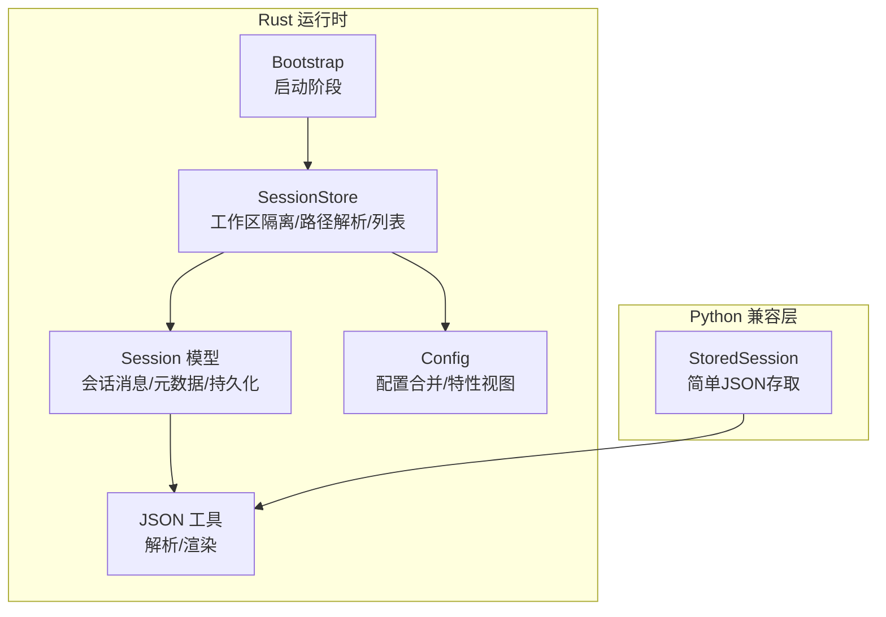
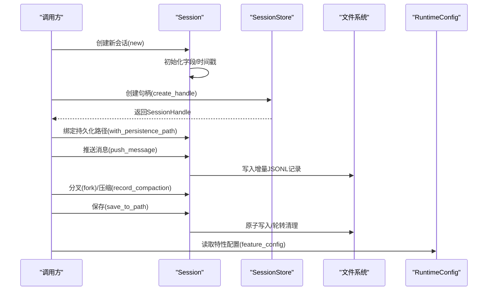
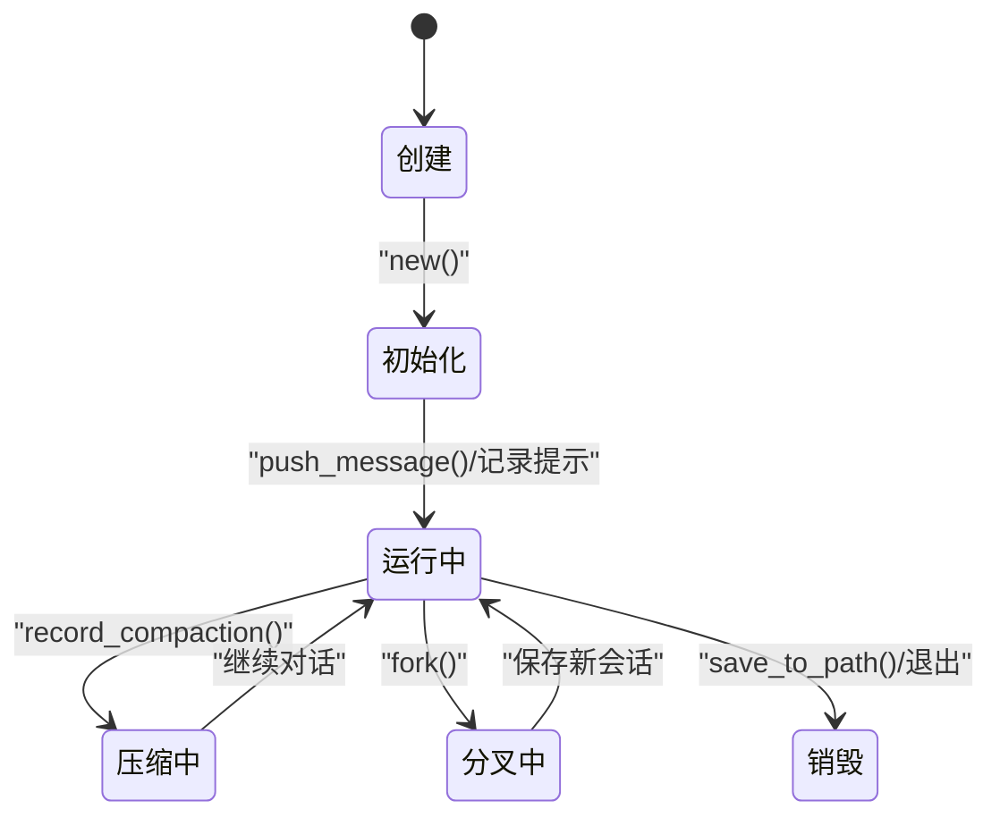
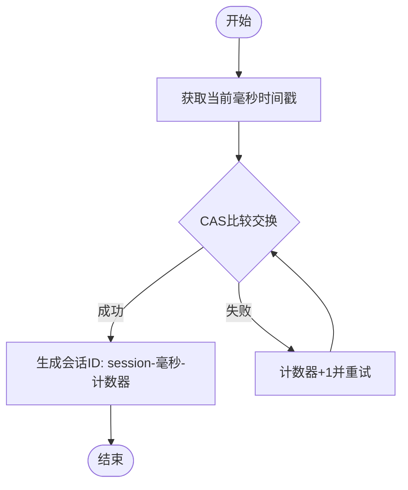
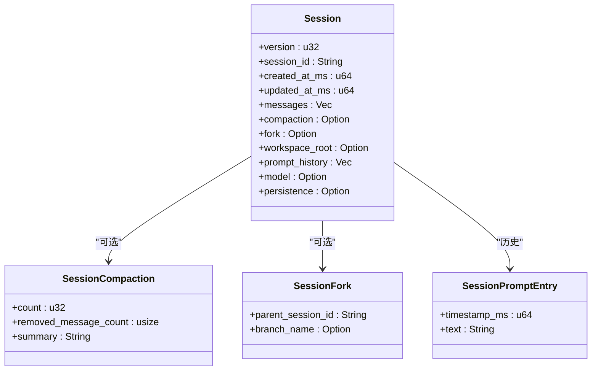
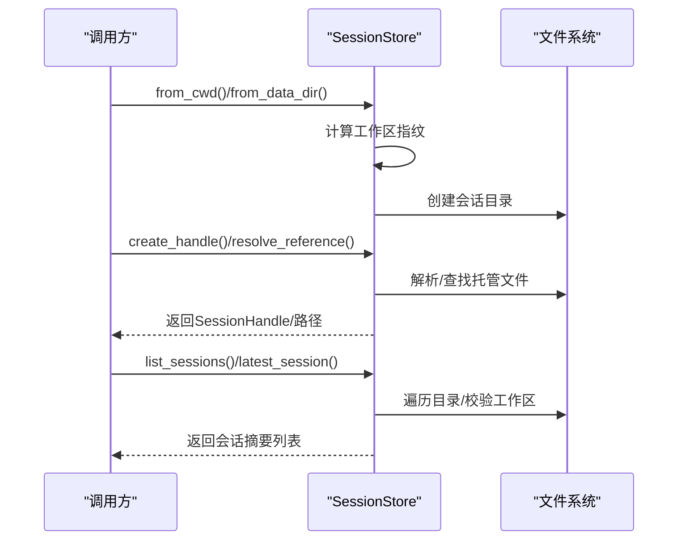
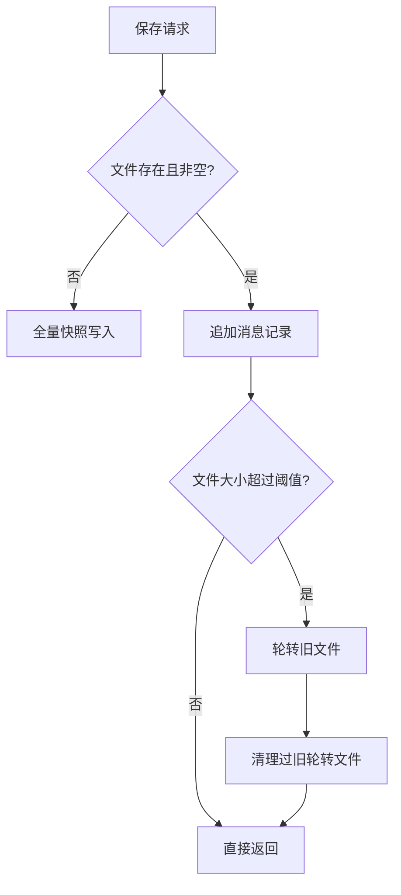
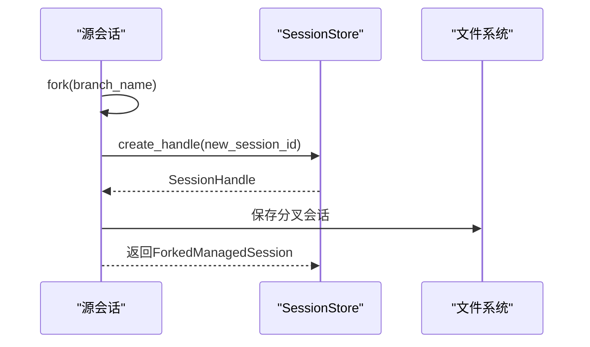
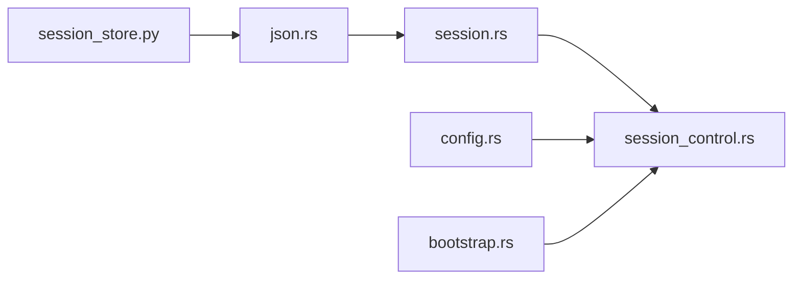

# 会话生命周期

<cite>
**本文引用的文件**
- [session.rs](file://rust/crates/runtime/src/session.rs)
- [session_control.rs](file://rust/crates/runtime/src/session_control.rs)
- [config.rs](file://rust/crates/runtime/src/config.rs)
- [json.rs](file://rust/crates/runtime/src/json.rs)
- [bootstrap.rs](file://rust/crates/runtime/src/bootstrap.rs)
- [session_store.py](file://src/session_store.py)
</cite>

## 目录
1. [简介](#简介)
2. [项目结构](#项目结构)
3. [核心组件](#核心组件)
4. [架构总览](#架构总览)
5. [详细组件分析](#详细组件分析)
6. [依赖关系分析](#依赖关系分析)
7. [性能考量](#性能考量)
8. [故障排查指南](#故障排查指南)
9. [结论](#结论)
10. [附录](#附录)

## 简介
本文件系统性阐述会话生命周期管理的设计与实现，覆盖会话创建、初始化、运行、持久化、分支与恢复、销毁等阶段；解释会话状态转换机制、会话ID生成策略、会话元数据管理；给出配置参数、默认设置与自定义选项；总结最佳实践、错误处理与异常恢复机制，并说明会话与运行时环境的交互关系及关键事件与回调。

## 项目结构
围绕会话生命周期的关键模块包括：
- Rust运行时会话模型与持久化：session.rs
- 会话存储与工作区隔离：session_control.rs
- 配置解析与运行时特性：config.rs
- JSON序列化工具：json.rs
- 启动引导阶段：bootstrap.rs
- Python会话存取（兼容层）：session_store.py

图表来源
- [session.rs:90-106](file://rust/crates/runtime/src/session.rs#L90-L106)
- [session_control.rs:19-26](file://rust/crates/runtime/src/session_control.rs#L19-L26)
- [config.rs:36-41](file://rust/crates/runtime/src/config.rs#L36-L41)
- [json.rs:4-12](file://rust/crates/runtime/src/json.rs#L4-L12)
- [bootstrap.rs:18-20](file://rust/crates/runtime/src/bootstrap.rs#L18-L20)
- [session_store.py:8-16](file://src/session_store.py#L8-L16)

章节来源
- [session.rs:90-106](file://rust/crates/runtime/src/session.rs#L90-L106)
- [session_control.rs:19-26](file://rust/crates/runtime/src/session_control.rs#L19-L26)
- [config.rs:36-41](file://rust/crates/runtime/src/config.rs#L36-L41)
- [json.rs:4-12](file://rust/crates/runtime/src/json.rs#L4-L12)
- [bootstrap.rs:18-20](file://rust/crates/runtime/src/bootstrap.rs#L18-L20)
- [session_store.py:8-16](file://src/session_store.py#L8-L16)

## 核心组件
- 会话模型（Session）
  - 维护版本、会话ID、创建/更新时间戳、消息列表、压缩元数据、分叉信息、工作区根、提示历史、模型标识、持久化句柄等。
  - 提供消息追加、保存/加载、分叉、压缩记录等能力。
- 会话控制（SessionStore）
  - 基于工作区指纹命名空间化会话目录，避免多实例冲突。
  - 提供会话句柄、引用解析、列表、最新会话查询、加载、分叉持久化等。
- 配置系统（RuntimeConfig/RuntimeFeatureConfig）
  - 合并用户/项目/本地配置，提取插件、MCP、权限、沙箱、模型等特性视图。
- JSON工具（JsonValue/JsonError）
  - 自研轻量JSON解析与渲染，支持对象/数组/标量，用于会话文件的读写与校验。
- 启动引导（BootstrapPlan）
  - 定义运行时启动阶段顺序，为会话在后台/模板/环境等场景下的生命周期提供上下文。
- Python兼容层（StoredSession）
  - 简单的JSON存取接口，便于与Python侧集成。

章节来源
- [session.rs:90-106](file://rust/crates/runtime/src/session.rs#L90-L106)
- [session_control.rs:19-26](file://rust/crates/runtime/src/session_control.rs#L19-L26)
- [config.rs:36-41](file://rust/crates/runtime/src/config.rs#L36-L41)
- [json.rs:4-12](file://rust/crates/runtime/src/json.rs#L4-L12)
- [bootstrap.rs:18-20](file://rust/crates/runtime/src/bootstrap.rs#L18-L20)
- [session_store.py:8-16](file://src/session_store.py#L8-L16)

## 架构总览
会话生命周期由“模型-存储-配置-引导”四层协同完成：
- 模型层负责会话状态与数据结构；
- 存储层负责工作区隔离、路径解析与持久化；
- 配置层提供运行时特性与策略；
- 引导层提供生命周期阶段上下文。

图表来源
- [session.rs:159-175](file://rust/crates/runtime/src/session.rs#L159-L175)
- [session_control.rs:78-84](file://rust/crates/runtime/src/session_control.rs#L78-L84)
- [session.rs:204-211](file://rust/crates/runtime/src/session.rs#L204-L211)
- [session.rs:541-555](file://rust/crates/runtime/src/session.rs#L541-L555)
- [config.rs:328-325](file://rust/crates/runtime/src/config.rs#L328-L325)

## 详细组件分析

### 会话模型与状态转换
- 状态字段
  - 版本、会话ID、创建/更新时间戳、消息列表、压缩元数据、分叉信息、工作区根、提示历史、模型标识、持久化句柄。
- 关键方法
  - 新建：初始化时间戳与ID，空消息与历史。
  - 绑定工作区：绑定工作区根以避免跨实例写入漂移。
  - 消息追加：更新时间戳，追加消息并原子写入增量记录；失败回滚。
  - 分叉：复制当前会话，生成新的会话ID，保留父会话ID与分支名。
  - 压缩：记录压缩次数、移除消息数与摘要。
  - 保存/加载：支持JSON对象与JSONL两种格式，自动选择与兼容。
- 状态转换
  - 创建(new) → 初始化字段 → 推送消息 → 更新时间戳 → 保存/分叉 → 销毁(文件关闭/句柄释放)。
  - 分叉(fork) → 生成新ID → 继承元数据 → 写入新文件 → 列表可见。

图表来源
- [session.rs:159-175](file://rust/crates/runtime/src/session.rs#L159-L175)
- [session.rs:229-243](file://rust/crates/runtime/src/session.rs#L229-L243)
- [session.rs:249-257](file://rust/crates/runtime/src/session.rs#L249-L257)
- [session.rs:259-279](file://rust/crates/runtime/src/session.rs#L259-L279)
- [session.rs:204-211](file://rust/crates/runtime/src/session.rs#L204-L211)

章节来源
- [session.rs:90-106](file://rust/crates/runtime/src/session.rs#L90-L106)
- [session.rs:159-175](file://rust/crates/runtime/src/session.rs#L159-L175)
- [session.rs:229-243](file://rust/crates/runtime/src/session.rs#L229-L243)
- [session.rs:249-257](file://rust/crates/runtime/src/session.rs#L249-L257)
- [session.rs:259-279](file://rust/crates/runtime/src/session.rs#L259-L279)
- [session.rs:204-211](file://rust/crates/runtime/src/session.rs#L204-L211)

### 会话ID生成策略与时间戳单调性
- 会话ID生成
  - 使用“毫秒时间戳+递增计数器”的组合，确保全局唯一且具备时间序。
  - 通过原子计数器保证并发安全。
- 时间戳单调性
  - 通过CAS循环确保单调递增，避免同一毫秒内的时间戳回退。
- 临时文件命名
  - 原子写入使用临时文件名，完成后重命名为目标文件，保证一致性。

图表来源
- [session.rs:1057-1061](file://rust/crates/runtime/src/session.rs#L1057-L1061)
- [session.rs:1033-1055](file://rust/crates/runtime/src/session.rs#L1033-L1055)
- [session.rs:1063-1071](file://rust/crates/runtime/src/session.rs#L1063-L1071)

章节来源
- [session.rs:1057-1061](file://rust/crates/runtime/src/session.rs#L1057-L1061)
- [session.rs:1033-1055](file://rust/crates/runtime/src/session.rs#L1033-L1055)
- [session.rs:1063-1071](file://rust/crates/runtime/src/session.rs#L1063-L1071)

### 会话元数据管理
- 元数据字段
  - 版本、会话ID、创建/更新时间戳、压缩次数/移除数量/摘要、分叉父ID与分支名、工作区根、提示历史、模型标识。
- 元数据持久化
  - JSONL格式：首行为会话元数据记录，随后为消息记录、压缩记录、提示历史记录。
  - 支持从旧版JSON对象格式迁移。
- 元数据访问
  - 提供to_json/from_json与from_jsonl双通道，兼容不同版本与格式。

图表来源
- [session.rs:90-106](file://rust/crates/runtime/src/session.rs#L90-L106)
- [session.rs:54-67](file://rust/crates/runtime/src/session.rs#L54-L67)
- [session.rs:62-74](file://rust/crates/runtime/src/session.rs#L62-L74)

章节来源
- [session.rs:90-106](file://rust/crates/runtime/src/session.rs#L90-L106)
- [session.rs:54-67](file://rust/crates/runtime/src/session.rs#L54-L67)
- [session.rs:62-74](file://rust/crates/runtime/src/session.rs#L62-L74)

### 会话存储与工作区隔离
- 工作区指纹
  - 基于工作区根路径的稳定十六进制指纹，确保不同工作区的会话目录隔离。
- 会话目录布局
  - <data_dir>/sessions/<workspace_fingerprint>/ 或 .claw/sessions/<workspace_fingerprint>/。
- 句柄与引用解析
  - 支持别名“latest/last/recent”，绝对/相对路径解析，以及托管文件查找。
- 会话列表与排序
  - 按更新时间(ms)优先、修改时间次之、ID其次排序。

图表来源
- [session_control.rs:28-43](file://rust/crates/runtime/src/session_control.rs#L28-L43)
- [session_control.rs:78-84](file://rust/crates/runtime/src/session_control.rs#L78-L84)
- [session_control.rs:86-116](file://rust/crates/runtime/src/session_control.rs#L86-L116)
- [session_control.rs:141-156](file://rust/crates/runtime/src/session_control.rs#L141-L156)

章节来源
- [session_control.rs:28-43](file://rust/crates/runtime/src/session_control.rs#L28-L43)
- [session_control.rs:78-84](file://rust/crates/runtime/src/session_control.rs#L78-L84)
- [session_control.rs:86-116](file://rust/crates/runtime/src/session_control.rs#L86-L116)
- [session_control.rs:141-156](file://rust/crates/runtime/src/session_control.rs#L141-L156)

### 会话持久化与日志轮转
- 增量写入
  - 首次写入时全量快照，后续追加消息记录到JSONL文件。
- 原子写入
  - 临时文件写入后重命名为目标文件，避免部分写入。
- 日志轮转
  - 超过阈值大小时进行轮转，保留固定数量的历史文件，定期清理过旧文件。
- 文件扩展名
  - 主要扩展名为jsonl，兼容旧版json。

图表来源
- [session.rs:204-211](file://rust/crates/runtime/src/session.rs#L204-L211)
- [session.rs:541-555](file://rust/crates/runtime/src/session.rs#L541-L555)
- [session.rs:1085-1095](file://rust/crates/runtime/src/session.rs#L1085-L1095)
- [session.rs:1105-1141](file://rust/crates/runtime/src/session.rs#L1105-L1141)

章节来源
- [session.rs:204-211](file://rust/crates/runtime/src/session.rs#L204-L211)
- [session.rs:541-555](file://rust/crates/runtime/src/session.rs#L541-L555)
- [session.rs:1085-1095](file://rust/crates/runtime/src/session.rs#L1085-L1095)
- [session.rs:1105-1141](file://rust/crates/runtime/src/session.rs#L1105-L1141)

### 会话分叉与继承
- 分叉流程
  - 复制当前会话状态，生成新的会话ID，保留父会话ID与分支名，继承工作区根。
  - 将分叉后的会话写入新文件，返回分叉结果。
- 分支元数据
  - fork字段记录父会话ID与分支名，便于追踪血缘关系。

图表来源
- [session.rs:259-279](file://rust/crates/runtime/src/session.rs#L259-L279)
- [session_control.rs:174-196](file://rust/crates/runtime/src/session_control.rs#L174-L196)

章节来源
- [session.rs:259-279](file://rust/crates/runtime/src/session.rs#L259-L279)
- [session_control.rs:174-196](file://rust/crates/runtime/src/session_control.rs#L174-L196)

### 配置参数、默认设置与自定义选项
- 配置来源与优先级
  - 用户级、项目级、本地级配置按顺序发现与合并，形成最终运行时配置。
- 运行时特性视图
  - 插件、MCP服务器、OAuth、模型、权限模式、沙箱、提供者回退链等。
- 会话相关配置
  - 会话模型与提示历史受运行时配置影响（如模型标识），但会话文件本身采用独立的JSONL格式。
- 默认行为
  - 未显式指定时，会话文件扩展名为jsonl；支持别名latest引用最近会话。

章节来源
- [config.rs:242-269](file://rust/crates/runtime/src/config.rs#L242-L269)
- [config.rs:328-325](file://rust/crates/runtime/src/config.rs#L328-L325)
- [session_control.rs:305-307](file://rust/crates/runtime/src/session_control.rs#L305-L307)
- [session_control.rs:500-504](file://rust/crates/runtime/src/session_control.rs#L500-L504)

### 会话与运行时环境的交互
- 启动阶段
  - 启动计划包含BackgroundSessionFastPath等阶段，为后台会话提供生命周期上下文。
- 配置驱动
  - 运行时配置决定会话可用的模型、插件、MCP等能力边界。
- 文件系统交互
  - 会话目录位于工作区指纹命名空间下，避免多实例冲突；支持增量写入与轮转清理。

章节来源
- [bootstrap.rs:24-39](file://rust/crates/runtime/src/bootstrap.rs#L24-L39)
- [config.rs:328-325](file://rust/crates/runtime/src/config.rs#L328-L325)
- [session_control.rs:28-43](file://rust/crates/runtime/src/session_control.rs#L28-L43)

### Python会话存取（兼容层）
- 数据结构
  - StoredSession包含会话ID、消息元组、输入/输出token统计。
- 默认目录
  - 默认会话目录为“.port_sessions”。
- 接口
  - 保存与加载会话，以JSON形式持久化。

章节来源
- [session_store.py:8-16](file://src/session_store.py#L8-L16)
- [session_store.py:19-36](file://src/session_store.py#L19-L36)

## 依赖关系分析
- 模块耦合
  - Session依赖JSON工具进行序列化/反序列化。
  - SessionStore依赖Session进行分叉与持久化。
  - 配置系统为会话提供运行时特性视图，但不直接耦合会话文件格式。
- 外部依赖
  - 文件系统：会话目录、文件轮转、原子写入。
  - 时间源：毫秒时间戳与单调性保障。
- 循环依赖
  - 未发现循环依赖；各模块职责清晰。

图表来源
- [session.rs:9-11](file://rust/crates/runtime/src/session.rs#L9-L11)
- [session_control.rs:8](file://rust/crates/runtime/src/session_control.rs#L8)
- [config.rs:6](file://rust/crates/runtime/src/config.rs#L6)
- [bootstrap.rs:1](file://rust/crates/runtime/src/bootstrap.rs#L1)
- [session_store.py:3](file://src/session_store.py#L3)

章节来源
- [session.rs:9-11](file://rust/crates/runtime/src/session.rs#L9-L11)
- [session_control.rs:8](file://rust/crates/runtime/src/session_control.rs#L8)
- [config.rs:6](file://rust/crates/runtime/src/config.rs#L6)
- [bootstrap.rs:1](file://rust/crates/runtime/src/bootstrap.rs#L1)
- [session_store.py:3](file://src/session_store.py#L3)

## 性能考量
- 时间戳单调性
  - 通过CAS循环确保单调递增，避免同一毫秒内的重复ID或回退。
- 增量写入
  - 追加消息而非全量重写，降低IO开销。
- 轮转与清理
  - 控制轮转文件数量上限，避免磁盘膨胀。
- 并发安全
  - 会话ID生成使用原子计数器，适合高并发场景。
- JSON解析
  - 自研轻量JSON解析器，减少依赖与内存分配。

## 故障排查指南
- 常见错误类型
  - IO错误：文件不存在、权限不足、磁盘空间不足。
  - JSON解析错误：格式非法、字段缺失、类型不匹配。
  - 工作区不匹配：会话绑定的工作区与当前工作区不符。
  - 引用解析失败：找不到托管会话或路径无效。
- 排查步骤
  - 检查会话文件是否存在与可读写。
  - 验证JSONL记录类型与必需字段。
  - 确认工作区指纹与当前工作区一致。
  - 使用latest别名或列出会话确认最近会话。
- 恢复建议
  - 对于损坏的JSONL记录，尝试从备份或历史轮转文件恢复。
  - 若工作区不匹配，重新在原工作区打开或重新保存。
  - 对于频繁失败的写入，检查磁盘空间与权限。

章节来源
- [session_control.rs:354-375](file://rust/crates/runtime/src/session_control.rs#L354-L375)
- [session.rs:126-143](file://rust/crates/runtime/src/session.rs#L126-L143)
- [session_control.rs:205-225](file://rust/crates/runtime/src/session_control.rs#L205-L225)
- [session_control.rs:118-139](file://rust/crates/runtime/src/session_control.rs#L118-L139)

## 结论
该会话生命周期管理方案以“模型-存储-配置-引导”为核心，实现了：
- 唯一且有序的会话ID生成与时间戳单调性；
- 工作区隔离与路径解析；
- 增量持久化与原子写入；
- 分叉与压缩元数据管理；
- 与运行时配置的解耦与协作；
- 清晰的错误处理与恢复路径。
建议在生产环境中结合轮转策略与监控告警，确保会话数据的可靠性与可维护性。

## 附录
- 最佳实践
  - 显式绑定工作区根，避免多实例冲突。
  - 使用latest别名快速定位最近会话。
  - 在高并发场景下关注ID生成与写入性能。
  - 定期清理轮转文件，控制磁盘占用。
- 关键事件与回调
  - 会话创建、消息推送、分叉、保存、加载、轮转、清理等节点可作为可观测性与审计点。
- 相关文件
  - [session.rs](file://rust/crates/runtime/src/session.rs)
  - [session_control.rs](file://rust/crates/runtime/src/session_control.rs)
  - [config.rs](file://rust/crates/runtime/src/config.rs)
  - [json.rs](file://rust/crates/runtime/src/json.rs)
  - [bootstrap.rs](file://rust/crates/runtime/src/bootstrap.rs)
  - [session_store.py](file://src/session_store.py)