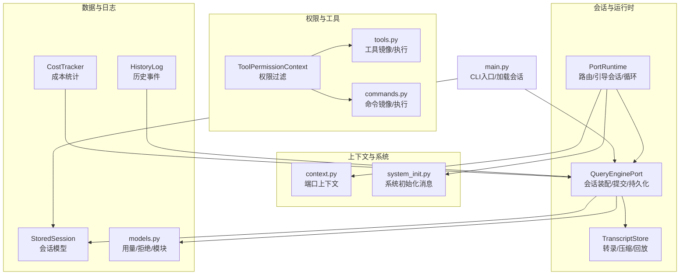
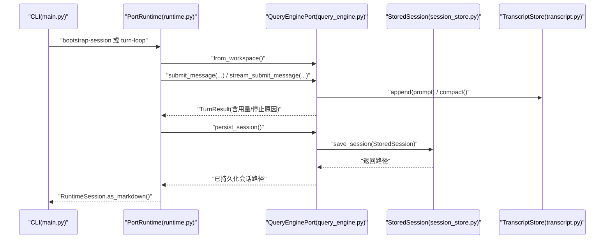
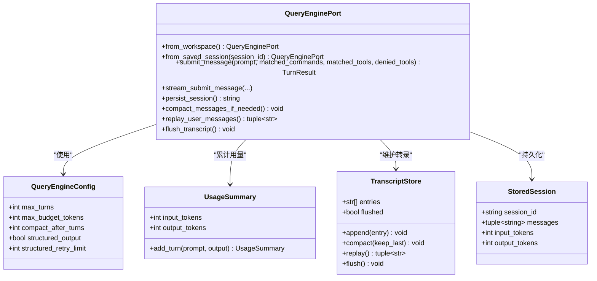
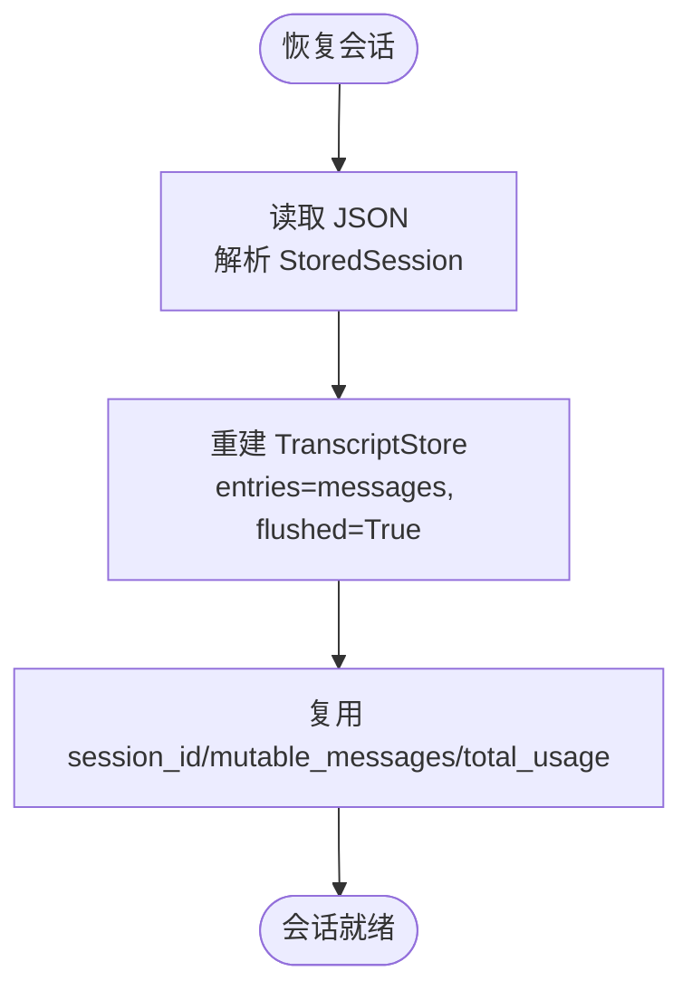
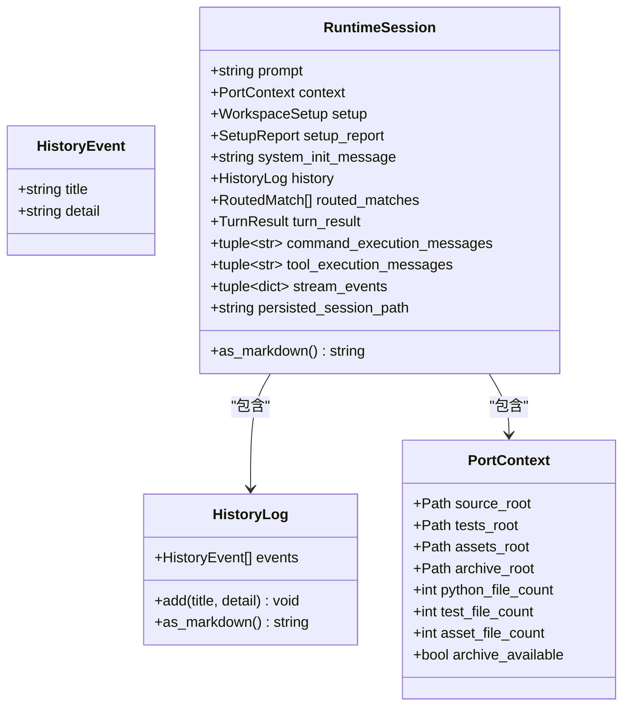
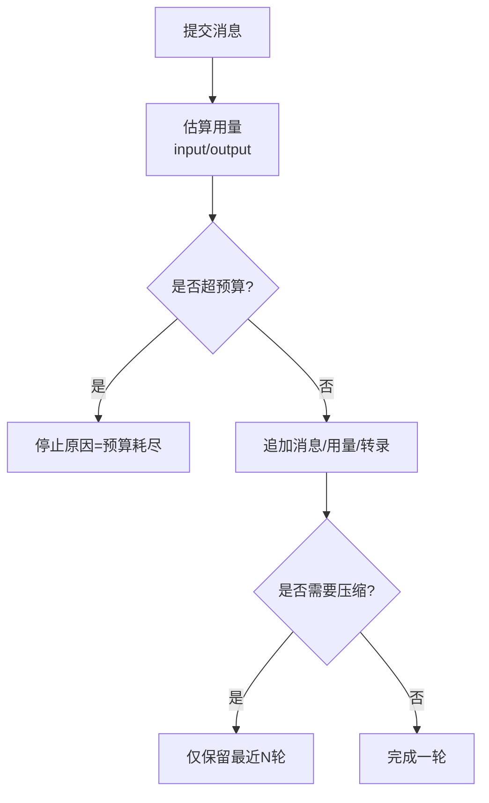
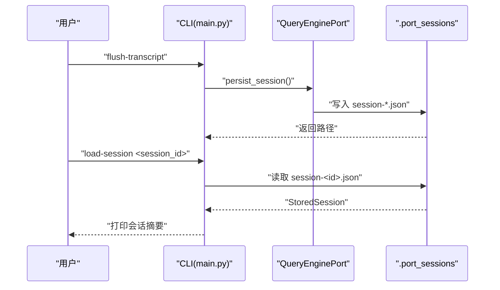
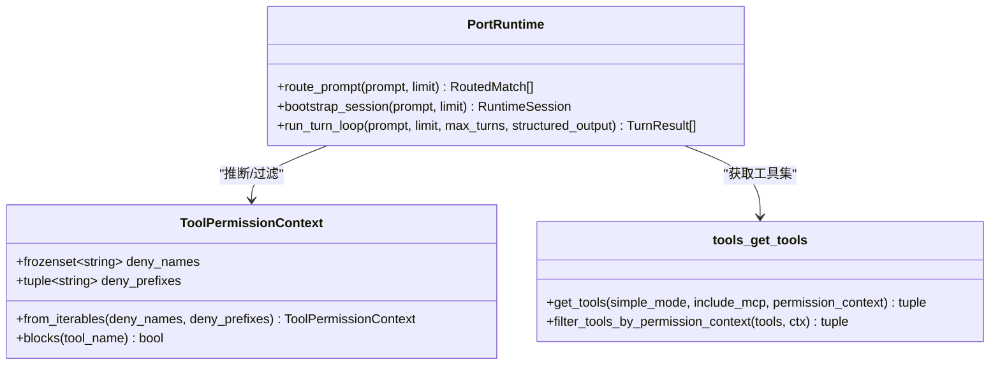
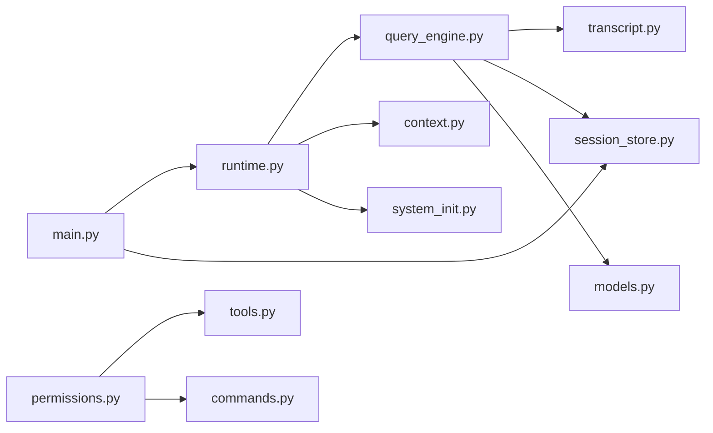

# 会话管理

<cite>
**本文引用的文件**
- [src/session_store.py](file://src/session_store.py)
- [src/history.py](file://src/history.py)
- [src/cost_tracker.py](file://src/cost_tracker.py)
- [src/permissions.py](file://src/permissions.py)
- [src/transcript.py](file://src/transcript.py)
- [src/main.py](file://src/main.py)
- [src/runtime.py](file://src/runtime.py)
- [src/context.py](file://src/context.py)
- [src/tool_pool.py](file://src/tool_pool.py)
- [src/query_engine.py](file://src/query_engine.py)
- [src/models.py](file://src/models.py)
- [src/tools.py](file://src/tools.py)
- [src/commands.py](file://src/commands.py)
- [src/system_init.py](file://src/system_init.py)
</cite>

## 目录
1. [引言](#引言)
2. [项目结构](#项目结构)
3. [核心组件](#核心组件)
4. [架构总览](#架构总览)
5. [组件详解](#组件详解)
6. [依赖关系分析](#依赖关系分析)
7. [性能考量](#性能考量)
8. [故障排查指南](#故障排查指南)
9. [结论](#结论)
10. [附录](#附录)

## 引言
本文件系统性阐述会话管理子系统的设计与实现，覆盖会话创建、维护、持久化与恢复；历史记录与对话上下文维护；成本与用量统计；会话配置与存储策略；以及会话迁移、导出与导入的实现细节。同时解释会话与工具执行、权限控制的关系，并给出最佳实践与性能优化建议。

## 项目结构
会话管理相关代码主要集中在 Python 层（src 目录），围绕以下模块协同工作：
- 会话存取：session_store.py
- 历史记录：history.py
- 成本统计：cost_tracker.py
- 权限控制：permissions.py
- 对话转录：transcript.py
- 运行时与会话装配：runtime.py、query_engine.py
- 上下文与系统初始化：context.py、system_init.py
- 工具与命令镜像：tools.py、commands.py
- CLI 入口与会话操作：main.py
- 工具池装配：tool_pool.py
- 模型与用量：models.py

图表来源
- [src/query_engine.py:35-150](file://src/query_engine.py#L35-L150)
- [src/runtime.py:89-152](file://src/runtime.py#L89-L152)
- [src/transcript.py:6-24](file://src/transcript.py#L6-L24)
- [src/permissions.py:6-21](file://src/permissions.py#L6-L21)
- [src/tools.py:14-97](file://src/tools.py#L14-L97)
- [src/commands.py:13-91](file://src/commands.py#L13-L91)
- [src/context.py:7-48](file://src/context.py#L7-L48)
- [src/system_init.py:8-23](file://src/system_init.py#L8-L23)
- [src/session_store.py:8-36](file://src/session_store.py#L8-L36)
- [src/history.py:6-23](file://src/history.py#L6-L23)
- [src/cost_tracker.py:6-14](file://src/cost_tracker.py#L6-L14)
- [src/main.py:65-170](file://src/main.py#L65-L170)
- [src/models.py:22-50](file://src/models.py#L22-L50)

章节来源
- [src/main.py:21-91](file://src/main.py#L21-L91)
- [src/query_engine.py:35-150](file://src/query_engine.py#L35-L150)
- [src/runtime.py:89-152](file://src/runtime.py#L89-L152)

## 核心组件
- 会话模型与存取
  - StoredSession：封装 session_id、消息序列、输入/输出用量。
  - save_session/load_session：以 JSON 文件形式持久化与加载。
- 转录与上下文
  - TranscriptStore：维护用户消息列表、压缩与回放、刷新标记。
  - RuntimeSession：运行时会话聚合，包含上下文、设置、历史、路由结果、流事件等。
- 历史与成本
  - HistoryLog：事件列表，支持追加与 Markdown 输出。
  - CostTracker：累计单位与事件记录（当前用于演示）。
- 权限与工具
  - ToolPermissionContext：基于名称集合与前缀集合进行工具屏蔽。
  - tools/commands：工具与命令镜像、查询、执行与索引渲染。
- 运行时与装配
  - QueryEnginePort：会话装配、消息提交、用量统计、结构化输出、持久化。
  - PortRuntime：提示路由、引导会话、多轮循环、权限推断。
- 上下文与系统初始化
  - PortContext：源码树、测试树、资源树、归档可用性等。
  - build_system_init_message：生成系统初始化信息。

章节来源
- [src/session_store.py:8-36](file://src/session_store.py#L8-L36)
- [src/transcript.py:6-24](file://src/transcript.py#L6-L24)
- [src/runtime.py:24-86](file://src/runtime.py#L24-L86)
- [src/history.py:6-23](file://src/history.py#L6-L23)
- [src/cost_tracker.py:6-14](file://src/cost_tracker.py#L6-L14)
- [src/permissions.py:6-21](file://src/permissions.py#L6-L21)
- [src/tools.py:14-97](file://src/tools.py#L14-L97)
- [src/commands.py:13-91](file://src/commands.py#L13-L91)
- [src/query_engine.py:15-150](file://src/query_engine.py#L15-L150)
- [src/context.py:7-48](file://src/context.py#L7-L48)
- [src/system_init.py:8-23](file://src/system_init.py#L8-L23)

## 架构总览
会话生命周期由 CLI 驱动，通过运行时路由与装配，结合工具/命令镜像与权限控制，最终在查询引擎中完成消息提交、用量统计与持久化。

图表来源
- [src/main.py:149-166](file://src/main.py#L149-L166)
- [src/runtime.py:109-152](file://src/runtime.py#L109-L152)
- [src/query_engine.py:140-150](file://src/query_engine.py#L140-L150)
- [src/session_store.py:19-36](file://src/session_store.py#L19-L36)
- [src/transcript.py:11-23](file://src/transcript.py#L11-L23)

## 组件详解

### 会话创建与装配
- 创建方式
  - 从工作区创建：QueryEnginePort.from_workspace() 初始化会话。
  - 从已保存会话恢复：from_saved_session() 加载 StoredSession 并重建 TranscriptStore。
- 关键字段
  - session_id：UUID 字符串标识。
  - mutable_messages：当前会话消息列表。
  - total_usage：UsageSummary 累计输入/输出用量。
  - transcript_store：转录存储与压缩。
- 提交消息
  - submit_message：记录权限拒绝、计算用量、限制轮次与预算、触发压缩。
  - stream_submit_message：流式事件（开始/匹配/拒绝/增量/结束）。
- 持久化
  - persist_session：刷新转录、构造 StoredSession、写入 JSON 文件并返回路径。

图表来源
- [src/query_engine.py:15-150](file://src/query_engine.py#L15-L150)
- [src/transcript.py:6-24](file://src/transcript.py#L6-L24)
- [src/models.py:28-38](file://src/models.py#L28-L38)
- [src/session_store.py:8-36](file://src/session_store.py#L8-L36)

章节来源
- [src/query_engine.py:35-150](file://src/query_engine.py#L35-L150)
- [src/models.py:28-38](file://src/models.py#L28-L38)
- [src/transcript.py:6-24](file://src/transcript.py#L6-L24)

### 会话维护与状态恢复
- 状态恢复
  - from_saved_session：读取 JSON，重建 TranscriptStore（flushed=True），恢复 session_id、消息与用量。
- 压缩与回放
  - compact_messages_if_needed：超过阈值时仅保留最近若干轮。
  - replay_user_messages：按顺序回放用户消息。
- 刷新与持久化
  - flush_transcript：标记转录已刷新。
  - persist_session：将当前状态写入 .port_sessions 目录下的 JSON 文件。

图表来源
- [src/query_engine.py:49-59](file://src/query_engine.py#L49-L59)
- [src/session_store.py:27-36](file://src/session_store.py#L27-L36)

章节来源
- [src/query_engine.py:49-59](file://src/query_engine.py#L49-L59)
- [src/session_store.py:27-36](file://src/session_store.py#L27-L36)

### 历史记录与对话上下文
- 历史记录
  - HistoryLog：事件列表，支持添加与 Markdown 导出。
- 对话上下文
  - PortContext：统计源码、测试、资源与归档可用性。
  - system_init.py：汇总可信状态、命令/工具数量与启动步骤。
- 运行时会话
  - RuntimeSession：聚合上下文、设置、路由结果、执行消息、流事件与历史。

图表来源
- [src/history.py:6-23](file://src/history.py#L6-L23)
- [src/context.py:7-48](file://src/context.py#L7-L48)
- [src/runtime.py:24-86](file://src/runtime.py#L24-L86)

章节来源
- [src/history.py:6-23](file://src/history.py#L6-L23)
- [src/context.py:7-48](file://src/context.py#L7-L48)
- [src/runtime.py:24-86](file://src/runtime.py#L24-L86)
- [src/system_init.py:8-23](file://src/system_init.py#L8-L23)

### 成本统计与用量控制
- 成本统计
  - CostTracker：累计单位与事件记录（当前用于演示）。
- 用量控制
  - UsageSummary：按词数估算输入/输出用量，支持逐轮累加。
  - QueryEnginePort：在提交消息时计算预计用量，若超出预算则提前终止。

图表来源
- [src/query_engine.py:67-104](file://src/query_engine.py#L67-L104)
- [src/models.py:28-38](file://src/models.py#L28-L38)

章节来源
- [src/cost_tracker.py:6-14](file://src/cost_tracker.py#L6-L14)
- [src/models.py:28-38](file://src/models.py#L28-L38)
- [src/query_engine.py:67-104](file://src/query_engine.py#L67-L104)

### 会话配置与存储策略
- 配置项
  - QueryEngineConfig：最大轮次、最大预算、压缩阈值、结构化输出开关与重试次数。
- 存储策略
  - 默认目录：.port_sessions（相对路径）。
  - 文件命名：session-{id}.json。
  - 结构：包含 session_id、messages、input_tokens、output_tokens。
- 备份机制
  - 当前未见自动备份逻辑，建议在外部定期复制 .port_sessions 目录或在 CI 中归档。

章节来源
- [src/query_engine.py:15-22](file://src/query_engine.py#L15-L22)
- [src/session_store.py:16-24](file://src/session_store.py#L16-L24)

### 会话迁移、导出与导入
- 导出
  - persist_session：将当前会话写入 JSON 文件，返回路径。
- 导入
  - load_session：从指定 session_id 的 JSON 文件加载 StoredSession。
  - from_saved_session：从 StoredSession 恢复 QueryEnginePort。
- 迁移
  - 可通过复制 .port_sessions 下的 JSON 文件到新环境实现迁移。
  - 注意：跨版本兼容性需确保 StoredSession 字段未变更。

图表来源
- [src/main.py:160-170](file://src/main.py#L160-L170)
- [src/query_engine.py:140-150](file://src/query_engine.py#L140-L150)
- [src/session_store.py:19-36](file://src/session_store.py#L19-L36)

章节来源
- [src/main.py:160-170](file://src/main.py#L160-L170)
- [src/query_engine.py:140-150](file://src/query_engine.py#L140-L150)
- [src/session_store.py:19-36](file://src/session_store.py#L19-L36)

### 会话与工具执行、权限控制
- 权限控制
  - ToolPermissionContext：基于 deny_names 与 deny_prefixes 屏蔽工具。
  - get_tools：可按 simple_mode 与 include_mcp 过滤工具集。
- 执行与路由
  - PortRuntime.route_prompt：对提示词分词后匹配命令/工具，按分数排序。
  - PortRuntime.bootstrap_session：收集匹配、执行命令/工具、记录权限拒绝、流式提交。
  - tools/commands：提供工具/命令的查询、执行与索引渲染。

图表来源
- [src/permissions.py:6-21](file://src/permissions.py#L6-L21)
- [src/runtime.py:89-152](file://src/runtime.py#L89-L152)
- [src/tools.py:56-72](file://src/tools.py#L56-L72)

章节来源
- [src/permissions.py:6-21](file://src/permissions.py#L6-L21)
- [src/runtime.py:89-152](file://src/runtime.py#L89-L152)
- [src/tools.py:56-72](file://src/tools.py#L56-L72)
- [src/commands.py:60-66](file://src/commands.py#L60-L66)

## 依赖关系分析
- 组件耦合
  - QueryEnginePort 依赖 TranscriptStore、StoredSession、UsageSummary、PermissionDenial。
  - PortRuntime 依赖 QueryEnginePort、PortContext、SystemInitMessage、工具/命令镜像。
  - CLI 通过 main.py 调用 PortRuntime 与 session_store。
- 外部依赖
  - JSON 序列化用于会话持久化。
  - 文件系统用于会话文件读写。
- 循环依赖
  - 未发现直接循环依赖；模块间通过数据类与函数调用解耦。

图表来源
- [src/main.py:15-18](file://src/main.py#L15-L18)
- [src/runtime.py:5-13](file://src/runtime.py#L5-L13)
- [src/query_engine.py:7-12](file://src/query_engine.py#L7-L12)
- [src/session_store.py:3-5](file://src/session_store.py#L3-L5)
- [src/models.py:3-9](file://src/models.py#L3-L9)
- [src/permissions.py:3-9](file://src/permissions.py#L3-L9)
- [src/tools.py:8-9](file://src/tools.py#L8-L9)
- [src/commands.py](file://src/commands.py#L8)

章节来源
- [src/main.py:15-18](file://src/main.py#L15-L18)
- [src/runtime.py:5-13](file://src/runtime.py#L5-L13)
- [src/query_engine.py:7-12](file://src/query_engine.py#L7-L12)

## 性能考量
- 内存占用
  - 使用 mutable_messages 与 TranscriptStore 记录完整对话；当轮次较多时，建议合理设置 compact_after_turns 与 max_turns。
- I/O 开销
  - 每轮提交均可能触发压缩与刷新；批量处理时可合并提交以减少磁盘写入。
- 用量估算
  - 当前用量按词数估算，若需更精确统计，可替换为真实计数器。
- 并发与线程安全
  - 当前实现为单进程；如需并发，应引入锁或不可变快照模式。

## 故障排查指南
- 无法加载会话
  - 检查 .port_sessions 下是否存在对应 session_id 的 JSON 文件。
  - 确认 JSON 结构与 StoredSession 字段一致。
- 会话为空或不完整
  - 确认 persist_session 是否被调用，以及 flush_transcript 是否在持久化前被调用。
- 预算耗尽提前停止
  - 调整 QueryEngineConfig.max_budget_tokens 或 max_turns。
- 权限拒绝导致工具未执行
  - 检查 ToolPermissionContext 的 deny_names 与 deny_prefixes 设置。
- 导出路径异常
  - 查看 persist_session 返回的路径，确认文件存在且可读。

章节来源
- [src/session_store.py:27-36](file://src/session_store.py#L27-L36)
- [src/query_engine.py:140-150](file://src/query_engine.py#L140-L150)
- [src/query_engine.py:89-95](file://src/query_engine.py#L89-L95)
- [src/permissions.py:18-21](file://src/permissions.py#L18-L21)

## 结论
该会话管理系统以轻量的数据类为核心，围绕 QueryEnginePort 完成会话装配、提交、压缩与持久化；通过 PortRuntime 实现路由与引导；借助 TranscriptStore、StoredSession、HistoryLog 与 UsageSummary 提供上下文、历史与用量能力。配合 ToolPermissionContext 与工具/命令镜像，形成完整的会话生命周期闭环。建议在生产环境中完善备份与版本兼容策略，并根据实际需求调整配置参数以平衡性能与准确性。

## 附录
- 最佳实践
  - 合理设置 max_turns 与 compact_after_turns，避免内存膨胀。
  - 在 CI 中定期归档 .port_sessions，作为备份与迁移手段。
  - 使用 deny_names 与 deny_prefixes 控制高风险工具的执行范围。
  - 对于结构化输出，启用 structured_output 并处理重试逻辑。
- 性能优化建议
  - 将高频读取的工具/命令快照缓存至内存（已通过 LRU 缓存实现）。
  - 批量提交消息，减少磁盘写入频率。
  - 使用只读副本或快照模式访问历史数据，降低主线程阻塞。