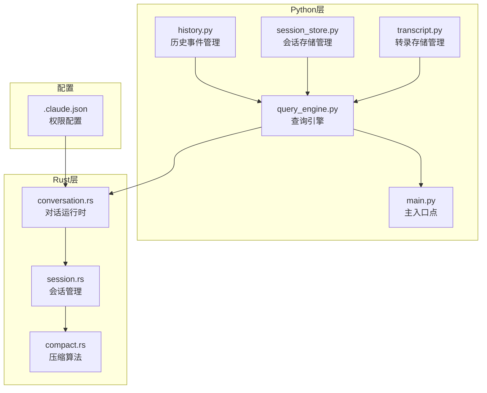
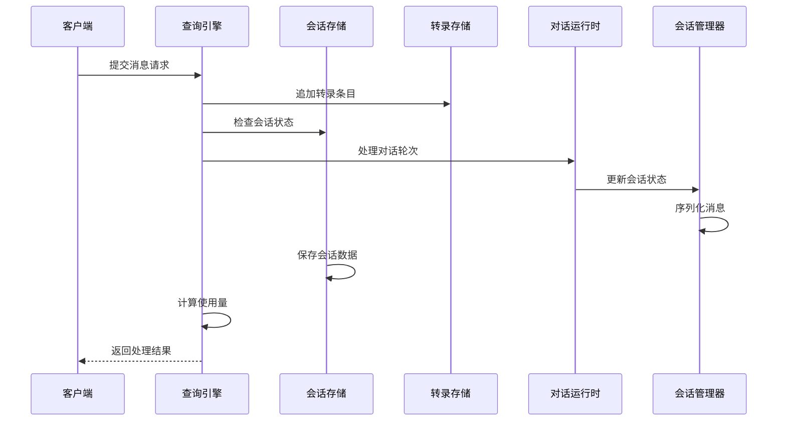
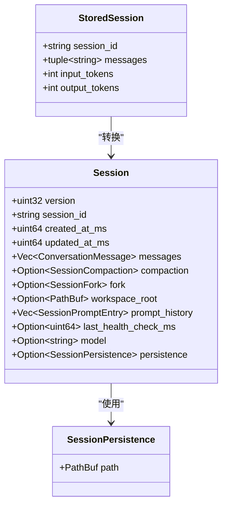
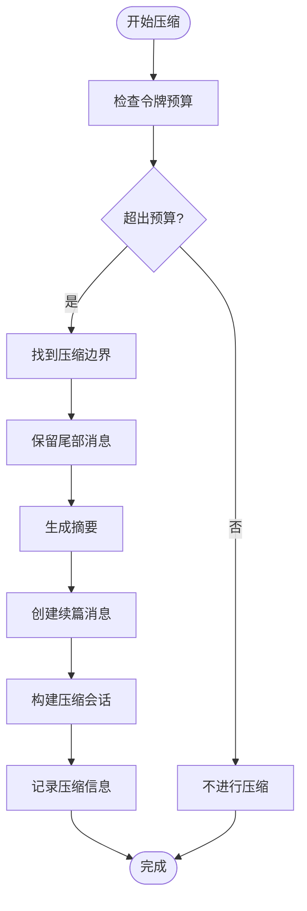
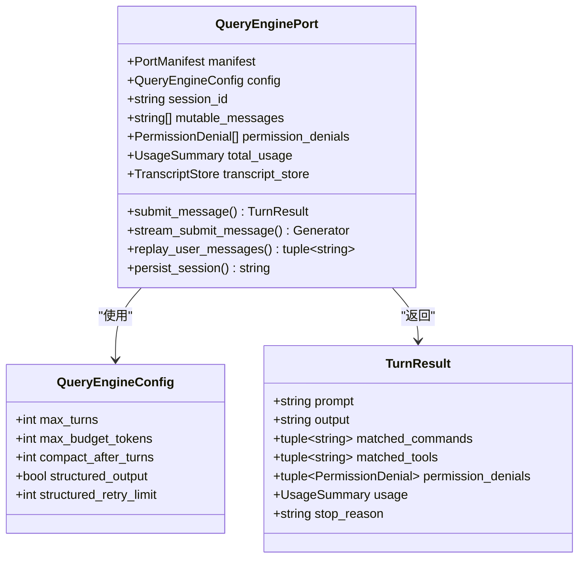
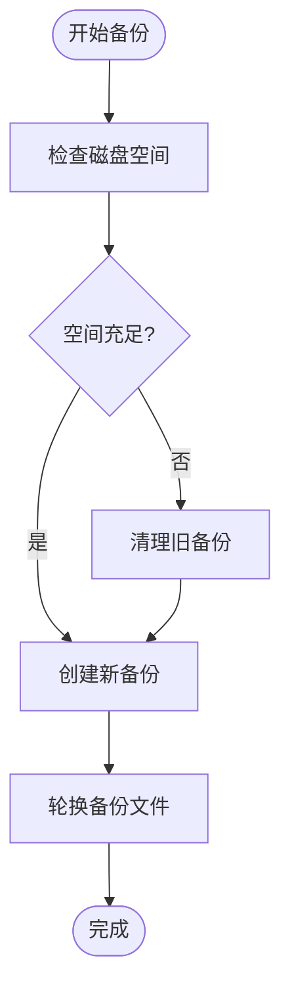
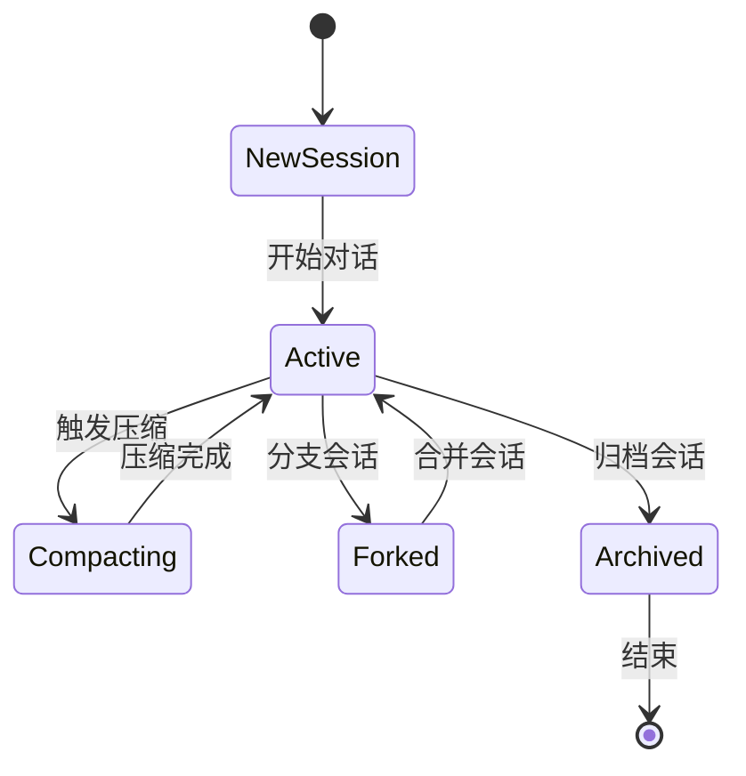
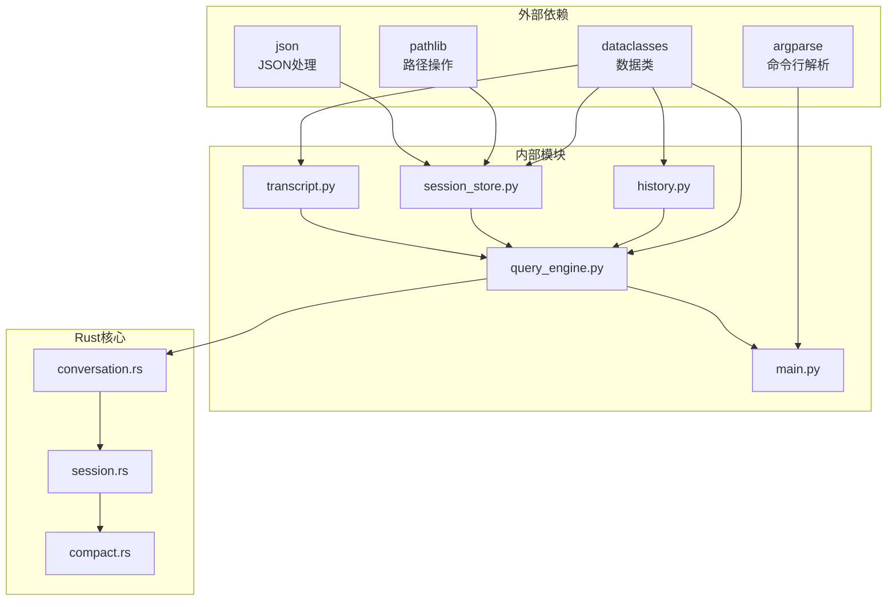

# 历史记录管理系统

<cite>
**本文档引用的文件**
- [history.py](file://src/history.py)
- [session_store.py](file://src/session_store.py)
- [transcript.py](file://src/transcript.py)
- [conversation.rs](file://rust/crates/runtime/src/conversation.rs)
- [session.rs](file://rust/crates/runtime/src/session.rs)
- [compact.rs](file://rust/crates/runtime/src/compact.rs)
- [query_engine.py](file://src/query_engine.py)
- [main.py](file://src/main.py)
- [.claude.json](file://.claude.json)
</cite>

## 目录
1. [简介](#简介)
2. [项目结构](#项目结构)
3. [核心组件](#核心组件)
4. [架构概览](#架构概览)
5. [详细组件分析](#详细组件分析)
6. [依赖关系分析](#依赖关系分析)
7. [性能考虑](#性能考虑)
8. [故障排除指南](#故障排除指南)
9. [结论](#结论)

## 简介

历史记录管理系统是Claude Code重写项目中的重要组成部分，负责管理对话历史、会话状态和消息持久化。该系统采用多语言架构，结合Python和Rust实现，提供了完整的对话历史管理功能。

系统的核心目标包括：
- 存储和管理对话历史记录
- 提供高效的消息序列化和反序列化机制
- 实现智能的历史记录压缩策略
- 支持历史记录的检索、查询和导出
- 维护会话状态的一致性和完整性

## 项目结构

历史记录管理系统分布在Python和Rust两个主要代码库中：

**图表来源**
- [history.py:1-23](file://src/history.py#L1-L23)
- [session_store.py:1-36](file://src/session_store.py#L1-L36)
- [transcript.py:1-24](file://src/transcript.py#L1-L24)
- [query_engine.py:1-194](file://src/query_engine.py#L1-L194)
- [conversation.rs:1-800](file://rust/crates/runtime/src/conversation.rs#L1-L800)
- [session.rs:1-800](file://rust/crates/runtime/src/session.rs#L1-L800)
- [compact.rs:1-800](file://rust/crates/runtime/src/compact.rs#L1-L800)

**章节来源**
- [history.py:1-23](file://src/history.py#L1-L23)
- [session_store.py:1-36](file://src/session_store.py#L1-L36)
- [transcript.py:1-24](file://src/transcript.py#L1-L24)
- [query_engine.py:1-194](file://src/query_engine.py#L1-L194)
- [conversation.rs:1-800](file://rust/crates/runtime/src/conversation.rs#L1-L800)
- [session.rs:1-800](file://rust/crates/runtime/src/session.rs#L1-L800)
- [compact.rs:1-800](file://rust/crates/runtime/src/compact.rs#L1-L800)

## 核心组件

### Python层核心组件

#### 历史事件管理器
历史事件管理器提供简单的事件记录功能，支持标题和详情的存储。

#### 会话存储管理器
会话存储管理器负责将对话会话持久化到JSON文件，支持会话的保存和加载。

#### 转录存储管理器
转录存储管理器维护对话转录的内存存储，并提供压缩和回放功能。

#### 查询引擎
查询引擎是Python层的核心组件，集成了所有历史记录管理功能，提供完整的对话历史管理能力。

**章节来源**
- [history.py:6-23](file://src/history.py#L6-L23)
- [session_store.py:8-36](file://src/session_store.py#L8-L36)
- [transcript.py:6-24](file://src/transcript.py#L6-L24)
- [query_engine.py:15-194](file://src/query_engine.py#L15-L194)

### Rust层核心组件

#### 对话运行时
对话运行时负责协调模型循环、工具执行、钩子和会话更新，是Rust层的核心组件。

#### 会话管理器
会话管理器提供完整的会话生命周期管理，包括消息存储、持久化和版本控制。

#### 压缩算法
压缩算法实现了智能的历史记录压缩策略，通过摘要生成和最近消息保留来优化存储空间。

**章节来源**
- [conversation.rs:126-139](file://rust/crates/runtime/src/conversation.rs#L126-L139)
- [session.rs:90-106](file://rust/crates/runtime/src/session.rs#L90-L106)
- [compact.rs:9-32](file://rust/crates/runtime/src/compact.rs#L9-L32)

## 架构概览

历史记录管理系统采用分层架构设计，Python层提供用户接口和业务逻辑，Rust层提供高性能的核心处理能力。

**图表来源**
- [query_engine.py:61-104](file://src/query_engine.py#L61-L104)
- [conversation.rs:314-515](file://rust/crates/runtime/src/conversation.rs#L314-L515)
- [session.rs:229-243](file://rust/crates/runtime/src/session.rs#L229-L243)

## 详细组件分析

### 会话存储系统

会话存储系统提供了完整的会话数据持久化解决方案，支持JSON格式的会话存储和加载。

#### 数据结构设计

**图表来源**
- [session_store.py:8-14](file://src/session_store.py#L8-L14)
- [session.rs:90-106](file://rust/crates/runtime/src/session.rs#L90-L106)

#### 消息序列化机制

会话存储系统实现了高效的JSON序列化机制，支持以下消息类型的序列化：

1. **用户消息**：纯文本内容
2. **助手消息**：支持文本和工具使用的复合内容
3. **工具结果**：包含工具调用结果和错误状态

**章节来源**
- [session_store.py:19-36](file://src/session_store.py#L19-L36)
- [session.rs:624-670](file://rust/crates/runtime/src/session.rs#L624-L670)

### 历史记录压缩策略

系统实现了智能的历史记录压缩算法，通过摘要生成和最近消息保留来优化存储空间。

#### 压缩配置参数

| 参数名 | 默认值 | 描述 |
|--------|--------|------|
| preserve_recent_messages | 4 | 保留的最新消息数量 |
| max_estimated_tokens | 10,000 | 最大估计令牌数 |
| compact_after_turns | 12 | 触发压缩的对话轮次数 |

#### 压缩算法流程

**图表来源**
- [compact.rs:96-183](file://rust/crates/runtime/src/compact.rs#L96-L183)

**章节来源**
- [compact.rs:9-32](file://rust/crates/runtime/src/compact.rs#L9-L32)
- [compact.rs:39-51](file://rust/crates/runtime/src/compact.rs#L39-L51)

### 时间戳管理和历史记录格式

系统提供了精确的时间戳管理机制，确保历史记录的时间顺序和可追溯性。

#### 时间戳格式

会话管理系统使用毫秒级时间戳，格式为Unix时间戳的毫秒表示。

#### 历史记录存储格式

系统支持两种存储格式：

1. **JSON格式**：完整的会话数据结构
2. **JSONL格式**：逐行记录的流式存储

**章节来源**
- [session.rs:70-74](file://rust/crates/runtime/src/session.rs#L70-L74)
- [session.rs:506-520](file://rust/crates/runtime/src/session.rs#L506-L520)

### 搜索功能和查询接口

查询引擎提供了丰富的搜索和查询功能，支持多种过滤条件和排序选项。

#### 查询接口设计

**图表来源**
- [query_engine.py:24-44](file://src/query_engine.py#L24-L44)
- [query_engine.py:15-22](file://src/query_engine.py#L15-L22)
- [query_engine.py:25-33](file://src/query_engine.py#L25-L33)

#### 过滤条件和排序选项

查询引擎支持以下过滤和排序功能：

1. **按会话ID过滤**：通过会话标识符筛选历史记录
2. **按时间范围过滤**：基于时间戳的日期范围筛选
3. **按消息类型排序**：支持按角色（用户、助手、工具）排序
4. **按使用量排序**：基于令牌使用量的排序

**章节来源**
- [query_engine.py:61-104](file://src/query_engine.py#L61-L104)
- [query_engine.py:134-136](file://src/query_engine.py#L134-L136)

### 导出格式和备份策略

系统提供了多种导出格式和备份策略，确保历史记录的安全性和可移植性。

#### 导出格式

1. **JSON格式**：完整的会话数据结构
2. **Markdown格式**：人类可读的对话摘要
3. **CSV格式**：表格化的消息列表

#### 备份策略

**图表来源**
- [session.rs:204-211](file://rust/crates/runtime/src/session.rs#L204-L211)

**章节来源**
- [session.rs:13-14](file://rust/crates/runtime/src/session.rs#L13-L14)
- [session.rs:204-211](file://rust/crates/runtime/src/session.rs#L204-L211)

### 会话状态关系和版本控制

系统实现了完整的会话状态管理和版本控制机制，确保历史记录的一致性和可恢复性。

#### 版本控制机制

**图表来源**
- [session.rs:259-279](file://rust/crates/runtime/src/session.rs#L259-L279)

#### 一致性保证

系统通过以下机制保证历史记录的一致性：

1. **原子操作**：所有写入操作都是原子性的
2. **事务日志**：使用JSONL格式确保数据完整性
3. **健康检查**：定期执行会话健康检查
4. **错误恢复**：提供自动错误恢复机制

**章节来源**
- [session.rs:125-144](file://rust/crates/runtime/src/session.rs#L125-L144)
- [conversation.rs:295-311](file://rust/crates/runtime/src/conversation.rs#L295-L311)

## 依赖关系分析

历史记录管理系统具有清晰的模块化依赖关系，各组件之间通过明确定义的接口进行交互。

**图表来源**
- [main.py:1-214](file://src/main.py#L1-L214)
- [query_engine.py:1-194](file://src/query_engine.py#L1-L194)
- [conversation.rs:1-800](file://rust/crates/runtime/src/conversation.rs#L1-L800)

**章节来源**
- [main.py:1-214](file://src/main.py#L1-L214)
- [query_engine.py:1-194](file://src/query_engine.py#L1-L194)

## 性能考虑

历史记录管理系统在设计时充分考虑了性能优化，采用了多种策略来提高系统的响应速度和资源利用率。

### 内存管理策略

1. **增量存储**：转录存储采用增量方式，避免一次性加载大量数据
2. **智能压缩**：根据对话轮次数触发压缩，平衡存储空间和性能
3. **缓存机制**：频繁访问的数据保持在内存中

### I/O优化

1. **批量写入**：合并多个小的写入操作为批量写入
2. **异步处理**：后台处理非关键的I/O操作
3. **文件轮换**：限制单个文件大小，避免I/O瓶颈

### 计算优化

1. **令牌估算**：使用快速估算算法判断是否需要压缩
2. **增量计算**：只计算变化的部分，避免全量重新计算
3. **并行处理**：利用多核处理器并行处理独立任务

## 故障排除指南

### 常见问题和解决方案

#### 会话加载失败

**症状**：尝试加载会话时出现错误
**原因**：文件损坏或格式不正确
**解决方案**：
1. 检查文件是否存在且可读
2. 验证JSON格式的有效性
3. 尝试从备份文件恢复

#### 压缩异常

**症状**：压缩过程中出现错误
**原因**：消息格式不兼容或令牌估算错误
**解决方案**：
1. 检查消息内容的完整性
2. 验证工具使用和结果配对
3. 手动调整压缩参数

#### 存储空间不足

**症状**：无法保存新的会话数据
**原因**：磁盘空间不足
**解决方案**：
1. 清理旧的备份文件
2. 调整轮换策略
3. 增加存储空间

**章节来源**
- [session.rs:125-144](file://rust/crates/runtime/src/session.rs#L125-L144)
- [compact.rs:554-552](file://rust/crates/runtime/src/compact.rs#L554-L552)

## 结论

历史记录管理系统是一个功能完整、设计合理的对话历史管理解决方案。系统通过Python和Rust的协同工作，实现了高性能、高可靠性的历史记录管理功能。

### 主要优势

1. **多语言架构**：结合Python的易用性和Rust的高性能
2. **智能压缩**：有效的存储空间优化策略
3. **完整备份**：可靠的备份和恢复机制
4. **灵活查询**：强大的搜索和过滤功能
5. **版本控制**：完善的会话状态管理

### 技术特色

1. **时间戳管理**：精确的时间戳记录和管理
2. **消息序列化**：高效的JSON序列化机制
3. **会话分支**：支持会话的创建和合并
4. **健康检查**：自动的会话状态验证
5. **错误恢复**：完善的错误处理和恢复机制

该系统为Claude Code重写项目提供了坚实的历史记录管理基础，能够满足复杂对话场景下的各种需求。