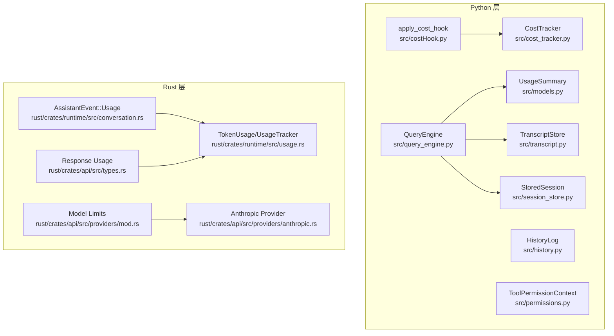
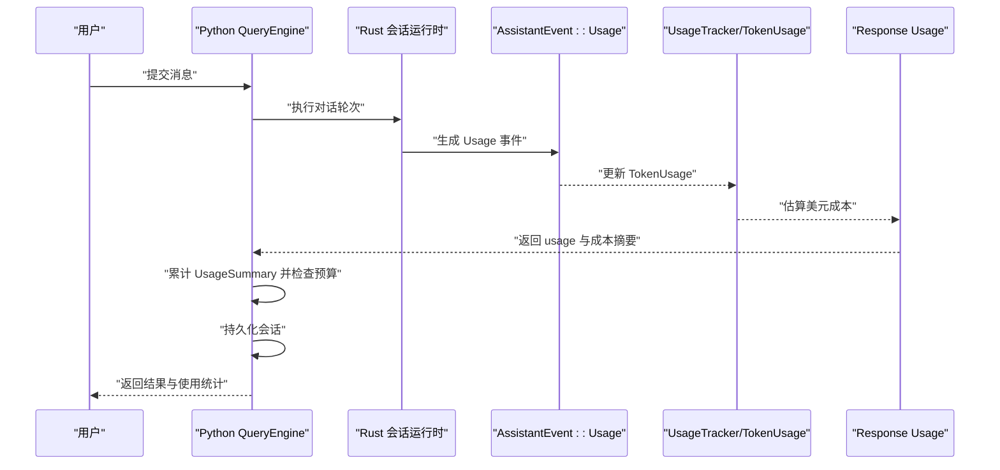
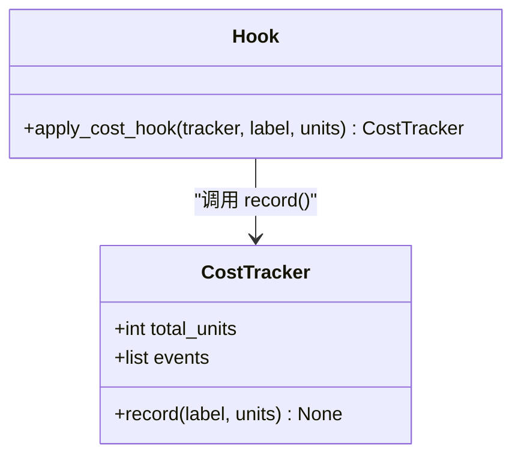
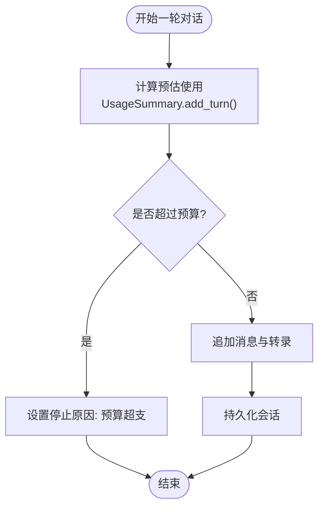
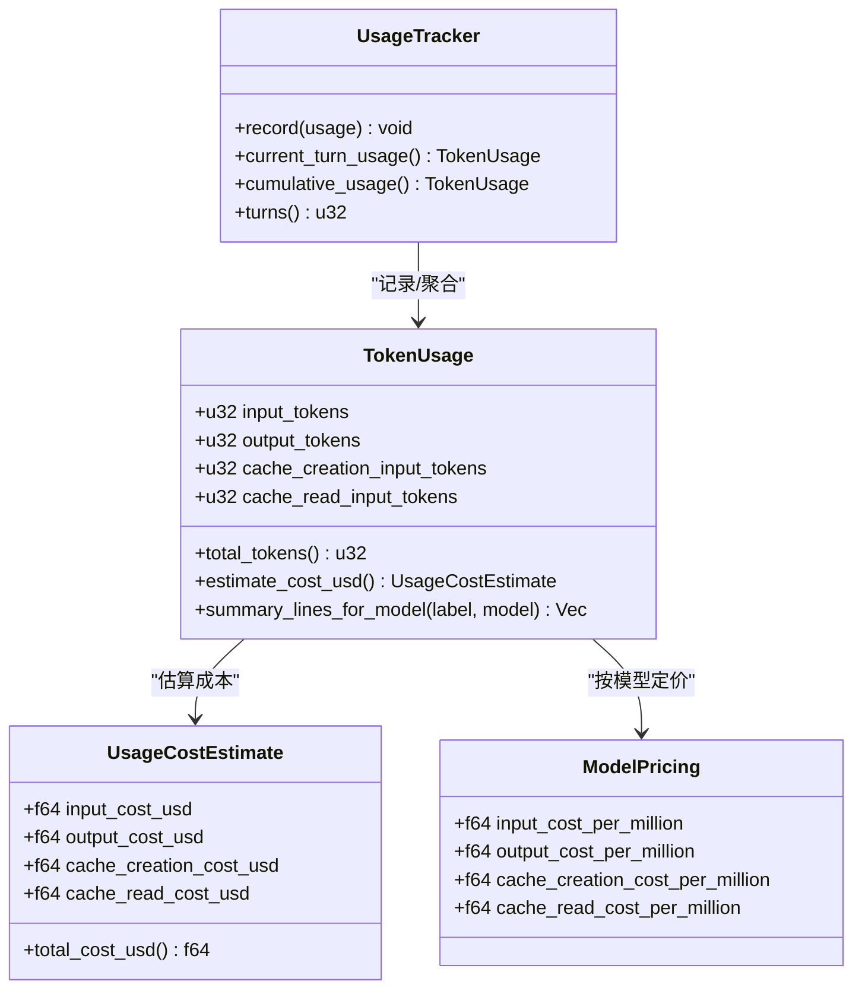
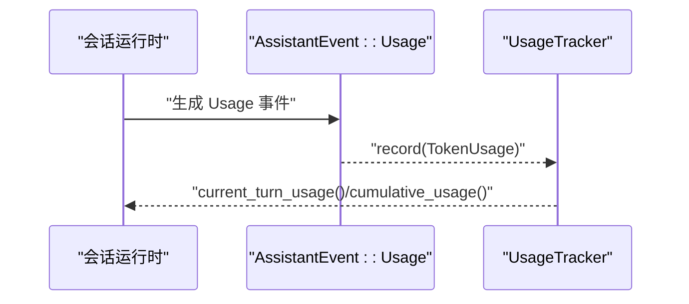
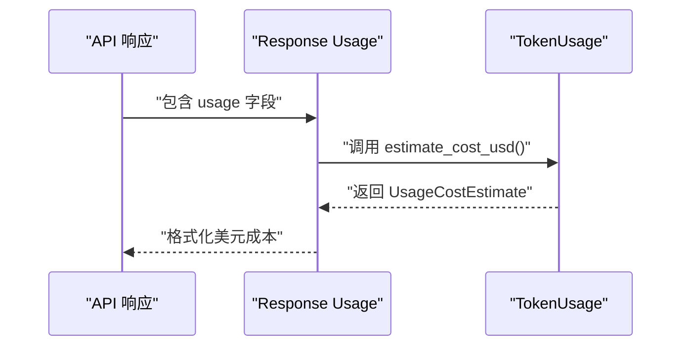
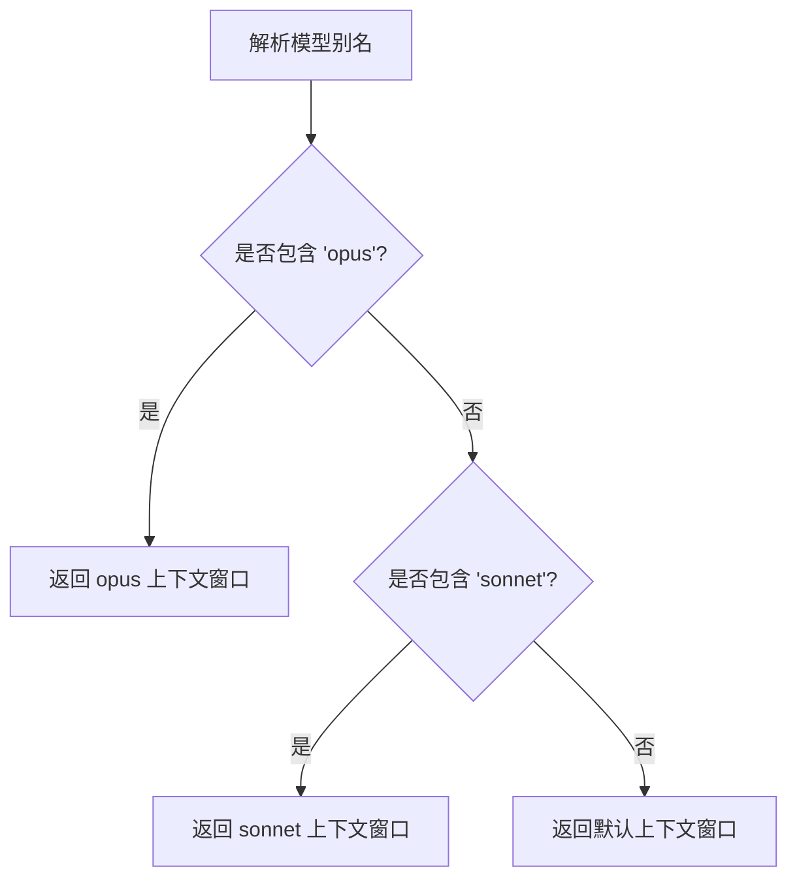
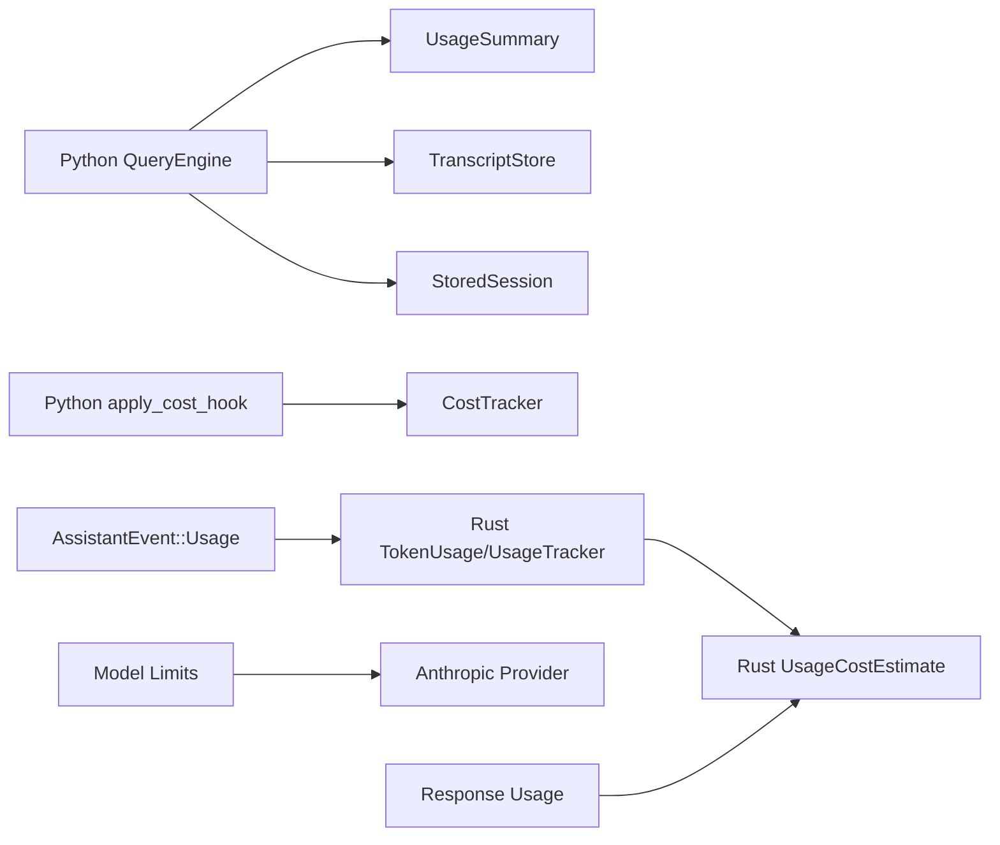

# 成本统计

<cite>
**本文引用的文件**
- [cost_tracker.py](file://src/cost_tracker.py)
- [costHook.py](file://src/costHook.py)
- [models.py](file://src/models.py)
- [query_engine.py](file://src/query_engine.py)
- [session_store.py](file://src/session_store.py)
- [transcript.py](file://src/transcript.py)
- [history.py](file://src/history.py)
- [permissions.py](file://src/permissions.py)
- [usage.rs](file://rust/crates/runtime/src/usage.rs)
- [conversation.rs](file://rust/crates/runtime/src/conversation.rs)
- [types.rs](file://rust/crates/api/src/types.rs)
- [mod.rs](file://rust/crates/api/src/providers/mod.rs)
- [anthropic.rs](file://rust/crates/api/src/providers/anthropic.rs)
</cite>

## 目录
1. [引言](#引言)
2. [项目结构](#项目结构)
3. [核心组件](#核心组件)
4. [架构总览](#架构总览)
5. [详细组件分析](#详细组件分析)
6. [依赖分析](#依赖分析)
7. [性能考虑](#性能考虑)
8. [故障排查指南](#故障排查指南)
9. [结论](#结论)
10. [附录](#附录)

## 引言
本文件面向“会话成本统计系统”，围绕以下目标展开：解释令牌消耗计算方法、成本追踪机制与费用统计功能；明确输入/输出令牌计量方式、不同模型的成本差异与定价映射；给出成本报告生成、预算控制与超支预警的实现路径；提供成本优化建议、使用模式分析与趋势预测思路；阐述成本统计与权限控制的关系，以及成本数据的安全存储与隐私保护要点。  
该系统在 Python 层提供轻量级成本跟踪（单位计数），在 Rust 层提供基于令牌用量的美元成本估算与会话级累计统计，并通过会话存档与转录记录形成可审计的成本数据链路。

## 项目结构
围绕成本统计的关键文件分布如下：
- Python 层
  - 成本跟踪器与钩子：src/cost_tracker.py、src/costHook.py
  - 使用统计模型：src/models.py（UsageSummary）
  - 会话预算与使用汇总：src/query_engine.py
  - 会话持久化：src/session_store.py
  - 转录与历史：src/transcript.py、src/history.py
  - 权限上下文：src/permissions.py
- Rust 层
  - 令牌用量与成本估算：rust/crates/runtime/src/usage.rs
  - 会话事件与用量上报：rust/crates/runtime/src/conversation.rs
  - 类型与用量扩展：rust/crates/api/src/types.rs
  - 模型限额与上下文窗口：rust/crates/api/src/providers/mod.rs、anthropic.rs

图表来源
- [cost_tracker.py:1-14](file://src/cost_tracker.py#L1-L14)
- [costHook.py:1-9](file://src/costHook.py#L1-L9)
- [models.py:28-38](file://src/models.py#L28-L38)
- [query_engine.py:35-44](file://src/query_engine.py#L35-L44)
- [session_store.py:8-36](file://src/session_store.py#L8-L36)
- [transcript.py:6-23](file://src/transcript.py#L6-L23)
- [history.py:6-23](file://src/history.py#L6-L23)
- [permissions.py:6-21](file://src/permissions.py#L6-L21)
- [usage.rs:29-155](file://rust/crates/runtime/src/usage.rs#L29-L155)
- [conversation.rs:1568-1580](file://rust/crates/runtime/src/conversation.rs#L1568-L1580)
- [types.rs:297-310](file://rust/crates/api/src/types.rs#L297-L310)
- [mod.rs:229-269](file://rust/crates/api/src/providers/mod.rs#L229-L269)
- [anthropic.rs:503-536](file://rust/crates/api/src/providers/anthropic.rs#L503-L536)

章节来源
- [cost_tracker.py:1-14](file://src/cost_tracker.py#L1-L14)
- [costHook.py:1-9](file://src/costHook.py#L1-L9)
- [models.py:28-38](file://src/models.py#L28-L38)
- [query_engine.py:35-44](file://src/query_engine.py#L35-L44)
- [session_store.py:8-36](file://src/session_store.py#L8-L36)
- [transcript.py:6-23](file://src/transcript.py#L6-L23)
- [history.py:6-23](file://src/history.py#L6-L23)
- [permissions.py:6-21](file://src/permissions.py#L6-L21)
- [usage.rs:29-155](file://rust/crates/runtime/src/usage.rs#L29-L155)
- [conversation.rs:1568-1580](file://rust/crates/runtime/src/conversation.rs#L1568-L1580)
- [types.rs:297-310](file://rust/crates/api/src/types.rs#L297-L310)
- [mod.rs:229-269](file://rust/crates/api/src/providers/mod.rs#L229-L269)
- [anthropic.rs:503-536](file://rust/crates/api/src/providers/anthropic.rs#L503-L536)

## 核心组件
- 成本跟踪器（Python）：提供单位计数与事件记录能力，便于在业务流程中插入成本钩子。
- 成本钩子（Python）：封装对 CostTracker 的调用，统一记录标签与单位。
- 使用统计模型（Python）：以词为粒度估算输入/输出令牌，配合预算控制。
- 会话引擎（Python）：维护会话状态、累计使用、预算检查与会话持久化。
- 令牌用量与成本估算（Rust）：定义 TokenUsage、UsageTracker 与 UsageCostEstimate，支持按模型定价估算。
- 会话事件（Rust）：在对话轮次结束时上报 TokenUsage，驱动成本统计。
- 类型与用量扩展（Rust）：对外响应体中的 usage 字段支持成本估算展示。
- 模型限额与上下文窗口（Rust）：提供模型最大输出与上下文窗口限制，辅助预算与超支预警。

章节来源
- [cost_tracker.py:6-14](file://src/cost_tracker.py#L6-L14)
- [costHook.py:6-8](file://src/costHook.py#L6-L8)
- [models.py:28-38](file://src/models.py#L28-L38)
- [query_engine.py:15-44](file://src/query_engine.py#L15-L44)
- [usage.rs:29-155](file://rust/crates/runtime/src/usage.rs#L29-L155)
- [conversation.rs:1568-1580](file://rust/crates/runtime/src/conversation.rs#L1568-L1580)
- [types.rs:297-310](file://rust/crates/api/src/types.rs#L297-L310)
- [mod.rs:229-269](file://rust/crates/api/src/providers/mod.rs#L229-L269)

## 架构总览
系统采用“Python 会话编排 + Rust 成本估算”的双层架构：
- Python 层负责会话生命周期、预算控制、转录与持久化；
- Rust 层负责精确的令牌用量统计与成本估算，并在会话事件中上报；
- 两者通过会话消息中的 usage 字段衔接，最终形成可审计的成本数据。

图表来源
- [query_engine.py:61-104](file://src/query_engine.py#L61-L104)
- [conversation.rs:1568-1580](file://rust/crates/runtime/src/conversation.rs#L1568-L1580)
- [usage.rs:83-155](file://rust/crates/runtime/src/usage.rs#L83-L155)
- [types.rs:297-310](file://rust/crates/api/src/types.rs#L297-L310)

## 详细组件分析

### 组件一：Python 成本跟踪与钩子
- CostTracker：记录累计单位与事件日志，支持标签化记录。
- apply_cost_hook：统一的成本钩子入口，便于在任意业务点插入成本记录。

图表来源
- [cost_tracker.py:6-14](file://src/cost_tracker.py#L6-L14)
- [costHook.py:6-8](file://src/costHook.py#L6-L8)

章节来源
- [cost_tracker.py:6-14](file://src/cost_tracker.py#L6-L14)
- [costHook.py:6-8](file://src/costHook.py#L6-L8)

### 组件二：Python 使用统计与预算控制
- UsageSummary：以词数粗略估算输入/输出令牌，提供累加接口。
- QueryEngine：维护会话状态、累计使用、预算检查、转录与持久化。

图表来源
- [models.py:33-37](file://src/models.py#L33-L37)
- [query_engine.py:87-95](file://src/query_engine.py#L87-L95)
- [query_engine.py:140-150](file://src/query_engine.py#L140-L150)

章节来源
- [models.py:28-38](file://src/models.py#L28-L38)
- [query_engine.py:15-44](file://src/query_engine.py#L15-L44)
- [query_engine.py:87-95](file://src/query_engine.py#L87-L95)
- [query_engine.py:140-150](file://src/query_engine.py#L140-L150)

### 组件三：Rust 令牌用量与成本估算
- TokenUsage：记录输入/输出/缓存写入/缓存读取令牌。
- UsageTracker：聚合单轮与累计用量，统计轮次。
- UsageCostEstimate：按模型定价估算美元成本，支持默认与特定模型定价。
- pricing_for_model：根据模型名推断定价，Haiku/Opus/Sonnet 等。

图表来源
- [usage.rs:29-155](file://rust/crates/runtime/src/usage.rs#L29-L155)

章节来源
- [usage.rs:29-155](file://rust/crates/runtime/src/usage.rs#L29-L155)

### 组件四：会话事件与成本上报
- AssistantEvent::Usage：在对话轮次结束时上报 TokenUsage。
- 会话运行时：从消息中重建 UsageTracker，用于成本汇总与报告。

图表来源
- [conversation.rs:1568-1580](file://rust/crates/runtime/src/conversation.rs#L1568-L1580)
- [usage.rs:182-199](file://rust/crates/runtime/src/usage.rs#L182-L199)

章节来源
- [conversation.rs:1568-1580](file://rust/crates/runtime/src/conversation.rs#L1568-L1580)
- [usage.rs:182-199](file://rust/crates/runtime/src/usage.rs#L182-L199)

### 组件五：类型与用量扩展（响应体）
- 响应体 usage 字段支持直接估算美元成本，便于前端或 CLI 展示。

图表来源
- [types.rs:297-310](file://rust/crates/api/src/types.rs#L297-L310)
- [usage.rs:92-111](file://rust/crates/runtime/src/usage.rs#L92-L111)

章节来源
- [types.rs:297-310](file://rust/crates/api/src/types.rs#L297-L310)
- [usage.rs:92-111](file://rust/crates/runtime/src/usage.rs#L92-L111)

### 组件六：模型限额与上下文窗口（预算前置控制）
- 提供模型最大输出与上下文窗口限制，可在请求前进行预算校验，避免超支。

图表来源
- [mod.rs:255-269](file://rust/crates/api/src/providers/mod.rs#L255-L269)

章节来源
- [mod.rs:232-252](file://rust/crates/api/src/providers/mod.rs#L232-L252)
- [mod.rs:255-269](file://rust/crates/api/src/providers/mod.rs#L255-L269)

## 依赖分析
- Python 层内部耦合
  - QueryEngine 依赖 UsageSummary 进行预算控制与累计统计。
  - QueryEngine 依赖 TranscriptStore 与 StoredSession 进行会话持久化。
  - Python 成本钩子依赖 CostTracker。
- Rust 层内部耦合
  - TokenUsage 与 UsageTracker 互相协作，前者承载用量，后者聚合统计。
  - UsageCostEstimate 依赖 ModelPricing，后者由模型名推断。
  - 会话事件（AssistantEvent::Usage）向 UsageTracker 注入 TokenUsage。
- 跨语言交互
  - Rust 侧的 TokenUsage 通过会话消息携带，Python 侧的 UsageSummary 作为预算控制依据；二者在会话存档中共同构成成本数据链路。

图表来源
- [query_engine.py:35-44](file://src/query_engine.py#L35-L44)
- [session_store.py:8-36](file://src/session_store.py#L8-L36)
- [transcript.py:6-23](file://src/transcript.py#L6-L23)
- [costHook.py:6-8](file://src/costHook.py#L6-L8)
- [cost_tracker.py:6-14](file://src/cost_tracker.py#L6-L14)
- [usage.rs:29-155](file://rust/crates/runtime/src/usage.rs#L29-L155)
- [conversation.rs:1568-1580](file://rust/crates/runtime/src/conversation.rs#L1568-L1580)
- [types.rs:297-310](file://rust/crates/api/src/types.rs#L297-L310)
- [mod.rs:229-269](file://rust/crates/api/src/providers/mod.rs#L229-L269)
- [anthropic.rs:503-536](file://rust/crates/api/src/providers/anthropic.rs#L503-L536)

章节来源
- [query_engine.py:35-44](file://src/query_engine.py#L35-L44)
- [session_store.py:8-36](file://src/session_store.py#L8-L36)
- [transcript.py:6-23](file://src/transcript.py#L6-L23)
- [costHook.py:6-8](file://src/costHook.py#L6-L8)
- [cost_tracker.py:6-14](file://src/cost_tracker.py#L6-L14)
- [usage.rs:29-155](file://rust/crates/runtime/src/usage.rs#L29-L155)
- [conversation.rs:1568-1580](file://rust/crates/runtime/src/conversation.rs#L1568-L1580)
- [types.rs:297-310](file://rust/crates/api/src/types.rs#L297-L310)
- [mod.rs:229-269](file://rust/crates/api/src/providers/mod.rs#L229-L269)
- [anthropic.rs:503-536](file://rust/crates/api/src/providers/anthropic.rs#L503-L536)

## 性能考虑
- 令牌估算（Python）：以词为粒度估算，简单高效但不够精确；适合预算控制与快速预警。
- 成本估算（Rust）：基于模型定价与精确令牌计数，开销低且可扩展。
- 会话压缩：当会话长度超过阈值时，仅保留最近若干条消息，降低后续统计与持久化成本。
- 预算前置控制：在请求前检查上下文窗口与输出上限，减少无效调用。

章节来源
- [models.py:33-37](file://src/models.py#L33-L37)
- [usage.rs:157-159](file://rust/crates/runtime/src/usage.rs#L157-L159)
- [query_engine.py:129-132](file://src/query_engine.py#L129-L132)
- [mod.rs:232-252](file://rust/crates/api/src/providers/mod.rs#L232-L252)

## 故障排查指南
- 预算超支
  - 现象：stop_reason 标记为“max_budget_reached”。
  - 排查：检查 UsageSummary 的累计输入/输出令牌与 max_budget_tokens 设置。
- 会话持久化失败
  - 现象：保存会话异常或文件未生成。
  - 排查：确认目录权限、磁盘空间与序列化字段完整性。
- 成本估算不准确
  - 现象：模型未知导致使用默认定价后估算偏差较大。
  - 排查：确保传入正确的模型名称，或显式提供模型定价。
- 上下文窗口超限
  - 现象：请求被拒绝并提示上下文窗口超限。
  - 排查：检查模型别名解析与上下文窗口限制，必要时调整请求参数。

章节来源
- [query_engine.py:89-90](file://src/query_engine.py#L89-L90)
- [session_store.py:19-36](file://src/session_store.py#L19-L36)
- [usage.rs:118-133](file://rust/crates/runtime/src/usage.rs#L118-L133)
- [anthropic.rs:509-517](file://rust/crates/api/src/providers/anthropic.rs#L509-L517)

## 结论
本系统通过 Python 层的预算控制与会话管理，结合 Rust 层的精确令牌统计与成本估算，形成了完整的会话成本统计闭环。Python 侧提供灵活的成本钩子与会话持久化，Rust 侧提供高精度的成本估算与会话事件上报。两者协同实现了预算控制、超支预警、成本报告与会话审计等核心能力。

## 附录

### 令牌消耗计算方法
- 输入令牌：以词为单位估算（Python），或以实际计数为准（Rust）。
- 输出令牌：以词为单位估算（Python），或以实际计数为准（Rust）。
- 缓存写入/读取：Rust 侧独立统计，纳入成本估算。

章节来源
- [models.py:33-37](file://src/models.py#L33-L37)
- [usage.rs:29-36](file://rust/crates/runtime/src/usage.rs#L29-L36)

### 成本追踪机制与费用统计
- Rust 侧：TokenUsage 累积到 UsageTracker，按模型定价估算美元成本。
- Python 侧：UsageSummary 用于预算控制与会话摘要。

章节来源
- [usage.rs:168-215](file://rust/crates/runtime/src/usage.rs#L168-L215)
- [models.py:28-38](file://src/models.py#L28-L38)

### 不同模型的成本差异与定价映射
- Haiku/Opus/Sonnet：按模型名自动匹配定价；未知模型使用默认定价并标注回退。

章节来源
- [usage.rs:58-81](file://rust/crates/runtime/src/usage.rs#L58-L81)
- [usage.rs:118-133](file://rust/crates/runtime/src/usage.rs#L118-L133)

### 成本报告生成、预算控制与超支预警
- 报告：TokenUsage.summary_lines_for_model 输出总令牌、分项令牌与美元成本。
- 预算：QueryEngine 在每轮后累加 UsageSummary 并检查 max_budget_tokens。
- 预警：stop_reason 标识预算超支。

章节来源
- [usage.rs:113-154](file://rust/crates/runtime/src/usage.rs#L113-L154)
- [query_engine.py:87-95](file://src/query_engine.py#L87-L95)

### 成本优化建议、使用模式分析与趋势预测
- 优化建议
  - 优先选择更低成本模型（如 Haiku）处理非关键任务。
  - 控制上下文长度，启用会话压缩以降低输入令牌。
  - 合理设置 max_budget_tokens 与 max_turns，避免无效轮次。
- 使用模式分析
  - 通过 UsageTracker.cumulative_usage 与 turns 统计长期趋势。
- 趋势预测
  - 基于历史 TokenUsage 与 UsageCostEstimate 的增长曲线，预测未来成本。

章节来源
- [usage.rs:168-215](file://rust/crates/runtime/src/usage.rs#L168-L215)
- [query_engine.py:171-193](file://src/query_engine.py#L171-L193)

### 成本统计与权限控制的关系
- 权限上下文（ToolPermissionContext）影响工具调用成功率，间接影响输出长度与成本。
- 成本统计与权限控制解耦：前者关注用量与费用，后者关注访问控制。

章节来源
- [permissions.py:6-21](file://src/permissions.py#L6-L21)

### 成本数据的安全存储与隐私保护
- 会话持久化：StoredSession 将会话与使用统计写入 JSON 文件，便于审计与复盘。
- 转录与历史：TranscriptStore 与 HistoryLog 记录交互过程，需注意敏感信息脱敏。
- 建议
  - 对包含敏感信息的转录内容进行脱敏处理。
  - 限制会话文件访问权限，定期清理过期会话。
  - 在导出报告时去除个人身份信息。

章节来源
- [session_store.py:8-36](file://src/session_store.py#L8-L36)
- [transcript.py:6-23](file://src/transcript.py#L6-L23)
- [history.py:12-23](file://src/history.py#L12-L23)