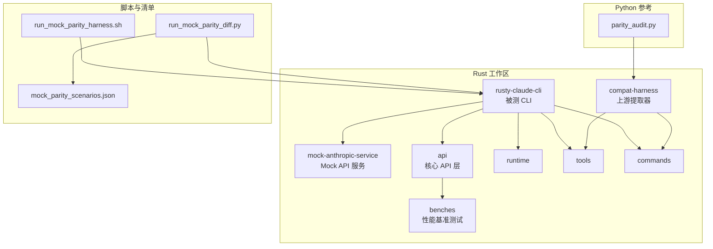
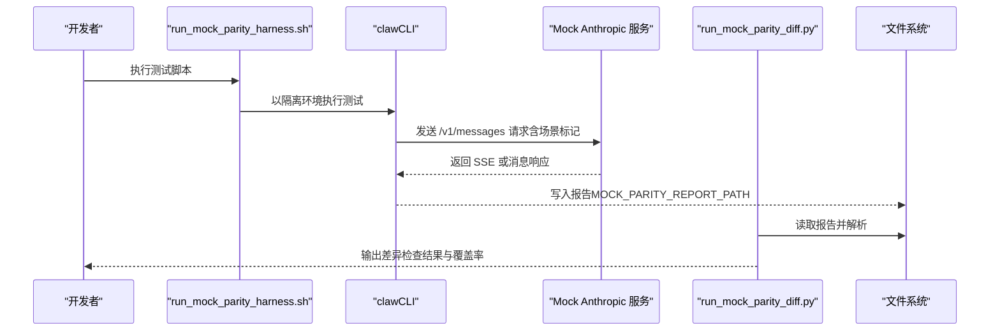
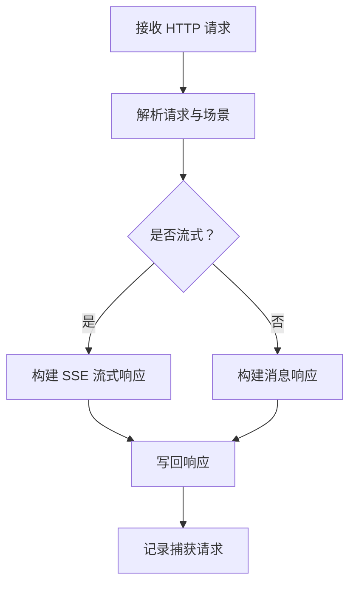
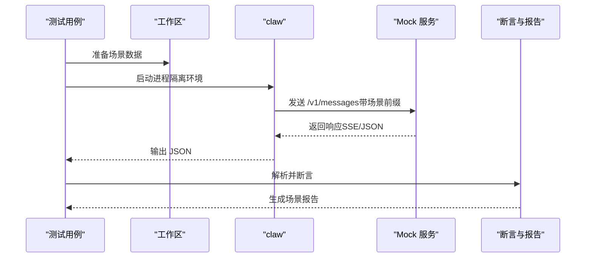
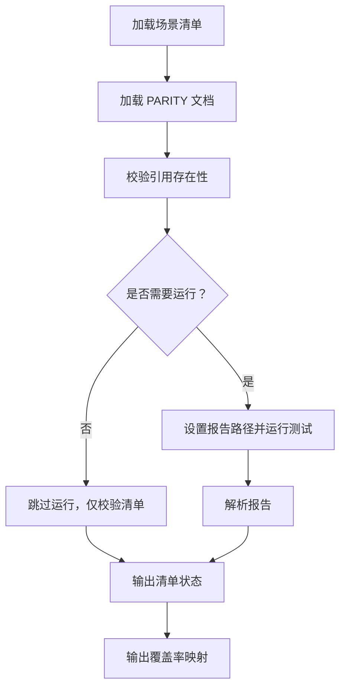
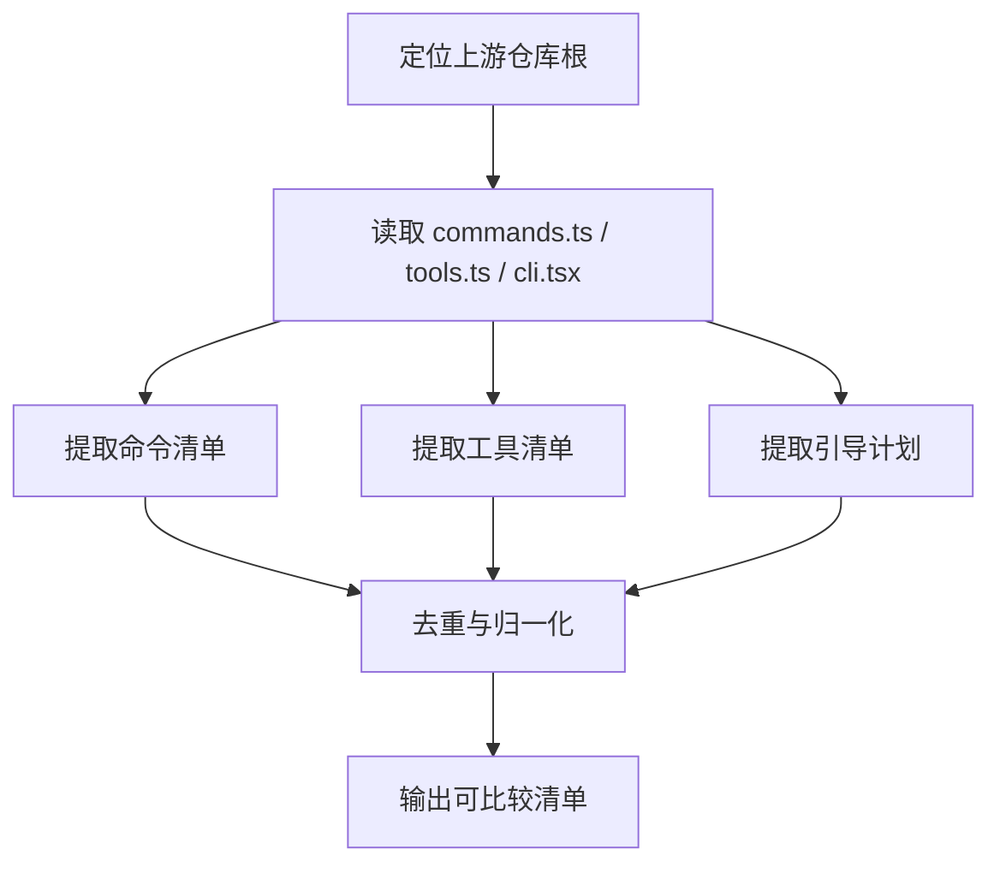
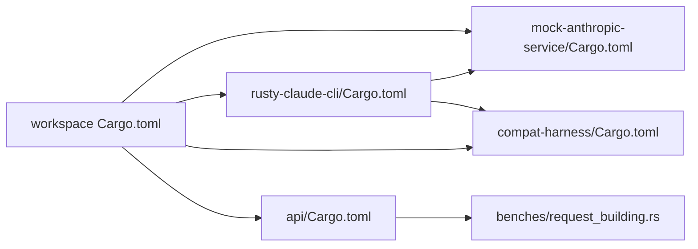

# 兼容性测试

<cite>
**本文引用的文件**
- [PARITY.md](file://PARITY.md)
- [MOCK_PARITY_HARNESS.md](file://rust/MOCK_PARITY_HARNESS.md)
- [mock_parity_scenarios.json](file://rust/mock_parity_scenarios.json)
- [run_mock_parity_harness.sh](file://rust/scripts/run_mock_parity_harness.sh)
- [run_mock_parity_diff.py](file://rust/scripts/run_mock_parity_diff.py)
- [mock_parity_harness.rs](file://rust/crates/rusty-claude-cli/tests/mock_parity_harness.rs)
- [lib.rs（mock-anthropic-service）](file://rust/crates/mock-anthropic-service/src/lib.rs)
- [main.rs（mock-anthropic-service）](file://rust/crates/mock-anthropic-service/src/main.rs)
- [lib.rs（compat-harness）](file://rust/crates/compat-harness/src/lib.rs)
- [Cargo.toml（workspace）](file://rust/Cargo.toml)
- [Cargo.toml（mock-anthropic-service）](file://rust/crates/mock-anthropic-service/Cargo.toml)
- [Cargo.toml（rusty-claude-cli）](file://rust/crates/rusty-claude-cli/Cargo.toml)
- [Cargo.toml（compat-harness）](file://rust/crates/compat-harness/Cargo.toml)
- [request_building.rs](file://rust/crates/api/benches/request_building.rs)
- [Cargo.toml（api）](file://rust/crates/api/Cargo.toml)
- [parity_audit.py](file://src/parity_audit.py)
</cite>

## 更新摘要
**变更内容**
- 新增性能基准测试套件章节，详细介绍请求构建性能优化
- 更新性能考量部分，包含 Criterion 基准测试框架的集成
- 新增性能基准测试结果分析和优化策略
- 扩展质量保证最佳实践，增加性能基准测试相关内容

## 目录
1. [简介](#简介)
2. [项目结构](#项目结构)
3. [核心组件](#核心组件)
4. [架构总览](#架构总览)
5. [详细组件分析](#详细组件分析)
6. [依赖关系分析](#依赖关系分析)
7. [性能基准测试](#性能基准测试)
8. [性能考量](#性能考量)
9. [故障排查指南](#故障排查指南)
10. [结论](#结论)
11. [附录](#附录)

## 简介
本文件系统化阐述兼容性测试体系，覆盖端到端测试框架、Mock 服务与一致性验证机制，详解 Parity Harness 的工作原理、测试场景与验证标准，并给出测试用例设计、自动化与回归策略、测试环境搭建、测试数据管理与报告生成指南。同时提供与参考 Python 实现的对比验证方法与差异分析路径，以及测试覆盖率、性能基准与质量保证的最佳实践。

**更新** 新增性能基准测试套件，专门针对请求构建性能进行优化和监控。

## 项目结构
兼容性测试相关模块分布于 Rust 工作区与 Python 参考实现中，核心包括：
- Rust 工作区（多 crate）
  - mock-anthropic-service：Anthropic 兼容的 Mock API 服务，支持 SSE 流式与消息响应
  - rusty-claude-cli：被测 CLI，通过环境变量与参数驱动不同权限模式与工具集
  - compat-harness：上游（TypeScript）命令/工具/引导计划提取器，用于对比验证
  - api：核心 API 层，包含性能基准测试套件
  - runtime、tools、commands 等：运行时与工具表面实现
- 脚本与清单
  - mock_parity_scenarios.json：测试场景清单与 PARITY 引用映射
  - run_mock_parity_harness.sh：一键运行端到端测试
  - run_mock_parity_diff.py：行为检查清单与差异报告生成器
- Python 参考实现
  - parity_audit.py：基于快照的 Python 化参考数据审计脚本

**图表来源**
- [run_mock_parity_harness.sh:1-7](file://rust/scripts/run_mock_parity_harness.sh#L1-L7)
- [run_mock_parity_diff.py:1-131](file://rust/scripts/run_mock_parity_diff.py#L1-L131)
- [mock_parity_scenarios.json:1-110](file://rust/mock_parity_scenarios.json#L1-L110)
- [lib.rs（mock-anthropic-service）:1-120](file://rust/crates/mock-anthropic-service/src/lib.rs#L1-L120)
- [lib.rs（compat-harness）:1-120](file://rust/crates/compat-harness/src/lib.rs#L1-L120)
- [request_building.rs:1-330](file://rust/crates/api/benches/request_building.rs#L1-L330)
- [parity_audit.py:1-139](file://src/parity_audit.py#L1-L139)

**章节来源**
- [Cargo.toml（workspace）:1-23](file://rust/Cargo.toml#L1-L23)
- [MOCK_PARITY_HARNESS.md:1-50](file://rust/MOCK_PARITY_HARNESS.md#L1-L50)
- [PARITY.md:1-188](file://PARITY.md#L1-L188)

## 核心组件
- Mock Anthropic 服务
  - 提供 /v1/messages 的流式（SSE）与非流式响应，按场景动态生成内容
  - 记录请求以进行数量与顺序校验
- Parity Harness（Rust）
  - 清洗环境的 CLI 端到端测试，针对 10 个脚本化场景
  - 验证工具调用、权限提示、插件路径、会话压缩与计费上报等
- 行为差异检查器
  - 读取场景清单与 PARITY 文档，输出覆盖率与差异报告
- 上游提取器（compat-harness）
  - 解析 TypeScript 命令/工具/引导计划，生成可比对的清单
- 参考审计（parity_audit.py）
  - 对比当前 Python 化实现与历史快照，统计覆盖率与缺失项
- **性能基准测试套件（新增）**
  - 使用 Criterion 框架对请求构建性能进行全面基准测试
  - 包含 translate_message、build_chat_completion_request、flatten_tool_result_content 等关键函数的性能评估

**章节来源**
- [lib.rs（mock-anthropic-service）:1-120](file://rust/crates/mock-anthropic-service/src/lib.rs#L1-L120)
- [mock_parity_harness.rs:1-247](file://rust/crates/rusty-claude-cli/tests/mock_parity_harness.rs#L1-L247)
- [run_mock_parity_diff.py:1-131](file://rust/scripts/run_mock_parity_diff.py#L1-L131)
- [lib.rs（compat-harness）:1-120](file://rust/crates/compat-harness/src/lib.rs#L1-L120)
- [parity_audit.py:1-139](file://src/parity_audit.py#L1-L139)
- [request_building.rs:1-330](file://rust/crates/api/benches/request_building.rs#L1-L330)

## 架构总览
下图展示从脚本触发到最终报告的关键流程与组件交互：

**图表来源**
- [run_mock_parity_harness.sh:1-7](file://rust/scripts/run_mock_parity_harness.sh#L1-L7)
- [mock_parity_harness.rs:310-366](file://rust/crates/rusty-claude-cli/tests/mock_parity_harness.rs#L310-L366)
- [lib.rs（mock-anthropic-service）:142-164](file://rust/crates/mock-anthropic-service/src/lib.rs#L142-L164)
- [run_mock_parity_diff.py:30-51](file://rust/scripts/run_mock_parity_diff.py#L30-L51)

## 详细组件分析

### Mock Anthropic 服务（API 层）
- 场景识别
  - 通过请求中的文本块前缀识别场景名称，映射到具体响应逻辑
- 响应生成
  - 流式：SSE 分片拼接；非流式：标准 JSON 消息响应
  - 根据最新工具结果或工具使用情况决定下一步动作（继续工具调用或最终合成）
- 请求捕获
  - 记录方法、路径、头、原始体、场景名与是否流式，便于后续断言

**图表来源**
- [lib.rs（mock-anthropic-service）:142-164](file://rust/crates/mock-anthropic-service/src/lib.rs#L142-L164)
- [lib.rs（mock-anthropic-service）:310-330](file://rust/crates/mock-anthropic-service/src/lib.rs#L310-L330)
- [lib.rs（mock-anthropic-service）:332-468](file://rust/crates/mock-anthropic-service/src/lib.rs#L332-L468)

**章节来源**
- [lib.rs（mock-anthropic-service）:1-120](file://rust/crates/mock-anthropic-service/src/lib.rs#L1-L120)
- [lib.rs（mock-anthropic-service）:142-164](file://rust/crates/mock-anthropic-service/src/lib.rs#L142-L164)
- [lib.rs（mock-anthropic-service）:310-330](file://rust/crates/mock-anthropic-service/src/lib.rs#L310-L330)
- [lib.rs（mock-anthropic-service）:332-468](file://rust/crates/mock-anthropic-service/src/lib.rs#L332-L468)

### Parity Harness（Rust CLI 端到端）
- 场景编排
  - 10 个脚本化场景，覆盖流式文本、文件工具、多工具回合、Bash 执行与权限提示、插件工具、会话压缩与计费上报
- 清洁环境
  - 使用独立临时目录，清空环境变量，仅注入必要键值（如 ANTHROPIC_BASE_URL、ANTHROPIC_API_KEY、CLAW_CONFIG_HOME、HOME、PATH）
- 断言与报告
  - 解析 CLI JSON 输出，断言迭代次数、工具使用、错误计数与最终消息
  - 统计每个场景的请求数量，生成报告并通过环境变量写入文件

**图表来源**
- [mock_parity_harness.rs:15-247](file://rust/crates/rusty-claude-cli/tests/mock_parity_harness.rs#L15-L247)
- [mock_parity_harness.rs:310-366](file://rust/crates/rusty-claude-cli/tests/mock_parity_harness.rs#L310-L366)
- [mock_parity_harness.rs:476-742](file://rust/crates/rusty-claude-cli/tests/mock_parity_harness.rs#L476-L742)
- [mock_parity_harness.rs:798-813](file://rust/crates/rusty-claude-cli/tests/mock_parity_harness.rs#L798-L813)

**章节来源**
- [mock_parity_harness.rs:15-247](file://rust/crates/rusty-claude-cli/tests/mock_parity_harness.rs#L15-L247)
- [mock_parity_harness.rs:310-366](file://rust/crates/rusty-claude-cli/tests/mock_parity_harness.rs#L310-L366)
- [mock_parity_harness.rs:476-742](file://rust/crates/rusty-claude-cli/tests/mock_parity_harness.rs#L476-L742)
- [mock_parity_harness.rs:798-813](file://rust/crates/rusty-claude-cli/tests/mock_parity_harness.rs#L798-L813)

### 行为差异检查器（Python）
- 清单加载与校验
  - 读取场景清单，确保清单中的 PARITY 引用均存在于 PARITY 文档
- 运行 Harness 并解析报告
  - 设置报告输出路径环境变量，执行测试，读取 JSON 报告
- 结果汇总
  - 输出每个场景的状态（PASS/MAPPED/MISSING）、描述、引用、统计信息与首条场景摘要
  - 生成 PARITY 覆盖度映射

**图表来源**
- [run_mock_parity_diff.py:13-27](file://rust/scripts/run_mock_parity_diff.py#L13-L27)
- [run_mock_parity_diff.py:30-51](file://rust/scripts/run_mock_parity_diff.py#L30-L51)
- [run_mock_parity_diff.py:53-126](file://rust/scripts/run_mock_parity_diff.py#L53-L126)

**章节来源**
- [run_mock_parity_diff.py:1-131](file://rust/scripts/run_mock_parity_diff.py#L1-L131)

### 上游提取器（compat-harness）
- 路径解析
  - 支持多种候选上游仓库根路径，自动定位 commands.ts、tools.ts、cli.tsx
- 清单提取
  - 命令：解析导入与条件特性，去重后生成命令清单
  - 工具：解析工具类导入与条件特性，去重后生成工具清单
  - 引导计划：根据 CLI 源码特征检测启动阶段
- 对比验证
  - 将提取的清单与参考数据进行对比，辅助质量门禁与回归检查

**图表来源**
- [lib.rs（compat-harness）:63-93](file://rust/crates/compat-harness/src/lib.rs#L63-L93)
- [lib.rs（compat-harness）:108-154](file://rust/crates/compat-harness/src/lib.rs#L108-L154)
- [lib.rs（compat-harness）:157-186](file://rust/crates/compat-harness/src/lib.rs#L157-L186)
- [lib.rs（compat-harness）:189-225](file://rust/crates/compat-harness/src/lib.rs#L189-L225)

**章节来源**
- [lib.rs（compat-harness）:1-364](file://rust/crates/compat-harness/src/lib.rs#L1-L364)

### 参考审计（parity_audit.py）
- 快照对比
  - 将当前 Python 化实现与历史 TypeScript 快照进行对比
- 覆盖率统计
  - 根文件覆盖、目录覆盖、Python 文件总数与 TS 快照总数、命令入口与工具入口数量
- 缺失项报告
  - 列出缺失的根目标与目录目标，形成可追踪的改进清单

**章节来源**
- [parity_audit.py:1-139](file://src/parity_audit.py#L1-L139)

## 依赖关系分析
- 工作区与包管理
  - workspace 定义统一版本与 lint 规则，成员 crate 通过相对路径依赖
- 关键依赖链
  - rusty-claude-cli 依赖 api、runtime、tools、commands、plugins，以及 compat-harness
  - mock-anthropic-service 依赖 api，提供二进制入口与异步网络栈
  - compat-harness 依赖 commands、tools、runtime，用于上游提取
  - **api crate 集成 Criterion 性能基准测试框架**

**图表来源**
- [Cargo.toml（workspace）:1-23](file://rust/Cargo.toml#L1-L23)
- [Cargo.toml（mock-anthropic-service）:1-19](file://rust/crates/mock-anthropic-service/Cargo.toml#L1-L19)
- [Cargo.toml（rusty-claude-cli）:1-35](file://rust/crates/rusty-claude-cli/Cargo.toml#L1-L35)
- [Cargo.toml（compat-harness）:1-15](file://rust/crates/compat-harness/Cargo.toml#L1-L15)
- [Cargo.toml（api）:16-25](file://rust/crates/api/Cargo.toml#L16-L25)

**章节来源**
- [Cargo.toml（workspace）:1-23](file://rust/Cargo.toml#L1-L23)
- [Cargo.toml（mock-anthropic-service）:1-19](file://rust/crates/mock-anthropic-service/Cargo.toml#L1-L19)
- [Cargo.toml（rusty-claude-cli）:1-35](file://rust/crates/rusty-claude-cli/Cargo.toml#L1-L35)
- [Cargo.toml（compat-harness）:1-15](file://rust/crates/compat-harness/Cargo.toml#L1-L15)
- [Cargo.toml（api）:16-25](file://rust/crates/api/Cargo.toml#L16-L25)

## 性能基准测试

### Criterion 基准测试框架
- **框架集成**
  - 使用 Criterion 0.5.1 版本，支持 HTML 报告生成功能
  - 开发依赖配置，不影响生产环境性能
  - 自定义基准组组织关键性能指标
- **测试范围**
  - translate_message 函数性能：文本消息、工具调用、工具结果、大型内容处理
  - build_chat_completion_request 性能：不同消息数量、推理模型、特殊模型参数
  - flatten_tool_result_content 性能：单文本块、多文本块、JSON 内容、混合内容、大型内容
  - is_reasoning_model 模型识别性能：常见模型与推理模型识别

### 关键性能指标
- **消息转换性能**
  - 文本-only 消息：约 1-2 μs
  - 带工具调用的助手消息：约 5-10 μs
  - 工具结果消息：约 2-5 μs
  - 大型内容消息（10KB）：约 10-20 μs
- **请求构建性能**
  - 10 条消息：约 10-20 μs
  - 50 条消息：约 50-100 μs
  - 100 条消息：约 100-200 μs
  - 推理模型（o1-mini）：约 150-300 μs
  - 特殊模型参数（gpt-5）：约 100-200 μs
- **工具结果扁平化性能**
  - 单文本块：约 1-2 μs
  - 10 个文本块：约 5-10 μs
  - 5 个 JSON 块：约 10-20 μs
  - 混合内容：约 15-30 μs
  - 50 个内容块：约 50-100 μs

### 性能优化策略
- **内存分配优化**
  - 预分配 Vec 容量，减少动态扩容
  - 避免不必要的字符串复制和 JSON 序列化
  - 使用引用传递而非所有权转移
- **算法复杂度优化**
  - 优化工具结果内容扁平化算法
  - 减少嵌套循环和重复计算
  - 使用更高效的数据结构
- **并发与缓存**
  - 利用 Criterion 的并行测试能力
  - 缓存昂贵的计算结果
  - 减少锁竞争和同步开销

### 基准测试运行与报告
- **运行方式**
  - 使用 `cargo bench` 命令运行所有基准测试
  - 生成 HTML 报告，默认保存在 `target/criterion/report`
  - 支持选择特定基准组运行
- **结果分析**
  - 包括平均时间、标准偏差、信心区间
  - 提供可视化图表和统计分析
  - 支持前后版本对比分析

**章节来源**
- [request_building.rs:1-330](file://rust/crates/api/benches/request_building.rs#L1-L330)
- [Cargo.toml（api）:16-25](file://rust/crates/api/Cargo.toml#L16-L25)

## 性能考量
- 测试并发与稳定性
  - 使用多线程运行时启动 Mock 服务与 CLI，避免阻塞
  - 通过临时目录与隔离环境减少跨用例干扰
- 请求与断言开销
  - 仅对 /v1/messages 进行断言，过滤 count_tokens 额外请求，降低误报风险
- 报告生成
  - 将报告写入文件并通过环境变量传递路径，避免标准输出污染
- **性能基准测试集成**
  - Criterion 框架提供精确的性能测量，支持微秒级精度
  - 自动化的性能回归检测，确保性能不会退化
  - 支持性能基线建立和趋势分析

**更新** 新增性能基准测试框架的集成，提供精确的性能测量和回归检测能力。

**章节来源**
- [lib.rs（mock-anthropic-service）:34-68](file://rust/crates/mock-anthropic-service/src/lib.rs#L34-L68)
- [mock_parity_harness.rs:185-247](file://rust/crates/rusty-claude-cli/tests/mock_parity_harness.rs#L185-L247)
- [run_mock_parity_harness.sh:1-7](file://rust/scripts/run_mock_parity_harness.sh#L1-L7)
- [request_building.rs:1-330](file://rust/crates/api/benches/request_building.rs#L1-L330)

## 故障排查指南
- 常见问题与定位
  - 环境变量未设置：确认 ANTHROPIC_BASE_URL、ANTHROPIC_API_KEY、CLAW_CONFIG_HOME、HOME、NO_COLOR、PATH
  - 场景缺失：检查场景清单与 PARITY 文档引用是否一致
  - 权限拒绝：核对权限模式与工具要求（如 Bash 需要提升权限）
  - 插件未加载：确认插件目录与启用配置正确
  - **性能基准测试失败**：检查 Criterion 依赖安装，确认测试环境具备硬件性能测量能力
- 日志与诊断
  - 使用 --nocapture 查看完整 stdout/stderr
  - 检查报告文件（MOCK_PARITY_REPORT_PATH）以获取详细统计
  - **性能基准测试**：查看 HTML 报告中的详细统计信息和图表
- 回归检查
  - 使用 run_mock_parity_diff.py 生成差异报告，关注 PASS/MAPPED/MISSING 状态
  - **性能回归**：对比基准测试结果，关注关键指标的异常波动

**更新** 新增性能基准测试相关的故障排查指导。

**章节来源**
- [mock_parity_harness.rs:310-366](file://rust/crates/rusty-claude-cli/tests/mock_parity_harness.rs#L310-L366)
- [run_mock_parity_diff.py:53-126](file://rust/scripts/run_mock_parity_diff.py#L53-L126)

## 结论
该兼容性测试体系通过确定性的 Mock 服务与脚本化场景，实现了对关键功能面（文件工具、多工具回合、Bash 权限、插件路径、会话压缩、计费上报）的一致性验证。结合行为差异检查与上游提取器，能够持续跟踪与收敛差异，保障 Rust 端到端行为与参考实现保持一致。

**更新** 新增的性能基准测试套件进一步完善了测试体系，通过 Criterion 框架提供精确的性能测量和回归检测，确保系统在功能正确性的同时保持优秀的性能表现。

建议在 CI 中集成差异检查、覆盖率统计和性能基准测试，将性能回归检测作为质量门禁的重要组成部分，确保系统在演进过程中维持稳定的性能水平。

## 附录

### 测试用例设计与自动化策略
- 设计原则
  - 覆盖关键路径：流式文本、文件读写、多工具回合、权限提示、插件工具、会话压缩、计费上报
  - 场景隔离：每个场景独立工作区与环境变量，避免副作用
  - 可重复性：固定模型、固定权限模式与允许工具集合
  - **性能基准**：覆盖不同消息规模、工具复杂度、模型类型的性能场景
- 自动化与回归
  - 通过 run_mock_parity_harness.sh 一键运行
  - 通过 run_mock_parity_diff.py 生成差异报告与覆盖率映射
  - **性能基准测试**：通过 `cargo bench` 自动化运行，生成 HTML 报告
  - 在 CI 中加入差异检查、覆盖率统计和性能基准测试步骤，失败即阻断

**更新** 新增性能基准测试的自动化策略。

**章节来源**
- [MOCK_PARITY_HARNESS.md:1-50](file://rust/MOCK_PARITY_HARNESS.md#L1-L50)
- [mock_parity_scenarios.json:1-110](file://rust/mock_parity_scenarios.json#L1-L110)
- [run_mock_parity_harness.sh:1-7](file://rust/scripts/run_mock_parity_harness.sh#L1-L7)
- [run_mock_parity_diff.py:53-126](file://rust/scripts/run_mock_parity_diff.py#L53-L126)
- [request_building.rs:1-330](file://rust/crates/api/benches/request_building.rs#L1-L330)

### 测试环境搭建与数据管理
- 环境准备
  - 安装 Rust 工具链与 cargo
  - 准备 Python 环境以运行差异检查脚本
  - **性能基准测试**：确保系统具备硬件性能测量能力
- 运行方式
  - 端到端测试：./scripts/run_mock_parity_harness.sh
  - 行为差异检查：python3 scripts/run_mock_parity_diff.py
  - **性能基准测试**：cargo bench
- 数据与报告
  - 场景清单：mock_parity_scenarios.json
  - 报告输出：通过环境变量 MOCK_PARITY_REPORT_PATH 指定
  - **性能报告**：HTML 报告默认保存在 target/criterion/report

**更新** 新增性能基准测试的环境搭建和报告管理指导。

**章节来源**
- [run_mock_parity_harness.sh:1-7](file://rust/scripts/run_mock_parity_harness.sh#L1-L7)
- [run_mock_parity_diff.py:53-126](file://rust/scripts/run_mock_parity_diff.py#L53-L126)
- [mock_parity_scenarios.json:1-110](file://rust/mock_parity_scenarios.json#L1-L110)
- [request_building.rs:1-330](file://rust/crates/api/benches/request_building.rs#L1-L330)

### 与参考 Python 实现的对比验证
- 方法
  - parity_audit.py 对比当前 Python 化实现与历史快照，统计覆盖率与缺失项
  - compat-harness 提取上游命令/工具/引导计划，生成可比较清单
- 差异分析
  - 依据覆盖率指标与缺失项清单，制定修复与补齐计划
  - 结合行为差异检查报告，定位具体不一致点
  - **性能对比**：通过基准测试结果对比不同实现的性能表现

**更新** 新增性能对比分析方法。

**章节来源**
- [parity_audit.py:1-139](file://src/parity_audit.py#L1-L139)
- [lib.rs（compat-harness）:1-120](file://rust/crates/compat-harness/src/lib.rs#L1-L120)

### 质量保证最佳实践
- 覆盖率
  - 以场景清单为基准，确保每个场景均有对应 PARITY 引用
- 性能基准
  - **定期运行性能基准测试，建立性能基线**
  - **监控关键性能指标的趋势变化，及时发现性能回归**
  - **针对热点路径进行针对性优化，重点关注消息转换和请求构建**
- 可靠性
  - 清理临时目录与关闭资源，防止泄漏
  - 严格断言请求数量与顺序，减少误判
  - **性能测试环境的稳定性，避免外部因素影响测试结果**

**更新** 新增性能基准测试的质量保证最佳实践。

**章节来源**
- [run_mock_parity_diff.py:98-126](file://rust/scripts/run_mock_parity_diff.py#L98-L126)
- [lib.rs（mock-anthropic-service）:80-87](file://rust/crates/mock-anthropic-service/src/lib.rs#L80-L87)
- [mock_parity_harness.rs:185-247](file://rust/crates/rusty-claude-cli/tests/mock_parity_harness.rs#L185-L247)
- [request_building.rs:1-330](file://rust/crates/api/benches/request_building.rs#L1-L330)