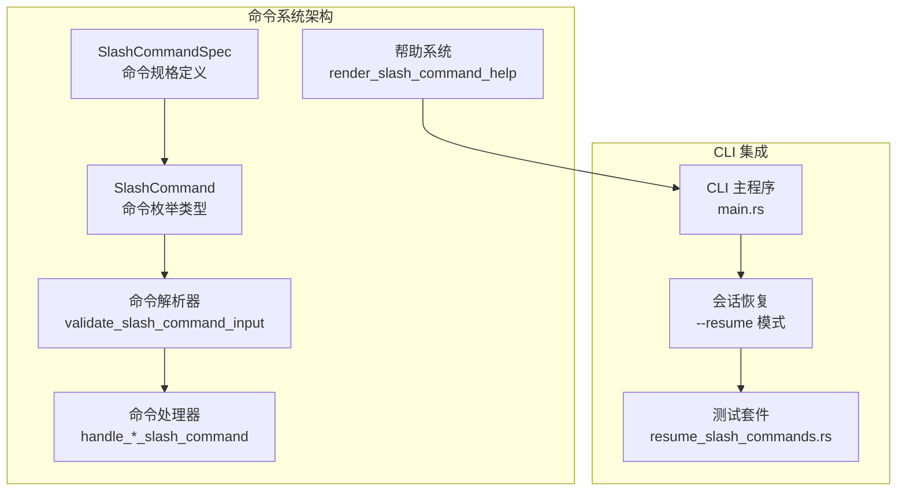
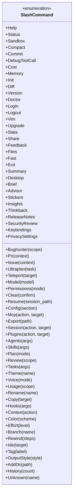
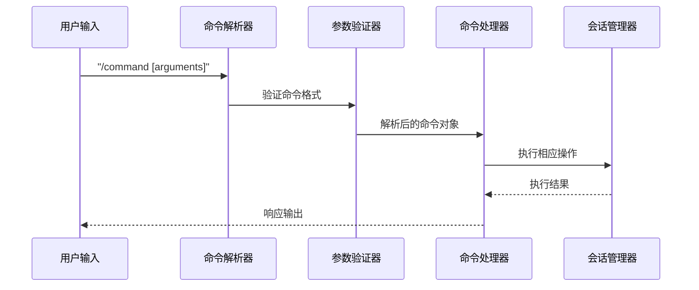
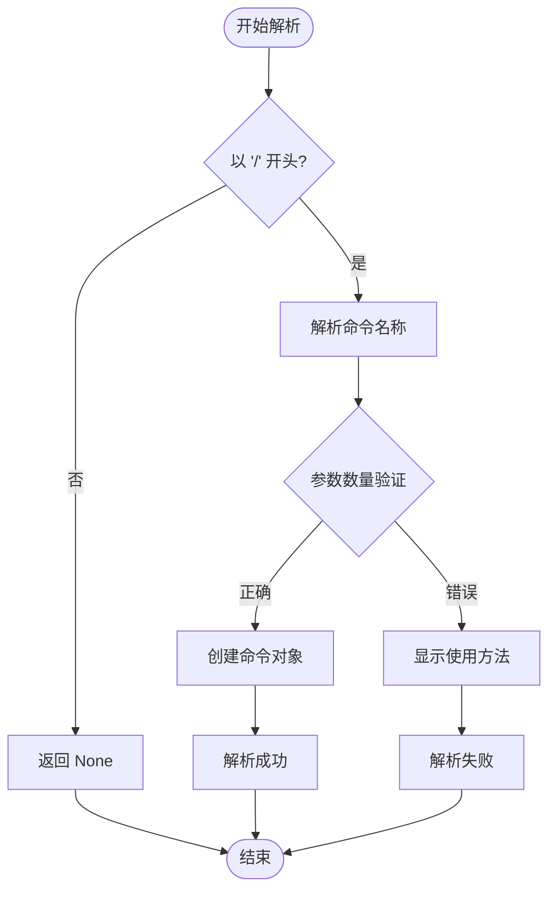
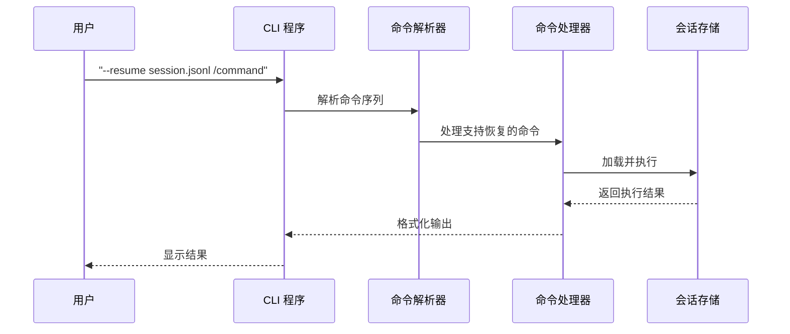
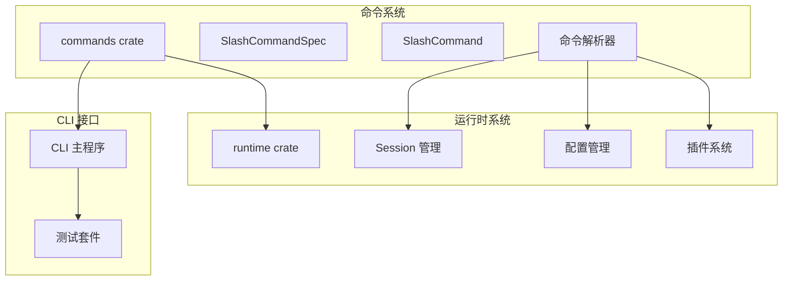

# Slash 命令规范

<cite>
**本文档引用的文件**
- [lib.rs](file://rust/crates/commands/src/lib.rs)
- [main.rs](file://rust/crates/rusty-claude-cli/src/main.rs)
- [resume_slash_commands.rs](file://rust/crates/rusty-claude-cli/tests/resume_slash_commands.rs)
</cite>

## 目录
1. [简介](#简介)
2. [项目结构](#项目结构)
3. [核心组件](#核心组件)
4. [架构概览](#架构概览)
5. [详细组件分析](#详细组件分析)
6. [依赖关系分析](#依赖关系分析)
7. [性能考虑](#性能考虑)
8. [故障排除指南](#故障排除指南)
9. [结论](#结论)
10. [附录](#附录)

## 简介

Slash 命令是 Claw Code 项目中的核心交互机制，为用户提供了一种标准化的方式来执行各种功能操作。本规范详细解释了 SlashCommandSpec 结构体的各个字段含义，提供了完整的内置命令列表，以及详细的使用指南。

Slash 命令系统采用声明式设计，通过 SlashCommandSpec 结构体定义命令的基本信息，并通过 SlashCommand 枚举处理具体的命令解析和执行逻辑。

## 项目结构

Slash 命令系统的实现主要集中在 Rust 项目的命令模块中：

**图表来源**
- [lib.rs:44-51](file://rust/crates/commands/src/lib.rs#L44-L51)
- [lib.rs:1040-1183](file://rust/crates/commands/src/lib.rs#L1040-L1183)
- [lib.rs:1290-1496](file://rust/crates/commands/src/lib.rs#L1290-L1496)

**章节来源**
- [lib.rs:1-800](file://rust/crates/commands/src/lib.rs#L1-L800)
- [lib.rs:1878-1896](file://rust/crates/commands/src/lib.rs#L1878-L1896)

## 核心组件

### SlashCommandSpec 结构体详解

SlashCommandSpec 是命令系统的核心数据结构，定义了每个 Slash 命令的基本属性：

| 字段名 | 类型 | 必需性 | 描述 | 示例 |
|--------|------|--------|------|------|
| name | &'static str | 必需 | 命令的主名称 | "help", "status", "session" |
| aliases | &'static [&'static str] | 可选 | 命令的别名数组 | ["plugins", "marketplace"] |
| summary | &'static str | 必需 | 命令的简短描述 | "Show available slash commands" |
| argument_hint | Option<&'static str> | 可选 | 参数格式提示，None 表示无参数 | Some("[model]"), Some("<session-path>") |
| resume_supported | bool | 必需 | 是否支持会话恢复模式 | true, false |

### SlashCommand 枚举类型

SlashCommand 枚举定义了所有可用的命令类型及其参数结构：

**图表来源**
- [lib.rs:1040-1183](file://rust/crates/commands/src/lib.rs#L1040-L1183)

**章节来源**
- [lib.rs:44-51](file://rust/crates/commands/src/lib.rs#L44-L51)
- [lib.rs:1040-1183](file://rust/crates/commands/src/lib.rs#L1040-L1183)

## 架构概览

Slash 命令系统采用分层架构设计，确保了良好的可扩展性和维护性：

**图表来源**
- [lib.rs:1290-1496](file://rust/crates/commands/src/lib.rs#L1290-L1496)
- [lib.rs:1789-1804](file://rust/crates/commands/src/lib.rs#L1789-L1804)

系统的关键特性包括：

1. **声明式配置**：通过 SlashCommandSpec 定义命令规格
2. **类型安全**：使用枚举确保命令类型的完整性
3. **参数验证**：内置参数格式验证和错误处理
4. **会话集成**：与会话管理系统无缝集成
5. **帮助系统**：自动生成命令帮助和使用示例

**章节来源**
- [lib.rs:1290-1496](file://rust/crates/commands/src/lib.rs#L1290-L1496)
- [lib.rs:1865-1876](file://rust/crates/commands/src/lib.rs#L1865-L1876)

## 详细组件分析

### 命令分类体系

Slash 命令按照功能分为四大类别：

#### 会话管理类 (Session)
负责会话状态管理和历史记录操作：
- `/status` - 显示当前会话状态
- `/clear` - 清空当前会话
- `/compact` - 压缩会话历史
- `/history` - 查看对话历史
- `/rename` - 重命名会话
- `/copy` - 复制对话内容
- `/share` - 分享对话
- `/feedback` - 提交反馈

#### 工具类 (Tools)
提供各种开发工具和辅助功能：
- `/teleport` - 跳转到文件或符号
- `/search` - 搜索工作区文件
- `/git` - 执行 Git 命令
- `/test` - 运行项目测试
- `/lint` - 代码静态检查
- `/build` - 构建项目
- `/run` - 运行命令

#### 配置类 (Config)
管理系统配置和环境设置：
- `/model` - 切换 AI 模型
- `/permissions` - 设置权限模式
- `/config` - 查看配置文件
- `/theme` - 切换主题
- `/voice` - 语音输入设置
- `/workspace` - 切换工作目录
- `/api-key` - 设置 API 密钥

#### 调试类 (Debug)
提供调试和诊断功能：
- `/doctor` - 系统健康检查
- `/debug-tool-call` - 调试工具调用
- `/sandbox` - 沙箱状态检查
- `/diagnostics` - LSP 诊断信息

**章节来源**
- [lib.rs:1878-1896](file://rust/crates/commands/src/lib.rs#L1878-L1896)

### 参数格式规范

Slash 命令遵循统一的参数格式规范：

#### 参数类型标识
- `[参数]` - 可选参数
- `<参数>` - 必需参数
- `[参数1|参数2]` - 参数选择
- `[...重复参数]` - 可重复参数

#### 参数验证规则

**图表来源**
- [lib.rs:1290-1496](file://rust/crates/commands/src/lib.rs#L1290-L1496)

**章节来源**
- [lib.rs:1497-1565](file://rust/crates/commands/src/lib.rs#L1497-L1565)
- [lib.rs:1567-1645](file://rust/crates/commands/src/lib.rs#L1567-L1645)

### 会话恢复机制

resume_supported 字段决定了命令是否支持会话恢复模式：

**图表来源**
- [main.rs:1257-1298](file://rust/crates/rusty-claude-cli/src/main.rs#L1257-L1298)
- [main.rs:2183-2245](file://rust/crates/rusty-claude-cli/src/main.rs#L2183-L2245)

**章节来源**
- [lib.rs:1871-1876](file://rust/crates/commands/src/lib.rs#L1871-L1876)
- [main.rs:1257-1298](file://rust/crates/rusty-claude-cli/src/main.rs#L1257-L1298)

## 依赖关系分析

Slash 命令系统与其他组件的依赖关系：

**图表来源**
- [lib.rs:1-14](file://rust/crates/commands/src/lib.rs#L1-L14)
- [main.rs:1-14](file://rust/crates/rusty-claude-cli/src/main.rs#L1-L14)

**章节来源**
- [lib.rs:1-14](file://rust/crates/commands/src/lib.rs#L1-L14)
- [main.rs:1-14](file://rust/crates/rusty-claude-cli/src/main.rs#L1-L14)

## 性能考虑

### 命令解析性能优化

1. **预编译正则表达式**：命令解析使用高效的字符串匹配算法
2. **缓存帮助信息**：命令帮助文本进行内存缓存
3. **延迟初始化**：插件和配置在首次使用时才加载
4. **批量处理**：支持多命令批量执行以减少启动开销

### 内存使用优化

- 使用静态字符串避免运行时分配
- 合理的错误消息格式化
- 及时释放临时资源

## 故障排除指南

### 常见问题及解决方案

#### 命令解析错误
- **症状**：命令无法识别或参数错误
- **原因**：参数格式不正确或命令不存在
- **解决**：使用 `/help` 查看可用命令和格式

#### 会话恢复问题
- **症状**：恢复模式下命令执行失败
- **原因**：命令不支持恢复模式或会话文件损坏
- **解决**：检查 `resume_supported` 字段或重新创建会话

#### 权限相关错误
- **症状**：某些命令执行失败
- **原因**：权限模式限制
- **解决**：使用 `/permissions` 查看和修改权限设置

**章节来源**
- [lib.rs:1789-1804](file://rust/crates/commands/src/lib.rs#L1789-L1804)
- [resume_slash_commands.rs:1-558](file://rust/crates/rusty-claude-cli/tests/resume_slash_commands.rs#L1-L558)

## 结论

Slash 命令规范为 Claw Code 项目提供了一个强大而灵活的命令系统。通过清晰的架构设计、完善的参数验证机制和丰富的功能分类，该系统能够满足各种开发场景的需求。

关键优势包括：
- 统一的命令格式和用户体验
- 强大的会话恢复能力
- 完善的错误处理和帮助系统
- 良好的扩展性和维护性

随着项目的不断发展，Slash 命令系统将继续演进，为用户带来更好的开发体验。

## 附录

### 命令开发指南

#### 添加新命令的步骤

1. **定义命令规格**：在 SlashCommandSpec 数组中添加新的命令定义
2. **实现命令解析**：在 validate_slash_command_input 函数中添加解析逻辑
3. **编写命令处理**：实现相应的处理函数
4. **添加测试用例**：编写单元测试和集成测试
5. **更新帮助系统**：确保帮助信息准确完整

#### 最佳实践

- 命名简洁明了，遵循现有命名约定
- 提供清晰的参数说明和使用示例
- 实现适当的错误处理和边界条件检查
- 考虑命令的会话恢复兼容性
- 编写充分的测试覆盖

### 实际使用示例

#### 基本命令使用
- `/status` - 查看当前会话状态
- `/help` - 显示所有可用命令
- `/clear` - 清空当前会话

#### 高级命令使用
- `/session switch abc123` - 切换到指定会话
- `/plugins install ./demo-plugin` - 安装插件
- `/skills install ./my-skill` - 安装技能

#### 会话恢复使用
- `claw --resume session.jsonl /status` - 恢复会话并查看状态
- `claw --resume session.jsonl /export notes.txt` - 恢复会话并导出对话

**章节来源**
- [resume_slash_commands.rs:15-81](file://rust/crates/rusty-claude-cli/tests/resume_slash_commands.rs#L15-L81)
- [resume_slash_commands.rs:115-176](file://rust/crates/rusty-claude-cli/tests/resume_slash_commands.rs#L115-L176)