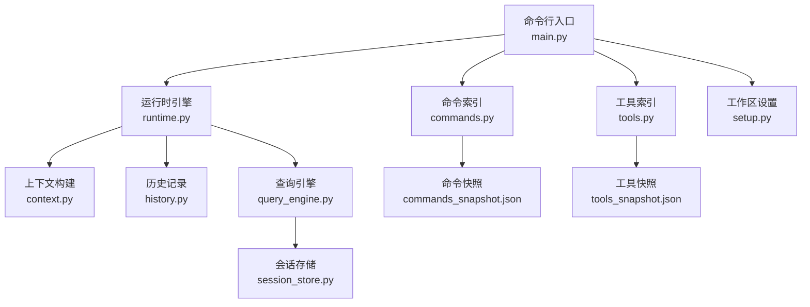
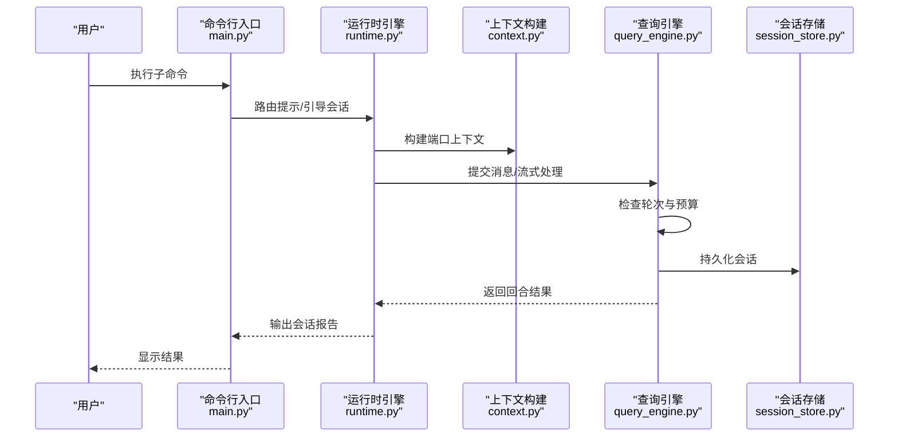
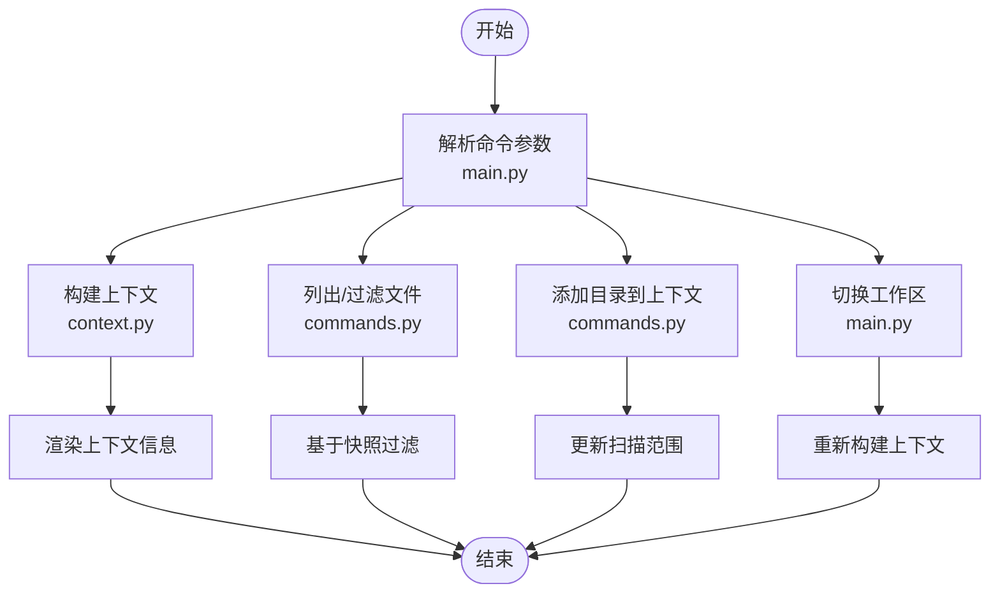
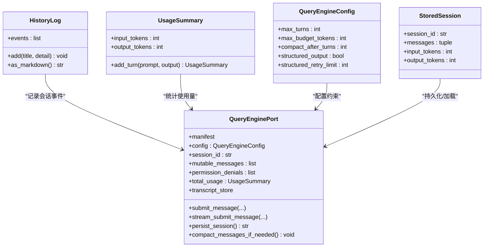
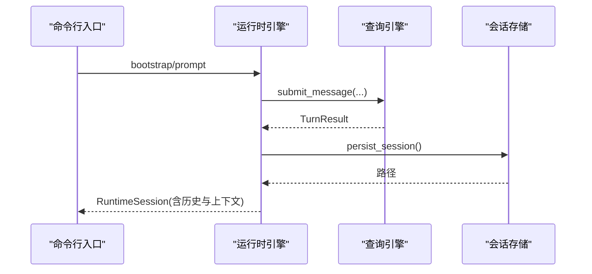
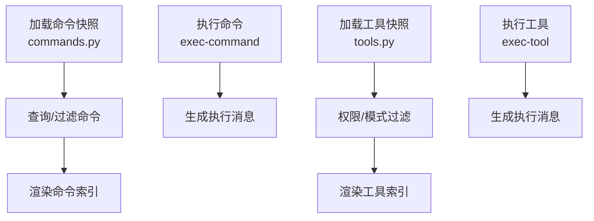
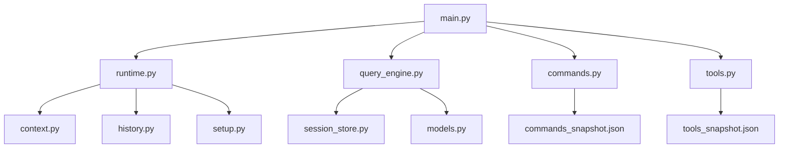

# 上下文管理命令

<cite>
**本文档引用的文件**
- [main.py](file://src/main.py)
- [context.py](file://src/context.py)
- [history.py](file://src/history.py)
- [cost_tracker.py](file://src/cost_tracker.py)
- [session_store.py](file://src/session_store.py)
- [runtime.py](file://src/runtime.py)
- [query_engine.py](file://src/query_engine.py)
- [models.py](file://src/models.py)
- [commands.py](file://src/commands.py)
- [tools.py](file://src/tools.py)
- [tool_pool.py](file://src/tool_pool.py)
- [setup.py](file://src/setup.py)
- [commands_snapshot.json](file://src/reference_data/commands_snapshot.json)
- [tools_snapshot.json](file://src/reference_data/tools_snapshot.json)
</cite>

## 目录
1. [简介](#简介)
2. [项目结构](#项目结构)
3. [核心组件](#核心组件)
4. [架构总览](#架构总览)
5. [详细组件分析](#详细组件分析)
6. [依赖关系分析](#依赖关系分析)
7. [性能考虑](#性能考虑)
8. [故障排除指南](#故障排除指南)
9. [结论](#结论)
10. [附录](#附录)

## 简介
本文件系统性梳理并解释上下文管理相关的命令与机制，重点覆盖以下方面：
- 上下文命令：context、files、add-dir、workspace、history、tokens、cache 等
- 对话上下文管理：文件过滤、目录添加、工作空间切换
- 上下文窗口大小限制、历史记录管理、令牌统计与预算控制
- 上下文优化策略与性能调优建议

通过命令行入口与运行时引擎的协作，系统实现了对镜像化命令与工具的路由、执行、会话持久化与历史追踪。

## 项目结构
围绕上下文管理的关键模块与文件如下：
- 命令行入口与子命令解析：main.py
- 上下文构建与渲染：context.py
- 历史事件记录：history.py
- 令牌成本追踪：cost_tracker.py
- 会话存储与加载：session_store.py
- 运行时会话与路由：runtime.py
- 查询引擎与上下文窗口控制：query_engine.py
- 数据模型与权限：models.py
- 镜像命令与工具索引：commands.py、tools.py
- 工具池装配：tool_pool.py
- 工作区设置与启动流程：setup.py
- 命令与工具快照数据：commands_snapshot.json、tools_snapshot.json

**图表来源**
- [main.py:21-91](file://src/main.py#L21-L91)
- [runtime.py:89-152](file://src/runtime.py#L89-L152)
- [context.py:19-47](file://src/context.py#L19-L47)
- [history.py:12-22](file://src/history.py#L12-L22)
- [query_engine.py:35-150](file://src/query_engine.py#L35-L150)
- [session_store.py:19-35](file://src/session_store.py#L19-L35)
- [commands.py:22-58](file://src/commands.py#L22-L58)
- [tools.py:23-72](file://src/tools.py#L23-L72)
- [setup.py:56-77](file://src/setup.py#L56-L77)

**章节来源**
- [main.py:21-91](file://src/main.py#L21-L91)
- [context.py:19-47](file://src/context.py#L19-L47)
- [history.py:12-22](file://src/history.py#L12-L22)
- [query_engine.py:35-150](file://src/query_engine.py#L35-L150)
- [session_store.py:19-35](file://src/session_store.py#L19-L35)
- [runtime.py:89-152](file://src/runtime.py#L89-L152)
- [commands.py:22-58](file://src/commands.py#L22-L58)
- [tools.py:23-72](file://src/tools.py#L23-L72)
- [setup.py:56-77](file://src/setup.py#L56-L77)

## 核心组件
- 上下文构建器：负责扫描源码、测试、资源与归档根路径，统计文件数量并判断归档可用性，支持渲染为可读字符串。
- 历史日志：记录会话过程中的事件，支持以 Markdown 格式输出。
- 令牌成本追踪：累计单位数与事件列表，便于成本审计。
- 会话存储：保存与加载会话，包含消息、输入/输出令牌统计。
- 运行时会话：封装上下文、设置、历史、路由匹配、执行结果、流事件与持久化路径。
- 查询引擎：控制上下文窗口（轮次与令牌预算）、消息压缩、会话持久化与结构化输出。
- 命令与工具索引：从快照加载镜像命令与工具，支持查询、过滤与执行。
- 工具池装配：按模式与权限装配工具集合。
- 工作区设置：收集 Python 版本、平台信息与启动步骤。

**章节来源**
- [context.py:19-47](file://src/context.py#L19-L47)
- [history.py:12-22](file://src/history.py#L12-L22)
- [cost_tracker.py:6-13](file://src/cost_tracker.py#L6-L13)
- [session_store.py:19-35](file://src/session_store.py#L19-L35)
- [runtime.py:24-86](file://src/runtime.py#L24-L86)
- [query_engine.py:15-150](file://src/query_engine.py#L15-L150)
- [commands.py:22-58](file://src/commands.py#L22-L58)
- [tools.py:23-72](file://src/tools.py#L23-L72)
- [tool_pool.py:28-37](file://src/tool_pool.py#L28-L37)
- [setup.py:12-27](file://src/setup.py#L12-L27)

## 架构总览
命令行入口解析用户输入后，根据子命令调用相应功能；运行时引擎负责上下文构建、路由匹配、工具与命令执行、历史记录与会话持久化；查询引擎控制上下文窗口大小与令牌预算，确保在预算内高效完成任务。

**图表来源**
- [main.py:94-209](file://src/main.py#L94-L209)
- [runtime.py:109-152](file://src/runtime.py#L109-L152)
- [context.py:19-47](file://src/context.py#L19-L47)
- [query_engine.py:61-150](file://src/query_engine.py#L61-L150)
- [session_store.py:19-35](file://src/session_store.py#L19-L35)

**章节来源**
- [main.py:94-209](file://src/main.py#L94-L209)
- [runtime.py:109-152](file://src/runtime.py#L109-L152)
- [query_engine.py:61-150](file://src/query_engine.py#L61-L150)

## 详细组件分析

### 上下文命令：context、files、add-dir、workspace
- context：渲染当前工作区的上下文信息，包括源码根、测试根、资源根、归档根、各类文件计数与归档可用性。
- files：列出或过滤文件，支持从快照中检索与筛选。
- add-dir：将目录加入上下文范围，提升后续路由与执行的覆盖面。
- workspace：切换或指定工作区根路径，影响上下文构建与扫描范围。

这些能力由以下模块协同实现：
- 上下文构建：context.py 的构建函数与渲染函数
- 命令索引与查询：commands.py 加载命令快照并提供查询、过滤与执行
- 子命令解析：main.py 中的参数解析与分支逻辑

**图表来源**
- [main.py:94-209](file://src/main.py#L94-L209)
- [context.py:19-47](file://src/context.py#L19-L47)
- [commands.py:22-58](file://src/commands.py#L22-L58)

**章节来源**
- [context.py:19-47](file://src/context.py#L19-L47)
- [commands.py:22-58](file://src/commands.py#L22-L58)
- [main.py:94-209](file://src/main.py#L94-L209)

### 历史记录与会话管理：history、tokens、cache
- history：记录会话事件，支持 Markdown 格式输出，便于审计与复盘。
- tokens：通过使用量统计与预算控制，避免超出上下文窗口限制。
- cache：会话缓存与压缩，减少冗余消息，提高性能。

**图表来源**
- [history.py:12-22](file://src/history.py#L12-L22)
- [models.py:28-37](file://src/models.py#L28-L37)
- [query_engine.py:15-150](file://src/query_engine.py#L15-L150)
- [session_store.py:8-35](file://src/session_store.py#L8-L35)

**章节来源**
- [history.py:12-22](file://src/history.py#L12-L22)
- [models.py:28-37](file://src/models.py#L28-L37)
- [query_engine.py:15-150](file://src/query_engine.py#L15-L150)
- [session_store.py:8-35](file://src/session_store.py#L8-L35)

### 运行时会话与路由：bootstrap、turn-loop、flush-transcript、load-session
- bootstrap：构建运行时会话，包含上下文、设置、历史、路由匹配、命令与工具执行、流事件与回合结果，并持久化会话。
- turn-loop：多轮对话循环，支持最大轮次与结构化输出。
- flush-transcript：提交消息并持久化会话，输出持久化路径与转录状态。
- load-session：加载已保存会话，显示消息数量与令牌统计。

**图表来源**
- [runtime.py:109-152](file://src/runtime.py#L109-L152)
- [query_engine.py:140-150](file://src/query_engine.py#L140-L150)
- [session_store.py:19-35](file://src/session_store.py#L19-L35)

**章节来源**
- [runtime.py:109-152](file://src/runtime.py#L109-L152)
- [query_engine.py:140-150](file://src/query_engine.py#L140-L150)
- [session_store.py:19-35](file://src/session_store.py#L19-L35)

### 命令与工具索引：commands、tools、exec-command、exec-tool
- commands：加载命令快照，支持查询、过滤与执行；提供命令索引渲染。
- tools：加载工具快照，支持简单模式、MCP 过滤与权限上下文过滤；提供工具索引渲染。
- exec-command/exec-tool：执行镜像命令或工具，返回执行结果消息。

**图表来源**
- [commands.py:22-80](file://src/commands.py#L22-L80)
- [tools.py:23-86](file://src/tools.py#L23-L86)
- [main.py:186-207](file://src/main.py#L186-L207)

**章节来源**
- [commands.py:22-80](file://src/commands.py#L22-L80)
- [tools.py:23-86](file://src/tools.py#L23-L86)
- [main.py:186-207](file://src/main.py#L186-L207)

## 依赖关系分析
- 命令行入口依赖运行时引擎与查询引擎，用于执行具体任务。
- 运行时引擎依赖上下文构建、历史记录、工具与命令索引、设置与查询引擎。
- 查询引擎依赖会话存储、权限拒绝、使用量统计与转录存储。
- 工具池装配依赖工具索引与权限上下文。

**图表来源**
- [main.py:7-18](file://src/main.py#L7-L18)
- [runtime.py:5-13](file://src/runtime.py#L5-L13)
- [query_engine.py:7-12](file://src/query_engine.py#L7-L12)
- [session_store.py:3-5](file://src/session_store.py#L3-L5)
- [commands.py:8](file://src/commands.py#L8)
- [tools.py:8](file://src/tools.py#L8)

**章节来源**
- [main.py:7-18](file://src/main.py#L7-L18)
- [runtime.py:5-13](file://src/runtime.py#L5-L13)
- [query_engine.py:7-12](file://src/query_engine.py#L7-L12)
- [session_store.py:3-5](file://src/session_store.py#L3-L5)
- [commands.py:8](file://src/commands.py#L8)
- [tools.py:8](file://src/tools.py#L8)

## 性能考虑
- 上下文窗口控制
  - 最大轮次：防止无限对话导致内存膨胀
  - 令牌预算：在提交消息前估算输入/输出令牌，超过预算则提前停止
  - 消息压缩：超过阈值时仅保留最近若干轮次的消息
- 会话持久化
  - flush-transcript 在持久化前清理临时状态，降低 IO 压力
  - 保存会话时记录输入/输出令牌，便于后续审计与成本控制
- 工具与命令过滤
  - 使用快照与 LRU 缓存减少重复加载
  - 权限与模式过滤减少无效执行
- 工作区设置
  - 启动阶段预取与延迟初始化，缩短首次响应时间

**章节来源**
- [query_engine.py:15-150](file://src/query_engine.py#L15-L150)
- [runtime.py:129-132](file://src/runtime.py#L129-L132)
- [setup.py:64-77](file://src/setup.py#L64-L77)

## 故障排除指南
- 未知命令或工具
  - 现象：执行 exec-command 或 exec-tool 返回未找到
  - 处理：确认名称是否存在于快照中，检查大小写与拼写
- 会话加载失败
  - 现象：load-session 报错或内容为空
  - 处理：确认会话 ID 正确且文件存在；检查默认会话目录
- 超出预算或轮次限制
  - 现象：提交消息被提前终止，stop_reason 显示 max_budget_reached 或 max_turns_reached
  - 处理：减少提示词长度、合并请求、调整配置参数
- 历史记录缺失
  - 现象：history 输出不完整
  - 处理：确保在会话生命周期内正确记录事件；检查持久化流程

**章节来源**
- [commands.py:75-80](file://src/commands.py#L75-L80)
- [tools.py:81-86](file://src/tools.py#L81-L86)
- [session_store.py:27-35](file://src/session_store.py#L27-L35)
- [query_engine.py:67-104](file://src/query_engine.py#L67-L104)
- [history.py:19-22](file://src/history.py#L19-L22)

## 结论
该上下文管理框架通过命令行入口、运行时引擎与查询引擎的协同，提供了完整的上下文构建、历史记录、令牌预算与会话持久化能力。结合命令与工具快照、权限过滤与工作区设置，能够高效地在受限预算内完成复杂任务，并支持扩展与优化。

## 附录
- 常用子命令
  - commands：列出镜像命令
  - tools：列出镜像工具
  - exec-command/exec-tool：执行镜像命令或工具
  - bootstrap：构建运行时会话
  - turn-loop：多轮对话循环
  - flush-transcript：提交并持久化会话
  - load-session：加载已保存会话
- 快照数据
  - 命令快照：commands_snapshot.json
  - 工具快照：tools_snapshot.json

**章节来源**
- [main.py:123-207](file://src/main.py#L123-L207)
- [commands_snapshot.json:1-20](file://src/reference_data/commands_snapshot.json#L1-L20)
- [tools_snapshot.json:1-20](file://src/reference_data/tools_snapshot.json#L1-L20)