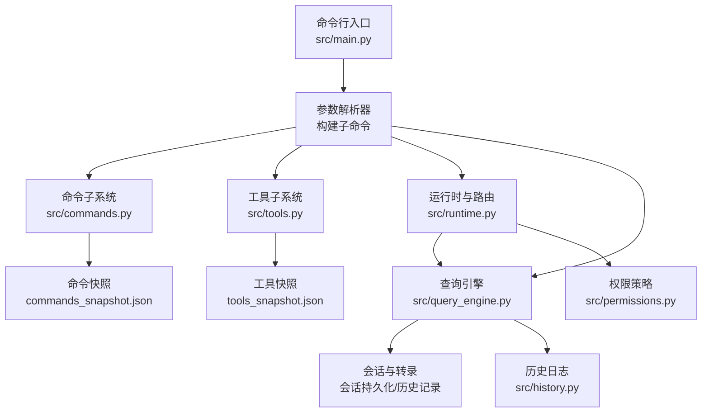
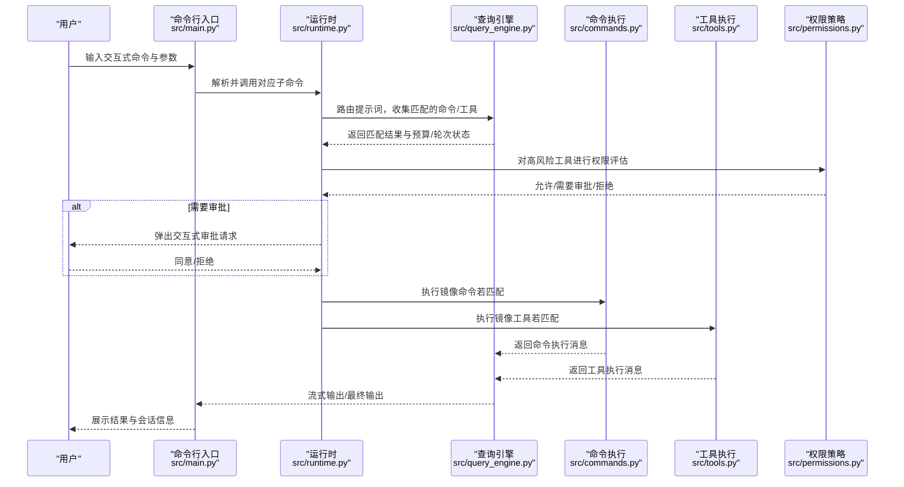
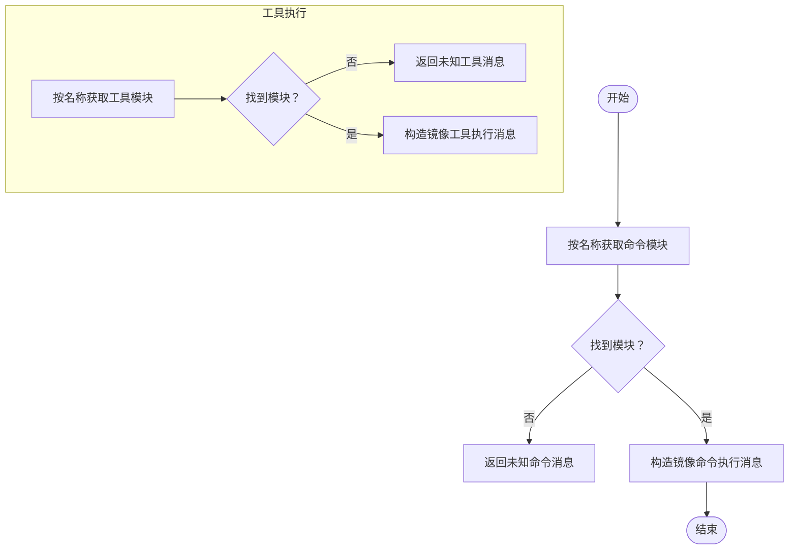
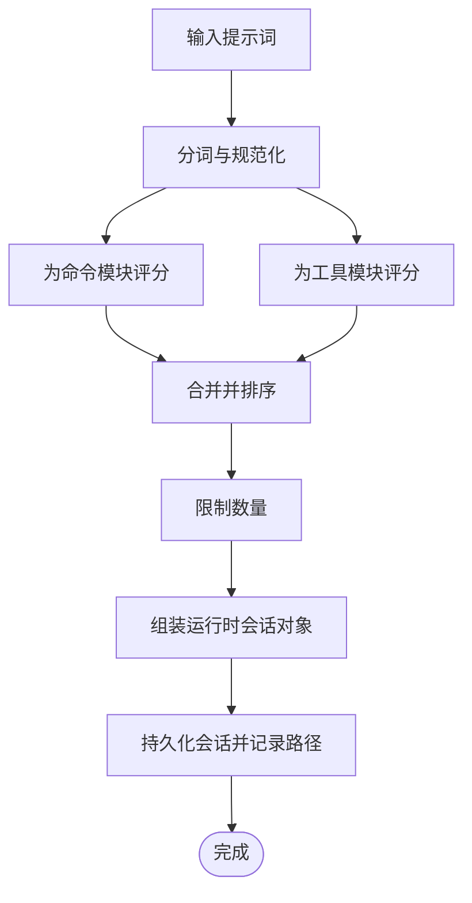
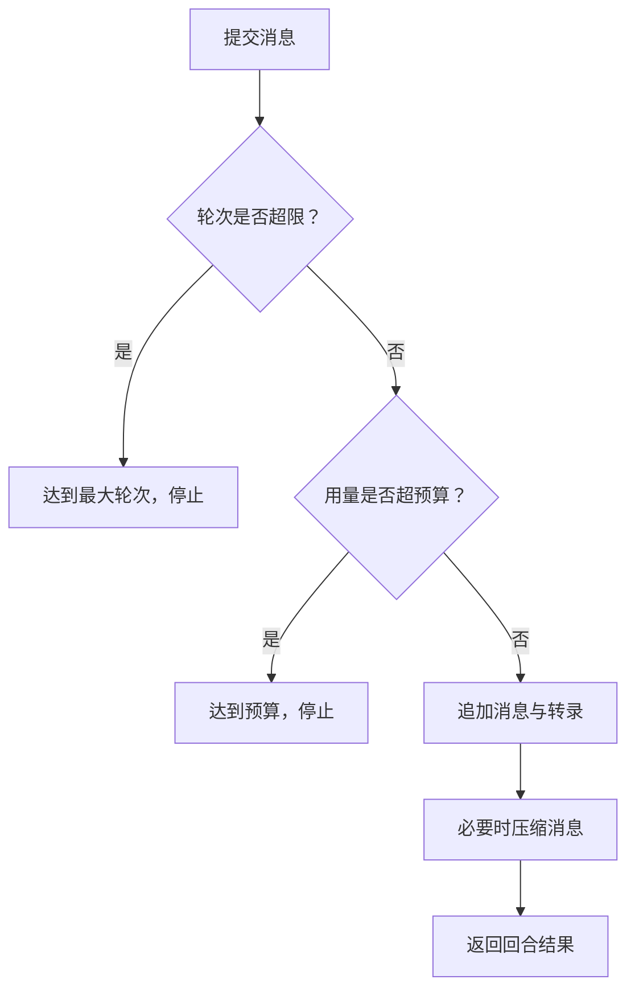
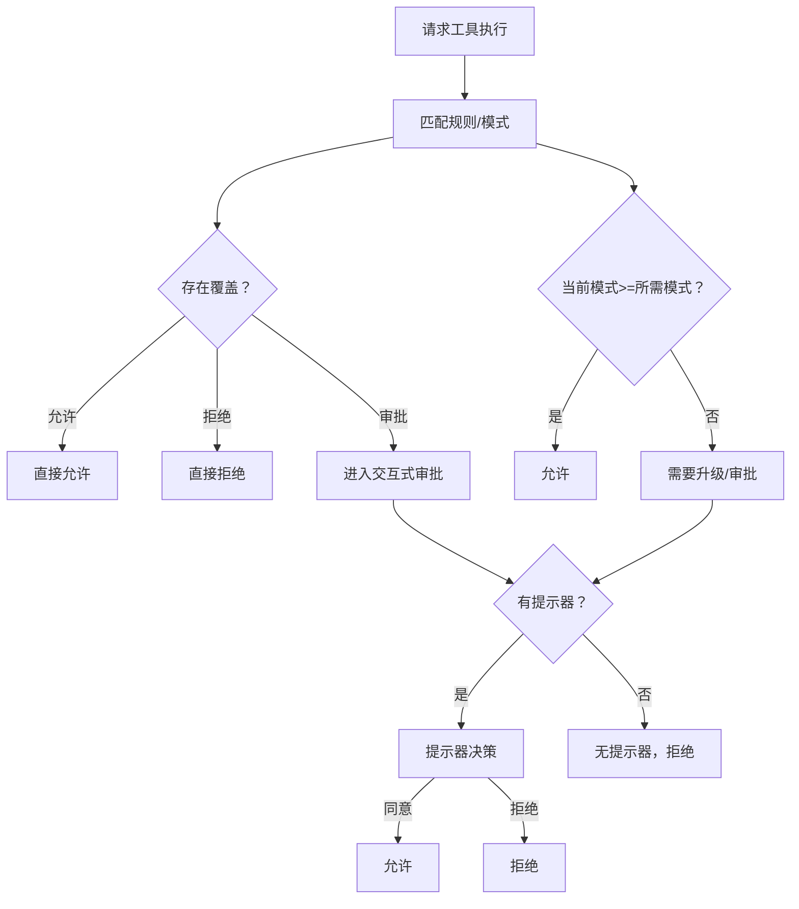
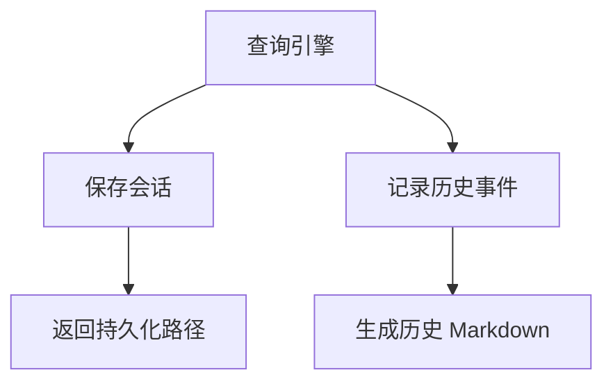
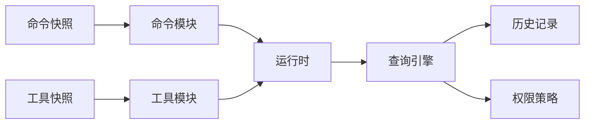

# 交互式命令

<cite>
**本文引用的文件**
- [src/main.py](file://src/main.py)
- [src/commands.py](file://src/commands.py)
- [src/tools.py](file://src/tools.py)
- [src/query_engine.py](file://src/query_engine.py)
- [src/runtime.py](file://src/runtime.py)
- [src/models.py](file://src/models.py)
- [src/history.py](file://src/history.py)
- [src/permissions.py](file://src/permissions.py)
- [src/reference_data/commands_snapshot.json](file://src/reference_data/commands_snapshot.json)
- [src/reference_data/tools_snapshot.json](file://src/reference_data/tools_snapshot.json)
- [src/voice/__init__.py](file://src/voice/__init__.py)
- [rust/crates/commands/src/lib.rs](file://rust/crates/commands/src/lib.rs)
- [rust/crates/runtime/src/permissions.rs](file://rust/crates/runtime/src/permissions.rs)
</cite>

## 目录
1. [简介](#简介)
2. [项目结构](#项目结构)
3. [核心组件](#核心组件)
4. [架构总览](#架构总览)
5. [详细组件分析](#详细组件分析)
6. [依赖分析](#依赖分析)
7. [性能考虑](#性能考虑)
8. [故障排查指南](#故障排查指南)
9. [结论](#结论)
10. [附录](#附录)

## 简介
本文件聚焦于交互式命令体系，围绕 approve（审批）、deny（拒绝）、undo（撤销）、stop（停止）、retry（重试）、paste（粘贴）、listen（语音输入）、speak（朗读）等与用户交互密切相关的命令，系统性阐述其在镜像命令/工具清单中的定位、执行流程、权限控制、会话与历史记录、以及生成控制与中断机制。同时给出用户体验优化建议与交互流程设计指导，帮助读者快速理解并高效使用该交互式命令系统。

## 项目结构
交互式命令由“命令层”和“工具层”共同构成，并通过查询引擎与运行时进行路由、执行与状态管理；权限模块负责对高风险工具的审批与拦截；会话与历史模块用于持久化与回溯。

图表来源
- [src/main.py:21-91](file://src/main.py#L21-L91)
- [src/commands.py:13-50](file://src/commands.py#L13-L50)
- [src/tools.py:14-50](file://src/tools.py#L14-L50)
- [src/runtime.py:89-152](file://src/runtime.py#L89-L152)
- [src/query_engine.py:36-104](file://src/query_engine.py#L36-L104)

章节来源
- [src/main.py:21-91](file://src/main.py#L21-L91)
- [src/commands.py:13-50](file://src/commands.py#L13-L50)
- [src/tools.py:14-50](file://src/tools.py#L14-L50)
- [src/reference_data/commands_snapshot.json:1-20](file://src/reference_data/commands_snapshot.json#L1-L20)
- [src/reference_data/tools_snapshot.json:1-20](file://src/reference_data/tools_snapshot.json#L1-L20)

## 核心组件
- 命令与工具镜像：通过 JSON 快照加载命令与工具清单，提供查询、过滤与执行入口。
- 运行时与路由：根据提示词匹配命令/工具，形成候选集并驱动查询引擎执行。
- 查询引擎：负责提交消息、流式输出、预算与轮次控制、会话持久化与转录管理。
- 权限策略：对高风险工具（如破坏性 Shell 执行）进行阻断或交互式审批。
- 会话与历史：记录交互过程、匹配结果、权限拒绝、用量统计与会话持久化路径。

章节来源
- [src/commands.py:75-81](file://src/commands.py#L75-L81)
- [src/tools.py:81-87](file://src/tools.py#L81-L87)
- [src/runtime.py:89-152](file://src/runtime.py#L89-L152)
- [src/query_engine.py:61-104](file://src/query_engine.py#L61-L104)
- [src/permissions.py:6-21](file://src/permissions.py#L6-L21)

## 架构总览
交互式命令的端到端流程如下：

图表来源
- [src/main.py:94-209](file://src/main.py#L94-L209)
- [src/runtime.py:89-152](file://src/runtime.py#L89-L152)
- [src/query_engine.py:61-127](file://src/query_engine.py#L61-L127)
- [src/commands.py:75-81](file://src/commands.py#L75-L81)
- [src/tools.py:81-87](file://src/tools.py#L81-L87)
- [src/permissions.py:6-21](file://src/permissions.py#L6-L21)

## 详细组件分析

### 命令与工具镜像执行
- 命令镜像执行：通过精确名称查找命令模块，返回“镜像执行”消息，便于在 Python 环境中模拟原生行为。
- 工具镜像执行：通过精确名称查找工具模块，返回“镜像执行”消息，支持简单模式与 MCP 过滤、权限上下文过滤。

图表来源
- [src/commands.py:52-81](file://src/commands.py#L52-L81)
- [src/tools.py:48-87](file://src/tools.py#L48-L87)

章节来源
- [src/commands.py:52-81](file://src/commands.py#L52-L81)
- [src/tools.py:48-87](file://src/tools.py#L48-L87)

### 运行时路由与会话引导
- 路由逻辑：将提示词分词后与命令/工具模块进行相似度评分，优先选择命令，再扩展工具，最终按分数排序返回候选。
- 会话引导：构建上下文、启动步骤、系统初始化消息、匹配结果、执行消息、流事件、回合结果与会话持久化路径。

图表来源
- [src/runtime.py:89-152](file://src/runtime.py#L89-L152)
- [src/runtime.py:176-192](file://src/runtime.py#L176-L192)

章节来源
- [src/runtime.py:89-152](file://src/runtime.py#L89-L152)
- [src/runtime.py:176-192](file://src/runtime.py#L176-L192)

### 查询引擎与生成控制
- 提交消息：记录轮次、匹配的命令/工具、权限拒绝、用量统计；检查轮次上限与预算，决定是否提前终止。
- 流式提交：先产出事件头，再逐步产出匹配与拒绝事件，最后产出文本增量与结束事件。
- 结构化输出：可选结构化渲染，失败时自动重试。

图表来源
- [src/query_engine.py:61-104](file://src/query_engine.py#L61-L104)
- [src/query_engine.py:106-127](file://src/query_engine.py#L106-L127)
- [src/query_engine.py:129-132](file://src/query_engine.py#L129-L132)

章节来源
- [src/query_engine.py:61-104](file://src/query_engine.py#L61-L104)
- [src/query_engine.py:106-127](file://src/query_engine.py#L106-L127)
- [src/query_engine.py:129-132](file://src/query_engine.py#L129-L132)

### 权限策略与交互式审批
- 静态规则与模式：根据当前模式与所需模式判断是否允许、需要审批或拒绝。
- 交互式审批：当策略要求交互时，通过提示器接口决策；若无提示器则直接拒绝。
- 高风险工具阻断：例如破坏性 Shell 执行在 Python 端默认阻断，需显式审批。

图表来源
- [rust/crates/runtime/src/permissions.rs:178-292](file://rust/crates/runtime/src/permissions.rs#L178-L292)
- [rust/crates/runtime/src/permissions.rs:294-324](file://rust/crates/runtime/src/permissions.rs#L294-L324)
- [src/runtime.py:169-174](file://src/runtime.py#L169-L174)

章节来源
- [rust/crates/runtime/src/permissions.rs:178-292](file://rust/crates/runtime/src/permissions.rs#L178-L292)
- [rust/crates/runtime/src/permissions.rs:294-324](file://rust/crates/runtime/src/permissions.rs#L294-L324)
- [src/runtime.py:169-174](file://src/runtime.py#L169-L174)

### 会话与历史记录
- 会话存储：将消息、用量与会话 ID 写入持久化存储，返回保存路径。
- 历史记录：记录上下文、注册表、路由、执行、回合与会话存储等关键事件，便于审计与复盘。

图表来源
- [src/query_engine.py:140-150](file://src/query_engine.py#L140-L150)
- [src/history.py:12-22](file://src/history.py#L12-L22)

章节来源
- [src/query_engine.py:140-150](file://src/query_engine.py#L140-L150)
- [src/history.py:12-22](file://src/history.py#L12-L22)

### 交互式命令语义与使用场景
以下命令在 Rust 侧定义了规范的摘要与参数提示，Python 侧通过镜像命令/工具与查询引擎协同实现交互体验。

- approve（审批）
  - 用途：在需要交互式审批时，同意某项高风险工具的执行。
  - 交互位置：权限策略触发提示器决策时，用户可在此处批准。
  - 参考定义：[rust/crates/commands/src/lib.rs:546-553](file://rust/crates/commands/src/lib.rs#L546-L553)

- deny（拒绝）
  - 用途：在需要交互式审批时，拒绝某项高风险工具的执行。
  - 交互位置：权限策略触发提示器决策时，用户可在此处拒绝。
  - 参考定义：[rust/crates/commands/src/lib.rs:546-553](file://rust/crates/commands/src/lib.rs#L546-L553)

- undo（撤销）
  - 用途：撤销最近一次文件写入或编辑。
  - 参考定义：[rust/crates/commands/src/lib.rs:546-553](file://rust/crates/commands/src/lib.rs#L546-L553)

- stop（停止）
  - 用途：停止当前生成流程。
  - 参考定义：[rust/crates/commands/src/lib.rs:554-560](file://rust/crates/commands/src/lib.rs#L554-L560)

- retry（重试）
  - 用途：重试上次失败的消息处理。
  - 参考定义：[rust/crates/commands/src/lib.rs:561-567](file://rust/crates/commands/src/lib.rs#L561-L567)

- paste（粘贴）
  - 用途：将剪贴板内容作为输入。
  - 参考定义：[rust/crates/commands/src/lib.rs:568-574](file://rust/crates/commands/src/lib.rs#L568-L574)

- listen（语音输入）
  - 用途：监听语音输入。
  - 参考定义：[rust/crates/commands/src/lib.rs:604-609](file://rust/crates/commands/src/lib.rs#L604-L609)

- speak（朗读）
  - 用途：将最近的回复朗读出来。
  - 参考定义：[rust/crates/commands/src/lib.rs:611-616](file://rust/crates/commands/src/lib.rs#L611-L616)

章节来源
- [rust/crates/commands/src/lib.rs:546-553](file://rust/crates/commands/src/lib.rs#L546-L553)
- [rust/crates/commands/src/lib.rs:554-560](file://rust/crates/commands/src/lib.rs#L554-L560)
- [rust/crates/commands/src/lib.rs:561-567](file://rust/crates/commands/src/lib.rs#L561-L567)
- [rust/crates/commands/src/lib.rs:568-574](file://rust/crates/commands/src/lib.rs#L568-L574)
- [rust/crates/commands/src/lib.rs:604-609](file://rust/crates/commands/src/lib.rs#L604-L609)
- [rust/crates/commands/src/lib.rs:611-616](file://rust/crates/commands/src/lib.rs#L611-L616)

### 语音子系统与交互增强
- 语音子系统在 Python 中以占位包形式存在，包含归档元数据与示例文件列表，表明语音能力来自已归档的 TypeScript 子系统。
- 实际语音输入/输出能力取决于上层集成与运行时环境支持。

章节来源
- [src/voice/__init__.py:1-15](file://src/voice/__init__.py#L1-L15)
- [src/reference_data/subsystems/voice.json:1-8](file://src/reference_data/subsystems/voice.json#L1-L8)

## 依赖分析
- 命令与工具镜像：依赖快照 JSON 文件，提供只读的模块清单与职责描述。
- 运行时：依赖命令/工具镜像、上下文、设置报告、历史记录、执行注册表与查询引擎。
- 查询引擎：依赖清单、会话存储、转录存储、权限拒绝与用量统计。
- 权限策略：在 Rust 侧定义，Python 侧通过运行时推理与阻断实现。

图表来源
- [src/reference_data/commands_snapshot.json:1-20](file://src/reference_data/commands_snapshot.json#L1-L20)
- [src/reference_data/tools_snapshot.json:1-20](file://src/reference_data/tools_snapshot.json#L1-L20)
- [src/commands.py:23-36](file://src/commands.py#L23-L36)
- [src/tools.py:24-37](file://src/tools.py#L24-L37)
- [src/runtime.py:89-152](file://src/runtime.py#L89-L152)
- [src/query_engine.py:36-104](file://src/query_engine.py#L36-L104)

章节来源
- [src/reference_data/commands_snapshot.json:1-20](file://src/reference_data/commands_snapshot.json#L1-L20)
- [src/reference_data/tools_snapshot.json:1-20](file://src/reference_data/tools_snapshot.json#L1-L20)
- [src/commands.py:23-36](file://src/commands.py#L23-L36)
- [src/tools.py:24-37](file://src/tools.py#L24-L37)
- [src/runtime.py:89-152](file://src/runtime.py#L89-L152)
- [src/query_engine.py:36-104](file://src/query_engine.py#L36-L104)

## 性能考虑
- 轮次与预算：通过最大轮次与预算令牌限制，避免长对话导致资源耗尽。
- 消息压缩：超过阈值后仅保留最近若干轮消息，降低内存占用。
- 结构化输出重试：在渲染失败时自动重试，提升稳定性。

章节来源
- [src/query_engine.py:16-22](file://src/query_engine.py#L16-L22)
- [src/query_engine.py:129-132](file://src/query_engine.py#L129-L132)
- [src/query_engine.py:161-169](file://src/query_engine.py#L161-L169)

## 故障排查指南
- 未知命令/工具：执行镜像命令/工具时若名称不在快照中，将返回“未知”消息。请核对名称大小写与拼写。
  - 参考：[src/commands.py:77-79](file://src/commands.py#L77-L79)，[src/tools.py:83-85](file://src/tools.py#L83-L85)
- 会话未保存：若持久化失败或路径为空，请检查会话存储目录权限与磁盘空间。
  - 参考：[src/query_engine.py:140-150](file://src/query_engine.py#L140-L150)
- 预算/轮次限制：达到最大轮次或预算时，查询引擎会提前停止，检查提示词长度与生成策略。
  - 参考：[src/query_engine.py:68-78](file://src/query_engine.py#L68-L78)，[src/query_engine.py:89-91](file://src/query_engine.py#L89-L91)
- 权限拒绝：高风险工具被阻断或需要交互式审批，检查当前模式与所需模式，或提供提示器实现。
  - 参考：[rust/crates/runtime/src/permissions.rs:285-292](file://rust/crates/runtime/src/permissions.rs#L285-L292)，[src/runtime.py:169-174](file://src/runtime.py#L169-L174)

章节来源
- [src/commands.py:77-79](file://src/commands.py#L77-L79)
- [src/tools.py:83-85](file://src/tools.py#L83-L85)
- [src/query_engine.py:68-78](file://src/query_engine.py#L68-L78)
- [src/query_engine.py:89-91](file://src/query_engine.py#L89-L91)
- [rust/crates/runtime/src/permissions.rs:285-292](file://rust/crates/runtime/src/permissions.rs#L285-L292)
- [src/runtime.py:169-174](file://src/runtime.py#L169-L174)

## 结论
该交互式命令体系通过“命令/工具镜像 + 运行时路由 + 查询引擎 + 权限策略 + 会话与历史”的组合，提供了可控、可观测且可扩展的交互能力。approve/deny/undo/stop/retry/paste/listen/speak 等命令在 Rust 侧具备明确语义，在 Python 侧通过镜像执行与查询引擎实现一致的交互体验。配合预算/轮次控制与权限审批，既保证安全，又兼顾效率与可追溯性。

## 附录

### 交互流程设计指导
- 明确审批边界：对可能造成不可逆影响的操作（如破坏性 Shell 执行）必须纳入权限策略，确保每次执行均经过最小必要审批。
- 用户确认机制：在高风险工具执行前，提供清晰的工具名、输入摘要与拒绝原因，支持一键 approve/deny。
- 操作回滚：对文件写入/编辑类工具，提供 undo 能力与版本化备份，便于快速回退。
- 生成中断与重试：stop 用于立即中断生成，retry 用于重试上次失败的处理，结合 max_turns 与 max_budget_tokens 控制资源消耗。
- 语音交互：listen/speak 适合无障碍与多任务场景，建议在终端/IDE 插件中提供快捷键与状态指示。
- 会话持久化：定期 flush 与持久化会话，便于后续 resume 与审计；历史记录应包含关键事件与用量统计。

### 最佳实践
- 使用 simple_mode 与 MCP 过滤缩小工具面，降低误用风险。
- 通过 deny-tool 与 deny-prefix 精准屏蔽高危工具。
- 在 turn-loop 中启用结构化输出，便于上层系统解析与展示。
- 将权限策略与提示器解耦，支持在不同运行环境中灵活替换。