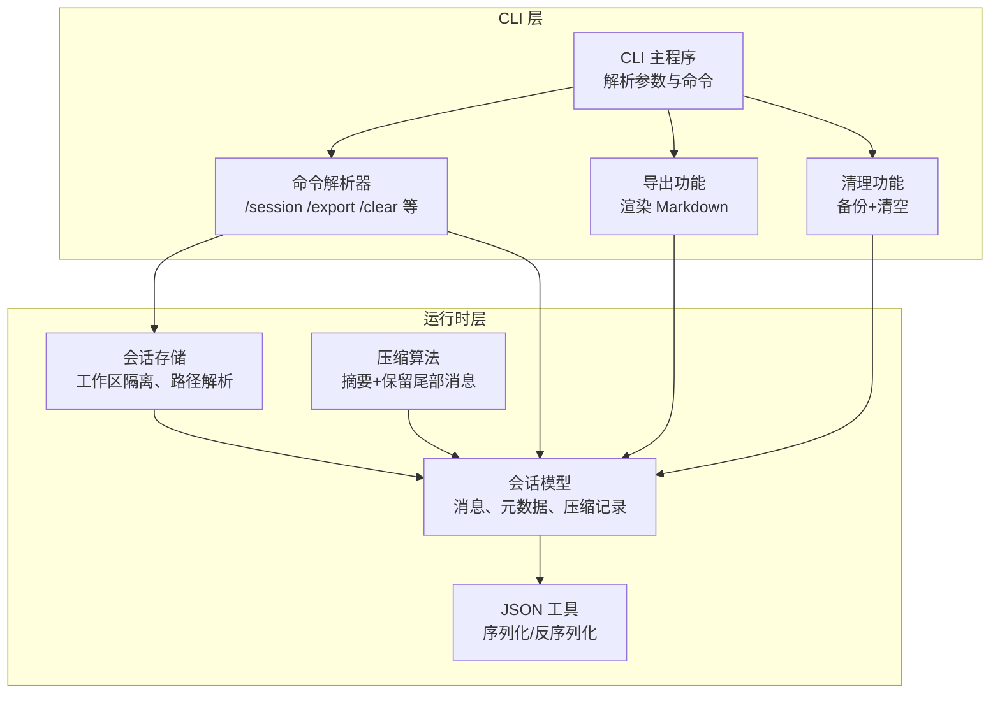
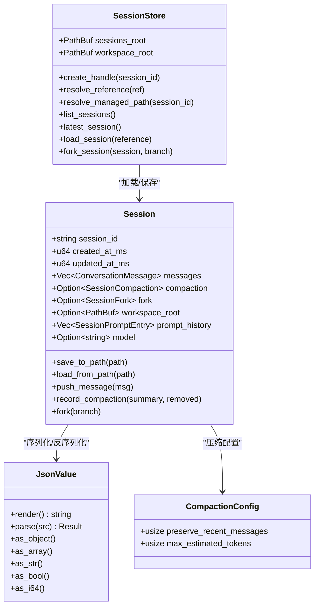
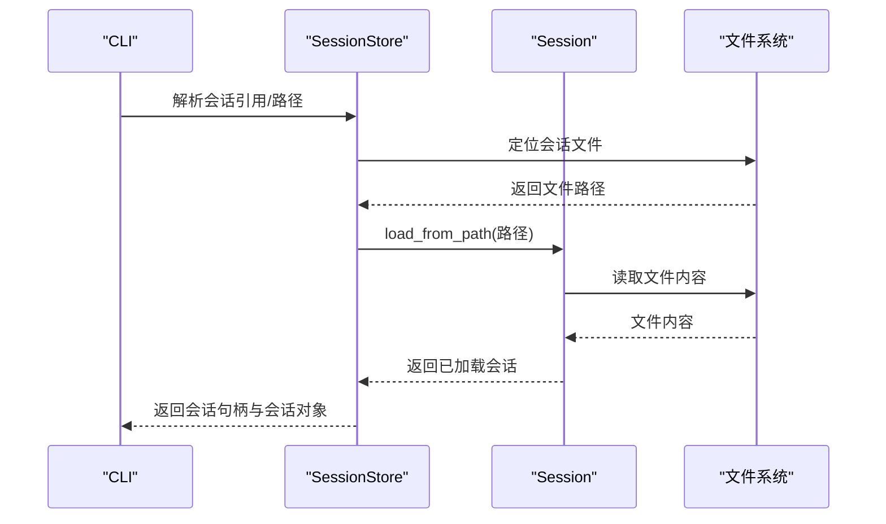
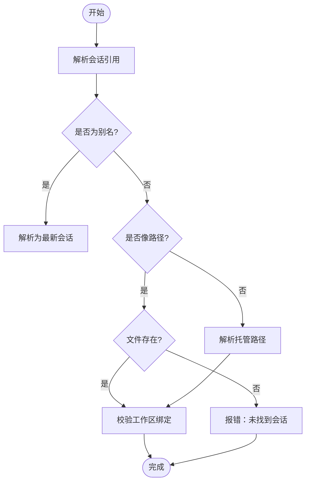
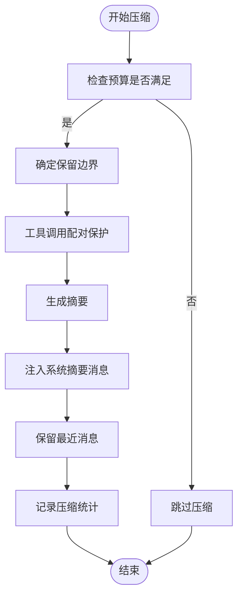
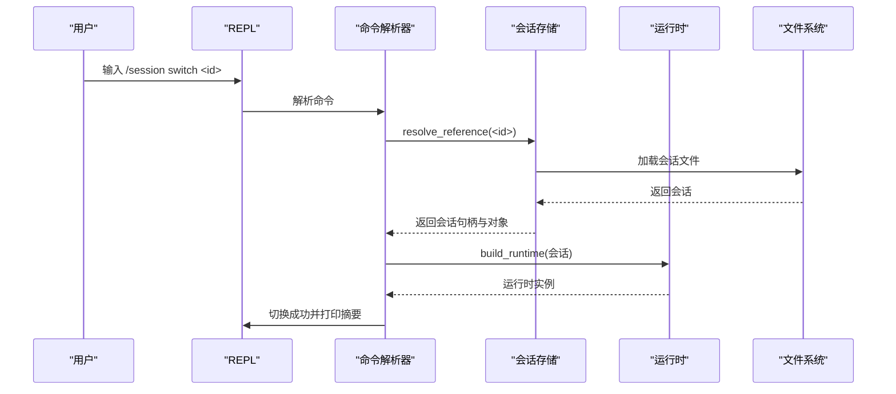
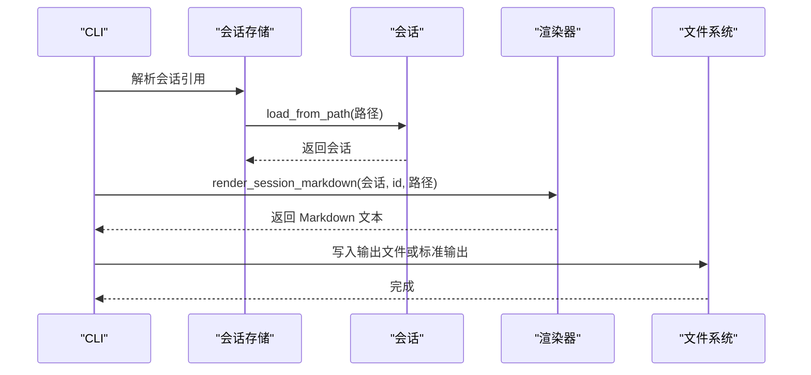
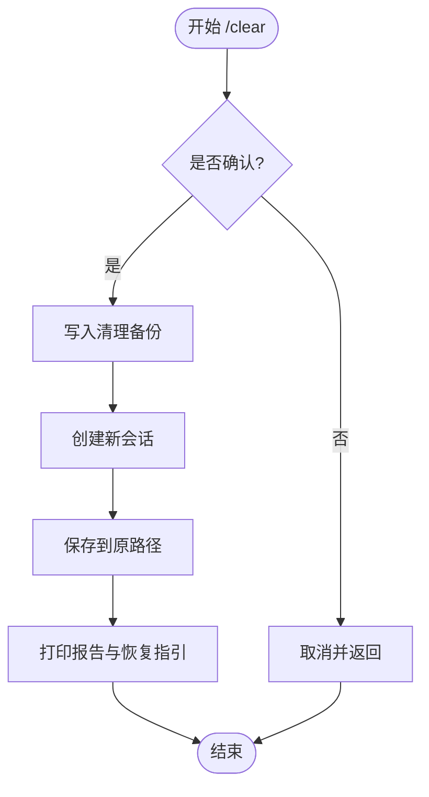
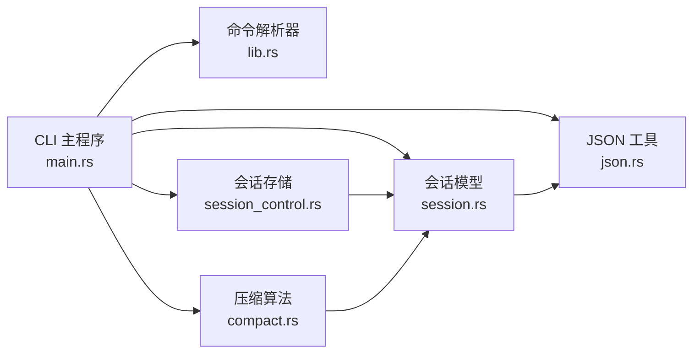

# 会话管理命令

<cite>
**本文档引用的文件**
- [session.rs](file://rust/crates/runtime/src/session.rs)
- [session_control.rs](file://rust/crates/runtime/src/session_control.rs)
- [compact.rs](file://rust/crates/runtime/src/compact.rs)
- [main.rs](file://rust/crates/rusty-claude-cli/src/main.rs)
- [lib.rs](file://rust/crates/commands/src/lib.rs)
- [json.rs](file://rust/crates/runtime/src/json.rs)
</cite>

## 目录
1. [简介](#简介)
2. [项目结构](#项目结构)
3. [核心组件](#核心组件)
4. [架构总览](#架构总览)
5. [详细组件分析](#详细组件分析)
6. [依赖关系分析](#依赖关系分析)
7. [性能考虑](#性能考虑)
8. [故障排除指南](#故障排除指南)
9. [结论](#结论)
10. [附录](#附录)

## 简介
本文件系统性梳理会话管理命令与机制，覆盖 session、resume、clear、compact、rename 等核心命令，解释会话的创建、加载、清理、压缩、分支与重命名等生命周期管理能力，并说明会话 ID 管理、分支切换、会话导出导入等高级功能。同时提供实际使用示例与最佳实践，阐述会话状态的持久化机制与数据恢复方法。

## 项目结构
会话管理涉及运行时（runtime）与 CLI 两部分：
- 运行时层：定义会话数据模型、持久化策略、压缩算法与工作区隔离。
- CLI 层：提供命令解析、交互式 REPL 与批量导出/清理等操作。

图示来源
- [main.rs:2629-2849](file://rust/crates/rusty-claude-cli/src/main.rs#L2629-L2849)
- [lib.rs:1583-1646](file://rust/crates/commands/src/lib.rs#L1583-L1646)
- [session.rs:90-106](file://rust/crates/runtime/src/session.rs#L90-L106)
- [session_control.rs:20-84](file://rust/crates/runtime/src/session_control.rs#L20-L84)
- [compact.rs:96-183](file://rust/crates/runtime/src/compact.rs#L96-L183)
- [json.rs:36-113](file://rust/crates/runtime/src/json.rs#L36-L113)

章节来源
- [main.rs:2629-2849](file://rust/crates/rusty-claude-cli/src/main.rs#L2629-L2849)
- [lib.rs:1583-1646](file://rust/crates/commands/src/lib.rs#L1583-L1646)
- [session.rs:90-106](file://rust/crates/runtime/src/session.rs#L90-L106)
- [session_control.rs:20-84](file://rust/crates/runtime/src/session_control.rs#L20-L84)
- [compact.rs:96-183](file://rust/crates/runtime/src/compact.rs#L96-L183)
- [json.rs:36-113](file://rust/crates/runtime/src/json.rs#L36-L113)

## 核心组件
- 会话模型（Session）：承载消息、元数据、压缩记录、分支信息与工作区绑定。
- 会话存储（SessionStore）：按工作区指纹命名空间化管理会话文件，支持解析别名与路径。
- 压缩模块（Compaction）：估算令牌、生成摘要、保留近期消息，避免工具调用配对被切分。
- JSON 工具（JsonValue/JsonError）：统一的 JSON 解析与渲染，支撑会话的 JSON/JSONL 持久化。
- CLI 命令解析（Commands）：解析 /session、/export、/clear 等子命令及参数。
- CLI 主程序（main.rs）：实现命令执行、导出渲染、清理备份、压缩报告输出等。

章节来源
- [session.rs:90-106](file://rust/crates/runtime/src/session.rs#L90-L106)
- [session_control.rs:20-84](file://rust/crates/runtime/src/session_control.rs#L20-L84)
- [compact.rs:96-183](file://rust/crates/runtime/src/compact.rs#L96-L183)
- [json.rs:36-113](file://rust/crates/runtime/src/json.rs#L36-L113)
- [lib.rs:1583-1646](file://rust/crates/commands/src/lib.rs#L1583-L1646)
- [main.rs:2629-2849](file://rust/crates/rusty-claude-cli/src/main.rs#L2629-L2849)

## 架构总览
会话管理采用“模型-存储-算法-接口”分层设计：
- 模型层：Session 负责消息与元数据；支持增量写入与快照渲染。
- 存储层：SessionStore 提供工作区隔离、路径解析、别名解析与列表展示。
- 算法层：Compaction 在不破坏工具调用配对的前提下进行上下文压缩。
- 接口层：CLI 提供命令行与 REPL 两种入口，支持导出、清理、压缩、分支与删除。

图示来源
- [session.rs:90-106](file://rust/crates/runtime/src/session.rs#L90-L106)
- [session_control.rs:20-84](file://rust/crates/runtime/src/session_control.rs#L20-L84)
- [compact.rs:9-22](file://rust/crates/runtime/src/compact.rs#L9-L22)
- [json.rs:36-113](file://rust/crates/runtime/src/json.rs#L36-L113)

## 详细组件分析

### 会话模型与持久化
- 数据结构要点
  - 会话标识与时间戳：session_id、created_at_ms、updated_at_ms。
  - 消息与内容块：支持文本、工具调用与工具结果三类内容块。
  - 压缩记录：记录压缩次数、移除的消息数与摘要。
  - 分支信息：记录父会话 ID 与可选分支名。
  - 工作区绑定：确保多实例共享全局存储时不会写错目录。
  - 提示历史：记录用户提示的时间戳与文本，支持增量写入。
- 持久化格式
  - JSON/JSONL 双格式：兼容旧版 JSON 与新版 JSONL 快照。
  - 增量写入：首次写入引导快照，后续追加消息与提示条目。
  - 日志轮转：超过阈值自动轮转并清理旧日志，避免单文件过大。
- 关键方法
  - 新建：Session::new() 生成唯一 session_id 并初始化时间戳。
  - 加载：Session::load_from_path() 自动识别 JSON/JSONL。
  - 保存：Session::save_to_path() 渲染快照并原子写入。
  - 增量：push_message()/push_prompt_entry() 支持边对话边落盘。

图示来源
- [session_control.rs:158-172](file://rust/crates/runtime/src/session_control.rs#L158-L172)
- [session.rs:213-227](file://rust/crates/runtime/src/session.rs#L213-L227)

章节来源
- [session.rs:90-106](file://rust/crates/runtime/src/session.rs#L90-L106)
- [session.rs:204-227](file://rust/crates/runtime/src/session.rs#L204-L227)
- [session.rs:521-574](file://rust/crates/runtime/src/session.rs#L521-L574)
- [session.rs:576-616](file://rust/crates/runtime/src/session.rs#L576-L616)

### 会话存储与工作区隔离
- 工作区指纹：基于工作区根路径计算稳定十六进制指纹，作为命名空间目录。
- 路径解析：支持绝对路径、相对路径、会话 ID 与别名（latest/last/recent）。
- 列表与最新：列出当前工作区下所有会话，按更新时间与修改时间排序。
- 兼容旧格式：自动探测旧版 JSON 扩展名并迁移验证。
- 工作区校验：加载时校验会话绑定的工作区是否匹配，防止跨工作区误读。

图示来源
- [session_control.rs:86-116](file://rust/crates/runtime/src/session_control.rs#L86-L116)
- [session_control.rs:118-139](file://rust/crates/runtime/src/session_control.rs#L118-L139)
- [session_control.rs:205-225](file://rust/crates/runtime/src/session_control.rs#L205-L225)

章节来源
- [session_control.rs:20-84](file://rust/crates/runtime/src/session_control.rs#L20-L84)
- [session_control.rs:141-156](file://rust/crates/runtime/src/session_control.rs#L141-L156)
- [session_control.rs:291-304](file://rust/crates/runtime/src/session_control.rs#L291-L304)

### 压缩算法与令牌预算
- 预算控制：通过 preserve_recent_messages 与 max_estimated_tokens 控制压缩触发条件。
- 令牌估算：按字符长度粗略估算消息令牌数，避免过长上下文导致超限。
- 摘要生成：提取用户请求、工具使用、待办事项、关键文件与时间线，形成结构化摘要。
- 边界保护：确保工具调用与结果配对不被切分，避免下游 API 报错。
- 结果封装：将摘要注入系统消息，保留最近若干条消息，记录压缩统计。

图示来源
- [compact.rs:41-51](file://rust/crates/runtime/src/compact.rs#L41-L51)
- [compact.rs:96-183](file://rust/crates/runtime/src/compact.rs#L96-L183)
- [compact.rs:115-158](file://rust/crates/runtime/src/compact.rs#L115-L158)

章节来源
- [compact.rs:9-22](file://rust/crates/runtime/src/compact.rs#L9-L22)
- [compact.rs:35-51](file://rust/crates/runtime/src/compact.rs#L35-L51)
- [compact.rs:195-280](file://rust/crates/runtime/src/compact.rs#L195-L280)
- [compact.rs:494-508](file://rust/crates/runtime/src/compact.rs#L494-L508)

### CLI 命令与交互流程

#### /session 命令族
- /session list：列出当前工作区下的会话，显示 ID、消息数、分支与父会话。
- /session switch <session-id>：切换到指定会话，重建运行时并更新活动会话。
- /session fork [branch-name]：从当前会话派生新分支，保存为新会话并切换为活动会话。
- /session delete <session-id> [--force]：删除非活动会话，支持强制删除跳过确认。

图示来源
- [lib.rs:1583-1646](file://rust/crates/commands/src/lib.rs#L1583-L1646)
- [main.rs:4403-4434](file://rust/crates/rusty-claude-cli/src/main.rs#L4403-L4434)
- [session_control.rs:158-172](file://rust/crates/runtime/src/session_control.rs#L158-L172)

章节来源
- [lib.rs:1583-1646](file://rust/crates/commands/src/lib.rs#L1583-L1646)
- [main.rs:4403-4434](file://rust/crates/rusty-claude-cli/src/main.rs#L4403-L4434)
- [main.rs:4435-4467](file://rust/crates/rusty-claude-cli/src/main.rs#L4435-L4467)
- [main.rs:4469-4514](file://rust/crates/rusty-claude-cli/src/main.rs#L4469-L4514)

#### /export 导出命令
- 语法：claw export [PATH] [--session SESSION] [--output PATH]
- 行为：加载目标会话，渲染 Markdown 摘要（含会话元信息、工具调用摘要、令牌用量等），写入文件或标准输出。
- 输出格式：支持文本与 JSON 两种输出格式，便于自动化集成。

图示来源
- [main.rs:5958-6009](file://rust/crates/rusty-claude-cli/src/main.rs#L5958-L6009)
- [main.rs:6011-6099](file://rust/crates/rusty-claude-cli/src/main.rs#L6011-L6099)

章节来源
- [main.rs:5958-6009](file://rust/crates/rusty-claude-cli/src/main.rs#L5958-L6009)
- [main.rs:6011-6099](file://rust/crates/rusty-claude-cli/src/main.rs#L6011-L6099)

#### /clear 清理命令
- 语法：/clear --confirm
- 行为：在确认后，先写入清理前的备份文件，再创建全新会话并保存至原路径，实现“清空但保留历史”的安全清理。
- 备份命名：基于时间戳生成备份文件名，便于恢复。

图示来源
- [main.rs:2654-2689](file://rust/crates/rusty-claude-cli/src/main.rs#L2654-L2689)
- [main.rs:4829-4836](file://rust/crates/rusty-claude-cli/src/main.rs#L4829-L4836)

章节来源
- [main.rs:2654-2689](file://rust/crates/rusty-claude-cli/src/main.rs#L2654-L2689)
- [main.rs:4829-4836](file://rust/crates/rusty-claude-cli/src/main.rs#L4829-L4836)

#### /compact 压缩命令
- 语法：/compact 或 /compact --confirm
- 行为：根据默认配置评估是否需要压缩，生成摘要并替换会话，随后保存并打印压缩报告。

章节来源
- [main.rs:2631-2653](file://rust/crates/rusty-claude-cli/src/main.rs#L2631-L2653)

#### /resume 会话恢复
- 语法：claw --resume SESSION.jsonl [/命令 ...]
- 行为：以指定会话为上下文运行一次性命令，适合批处理与自动化场景；支持 JSON 输出格式便于下游工具解析。

章节来源
- [main.rs:211-215](file://rust/crates/rusty-claude-cli/src/main.rs#L211-L215)
- [main.rs:5958-6009](file://rust/crates/rusty-claude-cli/src/main.rs#L5958-L6009)

### 会话 ID 管理与分支切换
- 会话 ID：自动生成且全局唯一，用于文件命名与引用。
- 分支命名：fork 时可指定可选分支名，便于区分不同分支。
- 切换机制：切换会话时重建运行时并更新活动会话句柄，保证后续操作作用于正确会话。

章节来源
- [session.rs:159-175](file://rust/crates/runtime/src/session.rs#L159-L175)
- [session.rs:260-279](file://rust/crates/runtime/src/session.rs#L260-L279)
- [main.rs:4403-4434](file://rust/crates/rusty-claude-cli/src/main.rs#L4403-L4434)

### 会话导出与导入
- 导出：支持将会话渲染为 Markdown，包含会话元信息、消息明细、工具调用摘要与令牌用量。
- 导入：通过 Session::load_from_path() 从 JSON/JSONL 文件加载，自动识别格式并进行工作区校验。

章节来源
- [main.rs:6011-6099](file://rust/crates/rusty-claude-cli/src/main.rs#L6011-L6099)
- [session.rs:213-227](file://rust/crates/runtime/src/session.rs#L213-L227)

## 依赖关系分析

图示来源
- [main.rs:2629-2849](file://rust/crates/rusty-claude-cli/src/main.rs#L2629-L2849)
- [lib.rs:1583-1646](file://rust/crates/commands/src/lib.rs#L1583-L1646)
- [session_control.rs:20-84](file://rust/crates/runtime/src/session_control.rs#L20-L84)
- [session.rs:90-106](file://rust/crates/runtime/src/session.rs#L90-L106)
- [compact.rs:96-183](file://rust/crates/runtime/src/compact.rs#L96-L183)
- [json.rs:36-113](file://rust/crates/runtime/src/json.rs#L36-L113)

章节来源
- [main.rs:2629-2849](file://rust/crates/rusty-claude-cli/src/main.rs#L2629-L2849)
- [lib.rs:1583-1646](file://rust/crates/commands/src/lib.rs#L1583-L1646)
- [session_control.rs:20-84](file://rust/crates/runtime/src/session_control.rs#L20-L84)
- [session.rs:90-106](file://rust/crates/runtime/src/session.rs#L90-L106)
- [compact.rs:96-183](file://rust/crates/runtime/src/compact.rs#L96-L183)
- [json.rs:36-113](file://rust/crates/runtime/src/json.rs#L36-L113)

## 性能考虑
- 增量写入：消息与提示历史采用追加写入，减少全量重写开销。
- 日志轮转：超过阈值自动轮转并清理旧日志，避免单文件过大影响 IO。
- 令牌估算：通过字符长度估算令牌数，避免昂贵的模型调用估算。
- 工具调用配对保护：在压缩边界处回退以保持配对完整性，减少重试与错误成本。

## 故障排除指南
- 会话不存在或路径错误
  - 现象：解析引用失败或找不到会话。
  - 处理：使用别名 latest 或列出会话确认 ID；检查路径是否存在。
- 工作区不匹配
  - 现象：加载会话时报错提示工作区不一致。
  - 处理：在会话创建时绑定的原始工作区内打开，或重新保存会话。
- 删除活动会话
  - 现象：尝试删除当前活动会话被拒绝。
  - 处理：先切换到其他会话再执行删除。
- 清理确认
  - 现象：/clear 未带确认标志直接返回错误提示。
  - 处理：添加 --confirm 后重试，或参考输出中的恢复指引。

章节来源
- [session_control.rs:516-526](file://rust/crates/runtime/src/session_control.rs#L516-L526)
- [session_control.rs:528-537](file://rust/crates/runtime/src/session_control.rs#L528-L537)
- [main.rs:4475-4481](file://rust/crates/rusty-claude-cli/src/main.rs#L4475-L4481)
- [main.rs:2656-2666](file://rust/crates/rusty-claude-cli/src/main.rs#L2656-L2666)

## 结论
会话管理通过清晰的分层设计实现了从模型、存储、算法到接口的完整闭环。CLI 提供了丰富的交互与批处理能力，运行时保障了会话的可靠持久化与高效压缩。配合工作区隔离与严格的路径解析，系统在多实例与多项目环境下仍能保持一致性与安全性。

## 附录

### 命令速查与示例

- /session list
  - 用途：列出当前工作区会话。
  - 示例：在 REPL 中输入 /session list。
  - 章节来源
    - [lib.rs:1589-1592](file://rust/crates/commands/src/lib.rs#L1589-L1592)

- /session switch <session-id>
  - 用途：切换到指定会话。
  - 示例：/session switch abc123。
  - 章节来源
    - [lib.rs:1595-1603](file://rust/crates/commands/src/lib.rs#L1595-L1603)
    - [main.rs:4403-4434](file://rust/crates/rusty-claude-cli/src/main.rs#L4403-L4434)

- /session fork [branch-name]
  - 用途：从当前会话派生新分支。
  - 示例：/session fork incident-review。
  - 章节来源
    - [lib.rs:1604-1616](file://rust/crates/commands/src/lib.rs#L1604-L1616)
    - [main.rs:4435-4467](file://rust/crates/rusty-claude-cli/src/main.rs#L4435-L4467)

- /session delete <session-id> [--force]
  - 用途：删除非活动会话。
  - 示例：/session delete def456 --force。
  - 章节来源
    - [lib.rs:1617-1637](file://rust/crates/commands/src/lib.rs#L1617-L1637)
    - [main.rs:4469-4514](file://rust/crates/rusty-claude-cli/src/main.rs#L4469-L4514)

- /export [PATH] [--session SESSION] [--output PATH]
  - 用途：导出会话为 Markdown。
  - 示例：claw export notes.md --session latest。
  - 章节来源
    - [main.rs:5958-6009](file://rust/crates/rusty-claude-cli/src/main.rs#L5958-L6009)
    - [main.rs:6011-6099](file://rust/crates/rusty-claude-cli/src/main.rs#L6011-L6099)

- /clear --confirm
  - 用途：清空当前会话并生成备份。
  - 示例：/clear --confirm。
  - 章节来源
    - [main.rs:2654-2689](file://rust/crates/rusty-claude-cli/src/main.rs#L2654-L2689)
    - [main.rs:4829-4836](file://rust/crates/rusty-claude-cli/src/main.rs#L4829-L4836)

- /compact
  - 用途：按配置压缩会话上下文。
  - 示例：/compact。
  - 章节来源
    - [main.rs:2631-2653](file://rust/crates/rusty-claude-cli/src/main.rs#L2631-L2653)

- claw --resume SESSION.jsonl [/命令 ...]
  - 用途：以指定会话为上下文运行一次性命令。
  - 示例：claw --resume session-123.jsonl /export。
  - 章节来源
    - [main.rs:211-215](file://rust/crates/rusty-claude-cli/src/main.rs#L211-L215)
    - [main.rs:5958-6009](file://rust/crates/rusty-claude-cli/src/main.rs#L5958-L6009)