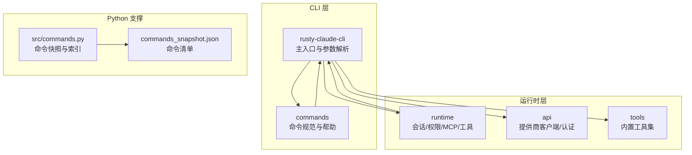
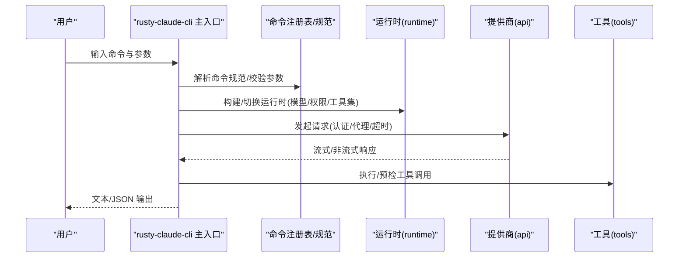
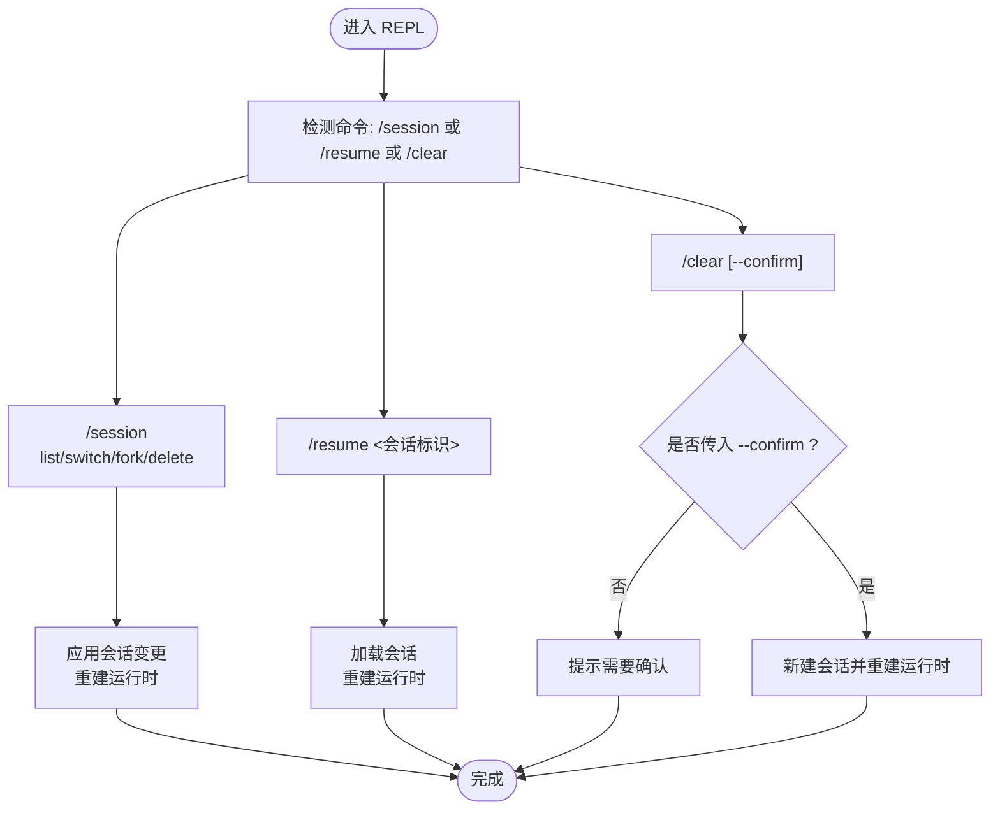
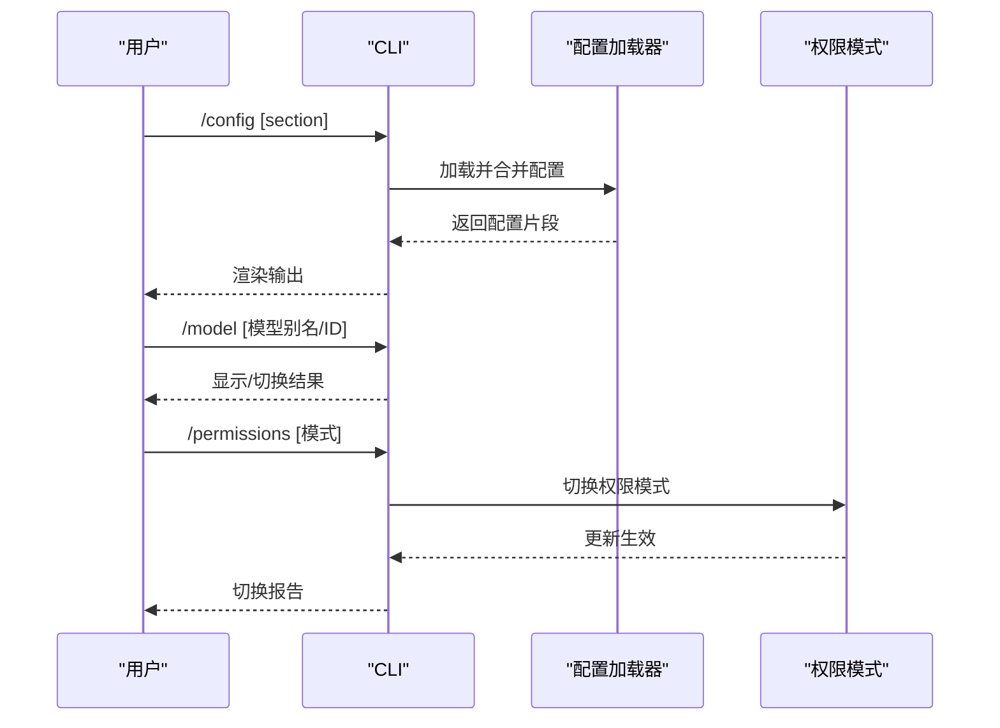
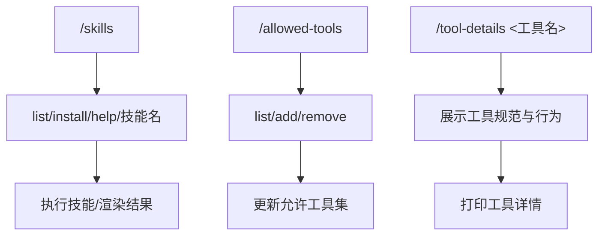
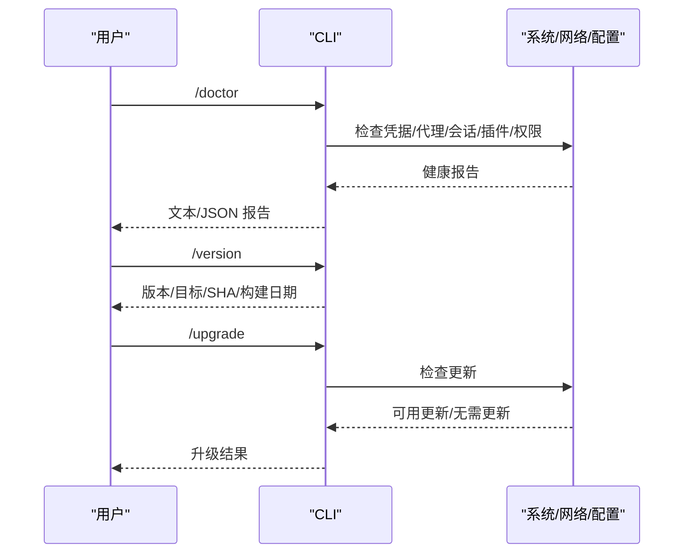
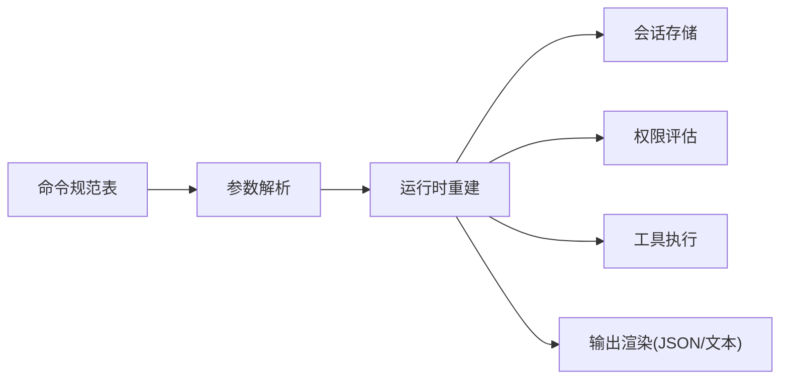

# 内置命令详解

<cite>
**本文档引用的文件**
- [README.md](file://README.md)
- [USAGE.md](file://USAGE.md)
- [rust/README.md](file://rust/README.md)
- [src/commands.py](file://src/commands.py)
- [src/reference_data/commands_snapshot.json](file://src/reference_data/commands_snapshot.json)
- [rust/Cargo.toml](file://rust/Cargo.toml)
- [rust/crates/commands/src/lib.rs](file://rust/crates/commands/src/lib.rs)
- [rust/crates/rusty-claude-cli/src/main.rs](file://rust/crates/rusty-claude-cli/src/main.rs)
- [rust/crates/runtime/src/lib.rs](file://rust/crates/runtime/src/lib.rs)
</cite>

## 目录
1. [简介](#简介)
2. [项目结构](#项目结构)
3. [核心组件](#核心组件)
4. [架构总览](#架构总览)
5. [详细组件分析](#详细组件分析)
6. [依赖关系分析](#依赖关系分析)
7. [性能考量](#性能考量)
8. [故障排查指南](#故障排查指南)
9. [结论](#结论)
10. [附录](#附录)

## 简介
本文件面向使用者与开发者，系统化梳理 Claw Code（Rust 实现）中的“内置命令”体系，涵盖会话管理、配置与权限、工具控制、系统诊断与版本信息等模块。文档以“功能模块”为主线，逐项说明命令的用途、语法、参数、返回行为、安全与权限要求，并给出典型用法与组合策略，帮助用户在不同工作流中高效、安全地使用内置命令。

## 项目结构
- 核心 CLI 二进制位于 Rust 工作区，命令表面由 crates 中的命令注册表与解析器共同定义。
- Python 层提供命令快照与索引能力，用于展示与检索已镜像的命令清单。
- 运行时层负责会话持久化、权限评估、MCP 生命周期、工具执行与提示词组装等。

图表来源
- [rust/crates/rusty-claude-cli/src/main.rs](file://rust/crates/rusty-claude-cli/src/main.rs)
- [rust/crates/commands/src/lib.rs](file://rust/crates/commands/src/lib.rs)
- [rust/crates/runtime/src/lib.rs](file://rust/crates/runtime/src/lib.rs)
- [src/commands.py](file://src/commands.py)
- [src/reference_data/commands_snapshot.json](file://src/reference_data/commands_snapshot.json)

章节来源
- [rust/README.md](file://rust/README.md)
- [rust/Cargo.toml](file://rust/Cargo.toml)

## 核心组件
- 命令注册与规范：通过集中定义的规格表描述命令名称、别名、摘要、参数提示与是否支持从会话恢复等元数据。
- CLI 解析与分发：根据输入参数选择顶层命令或直接的斜杠命令，调用相应处理逻辑。
- 运行时集成：命令执行通常会构建或切换运行时上下文（模型、权限模式、允许工具集），并与会话存储交互。
- 权限与安全：权限模式影响工具调用的许可与交互式确认流程；危险全权限模式可跳过部分权限提示。
- 输出格式：支持文本与 JSON 两种输出格式，便于自动化脚本消费。

章节来源
- [rust/crates/commands/src/lib.rs](file://rust/crates/commands/src/lib.rs)
- [rust/crates/rusty-claude-cli/src/main.rs](file://rust/crates/rusty-claude-cli/src/main.rs)
- [rust/crates/runtime/src/lib.rs](file://rust/crates/runtime/src/lib.rs)

## 架构总览
下图展示了 CLI 参数解析到命令执行的关键路径，以及与运行时、权限、工具系统的交互。

图表来源
- [rust/crates/rusty-claude-cli/src/main.rs](file://rust/crates/rusty-claude-cli/src/main.rs)
- [rust/crates/commands/src/lib.rs](file://rust/crates/commands/src/lib.rs)
- [rust/crates/runtime/src/lib.rs](file://rust/crates/runtime/src/lib.rs)

## 详细组件分析

### 会话管理命令
- /session：列出、切换、派生或删除本地会话；支持派生新分支并保留当前会话状态。
- /resume：加载指定会话至 REPL，支持从最新会话快速恢复。
- /clear：启动全新本地会话，需显式确认（--confirm）以避免误操作。

图表来源
- [rust/crates/commands/src/lib.rs](file://rust/crates/commands/src/lib.rs)
- [rust/crates/rusty-claude-cli/src/main.rs](file://rust/crates/rusty-claude-cli/src/main.rs)

章节来源
- [rust/crates/commands/src/lib.rs](file://rust/crates/commands/src/lib.rs)
- [rust/crates/rusty-claude-cli/src/main.rs](file://rust/crates/rusty-claude-cli/src/main.rs)

### 配置与权限命令
- /config：查看合并后的配置文件内容，可限定 section（如 env、hooks、model、plugins）。
- /model：查看或切换当前活跃模型；支持别名解析。
- /permissions：查看或切换权限模式（read-only、workspace-write、danger-full-access）。

图表来源
- [rust/crates/commands/src/lib.rs](file://rust/crates/commands/src/lib.rs)
- [rust/crates/rusty-claude-cli/src/main.rs](file://rust/crates/rusty-claude-cli/src/main.rs)
- [rust/crates/runtime/src/lib.rs](file://rust/crates/runtime/src/lib.rs)

章节来源
- [rust/crates/commands/src/lib.rs](file://rust/crates/commands/src/lib.rs)
- [rust/crates/rusty-claude-cli/src/main.rs](file://rust/crates/rusty-claude-cli/src/main.rs)
- [rust/crates/runtime/src/lib.rs](file://rust/crates/runtime/src/lib.rs)

### 工具与技能命令
- /tool-details：显示特定工具的详细信息。
- /allowed-tools：查看或修改允许工具列表（add/remove/list）。
- /skills：列出、安装或调用可用技能；支持直接以技能名作为简写触发一次提示。

图表来源
- [rust/crates/commands/src/lib.rs](file://rust/crates/commands/src/lib.rs)
- [rust/crates/rusty-claude-cli/src/main.rs](file://rust/crates/rusty-claude-cli/src/main.rs)

章节来源
- [rust/crates/commands/src/lib.rs](file://rust/crates/commands/src/lib.rs)
- [rust/crates/rusty-claude-cli/src/main.rs](file://rust/crates/rusty-claude-cli/src/main.rs)

### 系统与诊断命令
- /doctor：诊断环境健康状况与设置问题，常用于首次构建后或问题复现前的自检。
- /version：显示 CLI 版本与构建信息。
- /upgrade：检查并安装 CLI 更新（若可用）。

图表来源
- [rust/crates/commands/src/lib.rs](file://rust/crates/commands/src/lib.rs)
- [rust/crates/rusty-claude-cli/src/main.rs](file://rust/crates/rusty-claude-cli/src/main.rs)

章节来源
- [rust/crates/commands/src/lib.rs](file://rust/crates/commands/src/lib.rs)
- [rust/crates/rusty-claude-cli/src/main.rs](file://rust/crates/rusty-claude-cli/src/main.rs)

### 其他常用命令
- /status：显示当前会话状态与运行时概要。
- /sandbox：显示沙箱隔离状态。
- /mcp /agents /skills /export /diff /commit /pr /issue /init /compact /cost /usage /stats 等，覆盖工作区、Git、任务与统计等场景。

章节来源
- [rust/crates/commands/src/lib.rs](file://rust/crates/commands/src/lib.rs)
- [rust/crates/rusty-claude-cli/src/main.rs](file://rust/crates/rusty-claude-cli/src/main.rs)

## 依赖关系分析
- 命令规范与解析：命令注册表提供统一的命令元数据，CLI 解析器据此进行参数校验与分发。
- 运行时耦合：命令执行通常会重建运行时（含模型、权限、工具集），并与会话存储交互。
- 权限控制：权限模式决定工具调用许可与交互式审批流程；危险全权限模式可跳过部分提示。
- 输出格式：CLI 支持文本与 JSON 两种输出，便于自动化与调试。

图表来源
- [rust/crates/commands/src/lib.rs](file://rust/crates/commands/src/lib.rs)
- [rust/crates/rusty-claude-cli/src/main.rs](file://rust/crates/rusty-claude-cli/src/main.rs)
- [rust/crates/runtime/src/lib.rs](file://rust/crates/runtime/src/lib.rs)

章节来源
- [rust/crates/commands/src/lib.rs](file://rust/crates/commands/src/lib.rs)
- [rust/crates/rusty-claude-cli/src/main.rs](file://rust/crates/rusty-claude-cli/src/main.rs)
- [rust/crates/runtime/src/lib.rs](file://rust/crates/runtime/src/lib.rs)

## 性能考量
- 会话压缩：/compact 可减少历史消息体积，降低上下文开销。
- 权限与工具：限制允许工具集与权限模式可减少不必要的交互与 IO，提升响应速度。
- 输出格式：JSON 输出便于流水线处理，但可能增加序列化成本；在高频批处理中可权衡取舍。
- 代理与网络：合理配置代理与超时参数可避免阻塞，提高稳定性。

## 故障排查指南
- /doctor：优先运行以定位凭据、代理、会话与插件相关问题。
- 权限相关错误：确认权限模式与工具集配置；必要时使用危险全权限模式进行最小化验证。
- 会话异常：使用 /session list 查看会话状态，/resume 加载正确会话，/clear 在确认后重置。
- 输出格式：当需要机器可读输出时，使用 --output-format json 并捕获标准错误中的 JSON 错误对象。

章节来源
- [rust/crates/rusty-claude-cli/src/main.rs](file://rust/crates/rusty-claude-cli/src/main.rs)
- [rust/crates/commands/src/lib.rs](file://rust/crates/commands/src/lib.rs)

## 结论
内置命令体系围绕“会话—配置—权限—工具—系统”五大维度展开，既满足日常开发与运维需求，又提供强大的诊断与可观测性能力。通过合理的命令组合与权限策略，可在保证安全的前提下最大化效率。

## 附录

### 命令速查与示例（基于仓库文档）
- 会话管理
  - /session list：列出本地会话
  - /session switch <会话ID>：切换到指定会话
  - /session fork [分支名]：派生新会话
  - /session delete <会话ID> [--force]：删除会话
  - /resume latest：从最新会话恢复
  - /clear --confirm：清空并开始全新会话
- 配置与权限
  - /config：查看合并配置
  - /config env|hooks|model|plugins：查看指定节
  - /model：查看/切换模型
  - /permissions：查看/切换权限模式
- 工具与技能
  - /tool-details <工具名>：查看工具详情
  - /allowed-tools list：查看允许工具集
  - /allowed-tools add <工具名>：添加允许工具
  - /allowed-tools remove <工具名>：移除允许工具
  - /skills list/install/help/技能名：技能管理与调用
- 系统与诊断
  - /doctor：健康检查
  - /version：版本信息
  - /upgrade：检查并安装更新
- 其他常用
  - /status：会话状态
  - /sandbox：沙箱状态
  - /mcp /agents /skills /export /diff /commit /pr /issue /init /compact /cost /usage /stats

章节来源
- [USAGE.md](file://USAGE.md)
- [rust/README.md](file://rust/README.md)
- [rust/crates/commands/src/lib.rs](file://rust/crates/commands/src/lib.rs)