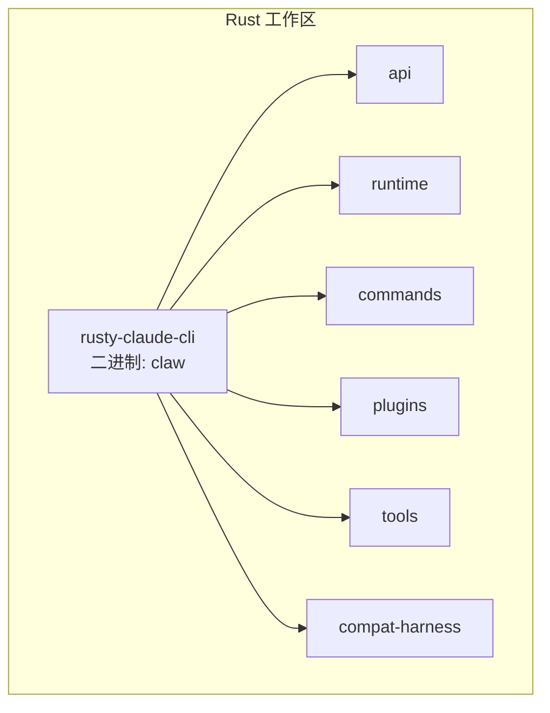
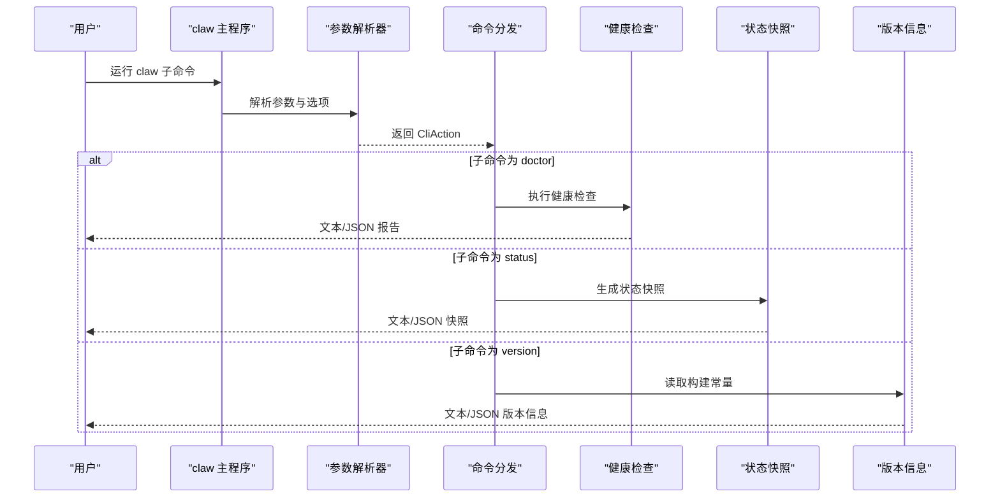
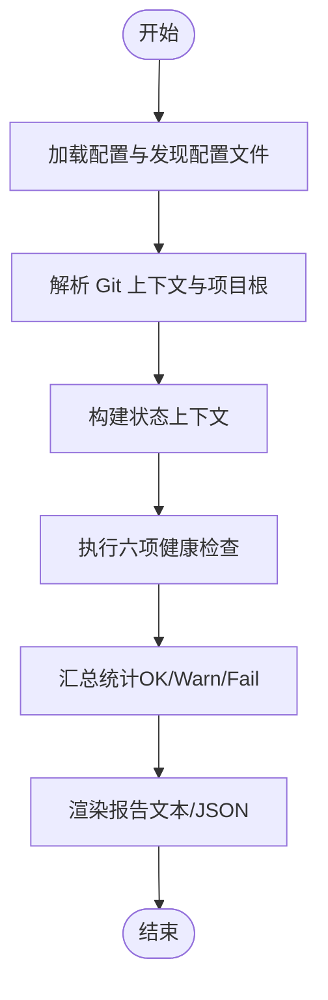
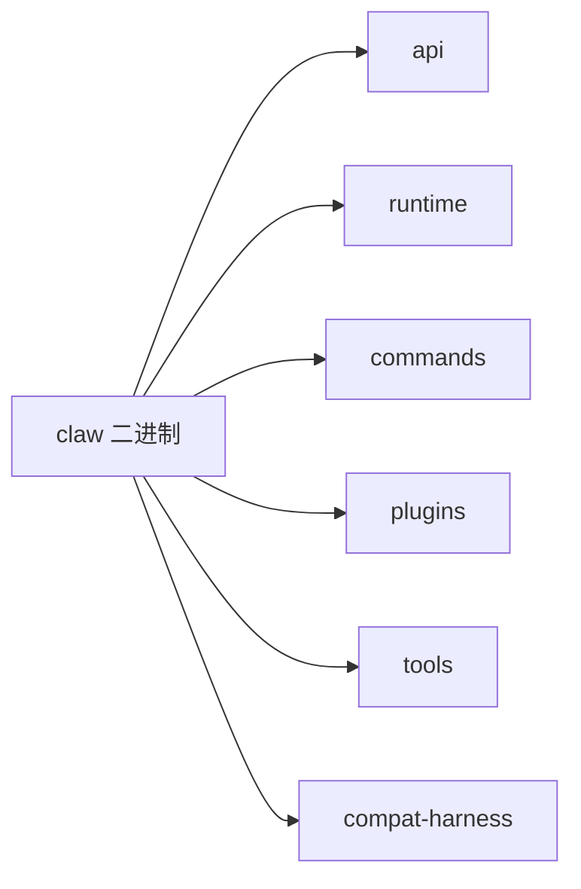

# 实用工具命令

<cite>
**本文引用的文件**
- [README.md](file://README.md)
- [USAGE.md](file://USAGE.md)
- [rusty-claude-cli 源码 main.rs](file://rust/crates/rusty-claude-cli/src/main.rs)
- [rusty-claude-cli 构建脚本 build.rs](file://rust/crates/rusty-claude-cli/build.rs)
- [rusty-claude-cli 包配置 Cargo.toml](file://rust/crates/rusty-claude-cli/Cargo.toml)
- [CLI 单元测试（含 doctor/status 输出）](file://rust/crates/rusty-claude-cli/tests/cli_flags_and_config_defaults.rs)
- [CLI 输出格式契约测试（含 doctor JSON）](file://rust/crates/rusty-claude-cli/tests/output_format_contract.rs)
- [Python 主入口（命令行示例）](file://src/main.py)
</cite>

## 目录
1. [简介](#简介)
2. [项目结构](#项目结构)
3. [核心组件](#核心组件)
4. [架构总览](#架构总览)
5. [详细组件分析](#详细组件分析)
6. [依赖分析](#依赖分析)
7. [性能考虑](#性能考虑)
8. [故障排除指南](#故障排除指南)
9. [结论](#结论)
10. [附录](#附录)

## 简介
本文件聚焦于 claw CLI 的实用工具命令，包括帮助、状态查询、健康检查、版本信息与升级提示等系统诊断与信息查询能力。内容覆盖：
- 命令功能与典型使用场景
- 输出格式（文本/JSON）
- 健康检查维度与系统状态评估方法
- 错误诊断与常见问题定位
- 性能与可维护性建议

## 项目结构
- CLI 可执行程序由 Rust 工作区中的 rusty-claude-cli crate 提供，二进制名为 claw。
- CLI 参数解析、子命令分发与输出格式控制集中在主入口文件中。
- 版本信息在构建时注入，支持以 JSON 格式输出版本详情。

图表来源
- [Cargo.toml:8-25](file://rust/crates/rusty-claude-cli/Cargo.toml#L8-L25)

章节来源
- [README.md:31-36](file://README.md#L31-L36)
- [USAGE.md:296-306](file://USAGE.md#L296-L306)
- [Cargo.toml:8-25](file://rust/crates/rusty-claude-cli/Cargo.toml#L8-L25)

## 核心组件
- 命令解析与分发：根据传入参数识别子命令（如 status、doctor、version），并设置输出格式（文本或 JSON）。
- 健康检查（doctor）：对认证、配置、安装来源、工作区、沙箱与系统环境进行本地健康检查，汇总为报告。
- 状态快照（status）：展示当前工作区的模型、权限、Git 状态、配置文件与沙箱状态等快照信息。
- 版本信息（version）：打印构建版本、目标平台、构建日期与 Git SHA，并支持 JSON 输出。
- 升级提示：通过内置常量与官方仓库链接，提示用户从源码构建或遵循上游二进制发布流程。

章节来源
- [rusty-claude-cli 源码 main.rs:392-780](file://rust/crates/rusty-claude-cli/src/main.rs#L392-L780)
- [rusty-claude-cli 源码 main.rs:1454-1504](file://rust/crates/rusty-claude-cli/src/main.rs#L1454-L1504)
- [rusty-claude-cli 源码 main.rs:210-251](file://rust/crates/rusty-claude-cli/src/main.rs#L210-L251)
- [rusty-claude-cli 源码 main.rs:2120-2128](file://rust/crates/rusty-claude-cli/src/main.rs#L2120-L2128)
- [rusty-claude-cli 构建脚本 build.rs:1-57](file://rust/crates/rusty-claude-cli/build.rs#L1-L57)

## 架构总览
下图展示了 CLI 启动后到各实用工具命令执行的关键路径与数据流。

图表来源
- [rusty-claude-cli 源码 main.rs:180-277](file://rust/crates/rusty-claude-cli/src/main.rs#L180-L277)
- [rusty-claude-cli 源码 main.rs:392-780](file://rust/crates/rusty-claude-cli/src/main.rs#L392-L780)
- [rusty-claude-cli 源码 main.rs:1454-1504](file://rust/crates/rusty-claude-cli/src/main.rs#L1454-L1504)
- [rusty-claude-cli 源码 main.rs:2120-2128](file://rust/crates/rusty-claude-cli/src/main.rs#L2120-L2128)

## 详细组件分析

### 命令：help（帮助）
- 功能：显示通用帮助或特定主题的帮助（如 status、sandbox、doctor）。
- 使用场景：
  - 首次使用时查看可用命令与用法。
  - 需要快速了解某条本地命令（如 doctor）的用途与输出说明。
- 输出格式：文本。
- 典型用法：
  - claw --help
  - claw status --help
  - claw doctor --help

章节来源
- [rusty-claude-cli 源码 main.rs:5158-5183](file://rust/crates/rusty-claude-cli/src/main.rs#L5158-L5183)
- [CLI 单元测试（含 doctor/status 输出）:224-251](file://rust/crates/rusty-claude-cli/tests/cli_flags_and_config_defaults.rs#L224-L251)

### 命令：status（状态快照）
- 功能：展示当前工作区的模型、权限、Git 状态、配置文件数量、沙箱状态等快照信息。
- 使用场景：
  - 日常开发前的预检，确认工作区上下文与权限策略。
  - 自动化流水线中以 JSON 输出用于后续处理。
- 输出格式：文本或 JSON。
- 典型用法：
  - claw status
  - claw --output-format json status

章节来源
- [rusty-claude-cli 源码 main.rs:216-221](file://rust/crates/rusty-claude-cli/src/main.rs#L216-L221)
- [CLI 单元测试（含 doctor/status 输出）:224-251](file://rust/crates/rusty-claude-cli/tests/cli_flags_and_config_defaults.rs#L224-L251)
- [CLI 输出格式契约测试（含 doctor JSON）:199-216](file://rust/crates/rusty-claude-cli/tests/output_format_contract.rs#L199-L216)

### 命令：doctor（健康检查）
- 功能：对认证、配置、安装来源、工作区、沙箱与系统环境进行本地健康检查，生成“OK/Warnings/Failures”统计与逐项明细。
- 使用场景：
  - 新环境首次运行后的全面诊断。
  - 集成测试或 CI 中以 JSON 输出进行自动化校验。
- 输出格式：文本或 JSON。
- 典型用法：
  - claw doctor
  - claw --output-format json doctor

图表来源
- [rusty-claude-cli 源码 main.rs:1454-1489](file://rust/crates/rusty-claude-cli/src/main.rs#L1454-L1489)
- [rusty-claude-cli 源码 main.rs:1405-1438](file://rust/crates/rusty-claude-cli/src/main.rs#L1405-L1438)

章节来源
- [rusty-claude-cli 源码 main.rs:1454-1504](file://rust/crates/rusty-claude-cli/src/main.rs#L1454-L1504)
- [CLI 输出格式契约测试（含 doctor JSON）:199-216](file://rust/crates/rusty-claude-cli/tests/output_format_contract.rs#L199-L216)

### 命令：version（版本信息）
- 功能：打印构建版本、目标平台、构建日期与 Git SHA；支持 JSON 输出。
- 使用场景：
  - 定位问题时提供精确版本信息。
  - 脚本中解析 JSON 字段进行版本比对。
- 输出格式：文本或 JSON。
- 典型用法：
  - claw version
  - claw --output-format json version

章节来源
- [rusty-claude-cli 源码 main.rs:210-211](file://rust/crates/rusty-claude-cli/src/main.rs#L210-L211)
- [rusty-claude-cli 源码 main.rs:2120-2128](file://rust/crates/rusty-claude-cli/src/main.rs#L2120-L2128)
- [rusty-claude-cli 构建脚本 build.rs:6-52](file://rust/crates/rusty-claude-cli/build.rs#L6-L52)

### 命令：upgrade（升级提示）
- 功能：当前 CLI 不直接实现“在线升级”命令；通过内置常量与官方仓库链接提示用户从源码构建或遵循上游二进制发布流程。
- 使用场景：
  - 需要获取最新版本时，指引用户参考官方仓库与发布说明。
- 输出格式：文本。
- 典型用法：
  - claw upgrade（若存在，将返回升级指引；否则按未知命令处理）

章节来源
- [rusty-claude-cli 源码 main.rs:1784-1800](file://rust/crates/rusty-claude-cli/src/main.rs#L1784-L1800)
- [README.md:48-54](file://README.md#L48-L54)

## 依赖分析
- CLI 二进制名称与入口定义在包配置中，依赖多个内部 crate（api、runtime、commands、plugins、tools、compat-harness）。
- 版本信息由构建脚本注入，确保每次构建都携带准确的构建时间、目标平台与 Git SHA。

图表来源
- [Cargo.toml:8-25](file://rust/crates/rusty-claude-cli/Cargo.toml#L8-L25)

章节来源
- [Cargo.toml:8-25](file://rust/crates/rusty-claude-cli/Cargo.toml#L8-L25)
- [rusty-claude-cli 构建脚本 build.rs:1-57](file://rust/crates/rusty-claude-cli/build.rs#L1-L57)

## 性能考虑
- doctor 与 status 在本地执行，不涉及外部网络请求，通常耗时极短。
- JSON 输出适合自动化集成，但会增加序列化开销；在高频调用场景建议谨慎使用。
- 建议在 CI 中缓存工作区状态，避免重复执行昂贵的健康检查步骤。

## 故障排除指南
- doctor 发现失败项
  - 现象：doctor 命令返回非零退出码，且报告包含 Failures 统计。
  - 处理：逐项查看“Details”中的具体原因，修复认证、配置或工作区问题后重试。
- status 输出为空或不完整
  - 现象：部分字段缺失或显示为占位符。
  - 处理：确认当前目录处于有效工作区，检查配置文件发现与加载情况。
- version 输出异常
  - 现象：版本信息显示为 unknown。
  - 处理：确认已成功完成构建；若为文档生成或特殊工具链环境，构建脚本可能无法获取构建时间/SHA。
- 权限与认证相关错误
  - 现象：与认证相关的错误提示。
  - 处理：核对环境变量（如 ANTHROPIC_API_KEY 或 ANTHROPIC_AUTH_TOKEN）是否正确设置；不同凭据不可互换。

章节来源
- [rusty-claude-cli 源码 main.rs:110-139](file://rust/crates/rusty-claude-cli/src/main.rs#L110-L139)
- [USAGE.md:96-124](file://USAGE.md#L96-L124)

## 结论
- help、status、doctor、version 与 upgrade（提示）构成了日常维护与诊断的核心工具集。
- doctor 提供全面的本地健康检查，适合新环境与回归测试。
- status 提供轻量级工作区快照，便于快速确认上下文。
- version 支持文本与 JSON 输出，满足人读与机器读需求。
- 建议在自动化流程中结合 JSON 输出与 doctor 的失败检测，提升稳定性与可观测性。

## 附录
- 常用命令速查
  - claw --help
  - claw status
  - claw doctor
  - claw version
  - claw --output-format json doctor
  - claw --output-format json status
  - claw --output-format json version

章节来源
- [USAGE.md:296-306](file://USAGE.md#L296-L306)
- [CLI 单元测试（含 doctor/status 输出）:224-251](file://rust/crates/rusty-claude-cli/tests/cli_flags_and_config_defaults.rs#L224-L251)
- [CLI 输出格式契约测试（含 doctor JSON）:199-216](file://rust/crates/rusty-claude-cli/tests/output_format_contract.rs#L199-L216)