# 开发辅助命令

<cite>
**本文引用的文件**
- [README.md](file://README.md)
- [USAGE.md](file://USAGE.md)
- [rust/README.md](file://rust/README.md)
- [rust/Cargo.toml](file://rust/Cargo.toml)
- [install.sh](file://install.sh)
- [rust/scripts/run_mock_parity_harness.sh](file://rust/scripts/run_mock_parity_harness.sh)
- [rust/crates/rusty-claude-cli/src/main.rs](file://rust/crates/rusty-claude-cli/src/main.rs)
- [rust/crates/commands/src/lib.rs](file://rust/crates/commands/src/lib.rs)
- [rust/crates/rusty-claude-cli/src/init.rs](file://rust/crates/rusty-claude-cli/src/init.rs)
- [rust/crates/runtime/src/task_packet.rs](file://rust/crates/runtime/src/task_packet.rs)
- [rust/crates/runtime/src/green_contract.rs](file://rust/crates/runtime/src/green_contract.rs)
- [rust/crates/tools/src/lib.rs](file://rust/crates/tools/src/lib.rs)
- [src/reference_data/commands_snapshot.json](file://src/reference_data/commands_snapshot.json)
</cite>

## 目录
1. [简介](#简介)
2. [项目结构](#项目结构)
3. [核心组件](#核心组件)
4. [架构总览](#架构总览)
5. [详细组件分析](#详细组件分析)
6. [依赖关系分析](#依赖关系分析)
7. [性能考量](#性能考量)
8. [故障排查指南](#故障排查指南)
9. [结论](#结论)
10. [附录](#附录)

## 简介
本文件聚焦于开发辅助命令与流程，围绕 bughunter、commit、pr、issue、review、lint、test、build 等与代码质量、自动化测试、持续集成、版本控制及 DevOps 实践相关的命令进行系统化说明。结合仓库中提供的 CLI 命令、脚本与工具模块，给出可操作的使用路径、执行流程图与最佳实践建议，帮助团队在本地与 CI 场景下高效落地“从开发到合并”的端到端工作流。

## 项目结构
该仓库采用多 crate 的 Rust 工作区组织方式，核心 CLI 位于 rusty-claude-cli crate；commands 提供命令注册与帮助；runtime 负责会话、权限与策略；tools 提供内置工具与自动化能力；mock-anthropic-service 用于本地/CI 的模拟服务验证；安装与构建通过 install.sh 与 Cargo 工作区完成。

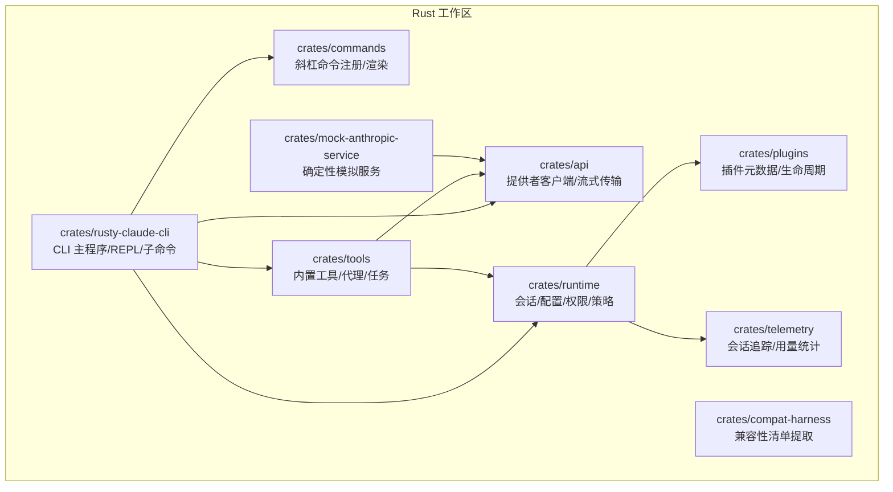

图表来源
- [rust/README.md:175-216](file://rust/README.md#L175-L216)
- [rust/Cargo.toml:1-23](file://rust/Cargo.toml#L1-L23)

章节来源
- [README.md:31-44](file://README.md#L31-L44)
- [rust/README.md:175-216](file://rust/README.md#L175-L216)
- [rust/Cargo.toml:1-23](file://rust/Cargo.toml#L1-L23)

## 核心组件
- CLI 主程序（claw）：支持交互 REPL、一次性提示、JSON 输出、权限模式与模型选择，并提供多种顶层命令与斜杠命令。
- 命令注册（commands）：集中定义斜杠命令规范，包含 test、lint、build、run 等开发相关命令。
- 运行时（runtime）：会话持久化、权限策略、绿灯等级（GreenLevel/GreenContract）、任务包校验（TaskPacket）。
- 工具集（tools）：内置工具（bash、read、write、edit、grep、glob、web 搜索/抓取、代理、技能等），以及自动完成检测、摘要质量评估等。
- 安装与构建（install.sh、Cargo.toml）：统一的安装脚本与工作区 lint 规则，保障一致性与可重复构建。

章节来源
- [rust/README.md:116-174](file://rust/README.md#L116-L174)
- [rust/crates/commands/src/lib.rs:718-763](file://rust/crates/commands/src/lib.rs#L718-L763)
- [rust/crates/runtime/src/green_contract.rs:1-47](file://rust/crates/runtime/src/green_contract.rs#L1-L47)
- [rust/crates/runtime/src/task_packet.rs:1-96](file://rust/crates/runtime/src/task_packet.rs#L1-L96)
- [rust/crates/tools/src/lib.rs:3826-3997](file://rust/crates/tools/src/lib.rs#L3826-L3997)
- [install.sh:1-395](file://install.sh#L1-L395)
- [rust/Cargo.toml:14-23](file://rust/Cargo.toml#L14-L23)

## 架构总览
下图展示从开发者输入到命令执行、工具调用与结果输出的整体流程，覆盖本地开发与 CI 验证场景。

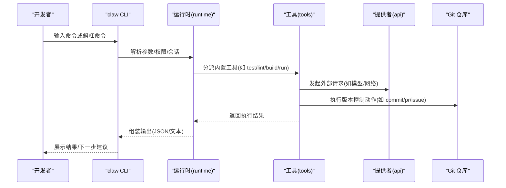

图表来源
- [rust/crates/rusty-claude-cli/src/main.rs:4638-4666](file://rust/crates/rusty-claude-cli/src/main.rs#L4638-L4666)
- [rust/crates/commands/src/lib.rs:718-763](file://rust/crates/commands/src/lib.rs#L718-L763)
- [rust/crates/tools/src/lib.rs:4395-4430](file://rust/crates/tools/src/lib.rs#L4395-L4430)

## 详细组件分析

### bughunter 命令
- 作用：生成“缺陷猎手”报告，指导对指定代码范围进行潜在缺陷与正确性问题的检查。
- 使用场景：在 review 或自检前，快速聚焦高风险区域。
- 行为特征：无参数校验，按 scope 输出“inspect the selected code for likely bugs and correctness issues”。

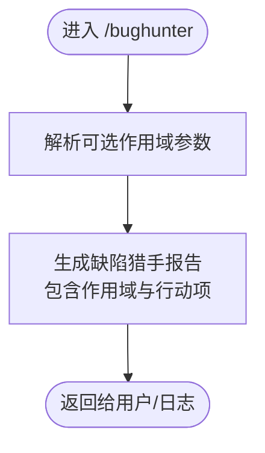

图表来源
- [rust/crates/rusty-claude-cli/src/main.rs:5606-5610](file://rust/crates/rusty-claude-cli/src/main.rs#L5606-L5610)

章节来源
- [rust/crates/rusty-claude-cli/src/main.rs:5606-5610](file://rust/crates/rusty-claude-cli/src/main.rs#L5606-L5610)

### commit 命令
- 作用：预检当前工作区状态，生成提交建议报告；若工作区干净则提示跳过。
- 关键逻辑：读取 git 状态，解析分支与变更摘要，输出“创建提交”的前置信息与下一步建议。

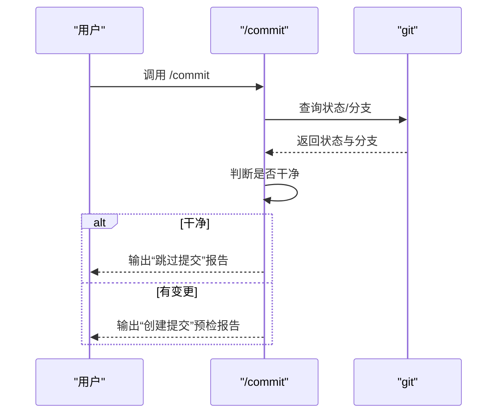

图表来源
- [rust/crates/rusty-claude-cli/src/main.rs:4638-4653](file://rust/crates/rusty-claude-cli/src/main.rs#L4638-L4653)

章节来源
- [rust/crates/rusty-claude-cli/src/main.rs:4638-4653](file://rust/crates/rusty-claude-cli/src/main.rs#L4638-L4653)

### pr 命令
- 作用：根据当前分支生成 Pull Request 草案建议，便于在 GitHub/GitLab 等平台创建 PR。
- 关键逻辑：解析当前分支名，输出“draft or create a pull request”相关提示。

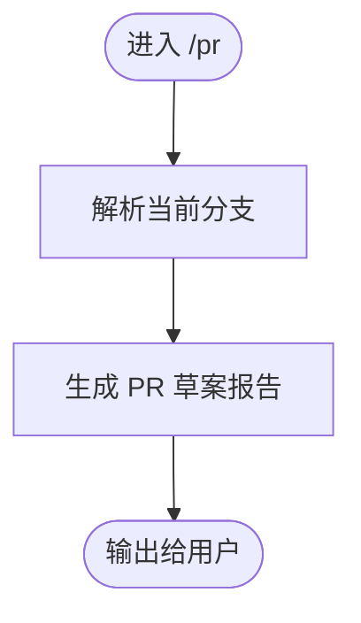

图表来源
- [rust/crates/rusty-claude-cli/src/main.rs:4655-4660](file://rust/crates/rusty-claude-cli/src/main.rs#L4655-L4660)

章节来源
- [rust/crates/rusty-claude-cli/src/main.rs:4655-4660](file://rust/crates/rusty-claude-cli/src/main.rs#L4655-L4660)

### issue 命令
- 作用：基于上下文生成 Issue 草案建议，便于在平台创建问题单。
- 关键逻辑：接收可选上下文参数，输出“draft or create a GitHub issue”相关提示。

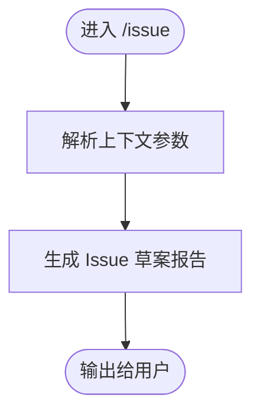

图表来源
- [rust/crates/rusty-claude-cli/src/main.rs:4662-4665](file://rust/crates/rusty-claude-cli/src/main.rs#L4662-L4665)

章节来源
- [rust/crates/rusty-claude-cli/src/main.rs:4662-4665](file://rust/crates/rusty-claude-cli/src/main.rs#L4662-L4665)

### review 命令
- 作用：在 REPL 中触发代码审查相关流程，结合 reviewRemote、ultrareview 等能力进行跨模块审查。
- 参考实现：commands_snapshot 中包含 review、reviewRemote、ultrareview 等命令条目，表明其作为历史命令集的一部分被镜像保留。

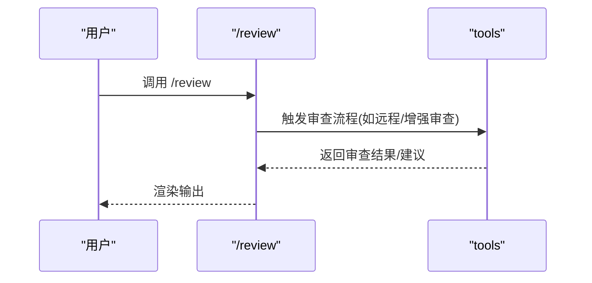

图表来源
- [src/reference_data/commands_snapshot.json:810-844](file://src/reference_data/commands_snapshot.json#L810-L844)

章节来源
- [src/reference_data/commands_snapshot.json:810-844](file://src/reference_data/commands_snapshot.json#L810-L844)

### lint 命令
- 作用：对当前项目运行静态检查（lint），过滤特定子集。
- 行为特征：命令注册显示支持 filter 参数，适合在 CI 中按需筛选目标。

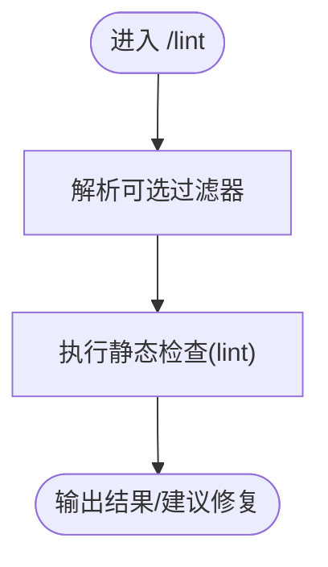

图表来源
- [rust/crates/commands/src/lib.rs:744-749](file://rust/crates/commands/src/lib.rs#L744-L749)

章节来源
- [rust/crates/commands/src/lib.rs:744-749](file://rust/crates/commands/src/lib.rs#L744-L749)

### test 命令
- 作用：对当前项目运行测试，支持过滤器。
- 行为特征：命令注册显示支持 filter 参数，适合在本地与 CI 中快速验证。

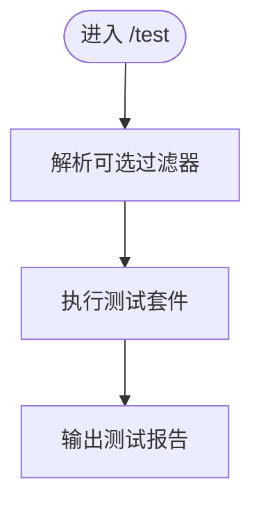

图表来源
- [rust/crates/commands/src/lib.rs:737-742](file://rust/crates/commands/src/lib.rs#L737-L742)

章节来源
- [rust/crates/commands/src/lib.rs:737-742](file://rust/crates/commands/src/lib.rs#L737-L742)

### build 命令
- 作用：构建当前项目，支持目标过滤。
- 行为特征：命令注册显示支持 target 参数，便于在 CI 中按需构建。

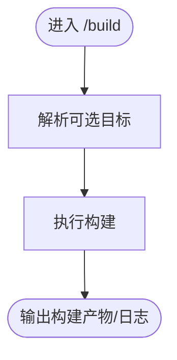

图表来源
- [rust/crates/commands/src/lib.rs:751-756](file://rust/crates/commands/src/lib.rs#L751-L756)

章节来源
- [rust/crates/commands/src/lib.rs:751-756](file://rust/crates/commands/src/lib.rs#L751-L756)

### run 命令
- 作用：在项目上下文中执行任意命令，便于集成自定义脚本或工具。
- 行为特征：命令注册显示需要 <command> 参数，适合流水线扩展。

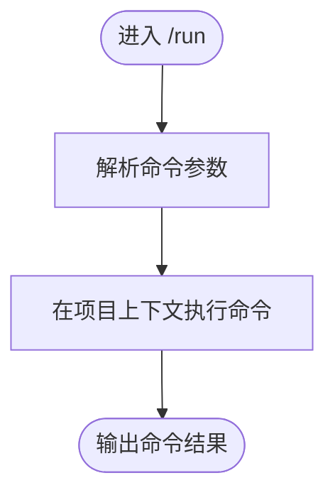

图表来源
- [rust/crates/commands/src/lib.rs:758-763](file://rust/crates/commands/src/lib.rs#L758-L763)

章节来源
- [rust/crates/commands/src/lib.rs:758-763](file://rust/crates/commands/src/lib.rs#L758-L763)

### 代码质量与绿灯策略（GreenContract）
- GreenLevel：定义目标测试、包级、工作区、合并就绪四个层级。
- GreenContract：以合同形式约束合并前必须达到的最低绿灯级别，未达标则阻断合并。
- 用途：在 CI 中以策略引擎评估 lane 的绿灯状态，确保质量门槛。

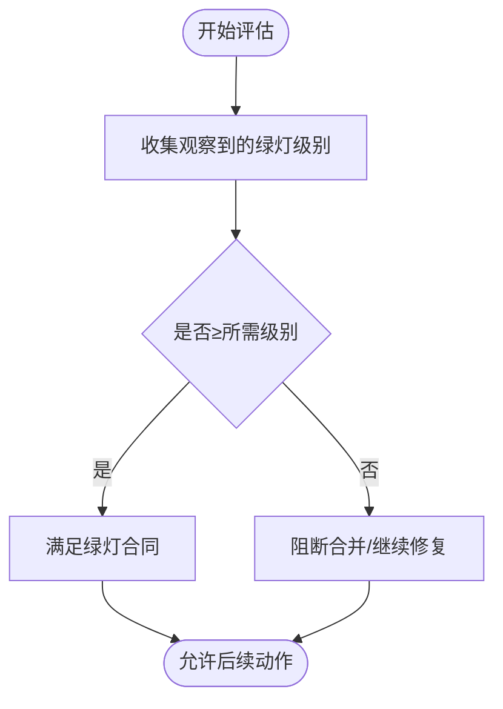

图表来源
- [rust/crates/runtime/src/green_contract.rs:1-47](file://rust/crates/runtime/src/green_contract.rs#L1-L47)

章节来源
- [rust/crates/runtime/src/green_contract.rs:1-47](file://rust/crates/runtime/src/green_contract.rs#L1-L47)

### 任务包与验证（TaskPacket）
- TaskPacket：封装任务目标、范围、仓库、分支策略、验收测试、提交策略、上报契约与升级策略。
- validate_packet：对必填字段与验收测试列表进行校验，保证任务描述完整且可执行。

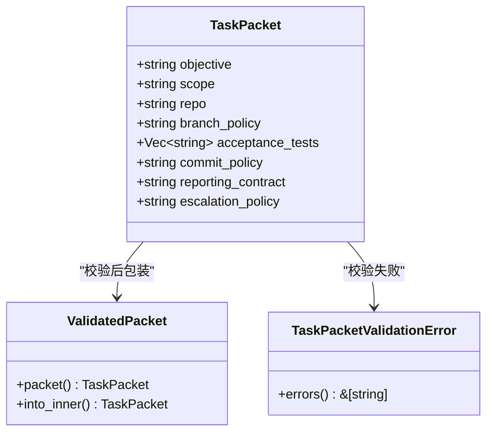

图表来源
- [rust/crates/runtime/src/task_packet.rs:1-96](file://rust/crates/runtime/src/task_packet.rs#L1-L96)

章节来源
- [rust/crates/runtime/src/task_packet.rs:1-96](file://rust/crates/runtime/src/task_packet.rs#L1-L96)

### 自动完成检测与摘要质量评估（tools）
- detect_lane_completion：在成功完成、无阻塞、测试通过、已推送的前提下，自动标记 lane 完成。
- assess_lane_summary_quality：评估摘要质量，识别空摘要、仅控制语句、字数不足但缺乏上下文信号等问题，必要时应用质量门槛。

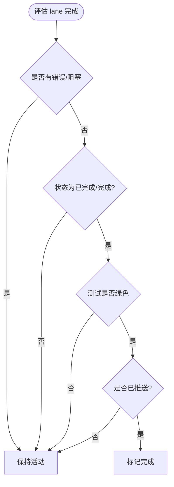

图表来源
- [rust/crates/tools/src/lane_completion.rs:18-44](file://rust/crates/tools/src/lane_completion.rs#L18-L44)

章节来源
- [rust/crates/tools/src/lane_completion.rs:18-44](file://rust/crates/tools/src/lane_completion.rs#L18-L44)

## 依赖关系分析
- CLI 与命令注册：CLI 通过 commands crate 获取命令定义与帮助文本，统一渲染输出。
- 运行时与工具：CLI 将命令分派给 runtime 与 tools，后者负责具体工具执行与外部交互。
- 提供者与工具：tools 通过 api crate 访问模型/网络接口，形成“命令→工具→提供者”的调用链。
- 安装与工作区：install.sh 统一构建流程，Cargo.toml 定义工作区与 lint 规则，确保一致性。

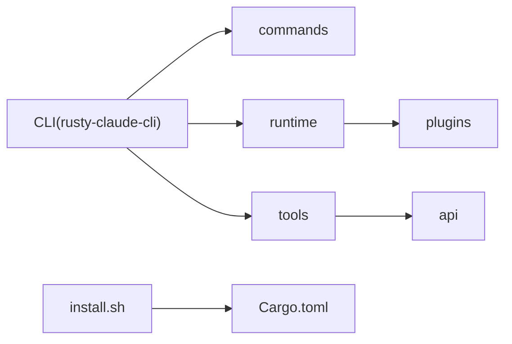

图表来源
- [rust/README.md:175-216](file://rust/README.md#L175-L216)
- [rust/Cargo.toml:1-23](file://rust/Cargo.toml#L1-L23)
- [install.sh:308-331](file://install.sh#L308-L331)

章节来源
- [rust/README.md:175-216](file://rust/README.md#L175-L216)
- [rust/Cargo.toml:1-23](file://rust/Cargo.toml#L1-L23)
- [install.sh:308-331](file://install.sh#L308-L331)

## 性能考量
- 构建性能：install.sh 支持 debug/release 两种构建档，release 构建体积更小、启动更快，适合生产环境；debug 更利于调试。
- 测试与 Lint：在本地与 CI 中优先使用 filter 参数缩小范围，减少等待时间；结合 GreenContract 在早期阻断低质量变更。
- 输出格式：使用 --output-format json 便于脚本化与自动化处理，降低解析成本。

章节来源
- [install.sh:88-126](file://install.sh#L88-L126)
- [USAGE.md:67-73](file://USAGE.md#L67-L73)
- [rust/crates/commands/src/lib.rs:737-763](file://rust/crates/commands/src/lib.rs#L737-L763)

## 故障排查指南
- 安装与构建
  - 缺少 Rust 工具链或 PATH 未更新：参考 install.sh 的故障排查段落，重新加载 shell 或安装 Xcode CLT（macOS）。
  - Linux 系统缺失依赖：安装 git、pkg-config、OpenSSL 头文件等。
  - Windows 用户：使用 WSL 运行安装脚本。
- 运行时诊断
  - 使用 /doctor 进行健康检查，确认凭据、代理、模型与权限设置。
  - 使用 /status、/diff、/config 等命令查看工作区状态与配置。
- 版本控制
  - /commit 预检：若提示“无工作区变更”，先使用 /status 与 /diff 检查差异，再执行提交。
  - /pr 与 /issue：根据当前分支与上下文生成草稿建议，便于在平台创建 PR/Issue。
- 代码质量
  - /lint 与 /test：在本地先行修复告警与失败用例，避免污染 CI。
  - GreenContract：在 CI 中以策略引擎评估 lane 绿灯状态，未达标则阻断合并。

章节来源
- [install.sh:131-172](file://install.sh#L131-L172)
- [USAGE.md:5-17](file://USAGE.md#L5-L17)
- [rust/crates/rusty-claude-cli/src/main.rs:4638-4666](file://rust/crates/rusty-claude-cli/src/main.rs#L4638-L4666)
- [rust/crates/runtime/src/green_contract.rs:1-47](file://rust/crates/runtime/src/green_contract.rs#L1-L47)

## 结论
通过将 bughunter、commit、pr、issue、review、lint、test、build 等命令与工作区的 CLI、运行时、工具与策略体系相结合，团队可在本地与 CI 中实现从发现问题、修复问题、验证质量到推动合并的闭环。配合 install.sh 与 Cargo 工作区的统一构建与 lint 规则，可显著提升开发效率与交付质量。

## 附录
- 快速开始与健康检查
  - 先在 rust 目录执行构建，再运行 claw doctor 进行健康检查。
- 常用命令清单
  - 顶层命令：status、sandbox、agents、mcp、skills、system-prompt 等。
  - 斜杠命令：/doctor、/commit、/pr、/issue、/review、/lint、/test、/build、/run 等。
- CI 推荐流程
  - 安装 → 构建 → Lint → 测试 → 质量评估（绿灯/摘要质量）→ 提交/PR/Issue → 推送

章节来源
- [USAGE.md:296-306](file://USAGE.md#L296-L306)
- [rust/README.md:116-174](file://rust/README.md#L116-L174)
- [rust/scripts/run_mock_parity_harness.sh:1-7](file://rust/scripts/run_mock_parity_harness.sh#L1-L7)