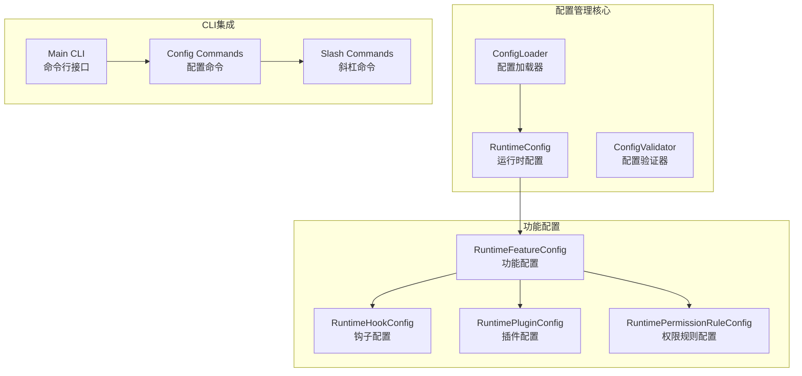
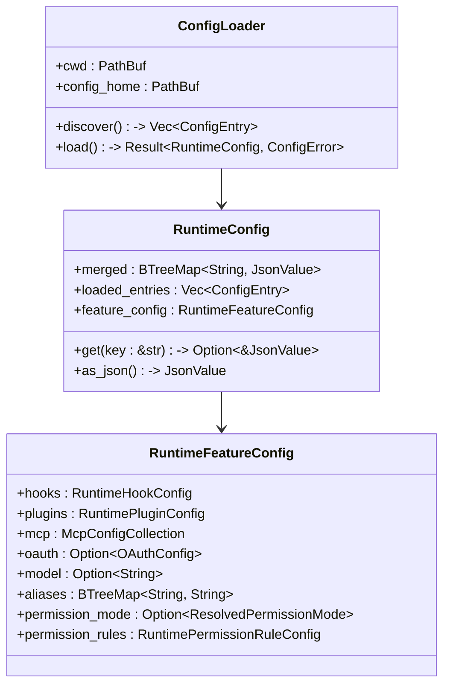
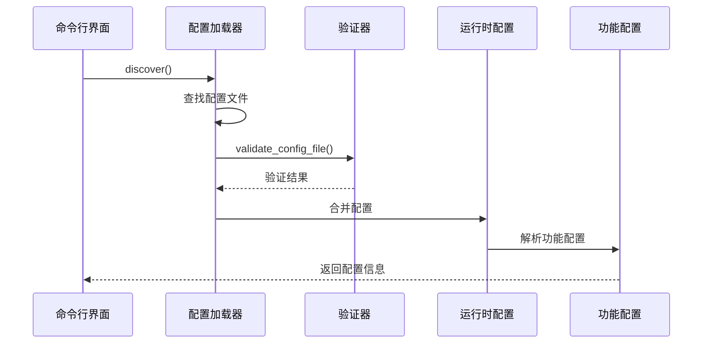
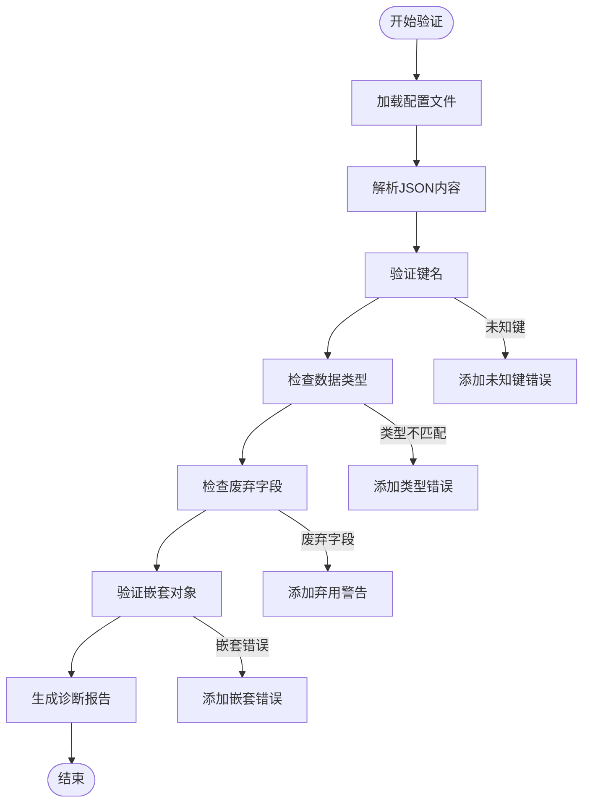
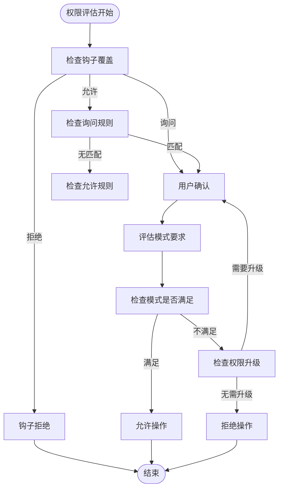
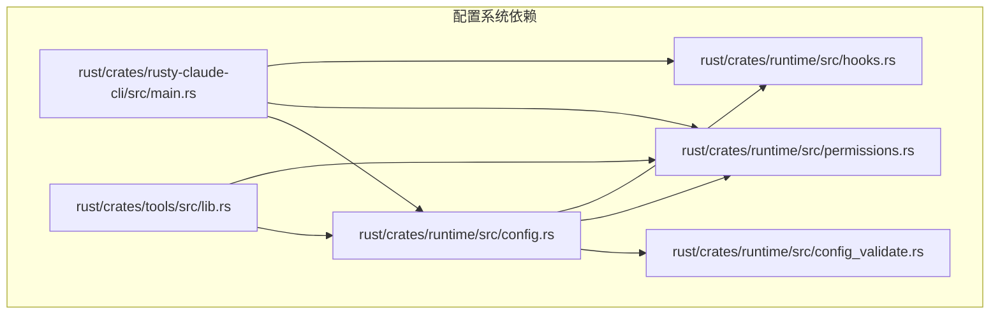

# 配置管理命令

<cite>
**本文档引用的文件**
- [config.rs](file://rust/crates/runtime/src/config.rs)
- [config_validate.rs](file://rust/crates/runtime/src/config_validate.rs)
- [permissions.rs](file://rust/crates/runtime/src/permissions.rs)
- [hooks.rs](file://rust/crates/runtime/src/hooks.rs)
- [main.rs](file://rust/crates/rusty-claude-cli/src/main.rs)
- [.claude.json](file://.claude.json)
- [lib.rs](file://rust/crates/tools/src/lib.rs)
</cite>

## 目录
1. [简介](#简介)
2. [项目结构](#项目结构)
3. [核心组件](#核心组件)
4. [架构概览](#架构概览)
5. [详细组件分析](#详细组件分析)
6. [依赖关系分析](#依赖关系分析)
7. [性能考虑](#性能考虑)
8. [故障排除指南](#故障排除指南)
9. [结论](#结论)
10. [附录](#附录)

## 简介

本文档详细介绍了Claude配置管理命令系统，涵盖config、model、permissions、theme、language等配置相关命令。该系统提供了完整的配置文件层次结构、验证机制、故障排除功能和配置迁移指导。

配置管理命令允许用户查看和修改Claude配置文件，包括环境变量、钩子配置、模型设置、插件配置等。系统支持权限模式切换、主题配置、语言设置等功能，并提供配置验证、故障排除和配置迁移的指导。

## 项目结构

配置管理系统主要由以下核心模块组成：



**图表来源**
- [config.rs:214-326](file://rust/crates/runtime/src/config.rs#L214-L326)
- [main.rs:5185-5305](file://rust/crates/rusty-claude-cli/src/main.rs#L5185-L5305)

**章节来源**
- [config.rs:1-800](file://rust/crates/runtime/src/config.rs#L1-L800)
- [main.rs:5185-5305](file://rust/crates/rusty-claude-cli/src/main.rs#L5185-L5305)

## 核心组件

### 配置发现与加载

配置系统采用分层发现机制，支持多种配置文件位置：

| 配置层级 | 文件路径 | 描述 |
|---------|----------|------|
| 用户级别 | `$HOME/.claw/settings.json` 或 `%APPDATA%\.claw\settings.json` | 用户全局配置 |
| 项目级别 | `.claw.json` | 项目根目录配置 |
| 项目级别 | `.claw/settings.json` | 项目配置目录 |
| 本地级别 | `.claw/settings.local.json` | 本地私有配置 |

### 配置数据结构



**图表来源**
- [config.rs:36-417](file://rust/crates/runtime/src/config.rs#L36-L417)

**章节来源**
- [config.rs:214-326](file://rust/crates/runtime/src/config.rs#L214-L326)
- [config.rs:328-417](file://rust/crates/runtime/src/config.rs#L328-L417)

## 架构概览

配置管理系统的整体架构如下：



**图表来源**
- [config.rs:271-326](file://rust/crates/runtime/src/config.rs#L271-L326)
- [config_validate.rs:436-506](file://rust/crates/runtime/src/config_validate.rs#L436-L506)

## 详细组件分析

### 配置验证系统

配置验证系统提供全面的错误检测和建议功能：



**图表来源**
- [config_validate.rs:436-506](file://rust/crates/runtime/src/config_validate.rs#L436-L506)

验证系统支持以下字段类型验证：
- 字符串字段：`$schema`, `model`, `permissionMode`
- 对象字段：`hooks`, `permissions`, `mcpServers`, `oauth`, `plugins`, `sandbox`
- 数组字段：`trustedRoots`
- 特殊字段：`trustedRoots`（字符串数组）

**章节来源**
- [config_validate.rs:143-200](file://rust/crates/runtime/src/config_validate.rs#L143-L200)
- [config_validate.rs:436-506](file://rust/crates/runtime/src/config_validate.rs#L436-L506)

### 权限管理模式

系统支持多种权限模式，从只读到完全访问：

| 权限模式 | 标签 | 描述 | 允许的操作 |
|---------|------|------|-----------|
| 只读 | `read-only` | 仅允许读取和搜索工具 | 读取文件、搜索代码 |
| 工作区写入 | `workspace-write` | 允许编辑工作区文件 | 写入文件、创建目录 |
| 危险全访问 | `danger-full-access` | 完全工具访问权限 | 执行任意命令、网络访问 |
| 提示 | `prompt` | 需要交互确认的权限 | 升级权限时需要确认 |
| 允许 | `allow` | 显式允许所有操作 | 无限制操作 |

权限评估流程：



**图表来源**
- [permissions.rs:164-292](file://rust/crates/runtime/src/permissions.rs#L164-L292)

**章节来源**
- [permissions.rs:7-28](file://rust/crates/runtime/src/permissions.rs#L7-L28)
- [permissions.rs:97-171](file://rust/crates/runtime/src/permissions.rs#L97-L171)

### 钩子系统

钩子系统提供三个生命周期事件：

| 钩子事件 | 触发时机 | 用途 |
|---------|----------|------|
| PreToolUse | 工具执行前 | 输入验证、安全检查 |
| PostToolUse | 工具执行后成功 | 后处理、日志记录 |
| PostToolUseFailure | 工具执行失败后 | 错误处理、清理 |

钩子输出格式支持以下字段：
- `systemMessage`: 系统消息
- `reason`: 拒绝原因
- `continue`: 是否继续执行
- `decision`: 决策（`block`）
- `hookSpecificOutput`: 钩子特定输出
  - `additionalContext`: 额外上下文
  - `permissionDecision`: 权限决策（`allow`/`deny`/`ask`）
  - `permissionDecisionReason`: 权限决策原因
  - `updatedInput`: 更新后的输入

**章节来源**
- [hooks.rs:18-34](file://rust/crates/runtime/src/hooks.rs#L18-L34)
- [hooks.rs:500-589](file://rust/crates/runtime/src/hooks.rs#L500-L589)

### CLI配置命令

配置管理命令支持以下操作：

#### 基本配置查看
```bash
# 查看所有配置
claw config

# 查看特定部分
claw config env
claw config hooks  
claw config model
claw config plugins
```

#### 配置设置
```bash
# 设置模型
claw config set model claude-3-opus

# 设置权限模式
claw config set permissions.defaultMode workspace-write

# 设置语言
claw config set language zh-CN
```

#### 配置验证
```bash
# 验证配置文件
claw doctor
```

**章节来源**
- [main.rs:5185-5305](file://rust/crates/rusty-claude-cli/src/main.rs#L5185-L5305)
- [lib.rs:5664-5693](file://rust/crates/tools/src/lib.rs#L5664-L5693)

## 依赖关系分析



**图表来源**
- [config.rs:1-10](file://rust/crates/runtime/src/config.rs#L1-L10)
- [main.rs:44-52](file://rust/crates/rusty-claude-cli/src/main.rs#L44-L52)

**章节来源**
- [config.rs:1-10](file://rust/crates/runtime/src/config.rs#L1-L10)
- [main.rs:44-52](file://rust/crates/rusty-claude-cli/src/main.rs#L44-L52)

## 性能考虑

配置系统在设计时考虑了以下性能因素：

1. **延迟加载**：配置文件按需加载，避免不必要的I/O操作
2. **内存优化**：使用BTreeMap进行有序存储，支持高效的查找和合并
3. **增量更新**：支持局部配置更新，减少完整重载
4. **缓存机制**：运行时配置缓存，避免重复解析

## 故障排除指南

### 常见配置错误

| 错误类型 | 症状 | 解决方案 |
|---------|------|---------|
| JSON语法错误 | 配置文件无法解析 | 使用在线JSON验证器检查语法 |
| 未知键错误 | 配置项被忽略 | 检查字段名称拼写，参考配置文档 |
| 类型不匹配 | 配置值被拒绝 | 确保数据类型正确（字符串、布尔值、数组） |
| 废弃字段警告 | 警告提示使用新字段 | 更新到推荐的配置字段 |

### 配置验证命令

```bash
# 运行配置诊断
claw doctor

# 查看配置加载详情
claw config --verbose

# 导出当前配置
claw config export
```

### 环境变量配置

系统支持通过环境变量覆盖配置：

```bash
# 设置配置目录
export CLAW_CONFIG_HOME=/path/to/custom/config

# 设置API密钥
export ANTHROPIC_API_KEY=your_api_key
```

**章节来源**
- [config_validate.rs:521-532](file://rust/crates/runtime/src/config_validate.rs#L521-L532)
- [config.rs:558-565](file://rust/crates/runtime/src/config.rs#L558-L565)

## 结论

Claude配置管理系统提供了完整的配置管理解决方案，具有以下特点：

1. **多层配置支持**：支持用户、项目、本地级别的配置层次
2. **强大的验证机制**：提供全面的配置验证和错误诊断
3. **灵活的权限控制**：支持多种权限模式和动态权限评估
4. **可扩展的钩子系统**：提供完整的生命周期钩子支持
5. **用户友好的CLI接口**：提供直观的配置管理命令

该系统为开发者和用户提供了一个强大而灵活的配置管理平台，支持各种复杂的配置需求和使用场景。

## 附录

### 配置文件示例

基础配置文件结构：
```json
{
  "$schema": "SettingsSchema",
  "model": "claude-3-opus",
  "hooks": {
    "PreToolUse": [],
    "PostToolUse": [],
    "PostToolUseFailure": []
  },
  "permissions": {
    "defaultMode": "workspace-write",
    "allow": [],
    "deny": [],
    "ask": []
  },
  "mcpServers": {},
  "oauth": {},
  "plugins": {
    "enabled": {},
    "externalDirectories": [],
    "installRoot": "",
    "registryPath": "",
    "bundledRoot": "",
    "maxOutputTokens": 0
  },
  "sandbox": {
    "enabled": false,
    "namespaceRestrictions": false,
    "networkIsolation": false,
    "filesystemMode": "none",
    "allowedMounts": []
  },
  "env": {},
  "aliases": {},
  "providerFallbacks": {},
  "trustedRoots": []
}
```

### 配置迁移指南

当从旧版本迁移到新版本时：

1. **备份现有配置**：在迁移前备份所有配置文件
2. **检查废弃字段**：根据验证器警告更新废弃字段
3. **测试配置**：使用`claw doctor`验证新配置
4. **逐步迁移**：先迁移非关键配置，再迁移关键配置

**章节来源**
- [.claude.json:1-6](file://.claude.json#L1-L6)