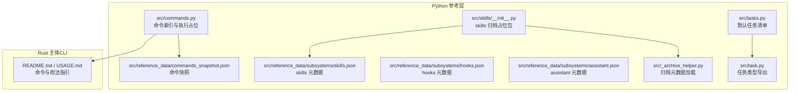
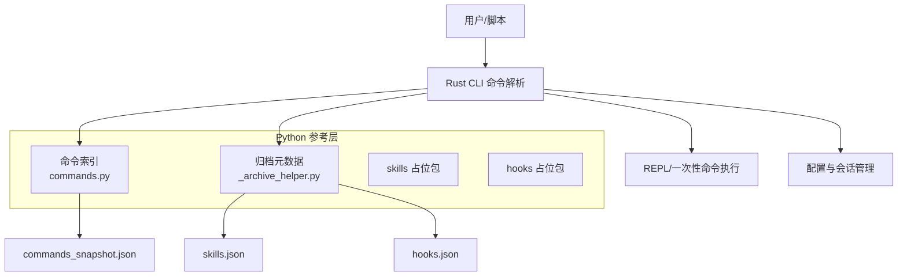
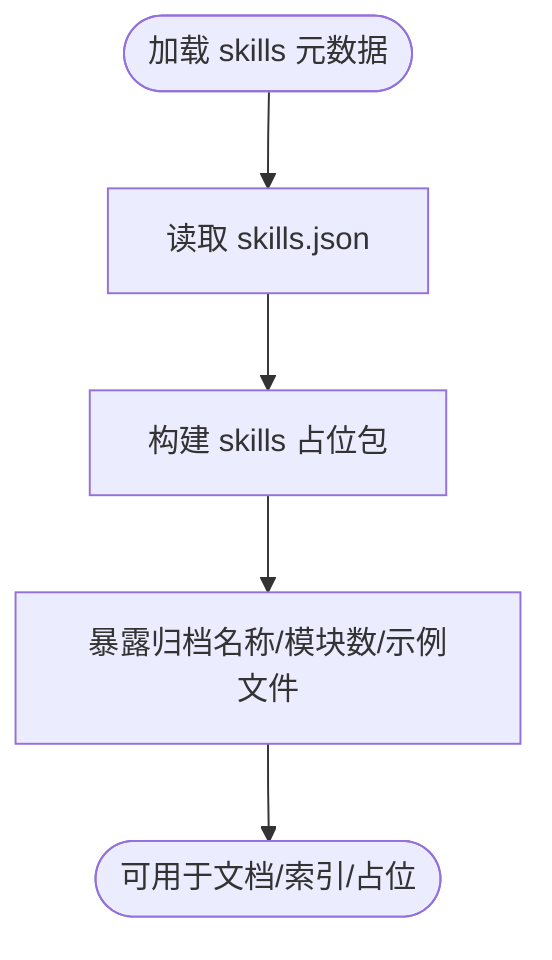
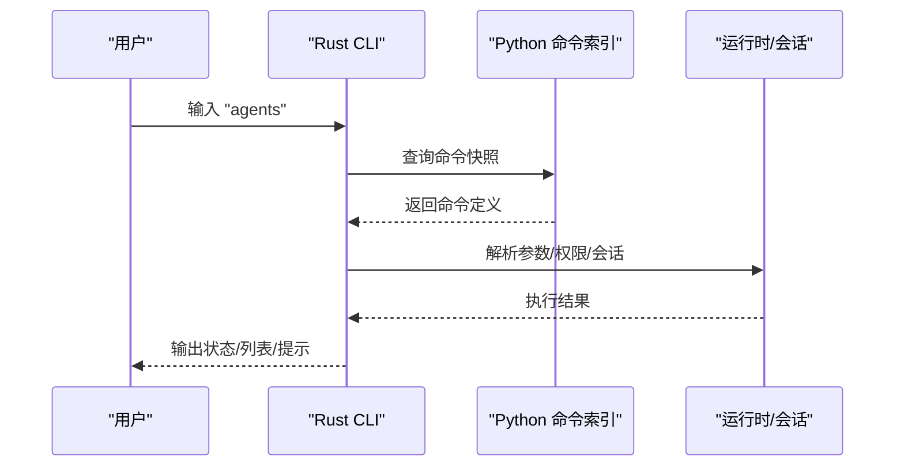
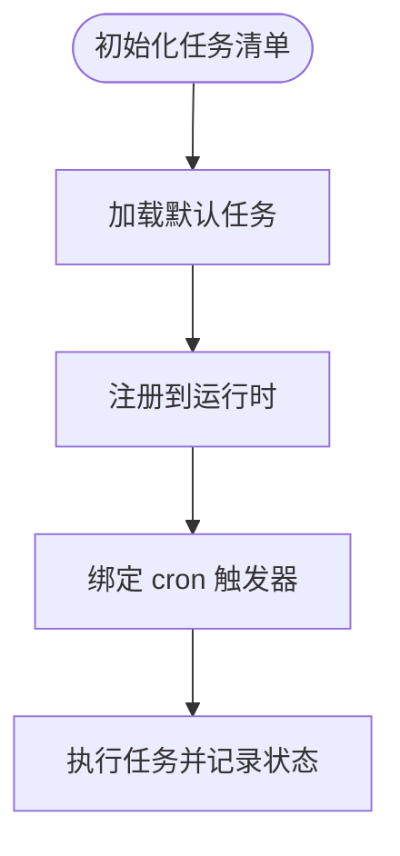
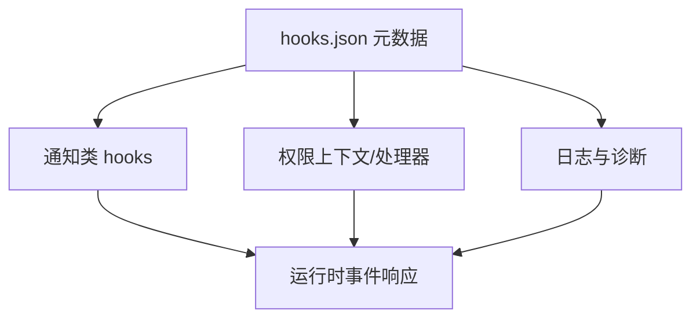
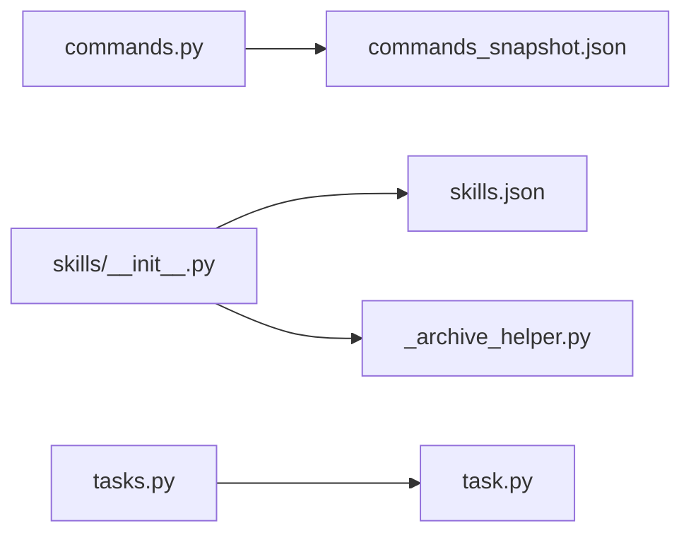

# 高级功能命令

<cite>
**本文引用的文件**
- [README.md](file://README.md)
- [USAGE.md](file://USAGE.md)
- [src/commands.py](file://src/commands.py)
- [src/_archive_helper.py](file://src/_archive_helper.py)
- [src/skills/__init__.py](file://src/skills/__init__.py)
- [src/reference_data/subsystems/skills.json](file://src/reference_data/subsystems/skills.json)
- [src/reference_data/subsystems/hooks.json](file://src/reference_data/subsystems/hooks.json)
- [src/reference_data/subsystems/assistant.json](file://src/reference_data/subsystems/assistant.json)
- [src/reference_data/commands_snapshot.json](file://src/reference_data/commands_snapshot.json)
- [src/tasks.py](file://src/tasks.py)
- [src/task.py](file://src/task.py)
</cite>

## 目录
1. [简介](#简介)
2. [项目结构](#项目结构)
3. [核心组件](#核心组件)
4. [架构总览](#架构总览)
5. [详细组件分析](#详细组件分析)
6. [依赖分析](#依赖分析)
7. [性能考虑](#性能考虑)
8. [故障排查指南](#故障排查指南)
9. [结论](#结论)
10. [附录](#附录)

## 简介
本文件面向高级用户与系统集成开发者，系统性梳理 Claw Code 的“高级功能命令”能力边界与使用路径，重点覆盖以下主题：
- 技能系统（skills）：已归档的技能模块集合与加载机制
- 智能体管理（agents）：命令镜像与交互入口
- 后台任务调度（tasks/cron）：任务清单与调度基础
- 生命周期钩子（hooks）：通知与权限控制等横切能力
- AI 洞察分析（insights）：分析与可视化能力
- 思维回溯（thinkback）：思维链与反思流程
- 复杂工作流自动化与系统集成：命令镜像、插件化与脚本化
- 扩展开发与定制：命令索引、归档元数据与运行时配置

为确保准确性，本文件严格基于仓库中实际存在的 Python 参考实现与 JSON 元数据进行说明，并在涉及 Rust 主体实现时明确标注“概念性说明”。

## 项目结构
Claw Code 的“高级功能命令”主要由两部分构成：
- Python 参考层：提供命令索引、归档元数据加载、任务清单等辅助能力
- Rust 主体：提供 CLI 命令执行、会话、权限、代理与工具桥接等核心运行时

下图展示与“高级功能命令”相关的核心文件与职责映射：

图表来源
- [src/commands.py:1-91](file://src/commands.py#L1-L91)
- [src/_archive_helper.py:1-18](file://src/_archive_helper.py#L1-L18)
- [src/skills/__init__.py:1-15](file://src/skills/__init__.py#L1-L15)
- [src/reference_data/subsystems/skills.json:1-27](file://src/reference_data/subsystems/skills.json#L1-L27)
- [src/reference_data/subsystems/hooks.json:1-32](file://src/reference_data/subsystems/hooks.json#L1-L32)
- [src/reference_data/subsystems/assistant.json:1-8](file://src/reference_data/subsystems/assistant.json#L1-L8)
- [src/reference_data/commands_snapshot.json:1-1037](file://src/reference_data/commands_snapshot.json#L1-L1037)
- [src/tasks.py:1-12](file://src/tasks.py#L1-L12)
- [src/task.py:1-6](file://src/task.py#L1-L6)
- [README.md:1-132](file://README.md#L1-L132)
- [USAGE.md:1-366](file://USAGE.md#L1-L366)

章节来源
- [README.md:1-132](file://README.md#L1-L132)
- [USAGE.md:1-366](file://USAGE.md#L1-L366)
- [src/commands.py:1-91](file://src/commands.py#L1-L91)
- [src/_archive_helper.py:1-18](file://src/_archive_helper.py#L1-L18)
- [src/skills/__init__.py:1-15](file://src/skills/__init__.py#L1-L15)
- [src/reference_data/subsystems/skills.json:1-27](file://src/reference_data/subsystems/skills.json#L1-L27)
- [src/reference_data/subsystems/hooks.json:1-32](file://src/reference_data/subsystems/hooks.json#L1-L32)
- [src/reference_data/subsystems/assistant.json:1-8](file://src/reference_data/subsystems/assistant.json#L1-L8)
- [src/reference_data/commands_snapshot.json:1-1037](file://src/reference_data/commands_snapshot.json#L1-L1037)
- [src/tasks.py:1-12](file://src/tasks.py#L1-L12)
- [src/task.py:1-6](file://src/task.py#L1-L6)

## 核心组件
- 命令索引与执行（Python 占位）
  - 提供命令快照加载、名称匹配、查询过滤与执行占位逻辑，便于在 REPL 或脚本中检索与调用命令
  - 关键函数包括：命令快照加载、内置命令名集合、命令查询、执行占位返回
- 归档元数据加载（Python 占位）
  - 统一从 reference_data/subsystems 下读取各子系统的元数据，用于生成占位包与文档索引
- 技能系统（skills）占位
  - 通过 skills/__init__.py 加载 skills 元数据，暴露归档名称、模块数量与示例文件列表
- 生命周期钩子（hooks）占位
  - 通过 hooks.json 描述 hooks 子系统的模块规模与代表性文件，体现通知、权限处理等横切能力
- 助手（assistant）占位
  - 通过 assistant.json 描述 assistant 子系统最小化元数据
- 任务清单（tasks）
  - 提供默认任务列表，作为 Rust 运行时任务注册的基础

章节来源
- [src/commands.py:1-91](file://src/commands.py#L1-L91)
- [src/_archive_helper.py:1-18](file://src/_archive_helper.py#L1-L18)
- [src/skills/__init__.py:1-15](file://src/skills/__init__.py#L1-L15)
- [src/reference_data/subsystems/skills.json:1-27](file://src/reference_data/subsystems/skills.json#L1-L27)
- [src/reference_data/subsystems/hooks.json:1-32](file://src/reference_data/subsystems/hooks.json#L1-L32)
- [src/reference_data/subsystems/assistant.json:1-8](file://src/reference_data/subsystems/assistant.json#L1-L8)
- [src/tasks.py:1-12](file://src/tasks.py#L1-L12)
- [src/task.py:1-6](file://src/task.py#L1-L6)

## 架构总览
下图展示“高级功能命令”的高层交互：Python 层负责命令与元数据的索引与占位，Rust 层负责 CLI 命令解析与执行；两者通过命令快照与归档元数据协同。

图表来源
- [src/commands.py:1-91](file://src/commands.py#L1-L91)
- [src/_archive_helper.py:1-18](file://src/_archive_helper.py#L1-L18)
- [src/reference_data/commands_snapshot.json:1-1037](file://src/reference_data/commands_snapshot.json#L1-L1037)
- [src/reference_data/subsystems/skills.json:1-27](file://src/reference_data/subsystems/skills.json#L1-L27)
- [src/reference_data/subsystems/hooks.json:1-32](file://src/reference_data/subsystems/hooks.json#L1-L32)

章节来源
- [README.md:1-132](file://README.md#L1-L132)
- [USAGE.md:1-366](file://USAGE.md#L1-L366)
- [src/commands.py:1-91](file://src/commands.py#L1-L91)
- [src/_archive_helper.py:1-18](file://src/_archive_helper.py#L1-L18)
- [src/reference_data/commands_snapshot.json:1-1037](file://src/reference_data/commands_snapshot.json#L1-L1037)
- [src/reference_data/subsystems/skills.json:1-27](file://src/reference_data/subsystems/skills.json#L1-L27)
- [src/reference_data/subsystems/hooks.json:1-32](file://src/reference_data/subsystems/hooks.json#L1-L32)

## 详细组件分析

### 技能系统（skills）
- 设计要点
  - skills 子系统以归档占位形式存在，通过 skills/__init__.py 读取 skills.json 元数据，暴露归档名称、模块数量与示例文件列表
  - 示例文件涵盖批处理、远程代理调度、调试、记忆、配置更新、验证等典型场景，体现“技能”作为可复用工作单元的设计理念
- 使用建议
  - 在需要扩展“技能”时，优先参考示例文件的组织方式与命名规范
  - 结合 Rust 运行时的任务注册与工具桥接能力，将技能封装为可被命令或代理调用的原子操作
- 与命令的关系
  - 命令索引通过 commands_snapshot.json 记录了大量命令模块，技能可作为命令的“工具化实现”被调用

图表来源
- [src/skills/__init__.py:1-15](file://src/skills/__init__.py#L1-L15)
- [src/reference_data/subsystems/skills.json:1-27](file://src/reference_data/subsystems/skills.json#L1-L27)

章节来源
- [src/skills/__init__.py:1-15](file://src/skills/__init__.py#L1-L15)
- [src/reference_data/subsystems/skills.json:1-27](file://src/reference_data/subsystems/skills.json#L1-L27)

### 智能体管理（agents）
- 设计要点
  - agents 命令在命令快照中出现，表明其为受支持的命令之一
  - Python 层提供命令索引与查询能力，Rust 层负责具体执行与会话管理
- 使用建议
  - 在 REPL 中使用 agents 命令查看可用智能体或触发相关流程
  - 结合会话与权限控制，按需调整智能体的访问范围与工具集

图表来源
- [src/reference_data/commands_snapshot.json:1-1037](file://src/reference_data/commands_snapshot.json#L1-L1037)
- [USAGE.md:296-306](file://USAGE.md#L296-L306)

章节来源
- [src/reference_data/commands_snapshot.json:1-1037](file://src/reference_data/commands_snapshot.json#L1-L1037)
- [USAGE.md:296-306](file://USAGE.md#L296-L306)

### 后台任务调度（tasks/cron）
- 设计要点
  - Python 层提供默认任务清单，包含根模块一致性、目录一致性与持续对齐审计等任务
  - Rust 运行时提供任务注册与调度能力，结合 cron 能力可实现周期性任务
- 使用建议
  - 将常规维护任务（如审计、同步）纳入任务清单，配合 cron 定时触发
  - 通过任务注册接口扩展自定义任务，确保幂等与可观测性

图表来源
- [src/tasks.py:1-12](file://src/tasks.py#L1-L12)
- [src/task.py:1-6](file://src/task.py#L1-L6)

章节来源
- [src/tasks.py:1-12](file://src/tasks.py#L1-L12)
- [src/task.py:1-6](file://src/task.py#L1-L6)

### 生命周期钩子（hooks）
- 设计要点
  - hooks 子系统包含大量通知与权限处理相关的模块，体现对生命周期事件的细粒度控制
  - 元数据显示 hooks 模块数量较大，覆盖通知、权限上下文、处理器与日志等维度
- 使用建议
  - 在需要对工具权限、模型切换、IDE 状态等事件做出响应时，优先选择 hooks 中的现有实现
  - 自定义钩子时遵循 hooks 的上下文与处理器模式，确保与运行时一致

图表来源
- [src/reference_data/subsystems/hooks.json:1-32](file://src/reference_data/subsystems/hooks.json#L1-L32)

章节来源
- [src/reference_data/subsystems/hooks.json:1-32](file://src/reference_data/subsystems/hooks.json#L1-L32)

### AI 洞察分析（insights）
- 设计要点
  - insights 命令在命令快照中出现，表明其为受支持的命令之一
  - 结合会话历史与分析工具，可实现对工作流与输出的洞察
- 使用建议
  - 在复杂任务完成后使用 insights 命令生成总结与改进建议
  - 将洞察结果纳入后续任务规划，形成闭环优化

章节来源
- [src/reference_data/commands_snapshot.json:1-1037](file://src/reference_data/commands_snapshot.json#L1-L1037)

### 思维回溯（thinkback）
- 设计要点
  - thinkback 代表对思维链与反思流程的支持，有助于提升推理质量与可解释性
- 使用建议
  - 在需要深度分析与多轮反思的任务中启用 thinkback，结合会话与工具链进行迭代优化

（本节为概念性说明，未直接分析具体源码）

### 复杂工作流自动化与系统集成
- 命令镜像与索引
  - 通过 commands_snapshot.json 与 Python 命令索引，可实现命令的自动发现与脚本化调用
- 插件化与脚本化
  - 结合插件命令与脚本钩子，将外部工具与服务无缝接入工作流
- 会话与权限
  - 使用会话持久化与权限控制，保障自动化流程的安全与可追溯

章节来源
- [src/commands.py:1-91](file://src/commands.py#L1-L91)
- [src/reference_data/commands_snapshot.json:1-1037](file://src/reference_data/commands_snapshot.json#L1-L1037)
- [USAGE.md:1-366](file://USAGE.md#L1-L366)

### 扩展开发与系统定制
- 命令索引与查询
  - 利用命令索引与查询接口，快速定位与扩展命令
- 归档元数据
  - 通过归档元数据生成占位包与文档索引，保持与上游变更的一致性
- 运行时配置
  - 结合配置文件解析顺序与环境变量，实现灵活的定制化部署

章节来源
- [src/commands.py:1-91](file://src/commands.py#L1-L91)
- [src/_archive_helper.py:1-18](file://src/_archive_helper.py#L1-L18)
- [USAGE.md:320-329](file://USAGE.md#L320-L329)

## 依赖分析
- Python 层内部依赖
  - commands.py 依赖 reference_data/commands_snapshot.json 与 models（PortingModule/PortingBacklog）
  - skills/__init__.py 依赖 _archive_helper.load_archive_metadata 与 skills.json
  - tasks.py 依赖 task.py 导出的类型
- 与 Rust 主体的耦合点
  - 命令快照与元数据作为“镜像层”，指导 Rust 运行时的命令解析与执行
  - 会话、权限与配置在 USAGE.md 中有明确说明，需与 Python 层的索引与元数据保持一致

图表来源
- [src/commands.py:1-91](file://src/commands.py#L1-L91)
- [src/skills/__init__.py:1-15](file://src/skills/__init__.py#L1-L15)
- [src/_archive_helper.py:1-18](file://src/_archive_helper.py#L1-L18)
- [src/tasks.py:1-12](file://src/tasks.py#L1-L12)
- [src/task.py:1-6](file://src/task.py#L1-L6)

章节来源
- [src/commands.py:1-91](file://src/commands.py#L1-L91)
- [src/skills/__init__.py:1-15](file://src/skills/__init__.py#L1-L15)
- [src/_archive_helper.py:1-18](file://src/_archive_helper.py#L1-L18)
- [src/tasks.py:1-12](file://src/tasks.py#L1-L12)
- [src/task.py:1-6](file://src/task.py#L1-L6)

## 性能考虑
- 命令索引缓存
  - 命令快照采用 LRU 缓存，减少重复加载开销
- 元数据读取
  - 归档元数据按需读取，避免不必要的 IO
- 任务与钩子
  - 任务应设计为幂等，钩子应尽量轻量化，避免阻塞主流程

（本节为通用建议，不直接分析具体源码）

## 故障排查指南
- 命令未知或未找到
  - 检查命令快照是否包含目标命令，确认大小写与拼写
- 权限不足
  - 使用权限模式与允许工具列表进行精细控制，避免危险操作
- 会话异常
  - 使用会话恢复与导出功能，定位问题并重建环境
- 配置冲突
  - 按配置文件解析顺序逐层检查，确保最终生效值符合预期

章节来源
- [src/commands.py:75-81](file://src/commands.py#L75-L81)
- [USAGE.md:74-82](file://USAGE.md#L74-L82)
- [USAGE.md:308-318](file://USAGE.md#L308-L318)
- [USAGE.md:320-329](file://USAGE.md#L320-L329)

## 结论
- “高级功能命令”在当前仓库中以 Python 占位与 JSON 元数据的形式呈现，重点在于命令索引、归档元数据与任务清单
- Rust 主体提供 CLI、会话、权限与运行时能力，与 Python 层通过命令快照与元数据协同
- 高级用户可基于上述组件扩展技能、智能体、任务与钩子，实现复杂工作流自动化与系统集成

（本节为总结性内容，不直接分析具体源码）

## 附录
- 快速命令参考（来自 USAGE.md）
  - 常用命令：status、sandbox、agents、mcp、skills、system-prompt 等
  - 会话管理：--resume latest
  - 配置文件解析顺序：用户级、系统级、项目级本地文件

章节来源
- [USAGE.md:296-318](file://USAGE.md#L296-L318)
- [USAGE.md:320-329](file://USAGE.md#L320-L329)