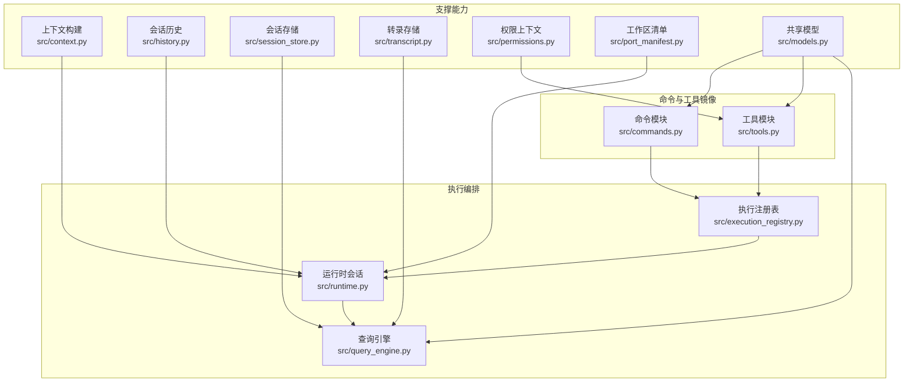
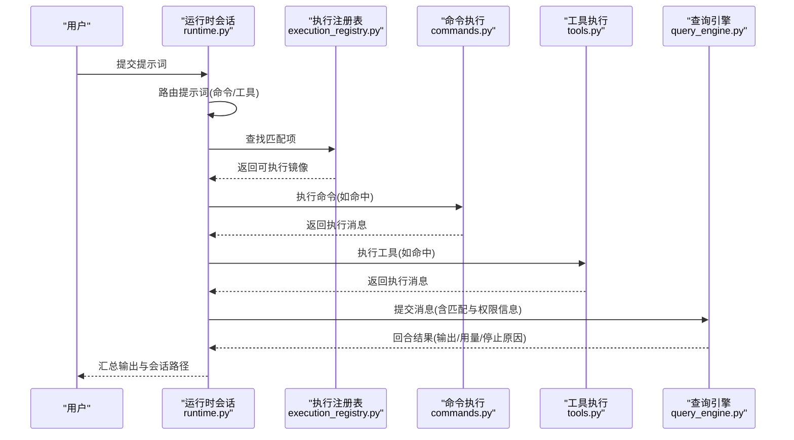
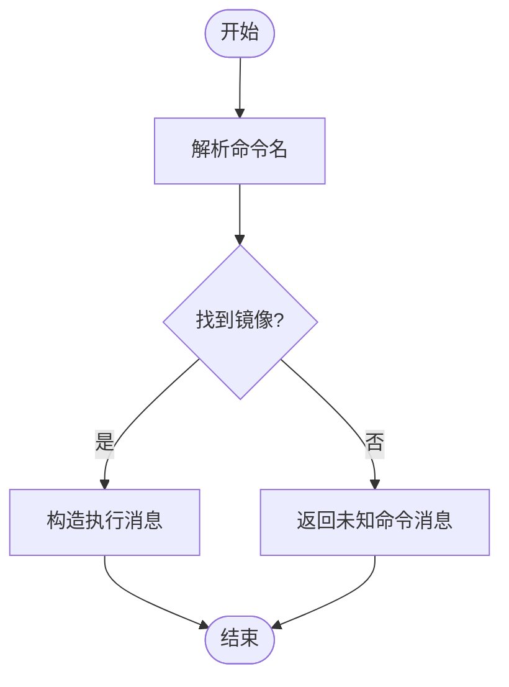
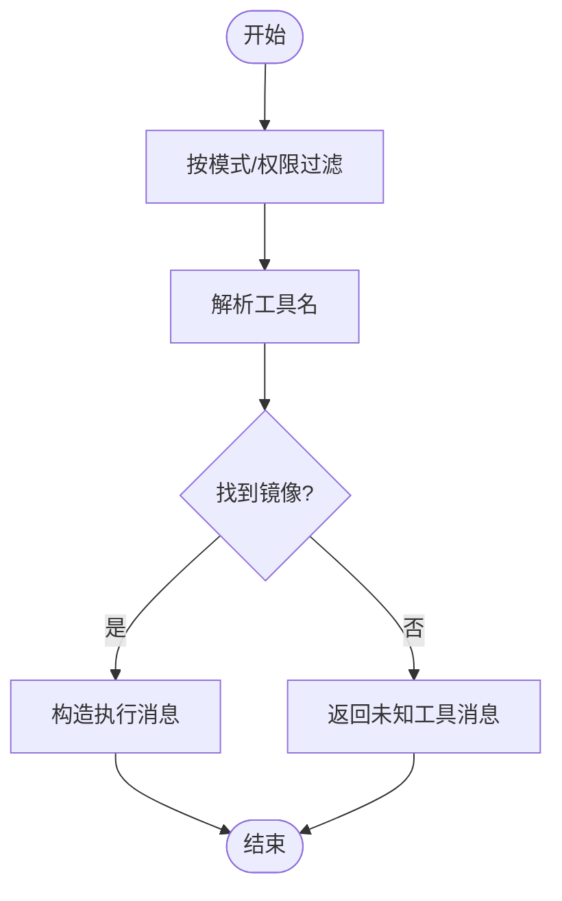
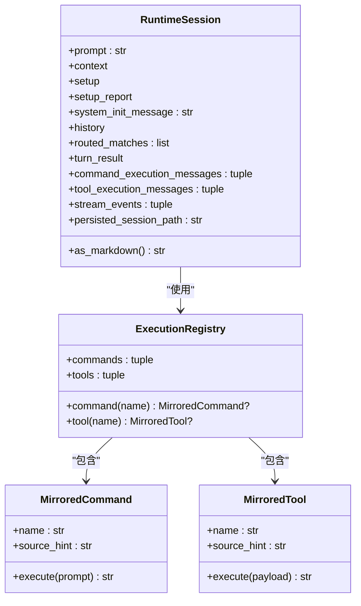
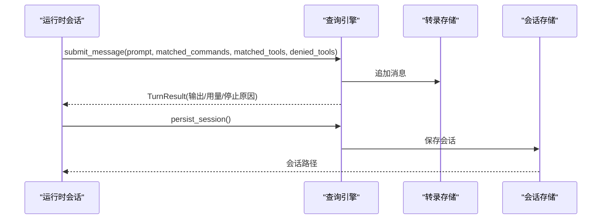
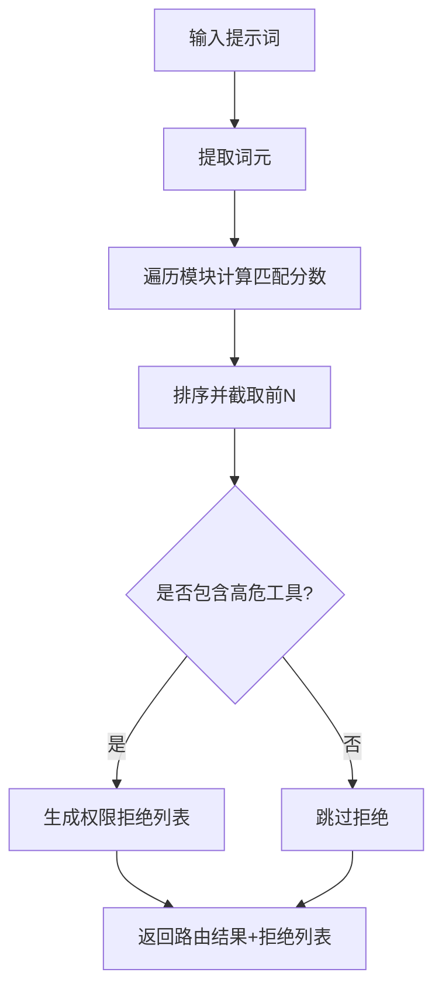
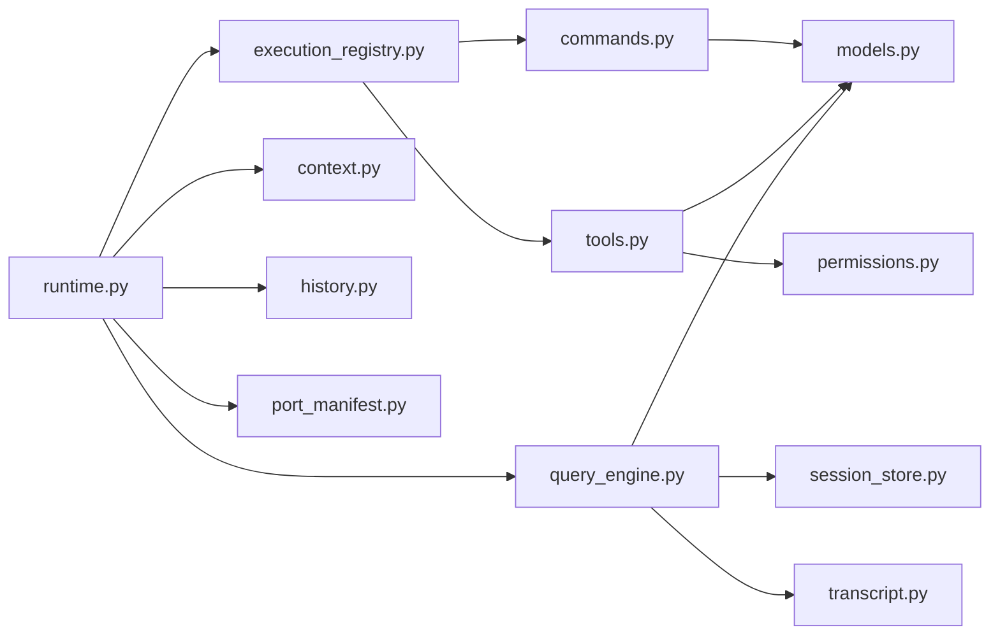

# 命令执行引擎

<cite>
**本文引用的文件**
- [src/commands.py](file://src/commands.py)
- [src/tools.py](file://src/tools.py)
- [src/execution_registry.py](file://src/execution_registry.py)
- [src/runtime.py](file://src/runtime.py)
- [src/query_engine.py](file://src/query_engine.py)
- [src/models.py](file://src/models.py)
- [src/context.py](file://src/context.py)
- [src/history.py](file://src/history.py)
- [src/session_store.py](file://src/session_store.py)
- [src/transcript.py](file://src/transcript.py)
- [src/port_manifest.py](file://src/port_manifest.py)
- [src/permissions.py](file://src/permissions.py)
</cite>

## 目录
1. [简介](#简介)
2. [项目结构](#项目结构)
3. [核心组件](#核心组件)
4. [架构总览](#架构总览)
5. [详细组件分析](#详细组件分析)
6. [依赖分析](#依赖分析)
7. [性能考虑](#性能考虑)
8. [故障排查指南](#故障排查指南)
9. [结论](#结论)
10. [附录](#附录)

## 简介
本文件系统化阐述命令执行引擎的设计与实现，覆盖从命令验证、权限检查、参数解析到执行调度的完整流程；解释异步流式处理与并发控制现状；分析错误处理与异常恢复策略；说明性能监控与资源管理；给出调试与日志记录方法；涵盖安全审计与访问控制；阐明与工具系统的交互关系；并提供扩展点与最佳实践建议。

## 项目结构
该引擎围绕“命令镜像”和“工具镜像”两条主线构建，通过路由匹配选择候选命令/工具，结合会话与历史记录进行上下文感知的执行与输出，并以查询引擎作为编排层协调令牌预算、回合限制与会话持久化。

图表来源
- [src/commands.py:1-91](file://src/commands.py#L1-L91)
- [src/tools.py:1-97](file://src/tools.py#L1-L97)
- [src/execution_registry.py:1-52](file://src/execution_registry.py#L1-L52)
- [src/runtime.py:1-193](file://src/runtime.py#L1-L193)
- [src/query_engine.py:1-194](file://src/query_engine.py#L1-L194)
- [src/context.py:1-48](file://src/context.py#L1-L48)
- [src/history.py:1-23](file://src/history.py#L1-L23)
- [src/session_store.py:1-36](file://src/session_store.py#L1-L36)
- [src/transcript.py:1-24](file://src/transcript.py#L1-L24)
- [src/permissions.py:1-21](file://src/permissions.py#L1-L21)
- [src/port_manifest.py:1-53](file://src/port_manifest.py#L1-L53)
- [src/models.py:1-50](file://src/models.py#L1-L50)

章节来源
- [src/commands.py:1-91](file://src/commands.py#L1-L91)
- [src/tools.py:1-97](file://src/tools.py#L1-L97)
- [src/execution_registry.py:1-52](file://src/execution_registry.py#L1-L52)
- [src/runtime.py:1-193](file://src/runtime.py#L1-L193)
- [src/query_engine.py:1-194](file://src/query_engine.py#L1-L194)
- [src/context.py:1-48](file://src/context.py#L1-L48)
- [src/history.py:1-23](file://src/history.py#L1-L23)
- [src/session_store.py:1-36](file://src/session_store.py#L1-L36)
- [src/transcript.py:1-24](file://src/transcript.py#L1-L24)
- [src/permissions.py:1-21](file://src/permissions.py#L1-L21)
- [src/port_manifest.py:1-53](file://src/port_manifest.py#L1-L53)
- [src/models.py:1-50](file://src/models.py#L1-L50)

## 核心组件
- 命令镜像与工具镜像：提供命令/工具的元数据快照、名称索引、查询与执行入口，均采用只读快照与惰性加载，确保启动时一次性构建并缓存。
- 执行注册表：将镜像对象包装为可执行实体，统一暴露 execute 接口，便于运行时按名称查找与调用。
- 运行时会话：负责提示词路由、上下文构建、会话初始化、执行编排与结果汇总。
- 查询引擎：承载回合制对话、令牌预算控制、结构化输出、会话持久化与转录压缩。
- 权限上下文：基于名称集合与前缀集合对工具执行进行阻断，支持在工具筛选阶段生效。
- 会话与历史：记录关键事件与统计，支持 Markdown 汇总输出。
- 工作区清单：生成顶层模块清单，辅助运行时展示与审计。

章节来源
- [src/commands.py:13-91](file://src/commands.py#L13-L91)
- [src/tools.py:14-97](file://src/tools.py#L14-L97)
- [src/execution_registry.py:9-52](file://src/execution_registry.py#L9-L52)
- [src/runtime.py:24-193](file://src/runtime.py#L24-L193)
- [src/query_engine.py:15-194](file://src/query_engine.py#L15-L194)
- [src/permissions.py:6-21](file://src/permissions.py#L6-L21)
- [src/history.py:6-23](file://src/history.py#L6-L23)
- [src/port_manifest.py:12-53](file://src/port_manifest.py#L12-L53)

## 架构总览
命令执行引擎采用“镜像-注册表-运行时-查询引擎”的分层设计。命令与工具的元数据来自快照文件，运行时根据提示词进行路由匹配，再由查询引擎驱动多轮对话与会话持久化。

图表来源
- [src/runtime.py:89-152](file://src/runtime.py#L89-L152)
- [src/execution_registry.py:28-51](file://src/execution_registry.py#L28-L51)
- [src/commands.py:75-81](file://src/commands.py#L75-L81)
- [src/tools.py:81-87](file://src/tools.py#L81-L87)
- [src/query_engine.py:61-104](file://src/query_engine.py#L61-L104)

## 详细组件分析

### 命令执行子系统
- 验证与解析：通过名称大小写不敏感匹配定位镜像条目；未知命令返回未处理状态与提示信息。
- 权限检查：当前命令镜像不直接参与权限判定，权限影响主要体现在工具侧的过滤与拒绝。
- 执行调度：由执行注册表统一调度，支持按名称检索与批量执行。
- 异步与并发：命令执行为同步返回，未见并发或异步队列实现；流式输出由查询引擎的流式接口提供。

图表来源
- [src/commands.py:52-81](file://src/commands.py#L52-L81)

章节来源
- [src/commands.py:13-91](file://src/commands.py#L13-L91)
- [src/execution_registry.py:9-52](file://src/execution_registry.py#L9-L52)

### 工具执行子系统
- 验证与解析：支持简单模式、排除 MCP、按权限上下文过滤；工具名称大小写不敏感匹配。
- 权限检查：通过 ToolPermissionContext 的名称集合与前缀集合阻断工具执行，可在获取工具列表阶段生效。
- 执行调度：与命令一致，经执行注册表统一调度。
- 异步与并发：工具执行为同步返回；流式输出由查询引擎提供。

图表来源
- [src/tools.py:62-87](file://src/tools.py#L62-L87)
- [src/permissions.py:11-21](file://src/permissions.py#L11-L21)

章节来源
- [src/tools.py:14-97](file://src/tools.py#L14-L97)
- [src/permissions.py:6-21](file://src/permissions.py#L6-L21)
- [src/execution_registry.py:18-25](file://src/execution_registry.py#L18-L25)

### 执行注册表与运行时会话
- 注册表：将命令/工具镜像封装为可执行对象，提供按名称检索与执行能力。
- 运行时会话：负责上下文构建、路由匹配、执行编排、历史记录与最终会话持久化路径生成。

图表来源
- [src/execution_registry.py:9-52](file://src/execution_registry.py#L9-L52)
- [src/runtime.py:24-87](file://src/runtime.py#L24-L87)

章节来源
- [src/execution_registry.py:1-52](file://src/execution_registry.py#L1-L52)
- [src/runtime.py:24-152](file://src/runtime.py#L24-L152)

### 查询引擎与会话管理
- 回合计数与预算控制：限制最大回合数与令牌预算，超过阈值自动停止。
- 结构化输出：支持结构化输出渲染与重试保护。
- 流式接口：提供消息开始、匹配、权限拒绝、增量文本与停止事件的流式产出。
- 会话持久化：保存会话至 JSON 文件，支持加载与复用。

图表来源
- [src/query_engine.py:61-151](file://src/query_engine.py#L61-L151)
- [src/transcript.py:6-24](file://src/transcript.py#L6-L24)
- [src/session_store.py:19-36](file://src/session_store.py#L19-L36)

章节来源
- [src/query_engine.py:15-194](file://src/query_engine.py#L15-L194)
- [src/transcript.py:1-24](file://src/transcript.py#L1-L24)
- [src/session_store.py:1-36](file://src/session_store.py#L1-L36)

### 路由与权限推断
- 路由：将提示词切分为词元，计算与命令/工具名称、职责、来源提示的匹配分数，优先选取高分项。
- 权限推断：对特定高危工具（如 Bash）进行显式拒绝，形成权限拒绝列表供查询引擎使用。

图表来源
- [src/runtime.py:89-107](file://src/runtime.py#L89-L107)
- [src/runtime.py:169-174](file://src/runtime.py#L169-L174)

章节来源
- [src/runtime.py:89-193](file://src/runtime.py#L89-L193)

## 依赖分析
- 组件内聚与耦合：命令与工具模块高度内聚于元数据与执行逻辑；执行注册表作为适配层降低运行时与具体镜像实现的耦合。
- 外部依赖：查询引擎依赖会话存储与转录存储；运行时依赖上下文与历史记录；权限上下文用于工具侧过滤。
- 循环依赖：未发现循环导入；各模块职责清晰，数据类在 models 中集中定义。

图表来源
- [src/commands.py:1-91](file://src/commands.py#L1-L91)
- [src/tools.py:1-97](file://src/tools.py#L1-L97)
- [src/execution_registry.py:1-52](file://src/execution_registry.py#L1-L52)
- [src/runtime.py:1-193](file://src/runtime.py#L1-L193)
- [src/query_engine.py:1-194](file://src/query_engine.py#L1-L194)
- [src/context.py:1-48](file://src/context.py#L1-L48)
- [src/history.py:1-23](file://src/history.py#L1-L23)
- [src/session_store.py:1-36](file://src/session_store.py#L1-L36)
- [src/transcript.py:1-24](file://src/transcript.py#L1-L24)
- [src/permissions.py:1-21](file://src/permissions.py#L1-L21)
- [src/port_manifest.py:1-53](file://src/port_manifest.py#L1-L53)
- [src/models.py:1-50](file://src/models.py#L1-L50)

章节来源
- [src/commands.py:1-91](file://src/commands.py#L1-L91)
- [src/tools.py:1-97](file://src/tools.py#L1-L97)
- [src/execution_registry.py:1-52](file://src/execution_registry.py#L1-L52)
- [src/runtime.py:1-193](file://src/runtime.py#L1-L193)
- [src/query_engine.py:1-194](file://src/query_engine.py#L1-L194)
- [src/context.py:1-48](file://src/context.py#L1-L48)
- [src/history.py:1-23](file://src/history.py#L1-L23)
- [src/session_store.py:1-36](file://src/session_store.py#L1-L36)
- [src/transcript.py:1-24](file://src/transcript.py#L1-L24)
- [src/permissions.py:1-21](file://src/permissions.py#L1-L21)
- [src/port_manifest.py:1-53](file://src/port_manifest.py#L1-L53)
- [src/models.py:1-50](file://src/models.py#L1-L50)

## 性能考虑
- 缓存与快照：命令与工具快照采用 LRU 缓存，避免重复 IO；运行时会话与注册表均基于只读快照，减少运行期开销。
- 令牌预算与回合限制：查询引擎内置 max_turns 与 max_budget_tokens，防止长对话导致资源耗尽。
- 转录压缩：当消息数量超过阈值时仅保留最近若干条，降低内存占用。
- 输出格式：结构化输出具备重试保护，失败时回退为文本摘要，保证稳定性。

章节来源
- [src/commands.py:22-42](file://src/commands.py#L22-L42)
- [src/tools.py:23-38](file://src/tools.py#L23-L38)
- [src/query_engine.py:15-22](file://src/query_engine.py#L15-L22)
- [src/query_engine.py:129-132](file://src/query_engine.py#L129-L132)
- [src/query_engine.py:161-170](file://src/query_engine.py#L161-L170)

## 故障排查指南
- 未知命令/工具：若返回未处理状态，检查命令/工具名称大小写与快照一致性。
- 权限拒绝：确认 ToolPermissionContext 的 deny_names 与 deny_prefixes 是否覆盖目标工具；路由阶段会生成权限拒绝列表。
- 会话无法持久化：检查会话目录写入权限与磁盘空间；查询引擎会在持久化前刷新转录。
- 输出格式异常：结构化输出失败时会抛出异常，检查负载内容是否可序列化。
- 历史与审计：通过会话历史记录定位关键事件，结合运行时会话的 Markdown 汇总快速定位问题。

章节来源
- [src/commands.py:75-81](file://src/commands.py#L75-L81)
- [src/tools.py:81-87](file://src/tools.py#L81-L87)
- [src/permissions.py:18-21](file://src/permissions.py#L18-L21)
- [src/query_engine.py:140-151](file://src/query_engine.py#L140-L151)
- [src/history.py:12-23](file://src/history.py#L12-L23)

## 结论
该命令执行引擎以“镜像-注册表-运行时-查询引擎”为核心，实现了命令与工具的统一调度、上下文感知的路由、严格的令牌与回合预算控制以及会话持久化与审计能力。当前未实现并发与异步队列，但通过流式接口与转录压缩提供了良好的可观测性与资源管理。权限控制集中在工具侧，命令侧保持中立，便于扩展与审计。

## 附录

### 安全审计与访问控制
- 工具权限：通过 ToolPermissionContext 对工具执行进行阻断，支持名称白名单与前缀阻断。
- 路由拒绝：对高风险工具（如 Bash）在路由阶段即生成权限拒绝列表。
- 会话审计：会话历史与运行时会话汇总输出可用于审计追踪。

章节来源
- [src/permissions.py:6-21](file://src/permissions.py#L6-L21)
- [src/runtime.py:169-174](file://src/runtime.py#L169-L174)
- [src/history.py:12-23](file://src/history.py#L12-L23)
- [src/runtime.py:39-86](file://src/runtime.py#L39-L86)

### 与工具系统的交互关系
- 工具筛选：支持简单模式、排除 MCP、按权限上下文过滤。
- 工具执行：统一经执行注册表调度，返回执行消息供运行时会话汇总。

章节来源
- [src/tools.py:62-87](file://src/tools.py#L62-L87)
- [src/execution_registry.py:18-25](file://src/execution_registry.py#L18-L25)

### 扩展点与自定义选项
- 命令/工具快照：新增条目需更新快照文件并重启应用以重新加载。
- 路由策略：可调整路由评分函数与匹配阈值。
- 权限策略：扩展 ToolPermissionContext 的阻断规则。
- 查询引擎配置：调整 max_turns、max_budget_tokens、compact_after_turns、structured_output 等。
- 会话存储：自定义会话目录与持久化策略。

章节来源
- [src/commands.py:10-10](file://src/commands.py#L10-L10)
- [src/tools.py:11-11](file://src/tools.py#L11-L11)
- [src/query_engine.py:16-22](file://src/query_engine.py#L16-L22)
- [src/session_store.py:16-16](file://src/session_store.py#L16-L16)

### 最佳实践与性能优化建议
- 使用快照缓存：避免频繁 IO，确保启动时完成快照加载。
- 控制回合与预算：根据任务复杂度合理设置 max_turns 与 max_budget_tokens。
- 合理使用流式接口：在需要实时反馈的场景启用流式提交，减少等待时间。
- 会话复用：通过会话 ID 加载已保存会话，缩短初始化时间。
- 权限前置：在工具筛选阶段尽早阻断高风险工具，降低后续处理成本。

章节来源
- [src/commands.py:22-42](file://src/commands.py#L22-L42)
- [src/tools.py:23-38](file://src/tools.py#L23-L38)
- [src/query_engine.py:16-22](file://src/query_engine.py#L16-L22)
- [src/query_engine.py:106-128](file://src/query_engine.py#L106-L128)
- [src/session_store.py:27-36](file://src/session_store.py#L27-L36)