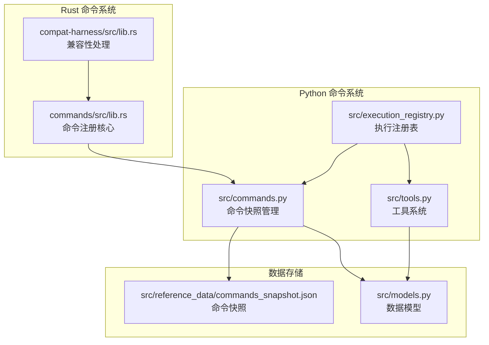
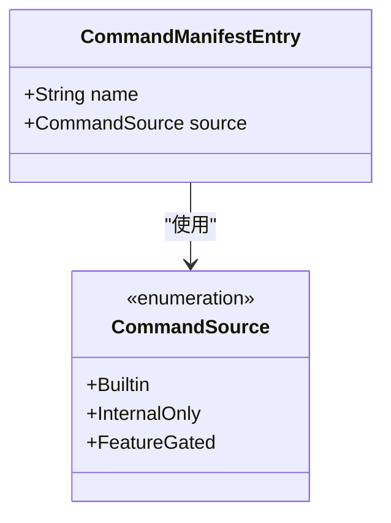
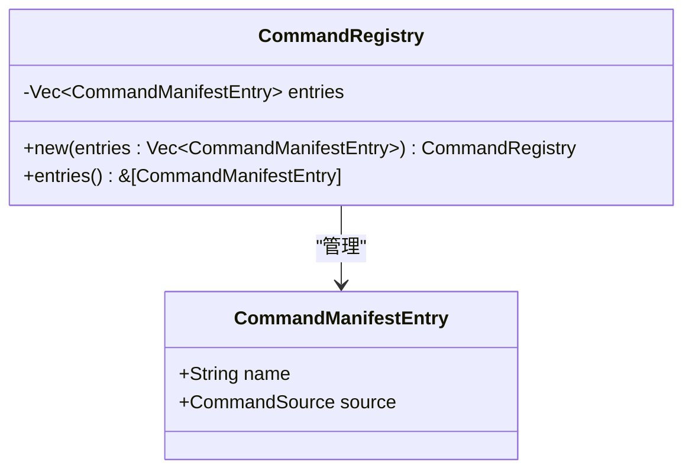
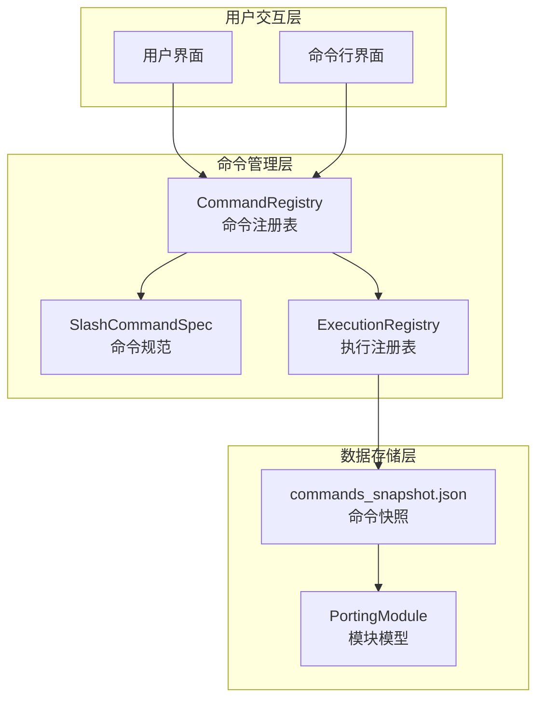
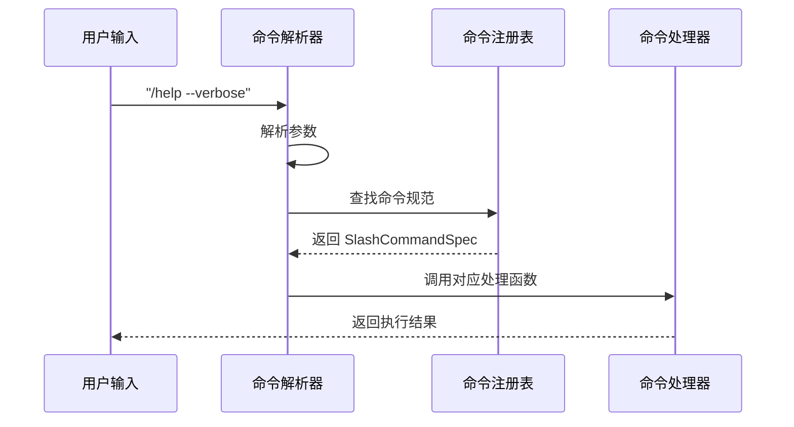
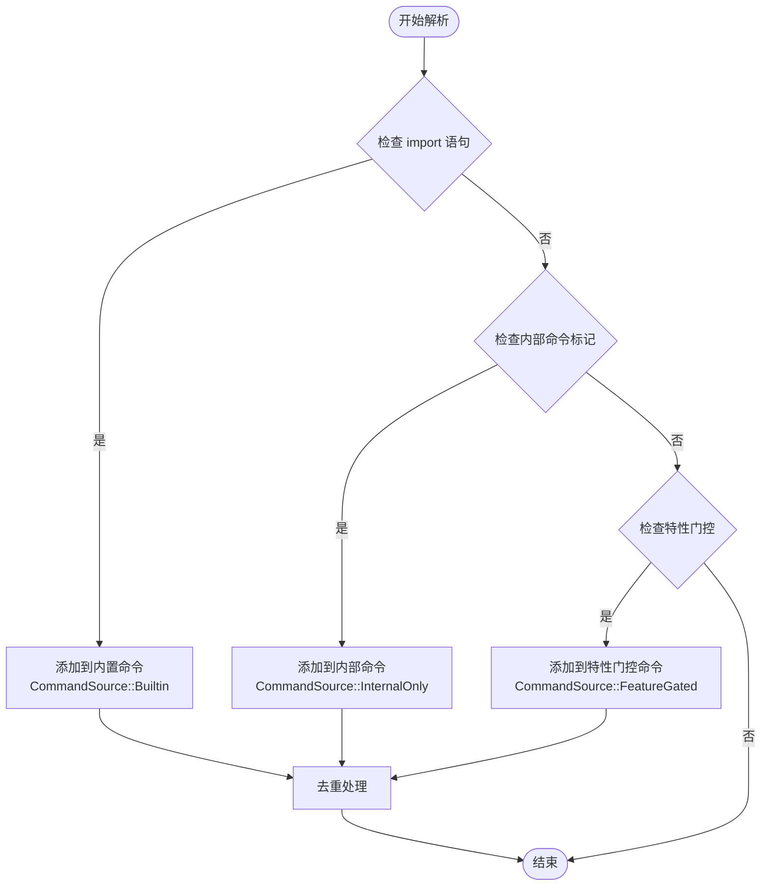
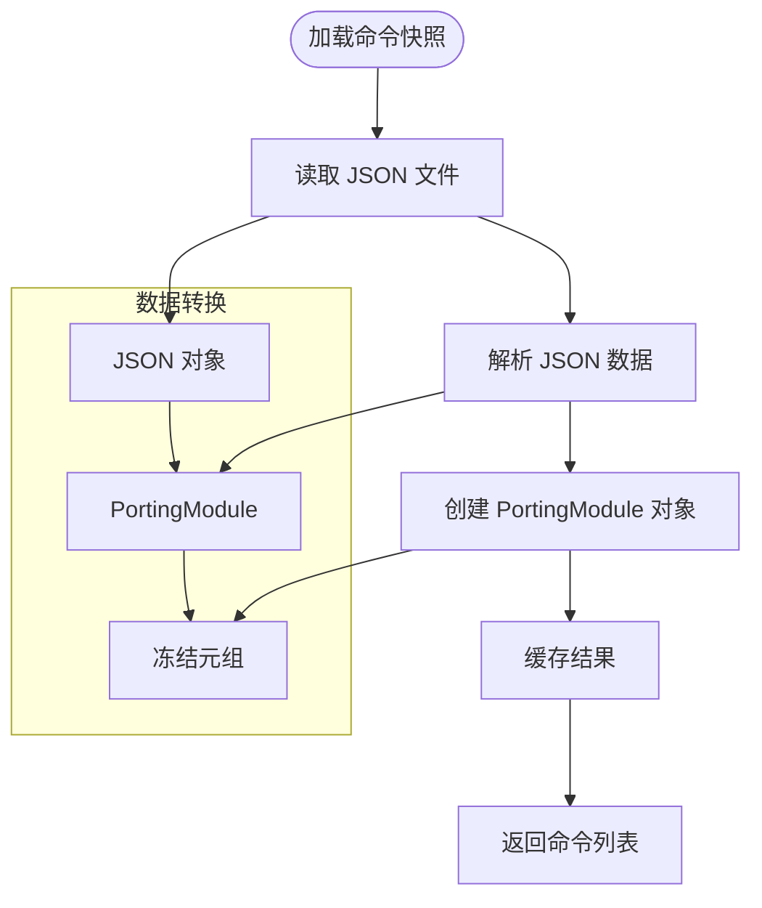
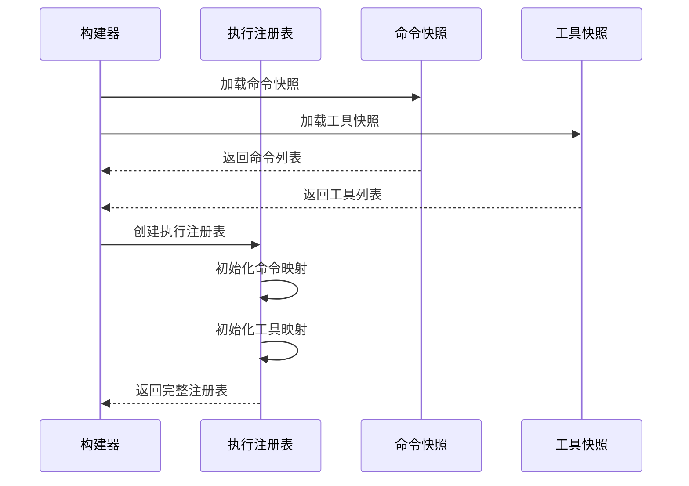
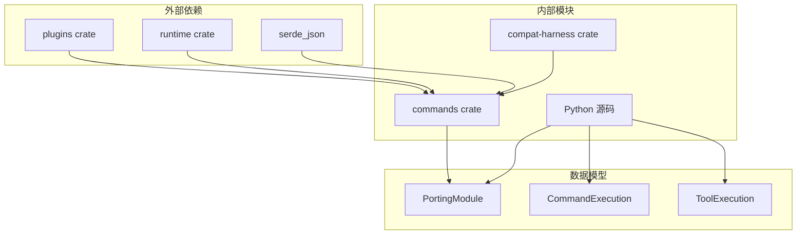
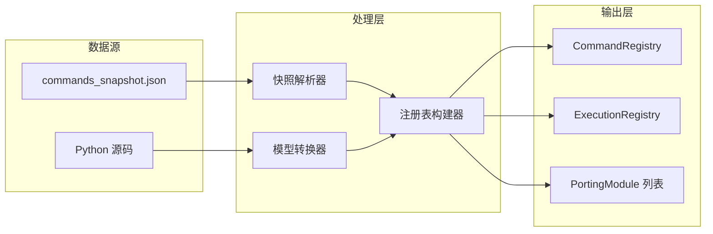

# 命令注册机制

<cite>
**本文档引用的文件**
- [lib.rs](file://rust/crates/commands/src/lib.rs)
- [commands.py](file://src/commands.py)
- [execution_registry.py](file://src/execution_registry.py)
- [tools.py](file://src/tools.py)
- [models.py](file://src/models.py)
- [commands_snapshot.json](file://src/reference_data/commands_snapshot.json)
- [lib.rs](file://rust/crates/compat-harness/src/lib.rs)
</cite>

## 目录
1. [简介](#简介)
2. [项目结构](#项目结构)
3. [核心组件](#核心组件)
4. [架构概览](#架构概览)
5. [详细组件分析](#详细组件分析)
6. [依赖关系分析](#依赖关系分析)
7. [性能考虑](#性能考虑)
8. [故障排除指南](#故障排除指南)
9. [结论](#结论)

## 简介

命令注册机制是 CLAUDE 代码系统中用于管理和组织命令的核心基础设施。该机制通过统一的注册表管理所有可用命令，支持多种命令来源分类，并提供完整的命令生命周期管理。

本机制主要分为两个层面：
- **Rust 层面**：提供强类型的安全命令注册和解析功能
- **Python 层面**：维护命令快照和执行镜像

## 项目结构

命令注册机制涉及以下关键文件：



**图表来源**
- [lib.rs:1-80](file://rust/crates/commands/src/lib.rs#L1-L80)
- [commands.py:1-91](file://src/commands.py#L1-L91)
- [execution_registry.py:1-52](file://src/execution_registry.py#L1-L52)

**章节来源**
- [lib.rs:1-80](file://rust/crates/commands/src/lib.rs#L1-L80)
- [commands.py:1-91](file://src/commands.py#L1-L91)
- [execution_registry.py:1-52](file://src/execution_registry.py#L1-L52)

## 核心组件

### CommandManifestEntry 数据结构

命令清单条目是命令注册的基本单元，包含以下关键字段：

| 字段名 | 类型 | 描述 | 示例 |
|--------|------|------|------|
| name | String | 命令名称 | "help", "status", "sandbox" |
| source | CommandSource | 命令来源分类 | Builtin, InternalOnly, FeatureGated |

### CommandSource 枚举分类

命令来源枚举定义了三种不同的命令分类方式：



**图表来源**
- [lib.rs:20-25](file://rust/crates/commands/src/lib.rs#L20-L25)

**章节来源**
- [lib.rs:14-25](file://rust/crates/commands/src/lib.rs#L14-L25)

### CommandRegistry 注册表

命令注册表提供了统一的命令管理接口：



**图表来源**
- [lib.rs:27-42](file://rust/crates/commands/src/lib.rs#L27-L42)

**章节来源**
- [lib.rs:27-42](file://rust/crates/commands/src/lib.rs#L27-L42)

## 架构概览

命令注册机制的整体架构分为三个层次：



**图表来源**
- [lib.rs:59-560](file://rust/crates/commands/src/lib.rs#L59-L560)
- [execution_registry.py:28-52](file://src/execution_registry.py#L28-L52)

## 详细组件分析

### Rust 命令注册系统

#### 命令解析流程



**图表来源**
- [lib.rs:1600-1700](file://rust/crates/commands/src/lib.rs#L1600-L1700)

#### 命令来源分类机制



**图表来源**
- [lib.rs:122-154](file://rust/crates/compat-harness/src/lib.rs#L122-L154)

**章节来源**
- [lib.rs:122-154](file://rust/crates/compat-harness/src/lib.rs#L122-L154)

### Python 命令管理系统

#### 命令快照加载机制



**图表来源**
- [commands.py:22-36](file://src/commands.py#L22-L36)

**章节来源**
- [commands.py:22-36](file://src/commands.py#L22-L36)

#### 执行注册表工作流程



**图表来源**
- [execution_registry.py:47-52](file://src/execution_registry.py#L47-L52)

**章节来源**
- [execution_registry.py:47-52](file://src/execution_registry.py#L47-L52)

### 命令规范系统

#### SlashCommandSpec 结构

每个命令都由详细的规范描述：

| 字段 | 类型 | 描述 | 示例 |
|------|------|------|------|
| name | &'static str | 命令名称 | "help", "status" |
| aliases | &'static [&'static str] | 别名数组 | ["plugins", "marketplace"] |
| summary | &'static str | 命令摘要 | "显示可用的斜杠命令" |
| argument_hint | Option<&'static str> | 参数提示 | Some("[model]") |
| resume_supported | bool | 是否支持恢复 | true, false |

**章节来源**
- [lib.rs:44-51](file://rust/crates/commands/src/lib.rs#L44-L51)

## 依赖关系分析

### 组件间依赖关系



**图表来源**
- [lib.rs:1-12](file://rust/crates/commands/src/lib.rs#L1-L12)
- [models.py:14-19](file://src/models.py#L14-L19)

### 数据流依赖



**图表来源**
- [commands.py:22-36](file://src/commands.py#L22-L36)
- [execution_registry.py:47-52](file://src/execution_registry.py#L47-L52)

**章节来源**
- [commands.py:1-91](file://src/commands.py#L1-L91)
- [execution_registry.py:1-52](file://src/execution_registry.py#L1-L52)

## 性能考虑

### 缓存策略

系统采用了多级缓存机制来优化性能：

1. **LRU 缓存**：Python 层使用 `@lru_cache(maxsize=1)` 缓存命令快照
2. **静态常量**：Rust 层使用 `const` 定义命令规范数组
3. **冻结对象**：使用 `frozenset` 和 `tuple` 确保不可变性

### 内存优化

- 使用 `#[derive(Debug, Clone, PartialEq, Eq)]` 确保高效的比较操作
- 采用 `Vec<CommandManifestEntry>` 存储命令清单，支持动态扩展
- 使用 `BTreeMap` 进行有序存储和快速查找

## 故障排除指南

### 常见问题及解决方案

#### 命令未找到错误

**症状**：执行命令时返回 "Unknown mirrored command" 错误

**原因分析**：
1. 命令名称拼写错误
2. 命令不在快照列表中
3. 命令被过滤掉（如插件命令或技能命令）

**解决方法**：
```python
# 检查命令是否存在
if get_command("help") is None:
    print("命令不存在")
    
# 查看可用命令列表
available_commands = command_names()
print(f"可用命令: {available_commands}")
```

#### 命令冲突检测

系统通过以下机制避免命令冲突：

1. **自动去重**：在命令提取过程中自动去除重复命令
2. **来源分类**：不同来源的命令可以共存
3. **名称唯一性**：确保同一注册表内命令名称唯一

#### 性能问题诊断

**症状**：命令加载缓慢

**排查步骤**：
1. 检查 JSON 快照文件大小
2. 验证 Python 缓存是否生效
3. 监控内存使用情况

**章节来源**
- [commands.py:75-81](file://src/commands.py#L75-L81)
- [lib.rs](file://rust/crates/compat-harness/src/lib.rs#L153)

## 结论

命令注册机制通过精心设计的数据结构和算法，为 CLAUDE 代码系统提供了强大而灵活的命令管理能力。该机制的主要优势包括：

1. **类型安全**：Rust 实现确保编译时类型检查
2. **可扩展性**：支持多种命令来源分类
3. **性能优化**：多级缓存和高效的数据结构
4. **易用性**：清晰的 API 设计和错误处理

通过统一的注册表管理和标准化的命令规范，该机制为系统的稳定运行和未来发展奠定了坚实基础。