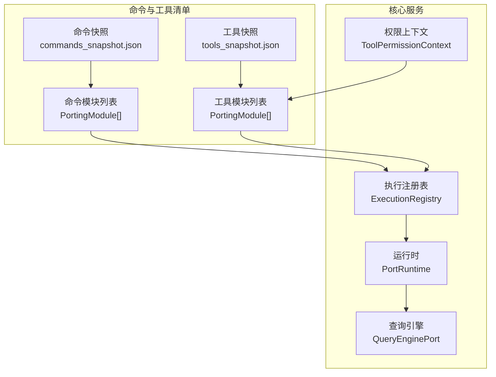
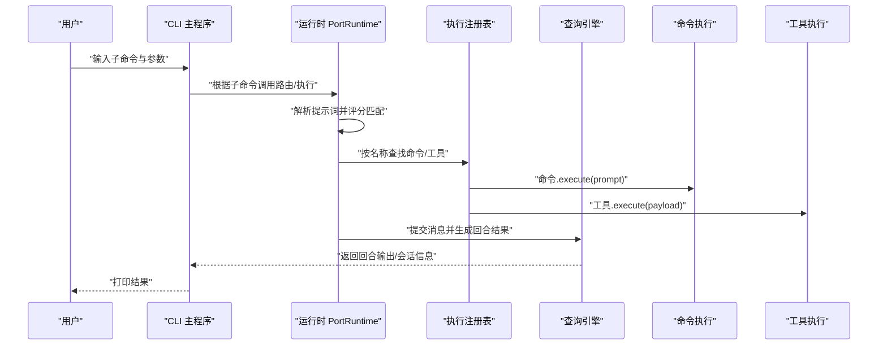
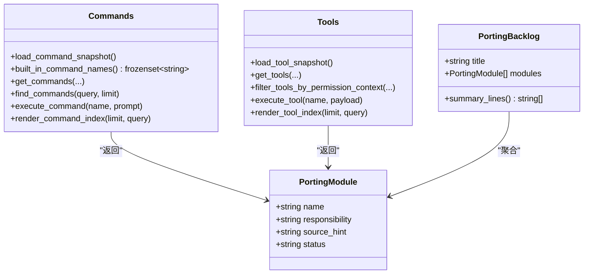
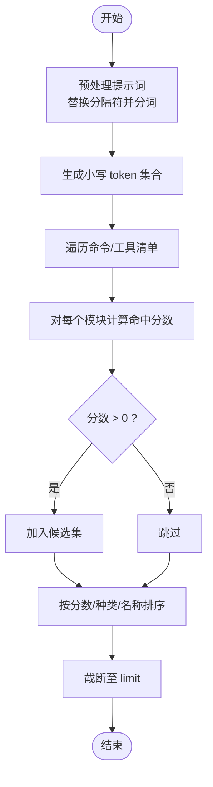
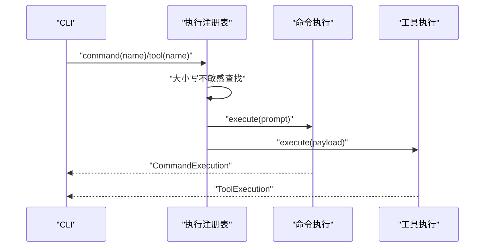
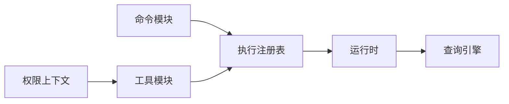

# 命令系统

<cite>
**本文引用的文件**
- [src/commands.py](file://src/commands.py)
- [src/tools.py](file://src/tools.py)
- [src/execution_registry.py](file://src/execution_registry.py)
- [src/command_graph.py](file://src/command_graph.py)
- [src/models.py](file://src/models.py)
- [src/main.py](file://src/main.py)
- [src/runtime.py](file://src/runtime.py)
- [src/query_engine.py](file://src/query_engine.py)
- [src/permissions.py](file://src/permissions.py)
- [src/tool_pool.py](file://src/tool_pool.py)
- [src/reference_data/commands_snapshot.json](file://src/reference_data/commands_snapshot.json)
- [src/reference_data/tools_snapshot.json](file://src/reference_data/tools_snapshot.json)
</cite>

## 目录
1. [简介](#简介)
2. [项目结构](#项目结构)
3. [核心组件](#核心组件)
4. [架构总览](#架构总览)
5. [详细组件分析](#详细组件分析)
6. [依赖分析](#依赖分析)
7. [性能考量](#性能考量)
8. [故障排查指南](#故障排查指南)
9. [结论](#结论)
10. [附录](#附录)

## 简介
本文件系统化阐述该代码库中的“命令系统”，包括命令注册机制、路由逻辑、执行流程、内置命令与插件命令/技能命令的区别、扩展方式、命令解析与参数处理、错误处理机制，以及与工具系统的交互关系与权限控制。文档同时提供最佳实践、性能优化建议与安全注意事项，并给出可操作的集成指南与示例。

## 项目结构
命令系统围绕“镜像（mirrored）”的命令与工具清单展开，通过快照文件加载命令/工具元数据，再在运行时进行路由、执行与会话管理。主要模块如下：
- 命令与工具的元数据加载：从 JSON 快照读取，构建 PortingModule 列表
- 路由器：基于提示词分词匹配命令/工具
- 执行注册表：为命令/工具提供统一的执行入口
- 运行时：组织上下文、会话、权限与输出
- 权限控制：基于名称与前缀的拒绝策略
- CLI：提供命令行子命令以查询、展示与执行

图表来源
- [src/commands.py](file://src/commands.py)
- [src/tools.py](file://src/tools.py)
- [src/execution_registry.py](file://src/execution_registry.py)
- [src/runtime.py](file://src/runtime.py)
- [src/query_engine.py](file://src/query_engine.py)
- [src/permissions.py](file://src/permissions.py)
- [src/reference_data/commands_snapshot.json](file://src/reference_data/commands_snapshot.json)
- [src/reference_data/tools_snapshot.json](file://src/reference_data/tools_snapshot.json)

章节来源
- [src/commands.py](file://src/commands.py)
- [src/tools.py](file://src/tools.py)
- [src/execution_registry.py](file://src/execution_registry.py)
- [src/command_graph.py](file://src/command_graph.py)
- [src/main.py](file://src/main.py)

## 核心组件
- 命令与工具的元数据模型：PortingModule、PortingBacklog
- 命令与工具的加载与查询：加载快照、按名查找、过滤与搜索
- 路由与评分：基于提示词分词的匹配与排序
- 执行注册表：统一的命令/工具执行入口
- 权限上下文：基于名称与前缀的拒绝策略
- CLI 子命令：查询、展示、执行、路由、引导会话等

章节来源
- [src/models.py](file://src/models.py)
- [src/commands.py](file://src/commands.py)
- [src/tools.py](file://src/tools.py)
- [src/runtime.py](file://src/runtime.py)
- [src/execution_registry.py](file://src/execution_registry.py)
- [src/permissions.py](file://src/permissions.py)
- [src/main.py](file://src/main.py)

## 架构总览
命令系统采用“清单驱动 + 路由 + 注册表 + 查询引擎”的分层设计：
- 清单层：从 JSON 快照加载命令/工具元数据
- 路由层：将用户提示词映射到候选命令/工具
- 执行层：通过执行注册表调用具体命令/工具
- 会话层：查询引擎负责对话状态、预算控制与持久化
- 权限层：在工具侧实施访问控制

图表来源
- [src/main.py](file://src/main.py)
- [src/runtime.py](file://src/runtime.py)
- [src/execution_registry.py](file://src/execution_registry.py)
- [src/query_engine.py](file://src/query_engine.py)
- [src/commands.py](file://src/commands.py)
- [src/tools.py](file://src/tools.py)

## 详细组件分析

### 命令与工具的元数据与加载
- 元数据模型：PortingModule 包含 name、responsibility、source_hint、status；PortingBacklog 用于汇总与渲染
- 加载机制：从 JSON 快照读取，使用 LRU 缓存避免重复 IO
- 查询接口：按名精确查找、模糊搜索、过滤插件/技能命令

图表来源
- [src/models.py](file://src/models.py)
- [src/commands.py](file://src/commands.py)
- [src/tools.py](file://src/tools.py)
- [src/reference_data/commands_snapshot.json](file://src/reference_data/commands_snapshot.json)
- [src/reference_data/tools_snapshot.json](file://src/reference_data/tools_snapshot.json)

章节来源
- [src/models.py](file://src/models.py)
- [src/commands.py](file://src/commands.py)
- [src/tools.py](file://src/tools.py)
- [src/reference_data/commands_snapshot.json](file://src/reference_data/commands_snapshot.json)
- [src/reference_data/tools_snapshot.json](file://src/reference_data/tools_snapshot.json)

### 命令图与分类
- 命令图：将命令分为“内置”“插件类”“技能类”，便于可视化与统计
- 分类依据：通过 source_hint 中是否包含特定关键词进行判定

章节来源
- [src/command_graph.py](file://src/command_graph.py)
- [src/commands.py](file://src/commands.py)

### 路由与评分算法
- 提示词预处理：将斜杠与连字符替换为空格后分词，统一小写
- 匹配目标：命令/工具的 name、source_hint、responsibility
- 评分规则：统计 token 在三个字段中出现次数，大于 0 即命中
- 排序策略：先按分数降序，再按 kind 与 name 排序，优先返回“命令”类型

图表来源
- [src/runtime.py](file://src/runtime.py)

章节来源
- [src/runtime.py](file://src/runtime.py)

### 执行注册表与统一执行入口
- 执行注册表：为命令与工具分别构造镜像对象，提供 execute 方法
- 统一入口：通过名称大小写不敏感查找，委托给对应执行函数
- 返回值：命令返回 CommandExecution，工具返回 ToolExecution，均包含 handled 与 message 字段

图表来源
- [src/execution_registry.py](file://src/execution_registry.py)
- [src/commands.py](file://src/commands.py)
- [src/tools.py](file://src/tools.py)

章节来源
- [src/execution_registry.py](file://src/execution_registry.py)
- [src/commands.py](file://src/commands.py)
- [src/tools.py](file://src/tools.py)

### 会话与查询引擎
- 会话管理：记录上下文、设置、历史、路由匹配、执行消息、流事件与回合结果
- 预算与节流：基于最大轮次与 token 预算控制输出
- 结构化输出：支持 JSON 结构化输出与重试
- 持久化：保存会话与转录

章节来源
- [src/runtime.py](file://src/runtime.py)
- [src/query_engine.py](file://src/query_engine.py)

### 权限控制与工具池
- 权限上下文：支持按工具名与前缀拒绝
- 工具池装配：支持简单模式、包含 MCP、权限过滤
- 运行时推断：对高风险工具（如 Bash）进行权限推断与拒绝

章节来源
- [src/permissions.py](file://src/permissions.py)
- [src/tool_pool.py](file://src/tool_pool.py)
- [src/tools.py](file://src/tools.py)
- [src/runtime.py](file://src/runtime.py)

### 内置命令与插件/技能命令
- 内置命令：来源于非“plugin”“skills”标识的 source_hint
- 插件/技能命令：来源于包含相应关键词的 source_hint
- 可通过 CLI 参数选择性包含或排除插件/技能命令

章节来源
- [src/command_graph.py](file://src/command_graph.py)
- [src/commands.py](file://src/commands.py)
- [src/main.py](file://src/main.py)

### 命令解析、参数处理与错误处理
- 命令解析：CLI 子命令解析参数，调用对应查询/执行函数
- 参数处理：支持 limit、query、简单模式、MCP 开关、权限拒绝列表等
- 错误处理：未找到命令/工具时返回 handled=False 的执行结果；CLI 根据 handled 决定退出码

章节来源
- [src/main.py](file://src/main.py)
- [src/commands.py](file://src/commands.py)
- [src/tools.py](file://src/tools.py)

## 依赖分析
- 命令与工具模块相互独立，但共享 PortingModule 模型
- 路由与执行依赖于清单缓存；权限控制仅作用于工具侧
- CLI 作为入口协调各模块；运行时串联路由、执行与查询引擎

图表来源
- [src/commands.py](file://src/commands.py)
- [src/tools.py](file://src/tools.py)
- [src/execution_registry.py](file://src/execution_registry.py)
- [src/runtime.py](file://src/runtime.py)
- [src/permissions.py](file://src/permissions.py)

章节来源
- [src/commands.py](file://src/commands.py)
- [src/tools.py](file://src/tools.py)
- [src/execution_registry.py](file://src/execution_registry.py)
- [src/runtime.py](file://src/runtime.py)
- [src/permissions.py](file://src/permissions.py)

## 性能考量
- 缓存策略：命令与工具快照使用 LRU 缓存，避免重复 IO
- 路由复杂度：对每个模块进行 token 命中计数，整体复杂度 O(N×T)，其中 N 为清单长度，T 为 token 数量
- 会话压缩：超过阈值自动压缩消息，降低内存占用
- 并行加载：运行时阶段可并行加载命令与代理模块（由引导图描述）

章节来源
- [src/commands.py](file://src/commands.py)
- [src/tools.py](file://src/tools.py)
- [src/runtime.py](file://src/runtime.py)
- [src/bootstrap_graph.py](file://src/bootstrap_graph.py)

## 故障排查指南
- 未知命令/工具：execute_* 返回 handled=False，CLI 以非零退出码提示
- 权限被拒：运行时推断拒绝或权限上下文拒绝，查询引擎记录 PermissionDenial
- 会话超预算：达到最大轮次或 token 预算，停止原因标记为 max_turns_reached 或 max_budget_reached
- 输出格式异常：结构化输出失败时抛出异常，CLI 将提示重试

章节来源
- [src/commands.py](file://src/commands.py)
- [src/tools.py](file://src/tools.py)
- [src/query_engine.py](file://src/query_engine.py)
- [src/runtime.py](file://src/runtime.py)

## 结论
该命令系统以“清单驱动 + 路由 + 注册表 + 会话”的方式实现了对已归档命令与工具的镜像与执行。其优势在于：
- 明确的内置/插件/技能区分与可配置过滤
- 简洁的路由评分与统一执行入口
- 完整的权限控制与会话生命周期管理
- CLI 与运行时的清晰职责划分

建议在生产环境中结合权限策略与预算控制，确保安全性与稳定性。

## 附录

### 命令与工具的扩展指南
- 新增命令/工具：在对应快照中添加条目，遵循 PortingModule 字段规范
- 自定义过滤：通过 CLI 参数或工具池装配接口控制包含/排除范围
- 权限约束：使用 ToolPermissionContext 拒绝特定工具或前缀
- 集成执行：通过执行注册表统一调用 execute_command/execute_tool

章节来源
- [src/commands.py](file://src/commands.py)
- [src/tools.py](file://src/tools.py)
- [src/execution_registry.py](file://src/execution_registry.py)
- [src/permissions.py](file://src/permissions.py)
- [src/tool_pool.py](file://src/tool_pool.py)

### 实际使用示例（路径指引）
- 列出命令：参考 [src/main.py](file://src/main.py) 中 commands 子命令
- 展示命令详情：参考 [src/main.py](file://src/main.py) 中 show-command 子命令
- 执行命令：参考 [src/main.py](file://src/main.py) 中 exec-command 子命令
- 路由提示词：参考 [src/main.py](file://src/main.py) 中 route 子命令
- 引导会话：参考 [src/main.py](file://src/main.py) 中 bootstrap 子命令
- 工具池装配：参考 [src/tool_pool.py](file://src/tool_pool.py) 与 [src/main.py](file://src/main.py) 中 tools 子命令

章节来源
- [src/main.py](file://src/main.py)
- [src/tool_pool.py](file://src/tool_pool.py)