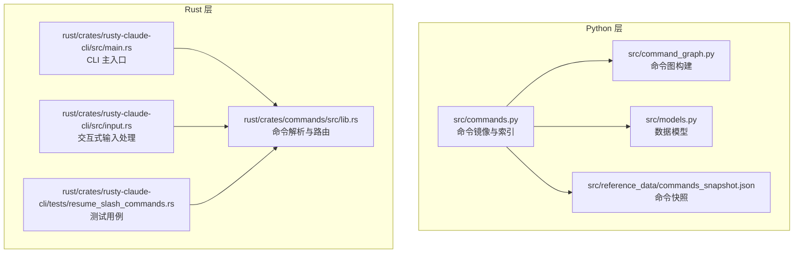
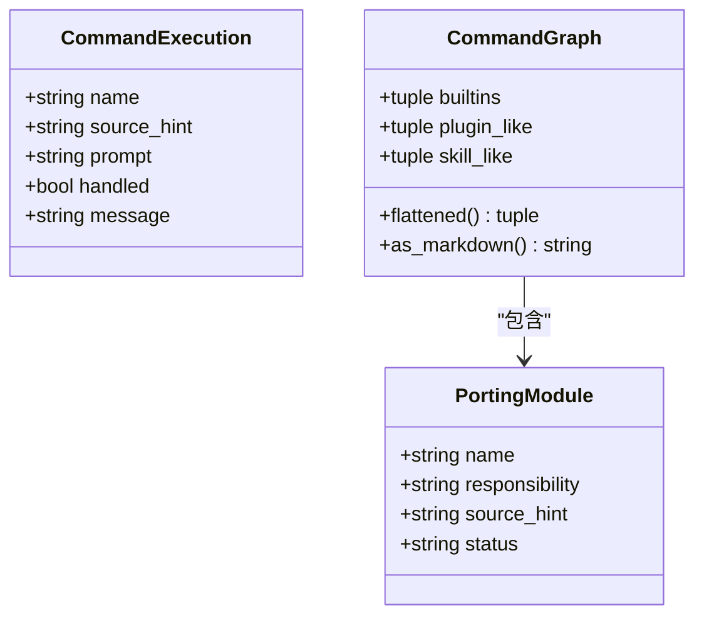
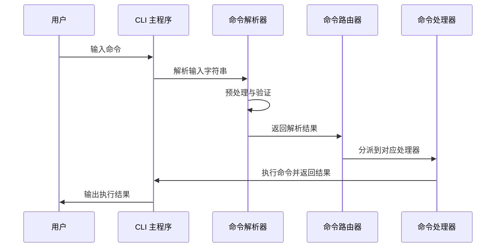
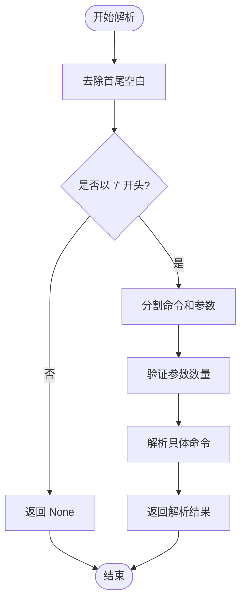
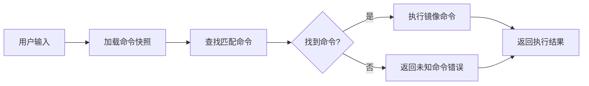
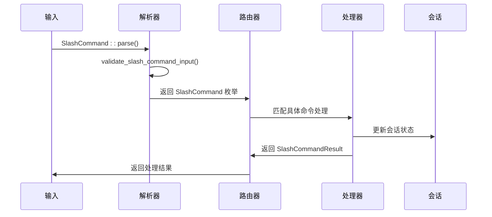
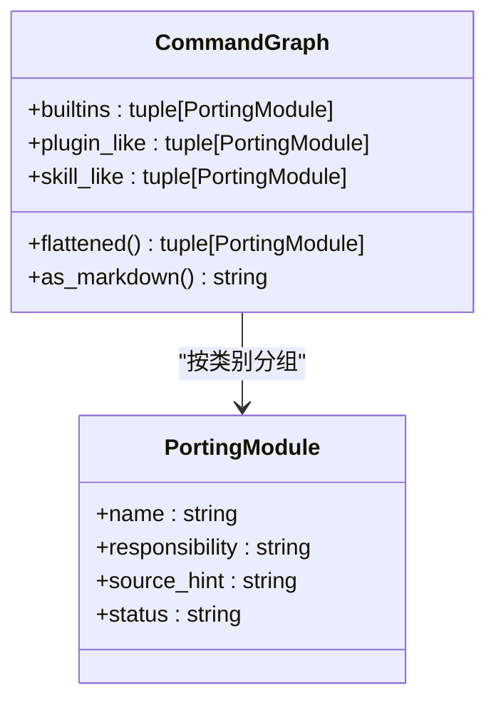
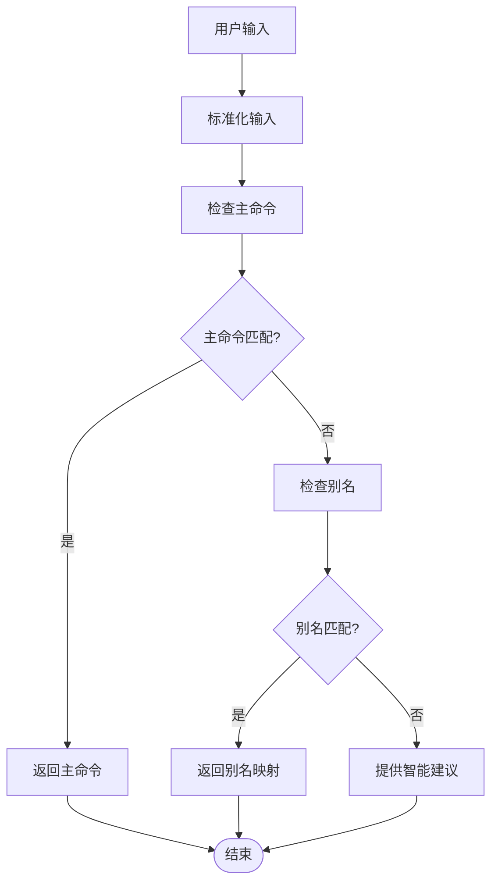
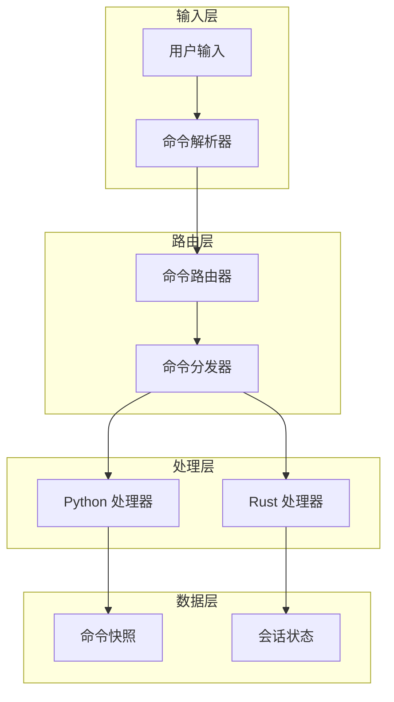

# 命令路由与解析

<cite>
**本文档引用的文件**
- [src/commands.py](file://src/commands.py)
- [src/command_graph.py](file://src/command_graph.py)
- [src/models.py](file://src/models.py)
- [src/reference_data/commands_snapshot.json](file://src/reference_data/commands_snapshot.json)
- [rust/crates/commands/src/lib.rs](file://rust/crates/commands/src/lib.rs)
- [rust/crates/rusty-claude-cli/src/main.rs](file://rust/crates/rusty-claude-cli/src/main.rs)
- [rust/crates/rusty-claude-cli/src/input.rs](file://rust/crates/rusty-claude-cli/src/input.rs)
- [rust/crates/rusty-claude-cli/tests/resume_slash_commands.rs](file://rust/crates/rusty-claude-cli/tests/resume_slash_commands.rs)
</cite>

## 目录
1. [引言](#引言)
2. [项目结构](#项目结构)
3. [核心组件](#核心组件)
4. [架构概览](#架构概览)
5. [详细组件分析](#详细组件分析)
6. [依赖分析](#依赖分析)
7. [性能考虑](#性能考虑)
8. [故障排除指南](#故障排除指南)
9. [结论](#结论)

## 引言

本文件深入解析 Claw Code 项目的命令路由与解析系统，涵盖从用户输入到命令执行的完整流程。该系统支持两种主要命令类型：Python 镜像命令（mirrored commands）和 Rust Slash 命令（/commands）。文档详细说明了命令解析算法、命令路由机制、命令图构建与维护、别名解析与优先级处理、错误处理策略以及性能优化技巧。

## 项目结构

项目采用多语言混合架构，Python 负责命令镜像与索引管理，Rust 负责命令解析、路由与执行。关键目录与文件如下：

**图表来源**
- [src/commands.py](file://src/commands.py)
- [src/command_graph.py](file://src/command_graph.py)
- [src/models.py](file://src/models.py)
- [src/reference_data/commands_snapshot.json](file://src/reference_data/commands_snapshot.json)
- [rust/crates/commands/src/lib.rs](file://rust/crates/commands/src/lib.rs)
- [rust/crates/rusty-claude-cli/src/main.rs](file://rust/crates/rusty-claude-cli/src/main.rs)
- [rust/crates/rusty-claude-cli/src/input.rs](file://rust/crates/rusty-claude-cli/src/input.rs)
- [rust/crates/rusty-claude-cli/tests/resume_slash_commands.rs](file://rust/crates/rusty-claude-cli/tests/resume_slash_commands.rs)

**章节来源**
- [src/commands.py](file://src/commands.py)
- [src/command_graph.py](file://src/command_graph.py)
- [rust/crates/commands/src/lib.rs](file://rust/crates/commands/src/lib.rs)
- [rust/crates/rusty-claude-cli/src/main.rs](file://rust/crates/rusty-claude-cli/src/main.rs)

## 核心组件

### Python 命令镜像系统

Python 层负责管理已镜像的命令集合，提供查询、过滤和执行能力：

- **命令加载与缓存**：通过 LRU 缓存加载命令快照，避免重复 IO
- **命令查询**：支持模糊匹配和过滤，返回匹配的命令列表
- **命令执行**：模拟执行镜像命令，返回执行结果信息

**图表来源**
- [src/commands.py](file://src/commands.py)
- [src/command_graph.py](file://src/command_graph.py)
- [src/models.py](file://src/models.py)

**章节来源**
- [src/commands.py](file://src/commands.py)
- [src/command_graph.py](file://src/command_graph.py)
- [src/models.py](file://src/models.py)
- [src/reference_data/commands_snapshot.json](file://src/reference_data/commands_snapshot.json)

### Rust Slash 命令系统

Rust 层提供完整的命令解析、验证和执行框架：

- **命令规范定义**：集中定义所有 Slash 命令及其别名、参数提示
- **输入解析**：严格的参数验证和错误处理
- **命令路由**：根据解析结果分发到对应的处理函数
- **帮助系统**：自动生成命令帮助和使用示例

**章节来源**
- [rust/crates/commands/src/lib.rs](file://rust/crates/commands/src/lib.rs)

## 架构概览

整个命令系统遵循"输入预处理 → 命令匹配 → 参数提取 → 路由执行"的流水线架构：

**图表来源**
- [rust/crates/rusty-claude-cli/src/main.rs](file://rust/crates/rusty-claude-cli/src/main.rs)
- [rust/crates/commands/src/lib.rs](file://rust/crates/commands/src/lib.rs)

## 详细组件分析

### 命令解析算法

#### 输入预处理阶段

Rust 命令解析器对输入进行严格预处理：

1. **格式标准化**：去除首尾空白字符
2. **前缀验证**：检查是否以 `/` 开头
3. **参数分割**：按空白字符分割命令和参数
4. **余量提取**：保留原始参数字符串用于复杂命令

**图表来源**
- [rust/crates/commands/src/lib.rs](file://rust/crates/commands/src/lib.rs)

#### 命令匹配机制

系统支持多种匹配方式：

1. **精确匹配**：基于命令名称的直接匹配
2. **别名匹配**：支持多个别名的统一处理
3. **模糊匹配**：为未知命令提供智能建议
4. **参数验证**：确保参数数量和类型符合要求

**章节来源**
- [rust/crates/commands/src/lib.rs](file://rust/crates/commands/src/lib.rs)

### 命令路由机制

#### Python 路由流程

Python 层的命令路由相对简单直接：

**图表来源**
- [src/commands.py](file://src/commands.py)

#### Rust 路由流程

Rust 层的路由更加复杂和健壮：

**图表来源**
- [rust/crates/commands/src/lib.rs](file://rust/crates/commands/src/lib.rs)

**章节来源**
- [src/commands.py](file://src/commands.py)
- [rust/crates/commands/src/lib.rs](file://rust/crates/commands/src/lib.rs)

### 命令图构建与维护

命令图是系统的核心数据结构，用于组织和分类所有可用命令：

**图表来源**
- [src/command_graph.py](file://src/command_graph.py)
- [src/models.py](file://src/models.py)

命令图的构建逻辑：
1. **分类规则**：根据 `source_hint` 字段自动分类
2. **扁平化输出**：提供统一的命令列表
3. **可视化输出**：生成统计信息和分类摘要

**章节来源**
- [src/command_graph.py](file://src/command_graph.py)
- [src/models.py](file://src/models.py)

### 命令别名解析与优先级

Rust 命令系统支持复杂的别名机制：

#### 别名定义结构

每个 Slash 命令可以定义多个别名，系统通过以下规则处理：

1. **主命令优先**：完全匹配主命令名称
2. **别名匹配**：按定义顺序匹配别名
3. **大小写不敏感**：忽略大小写差异
4. **精确匹配**：优先选择最精确的匹配

#### 优先级处理流程

**图表来源**
- [rust/crates/commands/src/lib.rs](file://rust/crates/commands/src/lib.rs)

**章节来源**
- [rust/crates/commands/src/lib.rs](file://rust/crates/commands/src/lib.rs)

### 错误处理策略

系统实现了多层次的错误处理机制：

#### 语法错误处理

1. **输入格式错误**：检测缺失的 `/` 前缀
2. **参数数量错误**：验证必需参数的存在性
3. **参数类型错误**：检查参数值的有效性

#### 参数错误处理

1. **必填参数缺失**：提供详细的使用说明
2. **参数值无效**：给出可选值列表
3. **参数组合冲突**：阻止不兼容的参数组合

#### 未知命令处理

1. **智能建议**：基于编辑距离提供相似命令建议
2. **分类导航**：引导用户到正确的命令类别
3. **帮助信息**：显示相关命令的帮助文本

**章节来源**
- [rust/crates/commands/src/lib.rs](file://rust/crates/commands/src/lib.rs)

## 依赖分析

系统各组件之间的依赖关系清晰且职责分离：

**图表来源**
- [src/commands.py](file://src/commands.py)
- [rust/crates/commands/src/lib.rs](file://rust/crates/commands/src/lib.rs)

**章节来源**
- [src/commands.py](file://src/commands.py)
- [rust/crates/commands/src/lib.rs](file://rust/crates/commands/src/lib.rs)

## 性能考虑

### 缓存机制

系统在多个层面实现了缓存优化：

1. **命令快照缓存**：Python 层使用 LRU 缓存避免重复加载
2. **解析结果缓存**：Rust 层缓存常用命令的解析结果
3. **会话状态缓存**：减少频繁的状态查询开销

### 并行处理

对于耗时的操作，系统支持并行处理：

1. **命令执行并行化**：多个命令可以并发执行
2. **I/O 操作优化**：批量处理文件系统操作
3. **网络请求优化**：复用连接和缓存响应

### 内存管理

1. **零拷贝设计**：尽量使用引用而非复制
2. **内存池**：重用临时对象减少 GC 压力
3. **延迟初始化**：按需创建昂贵的对象

## 故障排除指南

### 常见问题诊断

#### 命令无法识别

1. **检查命令拼写**：使用智能建议功能
2. **验证命令存在性**：确认命令是否在当前环境中可用
3. **检查权限设置**：确保有足够的权限执行命令

#### 参数错误

1. **查看帮助信息**：使用 `/help` 或 `--help` 获取详细说明
2. **验证参数格式**：确保参数符合预期格式
3. **检查必需参数**：确认所有必需参数都已提供

#### 性能问题

1. **启用调试模式**：获取详细的性能指标
2. **检查缓存状态**：验证缓存是否正常工作
3. **监控资源使用**：观察内存和 CPU 使用情况

### 调试方法

#### 日志记录

系统提供了多级别的日志记录：

1. **命令执行日志**：记录所有命令的执行历史
2. **错误日志**：详细记录错误发生的原因和上下文
3. **性能日志**：跟踪命令执行时间和资源消耗

#### 交互式调试

1. **REPL 模式**：在交互式环境中测试命令
2. **断点调试**：在关键位置设置断点
3. **状态检查**：实时查看系统状态和配置

**章节来源**
- [rust/crates/rusty-claude-cli/tests/resume_slash_commands.rs](file://rust/crates/rusty-claude-cli/tests/resume_slash_commands.rs)

## 结论

Claw Code 的命令路由与解析系统展现了现代 CLI 工具的设计理念：清晰的职责分离、强大的错误处理、灵活的扩展机制和优秀的用户体验。通过 Python 和 Rust 的协同工作，系统既保持了开发效率，又确保了运行时性能。

系统的成功关键在于：

1. **模块化设计**：每个组件都有明确的职责和接口
2. **健壮的错误处理**：提供友好的错误信息和恢复机制
3. **智能的用户体验**：通过建议和帮助提升易用性
4. **高性能的实现**：通过缓存和并行处理优化性能

未来可以在以下方面进一步改进：
- 增加更多的性能监控指标
- 扩展插件系统的功能
- 改进命令的动态发现机制
- 增强多语言支持