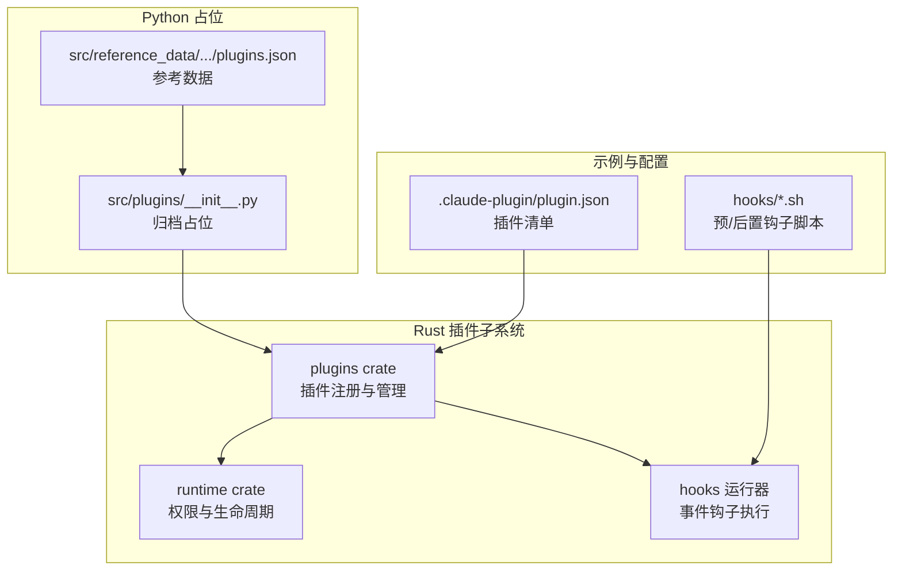
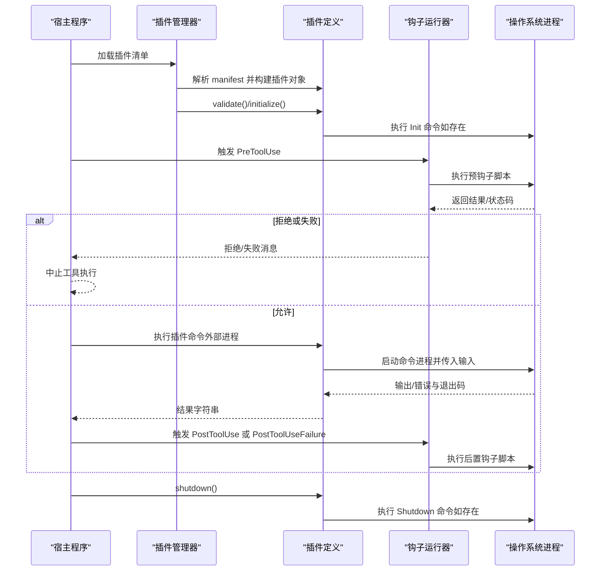
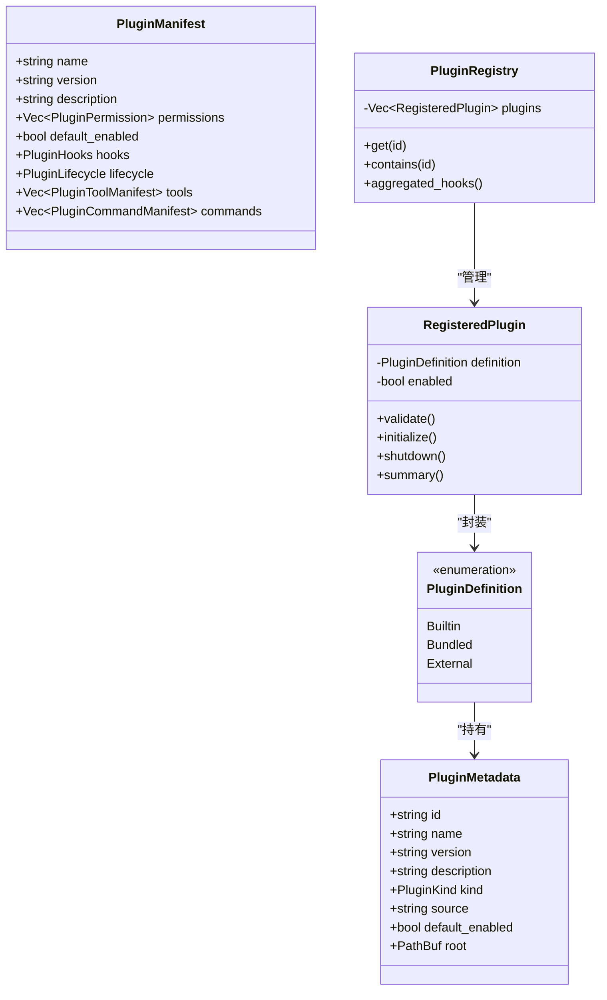
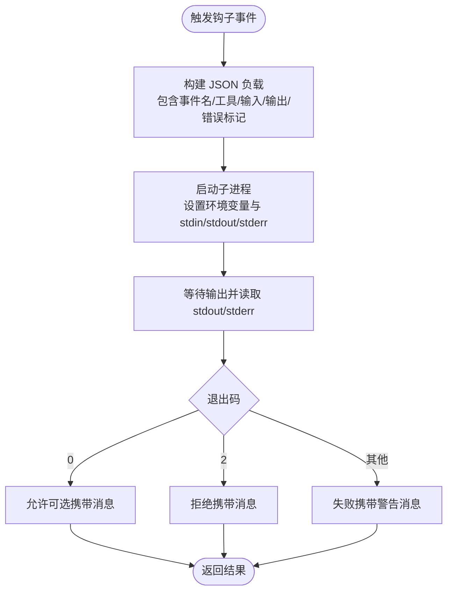
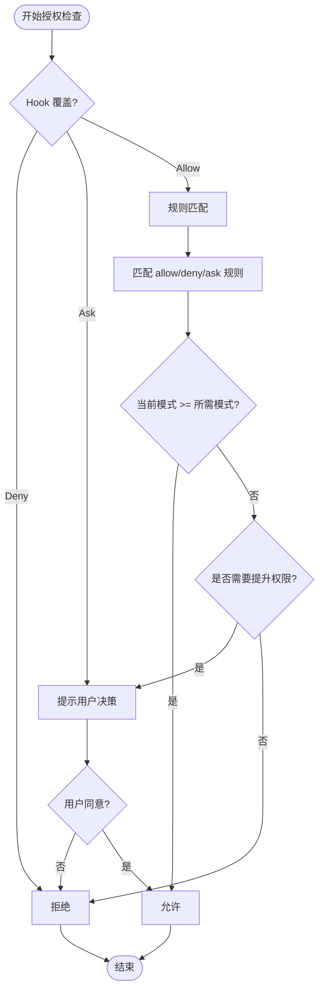
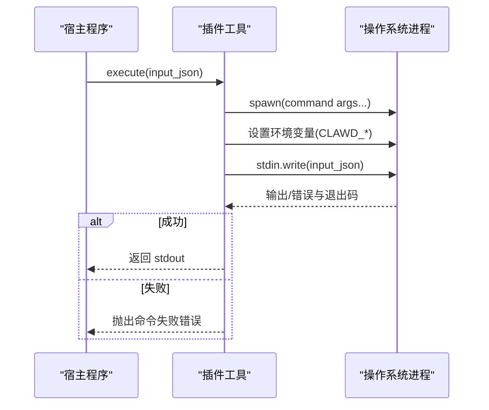
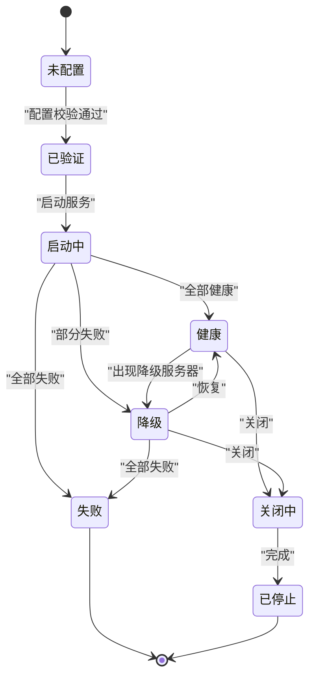
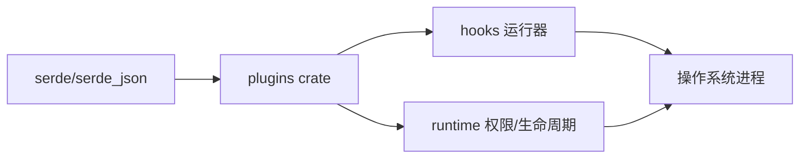

# 插件命令系统

<cite>
**本文档引用的文件**
- [lib.rs](file://rust/crates/plugins/src/lib.rs)
- [hooks.rs](file://rust/crates/plugins/src/hooks.rs)
- [plugin_lifecycle.rs](file://rust/crates/runtime/src/plugin_lifecycle.rs)
- [permission_enforcer.rs](file://rust/crates/runtime/src/permission_enforcer.rs)
- [permissions.rs](file://rust/crates/runtime/src/permissions.rs)
- [Cargo.toml](file://rust/crates/plugins/Cargo.toml)
- [plugin.json（示例）](file://rust/crates/plugins/bundled/example-bundled/.claude-plugin/plugin.json)
- [plugin.json（钩子示例）](file://rust/crates/plugins/bundled/sample-hooks/.claude-plugin/plugin.json)
- [test_isolation.rs](file://rust/crates/plugins/src/test_isolation.rs)
- [plugins.json（参考数据）](file://src/reference_data/subsystems/plugins.json)
</cite>

## 目录
1. [简介](#简介)
2. [项目结构](#项目结构)
3. [核心组件](#核心组件)
4. [架构总览](#架构总览)
5. [详细组件分析](#详细组件分析)
6. [依赖分析](#依赖分析)
7. [性能考虑](#性能考虑)
8. [故障排查指南](#故障排查指南)
9. [结论](#结论)
10. [附录：开发与集成指南](#附录开发与集成指南)

## 简介
本文件系统性阐述插件命令系统的设计与实现，重点覆盖以下方面：
- 插件命令与内置命令的区别与优势
- 插件命令的注册机制（元数据、命令声明、生命周期）
- 执行流程（从加载到调用）
- 权限控制与安全隔离
- 开发指南（命令定义、参数处理、错误处理）
- 调试与测试方法
- 与主程序的通信协议与数据交换格式
- 实际示例与集成步骤

## 项目结构
插件命令系统主要由 Rust crate 提供核心能力，Python 子系统仅保留归档占位信息；插件清单与钩子脚本位于 Rust 工程内。

图示来源
- [lib.rs:1-120](file://rust/crates/plugins/src/lib.rs#L1-L120)
- [hooks.rs:1-60](file://rust/crates/plugins/src/hooks.rs#L1-L60)
- [plugin.json（示例）:1-11](file://rust/crates/plugins/bundled/example-bundled/.claude-plugin/plugin.json#L1-L11)
- [plugin.json（钩子示例）:1-11](file://rust/crates/plugins/bundled/sample-hooks/.claude-plugin/plugin.json#L1-L11)
- [plugins.json（参考数据）:1-9](file://src/reference_data/subsystems/plugins.json#L1-L9)

章节来源
- [lib.rs:1-120](file://rust/crates/plugins/src/lib.rs#L1-L120)
- [Cargo.toml:1-14](file://rust/crates/plugins/Cargo.toml#L1-L14)
- [plugins.json（参考数据）:1-9](file://src/reference_data/subsystems/plugins.json#L1-L9)

## 核心组件
- 插件元数据与清单
  - 元数据：插件 ID、名称、版本、描述、类型、来源、默认启用状态、根目录等
  - 清单字段：name、version、description、permissions、defaultEnabled、hooks、lifecycle、tools、commands
- 命令声明
  - 插件命令 manifest 定义 name、description、command 字段
- 生命周期
  - Init、Shutdown 阶段可执行外部命令
- 钩子（Hooks）
  - PreToolUse、PostToolUse、PostToolUseFailure
- 权限模型
  - 只读、工作区写入、危险全权、提示模式、允许全部
  - 规则型允许/拒绝/询问
- 安全隔离
  - 测试环境隔离工具，避免插件状态污染

章节来源
- [lib.rs:55-132](file://rust/crates/plugins/src/lib.rs#L55-L132)
- [lib.rs:218-222](file://rust/crates/plugins/src/lib.rs#L218-L222)
- [lib.rs:101-114](file://rust/crates/plugins/src/lib.rs#L101-L114)
- [hooks.rs:9-24](file://rust/crates/plugins/src/hooks.rs#L9-L24)
- [permissions.rs:8-28](file://rust/crates/runtime/src/permissions.rs#L8-L28)
- [permissions.rs:97-105](file://rust/crates/runtime/src/permissions.rs#L97-L105)
- [test_isolation.rs:12-46](file://rust/crates/plugins/src/test_isolation.rs#L12-L46)

## 架构总览
插件命令系统采用“清单驱动 + 外部进程执行”的架构：主程序解析插件清单，按需加载插件，通过钩子进行前置/后置控制，并在权限策略下执行命令。生命周期阶段支持初始化与关闭时的外部命令。

图示来源
- [lib.rs:474-538](file://rust/crates/plugins/src/lib.rs#L474-L538)
- [hooks.rs:75-119](file://rust/crates/plugins/src/hooks.rs#L75-L119)
- [plugin_lifecycle.rs:214-219](file://rust/crates/runtime/src/plugin_lifecycle.rs#L214-L219)

## 详细组件分析

### 组件A：插件注册与生命周期
- 注册机制
  - 插件发现与聚合：从多个来源收集插件定义，合并为已注册插件列表
  - 聚合钩子：按启用状态汇总各插件的钩子命令
  - 报告与失败处理：记录加载失败并可整体返回错误
- 生命周期
  - validate：校验钩子/生命周期/工具路径有效性
  - initialize：执行 Init 命令序列
  - shutdown：执行 Shutdown 命令序列
- 数据结构
  - PluginMetadata、PluginManifest、PluginDefinition（Builtin/Bundled/External）
  - RegisteredPlugin、PluginRegistry、PluginRegistryReport

图示来源
- [lib.rs:55-132](file://rust/crates/plugins/src/lib.rs#L55-L132)
- [lib.rs:420-597](file://rust/crates/plugins/src/lib.rs#L420-L597)
- [lib.rs:605-653](file://rust/crates/plugins/src/lib.rs#L605-L653)
- [lib.rs:761-793](file://rust/crates/plugins/src/lib.rs#L761-L793)

章节来源
- [lib.rs:740-793](file://rust/crates/plugins/src/lib.rs#L740-L793)
- [lib.rs:474-538](file://rust/crates/plugins/src/lib.rs#L474-L538)

### 组件B：钩子运行器与事件流
- 事件类型
  - PreToolUse：工具使用前
  - PostToolUse：工具使用后（成功）
  - PostToolUseFailure：工具使用失败
- 执行模型
  - 将工具名、输入、输出/错误、是否错误等上下文序列化为 JSON，作为标准输入传递给钩子脚本
  - 钩子脚本通过退出码表达决策：0=允许、2=拒绝、其他=失败
  - 收集所有钩子的消息，按顺序短路
- 平台差异
  - Windows 使用 cmd /C
  - 非 Windows 使用 sh，支持直接可执行脚本或命令字符串

图示来源
- [hooks.rs:121-174](file://rust/crates/plugins/src/hooks.rs#L121-L174)
- [hooks.rs:177-229](file://rust/crates/plugins/src/hooks.rs#L177-L229)
- [hooks.rs:238-267](file://rust/crates/plugins/src/hooks.rs#L238-L267)
- [hooks.rs:281-301](file://rust/crates/plugins/src/hooks.rs#L281-L301)

章节来源
- [hooks.rs:9-24](file://rust/crates/plugins/src/hooks.rs#L9-L24)
- [hooks.rs:75-119](file://rust/crates/plugins/src/hooks.rs#L75-L119)
- [hooks.rs:121-229](file://rust/crates/plugins/src/hooks.rs#L121-L229)

### 组件C：权限控制与安全隔离
- 权限模式
  - ReadOnly、WorkspaceWrite、DangerFullAccess、Prompt、Allow
- 授权流程
  - 规则匹配（允许/拒绝/询问），工具特定要求，当前模式与所需模式比较
  - Hook 可以覆盖（Allow/Deny/Ask），随后进入交互提示（Prompt 模式）
- 文件与 Bash 保护
  - 写入路径在工作区边界外时需要更高权限
  - Bash 命令基于启发式判断是否只读，避免破坏性操作
- 安全隔离
  - 测试环境隔离工具：重定向 HOME/XDG_CONFIG_HOME 等，确保测试互不干扰

图示来源
- [permissions.rs:164-292](file://rust/crates/runtime/src/permissions.rs#L164-L292)
- [permission_enforcer.rs:37-100](file://rust/crates/runtime/src/permission_enforcer.rs#L37-L100)
- [permission_enforcer.rs:108-173](file://rust/crates/runtime/src/permission_enforcer.rs#L108-L173)
- [test_isolation.rs:18-46](file://rust/crates/plugins/src/test_isolation.rs#L18-L46)

章节来源
- [permissions.rs:8-28](file://rust/crates/runtime/src/permissions.rs#L8-L28)
- [permissions.rs:97-105](file://rust/crates/runtime/src/permissions.rs#L97-L105)
- [permissions.rs:164-292](file://rust/crates/runtime/src/permissions.rs#L164-L292)
- [permission_enforcer.rs:108-173](file://rust/crates/runtime/src/permission_enforcer.rs#L108-L173)
- [test_isolation.rs:18-46](file://rust/crates/plugins/src/test_isolation.rs#L18-L46)

### 组件D：插件工具执行（命令调用）
- 插件工具定义
  - 名称、描述、输入 Schema、命令、参数、所需权限
- 执行流程
  - 构造进程：设置命令、参数、stdin/stdout/stderr
  - 注入环境变量：插件 ID/名称、工具名、输入 JSON、根目录等
  - 通过 stdin 传递输入 JSON
  - 读取 stdout 作为结果字符串，stderr 用于错误报告
- 错误处理
  - 进程失败或非零退出码转换为统一错误类型

图示来源
- [lib.rs:307-348](file://rust/crates/plugins/src/lib.rs#L307-L348)

章节来源
- [lib.rs:269-348](file://rust/crates/plugins/src/lib.rs#L269-L348)

### 组件E：生命周期健康检查与降级模式
- 状态机
  - Unconfigured → Validated → Starting → Healthy → Degraded → Failed → ShuttingDown → Stopped
- 健康检查
  - 服务器健康集合映射为插件状态
  - 降级模式下暴露可用/不可用工具列表
- 事件
  - ConfigValidated、StartupHealthy、StartupDegraded、StartupFailed、Shutdown

图示来源
- [plugin_lifecycle.rs:47-61](file://rust/crates/runtime/src/plugin_lifecycle.rs#L47-L61)
- [plugin_lifecycle.rs:63-99](file://rust/crates/runtime/src/plugin_lifecycle.rs#L63-L99)
- [plugin_lifecycle.rs:194-200](file://rust/crates/runtime/src/plugin_lifecycle.rs#L194-L200)

章节来源
- [plugin_lifecycle.rs:47-61](file://rust/crates/runtime/src/plugin_lifecycle.rs#L47-L61)
- [plugin_lifecycle.rs:194-200](file://rust/crates/runtime/src/plugin_lifecycle.rs#L194-L200)

## 依赖分析
- 语言与生态
  - Rust 生态：serde、serde_json 用于清单与数据序列化
- 组件耦合
  - 插件管理器依赖清单解析与生命周期接口
  - 钩子运行器依赖插件注册表聚合钩子
  - 权限模块独立于插件系统，但被工具执行与钩子共同使用
- 外部依赖
  - 操作系统进程（Windows 的 cmd /C，类 Unix 的 sh）

图示来源
- [Cargo.toml:8-10](file://rust/crates/plugins/Cargo.toml#L8-L10)
- [lib.rs:13-14](file://rust/crates/plugins/src/lib.rs#L13-L14)
- [hooks.rs:1-7](file://rust/crates/plugins/src/hooks.rs#L1-L7)

章节来源
- [Cargo.toml:8-10](file://rust/crates/plugins/Cargo.toml#L8-L10)
- [lib.rs:13-14](file://rust/crates/plugins/src/lib.rs#L13-L14)

## 性能考虑
- 钩子执行
  - 钩子脚本数量与复杂度直接影响响应时间；建议保持脚本轻量
  - 使用平台原生 shell 以减少额外包装开销
- 进程管理
  - 外部进程启动与 I/O 传输为瓶颈；避免频繁小规模调用
  - 输入 JSON 序列化与反序列化应尽量简洁
- 权限检查
  - 规则匹配与启发式判断成本较低；避免在热路径上重复计算

## 故障排查指南
- 插件加载失败
  - 检查清单路径与权限、钩子/生命周期/工具路径是否存在且可执行
  - 查看失败报告中的具体错误信息
- 钩子异常
  - 确认钩子脚本可执行位（Unix）与平台兼容性（Windows）
  - 检查钩子退出码与标准输出/错误内容
- 权限拒绝
  - 核对工具所需权限与当前模式，必要时调整规则或切换模式
  - 对于 Bash 命令，确认是否命中只读启发式
- 生命周期问题
  - 初始化/关闭命令失败会阻断后续流程；检查命令返回码与日志

章节来源
- [lib.rs:661-738](file://rust/crates/plugins/src/lib.rs#L661-L738)
- [hooks.rs:367-565](file://rust/crates/plugins/src/hooks.rs#L367-L565)
- [permissions.rs:164-292](file://rust/crates/runtime/src/permissions.rs#L164-L292)
- [permission_enforcer.rs:108-173](file://rust/crates/runtime/src/permission_enforcer.rs#L108-L173)

## 结论
插件命令系统通过“清单驱动 + 外部进程 + 钩子 + 权限策略”的组合，实现了高扩展性与强隔离的安全模型。相比内置命令，插件命令具备更强的灵活性与可移植性，适合在不同环境中复用与分发。通过完善的生命周期与健康检查机制，系统能够稳健地管理多插件协作场景。

## 附录：开发与集成指南

### 插件命令与内置命令的区别与优势
- 区别
  - 内置命令：编译期集成，性能高、耦合强
  - 插件命令：运行期加载，解耦、可插拔、跨语言
- 优势
  - 快速迭代与生态扩展
  - 跨平台与多语言支持
  - 可观测性与审计（钩子与日志）

### 插件元数据与清单
- 清单位置：.claude-plugin/plugin.json
- 关键字段
  - name、version、description、defaultEnabled
  - permissions（read/write/execute）
  - hooks（PreToolUse/PostToolUse/PostToolUseFailure）
  - lifecycle（Init/Shutdown）
  - tools（工具定义）
  - commands（命令定义）

章节来源
- [plugin.json（示例）:1-11](file://rust/crates/plugins/bundled/example-bundled/.claude-plugin/plugin.json#L1-L11)
- [plugin.json（钩子示例）:1-11](file://rust/crates/plugins/bundled/sample-hooks/.claude-plugin/plugin.json#L1-L11)
- [lib.rs:116-132](file://rust/crates/plugins/src/lib.rs#L116-L132)

### 命令声明与执行
- 命令声明
  - 在 manifest 的 commands 数组中添加条目，包含 name、description、command
- 执行要点
  - 主程序通过外部进程执行命令，stdin 传入 JSON 输入
  - 命令需在执行时读取标准输入并输出结果字符串
  - 环境变量：CLAWD_PLUGIN_ID、CLAWD_PLUGIN_NAME、CLAWD_TOOL_NAME、CLAWD_TOOL_INPUT、CLAWD_PLUGIN_ROOT（可选）

章节来源
- [lib.rs:218-222](file://rust/crates/plugins/src/lib.rs#L218-L222)
- [lib.rs:307-348](file://rust/crates/plugins/src/lib.rs#L307-L348)

### 生命周期管理
- 初始化
  - 在 validate 后执行 Init 命令序列
- 关闭
  - 在 shutdown 阶段执行 Shutdown 命令序列
- 健康检查
  - 通过健康状态机与降级模式反馈服务器可用性

章节来源
- [lib.rs:474-538](file://rust/crates/plugins/src/lib.rs#L474-L538)
- [plugin_lifecycle.rs:47-61](file://rust/crates/runtime/src/plugin_lifecycle.rs#L47-L61)
- [plugin_lifecycle.rs:63-99](file://rust/crates/runtime/src/plugin_lifecycle.rs#L63-L99)

### 权限控制与安全隔离
- 权限策略
  - 使用 PermissionPolicy 与 PermissionEnforcer
  - 支持规则型 Allow/Deny/Ask 与 Hook 覆盖
- 安全建议
  - Bash 命令遵循只读启发式
  - 文件写入严格限制在工作区边界内
  - Prompt 模式下必须交互确认

章节来源
- [permissions.rs:97-105](file://rust/crates/runtime/src/permissions.rs#L97-L105)
- [permissions.rs:164-292](file://rust/crates/runtime/src/permissions.rs#L164-L292)
- [permission_enforcer.rs:108-173](file://rust/crates/runtime/src/permission_enforcer.rs#L108-L173)

### 调试与测试
- 钩子测试
  - 使用临时目录与可执行位设置，模拟真实钩子行为
- 环境隔离
  - 使用测试隔离工具重定向 HOME/XDG_*，清理临时目录
- 建议流程
  - 编写最小化钩子脚本 → 单元测试 → 集成测试 → 性能评估

章节来源
- [hooks.rs:367-565](file://rust/crates/plugins/src/hooks.rs#L367-L565)
- [test_isolation.rs:18-46](file://rust/crates/plugins/src/test_isolation.rs#L18-L46)

### 与主程序的通信协议与数据交换格式
- 输入格式
  - JSON 文本通过 stdin 传递给钩子与工具命令
  - 钩子负载包含事件名、工具名、输入 JSON、输出/错误标记等
- 输出格式
  - 工具命令输出 UTF-8 字符串作为结果
  - 钩子脚本可通过 stdout 返回允许消息，stderr 记录警告
- 环境变量
  - HOOK_*（事件、工具、输入、输出、错误标记）
  - CLAWD_*（插件/工具上下文）

章节来源
- [hooks.rs:238-267](file://rust/crates/plugins/src/hooks.rs#L238-L267)
- [hooks.rs:186-229](file://rust/crates/plugins/src/hooks.rs#L186-L229)
- [lib.rs:307-348](file://rust/crates/plugins/src/lib.rs#L307-L348)

### 实际示例与集成步骤
- 示例清单
  - 参考 bundled 示例插件的 .claude-plugin/plugin.json
- 集成步骤
  1) 创建 .claude-plugin/plugin.json 与 hooks 目录
  2) 编写钩子脚本并赋予可执行权限（Unix）
  3) 在 manifest 中声明 hooks/lifecycle/commands/tools
  4) 使用插件管理器安装并启用插件
  5) 通过钩子与权限策略验证执行链路

章节来源
- [plugin.json（示例）:1-11](file://rust/crates/plugins/bundled/example-bundled/.claude-plugin/plugin.json#L1-L11)
- [plugin.json（钩子示例）:1-11](file://rust/crates/plugins/bundled/sample-hooks/.claude-plugin/plugin.json#L1-L11)
- [lib.rs:847-870](file://rust/crates/plugins/src/lib.rs#L847-L870)