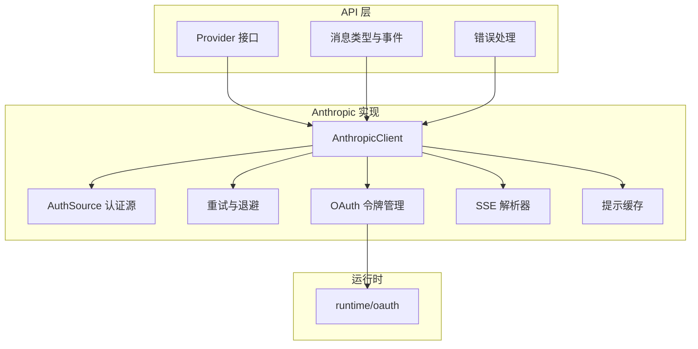
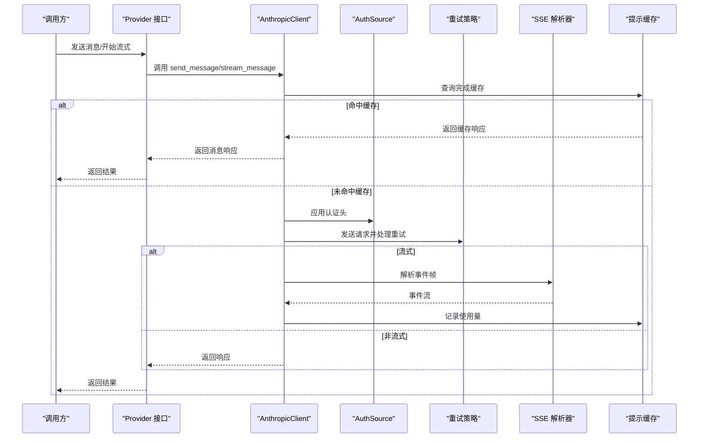
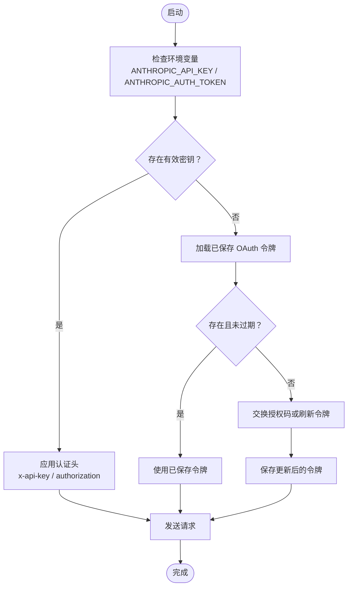
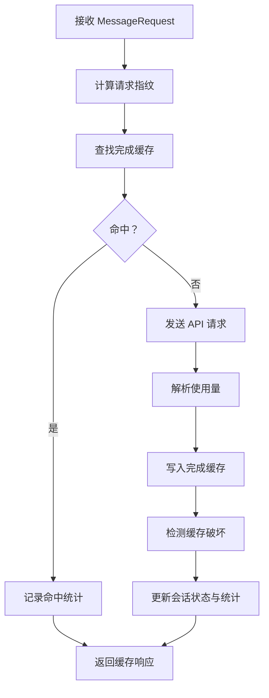
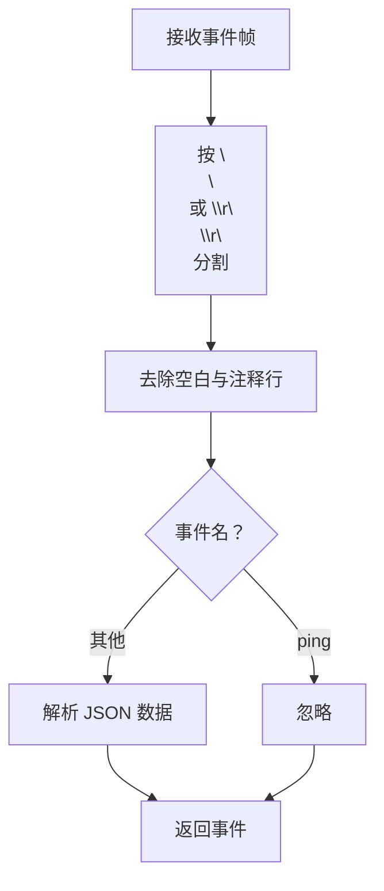
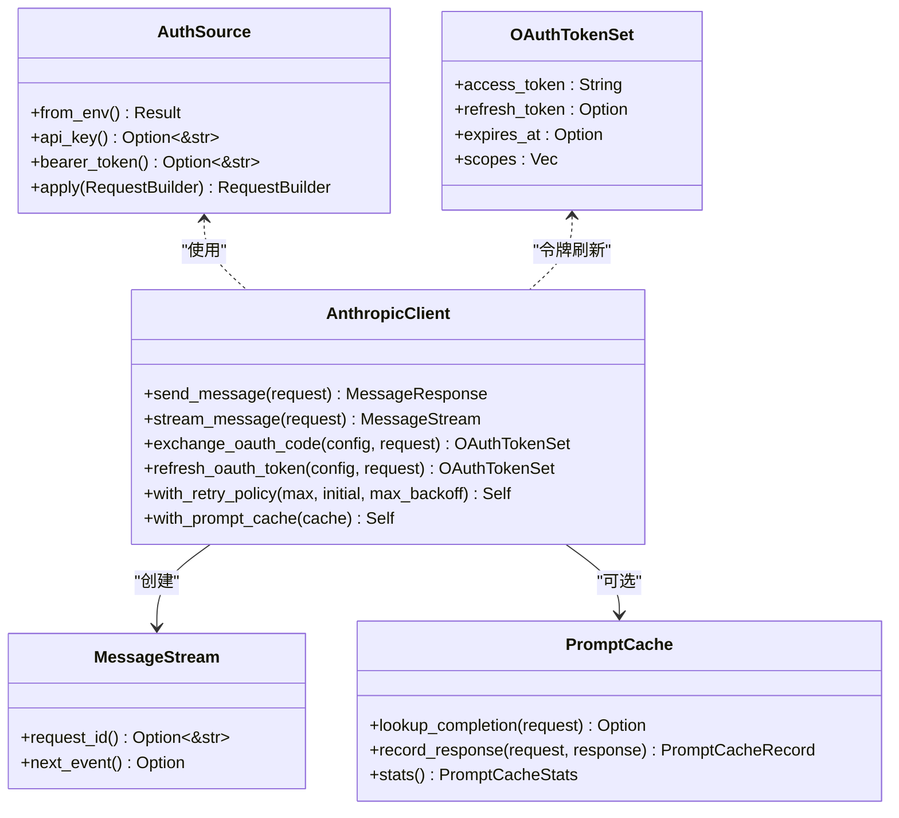
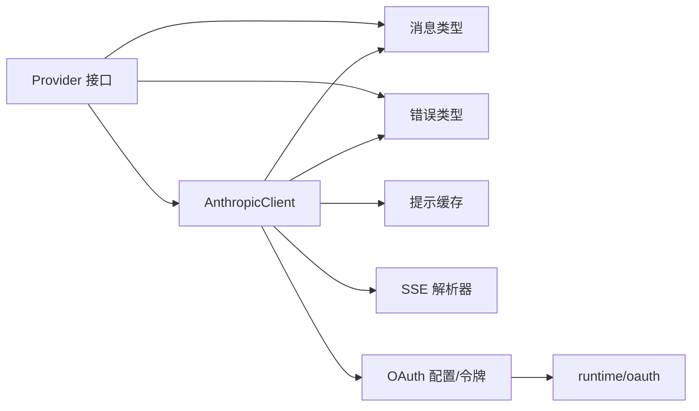

# Anthropic 提供商集成

<cite>
**本文档引用的文件**
- [anthropic.rs](file://rust/crates/api/src/providers/anthropic.rs)
- [prompt_cache.rs](file://rust/crates/api/src/prompt_cache.rs)
- [sse.rs](file://rust/crates/api/src/sse.rs)
- [oauth.rs](file://rust/crates/runtime/src/oauth.rs)
- [types.rs](file://rust/crates/api/src/types.rs)
- [mod.rs](file://rust/crates/api/src/providers/mod.rs)
- [error.rs](file://rust/crates/api/src/error.rs)
- [client_integration.rs](file://rust/crates/api/tests/client_integration.rs)
- [provider_client_integration.rs](file://rust/crates/api/tests/provider_client_integration.rs)
</cite>

## 目录
1. [简介](#简介)
2. [项目结构](#项目结构)
3. [核心组件](#核心组件)
4. [架构概览](#架构概览)
5. [详细组件分析](#详细组件分析)
6. [依赖关系分析](#依赖关系分析)
7. [性能考虑](#性能考虑)
8. [故障排除指南](#故障排除指南)
9. [结论](#结论)

## 简介

本文件详细说明了基于 Rust 的 Anthropic 提供商集成实现，涵盖 Claude API 的认证机制、OAuth 支持、API 密钥管理、提示缓存实现与优化、消息流式传输与事件处理、SSE 支持、模型别名映射、参数转换与响应标准化、认证来源选择、令牌刷新与过期处理，以及错误处理、速率限制和故障恢复配置。

## 项目结构

该项目采用模块化设计，主要涉及以下关键模块：

- providers/antrhropic：Anthropic 客户端实现，包括认证源、请求发送、重试策略、OAuth 交换与刷新
- prompt_cache：提示缓存系统，支持会话级缓存、TTL 管理、缓存命中与失效检测
- sse：SSE（Server-Sent Events）解析器，用于流式传输事件的解析与分帧
- runtime/oauth：OAuth 配置、令牌集、PKCE、授权码交换与刷新
- types：消息请求/响应、流事件、使用量统计等数据结构
- providers/mod：提供商接口、模型别名映射、上下文窗口检查
- error：统一的错误类型与分类、重试判断、安全失败分类

**图表来源**
- [anthropic.rs:114-125](file://rust/crates/api/src/providers/anthropic.rs#L114-L125)
- [oauth.rs:14-19](file://rust/crates/runtime/src/oauth.rs#L14-L19)
- [sse.rs:4-9](file://rust/crates/api/src/sse.rs#L4-L9)
- [prompt_cache.rs:109-111](file://rust/crates/api/src/prompt_cache.rs#L109-L111)
- [types.rs:5-34](file://rust/crates/api/src/types.rs#L5-L34)
- [error.rs:20-66](file://rust/crates/api/src/error.rs#L20-L66)

**章节来源**
- [anthropic.rs:1-120](file://rust/crates/api/src/providers/anthropic.rs#L1-L120)
- [mod.rs:1-80](file://rust/crates/api/src/providers/mod.rs#L1-L80)

## 核心组件

### 认证机制与密钥管理

- 认证源枚举支持四种模式：无认证、仅 API Key、仅 Bearer Token、API Key 与 Bearer 组合
- 环境变量优先级：ANTHROPIC_API_KEY > ANTHROPIC_AUTH_TOKEN
- 基础 URL 可通过环境变量覆盖，默认指向官方 API
- 请求头应用：x-api-key（API Key）、authorization: Bearer（Bearer Token）
- 错误增强：当检测到 sk-ant-* API Key 被错误地放入 Bearer 头时，附加明确的修复提示

**章节来源**
- [anthropic.rs:32-96](file://rust/crates/api/src/providers/anthropic.rs#L32-L96)
- [anthropic.rs:44-56](file://rust/crates/api/src/providers/anthropic.rs#L44-L56)
- [anthropic.rs:765-775](file://rust/crates/api/src/providers/anthropic.rs#L765-L775)
- [anthropic.rs:895-972](file://rust/crates/api/src/providers/anthropic.rs#L895-L972)

### OAuth 支持与令牌刷新

- OAuth 配置结构体包含授权端点、令牌端点、客户端 ID、回调端口、作用域等
- OAuthTokenSet 结构体保存访问令牌、刷新令牌、过期时间与作用域
- 支持 PKCE（S256）挑战与验证器生成
- 令牌交换：将授权码转换为访问令牌
- 令牌刷新：使用刷新令牌获取新令牌，并持久化更新后的令牌
- 令牌过期检测：基于当前时间戳判断是否过期

**章节来源**
- [oauth.rs:14-19](file://rust/crates/runtime/src/oauth.rs#L14-L19)
- [oauth.rs:46-75](file://rust/crates/runtime/src/oauth.rs#L46-L75)
- [oauth.rs:241-248](file://rust/crates/runtime/src/oauth.rs#L241-L248)
- [anthropic.rs:361-399](file://rust/crates/api/src/providers/anthropic.rs#L361-L399)
- [anthropic.rs:638-713](file://rust/crates/api/src/providers/anthropic.rs#L638-L713)

### 模型别名映射与参数转换

- 模型别名映射：如 "opus" → "claude-opus-4-6"、"sonnet" → "claude-sonnet-4-6"、"haiku" → "claude-haiku-4-5-20251213"
- 上下文窗口元数据：不同 Claude 模型的最大输出令牌数与上下文窗口
- 参数转换：移除不支持的 beta 字段、将 OpenAI 兼容字段转换为 Anthropic 字段（如 stop → stop_sequences）
- 预检请求：基于本地字节估算与远程计数端点双重校验，避免超上下文请求

**章节来源**
- [mod.rs:128-151](file://rust/crates/api/src/providers/mod.rs#L128-L151)
- [mod.rs:255-272](file://rust/crates/api/src/providers/mod.rs#L255-L272)
- [mod.rs:274-292](file://rust/crates/api/src/providers/mod.rs#L274-L292)
- [anthropic.rs:974-991](file://rust/crates/api/src/providers/anthropic.rs#L974-L991)
- [anthropic.rs:489-520](file://rust/crates/api/src/providers/anthropic.rs#L489-L520)

### 提示缓存实现与性能优化

- 缓存键：基于请求指纹（版本化 + FNV 哈希），包含模型、系统提示、工具定义、消息内容
- 会话级存储：每个会话独立目录，包含统计文件与完成条目
- TTL 策略：完成项默认 30 秒，提示默认 5 分钟；到期自动清理
- 缓存命中/未命中：命中时累加命中计数并记录使用量；未命中时写入新条目
- 缓存破坏检测：当指纹版本变化或读取令牌显著下降时触发破坏，记录原因与统计
- 性能指标：跟踪请求次数、命中/未命中、写入次数、意外破坏次数、最近一次缓存来源

**章节来源**
- [prompt_cache.rs:19-37](file://rust/crates/api/src/prompt_cache.rs#L19-L37)
- [prompt_cache.rs:109-132](file://rust/crates/api/src/prompt_cache.rs#L109-L132)
- [prompt_cache.rs:145-193](file://rust/crates/api/src/prompt_cache.rs#L145-L193)
- [prompt_cache.rs:314-382](file://rust/crates/api/src/prompt_cache.rs#L314-L382)
- [prompt_cache.rs:435-461](file://rust/crates/api/src/prompt_cache.rs#L435-L461)

### 消息流式传输与 SSE 支持

- 流式消息：设置 stream=true 并使用 SSE 解析器逐帧解析
- SSE 解析器：支持 CR/LF 与 LF 分隔符，忽略 ping 与 [DONE]，保留有用的事件帧
- 事件类型：message_start、content_block_start、content_block_delta、content_block_stop、message_delta、message_stop
- 使用量记录：在 message_stop 事件时记录最后一次使用量，用于缓存统计

**章节来源**
- [types.rs:259-266](file://rust/crates/api/src/types.rs#L259-L266)
- [sse.rs:4-51](file://rust/crates/api/src/sse.rs#L4-L51)
- [sse.rs:82-128](file://rust/crates/api/src/sse.rs#L82-L128)
- [anthropic.rs:339-359](file://rust/crates/api/src/providers/anthropic.rs#L339-L359)
- [anthropic.rs:809-864](file://rust/crates/api/src/providers/anthropic.rs#L809-L864)

### 错误处理、速率限制与故障恢复

- 统一错误类型：缺少凭据、上下文窗口超限、过期 OAuth 令牌、HTTP/IO/JSON 解析错误、API 错误、重试耗尽、无效 SSE 帧、退避溢出
- 重试策略：指数退避 + 抖动，支持 408/409/429/500/502/503/504 等可重试状态码
- 安全失败分类：根据状态码与消息内容识别上下文窗口、速率限制、内部错误、传输错误等
- 故障恢复：在网络错误、超时、请求错误时自动重试；对 429 进行速率限制处理

**章节来源**
- [error.rs:20-66](file://rust/crates/api/src/error.rs#L20-L66)
- [error.rs:118-134](file://rust/crates/api/src/error.rs#L118-L134)
- [error.rs:154-176](file://rust/crates/api/src/error.rs#L154-L176)
- [anthropic.rs:866-889](file://rust/crates/api/src/providers/anthropic.rs#L866-L889)
- [anthropic.rs:891-893](file://rust/crates/api/src/providers/anthropic.rs#L891-L893)

## 架构概览

**图表来源**
- [anthropic.rs:283-337](file://rust/crates/api/src/providers/anthropic.rs#L283-L337)
- [anthropic.rs:339-359](file://rust/crates/api/src/providers/anthropic.rs#L339-L359)
- [anthropic.rs:401-464](file://rust/crates/api/src/providers/anthropic.rs#L401-L464)
- [prompt_cache.rs:145-193](file://rust/crates/api/src/prompt_cache.rs#L145-L193)
- [sse.rs:28-51](file://rust/crates/api/src/sse.rs#L28-L51)

## 详细组件分析

### 认证源与令牌刷新流程

**图表来源**
- [anthropic.rs:619-674](file://rust/crates/api/src/providers/anthropic.rs#L619-L674)
- [anthropic.rs:676-713](file://rust/crates/api/src/providers/anthropic.rs#L676-L713)
- [oauth.rs:269-292](file://rust/crates/runtime/src/oauth.rs#L269-L292)

**章节来源**
- [anthropic.rs:619-674](file://rust/crates/api/src/providers/anthropic.rs#L619-L674)
- [anthropic.rs:676-713](file://rust/crates/api/src/providers/anthropic.rs#L676-L713)
- [oauth.rs:269-292](file://rust/crates/runtime/src/oauth.rs#L269-L292)

### 提示缓存工作流

**图表来源**
- [prompt_cache.rs:145-193](file://rust/crates/api/src/prompt_cache.rs#L145-L193)
- [prompt_cache.rs:195-243](file://rust/crates/api/src/prompt_cache.rs#L195-L243)
- [prompt_cache.rs:314-382](file://rust/crates/api/src/prompt_cache.rs#L314-L382)

**章节来源**
- [prompt_cache.rs:145-193](file://rust/crates/api/src/prompt_cache.rs#L145-L193)
- [prompt_cache.rs:195-243](file://rust/crates/api/src/prompt_cache.rs#L195-L243)
- [prompt_cache.rs:314-382](file://rust/crates/api/src/prompt_cache.rs#L314-L382)

### SSE 事件解析流程

**图表来源**
- [sse.rs:59-79](file://rust/crates/api/src/sse.rs#L59-L79)
- [sse.rs:82-128](file://rust/crates/api/src/sse.rs#L82-L128)

**章节来源**
- [sse.rs:59-79](file://rust/crates/api/src/sse.rs#L59-L79)
- [sse.rs:82-128](file://rust/crates/api/src/sse.rs#L82-L128)

### 类关系图（代码级）

**图表来源**
- [anthropic.rs:32-96](file://rust/crates/api/src/providers/anthropic.rs#L32-L96)
- [anthropic.rs:114-125](file://rust/crates/api/src/providers/anthropic.rs#L114-L125)
- [anthropic.rs:795-807](file://rust/crates/api/src/providers/anthropic.rs#L795-L807)
- [prompt_cache.rs:109-111](file://rust/crates/api/src/prompt_cache.rs#L109-L111)
- [oauth.rs:14-19](file://rust/crates/runtime/src/oauth.rs#L14-L19)

**章节来源**
- [anthropic.rs:32-96](file://rust/crates/api/src/providers/anthropic.rs#L32-L96)
- [anthropic.rs:114-125](file://rust/crates/api/src/providers/anthropic.rs#L114-L125)
- [anthropic.rs:795-807](file://rust/crates/api/src/providers/anthropic.rs#L795-L807)
- [prompt_cache.rs:109-111](file://rust/crates/api/src/prompt_cache.rs#L109-L111)
- [oauth.rs:14-19](file://rust/crates/runtime/src/oauth.rs#L14-L19)

## 依赖关系分析

- Provider 接口抽象：统一 send_message 与 stream_message 行为
- 模型别名与上下文窗口：通过 providers/mod 中的注册表与查询函数实现路由与限制
- 类型系统：types.rs 定义了消息、事件、使用量等核心数据结构
- 错误系统：error.rs 提供统一错误分类与重试判断逻辑
- 运行时 OAuth：runtime/oauth.rs 提供令牌持久化、PKCE、交换与刷新

**图表来源**
- [mod.rs:17-29](file://rust/crates/api/src/providers/mod.rs#L17-L29)
- [types.rs:5-34](file://rust/crates/api/src/types.rs#L5-L34)
- [error.rs:20-66](file://rust/crates/api/src/error.rs#L20-L66)
- [anthropic.rs:114-125](file://rust/crates/api/src/providers/anthropic.rs#L114-L125)
- [oauth.rs:14-19](file://rust/crates/runtime/src/oauth.rs#L14-L19)

**章节来源**
- [mod.rs:17-29](file://rust/crates/api/src/providers/mod.rs#L17-L29)
- [types.rs:5-34](file://rust/crates/api/src/types.rs#L5-L34)
- [error.rs:20-66](file://rust/crates/api/src/error.rs#L20-L66)
- [anthropic.rs:114-125](file://rust/crates/api/src/providers/anthropic.rs#L114-L125)
- [oauth.rs:14-19](file://rust/crates/runtime/src/oauth.rs#L14-L19)

## 性能考虑

- 指数退避与抖动：避免雪崩效应，确保并发重试的 decorrelation
- 预检请求：先进行本地字节估算，再进行远程计数端点调用，减少网络往返
- 提示缓存：显著降低重复请求的延迟与成本，支持会话级持久化
- SSE 解析：零拷贝缓冲与增量解析，减少内存占用
- 使用量统计：在流式结束时记录使用量，避免重复计算

**章节来源**
- [anthropic.rs:569-586](file://rust/crates/api/src/providers/anthropic.rs#L569-L586)
- [anthropic.rs:489-520](file://rust/crates/api/src/providers/anthropic.rs#L489-L520)
- [prompt_cache.rs:145-193](file://rust/crates/api/src/prompt_cache.rs#L145-L193)
- [sse.rs:28-51](file://rust/crates/api/src/sse.rs#L28-L51)

## 故障排除指南

- 缺少凭据：检查 ANTHROPIC_API_KEY 与 ANTHROPIC_AUTH_TOKEN 是否设置，或参考提示信息切换到正确的提供商
- 401 错误：若 Bearer 头携带 sk-ant-* 形式的 API Key，系统会附加修复提示
- 429 速率限制：启用重试策略，合理配置最大重试次数与退避上限
- 上下文窗口超限：减少输入长度或输出令牌数，或使用更高容量的模型
- SSE 解析失败：确认服务器返回格式符合标准，忽略 ping 与 [DONE] 帧
- OAuth 刷新失败：检查刷新令牌是否存在，必要时重新授权

**章节来源**
- [error.rs:231-329](file://rust/crates/api/src/error.rs#L231-L329)
- [anthropic.rs:895-972](file://rust/crates/api/src/providers/anthropic.rs#L895-L972)
- [anthropic.rs:866-889](file://rust/crates/api/src/providers/anthropic.rs#L866-L889)
- [mod.rs:274-292](file://rust/crates/api/src/providers/mod.rs#L274-L292)
- [sse.rs:82-128](file://rust/crates/api/src/sse.rs#L82-L128)
- [oauth.rs:269-292](file://rust/crates/runtime/src/oauth.rs#L269-L292)

## 结论

该 Anthropic 提供商集成实现了从认证、OAuth、请求发送、重试与退避、SSE 流式解析到提示缓存的完整链路。通过模型别名映射与参数转换，确保与上游 API 的兼容性；通过预检与上下文窗口检查，提升请求成功率；通过统一的错误分类与重试策略，增强系统的鲁棒性。提示缓存与使用量统计进一步优化了性能与成本控制。整体设计兼顾易用性与可维护性，适合在生产环境中稳定运行。