# OpenAI 兼容提供商

<cite>
**本文档引用的文件**
- [openai_compat.rs](file://rust/crates/api/src/providers/openai_compat.rs)
- [mod.rs](file://rust/crates/api/src/providers/mod.rs)
- [client.rs](file://rust/crates/api/src/client.rs)
- [types.rs](file://rust/crates/api/src/types.rs)
- [error.rs](file://rust/crates/api/src/error.rs)
- [sse.rs](file://rust/crates/api/src/sse.rs)
- [anthropic.rs](file://rust/crates/api/src/providers/anthropic.rs)
- [openai_compat_integration.rs](file://rust/crates/api/tests/openai_compat_integration.rs)
- [provider_client_integration.rs](file://rust/crates/api/tests/provider_client_integration.rs)
- [Cargo.toml](file://rust/crates/api/Cargo.toml)
</cite>

## 目录
1. [简介](#简介)
2. [项目结构](#项目结构)
3. [核心组件](#核心组件)
4. [架构概览](#架构概览)
5. [详细组件分析](#详细组件分析)
6. [依赖关系分析](#依赖关系分析)
7. [性能考虑](#性能考虑)
8. [故障排除指南](#故障排除指南)
9. [结论](#结论)
10. [附录](#附录)

## 简介

OpenAI 兼容提供商是本项目中一个关键的抽象层，它实现了对多个 AI 模型提供商的统一访问接口。该系统支持 OpenAI、xAI 和 DashScope（通过阿里云 DashScope）三个主要提供商，通过统一的 OpenAI 兼容协议进行通信。

该实现的核心目标是：
- 提供统一的 API 接口，屏蔽不同提供商的差异
- 支持流式和非流式消息处理
- 实现智能的提供商检测和路由
- 提供健壮的错误处理和重试机制
- 标准化响应格式和参数映射

## 项目结构

该项目采用 Rust 编写，主要模块结构如下：

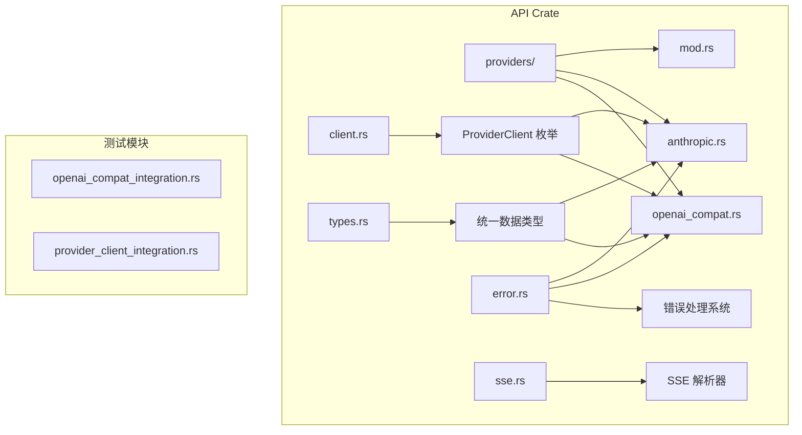

**图表来源**
- [client.rs:1-107](file://rust/crates/api/src/client.rs#L1-L107)
- [openai_compat.rs:1-1798](file://rust/crates/api/src/providers/openai_compat.rs#L1-L1798)
- [anthropic.rs:1-1706](file://rust/crates/api/src/providers/anthropic.rs#L1-L1706)

**章节来源**
- [Cargo.toml:1-18](file://rust/crates/api/Cargo.toml#L1-L18)

## 核心组件

### ProviderClient 统一客户端

ProviderClient 是整个系统的入口点，它根据模型名称自动选择合适的提供商：

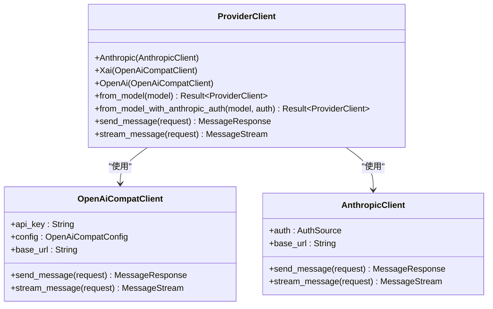

**图表来源**
- [client.rs:8-107](file://rust/crates/api/src/client.rs#L8-L107)
- [openai_compat.rs:86-147](file://rust/crates/api/src/providers/openai_compat.rs#L86-L147)
- [anthropic.rs:113-158](file://rust/crates/api/src/providers/anthropic.rs#L113-L158)

### OpenAiCompatConfig 配置系统

OpenAiCompatConfig 提供了对三个主要提供商的统一配置：

| 提供商 | 默认 Base URL | API Key 环境变量 | Base URL 环境变量 |
|--------|---------------|------------------|-------------------|
| OpenAI | api.openai.com/v1 | OPENAI_API_KEY | OPENAI_BASE_URL |
| xAI | api.x.ai/v1 | XAI_API_KEY | XAI_BASE_URL |
| DashScope | dashscope.aliyuncs.com/compatible-mode/v1 | DASHSCOPE_API_KEY | DASHSCOPE_BASE_URL |

**章节来源**
- [openai_compat.rs:19-84](file://rust/crates/api/src/providers/openai_compat.rs#L19-L84)

### 消息请求和响应标准化

系统定义了统一的消息格式，确保所有提供商返回的数据结构一致：

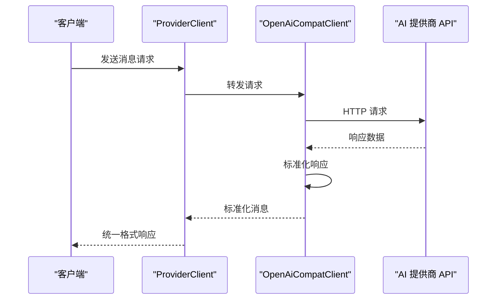

**图表来源**
- [client.rs:82-106](file://rust/crates/api/src/client.rs#L82-L106)
- [openai_compat.rs:148-197](file://rust/crates/api/src/providers/openai_compat.rs#L148-L197)

**章节来源**
- [types.rs:5-136](file://rust/crates/api/src/types.rs#L5-L136)

## 架构概览

系统采用分层架构设计，实现了高度的模块化和可扩展性：

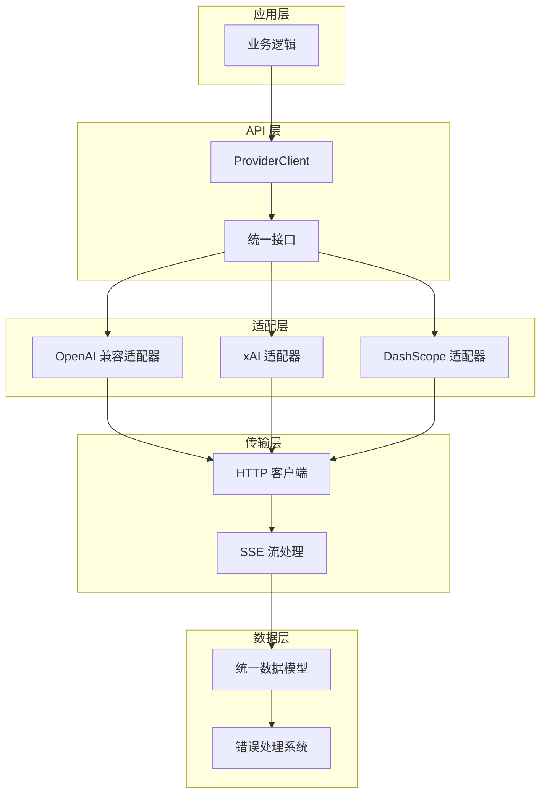

**图表来源**
- [client.rs:1-107](file://rust/crates/api/src/client.rs#L1-L107)
- [openai_compat.rs:323-339](file://rust/crates/api/src/providers/openai_compat.rs#L323-L339)
- [mod.rs:17-29](file://rust/crates/api/src/providers/mod.rs#L17-L29)

## 详细组件分析

### OpenAI 兼容适配器

OpenAiCompatClient 是系统的核心组件，负责与 OpenAI 兼容的提供商进行通信：

#### 主要特性

1. **统一认证机制**：支持三种不同的认证方式
2. **智能路由**：根据模型名称自动选择提供商
3. **流式处理**：支持 SSE 流式响应
4. **重试机制**：实现指数退避重试策略

#### 关键实现细节

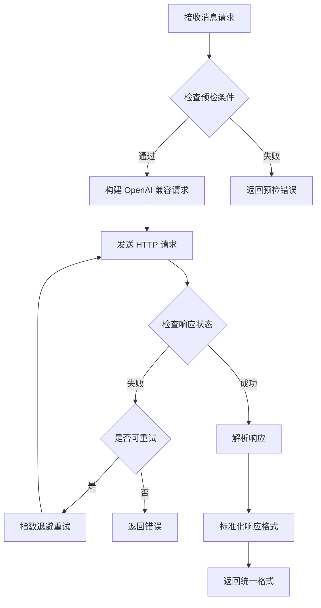

**图表来源**
- [openai_compat.rs:217-246](file://rust/crates/api/src/providers/openai_compat.rs#L217-L246)
- [openai_compat.rs:148-197](file://rust/crates/api/src/providers/openai_compat.rs#L148-L197)

**章节来源**
- [openai_compat.rs:86-280](file://rust/crates/api/src/providers/openai_compat.rs#L86-L280)

### 模型元数据和提供商检测

系统实现了智能的模型识别和提供商路由机制：

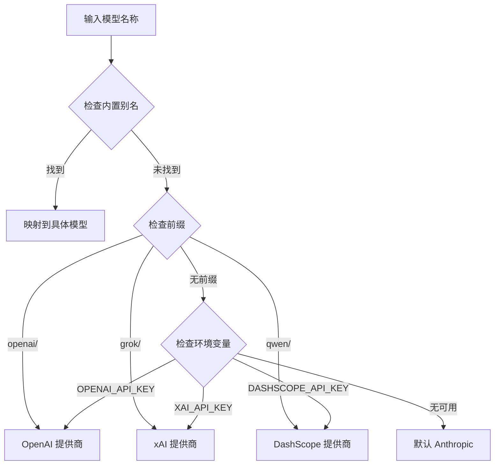

**图表来源**
- [mod.rs:127-229](file://rust/crates/api/src/providers/mod.rs#L127-L229)

**章节来源**
- [mod.rs:52-198](file://rust/crates/api/src/providers/mod.rs#L52-L198)

### 参数映射和响应标准化

系统实现了复杂的参数映射和响应标准化机制：

#### 参数映射规则

| OpenAI 参数 | xAI 映射 | DashScope 映射 |
|-------------|----------|----------------|
| temperature | temperature | temperature |
| top_p | top_p | top_p |
| frequency_penalty | frequency_penalty | frequency_penalty |
| presence_penalty | presence_penalty | presence_penalty |
| max_tokens | max_tokens | max_tokens |
| reasoning_effort | reasoning_effort | reasoning_effort |

#### 响应标准化

系统将不同提供商的响应转换为统一的格式：

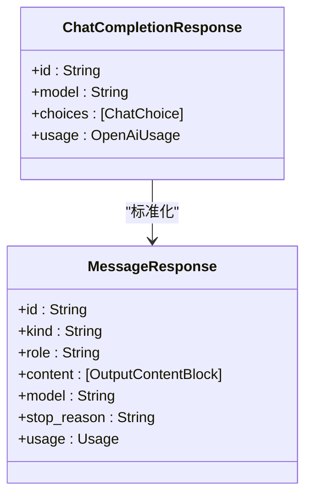

**图表来源**
- [openai_compat.rs:1066-1113](file://rust/crates/api/src/providers/openai_compat.rs#L1066-L1113)

**章节来源**
- [openai_compat.rs:789-869](file://rust/crates/api/src/providers/openai_compat.rs#L789-L869)

### 错误处理和重试机制

系统实现了多层次的错误处理和重试机制：

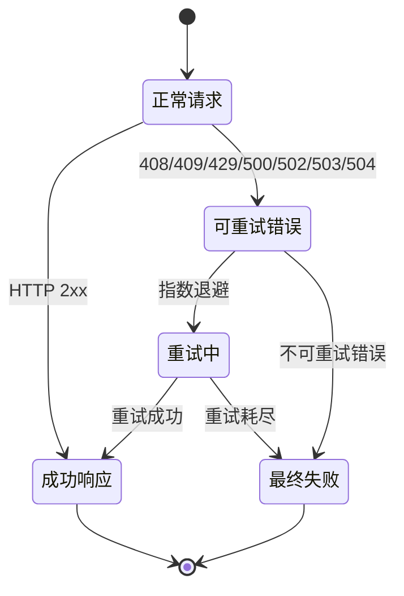

**图表来源**
- [openai_compat.rs:217-246](file://rust/crates/api/src/providers/openai_compat.rs#L217-L246)
- [error.rs:119-134](file://rust/crates/api/src/error.rs#L119-L134)

**章节来源**
- [error.rs:20-66](file://rust/crates/api/src/error.rs#L20-L66)

## 依赖关系分析

### 外部依赖

系统的主要外部依赖包括：

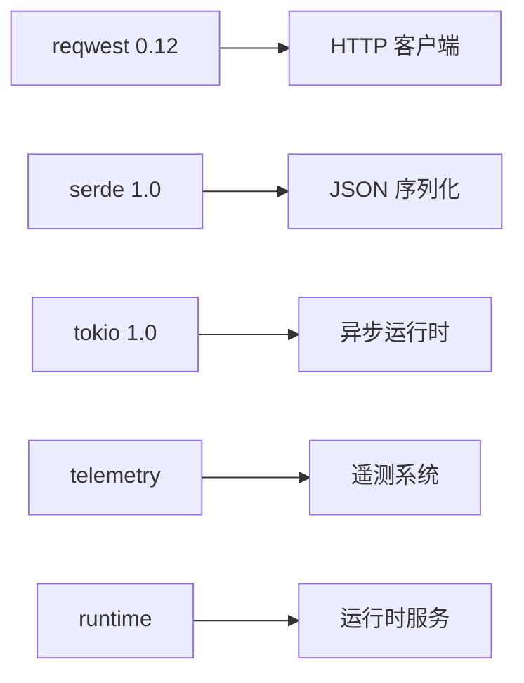

**图表来源**
- [Cargo.toml:8-14](file://rust/crates/api/Cargo.toml#L8-L14)

### 内部模块依赖

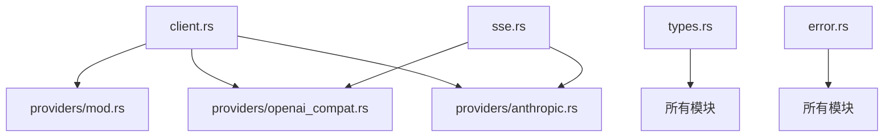

**图表来源**
- [client.rs:1-6](file://rust/crates/api/src/client.rs#L1-L6)

**章节来源**
- [Cargo.toml:1-18](file://rust/crates/api/Cargo.toml#L1-L18)

## 性能考虑

### 连接池和并发

系统使用连接池优化网络请求性能：

- **HTTP 客户端复用**：每个客户端维护独立的 HTTP 客户端实例
- **异步并发**：基于 Tokio 的异步运行时，支持高并发请求
- **连接复用**：利用 HTTP/1.1 的连接复用特性

### 缓存策略

- **提示缓存**：Anthropic 客户端支持提示缓存功能
- **响应缓存**：计划中的功能，用于缓存重复的请求结果

### 内存管理

- **零拷贝字符串**：使用 `Cow<str>` 类型减少字符串复制
- **流式处理**：SSE 流式处理避免大响应的内存占用

## 故障排除指南

### 常见问题诊断

#### 认证问题

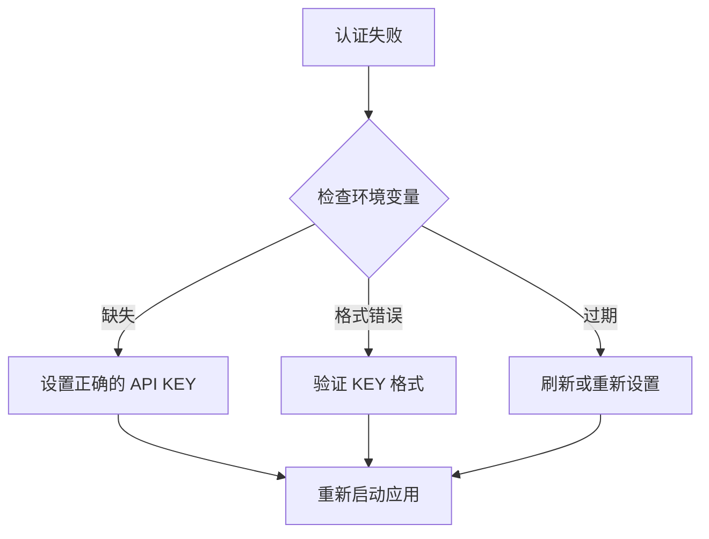

**图表来源**
- [openai_compat.rs:119-127](file://rust/crates/api/src/providers/openai_compat.rs#L119-L127)

#### 网络连接问题

- **检查网络连通性**：确认能够访问提供商的 API 端点
- **代理配置**：如果使用代理，确保正确配置
- **防火墙设置**：检查防火墙是否阻止了 API 请求

#### 超时和重试

- **调整超时时间**：根据网络状况调整请求超时
- **重试策略**：合理配置重试次数和间隔
- **监控指标**：使用遥测系统监控请求成功率

**章节来源**
- [error.rs:155-176](file://rust/crates/api/src/error.rs#L155-L176)

## 结论

OpenAI 兼容提供商系统通过精心设计的架构和实现，成功地实现了对多个 AI 模型提供商的统一访问。其主要优势包括：

1. **高度的可扩展性**：新的提供商可以轻松集成
2. **统一的 API 接口**：简化了上层应用的开发
3. **健壮的错误处理**：提供了完善的错误诊断和恢复机制
4. **性能优化**：通过连接池和异步处理提升了性能
5. **灵活的配置**：支持多种认证方式和自定义配置

该系统为构建可靠的 AI 应用程序提供了坚实的基础，同时保持了良好的可维护性和可扩展性。

## 附录

### 新兼容提供商集成指南

#### 1. 创建配置结构

```rust
// 在 providers/mod.rs 中添加
#[derive(Debug, Clone, Copy, PartialEq, Eq)]
pub struct NewProviderConfig {
    pub provider_name: &'static str,
    pub api_key_env: &'static str,
    pub base_url_env: &'static str,
    pub default_base_url: &'static str,
}

// 添加到 OpenAiCompatConfig
impl OpenAiCompatConfig {
    // ...
    
    #[must_use]
    pub const fn new_provider() -> Self {
        Self {
            provider_name: "NewProvider",
            api_key_env: "NEW_PROVIDER_API_KEY",
            base_url_env: "NEW_PROVIDER_BASE_URL",
            default_base_url: "https://api.newprovider.com/v1",
        }
    }
}
```

#### 2. 实现客户端

```rust
// 在 providers/new_provider.rs 中
use super::openai_compat::{OpenAiCompatClient, OpenAiCompatConfig};

pub struct NewProviderClient {
    http: reqwest::Client,
    api_key: String,
    config: OpenAiCompatConfig,
    base_url: String,
}

impl NewProviderClient {
    // 实现发送消息的方法
    pub async fn send_message(&self, request: &MessageRequest) -> Result<MessageResponse, ApiError> {
        // 实现具体的 API 调用
    }
    
    // 实现流式消息的方法
    pub async fn stream_message(&self, request: &MessageRequest) -> Result<MessageStream, ApiError> {
        // 实现流式处理
    }
}
```

#### 3. 集成到 ProviderClient

```rust
// 在 client.rs 中
impl ProviderClient {
    // ...
    
    pub fn from_model_with_new_provider(model: &str, api_key: &str) -> Result<Self, ApiError> {
        let resolved_model = providers::resolve_model_alias(model);
        match providers::detect_provider_kind(&resolved_model) {
            ProviderKind::NewProvider => Ok(Self::NewProvider(NewProviderClient::new(api_key))),
            // ... 其他提供商
        }
    }
}
```

#### 4. 测试策略

```rust
// 在 tests/new_provider_integration.rs 中
#[tokio::test]
async fn test_new_provider_integration() {
    // 测试基本功能
    let client = NewProviderClient::new("test-key");
    let response = client.send_message(&sample_request()).await;
    assert!(response.is_ok());
    
    // 测试错误处理
    let error_client = NewProviderClient::new("");
    let error = error_client.send_message(&sample_request()).await;
    assert!(error.is_err());
}
```

#### 5. 配置管理

- **环境变量**：支持 `NEW_PROVIDER_API_KEY` 和 `NEW_PROVIDER_BASE_URL`
- **默认值**：提供合理的默认配置
- **覆盖机制**：允许用户自定义配置

#### 6. 参数映射

实现与 OpenAI 兼容的参数映射：

```rust
// 将提供商特定的参数转换为 OpenAI 兼容格式
fn map_parameters(request: &MessageRequest) -> serde_json::Value {
    let mut payload = serde_json::json!({
        "model": request.model,
        "messages": request.messages,
        "stream": request.stream,
    });
    
    // 添加提供商特定的参数映射
    if let Some(temperature) = request.temperature {
        payload["temperature"] = serde_json::Value::Number(temperature.into());
    }
    
    payload
}
```

#### 7. 响应格式标准化

```rust
// 标准化不同提供商的响应
fn normalize_response(response: &RawResponse) -> MessageResponse {
    MessageResponse {
        id: response.id,
        kind: "message".to_string(),
        role: response.role,
        content: normalize_content(response.content),
        model: response.model,
        stop_reason: normalize_stop_reason(response.finish_reason),
        usage: Usage {
            input_tokens: response.usage.prompt_tokens,
            output_tokens: response.usage.completion_tokens,
            ..Default::default()
        },
        request_id: response.request_id,
    }
}
```

#### 8. 错误处理

```rust
// 实现提供商特定的错误映射
impl From<NewProviderError> for ApiError {
    fn from(error: NewProviderError) -> Self {
        match error {
            NewProviderError::Authentication => ApiError::MissingCredentials {
                provider: "NewProvider",
                env_vars: &["NEW_PROVIDER_API_KEY"],
                hint: None,
            },
            NewProviderError::RateLimit => ApiError::Api {
                status: reqwest::StatusCode::TOO_MANY_REQUESTS,
                error_type: Some("rate_limit".to_string()),
                message: Some("Rate limit exceeded".to_string()),
                request_id: None,
                body: error.to_string(),
                retryable: true,
            },
            _ => ApiError::Api {
                status: reqwest::StatusCode::BAD_GATEWAY,
                error_type: Some("provider_error".to_string()),
                message: Some(error.to_string()),
                request_id: None,
                body: error.to_string(),
                retryable: false,
            },
        }
    }
}
```

通过遵循这些步骤，开发者可以快速地将新的 AI 模型提供商集成到系统中，同时保持与现有代码的一致性和兼容性。