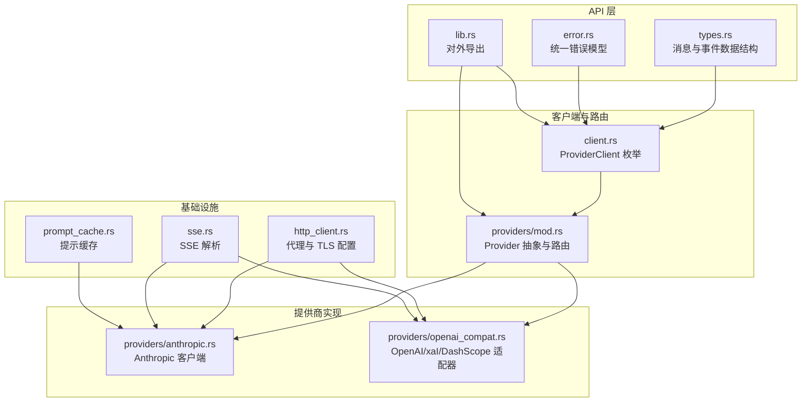
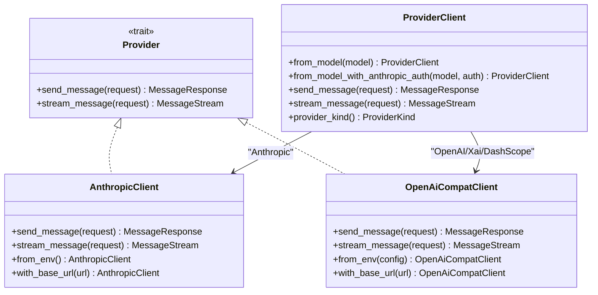
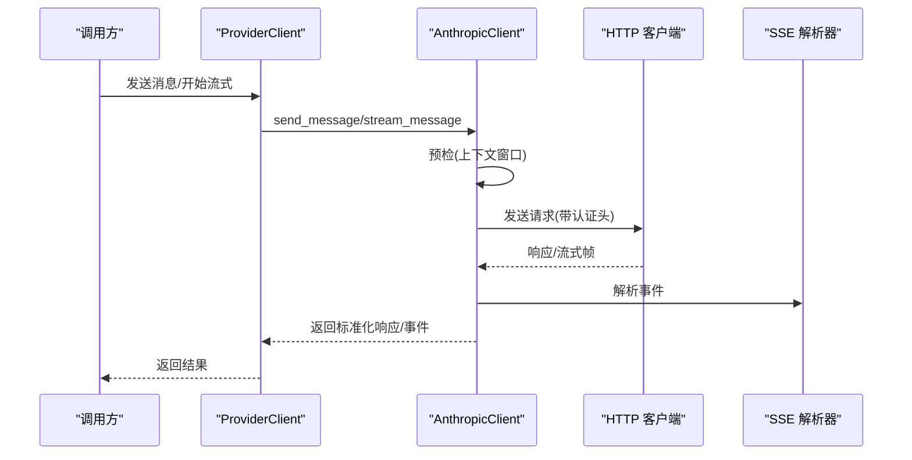
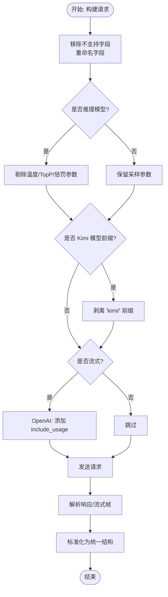
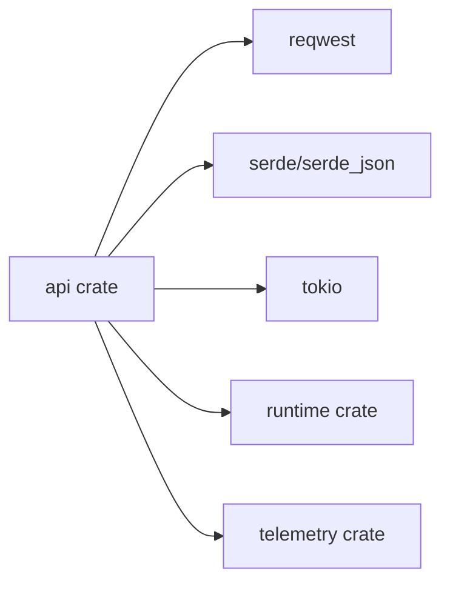

# 多提供商集成

<cite>
**本文引用的文件**
- [lib.rs](file://rust/crates/api/src/lib.rs)
- [mod.rs](file://rust/crates/api/src/providers/mod.rs)
- [client.rs](file://rust/crates/api/src/client.rs)
- [types.rs](file://rust/crates/api/src/types.rs)
- [error.rs](file://rust/crates/api/src/error.rs)
- [anthropic.rs](file://rust/crates/api/src/providers/anthropic.rs)
- [openai_compat.rs](file://rust/crates/api/src/providers/openai_compat.rs)
- [http_client.rs](file://rust/crates/api/src/http_client.rs)
- [prompt_cache.rs](file://rust/crates/api/src/prompt_cache.rs)
- [sse.rs](file://rust/crates/api/src/sse.rs)
- [Cargo.toml](file://rust/crates/api/Cargo.toml)
- [provider_client_integration.rs](file://rust/crates/api/tests/provider_client_integration.rs)
- [openai_compat_integration.rs](file://rust/crates/api/tests/openai_compat_integration.rs)
</cite>

## 更新摘要
**变更内容**
- 新增 Kimi 模型支持（kimi-k2.5、kimi-k1.5）通过 DashScope 兼容模式自动路由
- 增强模型别名解析系统，支持 Kimi 模型别名 "kimi" 解析为 "kimi-k2.5"
- 添加 Kimi 模型令牌限制元数据（上下文窗口 256K，输出令牌 16K）
- 改进错误处理系统，增强错误分类和故障排除能力
- 新增 Kimi 模型前缀路由支持（kimi/ 前缀自动剥离）

## 目录
1. [简介](#简介)
2. [项目结构](#项目结构)
3. [核心组件](#核心组件)
4. [架构总览](#架构总览)
5. [详细组件分析](#详细组件分析)
6. [依赖关系分析](#依赖关系分析)
7. [性能考虑](#性能考虑)
8. [故障排查指南](#故障排查指南)
9. [结论](#结论)
10. [附录](#附录)

## 简介
本文件面向"多提供商集成系统"的设计与实现，覆盖以下目标：
- 支持的 AI 提供商：Anthropic、OpenAI、xAI、DashScope（通过 OpenAI 兼容模式）
- 兼容性适配器与统一客户端抽象
- 认证机制与密钥管理
- 请求路由策略与模型别名解析
- 速率限制与重试退避
- 错误分类与诊断
- 提供商切换、负载均衡与故障转移的配置建议
- 模型路由、参数映射与响应标准化
- 新提供商集成的开发指南与测试策略

**更新** 新增 Kimi 模型支持，包括自动路由到 DashScope、模型别名解析和令牌限制元数据

## 项目结构
该系统以 Rust crate 形式组织，核心位于 api 子模块中，采用"按功能域分层 + 接口抽象"的设计：
- 统一类型与错误定义：types.rs、error.rs
- 客户端与路由：client.rs、providers/mod.rs
- 各提供商实现：providers/anthropic.rs、providers/openai_compat.rs
- HTTP 与 SSE 工具：http_client.rs、sse.rs
- 可选提示缓存：prompt_cache.rs
- 对外导出与公共 API：lib.rs
- 测试用例：tests/*.rs

**图表来源**
- [lib.rs:1-40](file://rust/crates/api/src/lib.rs#L1-L40)
- [client.rs:1-130](file://rust/crates/api/src/client.rs#L1-L130)
- [mod.rs:1-120](file://rust/crates/api/src/providers/mod.rs#L1-L120)
- [anthropic.rs:1-120](file://rust/crates/api/src/providers/anthropic.rs#L1-L120)
- [openai_compat.rs:1-120](file://rust/crates/api/src/providers/openai_compat.rs#L1-L120)
- [http_client.rs:1-120](file://rust/crates/api/src/http_client.rs#L1-L120)
- [sse.rs:1-120](file://rust/crates/api/src/sse.rs#L1-L120)
- [prompt_cache.rs:1-120](file://rust/crates/api/src/prompt_cache.rs#L1-L120)

**章节来源**
- [lib.rs:1-40](file://rust/crates/api/src/lib.rs#L1-L40)
- [Cargo.toml:1-18](file://rust/crates/api/Cargo.toml#L1-L18)

## 核心组件
- Provider 抽象与路由
  - Provider trait 定义统一的 send_message/stream_message 接口
  - ProviderKind 枚举区分 Anthropic、Xai、OpenAi
  - detect_provider_kind 基于模型前缀与环境变量进行路由
  - resolve_model_alias 将 grok/opus/haiku/kimi 等别名映射为真实模型 ID
- ProviderClient 枚举
  - 统一入口，根据模型与认证信息选择 Anthropic 或 OpenAI 兼容客户端
  - 支持从显式 AuthSource 或环境变量构建
- 类型与事件
  - MessageRequest/MessageResponse/StreamEvent 定义跨提供商一致的数据结构
  - Usage、ToolDefinition、ContentBlock 等标准化内容块
- 错误模型
  - ApiError 统一封装 HTTP、JSON 解析、上下文窗口超限、OAuth 过期等错误
  - 提供 is_retryable、safe_failure_class 等辅助判断
- HTTP 与 SSE
  - http_client.rs 支持 HTTP_PROXY/HTTPS_PROXY/NO_PROXY
  - sse.rs 解析标准 SSE 帧，兼容 ping/done 与多行 data
- 提示缓存
  - prompt_cache.rs 实现基于会话的补全缓存与使用统计

**更新** 新增 Kimi 模型别名解析和令牌限制元数据支持

**章节来源**
- [mod.rs:17-50](file://rust/crates/api/src/providers/mod.rs#L17-L50)
- [client.rs:8-107](file://rust/crates/api/src/client.rs#L8-L107)
- [types.rs:5-136](file://rust/crates/api/src/types.rs#L5-L136)
- [error.rs:20-66](file://rust/crates/api/src/error.rs#L20-L66)
- [http_client.rs:1-113](file://rust/crates/api/src/http_client.rs#L1-L113)
- [sse.rs:1-80](file://rust/crates/api/src/sse.rs#L1-L80)
- [prompt_cache.rs:109-250](file://rust/crates/api/src/prompt_cache.rs#L109-L250)

## 架构总览
系统采用"统一抽象 + 多实现"的架构：
- Provider 抽象屏蔽不同提供商差异
- ProviderClient 作为工厂与路由器，负责模型别名解析、提供商检测与客户端实例化
- OpenAI 兼容适配器统一处理 OpenAI、xAI、DashScope 的 REST 接口
- Anthropic 客户端独立实现，包含专用的 beta 参数处理与计数接口
- 统一的错误模型与重试策略，结合 SSE 解析与可选提示缓存

**图表来源**
- [mod.rs:17-29](file://rust/crates/api/src/providers/mod.rs#L17-L29)
- [client.rs:9-107](file://rust/crates/api/src/client.rs#L9-L107)
- [anthropic.rs:113-125](file://rust/crates/api/src/providers/anthropic.rs#L113-L125)
- [openai_compat.rs:86-95](file://rust/crates/api/src/providers/openai_compat.rs#L86-L95)

## 详细组件分析

### Provider 抽象与路由
- Provider trait
  - 统一的同步/异步发送与流式接口，便于上层无感切换
- ProviderKind 与元数据
  - ProviderKind 区分 Anthropic、Xai、OpenAi
  - ProviderMetadata 持有提供商名称、认证与基础 URL 环境变量键
- 模型别名与检测
  - resolve_model_alias 将 grok、opus、sonnet、haiku、kimi 等别名规范化
  - detect_provider_kind 优先依据模型前缀，其次回退到环境变量嗅探
  - DashScope 通过 qwen/* 前缀和 kimi/* 前缀路由至 OpenAI 兼容客户端
- 上下文窗口预检
  - preflight_message_request 在发送前估算 token 并拒绝超限请求
  - model_token_limit 提供已知模型的上下文窗口与输出上限

**更新** 新增 Kimi 模型别名解析，支持 "kimi" 别名解析为 "kimi-k2.5"

**章节来源**
- [mod.rs:31-198](file://rust/crates/api/src/providers/mod.rs#L31-L198)
- [mod.rs:274-306](file://rust/crates/api/src/providers/mod.rs#L274-L306)

### ProviderClient 路由与认证
- ProviderClient 枚举
  - ProviderClient::Anthropic、ProviderClient::Xai、ProviderClient::OpenAi
  - from_model 与 from_model_with_anthropic_auth 决定具体实现
- 认证源
  - Anthropic 支持 API Key、Bearer Token、或两者组合
  - OpenAI 兼容客户端读取对应提供商的 API Key 环境变量
- 提示缓存
  - Anthropic 客户端可注入 PromptCache，命中时直接返回历史响应

**章节来源**
- [client.rs:9-107](file://rust/crates/api/src/client.rs#L9-L107)
- [anthropic.rs:32-96](file://rust/crates/api/src/providers/anthropic.rs#L32-L96)
- [openai_compat.rs:28-84](file://rust/crates/api/src/providers/openai_compat.rs#L28-L84)

### Anthropic 客户端
- 认证与头设置
  - x-api-key 与 Authorization Bearer 头分别应用
  - 401 且携带 sk-ant-* Bearer 时附加友好提示
- 请求与流式
  - send_with_retry 指数退避 + 随机抖动，最大重试次数可配置
  - stream_message 使用 SSE 解析器，生成标准化事件流
- 计数与预检
  - preflight_message_request 结合本地字节估算与远程 count_tokens 接口
- OAuth 支持
  - 保存/加载 OAuth 凭据，过期时自动刷新并持久化

**图表来源**
- [client.rs:82-106](file://rust/crates/api/src/client.rs#L82-L106)
- [anthropic.rs:283-359](file://rust/crates/api/src/providers/anthropic.rs#L283-L359)
- [sse.rs:1-80](file://rust/crates/api/src/sse.rs#L1-L80)

**章节来源**
- [anthropic.rs:283-586](file://rust/crates/api/src/providers/anthropic.rs#L283-L586)
- [anthropic.rs:866-972](file://rust/crates/api/src/providers/anthropic.rs#L866-L972)

### OpenAI 兼容适配器（含 xAI、DashScope）
- 配置与认证
  - OpenAiCompatConfig 持有提供商名称、API Key 环境变量、默认基础 URL
  - from_env 读取对应环境变量，缺失时报错
- 请求构建
  - build_chat_completion_request 将 MessageRequest 翻译为 OpenAI 兼容形状
  - 自动去除不支持的字段（如 Anthropic 的 beta 数组），重命名字段（如 stop -> stop_sequences）
  - 识别推理模型（o1/o3/o4、grok-3-mini、qwen-qwq、qwq、thinking）并剔除采样参数
  - 为 OpenAI 流式启用 include_usage
  - **新增** 支持 Kimi 模型前缀剥离（kimi/ 前缀自动移除）
- 响应标准化
  - normalize_response 将 provider 响应转换为统一 MessageResponse
  - stop_reason 正常化（tool_calls -> tool_use）
- SSE 流式
  - OpenAiSseParser 解析 SSE，组装标准化事件序列
  - 异常场景在 SSE 中也直接抛出 ApiError

**更新** 新增 Kimi 模型前缀剥离功能，支持 "kimi/kimi-k2.5" 格式的模型名称

**图表来源**
- [openai_compat.rs:789-869](file://rust/crates/api/src/providers/openai_compat.rs#L789-L869)
- [openai_compat.rs:1066-1113](file://rust/crates/api/src/providers/openai_compat.rs#L1066-L1113)
- [openai_compat.rs:1119-1195](file://rust/crates/api/src/providers/openai_compat.rs#L1119-L1195)

**章节来源**
- [openai_compat.rs:119-280](file://rust/crates/api/src/providers/openai_compat.rs#L119-L280)
- [openai_compat.rs:789-1113](file://rust/crates/api/src/providers/openai_compat.rs#L789-L1113)

### 错误模型与重试策略
- ApiError
  - 缺失凭据、上下文窗口超限、过期 OAuth、HTTP/IO、JSON 解析失败、API 错误、重试耗尽、无效 SSE 帧、退避溢出
  - is_retryable、safe_failure_class、request_id 辅助分类与追踪
  - **改进** 增强错误分类能力，支持更精确的故障排除
- 重试与退避
  - 默认指数退避（1s、2s、4s、...、128s），最大重试次数可配置
  - jittered_backoff_for_attempt 使用随机抖动避免全局重试风暴
  - 408/409/429/500/502/503/504 视为可重试状态码

**更新** 改进错误处理系统，增强错误分类和故障排除能力

**章节来源**
- [error.rs:20-134](file://rust/crates/api/src/error.rs#L20-L134)
- [anthropic.rs:569-585](file://rust/crates/api/src/providers/anthropic.rs#L569-L585)
- [openai_compat.rs:263-279](file://rust/crates/api/src/providers/openai_compat.rs#L263-L279)

### HTTP 代理与 TLS
- ProxyConfig
  - 支持 HTTP_PROXY/HTTPS_PROXY/NO_PROXY（大小写不敏感）
  - 支持统一 proxy_url，或分别配置 HTTP/HTTPS
  - build_http_client_with 返回失败时可降级为默认客户端
- TLS
  - 使用 rustls-tls 特性，确保安全传输

**章节来源**
- [http_client.rs:1-113](file://rust/crates/api/src/http_client.rs#L1-L113)
- [Cargo.toml:9-14](file://rust/crates/api/Cargo.toml#L9-L14)

### SSE 解析与事件流
- SseParser
  - 解析标准 SSE 帧，忽略 ping 与 [DONE]
  - 支持跨 chunk 的 JSON 拼接
- OpenAiSseParser
  - 针对 OpenAI 兼容格式解析，处理工具调用与推理模型的特殊 delta

**章节来源**
- [sse.rs:1-128](file://rust/crates/api/src/sse.rs#L1-L128)
- [openai_compat.rs:385-413](file://rust/crates/api/src/providers/openai_compat.rs#L385-L413)

### 提示缓存（仅 Anthropic）
- PromptCache
  - 基于会话的补全缓存，命中则直接返回
  - 统计命中/未命中/写入次数与 token 使用
  - 检测缓存失效（指纹版本变化、提示变更、TTL 过期等）
- PromptCacheRecord
  - 记录缓存破坏事件与统计快照

**章节来源**
- [prompt_cache.rs:109-250](file://rust/crates/api/src/prompt_cache.rs#L109-L250)
- [anthropic.rs:809-864](file://rust/crates/api/src/providers/anthropic.rs#L809-L864)

## 依赖关系分析
- 外部依赖
  - reqwest（HTTP 客户端，启用 rustls-tls）
  - serde/serde_json（序列化与 JSON 解析）
  - tokio（异步运行时）
- 内部依赖
  - runtime（OAuth 凭据存储与加载）
  - telemetry（请求追踪与分析事件）

**图表来源**
- [Cargo.toml:8-14](file://rust/crates/api/Cargo.toml#L8-L14)

**章节来源**
- [Cargo.toml:1-18](file://rust/crates/api/Cargo.toml#L1-L18)

## 性能考虑
- 退避与抖动
  - 指数退避 + 随机抖动降低雪崩风险，适合高并发重试场景
- 上下文窗口预检
  - 本地字节估算 + 远程计数接口双重保障，减少无效网络往返
- 流式处理
  - SSE 分片解析，边到边解码，降低内存峰值
- 提示缓存
  - 仅 Anthropic 支持，显著降低重复对话成本；注意缓存破坏阈值与 TTL

## 故障排查指南
- 缺少凭据
  - 检查 ANTHROPIC_API_KEY/ANTHROPIC_AUTH_TOKEN、OPENAI_API_KEY、XAI_API_KEY、DASHSCOPE_API_KEY
  - Anthropic 401 且 Bearer 为 sk-ant-* 时，系统会附加修复提示
- 上下文窗口超限
  - preflight 会拒绝超过模型上下文窗口的请求；可通过缩短会话或减少 max_tokens 解决
  - **新增** Kimi 模型支持 256K 上下文窗口限制
- 速率限制
  - 429 状态码视为可重试；系统自动退避重试
- 代理问题
  - 确认 HTTP_PROXY/HTTPS_PROXY/NO_PROXY 设置正确；必要时使用 ProxyConfig::from_proxy_url
- SSE 解析异常
  - 检查上游是否返回非标准 SSE；关注 InvalidSseFrame 错误
- OAuth 刷新失败
  - 检查保存的 OAuth 凭据与刷新 URL；过期时自动刷新并持久化
- **新增** Kimi 模型路由问题
  - 确保使用正确的模型名称格式："kimi-k2.5" 或 "kimi/kimi-k2.5"
  - 检查 DASHSCOPE_API_KEY 环境变量配置

**更新** 新增 Kimi 模型相关故障排查指南

**章节来源**
- [error.rs:118-176](file://rust/crates/api/src/error.rs#L118-L176)
- [anthropic.rs:904-972](file://rust/crates/api/src/providers/anthropic.rs#L904-L972)
- [http_client.rs:83-113](file://rust/crates/api/src/http_client.rs#L83-L113)

## 结论
该多提供商集成系统通过统一抽象与适配器模式，实现了对 Anthropic、OpenAI、xAI、DashScope 的一致接入。其特性包括：
- 明确的路由与别名解析
- 严谨的错误分类与重试策略
- 标准化的消息与事件模型
- 可选的提示缓存与代理支持
- 详尽的测试覆盖与可扩展的架构

**更新** 新增 Kimi 模型支持，进一步丰富了系统的多提供商集成能力

## 附录

### 配置指南：提供商切换、负载均衡与故障转移
- 切换提供商
  - 通过模型前缀强制路由：openai/、xai/、grok/、qwen/、**kimi/**
  - 或设置对应基础 URL 环境变量：OPENAI_BASE_URL、XAI_BASE_URL、DASHSCOPE_BASE_URL
- 负载均衡与故障转移
  - 当前实现为单客户端直连；可在上层封装多个 ProviderClient 实例并轮询/故障转移
  - 建议结合外部服务发现与健康检查，动态选择可用后端
- 代理与网络
  - 使用 ProxyConfig 或环境变量配置代理，满足企业网络需求

**更新** 新增 Kimi 模型前缀路由支持

**章节来源**
- [mod.rs:200-229](file://rust/crates/api/src/providers/mod.rs#L200-L229)
- [openai_compat.rs:1214-1225](file://rust/crates/api/src/providers/openai_compat.rs#L1214-L1225)
- [http_client.rs:23-58](file://rust/crates/api/src/http_client.rs#L23-L58)

### 模型路由、参数映射与响应标准化
- 模型路由
  - 别名解析：resolve_model_alias
  - 前缀路由：grok/ -> xAI；qwen/ -> DashScope；**kimi/ -> DashScope**；openai/ -> OpenAI
- 参数映射
  - Anthropic：移除不支持的 beta 字段，重命名 stop -> stop_sequences
  - OpenAI 兼容：剔除推理模型的采样参数，流式启用 include_usage，**新增 Kimi 模型前缀剥离**
- 响应标准化
  - 统一 MessageResponse 字段；stop_reason 正常化；Usage 合并 cache_* 字段

**更新** 新增 Kimi 模型前缀剥离和 DashScope 路由支持

**章节来源**
- [mod.rs:127-198](file://rust/crates/api/src/providers/mod.rs#L127-L198)
- [openai_compat.rs:789-869](file://rust/crates/api/src/providers/openai_compat.rs#L789-L869)
- [openai_compat.rs:1066-1113](file://rust/crates/api/src/providers/openai_compat.rs#L1066-L1113)

### 新提供商集成开发指南
- 实现 Provider trait
  - 提供 send_message 与 stream_message 的具体实现
- 定义 OpenAiCompatConfig 或专用 AuthSource
  - 指定 API Key 环境变量、默认基础 URL、可选 OAuth 支持
- 请求与响应适配
  - 在 build_chat_completion_request 中完成参数映射
  - 在 normalize_response 中完成响应标准化
- 错误与重试
  - 使用 ApiError::Api/Json/Http 等变体，合理设置 retryable
  - 实现 is_retryable_status 与 backoff 策略
- 测试策略
  - 单元测试：参数映射、错误分类、SSE 解析
  - 集成测试：Mock 服务器模拟上游行为，验证端到端流程
  - 参考现有测试用例风格与断言方式

**章节来源**
- [mod.rs:17-29](file://rust/crates/api/src/providers/mod.rs#L17-L29)
- [openai_compat.rs:119-147](file://rust/crates/api/src/providers/openai_compat.rs#L119-L147)
- [openai_compat_integration.rs:1-120](file://rust/crates/api/tests/openai_compat_integration.rs#L1-L120)
- [provider_client_integration.rs:1-56](file://rust/crates/api/tests/provider_client_integration.rs#L1-L56)

### Kimi 模型集成详情
- 模型支持
  - kimi-k2.5：上下文窗口 256K，输出令牌 16K
  - kimi-k1.5：上下文窗口 256K，输出令牌 16K
- 路由规则
  - "kimi" 别名解析为 "kimi-k2.5"
  - "kimi-k2.5" 和 "kimi-k1.5" 直接路由到 DashScope
  - "kimi/kimi-k2.5" 格式自动剥离前缀
- 认证配置
  - 使用 DASHSCOPE_API_KEY 环境变量
  - 默认基础 URL 指向 DashScope 服务端点

**新增** Kimi 模型集成的详细技术规范

**章节来源**
- [mod.rs:125-135](file://rust/crates/api/src/providers/mod.rs#L125-L135)
- [mod.rs:291-299](file://rust/crates/api/src/providers/mod.rs#L291-L299)
- [openai_compat.rs:2204-2210](file://rust/crates/api/src/providers/openai_compat.rs#L2204-L2210)