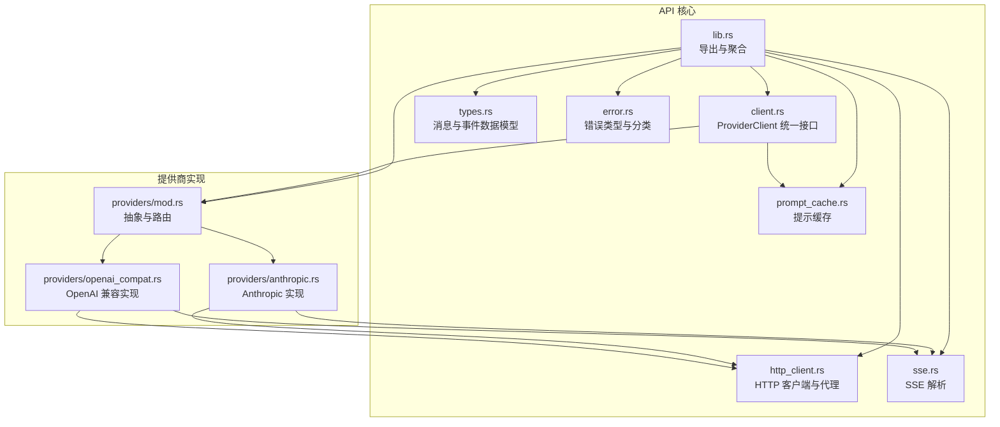
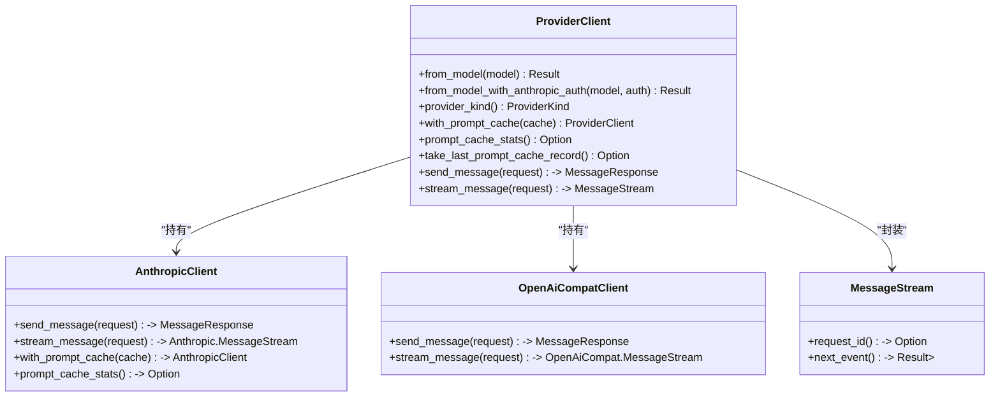
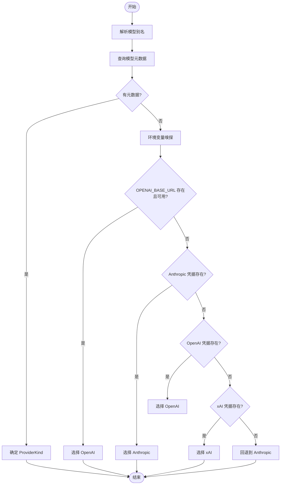
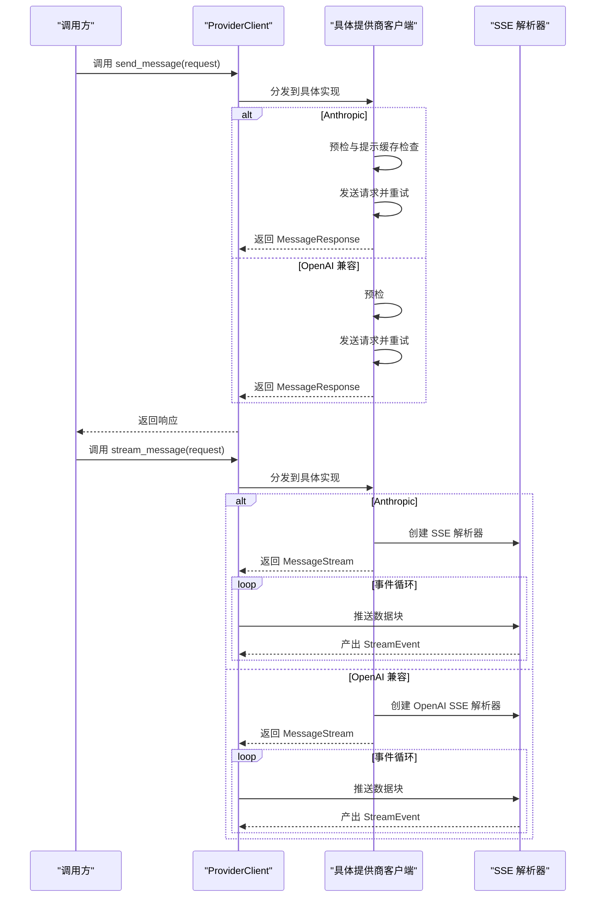
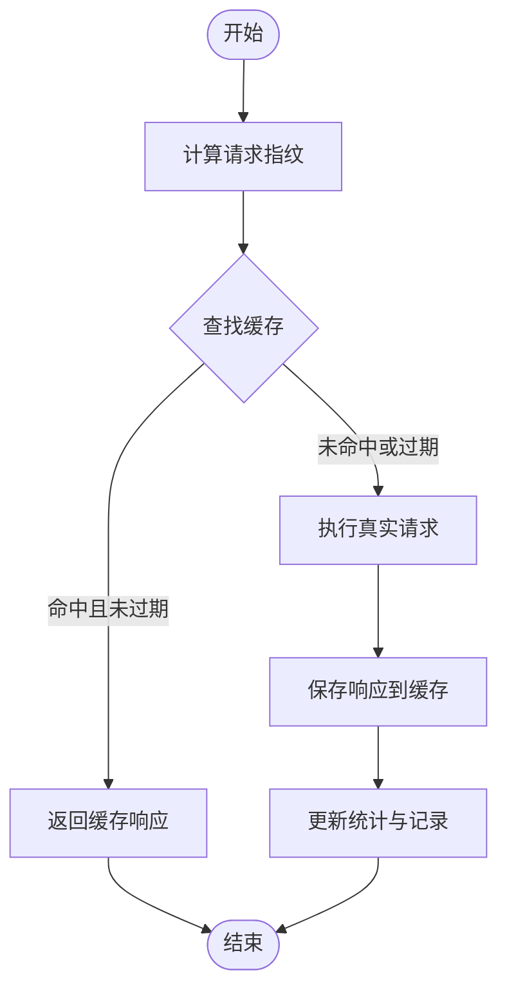
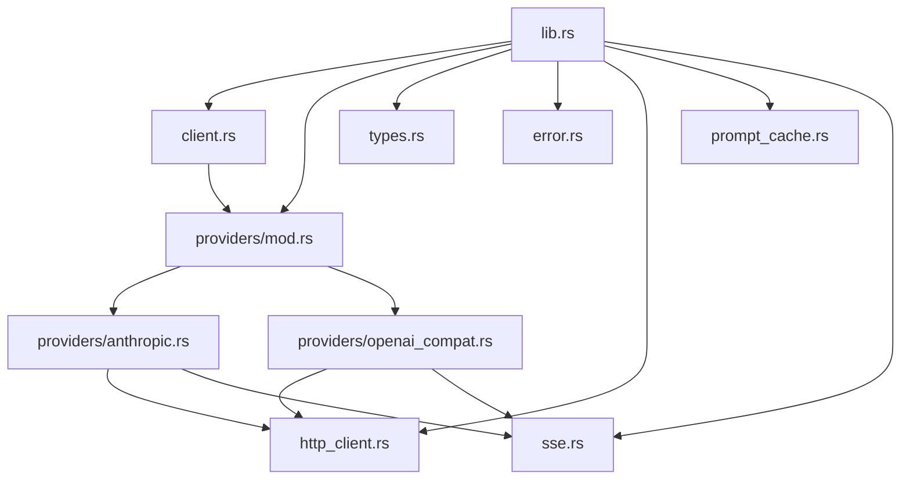

# 提供商客户端架构

<cite>
**本文档引用的文件**
- [lib.rs](file://rust/crates/api/src/lib.rs)
- [client.rs](file://rust/crates/api/src/client.rs)
- [providers/mod.rs](file://rust/crates/api/src/providers/mod.rs)
- [providers/anthropic.rs](file://rust/crates/api/src/providers/anthropic.rs)
- [providers/openai_compat.rs](file://rust/crates/api/src/providers/openai_compat.rs)
- [types.rs](file://rust/crates/api/src/types.rs)
- [prompt_cache.rs](file://rust/crates/api/src/prompt_cache.rs)
- [sse.rs](file://rust/crates/api/src/sse.rs)
- [http_client.rs](file://rust/crates/api/src/http_client.rs)
- [error.rs](file://rust/crates/api/src/error.rs)
- [Cargo.toml](file://rust/crates/api/Cargo.toml)
- [provider_client_integration.rs](file://rust/crates/api/tests/provider_client_integration.rs)
</cite>

## 目录
1. [简介](#简介)
2. [项目结构](#项目结构)
3. [核心组件](#核心组件)
4. [架构总览](#架构总览)
5. [详细组件分析](#详细组件分析)
6. [依赖关系分析](#依赖关系分析)
7. [性能考虑](#性能考虑)
8. [故障排除指南](#故障排除指南)
9. [结论](#结论)
10. [附录](#附录)

## 简介
本文件系统性阐述提供商客户端架构，重点围绕 ProviderClient 枚举的设计模式与统一接口实现，深入解析客户端工厂方法、模型别名解析与提供商检测机制，并详细说明消息发送、流式响应与提示缓存的实现细节。同时，文档对比不同提供商客户端的共同接口与差异化处理，给出客户端初始化、配置管理与资源清理的最佳实践，以及错误处理策略与重试机制的实现指南。

## 项目结构
该模块位于 Rust 工作区的 api crate 中，采用按功能域划分的文件组织方式：
- 核心入口与导出：lib.rs
- 统一客户端与流式封装：client.rs
- 提供商抽象与路由：providers/mod.rs
- 具体提供商实现：providers/anthropic.rs、providers/openai_compat.rs
- 数据类型与事件模型：types.rs
- 提示缓存与统计：prompt_cache.rs
- SSE 解析器：sse.rs
- HTTP 客户端与代理配置：http_client.rs
- 错误类型与分类：error.rs
- 测试用例：tests/provider_client_integration.rs

图表来源
- [lib.rs:1-40](file://rust/crates/api/src/lib.rs#L1-L40)
- [client.rs:1-239](file://rust/crates/api/src/client.rs#L1-L239)
- [providers/mod.rs:1-800](file://rust/crates/api/src/providers/mod.rs#L1-L800)
- [providers/anthropic.rs:1-800](file://rust/crates/api/src/providers/anthropic.rs#L1-L800)
- [providers/openai_compat.rs:1-800](file://rust/crates/api/src/providers/openai_compat.rs#L1-L800)
- [types.rs:1-311](file://rust/crates/api/src/types.rs#L1-L311)
- [prompt_cache.rs:1-736](file://rust/crates/api/src/prompt_cache.rs#L1-L736)
- [sse.rs:1-331](file://rust/crates/api/src/sse.rs#L1-L331)
- [http_client.rs:1-345](file://rust/crates/api/src/http_client.rs#L1-L345)
- [error.rs:1-573](file://rust/crates/api/src/error.rs#L1-L573)

章节来源
- [lib.rs:1-40](file://rust/crates/api/src/lib.rs#L1-L40)
- [client.rs:1-239](file://rust/crates/api/src/client.rs#L1-L239)
- [providers/mod.rs:1-800](file://rust/crates/api/src/providers/mod.rs#L1-L800)

## 核心组件
- ProviderClient 枚举：统一承载 Anthropic、xAI（OpenAI 兼容）与 OpenAI（OpenAI 兼容）三种提供商客户端，提供一致的消息发送与流式接口。
- Provider 抽象：定义 send_message 与 stream_message 的异步接口，确保不同提供商实现遵循统一契约。
- 模型别名解析与提供商检测：通过 resolve_model_alias 与 detect_provider_kind 将用户输入映射到具体提供商与配置。
- 提示缓存：为 Anthropic 客户端提供请求指纹化、命中/写入与缓存失效检测，提升重复请求效率。
- SSE 解析器：统一解析提供商返回的 SSE 帧，生成标准化的 StreamEvent 序列。
- HTTP 客户端与代理：支持标准代理环境变量与统一代理 URL，构建可配置的 reqwest 客户端。
- 错误类型与分类：提供丰富的错误枚举与失败分类，便于区分认证、上下文窗口、传输等不同类型的错误。

章节来源
- [client.rs:8-107](file://rust/crates/api/src/client.rs#L8-L107)
- [providers/mod.rs:16-29](file://rust/crates/api/src/providers/mod.rs#L16-L29)
- [prompt_cache.rs:108-250](file://rust/crates/api/src/prompt_cache.rs#L108-L250)
- [sse.rs:4-80](file://rust/crates/api/src/sse.rs#L4-L80)
- [http_client.rs:14-113](file://rust/crates/api/src/http_client.rs#L14-L113)
- [error.rs:21-66](file://rust/crates/api/src/error.rs#L21-L66)

## 架构总览
ProviderClient 作为统一入口，内部持有具体提供商客户端实例。其工厂方法根据模型名称解析提供商类型，构造对应客户端；统一接口在 send_message 与 stream_message 上体现，分别返回同步响应与流式事件序列。提示缓存仅对 Anthropic 客户端生效，其他提供商不支持。

图表来源
- [client.rs:9-130](file://rust/crates/api/src/client.rs#L9-L130)
- [providers/anthropic.rs:113-125](file://rust/crates/api/src/providers/anthropic.rs#L113-L125)
- [providers/openai_compat.rs:86-95](file://rust/crates/api/src/providers/openai_compat.rs#L86-L95)
- [sse.rs:341-383](file://rust/crates/api/src/sse.rs#L341-L383)

## 详细组件分析

### ProviderClient 统一接口与工厂方法
- 工厂方法
  - from_model：解析模型别名并检测提供商，自动选择 Anthropic、xAI 或 OpenAI 客户端。
  - from_model_with_anthropic_auth：允许显式传入 Anthropic 认证源，绕过环境变量探测。
- 统一接口
  - send_message：发送消息并返回完整响应。
  - stream_message：启动流式会话，返回可迭代的 MessageStream。
  - 提示缓存：仅 Anthropic 支持，通过 with_prompt_cache 注入，支持统计查询与记录提取。
- 枚举分发：内部使用 match 分发至具体提供商实现，保持调用方透明。

章节来源
- [client.rs:16-107](file://rust/crates/api/src/client.rs#L16-L107)
- [client.rs:109-130](file://rust/crates/api/src/client.rs#L109-L130)

### 模型别名解析与提供商检测
- 别名解析 resolve_model_alias：将用户输入的简写（如 "opus"、"sonnet"、"haiku"、"grok" 等）映射为实际模型标识符。
- 元数据解析 metadata_for_model：基于模型前缀与命名空间（如 "openai/"、"qwen/"）确定提供商、认证与基础 URL。
- 提供商检测 detect_provider_kind：优先依据元数据匹配，其次根据环境变量嗅探（OPENAI_BASE_URL、ANTHROPIC_*、OPENAI_*、XAI_*），最后回退到 Anthropic。
- 额外增强：支持 DashScope（阿里云通义千问）兼容模式，通过 "qwen/" 或 "qwen-*" 前缀路由至 OpenAI 兼容客户端，但使用 DashScope 的基础 URL 与认证变量。

图表来源
- [providers/mod.rs:127-151](file://rust/crates/api/src/providers/mod.rs#L127-L151)
- [providers/mod.rs:153-198](file://rust/crates/api/src/providers/mod.rs#L153-L198)
- [providers/mod.rs:200-229](file://rust/crates/api/src/providers/mod.rs#L200-L229)

章节来源
- [providers/mod.rs:127-198](file://rust/crates/api/src/providers/mod.rs#L127-L198)
- [providers/mod.rs:200-229](file://rust/crates/api/src/providers/mod.rs#L200-L229)

### 消息发送与流式响应
- 同步发送 send_message：
  - Anthropic：支持提示缓存命中检查与记录；进行预检（本地字节估算 + 远程计数令牌）；带指数退避重试；解析响应并补充 request_id。
  - OpenAI 兼容：进行预检；带指数退避重试；解析响应并规范化输出字段。
- 流式响应 stream_message：
  - Anthropic：使用 SSE 解析器，逐帧解析并转换为标准化 StreamEvent；支持工具调用与思考内容块的增量事件。
  - OpenAI 兼容：使用 OpenAI SSE 解析器，维护流状态机，生成 MessageStart、ContentBlockStart/Delta/Stop、MessageDelta、MessageStop 等事件。
- 事件消费：MessageStream.next_event 提供异步迭代，内部缓冲与完成态处理。

图表来源
- [client.rs:82-106](file://rust/crates/api/src/client.rs#L82-L106)
- [providers/anthropic.rs:283-337](file://rust/crates/api/src/providers/anthropic.rs#L283-L337)
- [providers/openai_compat.rs:148-197](file://rust/crates/api/src/providers/openai_compat.rs#L148-L197)
- [providers/anthropic.rs:339-359](file://rust/crates/api/src/providers/anthropic.rs#L339-L359)
- [providers/openai_compat.rs:199-215](file://rust/crates/api/src/providers/openai_compat.rs#L199-L215)
- [sse.rs:28-51](file://rust/crates/api/src/sse.rs#L28-L51)

章节来源
- [client.rs:82-106](file://rust/crates/api/src/client.rs#L82-L106)
- [providers/anthropic.rs:283-359](file://rust/crates/api/src/providers/anthropic.rs#L283-L359)
- [providers/openai_compat.rs:148-215](file://rust/crates/api/src/providers/openai_compat.rs#L148-L215)
- [sse.rs:28-80](file://rust/crates/api/src/sse.rs#L28-L80)

### 提示缓存实现细节
- 请求指纹：以模型、system、tools、messages 的稳定哈希组合生成请求指纹，避免不同参数导致的误命中。
- 缓存条目：保存 completion 响应与时间戳，支持版本指纹防止格式变更导致的误用。
- 失效检测：当指纹版本变化、提示指纹变化或超过 TTL 时触发预期或意外的缓存失效事件。
- 统计与记录：记录命中/未命中、写入次数、最近缓存来源与 token 使用情况，支持外部查询与审计。
- 适用范围：当前仅对 Anthropic 客户端生效，其他提供商不支持。

图表来源
- [prompt_cache.rs:144-193](file://rust/crates/api/src/prompt_cache.rs#L144-L193)
- [prompt_cache.rs:209-243](file://rust/crates/api/src/prompt_cache.rs#L209-L243)
- [prompt_cache.rs:314-382](file://rust/crates/api/src/prompt_cache.rs#L314-L382)

章节来源
- [prompt_cache.rs:108-250](file://rust/crates/api/src/prompt_cache.rs#L108-L250)
- [prompt_cache.rs:314-382](file://rust/crates/api/src/prompt_cache.rs#L314-L382)

### 不同提供商客户端的共同接口与差异化处理
- 共同接口：Provider trait 定义 send_message 与 stream_message，所有提供商实现均遵循此契约。
- 差异化处理：
  - Anthropic：支持提示缓存、计数令牌接口、OAuth 交换与刷新、请求追踪与分析事件记录。
  - OpenAI 兼容：支持多种路由前缀（openai/、xai/、grok/、qwen/）、DashScope 兼容模式、工具调用与思考内容块的增量事件。
  - SSE 解析：Anthropic 使用通用 SSE 解析器，OpenAI 兼容使用专用解析器与流状态机。

章节来源
- [providers/mod.rs:16-29](file://rust/crates/api/src/providers/mod.rs#L16-L29)
- [providers/anthropic.rs:777-793](file://rust/crates/api/src/providers/anthropic.rs#L777-L793)
- [providers/openai_compat.rs:323-339](file://rust/crates/api/src/providers/openai_compat.rs#L323-L339)
- [providers/openai_compat.rs:588-586](file://rust/crates/api/src/providers/openai_compat.rs#L588-L586)

### 客户端初始化、配置管理与资源清理最佳实践
- 初始化
  - ProviderClient::from_model：推荐用于大多数场景，自动解析提供商与认证。
  - ProviderClient::from_model_with_anthropic_auth：当需要显式指定 Anthropic 认证或避免环境变量影响时使用。
  - OpenAI 兼容：OpenAiCompatClient::from_env，自动从环境变量读取 API Key 并设置基础 URL。
- 配置管理
  - HTTP 代理：通过 ProxyConfig 读取 HTTP_PROXY/HTTPS_PROXY/NO_PROXY 或统一 proxy_url，构建 reqwest 客户端。
  - 基础 URL：Anthropic 与 OpenAI 兼容客户端均支持 with_base_url 自定义基础 URL，覆盖环境变量。
  - 重试策略：默认指数退避（初始 1s，最大 128s，最多 8 次），可通过 with_retry_policy 调整。
- 资源清理
  - 客户端生命周期：在不再使用时释放底层连接池与缓存句柄；提示缓存持久化在磁盘，注意清理策略与目录权限。
  - 会话追踪：可选 SessionTracer 记录请求与失败信息，便于诊断与审计。

章节来源
- [client.rs:16-47](file://rust/crates/api/src/client.rs#L16-L47)
- [providers/anthropic.rs:113-158](file://rust/crates/api/src/providers/anthropic.rs#L113-L158)
- [providers/openai_compat.rs:86-127](file://rust/crates/api/src/providers/openai_compat.rs#L86-L127)
- [http_client.rs:63-113](file://rust/crates/api/src/http_client.rs#L63-L113)

### 错误处理策略与重试机制
- 错误分类
  - 缺少凭据、上下文窗口超限、OAuth 过期、认证失败、HTTP/IO/JSON 解析错误、API 返回错误、重试耗尽、无效 SSE 帧、退避溢出。
  - is_retryable：根据错误类型判断是否可重试（如网络连接、超时、请求错误或明确标记 retryable 的 API 错误）。
  - safe_failure_class：将错误归类为 provider_auth、context_window、provider_rate_limit、provider_internal、provider_error、provider_transport、runtime_io 等，便于上层策略处理。
- 重试机制
  - 指数退避：初始 1s，最大 128s，最多 8 次；每次退避加入随机抖动，避免全局同步。
  - 失败记录：支持会话追踪记录每次尝试的状态与错误详情。
- 上下文窗口预检
  - 本地字节估算先行，再结合远程计数令牌接口进行细化校验，避免超限请求进入网络往返。

章节来源
- [error.rs:21-66](file://rust/crates/api/src/error.rs#L21-L66)
- [error.rs:118-134](file://rust/crates/api/src/error.rs#L118-L134)
- [error.rs:154-176](file://rust/crates/api/src/error.rs#L154-L176)
- [providers/anthropic.rs:401-464](file://rust/crates/api/src/providers/anthropic.rs#L401-L464)
- [providers/openai_compat.rs:217-246](file://rust/crates/api/src/providers/openai_compat.rs#L217-L246)
- [providers/mod.rs:274-292](file://rust/crates/api/src/providers/mod.rs#L274-L292)

## 依赖关系分析
- 内部依赖
  - lib.rs 导出各模块的公共 API，形成统一入口。
  - client.rs 依赖 providers/mod.rs 的抽象与路由逻辑，依赖 types.rs 的数据模型，依赖 prompt_cache.rs 的缓存能力。
  - providers/anthropic.rs 与 providers/openai_compat.rs 分别依赖 http_client.rs 构建 HTTP 客户端，依赖 sse.rs 进行流式解析。
- 外部依赖
  - reqwest（rustls TLS）、serde/serde_json、tokio、runtime、telemetry。

图表来源
- [lib.rs:9-39](file://rust/crates/api/src/lib.rs#L9-L39)
- [Cargo.toml:8-14](file://rust/crates/api/Cargo.toml#L8-L14)

章节来源
- [lib.rs:9-39](file://rust/crates/api/src/lib.rs#L9-L39)
- [Cargo.toml:8-14](file://rust/crates/api/Cargo.toml#L8-L14)

## 性能考虑
- 指数退避与抖动：降低并发重试的全局同步风险，提高整体吞吐稳定性。
- 本地预检：在发送请求前进行上下文窗口估算，减少无效网络往返。
- 提示缓存：对重复请求显著降低延迟与成本，需合理设置 TTL 与最小断开阈值。
- SSE 流式解析：按块解析，避免一次性加载大响应，降低内存峰值。
- 代理配置：统一代理 URL 可简化网络路径，减少多协议代理配置复杂度。

## 故障排除指南
- 缺少凭据
  - 现象：MissingCredentials 错误。
  - 处理：检查对应提供商的环境变量（ANTHROPIC_*、OPENAI_*、XAI_*、DASHSCOPE_*），或使用 ProviderClient::from_model_with_anthropic_auth 显式注入认证。
- 上下文窗口超限
  - 现象：ContextWindowExceeded 错误。
  - 处理：缩短消息长度、减少 max_tokens、压缩系统提示或工具定义。
- 重试耗尽
  - 现象：RetriesExhausted 包装底层错误。
  - 处理：检查网络连通性、代理配置、API Key 有效性；查看 safe_failure_class 与 is_retryable 判断是否可重试。
- SSE 解析失败
  - 现象：InvalidSseFrame 错误。
  - 处理：确认上游返回格式符合 SSE 规范，检查数据块拼接与帧边界。
- OAuth 过期
  - 现象：ExpiredOAuthToken 错误。
  - 处理：使用 refresh_oauth_token 获取新令牌并保存。

章节来源
- [error.rs:231-329](file://rust/crates/api/src/error.rs#L231-L329)
- [error.rs:154-176](file://rust/crates/api/src/error.rs#L154-L176)
- [providers/anthropic.rs:361-399](file://rust/crates/api/src/providers/anthropic.rs#L361-L399)

## 结论
该提供商客户端架构通过 ProviderClient 统一入口与 Provider 抽象实现了跨提供商的一致体验。借助模型别名解析与提供商检测，系统能够智能路由到正确的后端；通过提示缓存与指数退避重试，兼顾性能与可靠性；通过标准化的 SSE 解析与事件模型，统一了流式响应的消费体验。配合完善的错误分类与诊断能力，为生产级应用提供了稳健的基础设施。

## 附录
- 测试参考：provider_client_integration.rs 展示了模型别名路由、凭据缺失与显式认证注入的行为验证。
- 类型与事件：types.rs 定义了消息请求/响应、工具定义、流事件等核心数据结构，确保跨提供商的数据一致性。

章节来源
- [provider_client_integration.rs:6-56](file://rust/crates/api/tests/provider_client_integration.rs#L6-L56)
- [types.rs:5-311](file://rust/crates/api/src/types.rs#L5-L311)