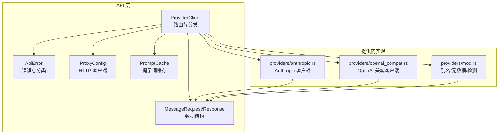
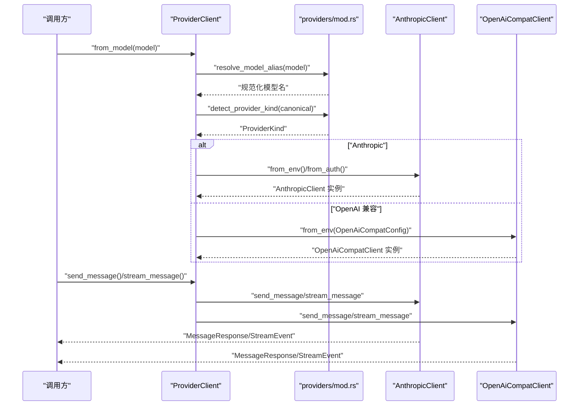
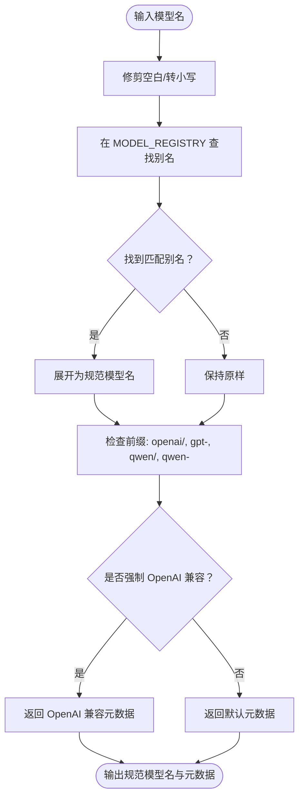
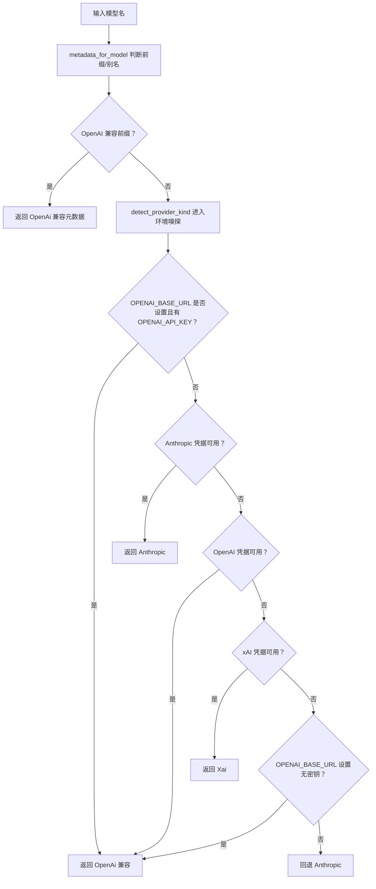
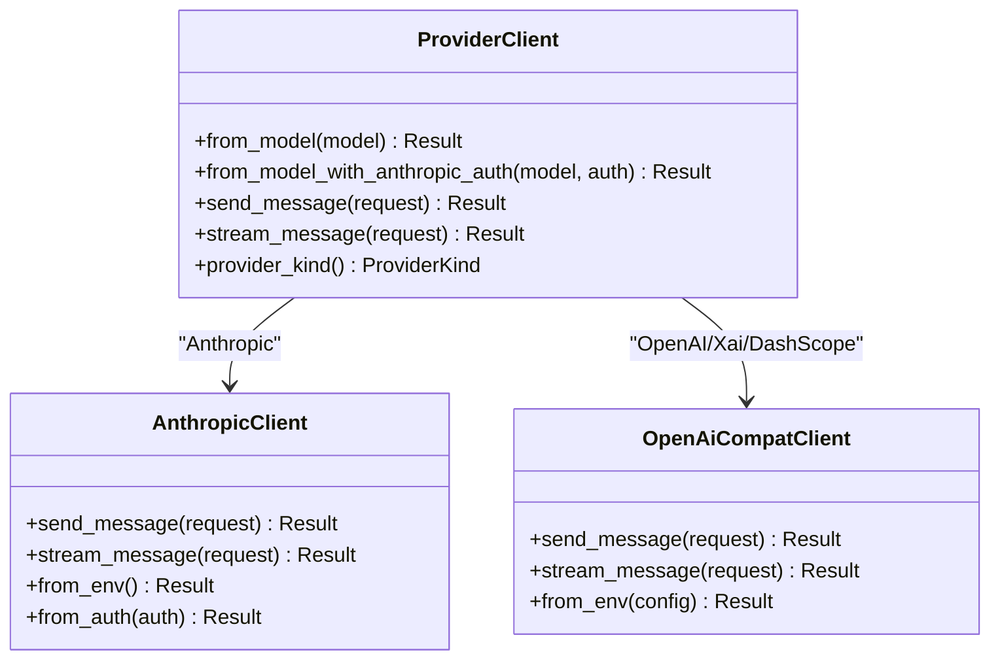
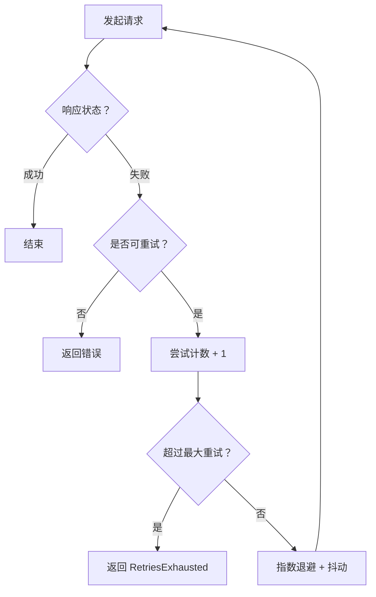
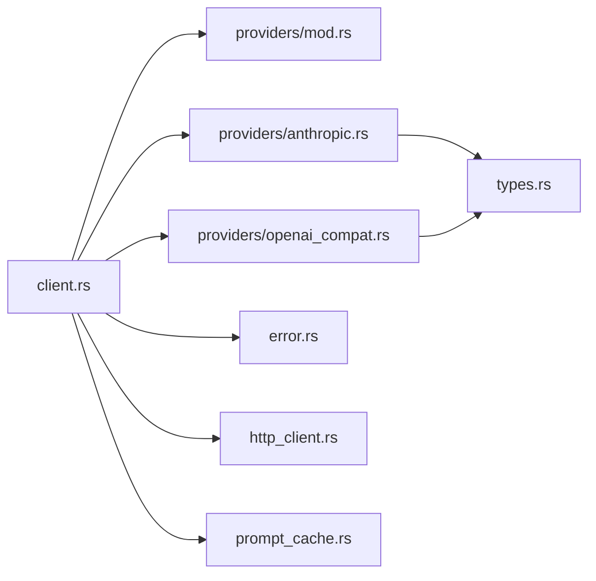

# 提供商路由与选择

<cite>
**本文引用的文件**
- [rust/crates/api/src/providers/mod.rs](file://rust/crates/api/src/providers/mod.rs)
- [rust/crates/api/src/providers/anthropic.rs](file://rust/crates/api/src/providers/anthropic.rs)
- [rust/crates/api/src/providers/openai_compat.rs](file://rust/crates/api/src/providers/openai_compat.rs)
- [rust/crates/api/src/client.rs](file://rust/crates/api/src/client.rs)
- [rust/crates/api/src/types.rs](file://rust/crates/api/src/types.rs)
- [rust/crates/api/src/error.rs](file://rust/crates/api/src/error.rs)
- [rust/crates/api/src/http_client.rs](file://rust/crates/api/src/http_client.rs)
- [rust/crates/api/src/prompt_cache.rs](file://rust/crates/api/src/prompt_cache.rs)
- [rust/crates/api/src/lib.rs](file://rust/crates/api/src/lib.rs)
- [ROADMAP.md](file://ROADMAP.md)
</cite>

## 目录
1. [简介](#简介)
2. [项目结构](#项目结构)
3. [核心组件](#核心组件)
4. [架构总览](#架构总览)
5. [详细组件分析](#详细组件分析)
6. [依赖关系分析](#依赖关系分析)
7. [性能考量](#性能考量)
8. [故障排除指南](#故障排除指南)
9. [结论](#结论)
10. [附录](#附录)

## 简介
本文件系统化阐述“提供商路由与选择”机制，覆盖以下主题：
- 模型别名解析与元数据管理
- 提供商检测与自动路由
- 提供商优先级、重试退避与故障提示
- 环境变量配置与运行时选择逻辑
- 提供商切换、降级处理与性能监控
- 路由配置、调试工具与故障排除
- 新模型支持与提供商扩展的开发流程

该机制在 Rust 子工程中通过统一的 Provider 抽象、模型别名表、元数据与检测函数，以及 OpenAI 兼容层与 Anthropic 客户端共同实现。

## 项目结构
围绕“提供商路由与选择”的核心模块如下：
- providers/mod.rs：定义 Provider 抽象、模型别名注册表、元数据与检测逻辑
- providers/anthropic.rs：Anthropic 客户端与认证源解析
- providers/openai_compat.rs：OpenAI 兼容客户端（含 xAI、DashScope）
- client.rs：ProviderClient 统一路由与分发
- types.rs：消息请求/响应与流事件的数据结构
- error.rs：错误类型与分类、可重试性判定
- http_client.rs：代理配置与 HTTP 客户端构建
- prompt_cache.rs：提示词缓存与命中统计
- lib.rs：对外公开 API

图表来源
- [rust/crates/api/src/client.rs:16-106](file://rust/crates/api/src/client.rs#L16-L106)
- [rust/crates/api/src/providers/mod.rs:17-229](file://rust/crates/api/src/providers/mod.rs#L17-L229)
- [rust/crates/api/src/providers/anthropic.rs:114-125](file://rust/crates/api/src/providers/anthropic.rs#L114-L125)
- [rust/crates/api/src/providers/openai_compat.rs:87-95](file://rust/crates/api/src/providers/openai_compat.rs#L87-L95)
- [rust/crates/api/src/types.rs:5-34](file://rust/crates/api/src/types.rs#L5-L34)
- [rust/crates/api/src/error.rs:21-66](file://rust/crates/api/src/error.rs#L21-L66)
- [rust/crates/api/src/http_client.rs:14-58](file://rust/crates/api/src/http_client.rs#L14-L58)
- [rust/crates/api/src/prompt_cache.rs:109-132](file://rust/crates/api/src/prompt_cache.rs#L109-L132)

章节来源
- [rust/crates/api/src/lib.rs:9-39](file://rust/crates/api/src/lib.rs#L9-L39)

## 核心组件
- Provider 抽象与枚举
  - Provider trait 定义发送与流式接口；ProviderKind 枚举区分 Anthropic、Xai、OpenAi
- 模型别名与元数据
  - MODEL_REGISTRY 注册常见别名到 ProviderMetadata；resolve_model_alias 做别名展开
  - metadata_for_model 根据别名返回提供商元信息（含认证与默认 Base URL）
- 提供商检测
  - detect_provider_kind 优先从模型前缀判断，其次依据环境变量与本地配置
- ProviderClient
  - 根据模型与认证源选择具体客户端实例（Anthropic 或 OpenAI 兼容）
- 错误体系
  - ApiError 分类与可重试性判定，便于退避与降级
- 重试与退避
  - 指数退避 + 随机抖动，支持最大重试次数与溢出保护
- 代理与网络
  - ProxyConfig 支持 HTTP/HTTPS/NO_PROXY，统一或按协议代理
- 提示词缓存
  - PromptCache 对完成结果进行指纹化缓存与命中统计

章节来源
- [rust/crates/api/src/providers/mod.rs:17-229](file://rust/crates/api/src/providers/mod.rs#L17-L229)
- [rust/crates/api/src/providers/anthropic.rs:114-125](file://rust/crates/api/src/providers/anthropic.rs#L114-L125)
- [rust/crates/api/src/providers/openai_compat.rs:87-95](file://rust/crates/api/src/providers/openai_compat.rs#L87-L95)
- [rust/crates/api/src/client.rs:16-106](file://rust/crates/api/src/client.rs#L16-L106)
- [rust/crates/api/src/error.rs:21-134](file://rust/crates/api/src/error.rs#L21-L134)
- [rust/crates/api/src/http_client.rs:14-113](file://rust/crates/api/src/http_client.rs#L14-L113)
- [rust/crates/api/src/prompt_cache.rs:109-250](file://rust/crates/api/src/prompt_cache.rs#L109-L250)

## 架构总览
下图展示从模型名称到最终调用提供商的完整路径，包括别名解析、元数据查询、提供商检测与客户端选择。

图表来源
- [rust/crates/api/src/client.rs:17-46](file://rust/crates/api/src/client.rs#L17-L46)
- [rust/crates/api/src/providers/mod.rs:128-229](file://rust/crates/api/src/providers/mod.rs#L128-L229)
- [rust/crates/api/src/providers/anthropic.rs:160-162](file://rust/crates/api/src/providers/anthropic.rs#L160-L162)
- [rust/crates/api/src/providers/openai_compat.rs:119-127](file://rust/crates/api/src/providers/openai_compat.rs#L119-L127)

## 详细组件分析

### 模型别名解析与元数据管理
- 别名注册表
  - MODEL_REGISTRY 将常见别名映射为 ProviderMetadata，包含提供商类型、认证环境变量、Base URL 环境变量与默认 Base URL
- 别名展开
  - resolve_model_alias 对输入进行修剪与小写化，并根据注册表展开为规范模型名；对特定提供商（如 Grok）做聚合别名处理
- 元数据查询
  - metadata_for_model 返回 ProviderMetadata；当模型以 openai/、gpt- 开头或 qwen/、qwen- 前缀时，强制路由到 OpenAI 兼容层（即使其他提供商凭据存在）
- 上下文窗口与令牌上限
  - model_token_limit 提供已知模型的上下文窗口与输出令牌上限；max_tokens_for_model/max_tokens_for_model_with_override 用于预检与覆盖

图表来源
- [rust/crates/api/src/providers/mod.rs:52-198](file://rust/crates/api/src/providers/mod.rs#L52-L198)
- [rust/crates/api/src/providers/mod.rs:232-272](file://rust/crates/api/src/providers/mod.rs#L232-L272)

章节来源
- [rust/crates/api/src/providers/mod.rs:52-198](file://rust/crates/api/src/providers/mod.rs#L52-L198)
- [rust/crates/api/src/providers/mod.rs:232-272](file://rust/crates/api/src/providers/mod.rs#L232-L272)

### 提供商检测与自动路由
- 优先级顺序
  - 1) 模型前缀：openai/、gpt-、qwen/、qwen- 强制 OpenAI 兼容
  - 2) 已知别名：通过 MODEL_REGISTRY 映射
  - 3) 环境变量：OPENAI_BASE_URL 优先于 Anthropic 凭据
  - 4) 认证嗅探：Anthropic → OpenAI → xAI → 最后回退
- 特殊场景
  - DashScope（阿里通义千问）通过 qwen 前缀路由至 OpenAI 兼容客户端，但使用 DashScope 的 Base URL 与凭据键
  - 本地兼容端点（如 Ollama、LM Studio、vLLM）可通过 OPENAI_BASE_URL 指向非官方端点，且无需密钥

图表来源
- [rust/crates/api/src/providers/mod.rs:200-229](file://rust/crates/api/src/providers/mod.rs#L200-L229)
- [rust/crates/api/src/providers/openai_compat.rs:61-73](file://rust/crates/api/src/providers/openai_compat.rs#L61-L73)

章节来源
- [rust/crates/api/src/providers/mod.rs:200-229](file://rust/crates/api/src/providers/mod.rs#L200-L229)
- [ROADMAP.md:495-496](file://ROADMAP.md#L495-L496)

### ProviderClient 路由与选择
- ProviderClient::from_model
  - 解析模型别名 → 检测提供商 → 选择具体客户端（AnthropicClient 或 OpenAiCompatClient）
  - 对 DashScope 模型，基于 metadata_for_model 的 auth_env 决定使用 OpenAiCompatConfig::dashscope
- ProviderClient::from_model_with_anthropic_auth
  - 允许显式传入 Anthropic 认证源，绕过环境变量
- 流式与同步调用
  - send_message 与 stream_message 统一转发至对应提供商客户端

图表来源
- [rust/crates/api/src/client.rs:16-106](file://rust/crates/api/src/client.rs#L16-L106)
- [rust/crates/api/src/providers/anthropic.rs:160-162](file://rust/crates/api/src/providers/anthropic.rs#L160-L162)
- [rust/crates/api/src/providers/openai_compat.rs:119-127](file://rust/crates/api/src/providers/openai_compat.rs#L119-L127)

章节来源
- [rust/crates/api/src/client.rs:16-106](file://rust/crates/api/src/client.rs#L16-L106)

### 重试、退避与故障提示
- 指数退避与抖动
  - 默认初始退避 1 秒，最大 128 秒，最多 8 次重试；每次尝试指数增长并叠加随机抖动，避免全局同步
- 可重试性判定
  - ApiError::is_retryable 基于错误类型（连接/超时/请求失败等）决定是否重试
- 失败分类与追踪
  - safe_failure_class 将错误归类为 provider_auth、context_window、provider_rate_limit、provider_internal、provider_transport、runtime_io 等
- 认证提示
  - 当 Anthropic 凭据缺失时，若检测到其他提供商凭据，会生成带修复建议的提示，指导用户使用前缀路由

图表来源
- [rust/crates/api/src/providers/anthropic.rs:401-464](file://rust/crates/api/src/providers/anthropic.rs#L401-L464)
- [rust/crates/api/src/providers/openai_compat.rs:217-246](file://rust/crates/api/src/providers/openai_compat.rs#L217-L246)
- [rust/crates/api/src/error.rs:118-134](file://rust/crates/api/src/error.rs#L118-L134)

章节来源
- [rust/crates/api/src/providers/anthropic.rs:401-464](file://rust/crates/api/src/providers/anthropic.rs#L401-L464)
- [rust/crates/api/src/providers/openai_compat.rs:217-246](file://rust/crates/api/src/providers/openai_compat.rs#L217-L246)
- [rust/crates/api/src/error.rs:118-134](file://rust/crates/api/src/error.rs#L118-L134)

### 环境变量配置与运行时选择
- Anthropic
  - ANTHROPIC_API_KEY / ANTHROPIC_AUTH_TOKEN；可从 .env 文件加载
  - ANTHROPIC_BASE_URL 覆盖默认 API 域名
- OpenAI 兼容
  - OPENAI_API_KEY；OPENAI_BASE_URL 指向兼容端点（含本地服务）
- xAI
  - XAI_API_KEY；XAI_BASE_URL
- DashScope（Qwen）
  - DASHSCOPE_API_KEY；DASHSCOPE_BASE_URL
- 代理
  - HTTP_PROXY/HTTPS_PROXY/NO_PROXY（大小写均可）；或统一 ProxyConfig::from_proxy_url

章节来源
- [rust/crates/api/src/providers/anthropic.rs:44-56](file://rust/crates/api/src/providers/anthropic.rs#L44-L56)
- [rust/crates/api/src/providers/openai_compat.rs:19-26](file://rust/crates/api/src/providers/openai_compat.rs#L19-L26)
- [rust/crates/api/src/http_client.rs:14-58](file://rust/crates/api/src/http_client.rs#L14-L58)

### 提供商切换、降级与性能监控
- 切换策略
  - 通过模型前缀或环境变量强制切换；ProviderClient 在构造阶段即确定提供商类型
- 降级处理
  - OPENAI_BASE_URL 即使无密钥也可作为最后兜底（常用于本地兼容端点）
- 性能监控
  - AnthropicClient 支持 SessionTracer 记录请求指标；PromptCache 统计命中/未命中与缓存读取令牌
  - Usage.estimated_cost_usd 结合模型定价估算成本

章节来源
- [rust/crates/api/src/providers/anthropic.rs:314-335](file://rust/crates/api/src/providers/anthropic.rs#L314-L335)
- [rust/crates/api/src/prompt_cache.rs:75-91](file://rust/crates/api/src/prompt_cache.rs#L75-L91)
- [rust/crates/api/src/types.rs:198-206](file://rust/crates/api/src/types.rs#L198-L206)

## 依赖关系分析
- ProviderClient 依赖 providers/mod.rs 的别名与检测逻辑
- AnthropicClient 与 OpenAiCompatClient 均实现 Provider trait
- 错误分类与可重试性由 error.rs 统一提供
- HTTP 代理由 http_client.rs 提供
- 数据结构由 types.rs 提供
- PromptCache 仅在 Anthropic 路径启用

图表来源
- [rust/crates/api/src/client.rs:1-14](file://rust/crates/api/src/client.rs#L1-L14)
- [rust/crates/api/src/providers/mod.rs:1-14](file://rust/crates/api/src/providers/mod.rs#L1-L14)
- [rust/crates/api/src/providers/anthropic.rs:1-23](file://rust/crates/api/src/providers/anthropic.rs#L1-L23)
- [rust/crates/api/src/providers/openai_compat.rs:1-17](file://rust/crates/api/src/providers/openai_compat.rs#L1-L17)
- [rust/crates/api/src/types.rs:1-4](file://rust/crates/api/src/types.rs#L1-L4)
- [rust/crates/api/src/error.rs:1-4](file://rust/crates/api/src/error.rs#L1-L4)
- [rust/crates/api/src/http_client.rs:1-5](file://rust/crates/api/src/http_client.rs#L1-L5)
- [rust/crates/api/src/prompt_cache.rs:1-8](file://rust/crates/api/src/prompt_cache.rs#L1-L8)

章节来源
- [rust/crates/api/src/lib.rs:9-39](file://rust/crates/api/src/lib.rs#L9-L39)

## 性能考量
- 重试退避
  - 指数增长 + 抖动降低全局同步与雪崩风险
- 预检与上下文窗口
  - preflight_message_request 基于字节估算与远程计数结合，提前拒绝超限请求
- 缓存
  - PromptCache 对完成结果进行指纹化缓存，显著减少重复请求
- 代理与网络
  - ProxyConfig 支持统一或按协议代理，避免首包阻塞

章节来源
- [rust/crates/api/src/providers/mod.rs:274-292](file://rust/crates/api/src/providers/mod.rs#L274-L292)
- [rust/crates/api/src/prompt_cache.rs:144-193](file://rust/crates/api/src/prompt_cache.rs#L144-L193)
- [rust/crates/api/src/http_client.rs:83-113](file://rust/crates/api/src/http_client.rs#L83-L113)

## 故障排除指南
- 缺少凭据
  - Anthropic：若检测到其他提供商凭据，会给出前缀路由修复建议
  - OpenAI/xAI/DashScope：直接提示缺少对应凭据
- 上下文窗口超限
  - preflight 会拒绝超出上下文窗口的请求，并给出估算值
- 代理问题
  - 检查 HTTP_PROXY/HTTPS_PROXY/NO_PROXY；必要时使用 ProxyConfig::from_proxy_url
- 本地兼容端点
  - 设置 OPENAI_BASE_URL 指向本地服务（如 Ollama），无需密钥
- 错误分类
  - 使用 safe_failure_class 快速定位错误类别（认证、速率限制、内部错误等）

章节来源
- [rust/crates/api/src/providers/mod.rs:349-373](file://rust/crates/api/src/providers/mod.rs#L349-L373)
- [rust/crates/api/src/providers/mod.rs:274-292](file://rust/crates/api/src/providers/mod.rs#L274-L292)
- [rust/crates/api/src/error.rs:154-176](file://rust/crates/api/src/error.rs#L154-L176)
- [rust/crates/api/src/http_client.rs:83-113](file://rust/crates/api/src/http_client.rs#L83-L113)
- [ROADMAP.md:495-496](file://ROADMAP.md#L495-L496)

## 结论
该路由与选择机制通过“模型别名 + 元数据 + 检测优先级”的组合，实现了稳定、可扩展且对用户友好的提供商自动路由。配合统一的错误分类、可重试性判定、代理支持与提示词缓存，既保证了可靠性，也兼顾了性能与可观测性。对于新模型与新提供商的扩展，遵循“前缀路由优先、元数据注册、凭据隔离”的原则即可快速集成。

## 附录

### 路由配置清单
- 模型前缀
  - openai/、gpt- → OpenAI 兼容
  - qwen/、qwen- → DashScope（OpenAI 兼容形态）
- 环境变量
  - Anthropic：ANTHROPIC_API_KEY、ANTHROPIC_AUTH_TOKEN、ANTHROPIC_BASE_URL
  - OpenAI：OPENAI_API_KEY、OPENAI_BASE_URL
  - xAI：XAI_API_KEY、XAI_BASE_URL
  - DashScope：DASHSCOPE_API_KEY、DASHSCOPE_BASE_URL
- 代理
  - HTTP_PROXY/HTTPS_PROXY/NO_PROXY（大小写均可）或 ProxyConfig::from_proxy_url

章节来源
- [rust/crates/api/src/providers/mod.rs:176-196](file://rust/crates/api/src/providers/mod.rs#L176-L196)
- [rust/crates/api/src/providers/anthropic.rs:44-56](file://rust/crates/api/src/providers/anthropic.rs#L44-L56)
- [rust/crates/api/src/providers/openai_compat.rs:19-26](file://rust/crates/api/src/providers/openai_compat.rs#L19-L26)
- [rust/crates/api/src/http_client.rs:14-58](file://rust/crates/api/src/http_client.rs#L14-L58)

### 新模型支持与提供商扩展流程
- 新模型别名
  - 在 MODEL_REGISTRY 中注册别名与 ProviderMetadata
- 前缀路由
  - 若模型属于新提供商，建议使用前缀（如 newai/model）以确保正确路由
- 凭据与 Base URL
  - 为新提供商新增 OpenAiCompatConfig 或在 Anthropic 客户端中添加凭据解析
- 测试与回归
  - 添加单元测试覆盖别名展开、元数据查询与 ProviderClient 选择逻辑
- 参考变更
  - DashScope 路由修正、OPENAI_BASE_URL 回退策略等历史变更可作为参考

章节来源
- [rust/crates/api/src/providers/mod.rs:52-125](file://rust/crates/api/src/providers/mod.rs#L52-L125)
- [rust/crates/api/src/providers/openai_compat.rs:40-84](file://rust/crates/api/src/providers/openai_compat.rs#L40-L84)
- [ROADMAP.md:421-423](file://ROADMAP.md#L421-L423)
- [ROADMAP.md:495-496](file://ROADMAP.md#L495-L496)