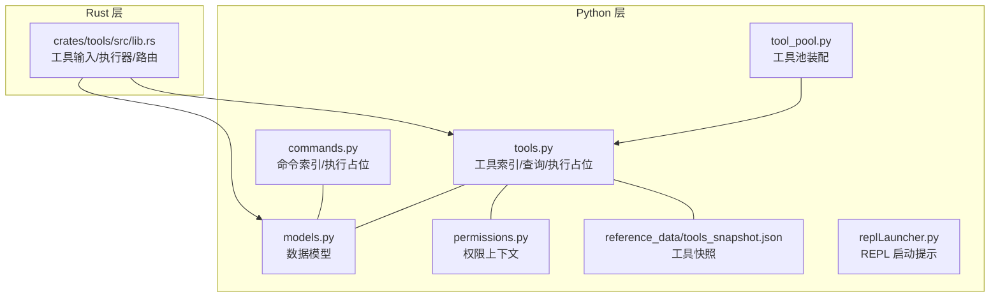
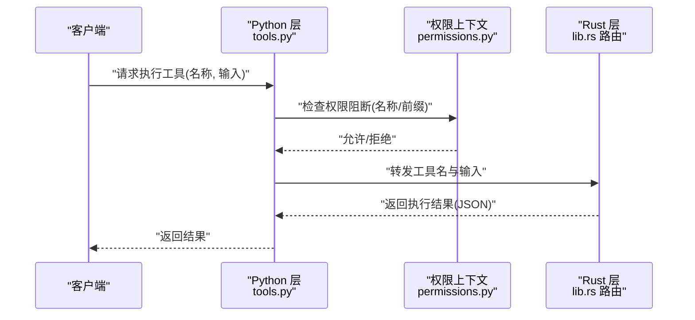
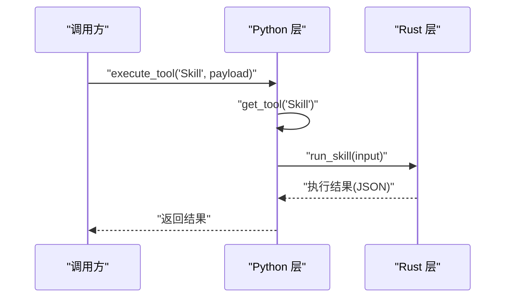
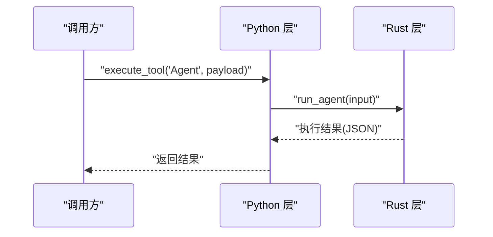
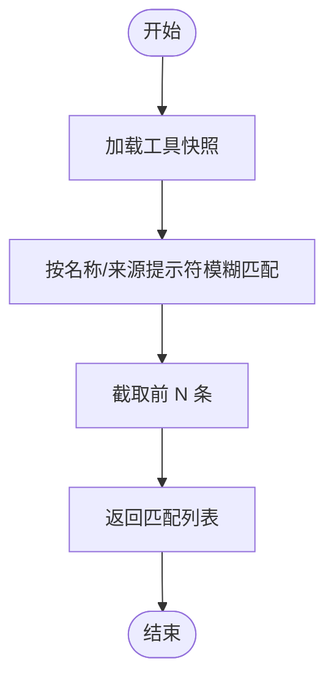
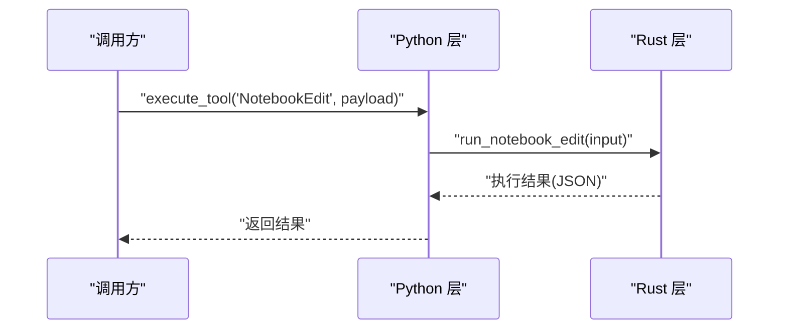
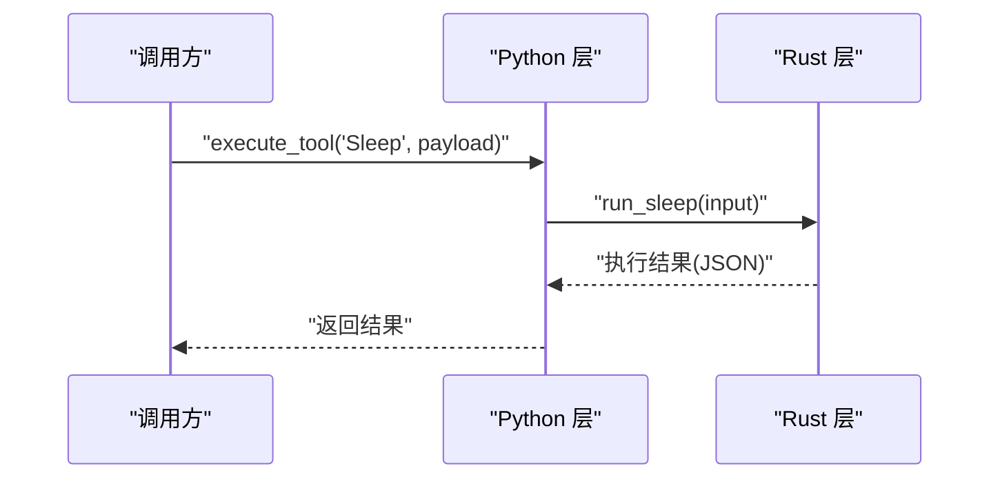
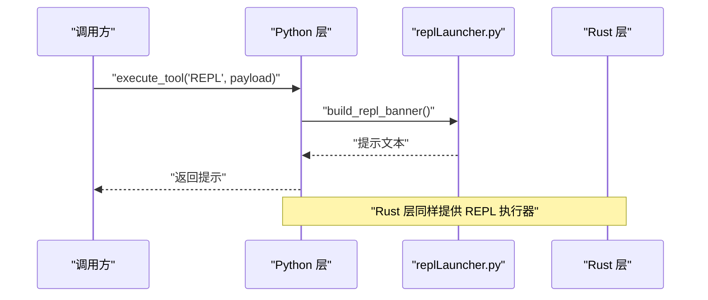
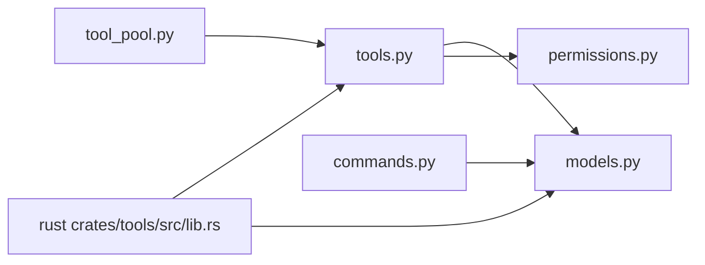

# 专用工具

<cite>
**本文引用的文件**
- [src/tools.py](file://src/tools.py)
- [src/tool_pool.py](file://src/tool_pool.py)
- [src/models.py](file://src/models.py)
- [src/permissions.py](file://src/permissions.py)
- [src/reference_data/tools_snapshot.json](file://src/reference_data/tools_snapshot.json)
- [src/commands.py](file://src/commands.py)
- [src/replLauncher.py](file://src/replLauncher.py)
- [rust/crates/tools/src/lib.rs](file://rust/crates/tools/src/lib.rs)
</cite>

## 目录
1. [简介](#简介)
2. [项目结构](#项目结构)
3. [核心组件](#核心组件)
4. [架构总览](#架构总览)
5. [详细组件分析](#详细组件分析)
6. [依赖分析](#依赖分析)
7. [性能考虑](#性能考虑)
8. [故障排查指南](#故障排查指南)
9. [结论](#结论)
10. [附录](#附录)

## 简介
本文件面向“专用工具”的使用与实现，聚焦以下工具：Skill（加载本地技能定义）、Agent（启动专业代理任务）、ToolSearch（搜索工具）、NotebookEdit（编辑 Jupyter 笔记本）、Sleep（等待指定时间）、REPL（代码 REPL 执行）。文档从系统架构、数据模型、处理流程、权限控制、错误处理与性能优化等维度进行深入解析，并提供参数说明、使用示例与最佳实践，帮助读者快速上手并安全高效地使用这些工具。

## 项目结构
专用工具能力由两部分协同实现：
- Python 层：工具索引、权限过滤、工具池装配、命令索引与执行占位逻辑。
- Rust 层：具体工具的输入规范、执行器与运行时实现（如 Skill、Agent、ToolSearch、NotebookEdit、Sleep、REPL）。

图表来源
- [src/tools.py:1-97](file://src/tools.py#L1-L97)
- [src/tool_pool.py:1-38](file://src/tool_pool.py#L1-L38)
- [src/models.py:1-50](file://src/models.py#L1-L50)
- [src/permissions.py:1-21](file://src/permissions.py#L1-L21)
- [src/reference_data/tools_snapshot.json:1-800](file://src/reference_data/tools_snapshot.json#L1-L800)
- [src/commands.py:1-91](file://src/commands.py#L1-L91)
- [src/replLauncher.py:1-6](file://src/replLauncher.py#L1-L6)
- [rust/crates/tools/src/lib.rs:2109-2308](file://rust/crates/tools/src/lib.rs#L2109-L2308)

章节来源
- [src/tools.py:1-97](file://src/tools.py#L1-L97)
- [src/tool_pool.py:1-38](file://src/tool_pool.py#L1-L38)
- [src/models.py:1-50](file://src/models.py#L1-L50)
- [src/permissions.py:1-21](file://src/permissions.py#L1-L21)
- [src/reference_data/tools_snapshot.json:1-800](file://src/reference_data/tools_snapshot.json#L1-L800)
- [src/commands.py:1-91](file://src/commands.py#L1-L91)
- [src/replLauncher.py:1-6](file://src/replLauncher.py#L1-L6)
- [rust/crates/tools/src/lib.rs:2109-2308](file://rust/crates/tools/src/lib.rs#L2109-L2308)

## 核心组件
- 工具索引与查询
  - 通过工具快照构建工具集合，支持按名称、来源提示符模糊匹配与权限过滤。
- 工具池装配
  - 基于简单模式、是否包含 MCP 工具以及权限上下文生成可渲染的工具池。
- 数据模型
  - PortingModule、PortingBacklog、ToolPermissionContext 等用于描述工具元信息与权限控制。
- 命令索引与执行占位
  - 提供命令索引、过滤与执行占位，便于统一管理命令与工具。
- REPL 启动提示
  - 当前 Python 端 REPL 尚未交互化，提供替代指引。

章节来源
- [src/tools.py:23-97](file://src/tools.py#L23-L97)
- [src/tool_pool.py:28-38](file://src/tool_pool.py#L28-L38)
- [src/models.py:14-50](file://src/models.py#L14-L50)
- [src/commands.py:22-91](file://src/commands.py#L22-L91)
- [src/replLauncher.py:4-6](file://src/replLauncher.py#L4-L6)

## 架构总览
专用工具的调用链路如下：客户端或上层模块发起工具请求 → Python 层进行权限与过滤 → Rust 层根据工具名路由到对应执行器 → 返回结构化结果。

图表来源
- [src/tools.py:62-87](file://src/tools.py#L62-L87)
- [src/permissions.py:18-21](file://src/permissions.py#L18-L21)
- [rust/crates/tools/src/lib.rs:2109-2151](file://rust/crates/tools/src/lib.rs#L2109-L2151)

## 详细组件分析

### Skill（加载本地技能定义）
- 功能概述
  - 接收技能名称与可选参数，交由 Rust 层执行器完成技能加载与执行。
- 参数说明
  - skill: 技能标识字符串（必填）
  - args: JSON 字符串形式的参数（可选）
- 使用示例
  - 在上层工作流中构造输入对象后调用工具执行；返回值为结构化 JSON 字符串。
- 最佳实践
  - 严格校验技能名称与参数格式，避免注入风险；结合权限上下文限制敏感技能。
- 错误处理
  - 若工具名不在已知集合中，Python 层会返回“未知工具”消息；Rust 层对输入进行反序列化校验并抛出语义化错误。

图表来源
- [src/tools.py:81-87](file://src/tools.py#L81-L87)
- [rust/crates/tools/src/lib.rs:2109-2111](file://rust/crates/tools/src/lib.rs#L2109-L2111)

章节来源
- [src/tools.py:81-87](file://src/tools.py#L81-L87)
- [rust/crates/tools/src/lib.rs:2300-2303](file://rust/crates/tools/src/lib.rs#L2300-L2303)

### Agent（启动专业代理任务）
- 功能概述
  - 根据描述与提示词启动代理任务，Rust 层负责任务调度与执行。
- 参数说明
  - description: 任务描述（必填，非空）
  - prompt: 具体指令（必填，非空）
- 使用示例
  - 组装输入对象后调用工具；若描述或提示为空，Rust 层会拒绝执行并返回明确错误。
- 最佳实践
  - 描述与提示应清晰、可执行；避免在提示中包含敏感或高危操作。
- 错误处理
  - 空字段校验失败时，Rust 层抛出相应错误信息。

图表来源
- [src/tools.py:81-87](file://src/tools.py#L81-L87)
- [rust/crates/tools/src/lib.rs:2113-2115](file://rust/crates/tools/src/lib.rs#L2113-L2115)

章节来源
- [src/tools.py:81-87](file://src/tools.py#L81-L87)
- [rust/crates/tools/src/lib.rs:2306-2308](file://rust/crates/tools/src/lib.rs#L2306-L2308)
- [rust/crates/tools/src/lib.rs:8464-8484](file://rust/crates/tools/src/lib.rs#L8464-L8484)

### ToolSearch（搜索工具）
- 功能概述
  - 在工具快照中按名称或来源提示符进行模糊搜索，返回匹配列表。
- 参数说明
  - query: 搜索关键词（必填）
  - limit: 结果上限（默认 20）
- 使用示例
  - 调用 find_tools(query, limit) 获取匹配工具列表。
- 最佳实践
  - 使用简短明确的关键词；合理设置 limit 控制输出规模。
- 复杂度分析
  - 线性扫描工具集合，时间复杂度 O(N)，空间复杂度 O(K)（K 为匹配数）。

图表来源
- [src/tools.py:75-79](file://src/tools.py#L75-L79)
- [src/reference_data/tools_snapshot.json:1-800](file://src/reference_data/tools_snapshot.json#L1-L800)

章节来源
- [src/tools.py:75-79](file://src/tools.py#L75-L79)
- [src/reference_data/tools_snapshot.json:1-800](file://src/reference_data/tools_snapshot.json#L1-L800)

### NotebookEdit（编辑 Jupyter 笔记本）
- 功能概述
  - 对 Jupyter 笔记本进行单元替换、插入、删除等编辑操作。
- 参数说明
  - notebook_path: 笔记本文件路径（必填）
  - cell_id: 目标单元 ID（可选）
  - new_source: 新源码内容（可选）
  - cell_type: 单元类型（可选，枚举：code/markdown）
  - edit_mode: 编辑模式（必填，枚举：replace/insert/delete）
- 使用示例
  - 指定 notebook_path 与 edit_mode 完成单元替换/插入/删除。
- 最佳实践
  - 编辑前备份笔记本；确保 cell_id 与目标单元一致；谨慎使用 delete 模式。
- 错误处理
  - 输入校验失败或文件读写异常时，Rust 层返回结构化错误信息。

图表来源
- [src/tools.py:81-87](file://src/tools.py#L81-L87)
- [rust/crates/tools/src/lib.rs:2121-2123](file://rust/crates/tools/src/lib.rs#L2121-L2123)

章节来源
- [src/tools.py:81-87](file://src/tools.py#L81-L87)
- [rust/crates/tools/src/lib.rs:606-631](file://rust/crates/tools/src/lib.rs#L606-L631)
- [rust/crates/tools/src/lib.rs:2121-2123](file://rust/crates/tools/src/lib.rs#L2121-L2123)

### Sleep（等待指定时间）
- 功能概述
  - 以毫秒为单位等待指定时长，不占用 Shell 进程。
- 参数说明
  - duration_ms: 等待时长（必填，>=0）
- 使用示例
  - 设置 duration_ms 为期望等待时间。
- 最佳实践
  - 避免过长等待；在循环中使用时注意累计时长与可观测性。
- 错误处理
  - 输入校验失败时，Rust 层返回错误信息。

图表来源
- [src/tools.py:81-87](file://src/tools.py#L81-L87)
- [rust/crates/tools/src/lib.rs:2125-2127](file://rust/crates/tools/src/lib.rs#L2125-L2127)

章节来源
- [src/tools.py:81-87](file://src/tools.py#L81-L87)
- [rust/crates/tools/src/lib.rs:620-631](file://rust/crates/tools/src/lib.rs#L620-L631)
- [rust/crates/tools/src/lib.rs:2125-2127](file://rust/crates/tools/src/lib.rs#L2125-L2127)

### REPL（代码 REPL 执行）
- 功能概述
  - 执行代码 REPL（当前 Python 端尚未交互化），提供替代指引。
- 参数说明
  - 由 Rust 层定义的输入结构（详见源码）。
- 使用示例
  - 通过命令行或上层接口调用工具；Python 端返回非交互提示。
- 最佳实践
  - 使用 Python 内置 REPL 或外部终端进行交互式开发；将此工具用于非交互式场景。
- 错误处理
  - Python 端返回非交互提示；Rust 层对输入进行校验。

图表来源
- [src/tools.py:81-87](file://src/tools.py#L81-L87)
- [src/replLauncher.py:4-6](file://src/replLauncher.py#L4-L6)
- [rust/crates/tools/src/lib.rs:2149-2151](file://rust/crates/tools/src/lib.rs#L2149-L2151)

章节来源
- [src/tools.py:81-87](file://src/tools.py#L81-L87)
- [src/replLauncher.py:4-6](file://src/replLauncher.py#L4-L6)
- [rust/crates/tools/src/lib.rs:2149-2151](file://rust/crates/tools/src/lib.rs#L2149-L2151)

## 依赖分析
- 组件耦合
  - Python 层工具模块依赖数据模型与权限上下文；工具池装配依赖工具查询与权限过滤。
  - Rust 层工具路由依赖 Python 层工具注册与输入定义。
- 外部依赖
  - 工具快照来源于 reference_data；命令索引独立维护。
- 循环依赖
  - 当前模块间无循环导入；工具与命令分别维护各自的索引与执行器。

图表来源
- [src/tools.py:1-97](file://src/tools.py#L1-L97)
- [src/tool_pool.py:1-38](file://src/tool_pool.py#L1-L38)
- [src/models.py:1-50](file://src/models.py#L1-L50)
- [src/permissions.py:1-21](file://src/permissions.py#L1-L21)
- [src/commands.py:1-91](file://src/commands.py#L1-L91)
- [rust/crates/tools/src/lib.rs:2109-2308](file://rust/crates/tools/src/lib.rs#L2109-L2308)

章节来源
- [src/tools.py:1-97](file://src/tools.py#L1-L97)
- [src/tool_pool.py:1-38](file://src/tool_pool.py#L1-L38)
- [src/models.py:1-50](file://src/models.py#L1-L50)
- [src/permissions.py:1-21](file://src/permissions.py#L1-L21)
- [src/commands.py:1-91](file://src/commands.py#L1-L91)
- [rust/crates/tools/src/lib.rs:2109-2308](file://rust/crates/tools/src/lib.rs#L2109-L2308)

## 性能考虑
- 工具快照缓存
  - Python 层对工具快照使用 LRU 缓存，避免重复读取磁盘。
- 查询与过滤
  - 工具搜索采用线性过滤，建议配合 limit 控制结果规模；权限过滤为常量时间检查。
- 序列化开销
  - Rust 层统一使用结构化 JSON 输出，便于跨语言传输；注意避免过大负载。
- I/O 行为
  - NotebookEdit 与文件类工具涉及磁盘读写，建议批量操作并做好错误回滚。

章节来源
- [src/tools.py:23-34](file://src/tools.py#L23-L34)
- [src/tools.py:75-79](file://src/tools.py#L75-L79)
- [rust/crates/tools/src/lib.rs:2229-2231](file://rust/crates/tools/src/lib.rs#L2229-L2231)

## 故障排查指南
- 工具名无效
  - 现象：返回“未知镜像工具”消息。
  - 排查：确认工具名大小写与快照一致；检查工具快照路径与内容。
- 权限被拒绝
  - 现象：工具被权限上下文阻断。
  - 排查：检查 deny_names 与 deny_prefixes；调整权限策略。
- Agent 输入为空
  - 现象：描述或提示为空导致拒绝执行。
  - 排查：确保 description 与 prompt 均非空白。
- NotebookEdit 编辑失败
  - 现象：输入校验或文件读写错误。
  - 排查：核对 notebook_path、cell_id、edit_mode；确认文件存在且可读写。
- REPL 非交互
  - 现象：Python 端返回非交互提示。
  - 排查：使用外部终端或命令行进行交互式 REPL。

章节来源
- [src/tools.py:81-87](file://src/tools.py#L81-L87)
- [src/permissions.py:18-21](file://src/permissions.py#L18-L21)
- [rust/crates/tools/src/lib.rs:8464-8484](file://rust/crates/tools/src/lib.rs#L8464-L8484)
- [rust/crates/tools/src/lib.rs:2121-2123](file://rust/crates/tools/src/lib.rs#L2121-L2123)
- [src/replLauncher.py:4-6](file://src/replLauncher.py#L4-L6)

## 结论
专用工具体系通过 Python 层的索引与权限控制、Rust 层的强类型输入与执行器，实现了对技能加载、代理任务、工具搜索、笔记本编辑、异步等待与 REPL 的统一管理。遵循本文的参数说明、使用示例与最佳实践，可在保证安全性的同时高效完成复杂任务编排。

## 附录
- 快照与索引
  - 工具快照位于 reference_data/tools_snapshot.json，包含工具名称、来源提示符与职责描述。
- 命令索引
  - 命令索引与工具索引类似，支持过滤与执行占位，便于统一管理命令面。

章节来源
- [src/reference_data/tools_snapshot.json:1-800](file://src/reference_data/tools_snapshot.json#L1-L800)
- [src/commands.py:22-91](file://src/commands.py#L22-L91)