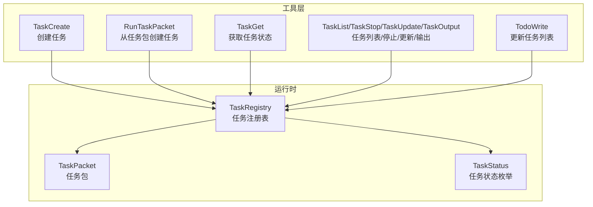
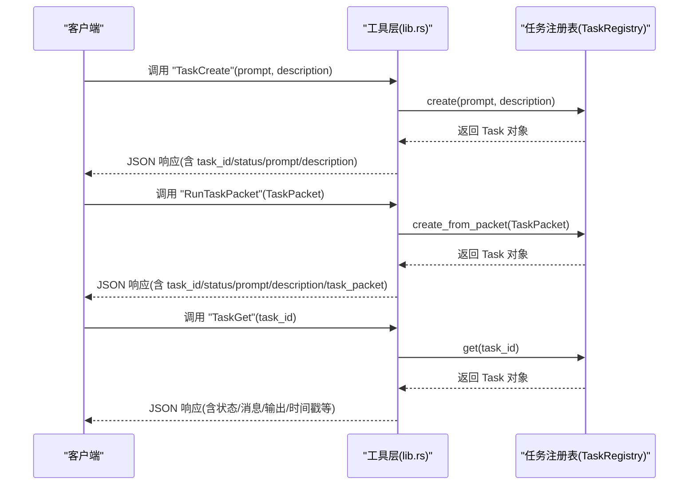
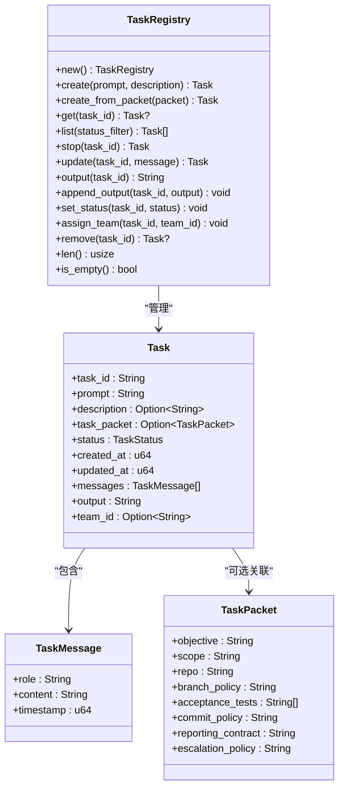
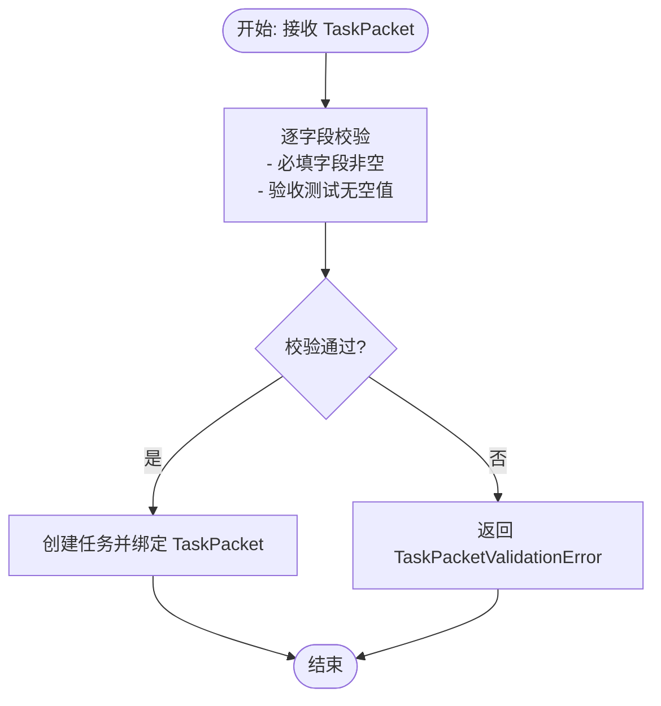
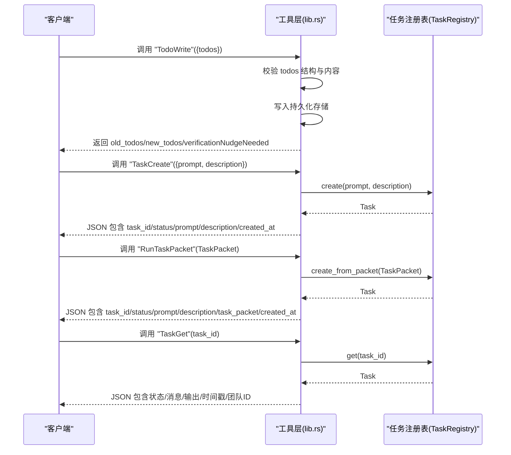

# 任务管理工具

<cite>
**本文档引用的文件**
- [task_registry.rs](file://rust/crates/runtime/src/task_registry.rs)
- [task_packet.rs](file://rust/crates/runtime/src/task_packet.rs)
- [lib.rs](file://rust/crates/tools/src/lib.rs)
- [tasks.py](file://src/tasks.py)
- [task.py](file://src/task.py)
</cite>

## 目录
1. [简介](#简介)
2. [项目结构](#项目结构)
3. [核心组件](#核心组件)
4. [架构总览](#架构总览)
5. [详细组件分析](#详细组件分析)
6. [依赖关系分析](#依赖关系分析)
7. [性能考虑](#性能考虑)
8. [故障排除指南](#故障排除指南)
9. [结论](#结论)

## 简介
本文件系统性地介绍了任务管理工具的设计与实现，覆盖以下关键能力：
- 任务创建：支持从简单提示创建任务，或从结构化任务包创建任务
- 任务执行与管理：提供任务状态变更、消息追加、输出累积、停止等操作
- 任务查询：支持按 ID 获取任务详情、列出任务、按状态过滤
- 任务调度与并发：通过全局注册表在会话内共享任务状态，支持多任务并行
- 状态跟踪与进度报告：记录任务状态、消息历史、输出内容与更新时间
- 错误恢复与边界保护：对非法状态转换进行拒绝，提供清晰的错误信息

## 项目结构
该任务管理功能由 Rust 运行时模块与工具层共同实现：
- 运行时模块负责任务生命周期管理与数据结构定义
- 工具层提供对外暴露的工具接口，封装任务操作的输入输出与权限控制

**图表来源**
- [task_registry.rs:12-46](file://rust/crates/runtime/src/task_registry.rs#L12-L46)
- [task_packet.rs:4-14](file://rust/crates/runtime/src/task_packet.rs#L4-L14)
- [lib.rs:747-854](file://rust/crates/tools/src/lib.rs#L747-L854)

**章节来源**
- [task_registry.rs:1-200](file://rust/crates/runtime/src/task_registry.rs#L1-L200)
- [task_packet.rs:1-158](file://rust/crates/runtime/src/task_packet.rs#L1-L158)
- [lib.rs:747-854](file://rust/crates/tools/src/lib.rs#L747-L854)

## 核心组件
- 任务注册表（TaskRegistry）：提供任务的创建、查询、列表、状态变更、消息追加、输出累积、团队分配与删除等能力
- 任务包（TaskPacket）：用于描述任务目标、范围、仓库策略、验收测试、提交策略、报告契约与升级策略的结构化数据
- 工具接口（Tools）：封装 TodoWrite、TaskCreate、RunTaskPacket、TaskGet 等工具，统一输入输出格式与权限控制

**章节来源**
- [task_registry.rs:73-231](file://rust/crates/runtime/src/task_registry.rs#L73-L231)
- [task_packet.rs:4-84](file://rust/crates/runtime/src/task_packet.rs#L4-L84)
- [lib.rs:530-804](file://rust/crates/tools/src/lib.rs#L530-L804)

## 架构总览
任务管理采用“运行时 + 工具层”的分层设计：
- 运行时层以 TaskRegistry 为核心，维护任务内存状态，提供线程安全的并发访问
- 工具层通过 OnceLock 全局注册表实例，向外部暴露标准化的工具调用入口
- 任务包验证在创建阶段完成，确保任务元数据的完整性与一致性

**图表来源**
- [lib.rs:1378-1425](file://rust/crates/tools/src/lib.rs#L1378-L1425)
- [task_registry.rs:79-93](file://rust/crates/runtime/src/task_registry.rs#L79-L93)

**章节来源**
- [lib.rs:59-63](file://rust/crates/tools/src/lib.rs#L59-L63)
- [task_registry.rs:73-119](file://rust/crates/runtime/src/task_registry.rs#L73-L119)

## 详细组件分析

### 组件一：任务注册表（TaskRegistry）
- 职责
  - 创建任务：支持从提示词与可选描述创建任务；或从任务包创建任务（带校验）
  - 查询与列表：按 ID 获取任务；按状态过滤列出任务
  - 状态管理：设置任务状态；拒绝非法状态转换（如在已完成/失败/已停止状态下再次停止）
  - 消息与输出：追加用户消息；累积输出文本；记录更新时间
  - 团队关联：为任务分配团队 ID
  - 并发控制：内部使用互斥锁保护共享状态
- 关键数据结构
  - Task：包含任务标识、提示词、描述、任务包、状态、创建/更新时间、消息列表、输出文本、团队 ID
  - TaskMessage：消息条目（角色、内容、时间戳）
  - TaskStatus：任务状态枚举（created/running/completed/failed/stopped）

**图表来源**
- [task_registry.rs:34-46](file://rust/crates/runtime/src/task_registry.rs#L34-L46)
- [task_registry.rs:48-53](file://rust/crates/runtime/src/task_registry.rs#L48-L53)
- [task_packet.rs:4-14](file://rust/crates/runtime/src/task_packet.rs#L4-L14)

**章节来源**
- [task_registry.rs:73-231](file://rust/crates/runtime/src/task_registry.rs#L73-L231)

### 组件二：任务包（TaskPacket）
- 职责：定义任务的结构化元数据，创建任务时作为输入，同时在创建后绑定到任务对象
- 校验规则：要求所有字段非空，验收测试数组中不得包含空值
- 序列化：支持 JSON 序列化与反序列化，保证跨进程/跨会话的一致性

**图表来源**
- [task_packet.rs:56-84](file://rust/crates/runtime/src/task_packet.rs#L56-L84)

**章节来源**
- [task_packet.rs:56-84](file://rust/crates/runtime/src/task_packet.rs#L56-L84)

### 组件三：工具接口（Tools）
- TodoWrite：更新当前会话的任务列表，支持批量任务项的状态变更与持久化
- TaskCreate：创建后台任务，返回任务 ID 与初始状态
- RunTaskPacket：从任务包创建任务，返回任务 ID 与任务包信息
- TaskGet：按任务 ID 获取任务的完整状态与历史
- TaskList/TaskStop/TaskUpdate/TaskOutput：提供任务列表、停止、消息更新、输出读取等辅助能力

**图表来源**
- [lib.rs:3130-3175](file://rust/crates/tools/src/lib.rs#L3130-L3175)
- [lib.rs:1378-1425](file://rust/crates/tools/src/lib.rs#L1378-L1425)

**章节来源**
- [lib.rs:530-804](file://rust/crates/tools/src/lib.rs#L530-L804)
- [lib.rs:1378-1489](file://rust/crates/tools/src/lib.rs#L1378-L1489)

### 组件四：Python 任务模型（补充）
- PortingTask：用于 Python 层的任务定义与默认任务集合
- 作用：为 Python 环境提供任务模型与默认任务清单，便于与 Rust 侧任务系统协同

**章节来源**
- [tasks.py:6-12](file://src/tasks.py#L6-L12)
- [task.py:1-6](file://src/task.py#L1-L6)

## 依赖关系分析
- 工具层依赖运行时模块提供的 TaskRegistry 与 TaskPacket
- 工具层通过 OnceLock 获取全局 TaskRegistry 实例，确保会话内共享状态
- 任务包在创建阶段即进行校验，避免无效任务进入运行时

**图表来源**
- [lib.rs:59-63](file://rust/crates/tools/src/lib.rs#L59-L63)
- [task_registry.rs:10-10](file://rust/crates/runtime/src/task_registry.rs#L10-L10)
- [task_packet.rs:4-14](file://rust/crates/runtime/src/task_packet.rs#L4-L14)

**章节来源**
- [lib.rs:59-63](file://rust/crates/tools/src/lib.rs#L59-L63)
- [task_registry.rs:83-93](file://rust/crates/runtime/src/task_registry.rs#L83-L93)

## 性能考虑
- 并发安全：注册表内部使用互斥锁保护共享状态，适合多工具并发调用
- 时间戳更新：每次状态变更与消息/输出更新都会刷新 updated_at，便于外部轮询判断活跃度
- 列表过滤：支持按状态过滤，减少不必要的遍历开销
- 输出累积：输出以字符串拼接方式累积，建议在高吞吐场景下结合分块写入与定期落盘策略

[本节为通用指导，无需特定文件引用]

## 故障排除指南
- 任务不存在：当查询/更新/停止/输出读取的目标任务不存在时，返回明确的错误信息
- 非法状态转换：若尝试对已完成/失败/已停止的任务再次停止，将被拒绝并提示当前状态
- 任务包校验失败：当任务包存在空字段或验收测试包含空值时，创建任务会失败并返回具体错误列表
- 权限问题：工具调用受权限控制，若权限不足将返回拒绝原因

**章节来源**
- [task_registry.rs:136-156](file://rust/crates/runtime/src/task_registry.rs#L136-L156)
- [task_registry.rs:358-366](file://rust/crates/runtime/src/task_registry.rs#L358-L366)
- [task_packet.rs:121-148](file://rust/crates/runtime/src/task_packet.rs#L121-L148)
- [lib.rs:1175-1187](file://rust/crates/tools/src/lib.rs#L1175-L1187)

## 结论
该任务管理工具通过清晰的分层设计与严格的边界保护，提供了可靠的任务创建、执行与管理能力。运行时层专注于任务生命周期与状态一致性，工具层提供标准化的外部接口与权限控制。配合任务包校验与并发安全机制，能够满足复杂场景下的任务编排与进度跟踪需求。