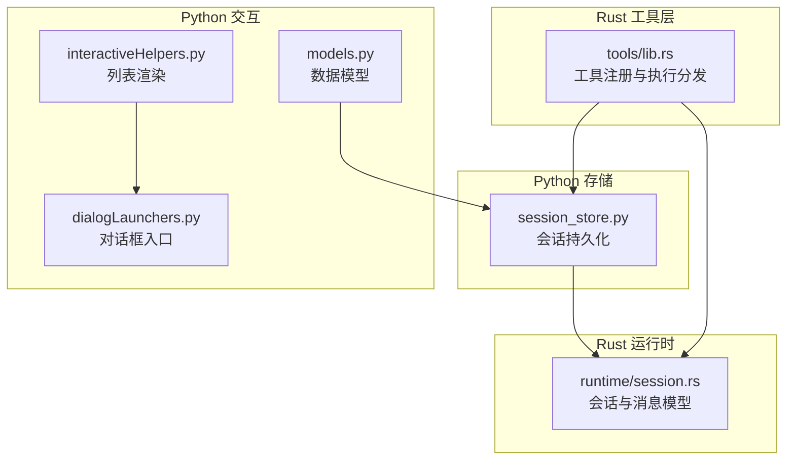
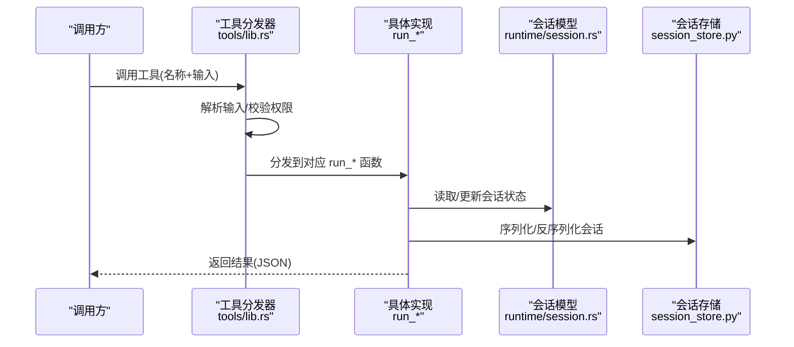
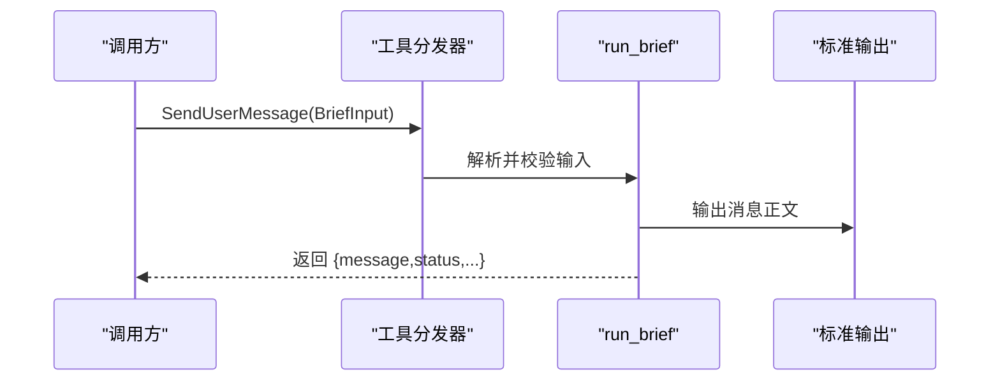
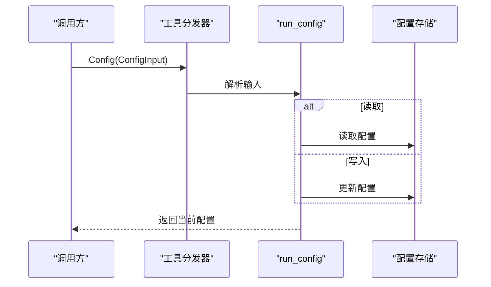
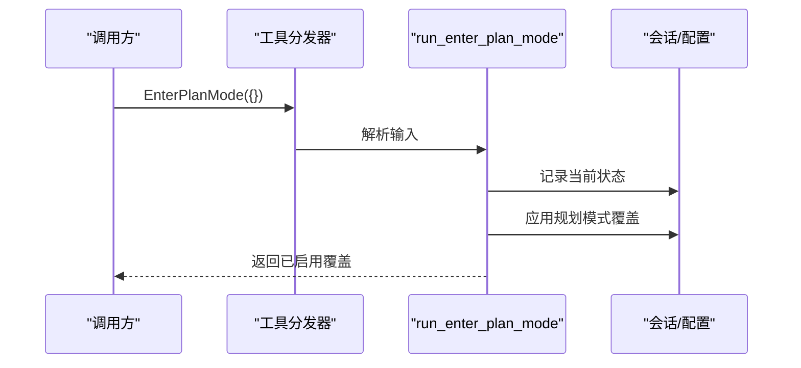
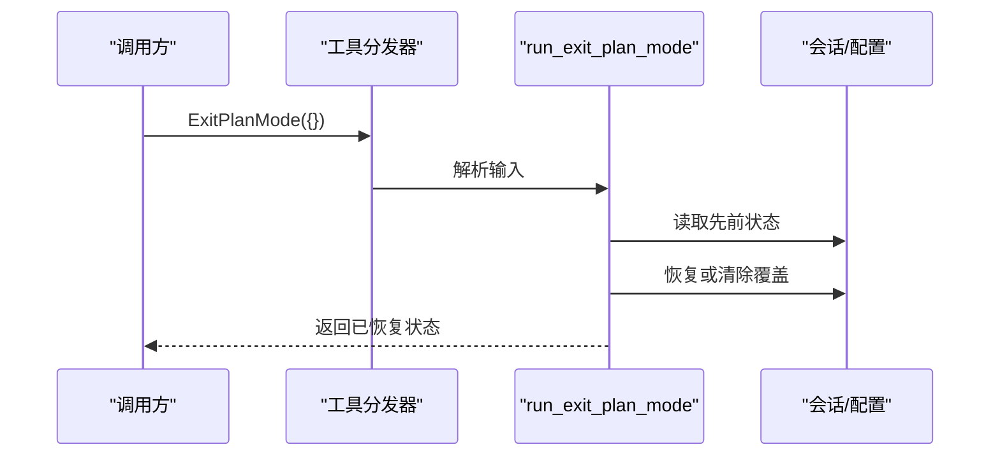
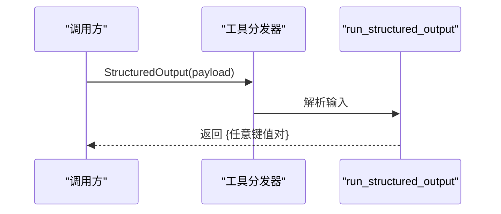
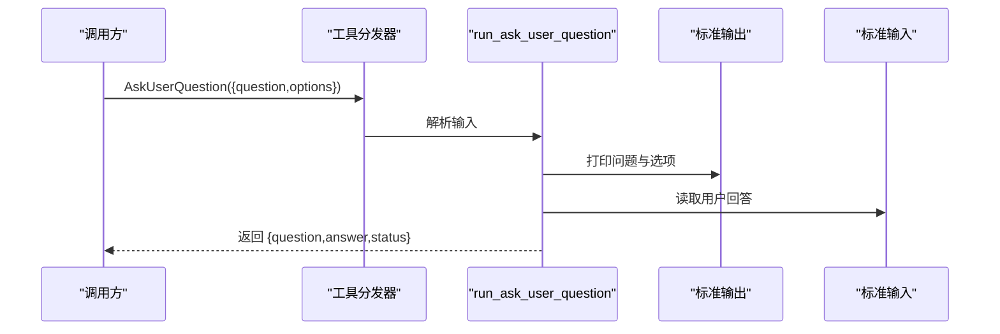
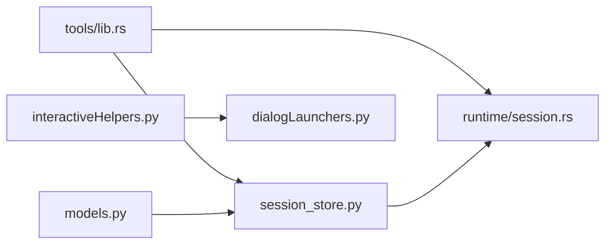

# 会话控制工具

<cite>
**本文引用的文件**
- [tools/lib.rs](file://rust/crates/tools/src/lib.rs)
- [runtime/session.rs](file://rust/crates/runtime/src/session.rs)
- [session_store.py](file://src/session_store.py)
- [interactiveHelpers.py](file://src/interactiveHelpers.py)
- [dialogLaunchers.py](file://src/dialogLaunchers.py)
- [models.py](file://src/models.py)
</cite>

## 目录
1. [简介](#简介)
2. [项目结构](#项目结构)
3. [核心组件](#核心组件)
4. [架构总览](#架构总览)
5. [详细组件分析](#详细组件分析)
6. [依赖关系分析](#依赖关系分析)
7. [性能考量](#性能考量)
8. [故障排查指南](#故障排查指南)
9. [结论](#结论)

## 简介
本文件系统性梳理“会话控制工具”的设计与实现，覆盖以下关键能力：
- 向用户发送消息：SendUserMessage（简写 Brief）
- 配置管理：Config（获取或设置设置项）
- 规划模式：EnterPlanMode（进入）、ExitPlanMode（退出）
- 结构化输出：StructuredOutput
- 用户交互：AskUserQuestion（向用户提问并等待回答）

文档将从架构、数据流、处理逻辑、权限与安全、错误处理、性能优化等维度展开，并给出参数说明、使用示例与最佳实践。

## 项目结构
围绕会话控制工具的相关代码主要分布在 Rust 运行时与 Python 辅助模块中：
- Rust 工具层：定义工具清单、输入输出类型、执行分发与具体实现
- Rust 会话层：会话状态、消息持久化、元数据记录
- Python 会话存储：本地会话的序列化/反序列化
- Python 交互辅助：对话框与列表渲染等

图表来源
- [tools/lib.rs:1229-1291](file://rust/crates/tools/src/lib.rs#L1229-L1291)
- [runtime/session.rs:90-124](file://rust/crates/runtime/src/session.rs#L90-L124)
- [session_store.py:19-35](file://src/session_store.py#L19-L35)
- [interactiveHelpers.py:4-5](file://src/interactiveHelpers.py#L4-L5)
- [dialogLaunchers.py:12-15](file://src/dialogLaunchers.py#L12-L15)
- [models.py:14-20](file://src/models.py#L14-L20)

章节来源
- [tools/lib.rs:1229-1291](file://rust/crates/tools/src/lib.rs#L1229-L1291)
- [runtime/session.rs:90-124](file://rust/crates/runtime/src/session.rs#L90-L124)
- [session_store.py:19-35](file://src/session_store.py#L19-L35)
- [interactiveHelpers.py:4-5](file://src/interactiveHelpers.py#L4-L5)
- [dialogLaunchers.py:12-15](file://src/dialogLaunchers.py#L12-L15)
- [models.py:14-20](file://src/models.py#L14-L20)

## 核心组件
- 工具注册与执行分发：在工具清单中注册 SendUserMessage、Config、EnterPlanMode、ExitPlanMode、StructuredOutput、AskUserQuestion 等工具，并根据名称分发到对应实现
- 会话模型与持久化：会话包含消息历史、提示词历史、压缩信息、派生分支等；支持 JSON/JSONL 持久化与增量写入
- 会话存储：Python 层提供会话对象的序列化/反序列化，便于跨语言场景使用
- 交互辅助：提供对话框与列表渲染等 UI 支持

章节来源
- [tools/lib.rs:1229-1291](file://rust/crates/tools/src/lib.rs#L1229-L1291)
- [runtime/session.rs:90-124](file://rust/crates/runtime/src/session.rs#L90-L124)
- [session_store.py:19-35](file://src/session_store.py#L19-L35)

## 架构总览
下图展示会话控制工具在系统中的位置与交互关系：

图表来源
- [tools/lib.rs:1229-1291](file://rust/crates/tools/src/lib.rs#L1229-L1291)
- [runtime/session.rs:229-243](file://rust/crates/runtime/src/session.rs#L229-L243)
- [session_store.py:19-35](file://src/session_store.py#L19-L35)

## 详细组件分析

### SendUserMessage（简写 Brief）
- 功能：向用户发送消息，可附带附件与状态标记
- 输入类型：BriefInput（字段包括 message、attachments、status）
- 权限：ReadOnly
- 执行流程：
  - 工具分发器解析输入
  - 执行器将消息内容输出到标准输出
  - 返回包含消息摘要与状态的结果
- 最佳实践：
  - 使用 status 区分“普通”和“主动”消息
  - attachments 用于补充上下文（如文件路径）
  - 在多轮对话中保持消息简洁明确

图表来源
- [tools/lib.rs:1234-1234](file://rust/crates/tools/src/lib.rs#L1234-L1234)
- [tools/lib.rs:2129-2131](file://rust/crates/tools/src/lib.rs#L2129-L2131)

章节来源
- [tools/lib.rs:633-651](file://rust/crates/tools/src/lib.rs#L633-L651)
- [tools/lib.rs:1234-1234](file://rust/crates/tools/src/lib.rs#L1234-L1234)
- [tools/lib.rs:2129-2131](file://rust/crates/tools/src/lib.rs#L2129-L2131)

### Config（获取或设置配置）
- 功能：获取或设置 Claude Code 设置项
- 输入类型：ConfigInput（字段包括 setting、value）
- 权限：WorkspaceWrite
- 执行流程：
  - 工具分发器解析输入
  - 执行器读取或写入配置
  - 返回当前配置状态
- 最佳实践：
  - 仅在需要变更时提供 value
  - 使用稳定的 setting 名称
  - 注意配置项的类型约束（字符串/布尔/数字）

图表来源
- [tools/lib.rs:654-668](file://rust/crates/tools/src/lib.rs#L654-L668)
- [tools/lib.rs:1235-1235](file://rust/crates/tools/src/lib.rs#L1235-L1235)
- [tools/lib.rs:2133-2135](file://rust/crates/tools/src/lib.rs#L2133-L2135)

章节来源
- [tools/lib.rs:654-668](file://rust/crates/tools/src/lib.rs#L654-L668)
- [tools/lib.rs:1235-1235](file://rust/crates/tools/src/lib.rs#L1235-L1235)
- [tools/lib.rs:2133-2135](file://rust/crates/tools/src/lib.rs#L2133-L2135)

### EnterPlanMode（进入规划模式）
- 功能：启用工作树局部的规划模式覆盖，并记录先前的本地设置以供退出时恢复
- 输入类型：EnterPlanModeInput（空输入）
- 权限：WorkspaceWrite
- 执行流程：
  - 工具分发器解析输入
  - 执行器保存当前规划模式状态
  - 启用新的规划模式覆盖
  - 返回确认信息
- 最佳实践：
  - 与 ExitPlanMode 成对使用
  - 在复杂任务前临时开启，避免影响全局配置

图表来源
- [tools/lib.rs:670-678](file://rust/crates/tools/src/lib.rs#L670-L678)
- [tools/lib.rs:1236-1236](file://rust/crates/tools/src/lib.rs#L1236-L1236)
- [tools/lib.rs:2137-2139](file://rust/crates/tools/src/lib.rs#L2137-L2139)

章节来源
- [tools/lib.rs:670-678](file://rust/crates/tools/src/lib.rs#L670-L678)
- [tools/lib.rs:1236-1236](file://rust/crates/tools/src/lib.rs#L1236-L1236)
- [tools/lib.rs:2137-2139](file://rust/crates/tools/src/lib.rs#L2137-L2139)

### ExitPlanMode（退出规划模式）
- 功能：恢复或清除由 EnterPlanMode 创建的工作树局部规划模式覆盖
- 输入类型：ExitPlanModeInput（空输入）
- 权限：WorkspaceWrite
- 执行流程：
  - 工具分发器解析输入
  - 执行器读取先前记录的状态
  - 恢复或清理覆盖设置
  - 返回操作结果
- 最佳实践：
  - 始终与 EnterPlanMode 配对使用
  - 在任务完成后及时退出，避免长期覆盖

图表来源
- [tools/lib.rs:680-688](file://rust/crates/tools/src/lib.rs#L680-L688)
- [tools/lib.rs:1237-1237](file://rust/crates/tools/src/lib.rs#L1237-L1237)
- [tools/lib.rs:2141-2143](file://rust/crates/tools/src/lib.rs#L2141-L2143)

章节来源
- [tools/lib.rs:680-688](file://rust/crates/tools/src/lib.rs#L680-L688)
- [tools/lib.rs:1237-1237](file://rust/crates/tools/src/lib.rs#L1237-L1237)
- [tools/lib.rs:2141-2143](file://rust/crates/tools/src/lib.rs#L2141-L2143)

### StructuredOutput（返回结构化输出）
- 功能：按请求格式返回结构化输出，支持任意键值对
- 输入类型：StructuredOutputInput（任意 JSON 对象）
- 权限：ReadOnly
- 执行流程：
  - 工具分发器解析输入
  - 执行器将输入原样作为结构化输出返回
  - 适合在多模态/多步骤任务中稳定输出结构化数据
- 最佳实践：
  - 明确约定键名与数据类型
  - 与上游任务输出格式保持一致

图表来源
- [tools/lib.rs:690-697](file://rust/crates/tools/src/lib.rs#L690-L697)
- [tools/lib.rs:1238-1239](file://rust/crates/tools/src/lib.rs#L1238-L1239)
- [tools/lib.rs:2145-2145](file://rust/crates/tools/src/lib.rs#L2145-L2145)

章节来源
- [tools/lib.rs:690-697](file://rust/crates/tools/src/lib.rs#L690-L697)
- [tools/lib.rs:1238-1239](file://rust/crates/tools/src/lib.rs#L1238-L1239)
- [tools/lib.rs:2145-2145](file://rust/crates/tools/src/lib.rs#L2145-L2145)

### AskUserQuestion（向用户提问）
- 功能：向用户提出问题并等待其回答，支持选项列表
- 输入类型：AskUserQuestionInput（字段包括 question、options）
- 权限：ReadOnly
- 执行流程：
  - 工具分发器解析输入
  - 执行器通过标准输出打印问题与选项
  - 从标准输入读取用户回答
  - 将问题、答案与状态打包返回
- 最佳实践：
  - 选项数量建议控制在合理范围
  - 提供清晰的提示与引导
  - 对数值选择进行边界检查

图表来源
- [tools/lib.rs:730-745](file://rust/crates/tools/src/lib.rs#L730-L745)
- [tools/lib.rs:1249-1251](file://rust/crates/tools/src/lib.rs#L1249-L1251)
- [tools/lib.rs:1327-1375](file://rust/crates/tools/src/lib.rs#L1327-L1375)

章节来源
- [tools/lib.rs:730-745](file://rust/crates/tools/src/lib.rs#L730-L745)
- [tools/lib.rs:1249-1251](file://rust/crates/tools/src/lib.rs#L1249-L1251)
- [tools/lib.rs:1327-1375](file://rust/crates/tools/src/lib.rs#L1327-L1375)

## 依赖关系分析
- 工具层依赖运行时会话模型进行状态读写
- 工具层依赖权限执行器进行权限校验
- Python 会话存储与 Rust 会话模型相互独立但可互补
- 交互辅助模块为 UI 展示提供基础能力

图表来源
- [tools/lib.rs:1293-1324](file://rust/crates/tools/src/lib.rs#L1293-L1324)
- [runtime/session.rs:229-243](file://rust/crates/runtime/src/session.rs#L229-L243)
- [session_store.py:19-35](file://src/session_store.py#L19-L35)
- [interactiveHelpers.py:4-5](file://src/interactiveHelpers.py#L4-L5)
- [dialogLaunchers.py:12-15](file://src/dialogLaunchers.py#L12-L15)
- [models.py:14-20](file://src/models.py#L14-L20)

章节来源
- [tools/lib.rs:1293-1324](file://rust/crates/tools/src/lib.rs#L1293-L1324)
- [runtime/session.rs:229-243](file://rust/crates/runtime/src/session.rs#L229-L243)
- [session_store.py:19-35](file://src/session_store.py#L19-L35)
- [interactiveHelpers.py:4-5](file://src/interactiveHelpers.py#L4-L5)
- [dialogLaunchers.py:12-15](file://src/dialogLaunchers.py#L12-L15)
- [models.py:14-20](file://src/models.py#L14-L20)

## 性能考量
- 会话持久化采用 JSONL 增量写入，避免大文件重写带来的 IO 压力
- 会话快照在必要时才生成，减少内存占用
- 工具执行前进行权限校验，避免无效调用造成的资源浪费
- 建议：
  - 控制单次 StructuredOutput 的数据规模
  - 合理使用 EnterPlanMode/ExitPlanMode，避免频繁切换
  - 在批量任务中合并多次 Config 变更

## 故障排查指南
- 工具未找到
  - 现象：返回“不支持的工具”
  - 排查：确认工具名称大小写与别名（如 Brief 为 SendUserMessage 别名）
- 权限不足
  - 现象：执行被拒绝
  - 排查：检查所需权限模式（ReadOnly/WorkspaceWrite/DangerFullAccess）与当前策略
- 会话写入失败
  - 现象：push_message 失败
  - 排查：检查持久化路径是否存在、磁盘空间、文件锁
- 会话加载异常
  - 现象：load_from_path 报错
  - 排查：确认文件格式（JSON/JSONL），字段完整性

章节来源
- [tools/lib.rs:1293-1324](file://rust/crates/tools/src/lib.rs#L1293-L1324)
- [runtime/session.rs:213-227](file://rust/crates/runtime/src/session.rs#L213-L227)
- [runtime/session.rs:541-555](file://rust/crates/runtime/src/session.rs#L541-L555)

## 结论
会话控制工具通过统一的工具注册与执行分发机制，结合会话模型与权限控制，提供了面向用户的可靠消息传递、配置管理、规划模式切换与结构化输出能力。配合 Python 侧的会话存储与交互辅助模块，形成完整的会话生命周期管理方案。建议在实际使用中遵循最佳实践，确保安全性与稳定性。