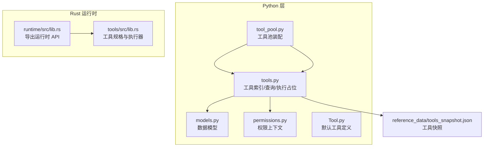
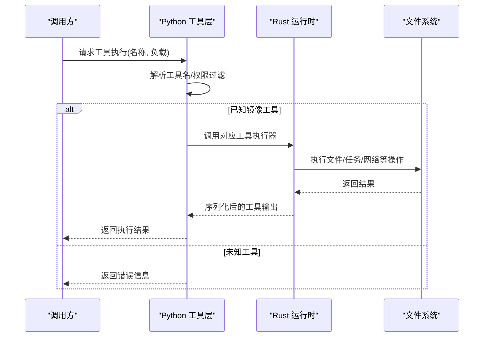
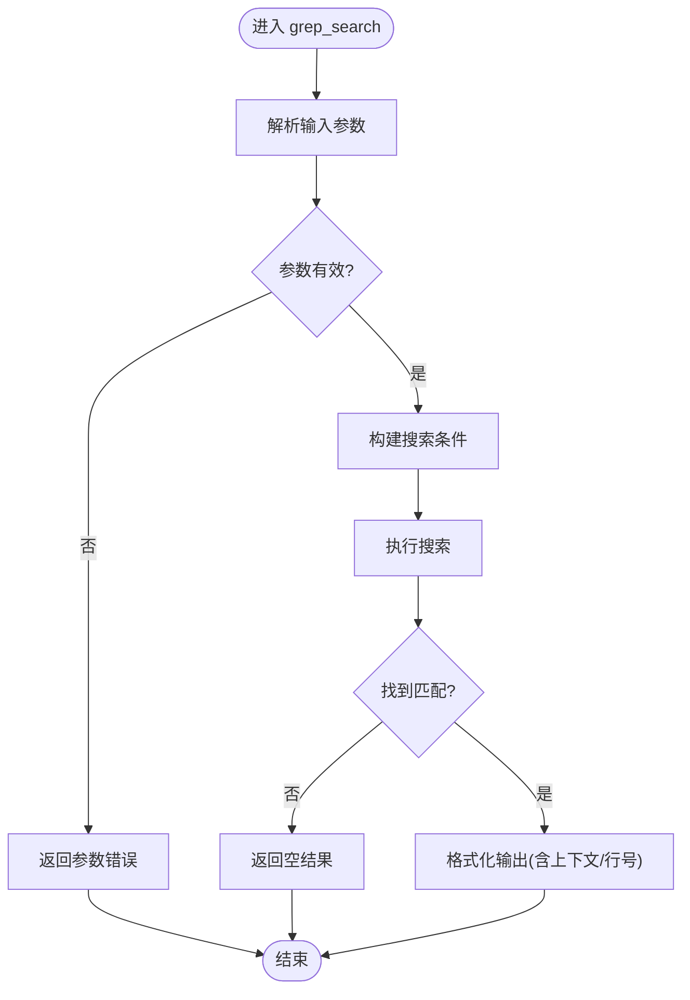
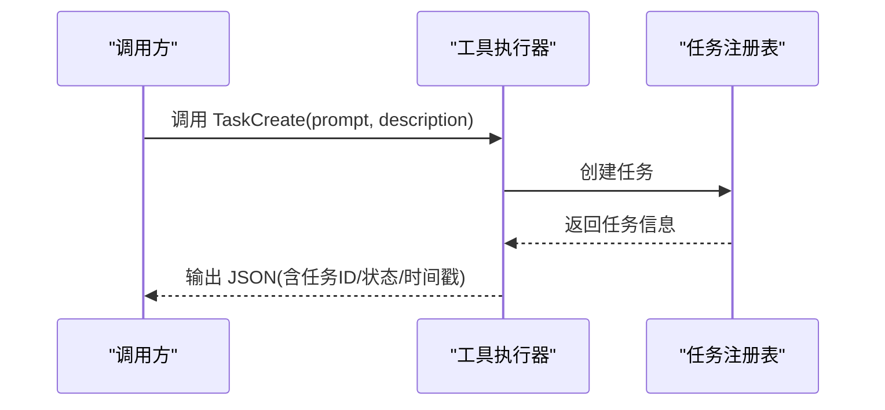
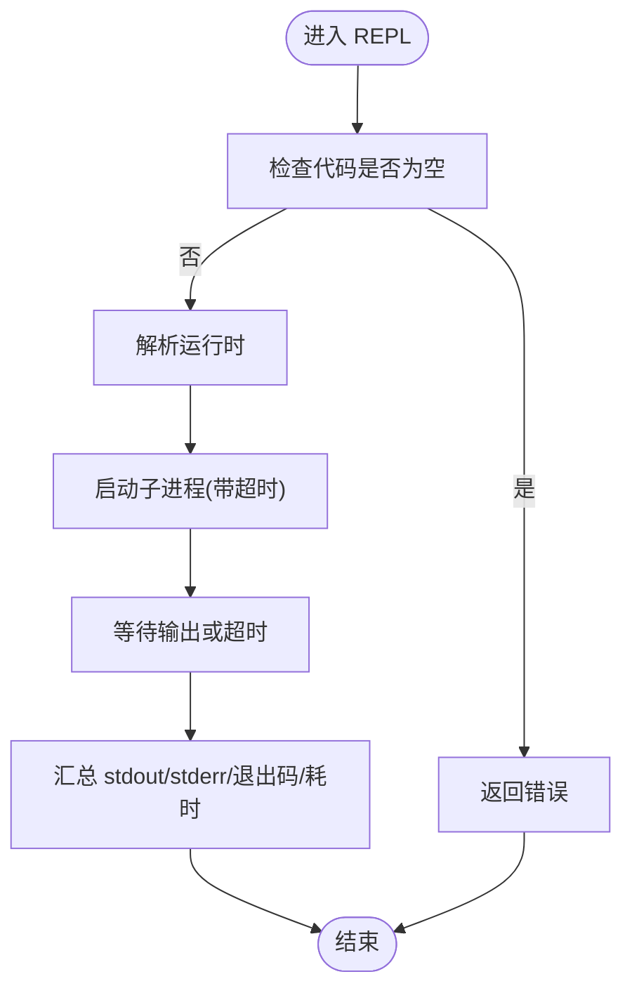
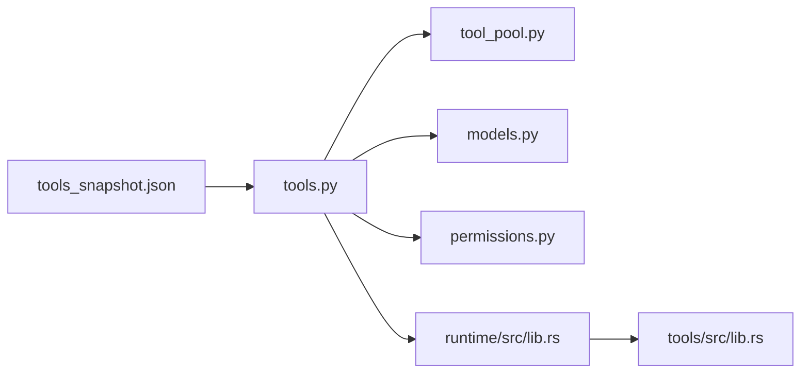

# 内置工具

<cite>
**本文引用的文件**
- [src/tools.py](file://src/tools.py)
- [src/tool_pool.py](file://src/tool_pool.py)
- [src/models.py](file://src/models.py)
- [src/permissions.py](file://src/permissions.py)
- [src/Tool.py](file://src/Tool.py)
- [src/reference_data/tools_snapshot.json](file://src/reference_data/tools_snapshot.json)
- [src/tasks.py](file://src/tasks.py)
- [src/task.py](file://src/task.py)
- [rust/crates/tools/src/lib.rs](file://rust/crates/tools/src/lib.rs)
- [rust/crates/runtime/src/lib.rs](file://rust/crates/runtime/src/lib.rs)
</cite>

## 目录
1. [简介](#简介)
2. [项目结构](#项目结构)
3. [核心组件](#核心组件)
4. [架构总览](#架构总览)
5. [详细组件分析](#详细组件分析)
6. [依赖分析](#依赖分析)
7. [性能考量](#性能考量)
8. [故障排查指南](#故障排查指南)
9. [结论](#结论)
10. [附录](#附录)

## 简介
本文件系统性梳理仓库中的“内置工具”能力，覆盖以下类别与工具：
- 文件操作工具：read_file、write_file、edit_file、glob_search、grep_search
- 系统命令工具：bash、PowerShell（通过运行时桥接）
- 网络工具：WebFetch、WebSearch
- 任务管理工具：TodoWrite、TaskCreate、RunTaskPacket、TaskGet、TaskList、TaskStop、TaskUpdate、TaskOutput
- 会话控制工具：SendUserMessage、Config、EnterPlanMode、ExitPlanMode
- 代码执行工具：REPL、StructuredOutput
- 其他工具：AgentTool、UI、SkillTool、SendMessageTool、ListMcpResourcesTool、ReadMcpResourceTool、MCPTool、McpAuthTool、NotebookEditTool、LSPTool、ScheduleCronTool、SleepTool、SyntheticOutputTool、ToolSearchTool、WebFetchTool、WebSearchTool、AskUserQuestionTool、BriefTool、ConfigTool、EnterPlanModeTool、EnterWorktreeTool、ExitPlanModeV2Tool、ExitWorktreeTool、FileEditTool、FileReadTool、FileWriteTool、GlobTool、GrepTool、ListMcpResourcesTool、MCPTool、McpAuthTool、NotebookEditTool、PowerShellTool、ReadMcpResourceTool、RemoteTriggerTool、ScheduleCronTool、SendMessageTool、SkillTool、SleepTool、SyntheticOutputTool、TaskCreateTool、TaskGetTool、TaskListTool、TaskOutputTool、TaskStopTool、TaskUpdateTool、TeamCreateTool、TeamDeleteTool、TodoWriteTool、ToolSearchTool、WebFetchTool、WebSearchTool、TestingPermissionTool、utils

说明：
- 工具清单来源于工具快照文件，工具定义以“镜像自已归档的 TypeScript 工具模块”的方式呈现。
- 运行时侧对部分工具提供了实际实现（如文件读写、搜索、任务、REPL、结构化输出等），并在权限模型上进行约束。

## 项目结构
- Python 层负责工具索引、权限过滤、工具池装配与展示。
- Rust 运行时层提供工具执行器、权限评估、文件操作、任务编排、MCP 集成等能力。
- 工具快照文件集中描述了工具名称、来源提示与职责。

图表来源
- [src/tools.py:1-97](file://src/tools.py#L1-L97)
- [src/tool_pool.py:1-38](file://src/tool_pool.py#L1-L38)
- [src/models.py:1-50](file://src/models.py#L1-L50)
- [src/permissions.py:1-21](file://src/permissions.py#L1-L21)
- [src/reference_data/tools_snapshot.json:1-922](file://src/reference_data/tools_snapshot.json#L1-L922)
- [rust/crates/runtime/src/lib.rs:1-180](file://rust/crates/runtime/src/lib.rs#L1-L180)
- [rust/crates/tools/src/lib.rs](file://rust/crates/tools/src/lib.rs)

章节来源
- [src/tools.py:1-97](file://src/tools.py#L1-L97)
- [src/tool_pool.py:1-38](file://src/tool_pool.py#L1-L38)
- [src/models.py:1-50](file://src/models.py#L1-L50)
- [src/permissions.py:1-21](file://src/permissions.py#L1-L21)
- [src/reference_data/tools_snapshot.json:1-922](file://src/reference_data/tools_snapshot.json#L1-L922)
- [rust/crates/runtime/src/lib.rs:1-180](file://rust/crates/runtime/src/lib.rs#L1-L180)

## 核心组件
- 工具索引与查询
  - 加载工具快照，构建工具列表；支持按名称或来源提示关键词检索；支持简单模式与排除 MCP 工具。
- 权限上下文
  - 基于工具名与前缀的拒绝策略，用于在不同场景下限制工具可用性。
- 工具池装配
  - 组合工具列表、简单模式与 MCP 包含策略，生成可渲染的工具池视图。
- 默认工具定义
  - 提供默认工具集合（如端口清单、查询引擎）的简要说明。

章节来源
- [src/tools.py:23-97](file://src/tools.py#L23-L97)
- [src/tool_pool.py:28-38](file://src/tool_pool.py#L28-L38)
- [src/models.py:14-50](file://src/models.py#L14-L50)
- [src/permissions.py:6-21](file://src/permissions.py#L6-L21)
- [src/Tool.py:6-16](file://src/Tool.py#L6-L16)

## 架构总览
- Python 层负责工具元数据与权限过滤；Rust 运行时层负责工具执行、权限评估与文件/任务操作。
- 工具快照作为权威来源，Python 层仅做索引与筛选；实际工具行为由运行时实现。

图表来源
- [src/tools.py:81-87](file://src/tools.py#L81-L87)
- [rust/crates/tools/src/lib.rs](file://rust/crates/tools/src/lib.rs)
- [rust/crates/runtime/src/lib.rs:76-80](file://rust/crates/runtime/src/lib.rs#L76-L80)

## 详细组件分析

### 文件操作工具
- read_file
  - 功能：读取工作区文本文件，支持偏移量读取，越界返回空内容。
  - 参数要点：路径必填；可选偏移量；权限：只读。
  - 错误处理：缺失文件报错；越界返回空内容。
  - 性能建议：避免大文件全量读取；必要时配合 glob/grep 先定位。
- write_file
  - 功能：在工作区写入文本文件。
  - 参数要点：路径与内容必填；权限：工作区写入。
  - 错误处理：路径不存在或权限不足时报错。
- edit_file
  - 功能：替换文件中指定字符串；支持全部替换。
  - 参数要点：路径、旧字符串、新字符串必填；可选全部替换；权限：工作区写入。
  - 错误处理：旧字符串不存在或新旧相同会报错。
- glob_search
  - 功能：按通配符查找文件。
  - 参数要点：模式必填；可选路径；权限：只读。
- grep_search
  - 功能：按正则搜索文件内容，支持上下文行数、大小写、行号等选项。
  - 参数要点：模式必填；可选路径、通配符、上下文、大小写、行号等；权限：只读。

图表来源
- [rust/crates/tools/src/lib.rs](file://rust/crates/tools/src/lib.rs)
- [rust/crates/runtime/src/lib.rs:76-80](file://rust/crates/runtime/src/lib.rs#L76-L80)

章节来源
- [rust/crates/tools/src/lib.rs](file://rust/crates/tools/src/lib.rs)
- [rust/crates/runtime/src/lib.rs:76-80](file://rust/crates/runtime/src/lib.rs#L76-L80)

### 系统命令工具
- bash
  - 功能：执行 Bash 命令，具备破坏性命令警告、路径校验、只读模式、沙箱选择等安全机制。
  - 权限与安全：通过权限上下文与安全模块控制；支持只读模式与沙箱。
- PowerShell
  - 功能：执行 PowerShell 命令，具备相似的安全与权限控制。
- 注意：上述工具由运行时桥接实现，具体行为受运行时配置与权限策略影响。

章节来源
- [src/reference_data/tools_snapshot.json:113-201](file://src/reference_data/tools_snapshot.json#L113-L201)
- [src/reference_data/tools_snapshot.json:523-591](file://src/reference_data/tools_snapshot.json#L523-L591)
- [rust/crates/runtime/src/lib.rs:52-80](file://rust/crates/runtime/src/lib.rs#L52-L80)

### 网络工具
- WebFetch
  - 功能：抓取网页内容，具备预批准域名等安全策略。
- WebSearch
  - 功能：执行网络搜索，返回搜索结果项。
- 注意：工具由运行时实现，具备输入模式与安全策略。

章节来源
- [src/reference_data/tools_snapshot.json:868-901](file://src/reference_data/tools_snapshot.json#L868-L901)
- [rust/crates/tools/src/lib.rs](file://rust/crates/tools/src/lib.rs)

### 任务管理工具
- TodoWrite
  - 功能：更新当前会话的结构化任务列表；支持批量更新与完成态清理。
  - 参数要点：todos 数组，每项包含内容、主动形式与状态；权限：只读（写入存储）。
  - 错误处理：空白内容、非法状态等校验失败。
- TaskCreate
  - 功能：创建后台任务，返回任务 ID 与状态。
- RunTaskPacket
  - 功能：从任务包创建任务。
- TaskGet
  - 功能：按 ID 获取任务详情。
- TaskList
  - 功能：列出所有后台任务及其状态。
- TaskStop
  - 功能：停止指定任务；权限：全权限。
- TaskUpdate
  - 功能：向运行中任务发送消息或更新。
- TaskOutput
  - 功能：获取任务输出。
- 注意：任务注册表由运行时维护，工具执行器负责与注册表交互。

图表来源
- [rust/crates/tools/src/lib.rs](file://rust/crates/tools/src/lib.rs)

章节来源
- [rust/crates/tools/src/lib.rs](file://rust/crates/tools/src/lib.rs)

### 会话控制工具
- SendUserMessage
  - 功能：向用户发送消息。
- Config
  - 功能：配置相关操作（如列出/切换会话等）。
- EnterPlanMode / ExitPlanMode
  - 功能：进入/退出计划模式，通常用于特定工作流。
- 注意：会话控制工具由运行时与工具层共同支撑。

章节来源
- [src/reference_data/tools_snapshot.json:658-676](file://src/reference_data/tools_snapshot.json#L658-L676)
- [src/reference_data/tools_snapshot.json:228-251](file://src/reference_data/tools_snapshot.json#L228-L251)
- [src/reference_data/tools_snapshot.json:253-311](file://src/reference_data/tools_snapshot.json#L253-L311)

### 代码执行工具
- REPL
  - 功能：在指定语言环境中执行代码，返回标准输出、错误与退出码。
  - 参数要点：语言、代码、可选超时；权限：根据语言运行时决定。
  - 错误处理：空代码报错；超时自动终止进程。
- StructuredOutput
  - 功能：接收结构化数据并返回封装结果。
  - 参数要点：结构化对象；权限：只读。
  - 错误处理：空负载报错。

图表来源
- [rust/crates/tools/src/lib.rs](file://rust/crates/tools/src/lib.rs)

章节来源
- [rust/crates/tools/src/lib.rs](file://rust/crates/tools/src/lib.rs)

### 其他工具
- AgentTool、UI、SkillTool、SendMessageTool、ListMcpResourcesTool、ReadMcpResourceTool、MCPTool、McpAuthTool、NotebookEditTool、LSPTool、ScheduleCronTool、SleepTool、SyntheticOutputTool、ToolSearchTool、WebFetchTool、WebSearchTool、AskUserQuestionTool、BriefTool、ConfigTool、EnterPlanModeTool、EnterWorktreeTool、ExitPlanModeV2Tool、ExitWorktreeTool、FileEditTool、FileReadTool、FileWriteTool、GlobTool、GrepTool、TaskCreateTool、TaskGetTool、TaskListTool、TaskOutputTool、TaskStopTool、TaskUpdateTool、TeamCreateTool、TeamDeleteTool、TodoWriteTool、TestingPermissionTool、utils
  - 以上工具均来自工具快照，职责为“镜像自已归档的 TypeScript 工具模块”。具体行为以归档模块为准；若需了解实现细节，应参考对应归档源码。

章节来源
- [src/reference_data/tools_snapshot.json:1-922](file://src/reference_data/tools_snapshot.json#L1-L922)

## 依赖分析
- Python 层
  - tools.py 依赖 models、permissions；提供工具索引、查询、执行占位。
  - tool_pool.py 依赖 tools 与 permissions，装配工具池。
  - Tool.py 提供默认工具集合。
- Rust 运行时层
  - runtime/src/lib.rs 导出文件操作、任务、权限等 API。
  - tools/src/lib.rs 定义工具规格与执行器，并实现文件、任务、REPL、结构化输出等逻辑。

图表来源
- [src/tools.py:1-97](file://src/tools.py#L1-L97)
- [src/tool_pool.py:1-38](file://src/tool_pool.py#L1-L38)
- [src/models.py:1-50](file://src/models.py#L1-L50)
- [src/permissions.py:1-21](file://src/permissions.py#L1-L21)
- [rust/crates/runtime/src/lib.rs:1-180](file://rust/crates/runtime/src/lib.rs#L1-L180)
- [rust/crates/tools/src/lib.rs](file://rust/crates/tools/src/lib.rs)

章节来源
- [src/tools.py:1-97](file://src/tools.py#L1-L97)
- [src/tool_pool.py:1-38](file://src/tool_pool.py#L1-L38)
- [src/models.py:1-50](file://src/models.py#L1-L50)
- [src/permissions.py:1-21](file://src/permissions.py#L1-L21)
- [rust/crates/runtime/src/lib.rs:1-180](file://rust/crates/runtime/src/lib.rs#L1-L180)
- [rust/crates/tools/src/lib.rs](file://rust/crates/tools/src/lib.rs)

## 性能考量
- 文件操作
  - 使用 glob/grep 先缩小范围，再进行 read_file，避免全盘扫描。
  - 对大文件采用分段读取或偏移量读取，减少内存占用。
- 命令执行
  - 启用沙箱与只读模式，降低高风险命令的影响面。
  - 为长耗时命令设置合理超时，防止阻塞。
- 任务管理
  - 使用 TaskList/TaskGet 获取状态，避免重复创建任务。
  - 对已完成任务及时清理，保持注册表整洁。
- REPL
  - 控制语言运行时资源，避免长时间占用 CPU/内存。
  - 合理设置超时，确保响应性。

## 故障排查指南
- 工具未找到
  - 检查工具名称是否存在于工具快照；确认 simple_mode 与 include_mcp 设置是否导致工具被过滤。
- 权限不足
  - 检查 ToolPermissionContext 的 deny_names 与 deny_prefixes；确认运行时权限模式是否满足工具需求。
- 文件操作错误
  - read_file：确认路径存在且可读；越界将返回空内容。
  - write_file/edit_file：确认工作区写入权限；检查路径父目录是否存在。
  - grep_search：确认正则表达式合法；检查上下文参数范围。
- 命令执行失败
  - bash/PowerShell：检查破坏性命令警告、路径校验与只读模式；确认沙箱启用情况。
- 任务相关错误
  - TaskStop：确认任务 ID 存在；检查权限是否允许危险操作。
  - TaskUpdate：确认任务处于运行中状态。
- REPL
  - 确认语言运行时可执行；检查代码非空；设置合理超时。

章节来源
- [src/tools.py:81-87](file://src/tools.py#L81-L87)
- [src/permissions.py:18-21](file://src/permissions.py#L18-L21)
- [rust/crates/tools/src/lib.rs](file://rust/crates/tools/src/lib.rs)

## 结论
- 工具快照提供了完整的工具清单与职责说明，Python 层负责索引与权限过滤，Rust 运行时层负责具体执行与安全控制。
- 建议在生产环境启用严格的权限策略与沙箱机制；对高频文件操作与命令执行设置合理的超时与上下文参数，以提升稳定性与安全性。

## 附录
- 默认工具
  - port_manifest：总结活动 Python 工作区
  - query_engine：渲染 Python 首位移植摘要
- 任务清单
  - root-module-parity：镜像根模块表面
  - directory-parity：镜像顶级子系统为 Python 包
  - parity-audit：持续度量与本地归档的对齐

章节来源
- [src/Tool.py:12-16](file://src/Tool.py#L12-L16)
- [src/tasks.py:6-12](file://src/tasks.py#L6-L12)
- [src/task.py:1-6](file://src/task.py#L1-L6)