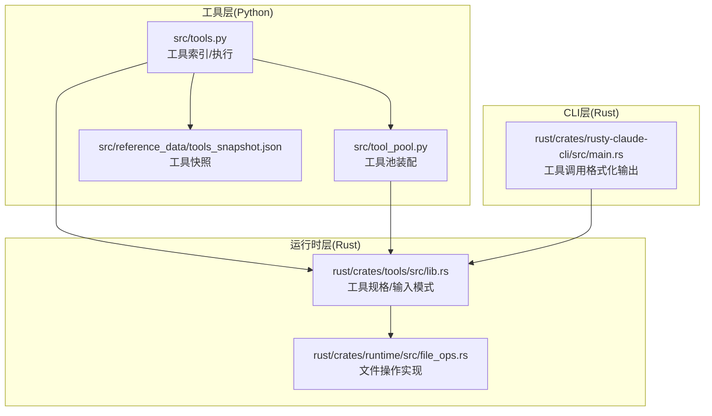
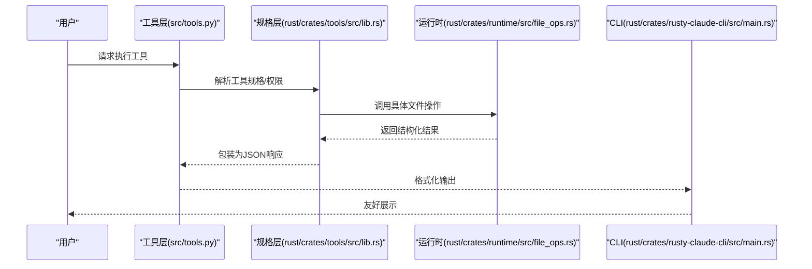
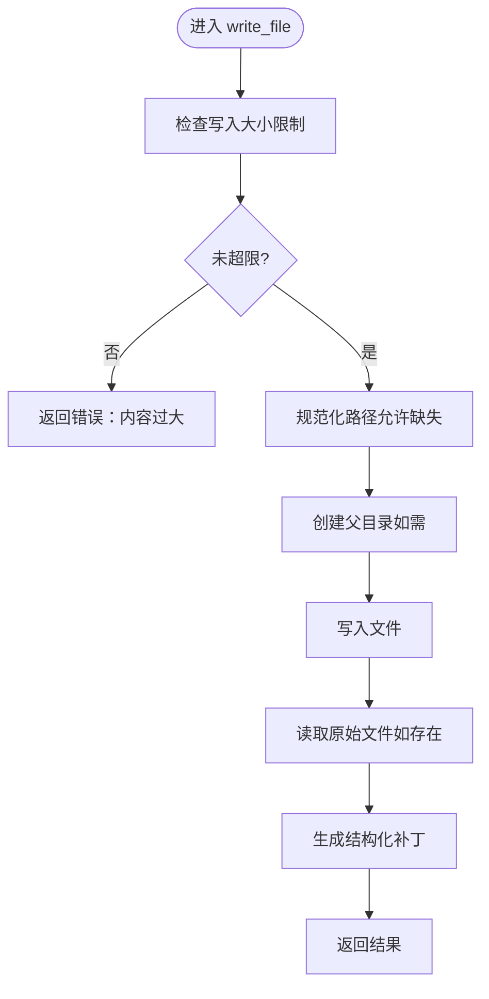
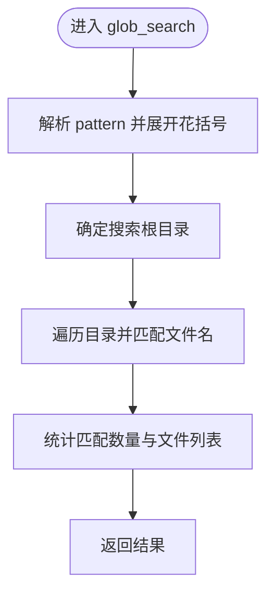
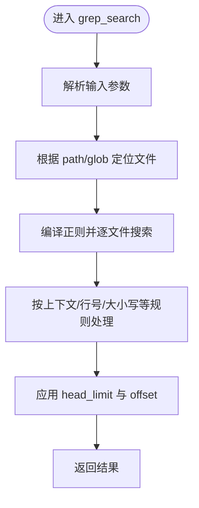
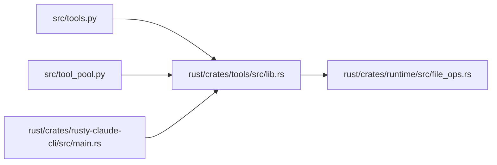

# 文件操作工具

<cite>
**本文引用的文件**
- [rust/crates/runtim/src/file_ops.rs](file://rust/crates/runtime/src/file_ops.rs)
- [rust/crates/tools/src/lib.rs](file://rust/crates/tools/src/lib.rs)
- [src/tools.py](file://src/tools.py)
- [src/tool_pool.py](file://src/tool_pool.py)
- [src/reference_data/tools_snapshot.json](file://src/reference_data/tools_snapshot.json)
- [rust/crates/rusty-claude-cli/src/main.rs](file://rust/crates/rusty-claude-cli/src/main.rs)
</cite>

## 目录
1. [简介](#简介)
2. [项目结构](#项目结构)
3. [核心组件](#核心组件)
4. [架构总览](#架构总览)
5. [详细组件分析](#详细组件分析)
6. [依赖关系分析](#依赖关系分析)
7. [性能考量](#性能考量)
8. [故障排查指南](#故障排查指南)
9. [结论](#结论)
10. [附录](#附录)

## 简介
本文件面向“文件操作工具”的使用者与维护者，系统性梳理以下能力：
- 读取文件：read_file（支持偏移与窗口化读取）
- 写入文件：write_file（全量覆盖写入，生成结构化补丁）
- 编辑文件：edit_file（字符串替换，支持单次或全部替换）
- 按通配符搜索：glob_search（支持花括号展开）
- 按正则搜索：grep_search（支持上下文、大小写、行号等）

文档涵盖参数说明、使用示例、最佳实践、路径处理、编码与权限、安全考虑、错误处理、性能优化与批量操作建议。

## 项目结构
该功能由 Rust 核心运行时与 Python 工具层共同支撑：
- 运行时层（Rust）：提供文件读写、编辑、搜索的核心实现与安全边界控制
- 工具层（Python）：提供工具索引、权限过滤、工具池装配与展示
- CLI 层（Rust）：对工具调用进行格式化输出与限制显示

**图表来源**
- [src/tools.py:1-97](file://src/tools.py#L1-L97)
- [src/tool_pool.py:1-38](file://src/tool_pool.py#L1-L38)
- [src/reference_data/tools_snapshot.json:380-579](file://src/reference_data/tools_snapshot.json#L380-L579)
- [rust/crates/tools/src/lib.rs:450-649](file://rust/crates/tools/src/lib.rs#L450-L649)
- [rust/crates/runtime/src/file_ops.rs:1-200](file://rust/crates/runtime/src/file_ops.rs#L1-L200)
- [rust/crates/rusty-claude-cli/src/main.rs:7362-7461](file://rust/crates/rusty-claude-cli/src/main.rs#L7362-L7461)

**章节来源**
- [src/tools.py:1-97](file://src/tools.py#L1-L97)
- [src/tool_pool.py:1-38](file://src/tool_pool.py#L1-L38)
- [src/reference_data/tools_snapshot.json:380-579](file://src/reference_data/tools_snapshot.json#L380-L579)
- [rust/crates/tools/src/lib.rs:450-649](file://rust/crates/tools/src/lib.rs#L450-L649)
- [rust/crates/runtime/src/file_ops.rs:1-200](file://rust/crates/runtime/src/file_ops.rs#L1-L200)
- [rust/crates/rusty-claude-cli/src/main.rs:7362-7461](file://rust/crates/rusty-claude-cli/src/main.rs#L7362-L7461)

## 核心组件
- read_file：读取文本文件，支持偏移与窗口化返回；内置二进制检测与大小限制
- write_file：全量写入，自动创建父目录；返回结构化补丁与原始文件内容
- edit_file：在文件内进行字符串替换，支持单次或全部替换；严格校验旧值存在与新旧不同
- glob_search：基于通配符的文件名搜索，支持花括号展开
- grep_search：基于正则的文件内容搜索，支持上下文、大小写、行号、头限制、偏移等

**章节来源**
- [rust/crates/runtime/src/file_ops.rs:174-255](file://rust/crates/runtime/src/file_ops.rs#L174-L255)
- [rust/crates/runtime/src/file_ops.rs:257-330](file://rust/crates/runtime/src/file_ops.rs#L257-L330)
- [rust/crates/tools/src/lib.rs:450-649](file://rust/crates/tools/src/lib.rs#L450-L649)
- [rust/crates/runtime/src/file_ops.rs:119-172](file://rust/crates/runtime/src/file_ops.rs#L119-L172)

## 架构总览
文件操作工具的调用链路如下：
- 工具层负责解析与筛选可用工具
- 规格层定义工具输入模式与权限级别
- 运行时层执行具体文件操作并返回结构化结果
- CLI 层负责格式化输出与显示限制

**图表来源**
- [src/tools.py:81-86](file://src/tools.py#L81-L86)
- [rust/crates/tools/src/lib.rs:450-649](file://rust/crates/tools/src/lib.rs#L450-L649)
- [rust/crates/runtime/src/file_ops.rs:174-255](file://rust/crates/runtime/src/file_ops.rs#L174-L255)
- [rust/crates/rusty-claude-cli/src/main.rs:7362-7461](file://rust/crates/rusty-claude-cli/src/main.rs#L7362-L7461)

## 详细组件分析

### read_file（读取文件）
- 功能概述
  - 读取文本文件内容，支持从指定偏移开始、限定行数的窗口化读取
  - 自动检测二进制文件并拒绝读取
  - 对超大文件进行限制，避免内存压力
- 关键参数
  - path：目标文件路径（相对或绝对）
  - offset：起始行偏移（可选）
  - limit：读取行数上限（可选）
- 输出结构
  - type：固定为“text”
  - file.filePath：文件绝对路径
  - file.content：窗口化内容
  - file.numLines：窗口行数
  - file.startLine：窗口起始行号（从1开始）
  - file.totalLines：文件总行数
- 安全与边界
  - 二进制检测：读取文件前检查是否包含空字节
  - 大小限制：超过最大读取大小将报错
  - 路径规范化：确保路径解析后不逃逸工作区（运行时提供边界检查函数）
- 使用示例
  - 全量读取：传入 path 即可
  - 窗口读取：传入 offset 与 limit
  - 越界读取：当 offset 超过文件长度时，返回空内容与正确起始行号
- 最佳实践
  - 优先使用窗口化读取处理大文件
  - 避免对二进制文件执行 read_file
  - 在工作区内使用相对路径，确保边界安全

**图表来源**
- [rust/crates/runtime/src/file_ops.rs:174-221](file://rust/crates/runtime/src/file_ops.rs#L174-L221)

**章节来源**
- [rust/crates/runtime/src/file_ops.rs:174-221](file://rust/crates/runtime/src/file_ops.rs#L174-L221)
- [rust/crates/runtime/src/file_ops.rs:12-26](file://rust/crates/runtime/src/file_ops.rs#L12-L26)
- [rust/crates/runtime/src/file_ops.rs:568-582](file://rust/crates/runtime/src/file_ops.rs#L568-L582)

### write_file（写入文件）
- 功能概述
  - 全量覆盖写入文件，自动创建缺失的父目录
  - 记录原始文件内容，生成结构化补丁
- 关键参数
  - path：目标文件路径
  - content：要写入的内容
- 输出结构
  - type：create 或 update
  - filePath：文件绝对路径
  - content：写入内容
  - structuredPatch：结构化补丁片段列表
  - originalFile：原始文件内容（若存在）
  - gitDiff：可选的差异信息
- 安全与边界
  - 大小限制：超过最大写入大小将报错
  - 路径规范化：允许缺失路径参与规范化
- 使用示例
  - 创建新文件：content 为全新内容
  - 更新现有文件：返回 originalFile 与补丁
- 最佳实践
  - 控制单次写入内容大小，避免超出限制
  - 对关键配置采用原子写入策略（先写临时文件再重命名）

**图表来源**
- [rust/crates/runtime/src/file_ops.rs:223-255](file://rust/crates/runtime/src/file_ops.rs#L223-L255)

**章节来源**
- [rust/crates/runtime/src/file_ops.rs:223-255](file://rust/crates/runtime/src/file_ops.rs#L223-L255)
- [rust/crates/runtime/src/file_ops.rs:584-597](file://rust/crates/runtime/src/file_ops.rs#L584-L597)

### edit_file（编辑文件）
- 功能概述
  - 在文件中进行字符串替换，支持单次替换或全部替换
  - 严格校验旧值存在且新旧不同
- 关键参数
  - path：目标文件路径
  - old_string：要被替换的旧字符串
  - new_string：新字符串
  - replace_all：是否替换所有匹配项（可选，默认 false）
- 输出结构
  - filePath、oldString、newString
  - originalFile：替换前的完整内容
  - structuredPatch：结构化补丁片段列表
  - userModified：是否检测到用户修改（可选）
  - replaceAll：实际是否执行了全部替换
  - gitDiff：可选的差异信息
- 错误处理
  - 新旧字符串相同：报错
  - 旧字符串不存在：报错
- 使用示例
  - 单次替换：replace_all=false
  - 全部替换：replace_all=true
- 最佳实践
  - 替换前先 read_file 预览上下文
  - 对关键文件使用备份策略
  - 使用更精确的定位词以减少误替换

**图表来源**
- [rust/crates/runtime/src/file_ops.rs:257-330](file://rust/crates/runtime/src/file_ops.rs#L257-L330)

**章节来源**
- [rust/crates/runtime/src/file_ops.rs:257-330](file://rust/crates/runtime/src/file_ops.rs#L257-L330)
- [rust/crates/runtime/src/file_ops.rs:599-614](file://rust/crates/runtime/src/file_ops.rs#L599-L614)

### glob_search（按通配符搜索文件）
- 功能概述
  - 基于 glob 模式查找文件名，支持递归目录扫描
  - 支持花括号展开（如 *.{rs,toml}）
- 关键参数
  - pattern：glob 模式（必需）
  - path：搜索根目录（可选）
- 输出结构
  - durationMs：耗时（毫秒）
  - numFiles：匹配文件数量
  - filenames：匹配文件名列表
  - truncated：是否截断（当结果过多时）
- 实现要点
  - 通配符解析与花括号展开
  - 目录遍历与文件名匹配
- 使用示例
  - 查找所有 .rs 文件：pattern=**/*.rs
  - 花括号展开：pattern=*.{rs,toml}
- 最佳实践
  - 合理设置 path 以缩小搜索范围
  - 对大量文件场景配合 head_limit 与分页策略

**图表来源**
- [rust/crates/runtime/src/file_ops.rs:630-650](file://rust/crates/runtime/src/file_ops.rs#L630-L650)
- [rust/crates/runtime/src/file_ops.rs:119-128](file://rust/crates/runtime/src/file_ops.rs#L119-L128)

**章节来源**
- [rust/crates/runtime/src/file_ops.rs:630-650](file://rust/crates/runtime/src/file_ops.rs#L630-L650)
- [rust/crates/runtime/src/file_ops.rs:119-128](file://rust/crates/runtime/src/file_ops.rs#L119-L128)

### grep_search（按正则表达式搜索文件内容）
- 功能概述
  - 在匹配的文件中按正则表达式搜索内容
  - 支持上下文、大小写、行号、头限制、偏移、多行模式等
- 关键参数
  - pattern：正则表达式（必需）
  - path：搜索根目录（可选）
  - glob：仅在匹配的文件中搜索（可选）
  - output_mode：输出模式（可选）
  - -B/-A/-C：前后/综合上下文行数
  - -n：显示行号
  - -i：忽略大小写
  - type：文件类型过滤（可选）
  - head_limit：最多返回的匹配数量
  - offset：偏移（跳过前若干匹配）
  - multiline：多行模式
- 输出结构
  - mode：输出模式标识
  - numFiles：涉及文件数
  - filenames：匹配文件名列表
  - content：匹配内容（可能被截断）
  - numLines：返回内容行数
  - numMatches：总匹配数
  - appliedLimit/appliedOffset：实际应用的限制与偏移
- 使用示例
  - 在特定目录与扩展名下搜索：结合 path 与 glob
  - 显示上下文：设置 -B 与 -A
  - 忽略大小写：设置 -i=true
- 最佳实践
  - 使用 head_limit 控制输出规模
  - 结合 glob 精确限定文件集合
  - 对复杂正则使用测试先行策略

**图表来源**
- [rust/crates/runtime/src/file_ops.rs:130-154](file://rust/crates/runtime/src/file_ops.rs#L130-L154)
- [rust/crates/runtime/src/file_ops.rs:156-172](file://rust/crates/runtime/src/file_ops.rs#L156-L172)

**章节来源**
- [rust/crates/tools/src/lib.rs:467-492](file://rust/crates/tools/src/lib.rs#L467-L492)
- [rust/crates/runtime/src/file_ops.rs:130-172](file://rust/crates/runtime/src/file_ops.rs#L130-L172)

## 依赖关系分析
- 工具层依赖规格层提供的工具输入模式与权限级别
- 规格层定义工具名称、描述与 JSON Schema
- 运行时层提供具体的文件操作实现与安全边界
- CLI 层负责工具调用的格式化输出与显示限制

**图表来源**
- [src/tools.py:81-86](file://src/tools.py#L81-L86)
- [src/tool_pool.py:28-37](file://src/tool_pool.py#L28-L37)
- [rust/crates/tools/src/lib.rs:450-649](file://rust/crates/tools/src/lib.rs#L450-L649)
- [rust/crates/runtime/src/file_ops.rs:174-255](file://rust/crates/runtime/src/file_ops.rs#L174-L255)
- [rust/crates/rusty-claude-cli/src/main.rs:7362-7461](file://rust/crates/rusty-claude-cli/src/main.rs#L7362-L7461)

**章节来源**
- [src/tools.py:81-86](file://src/tools.py#L81-L86)
- [src/tool_pool.py:28-37](file://src/tool_pool.py#L28-L37)
- [rust/crates/tools/src/lib.rs:450-649](file://rust/crates/tools/src/lib.rs#L450-L649)
- [rust/crates/runtime/src/file_ops.rs:174-255](file://rust/crates/runtime/src/file_ops.rs#L174-L255)
- [rust/crates/rusty-claude-cli/src/main.rs:7362-7461](file://rust/crates/rusty-claude-cli/src/main.rs#L7362-L7461)

## 性能考量
- 读取窗口化：通过 offset 与 limit 减少内存占用，适合大文件
- 正则搜索：合理设置 head_limit 与 offset，避免一次性输出过多匹配
- 花括号展开：在 glob 中使用 *.{ext1,ext2} 可减少多次调用
- 目录遍历：尽量限定 path 与 glob，减少 IO 开销
- 批量操作建议
  - 分批处理：对大量文件的 grep 与 edit，采用分页与并发（注意资源限制）
  - 缓存命中：对重复的 read_file 窗口化请求，利用缓存降低重复读取
  - 原子写入：write_file 后进行校验，必要时回滚

[本节为通用指导，无需列出具体文件来源]

## 故障排查指南
- 二进制文件无法读取
  - 现象：read_file 报错“文件为二进制”
  - 排查：确认文件类型，改用二进制处理流程或排除该文件
- 文件过大
  - 现象：read_file/write_file 报错“文件过大/内容过大”
  - 排查：使用窗口化读取或拆分写入
- 旧字符串不存在
  - 现象：edit_file 报错“未找到旧字符串”
  - 排查：先 read_file 预览上下文，确认旧字符串存在
- 新旧字符串相同
  - 现象：edit_file 报错“新旧必须不同”
  - 排查：更换新的替换内容
- 路径逃逸工作区
  - 现象：读写失败并提示“逃逸工作区边界”
  - 排查：使用相对路径或确保路径规范化后仍在工作区内
- 花括号展开异常
  - 现象：glob 搜索未匹配预期文件
  - 排查：确认花括号语法正确，或改为多个模式组合

**章节来源**
- [rust/crates/runtime/src/file_ops.rs:18-26](file://rust/crates/runtime/src/file_ops.rs#L18-L26)
- [rust/crates/runtime/src/file_ops.rs:182-201](file://rust/crates/runtime/src/file_ops.rs#L182-L201)
- [rust/crates/runtime/src/file_ops.rs:224-234](file://rust/crates/runtime/src/file_ops.rs#L224-L234)
- [rust/crates/runtime/src/file_ops.rs:266-277](file://rust/crates/runtime/src/file_ops.rs#L266-L277)
- [rust/crates/runtime/src/file_ops.rs:568-582](file://rust/crates/runtime/src/file_ops.rs#L568-L582)
- [rust/crates/runtime/src/file_ops.rs:630-650](file://rust/crates/runtime/src/file_ops.rs#L630-L650)

## 结论
文件操作工具在 Rust 运行时层提供了安全、可控、高性能的文件读写与搜索能力，并通过规格层与工具层实现清晰的职责分离与权限控制。遵循本文的参数说明、最佳实践与故障排查建议，可在保证安全的前提下高效完成文件读取、写入、编辑与搜索任务。

[本节为总结性内容，无需列出具体文件来源]

## 附录

### 工具权限与输入模式
- 工具权限
  - read_file：只读权限
  - write_file/edit_file：工作区写权限
  - glob_search/grep_search：只读权限
- 输入模式（节选）
  - read_file：path（必需），offset（可选），limit（可选）
  - write_file：path（必需），content（必需）
  - edit_file：path（必需），old_string（必需），new_string（必需），replace_all（可选）
  - glob_search：pattern（必需），path（可选）
  - grep_search：pattern（必需），path（可选），glob（可选），output_mode（可选），-B/-A/-C（可选），-n/-i（可选），type（可选），head_limit（可选），offset（可选），multiline（可选）

**章节来源**
- [rust/crates/tools/src/lib.rs:450-649](file://rust/crates/tools/src/lib.rs#L450-L649)

### 工具索引与展示
- 工具索引：通过工具快照加载工具条目
- 工具池：支持简单模式与 MCP 过滤，以及权限上下文过滤
- 工具执行：镜像调用并返回执行结果

**章节来源**
- [src/tools.py:23-86](file://src/tools.py#L23-L86)
- [src/tool_pool.py:28-37](file://src/tool_pool.py#L28-L37)
- [src/reference_data/tools_snapshot.json:380-579](file://src/reference_data/tools_snapshot.json#L380-L579)