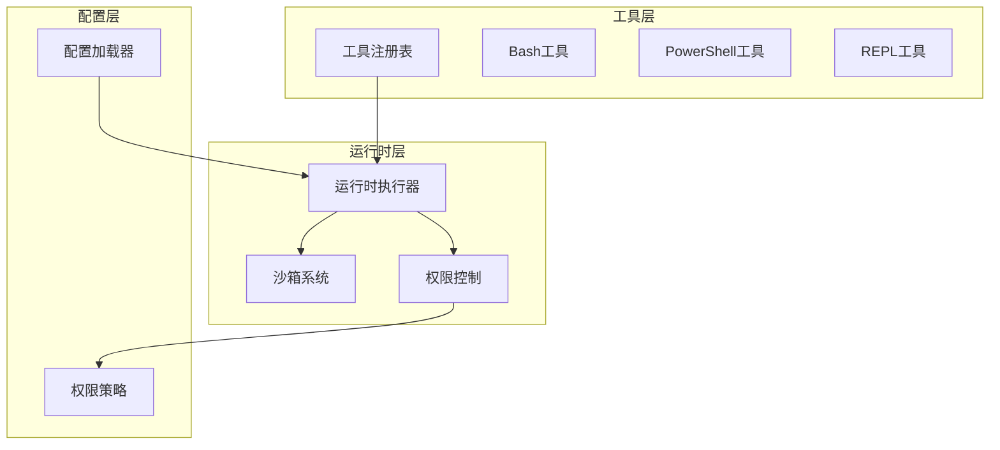
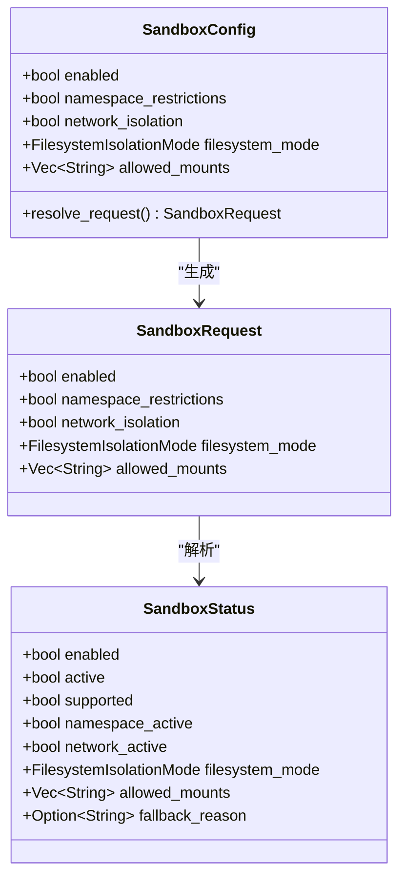
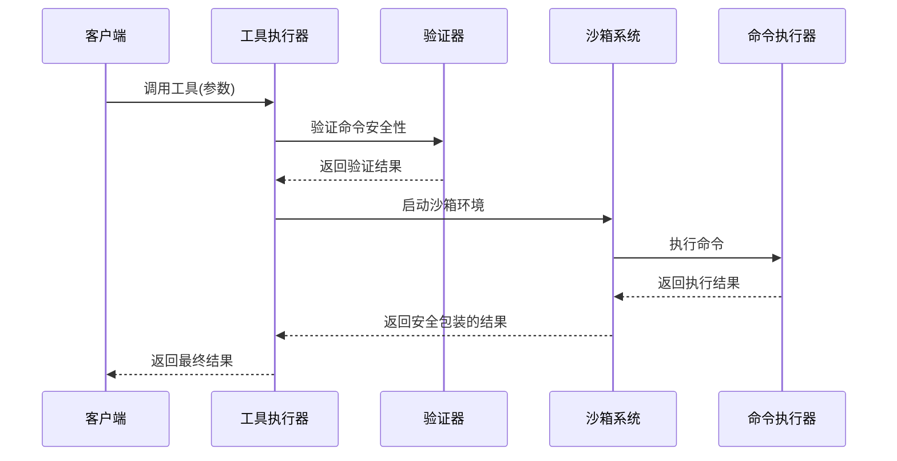
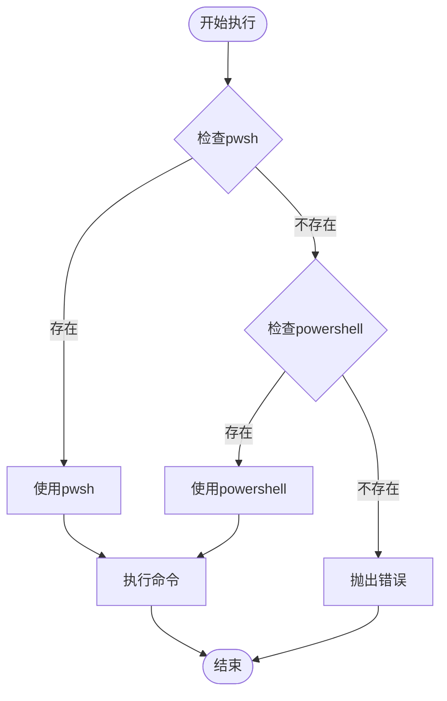
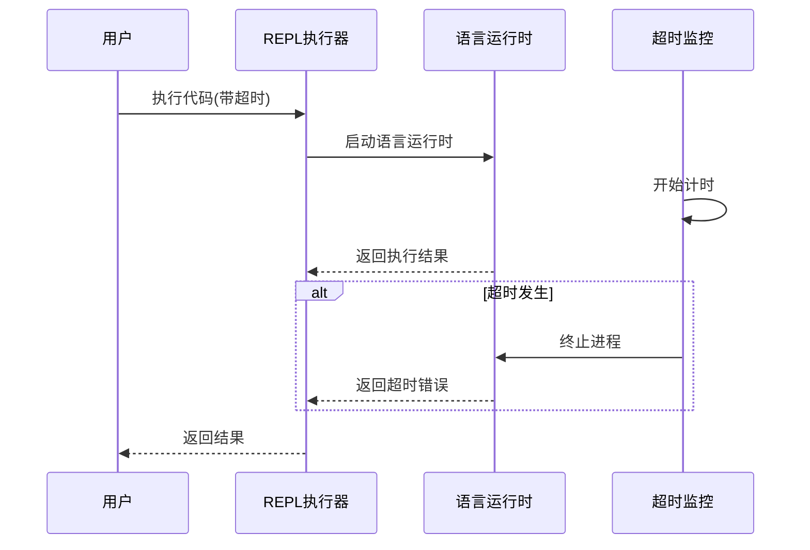
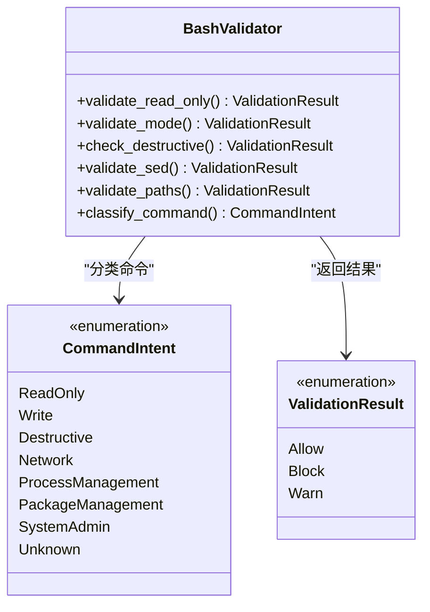
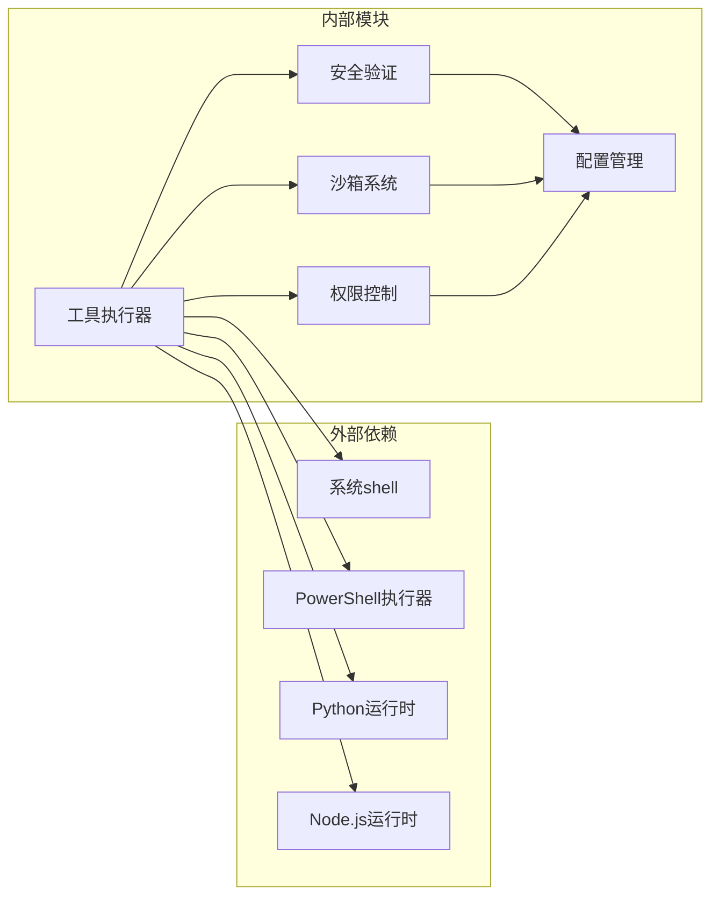

# 系统命令工具

<cite>
**本文档引用的文件**
- [bash.rs](file://rust/crates/runtime/src/bash.rs)
- [bash_validation.rs](file://rust/crates/runtime/src/bash_validation.rs)
- [sandbox.rs](file://rust/crates/runtime/src/sandbox.rs)
- [lib.rs](file://rust/crates/tools/src/lib.rs)
- [permissions.rs](file://rust/crates/runtime/src/permissions.rs)
- [permission_enforcer.rs](file://rust/crates/runtime/src/permission_enforcer.rs)
- [config.rs](file://rust/crates/runtime/src/config.rs)
- [tools_snapshot.json](file://src/reference_data/tools_snapshot.json)
</cite>

## 目录
1. [简介](#简介)
2. [项目结构](#项目结构)
3. [核心组件](#核心组件)
4. [架构概览](#架构概览)
5. [详细组件分析](#详细组件分析)
6. [依赖关系分析](#依赖关系分析)
7. [性能考虑](#性能考虑)
8. [故障排除指南](#故障排除指南)
9. [结论](#结论)

## 简介

系统命令工具是本项目的核心功能模块，提供了三种主要的命令执行能力：

- **Bash工具**：执行shell命令，支持完整的Linux/Unix命令行功能
- **PowerShell工具**：执行Windows PowerShell命令，提供跨平台兼容性
- **REPL工具**：执行各种编程语言的REPL环境，支持Python、JavaScript、Bash等

这些工具具有强大的安全机制，包括沙箱隔离、权限控制、超时管理等功能，确保在安全可控的环境中执行命令。

## 项目结构

系统命令工具分布在多个模块中，采用分层架构设计：

**图表来源**
- [lib.rs:385-728](file://rust/crates/tools/src/lib.rs#L385-L728)
- [bash.rs:1-337](file://rust/crates/runtime/src/bash.rs#L1-L337)
- [sandbox.rs:1-386](file://rust/crates/runtime/src/sandbox.rs#L1-L386)

**章节来源**
- [lib.rs:385-728](file://rust/crates/tools/src/lib.rs#L385-L728)
- [bash.rs:1-337](file://rust/crates/runtime/src/bash.rs#L1-L337)
- [sandbox.rs:1-386](file://rust/crates/runtime/src/sandbox.rs#L1-L386)

## 核心组件

### 工具注册与定义

系统定义了多种内置工具，每种工具都有明确的输入模式和权限要求：

| 工具名称 | 功能描述 | 权限级别 | 主要用途 |
|---------|----------|----------|----------|
| bash | 执行shell命令 | DangerFullAccess | 系统管理、文件操作、进程控制 |
| PowerShell | 执行PowerShell命令 | DangerFullAccess | Windows系统管理、脚本执行 |
| REPL | 代码REPL执行 | DangerFullAccess | 编程语言交互式执行 |
| read_file | 读取文件内容 | ReadOnly | 安全文件访问 |
| write_file | 写入文件内容 | WorkspaceWrite | 文件编辑操作 |

### 沙箱系统

沙箱系统提供多层安全保护：

**图表来源**
- [sandbox.rs:27-68](file://rust/crates/runtime/src/sandbox.rs#L27-L68)

**章节来源**
- [sandbox.rs:27-208](file://rust/crates/runtime/src/sandbox.rs#L27-L208)

## 架构概览

系统采用分层架构，确保安全性与功能性平衡：

**图表来源**
- [lib.rs:1193-1291](file://rust/crates/tools/src/lib.rs#L1193-L1291)
- [bash_validation.rs:594-615](file://rust/crates/runtime/src/bash_validation.rs#L594-L615)

## 详细组件分析

### Bash工具实现

Bash工具提供了完整的shell命令执行功能，包含以下特性：

#### 输入参数定义

| 参数名 | 类型 | 必需 | 描述 |
|--------|------|------|------|
| command | string | 是 | 要执行的shell命令 |
| timeout | integer | 否 | 超时时间(毫秒) |
| description | string | 否 | 命令描述信息 |
| run_in_background | boolean | 否 | 是否后台执行 |
| dangerouslyDisableSandbox | boolean | 否 | 是否禁用沙箱 |
| namespaceRestrictions | boolean | 否 | 是否启用命名空间限制 |
| isolateNetwork | boolean | 否 | 是否隔离网络 |
| filesystemMode | enum | 否 | 文件系统隔离模式 |
| allowedMounts | array | 否 | 允许挂载的路径列表 |

#### 输出结果结构

| 字段名 | 类型 | 描述 |
|--------|------|------|
| stdout | string | 标准输出内容 |
| stderr | string | 错误输出内容 |
| raw_output_path | string | 原始输出文件路径 |
| interrupted | boolean | 是否被中断 |
| background_task_id | string | 后台任务ID |
| return_code_interpretation | string | 返回码解释 |
| sandbox_status | object | 沙箱状态信息 |

**章节来源**
- [bash.rs:18-67](file://rust/crates/runtime/src/bash.rs#L18-L67)

### PowerShell工具实现

PowerShell工具提供跨平台的Windows PowerShell执行能力：

#### 自动检测机制

系统会自动检测可用的PowerShell执行环境：

**图表来源**
- [lib.rs:5901-5912](file://rust/crates/tools/src/lib.rs#L5901-L5912)

#### 权限分类机制

PowerShell命令根据其安全性自动分类：

| 命令类型 | 示例命令 | 权限级别 | 说明 |
|----------|----------|----------|------|
| 只读命令 | Get-Content, Get-ChildItem | WorkspaceWrite | 仅读取文件内容 |
| 危险命令 | Set-Content, Remove-Item | DangerFullAccess | 可修改文件系统 |
| 系统命令 | Restart-Service, Stop-Process | DangerFullAccess | 系统级操作 |

**章节来源**
- [lib.rs:2156-2185](file://rust/crates/tools/src/lib.rs#L2156-L2185)

### REPL工具实现

REPL工具支持多种编程语言的交互式执行：

#### 支持的语言环境

| 语言 | 运行时程序 | 参数 | 使用场景 |
|------|------------|------|----------|
| Python | python3/python | -c | Python代码执行 |
| JavaScript | node | -e | JavaScript代码执行 |
| Bash | bash/sh | -lc | Shell命令执行 |

#### 超时控制机制

REPL执行支持精确的超时控制：

**图表来源**
- [lib.rs:5486-5538](file://rust/crates/tools/src/lib.rs#L5486-L5538)

**章节来源**
- [lib.rs:5486-5564](file://rust/crates/tools/src/lib.rs#L5486-L5564)

### 安全验证系统

系统实现了多层次的安全验证机制：

#### 命令分类体系

**图表来源**
- [bash_validation.rs:16-575](file://rust/crates/runtime/src/bash_validation.rs#L16-L575)

#### 验证流程

系统按照以下顺序执行安全验证：

1. **只读模式验证**：检查命令是否允许在只读模式下执行
2. **SED表达式验证**：验证sed命令的安全性
3. **破坏性警告**：识别潜在危险命令
4. **路径验证**：检查命令中的路径安全性

**章节来源**
- [bash_validation.rs:594-615](file://rust/crates/runtime/src/bash_validation.rs#L594-L615)

## 依赖关系分析

系统命令工具的依赖关系体现了清晰的分层设计：

**图表来源**
- [lib.rs:1-35](file://rust/crates/tools/src/lib.rs#L1-L35)
- [bash.rs:1-15](file://rust/crates/runtime/src/bash.rs#L1-L15)

**章节来源**
- [lib.rs:1-35](file://rust/crates/tools/src/lib.rs#L1-L35)
- [bash.rs:1-15](file://rust/crates/runtime/src/bash.rs#L1-L15)

## 性能考虑

### 资源限制

系统通过多种机制控制资源使用：

- **输出大小限制**：默认16KB，防止内存溢出
- **超时控制**：可配置的执行超时时间
- **沙箱隔离**：限制文件系统和网络访问
- **权限控制**：基于模式的权限分级

### 性能优化

- **异步执行**：支持后台任务执行
- **进程池管理**：复用语言运行时进程
- **缓存机制**：缓存常用配置和验证结果
- **流式输出**：实时处理命令输出

## 故障排除指南

### 常见问题及解决方案

#### 沙箱启动失败

**症状**：沙箱无法启动或功能受限
**原因**：
- 系统不支持用户命名空间
- 缺少必要的系统权限
- 配置参数不正确

**解决方案**：
1. 检查系统是否支持`unshare`功能
2. 验证用户命名空间权限
3. 查看沙箱状态报告

#### 命令执行超时

**症状**：命令执行超过预期时间
**原因**：
- 命令本身执行时间过长
- 系统负载过高
- 网络I/O阻塞

**解决方案**：
1. 增加超时时间设置
2. 优化命令执行逻辑
3. 检查系统资源使用情况

#### 权限不足错误

**症状**：命令执行被拒绝
**原因**：
- 当前权限模式不允许执行
- 命令属于高风险类别
- 配置规则限制

**解决方案**：
1. 检查当前权限模式
2. 修改配置规则
3. 使用适当的权限级别

**章节来源**
- [bash.rs:288-337](file://rust/crates/runtime/src/bash.rs#L288-L337)
- [sandbox.rs:162-208](file://rust/crates/runtime/src/sandbox.rs#L162-L208)

## 结论

系统命令工具提供了强大而安全的命令执行能力，通过以下关键特性确保系统的稳定性和安全性：

1. **多层安全保护**：沙箱隔离、权限控制、命令验证
2. **跨平台兼容**：支持Bash、PowerShell、REPL等多种执行环境
3. **灵活的配置选项**：可定制的沙箱设置和权限策略
4. **完善的监控机制**：超时控制、资源限制、状态报告

这些工具为开发者提供了安全可靠的命令执行环境，既保证了功能的完整性，又确保了系统的安全性。