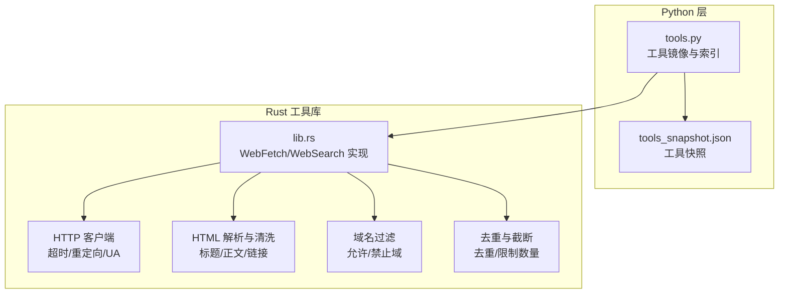
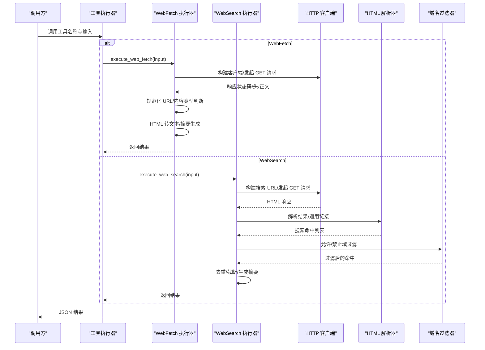
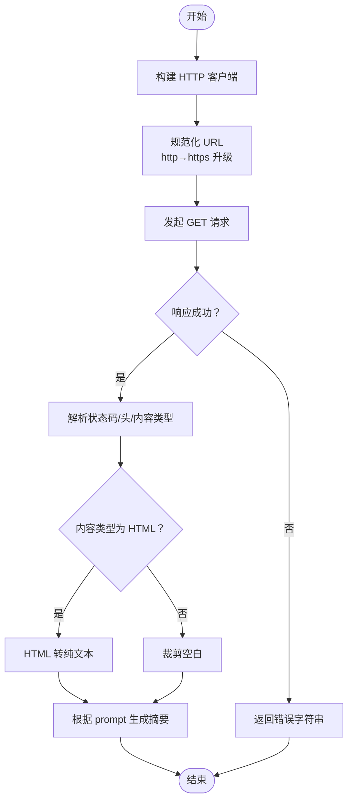
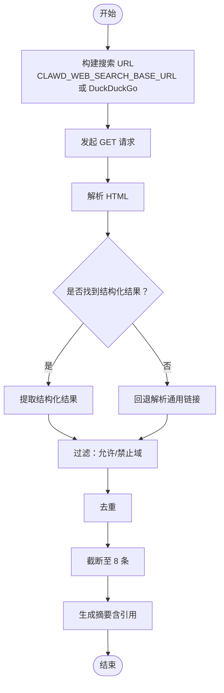
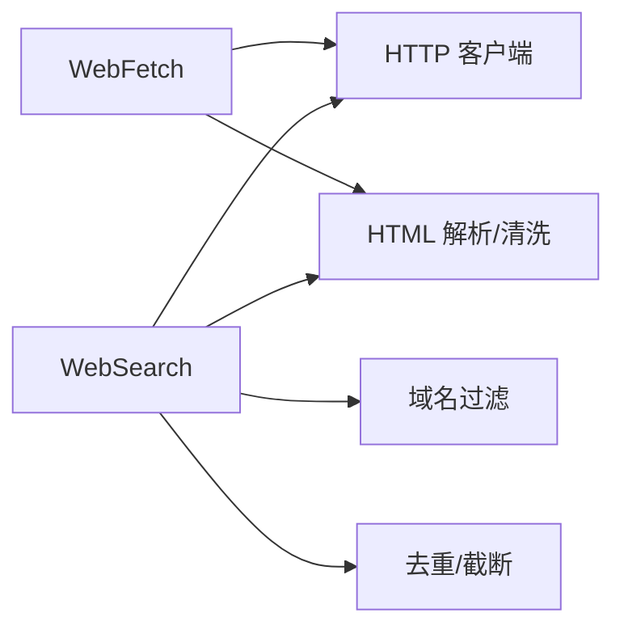

# 网络工具

<cite>
**本文档引用的文件**
- [lib.rs](file://rust/crates/tools/src/lib.rs)
- [tools.py](file://src/tools.py)
- [tools_snapshot.json](file://src/reference_data/tools_snapshot.json)
</cite>

## 目录
1. [简介](#简介)
2. [项目结构](#项目结构)
3. [核心组件](#核心组件)
4. [架构总览](#架构总览)
5. [详细组件分析](#详细组件分析)
6. [依赖分析](#依赖分析)
7. [性能考量](#性能考量)
8. [故障排查指南](#故障排查指南)
9. [结论](#结论)
10. [附录](#附录)

## 简介
本文件系统性地介绍网络访问与搜索工具，重点覆盖两类能力：
- WebFetch：抓取指定 URL 的网页内容，并基于用户提示进行摘要或问答
- WebSearch：对当前信息进行网络搜索，返回带来源引用的结果列表

文档将从架构、数据流、处理逻辑、集成点、错误处理、性能特征等方面进行深入解析，并给出参数说明、使用示例、最佳实践、安全注意事项、速率限制、缓存策略与错误处理方法。

## 项目结构
网络工具主要实现在 Rust 工具库中，同时在 Python 层提供工具镜像与索引能力：
- Rust 实现：网络抓取与搜索的核心逻辑、HTTP 客户端配置、URL 规范化、HTML 解析与去重、域名过滤等
- Python 镜像：工具清单加载、工具名称匹配、权限上下文过滤、工具执行占位与消息渲染
- 工具快照：记录已镜像的工具集合，包含 WebFetchTool 与 WebSearchTool

图表来源
- [lib.rs](file://rust/crates/tools/src/lib.rs)
- [tools.py](file://src/tools.py)
- [tools_snapshot.json](file://src/reference_data/tools_snapshot.json)

章节来源
- [lib.rs](file://rust/crates/tools/src/lib.rs)
- [tools.py](file://src/tools.py)
- [tools_snapshot.json](file://src/reference_data/tools_snapshot.json)

## 核心组件
- WebFetch 工具
  - 输入：url（URI）、prompt（字符串）
  - 输出：状态码、响应头类型、字节数、耗时、最终 URL、摘要结果
  - 关键流程：构建 HTTP 客户端 → 规范化 URL（http 自动升级到 https）→ 发起请求 → 提取内容类型 → 文本标准化（HTML 转纯文本）→ 摘要生成（根据 prompt 决定标题/摘要/预览）
- WebSearch 工具
  - 输入：query（查询词，最小长度 2）、allowed_domains（允许域数组）、blocked_domains（禁止域数组）
  - 输出：查询词、结果数组（包含“评论”和“搜索结果块”）、耗时
  - 关键流程：构建搜索 URL（支持环境变量自定义基地址）→ 抓取 HTML → 解析结果（优先解析特定结构，回退解析通用链接）→ 域名过滤（允许/禁止）→ 去重与截断（最多 8 条）→ 生成可引用的 Markdown 列表

章节来源
- [lib.rs](file://rust/crates/tools/src/lib.rs)

## 架构总览
下图展示 WebFetch/WebSearch 的调用链路与关键处理步骤：

图表来源
- [lib.rs](file://rust/crates/tools/src/lib.rs)

## 详细组件分析

### WebFetch 组件分析
- 功能概述
  - 抓取指定 URL，自动将 http 升级为 https（本地回环除外），解析响应头与内容类型，将 HTML 转换为可读文本，按用户 prompt 生成摘要或标题/摘要/预览组合
- 关键函数与职责
  - execute_web_fetch：主流程控制，负责客户端构建、URL 规范化、请求发送、响应处理、内容标准化与摘要生成
  - build_http_client：统一的 HTTP 客户端配置（超时、重定向策略、User-Agent）
  - normalize_fetch_url：URL 解析与 http→https 升级规则
  - normalize_fetched_content：HTML 内容转纯文本；非 HTML 类型直接裁剪空白
  - summarize_web_fetch：根据 prompt 内容决定输出策略（标题、摘要、预览）
  - extract_title：优先从 HTML 标题提取，否则取首行非空文本
  - html_to_text：HTML 标签剥离、实体解码、空白折叠
  - collapse_whitespace：连续空白折叠为单个空格
  - preview_text：按字符数截断并添加省略号
- 数据结构
  - WebFetchInput：url、prompt
  - WebFetchOutput：bytes、code、code_text、result、duration_ms、url
- 错误处理
  - URL 解析失败、HTTP 请求失败、响应体读取失败、内容类型解析失败等均转换为字符串错误返回
- 性能特征
  - 默认超时 20 秒，最大重定向 10 次，避免长时间阻塞
  - HTML 转文本采用线性扫描，时间复杂度 O(n)，空间复杂度 O(n)
- 使用示例（路径参考）
  - 测试用例展示了 HTML 页面抓取、纯文本页面抓取、无效 URL 处理等场景
  - 参考测试路径：[lib.rs](file://rust/crates/tools/src/lib.rs)

图表来源
- [lib.rs](file://rust/crates/tools/src/lib.rs)

章节来源
- [lib.rs](file://rust/crates/tools/src/lib.rs)

### WebSearch 组件分析
- 功能概述
  - 通过 DuckDuckGo HTML 接口或自定义搜索基地址抓取搜索结果，解析标题与链接，支持允许/禁止域名过滤，去重与截断，最终生成带引用的 Markdown 列表
- 关键函数与职责
  - execute_web_search：主流程控制，构建搜索 URL、抓取 HTML、解析命中、过滤、去重、截断与摘要生成
  - build_search_url：优先读取环境变量 CLAWD_WEB_SEARCH_BASE_URL，否则使用 DuckDuckGo HTML 接口
  - extract_search_hits：解析特定结构的搜索结果（result__a 标签）
  - extract_search_hits_from_generic_links：回退解析通用链接（<a> 标签）
  - decode_duckduckgo_redirect：处理 DuckDuckGo 重定向链接（//、/l/ 等）
  - host_matches_list：域名匹配（大小写不敏感，支持子域）
  - normalize_domain_filter：标准化域名过滤项（去除前缀/后缀）
  - dedupe_hits：基于 URL 去重
  - WebSearchInput：query、allowed_domains、blocked_domains
  - WebSearchOutput：query、results（评论 + 搜索结果块）、duration_seconds
- 结果格式
  - results 包含两部分：Commentary（汇总说明）与 SearchResult（SearchHit 数组）
  - SearchHit：title、url
- 使用示例（路径参考）
  - 测试用例展示了自定义搜索基地址、允许/禁止域过滤、通用链接解析、无效基地址回退等场景
  - 参考测试路径：[lib.rs](file://rust/crates/tools/src/lib.rs)

图表来源
- [lib.rs](file://rust/crates/tools/src/lib.rs)

章节来源
- [lib.rs](file://rust/crates/tools/src/lib.rs)

### Python 工具镜像与索引
- 工具镜像
  - 加载 tools_snapshot.json，提供工具名称、来源提示与职责描述
  - 支持按名称查找、权限上下文过滤、简单模式筛选
- 工具执行
  - execute_tool：根据工具名称返回“镜像占位”执行结果（用于演示与兼容）
- 工具快照
  - 包含 WebFetchTool 与 WebSearchTool 的镜像条目，便于在 Python 层识别与展示

章节来源
- [tools.py](file://src/tools.py)
- [tools_snapshot.json](file://src/reference_data/tools_snapshot.json)

## 依赖分析
- 组件耦合
  - WebFetch/WebSearch 共享 HTTP 客户端配置（超时、重定向、User-Agent）
  - HTML 解析与清洗逻辑被两者复用
  - 域名过滤与去重策略独立于具体工具，降低耦合
- 外部依赖
  - HTTP 客户端（reqwest）
  - HTML 解析与实体解码
  - 环境变量（CLAWD_WEB_SEARCH_BASE_URL、CLAWD_TODO_STORE 等）
- 循环依赖
  - 当前实现未发现循环依赖

图表来源
- [lib.rs](file://rust/crates/tools/src/lib.rs)

章节来源
- [lib.rs](file://rust/crates/tools/src/lib.rs)

## 性能考量
- 超时与重定向
  - 默认超时 20 秒，最大重定向 10 次，避免长时间等待与无限跳转
- 内容处理
  - HTML 转文本采用线性扫描，适合中等规模页面；大体积页面建议配合 prompt 控制摘要长度
- 结果规模
  - 搜索结果默认去重并截断至 8 条，平衡召回与可读性
- 并发与缓存
  - 当前实现为同步请求；如需高并发，可在上层引入连接池与缓存策略（例如基于 URL 的 TTL 缓存）

## 故障排查指南
- URL 相关
  - 无效 URL：URL 解析失败会返回错误字符串
  - http 非本地升级：http 会被自动升级为 https（本地回环除外）
- 搜索相关
  - 自定义基地址无效：回退到 DuckDuckGo HTML 接口
  - 无结构化结果：自动回退解析通用链接
  - 域名过滤后为空：检查 allowed_domains/block_domains 是否过于严格
- 内容相关
  - HTML 标题缺失：回退到首行非空文本
  - 非 HTML 内容：直接裁剪空白
- 错误处理
  - 所有底层错误转换为字符串返回，便于上层统一处理
  - 建议在调用方记录原始错误与最终 JSON 输出，便于定位问题

章节来源
- [lib.rs](file://rust/crates/tools/src/lib.rs)

## 结论
本网络工具集提供了稳定的网页抓取与网络搜索能力：
- WebFetch 专注于单页内容的抽取与摘要，具备 URL 规范化、内容类型识别与智能摘要生成
- WebSearch 提供当前信息检索，支持自定义搜索基地址、域名过滤、去重与引用格式化
- 在安全性方面，工具内置 http→https 升级、域名白名单/黑名单、严格的 HTML 解析与实体解码，有效降低风险
- 在性能方面，统一的超时与重定向策略确保稳定性；建议在上层引入缓存与并发优化以提升吞吐

## 附录

### 参数说明与使用示例

- WebFetch
  - 参数
    - url：目标 URL（URI）
    - prompt：对内容的提问或摘要指令
  - 示例（路径参考）
    - HTML 页面抓取与标题提取：[lib.rs](file://rust/crates/tools/src/lib.rs)
    - 纯文本页面抓取：[lib.rs](file://rust/crates/tools/src/lib.rs)
    - 无效 URL 处理：[lib.rs](file://rust/crates/tools/src/lib.rs)

- WebSearch
  - 参数
    - query：查询词（最小长度 2）
    - allowed_domains：允许的域名数组（可选）
    - blocked_domains：禁止的域名数组（可选）
  - 示例（路径参考）
    - 自定义搜索基地址与域名过滤：[lib.rs](file://rust/crates/tools/src/lib.rs)
    - 通用链接解析与回退：[lib.rs](file://rust/crates/tools/src/lib.rs)

### 最佳实践
- URL 处理
  - 优先使用 HTTPS；仅在本地开发时允许 http
  - 对外部输入进行严格校验与白名单过滤
- 内容提取
  - 使用明确的 prompt 指导摘要方向（标题/摘要/预览）
  - 对长文本结合 prompt 控制输出长度
- 搜索集成
  - 优先使用稳定可靠的搜索基地址；必要时启用回退解析
  - 合理设置 allowed_domains/block_domains，避免无关站点污染
- 引用格式
  - 保持 Markdown 列表格式，便于下游渲染与溯源
- 安全与合规
  - 避免抓取敏感或受版权保护的内容
  - 尊重 robots.txt 与服务条款
- 速率限制与缓存
  - 控制请求频率，避免触发服务端限流
  - 对热点 URL 建立短期缓存，减少重复抓取
- 错误处理
  - 记录原始错误与响应详情，便于诊断
  - 对可恢复错误进行重试与退避