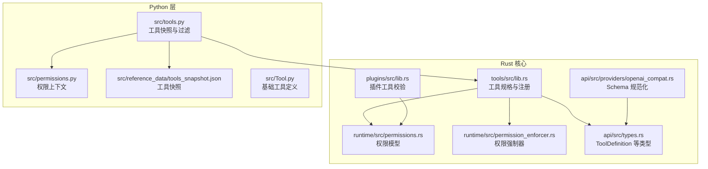
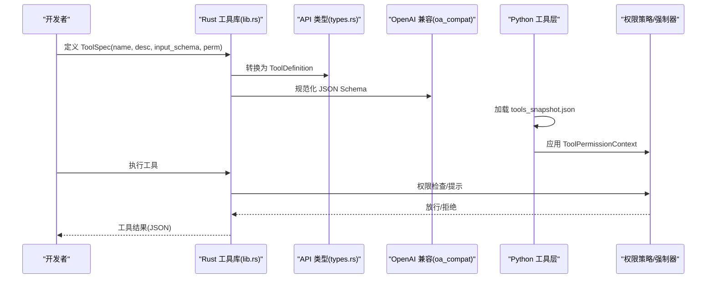
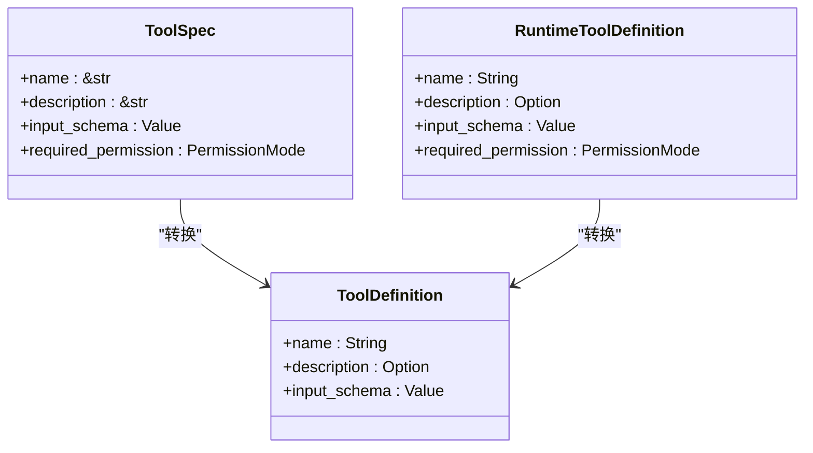
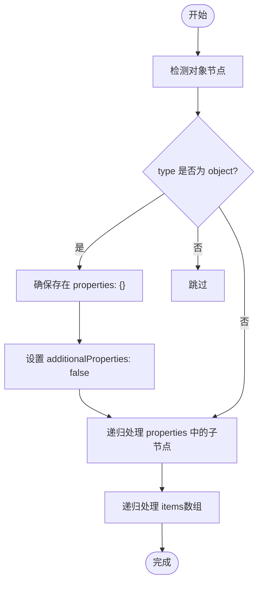
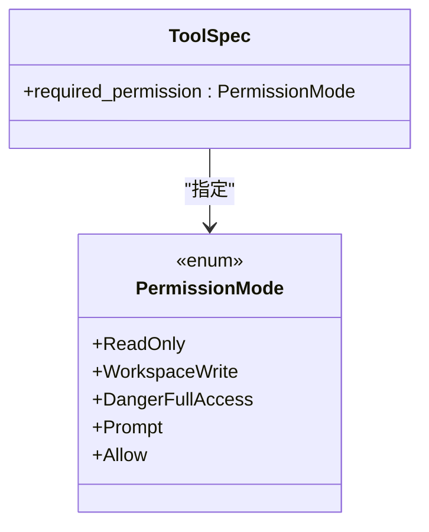
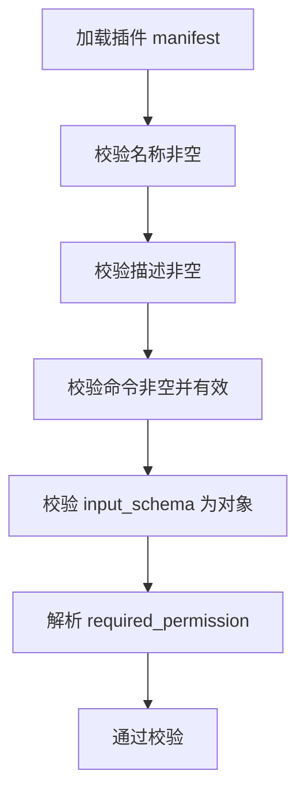
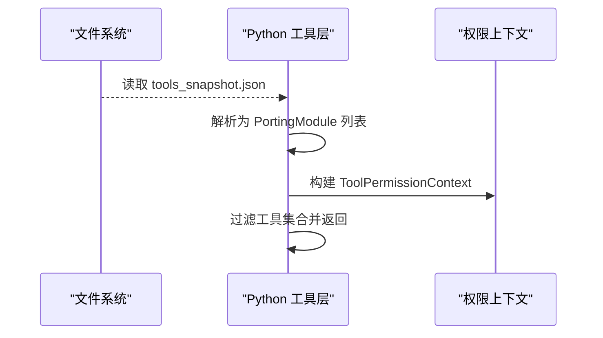
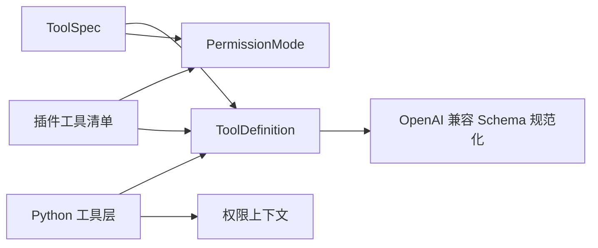

# 工具定义规范

<cite>
**本文引用的文件**
- [rust\crates\tools\src\lib.rs](file://rust/crates/tools/src/lib.rs)
- [rust\crates\api\src\types.rs](file://rust/crates/api/src/types.rs)
- [rust\crates\api\src\providers\openai_compat.rs](file://rust/crates/api/src/providers/openai_compat.rs)
- [rust\crates\runtime\src\permissions.rs](file://rust/crates/runtime/src/permissions.rs)
- [rust\crates\runtime\src\permission_enforcer.rs](file://rust/crates/runtime/src/permission_enforcer.rs)
- [rust\crates\plugins\src\lib.rs](file://rust/crates/plugins/src/lib.rs)
- [src\permissions.py](file://src/permissions.py)
- [src\tools.py](file://src/tools.py)
- [src\reference_data\tools_snapshot.json](file://src/reference_data/tools_snapshot.json)
- [src\Tool.py](file://src/Tool.py)
</cite>

## 目录
1. [简介](#简介)
2. [项目结构](#项目结构)
3. [核心组件](#核心组件)
4. [架构总览](#架构总览)
5. [详细组件分析](#详细组件分析)
6. [依赖分析](#依赖分析)
7. [性能考虑](#性能考虑)
8. [故障排查指南](#故障排查指南)
9. [结论](#结论)
10. [附录](#附录)

## 简介
本文件系统化阐述工具定义规范，围绕 ToolSpec 结构体的设计理念与实现细节展开，涵盖名称、描述、输入模式与权限要求的定义方式；详解 JSON Schema 编写规范（属性、必需字段、数据类型与约束）；给出工具定义最佳实践（命名、描述、参数设计）；解释工具分类与权限级别映射；并提供从简单文件操作到复杂系统命令的完整示例路径。

## 项目结构
该仓库采用多语言混合架构：Rust 实现核心运行时、权限策略与工具注册表；Python 提供工具镜像与权限上下文；JSON 快照记录工具清单。关键模块如下：
- Rust 运行时与工具框架：工具注册、执行、权限评估、MCP 集成
- API 类型与兼容层：统一工具定义结构与 OpenAI 兼容处理
- 插件系统：插件工具清单校验与权限解析
- Python 层：工具快照加载、权限上下文过滤、工具索引与执行代理

图表来源
- [rust\crates\tools\src\lib.rs:100-121](file://rust/crates/tools/src/lib.rs#L100-L121)
- [rust\crates\api\src\types.rs:104-110](file://rust/crates/api/src/types.rs#L104-L110)
- [rust\crates\api\src\providers\openai_compat.rs:1008-1033](file://rust/crates/api/src/providers/openai_compat.rs#L1008-L1033)
- [rust\crates\runtime\src\permissions.rs:7-28](file://rust/crates/runtime/src/permissions.rs#L7-L28)
- [rust\crates\plugins\src\lib.rs:1784-1850](file://rust/crates/plugins/src/lib.rs#L1784-L1850)
- [src\tools.py:11-37](file://src/tools.py#L11-L37)
- [src\permissions.py:6-21](file://src/permissions.py#L6-L21)

章节来源
- [rust\crates\tools\src\lib.rs:100-121](file://rust/crates/tools/src/lib.rs#L100-L121)
- [rust\crates\api\src\types.rs:104-110](file://rust/crates/api/src/types.rs#L104-L110)
- [rust\crates\api\src\providers\openai_compat.rs:1008-1033](file://rust/crates/api/src/providers/openai_compat.rs#L1008-L1033)
- [rust\crates\runtime\src\permissions.rs:7-28](file://rust/crates/runtime/src/permissions.rs#L7-L28)
- [rust\crates\plugins\src\lib.rs:1784-1850](file://rust/crates/plugins/src/lib.rs#L1784-L1850)
- [src\tools.py:11-37](file://src/tools.py#L11-L37)
- [src\permissions.py:6-21](file://src/permissions.py#L6-L21)

## 核心组件
- ToolSpec：内置工具规格，包含名称、描述、输入 JSON Schema、所需权限级别
- ToolDefinition：对外暴露的工具定义结构，用于工具列表与调用
- PermissionMode：权限级别枚举（只读、工作区写、危险全权、提示、允许）
- PermissionPolicy/PermissionEnforcer：权限策略与强制执行器
- PluginToolManifest：插件工具清单，含输入 Schema 与权限字符串
- Python 工具快照与权限上下文：工具清单加载、过滤与权限屏蔽

章节来源
- [rust\crates\tools\src\lib.rs:100-121](file://rust/crates/tools/src/lib.rs#L100-L121)
- [rust\crates\api\src\types.rs:104-110](file://rust/crates/api/src/types.rs#L104-L110)
- [rust\crates\runtime\src\permissions.rs:7-28](file://rust/crates/runtime/src/permissions.rs#L7-L28)
- [rust\crates\plugins\src\lib.rs:1784-1850](file://rust/crates/plugins/src/lib.rs#L1784-L1850)
- [src\tools.py:23-37](file://src/tools.py#L23-L37)
- [src\permissions.py:6-21](file://src/permissions.py#L6-L21)

## 架构总览
工具定义贯穿“声明—校验—注册—执行—权限控制”流程。Rust 定义 ToolSpec 并生成 ToolDefinition；Python 加载快照并按权限上下文过滤；插件工具在加载阶段进行 Schema 与权限校验；执行前由 PermissionEnforcer 基于 Policy 决策是否放行或提示。

图表来源
- [rust\crates\tools\src\lib.rs:246-278](file://rust/crates/tools/src/lib.rs#L246-L278)
- [rust\crates\api\src\types.rs:104-110](file://rust/crates/api/src/types.rs#L104-L110)
- [rust\crates\api\src\providers\openai_compat.rs:1008-1033](file://rust/crates/api/src/providers/openai_compat.rs#L1008-L1033)
- [src\tools.py:56-73](file://src/tools.py#L56-L73)
- [rust\crates\runtime\src\permission_enforcer.rs:41-66](file://rust/crates/runtime/src/permission_enforcer.rs#L41-L66)

## 详细组件分析

### ToolSpec 设计理念与字段语义
- 名称：工具唯一标识，建议使用小写下划线风格，便于规范化与别名映射
- 描述：简明扼要说明工具用途，支持搜索与展示
- 输入模式：以 JSON Schema 表达参数结构，严格声明属性、类型、约束与必填项
- 权限要求：基于 PermissionMode 指定最小权限级别，决定执行前的策略评估与交互

图表来源
- [rust\crates\tools\src\lib.rs:100-121](file://rust/crates/tools/src/lib.rs#L100-L121)
- [rust\crates\api\src\types.rs:104-110](file://rust/crates/api/src/types.rs#L104-L110)

章节来源
- [rust\crates\tools\src\lib.rs:100-121](file://rust/crates/tools/src/lib.rs#L100-L121)
- [rust\crates\api\src\types.rs:104-110](file://rust/crates/api/src/types.rs#L104-L110)

### JSON Schema 编写规范
- 对象节点必须包含 properties 字段（至少为空对象），且 additionalProperties 默认为 false
- 明确声明每个属性的数据类型（如 string、integer、boolean、array、object）
- 使用 required 列出必需字段
- 使用格式约束（如 format、minLength、minimum、enum）表达业务约束
- 数组元素通过 items 指定元素类型
- 嵌套对象递归应用上述规则

图表来源
- [rust\crates\api\src\providers\openai_compat.rs:1008-1033](file://rust/crates/api/src/providers/openai_compat.rs#L1008-L1033)

章节来源
- [rust\crates\api\src\providers\openai_compat.rs:1008-1033](file://rust/crates/api/src/providers/openai_compat.rs#L1008-L1033)

### 工具分类与权限级别映射
- 只读类：文件读取、搜索、网络抓取等不修改状态的操作
- 工作区写类：文件写入、编辑、任务更新等对工作区有副作用的操作
- 危险全权类：系统命令执行、代理服务器工具等高风险操作
- 提示/允许：策略可配置为交互式确认或直接放行

图表来源
- [rust\crates\runtime\src\permissions.rs:7-28](file://rust/crates/runtime/src/permissions.rs#L7-L28)
- [rust\crates\tools\src\lib.rs:100-106](file://rust/crates/tools/src/lib.rs#L100-L106)

章节来源
- [rust\crates\runtime\src\permissions.rs:7-28](file://rust/crates/runtime/src/permissions.rs#L7-L28)
- [rust\crates\tools\src\lib.rs:100-106](file://rust/crates/tools/src/lib.rs#L100-L106)

### 插件工具清单校验与权限解析
- 插件工具清单中每个工具需满足：非空名称、非空描述、非空命令、input_schema 为对象、required_permission 可解析
- 插件权限字符串映射到 PermissionMode

图表来源
- [rust\crates\plugins\src\lib.rs:1784-1850](file://rust/crates/plugins/src/lib.rs#L1784-L1850)

章节来源
- [rust\crates\plugins\src\lib.rs:1784-1850](file://rust/crates/plugins/src/lib.rs#L1784-L1850)

### Python 工具快照与权限上下文
- 从 tools_snapshot.json 加载工具快照，构建工具集合
- 支持按名称/前缀屏蔽工具，形成 ToolPermissionContext
- 提供工具检索、过滤与执行代理

图表来源
- [src\tools.py:23-37](file://src/tools.py#L23-L37)
- [src\permissions.py:6-21](file://src/permissions.py#L6-L21)
- [src\reference_data\tools_snapshot.json:1-50](file://src/reference_data/tools_snapshot.json#L1-L50)

章节来源
- [src\tools.py:23-37](file://src/tools.py#L23-L37)
- [src\permissions.py:6-21](file://src/permissions.py#L6-L21)
- [src\reference_data\tools_snapshot.json:1-50](file://src/reference_data/tools_snapshot.json#L1-L50)

### 工具定义最佳实践
- 命名约定
  - 使用小写下划线风格，避免连字符与空格
  - 保持语义清晰，避免歧义
  - 支持别名映射（如 read/write/edit/glob/grep）
- 描述编写
  - 简洁明确地说明工具用途与边界
  - 避免技术术语堆砌，突出用户价值
- 输入参数设计
  - 明确必需字段，减少歧义
  - 使用 format、enum、minimum、maxLength 等约束
  - 对高风险参数（如系统命令）增加额外校验与提示
- 权限分配
  - 仅授予完成任务所需的最小权限
  - 对可能破坏性操作使用危险全权并配合提示
- JSON Schema
  - 对象节点必须包含 properties 与 additionalProperties=false
  - 递归规范化嵌套结构
  - 为数组元素提供 items 类型

章节来源
- [rust\crates\tools\src\lib.rs:370-381](file://rust/crates/tools/src/lib.rs#L370-L381)
- [rust\crates\api\src\providers\openai_compat.rs:1008-1033](file://rust/crates/api/src/providers/openai_compat.rs#L1008-L1033)
- [rust\crates\plugins\src\lib.rs:1822-1826](file://rust/crates/plugins/src/lib.rs#L1822-L1826)

### 工具定义示例（路径）
以下示例均来自代码库中的实际定义，提供从简单到复杂的参考路径：

- Bash 工具（系统命令执行）
  - 规格定义路径：[rust\crates\tools\src\lib.rs:385-407](file://rust/crates/tools/src/lib.rs#L385-L407)
  - Schema 关键点：command 必填、timeout、description、run_in_background、沙箱与隔离选项、文件系统模式与挂载白名单
  - 权限级别：危险全权

- 文件读取工具
  - 规格定义路径：[rust\crates\tools\src\lib.rs:408-422](file://rust/crates/tools/src/lib.rs#L408-L422)
  - Schema 关键点：path 必填、offset、limit
  - 权限级别：只读

- 文件写入工具
  - 规格定义路径：[rust\crates\tools\src\lib.rs:423-436](file://rust/crates/tools/src/lib.rs#L423-L436)
  - Schema 关键点：path、content 必填
  - 权限级别：工作区写

- 文件编辑工具
  - 规格定义路径：[rust\crates\tools\src\lib.rs:437-452](file://rust/crates/tools/src/lib.rs#L437-L452)
  - Schema 关键点：path、old_string、new_string 必填、replace_all
  - 权限级别：工作区写

- Glob 搜索工具
  - 规格定义路径：[rust\crates\tools\src\lib.rs:453-466](file://rust/crates/tools/src/lib.rs#L453-L466)
  - Schema 关键点：pattern 必填、path
  - 权限级别：只读

- Grep 搜索工具
  - 规格定义路径：[rust\crates\tools\src\lib.rs:467-492](file://rust/crates/tools/src/lib.rs#L467-L492)
  - Schema 关键点：pattern 必填、glob、输出模式与上下文参数、正则标志、限制与偏移
  - 权限级别：只读

- Web 抓取工具
  - 规格定义路径：[rust\crates\tools\src\lib.rs:493-507](file://rust/crates/tools/src/lib.rs#L493-L507)
  - Schema 关键点：url（URI 格式）、prompt 必填
  - 权限级别：只读

- Todo 写入工具
  - 规格定义路径：[rust\crates\tools\src\lib.rs:529-556](file://rust/crates/tools/src/lib.rs#L529-L556)
  - Schema 关键点：todos 数组，每项包含 content、activeForm、status（枚举）
  - 权限级别：工作区写

- Agent 工具
  - 规格定义路径：[rust\crates\tools\src\lib.rs:571-587](file://rust/crates/tools/src/lib.rs#L571-L587)
  - Schema 关键点：description、prompt 必填、subagent_type、name、model
  - 权限级别：危险全权

- ToolSearch 工具
  - 规格定义路径：[rust\crates\tools\src\lib.rs:588-600](file://rust/crates/tools/src/lib.rs#L588-L600)
  - Schema 关键点：query 必填、max_results
  - 权限级别：只读

- 插件工具（示例：工具清单校验）
  - 清单校验路径：[rust\crates\plugins\src\lib.rs:1784-1850](file://rust/crates/plugins/src/lib.rs#L1784-L1850)
  - 关键点：名称/描述/命令非空、input_schema 为对象、required_permission 可解析

章节来源
- [rust\crates\tools\src\lib.rs:385-600](file://rust/crates/tools/src/lib.rs#L385-L600)
- [rust\crates\plugins\src\lib.rs:1784-1850](file://rust/crates/plugins/src/lib.rs#L1784-L1850)

## 依赖分析
- 组件耦合
  - ToolSpec 与 ToolDefinition 之间存在稳定转换关系
  - 权限策略与工具执行强耦合，执行前必须通过权限强制器
  - 插件工具在加载阶段即进行 Schema 与权限校验，降低运行期开销
- 外部依赖
  - JSON Schema 规范化依赖 OpenAI 兼容层的规范化逻辑
  - Python 层工具快照与权限上下文为运行期过滤提供基础

图表来源
- [rust\crates\tools\src\lib.rs:246-278](file://rust/crates/tools/src/lib.rs#L246-L278)
- [rust\crates\api\src\types.rs:104-110](file://rust/crates/api/src/types.rs#L104-L110)
- [rust\crates\api\src\providers\openai_compat.rs:1008-1033](file://rust/crates/api/src/providers/openai_compat.rs#L1008-L1033)
- [rust\crates\plugins\src\lib.rs:1784-1850](file://rust/crates/plugins/src/lib.rs#L1784-L1850)
- [src\tools.py:56-73](file://src/tools.py#L56-L73)
- [src\permissions.py:6-21](file://src/permissions.py#L6-L21)

章节来源
- [rust\crates\tools\src\lib.rs:246-278](file://rust/crates/tools/src/lib.rs#L246-L278)
- [rust\crates\api\src\types.rs:104-110](file://rust/crates/api/src/types.rs#L104-L110)
- [rust\crates\api\src\providers\openai_compat.rs:1008-1033](file://rust/crates/api/src/providers/openai_compat.rs#L1008-L1033)
- [rust\crates\plugins\src\lib.rs:1784-1850](file://rust/crates/plugins/src/lib.rs#L1784-L1850)
- [src\tools.py:56-73](file://src/tools.py#L56-L73)
- [src\permissions.py:6-21](file://src/permissions.py#L6-L21)

## 性能考虑
- JSON Schema 规范化为纯函数，递归处理对象与数组，时间复杂度与属性数量线性相关
- 工具注册与别名映射在启动时完成，运行期查询为 O(1) 或 O(log n)
- 权限策略评估在执行前进行，避免无效执行带来的资源浪费
- Python 层工具快照缓存（LRU）减少重复解析成本

## 故障排查指南
- 工具未出现在列表
  - 检查工具名称是否被权限上下文屏蔽（ToolPermissionContext）
  - 确认工具快照中是否存在该名称
- 执行被拒绝
  - 查看权限策略与所需权限级别是否匹配
  - 若策略为提示模式，确认交互流程是否完成
- Schema 校验失败
  - 确保对象节点包含 properties 与 additionalProperties=false
  - 检查必需字段与数据类型是否符合要求
- 插件工具加载失败
  - 校验清单中名称/描述/命令非空
  - 确认 input_schema 为对象
  - required_permission 字符串可解析为标准枚举

章节来源
- [src\permissions.py:18-21](file://src/permissions.py#L18-L21)
- [rust\crates\api\src\providers\openai_compat.rs:1008-1033](file://rust/crates/api/src/providers/openai_compat.rs#L1008-L1033)
- [rust\crates\plugins\src\lib.rs:1784-1850](file://rust/crates/plugins/src/lib.rs#L1784-L1850)
- [rust\crates\runtime\src\permission_enforcer.rs:41-66](file://rust/crates/runtime/src/permission_enforcer.rs#L41-L66)

## 结论
工具定义规范以 ToolSpec 为核心，结合严格的 JSON Schema 与细粒度权限模型，确保工具在功能正确性与安全性之间取得平衡。通过 Python 快照与 Rust 注册表的协同，实现从声明到执行的全链路治理。遵循本文最佳实践与示例路径，可高效构建从简单文件操作到复杂系统命令的工具集。

## 附录
- 基础工具定义（Python）
  - 路径：[src\Tool.py:6-16](file://src/Tool.py#L6-L16)

章节来源
- [src\Tool.py:6-16](file://src/Tool.py#L6-L16)