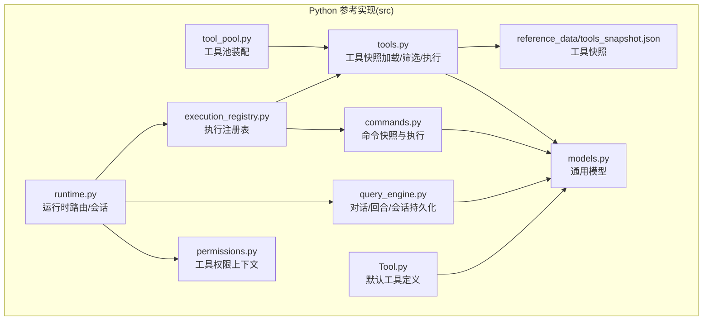
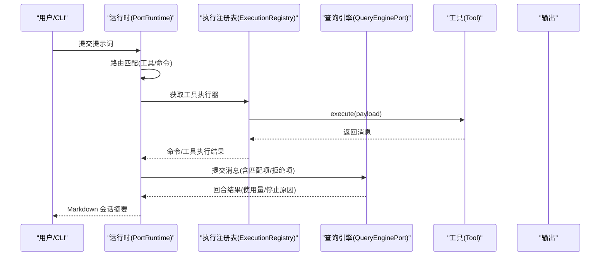
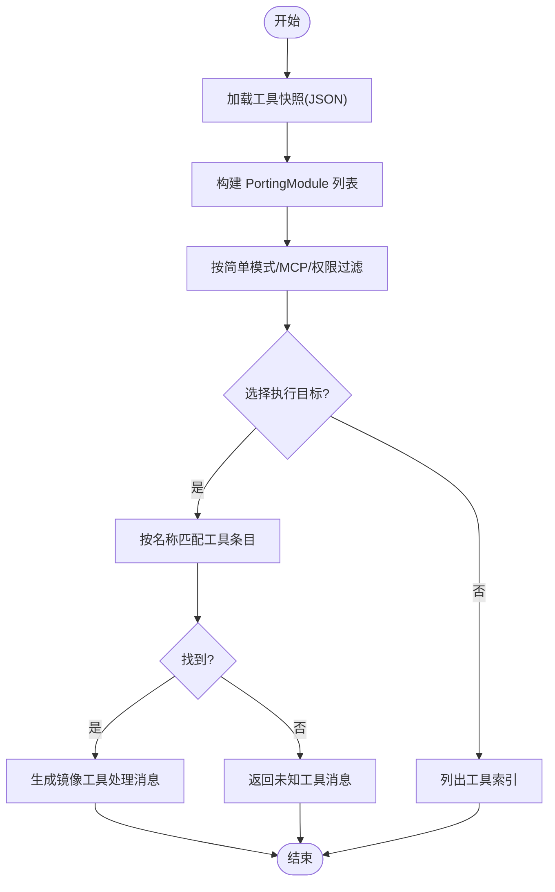
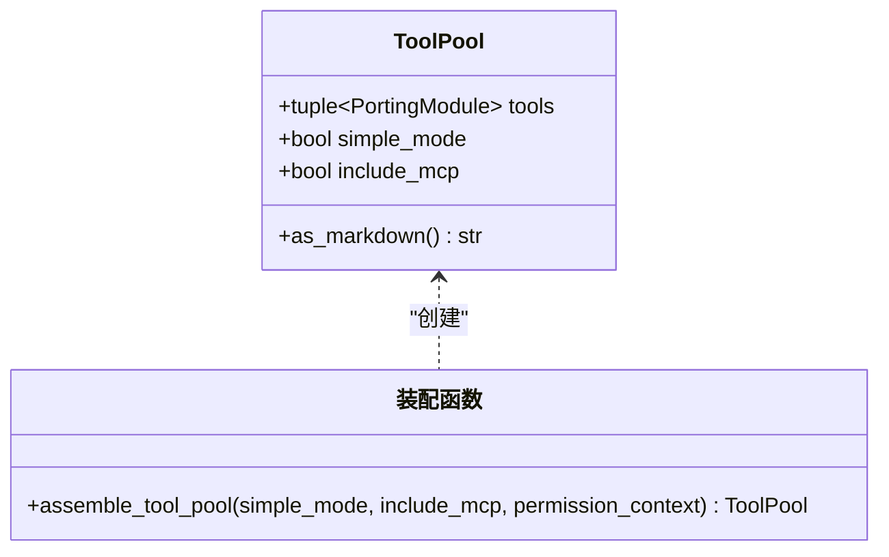
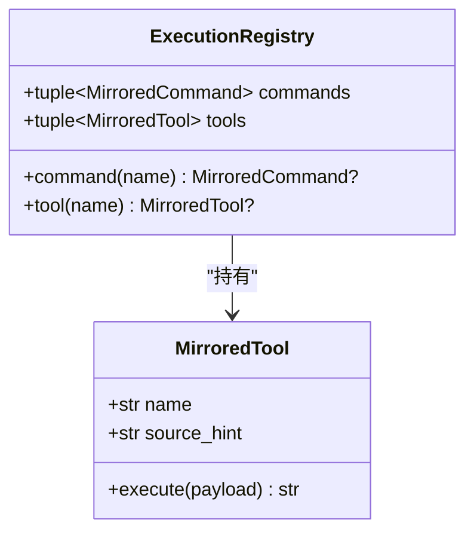
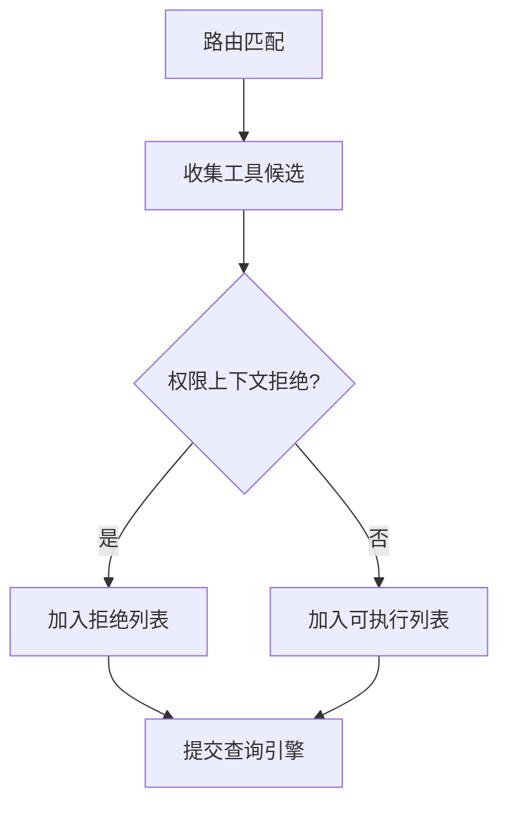
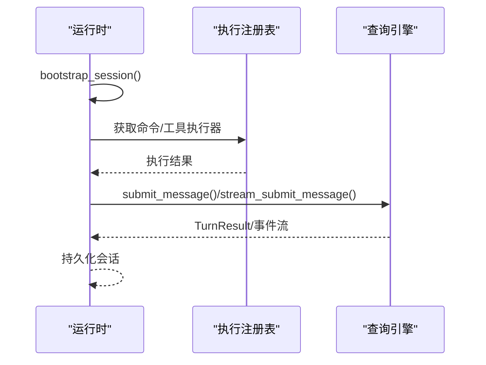
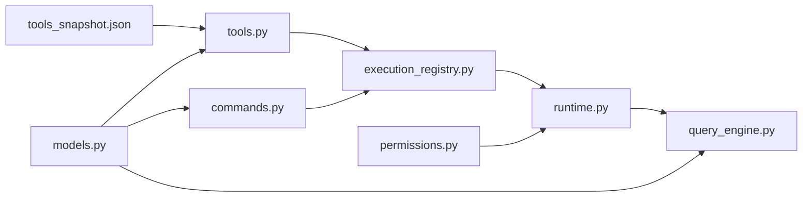

# 工具开发指南

<cite>
**本文引用的文件**
- [src/tools.py](file://src/tools.py)
- [src/tool_pool.py](file://src/tool_pool.py)
- [src/Tool.py](file://src/Tool.py)
- [src/runtime.py](file://src/runtime.py)
- [src/execution_registry.py](file://src/execution_registry.py)
- [src/models.py](file://src/models.py)
- [src/permissions.py](file://src/permissions.py)
- [src/query_engine.py](file://src/query_engine.py)
- [src/commands.py](file://src/commands.py)
- [src/reference_data/tools_snapshot.json](file://src/reference_data/tools_snapshot.json)
- [tests/test_porting_workspace.py](file://tests/test_porting_workspace.py)
</cite>

## 目录
1. [简介](#简介)
2. [项目结构](#项目结构)
3. [核心组件](#核心组件)
4. [架构总览](#架构总览)
5. [详细组件分析](#详细组件分析)
6. [依赖分析](#依赖分析)
7. [性能考量](#性能考量)
8. [故障排查指南](#故障排查指南)
9. [结论](#结论)
10. [附录](#附录)

## 简介
本指南面向希望在本系统中开发“自定义工具”的工程师，围绕工具定义规范、输入参数校验、执行逻辑实现、输出格式规范展开；同时解释工具注册机制、权限配置与生命周期管理，并提供最佳实践、调试技巧、工具池管理、并发执行与资源限制的实现细节，以及与运行时系统的集成方式和错误处理策略。文档以仓库中的 Python 参考实现为依据，辅以测试用例与数据快照，帮助读者快速上手并高质量交付工具。

## 项目结构
本项目采用“参考实现 + Rust 主体”的双层结构：Python 层提供工具与命令的镜像快照、路由与执行注册、会话与查询引擎等能力；Rust 层承载 CLI 与运行时主流程。工具开发主要在 Python 层完成，通过快照与注册机制接入运行时。

图表来源
- [src/tools.py:1-97](file://src/tools.py#L1-L97)
- [src/tool_pool.py:1-38](file://src/tool_pool.py#L1-L38)
- [src/commands.py:1-91](file://src/commands.py#L1-L91)
- [src/execution_registry.py:1-52](file://src/execution_registry.py#L1-L52)
- [src/runtime.py:1-193](file://src/runtime.py#L1-L193)
- [src/query_engine.py:1-194](file://src/query_engine.py#L1-L194)
- [src/permissions.py:1-21](file://src/permissions.py#L1-L21)
- [src/models.py:1-50](file://src/models.py#L1-L50)
- [src/Tool.py:1-16](file://src/Tool.py#L1-L16)
- [src/reference_data/tools_snapshot.json:1-922](file://src/reference_data/tools_snapshot.json#L1-L922)

章节来源
- [src/tools.py:1-97](file://src/tools.py#L1-L97)
- [src/tool_pool.py:1-38](file://src/tool_pool.py#L1-L38)
- [src/commands.py:1-91](file://src/commands.py#L1-L91)
- [src/execution_registry.py:1-52](file://src/execution_registry.py#L1-L52)
- [src/runtime.py:1-193](file://src/runtime.py#L1-L193)
- [src/query_engine.py:1-194](file://src/query_engine.py#L1-L194)
- [src/permissions.py:1-21](file://src/permissions.py#L1-L21)
- [src/models.py:1-50](file://src/models.py#L1-L50)
- [src/Tool.py:1-16](file://src/Tool.py#L1-L16)
- [src/reference_data/tools_snapshot.json:1-922](file://src/reference_data/tools_snapshot.json#L1-L922)

## 核心组件
- 工具快照与检索：从 JSON 快照加载工具条目，支持名称/来源提示模糊匹配与权限过滤。
- 工具池装配：根据简单模式、是否包含 MCP、权限上下文装配工具集合。
- 执行注册表：将工具与命令映射为可执行对象，统一调用入口。
- 运行时路由与会话：基于提示词进行工具/命令匹配，构建会话并驱动查询引擎。
- 权限上下文：按名称或前缀拒绝特定工具。
- 查询引擎：回合制对话、令牌预算控制、会话持久化与结构化输出。

章节来源
- [src/tools.py:23-86](file://src/tools.py#L23-L86)
- [src/tool_pool.py:28-37](file://src/tool_pool.py#L28-L37)
- [src/execution_registry.py:27-51](file://src/execution_registry.py#L27-L51)
- [src/runtime.py:89-193](file://src/runtime.py#L89-L193)
- [src/permissions.py:6-21](file://src/permissions.py#L6-L21)
- [src/query_engine.py:35-194](file://src/query_engine.py#L35-L194)

## 架构总览
下图展示工具从“定义—注册—路由—执行—输出”的全链路：

图表来源
- [src/runtime.py:89-152](file://src/runtime.py#L89-L152)
- [src/execution_registry.py:18-24](file://src/execution_registry.py#L18-L24)
- [src/tools.py:81-86](file://src/tools.py#L81-L86)
- [src/query_engine.py:61-104](file://src/query_engine.py#L61-L104)

## 详细组件分析

### 工具定义与快照
- 定义规范
  - 工具条目包含：名称、来源提示、职责描述。
  - 工具池装配支持：简单模式仅保留少数基础工具；可排除 MCP 工具；可按权限上下文过滤。
- 输入参数
  - 工具执行接收名称与负载（字符串），内部通过名称匹配到对应条目。
- 执行逻辑
  - 若未找到工具，返回“未知工具”消息；否则返回“镜像工具将处理”的占位消息。
- 输出格式
  - 统一为 ToolExecution 数据类，包含处理状态与消息文本，便于后续渲染。

图表来源
- [src/tools.py:23-86](file://src/tools.py#L23-L86)
- [src/reference_data/tools_snapshot.json:1-922](file://src/reference_data/tools_snapshot.json#L1-L922)

章节来源
- [src/tools.py:14-86](file://src/tools.py#L14-L86)
- [src/reference_data/tools_snapshot.json:1-922](file://src/reference_data/tools_snapshot.json#L1-L922)

### 工具池管理
- 装配函数根据 simple_mode/include_mcp/permission_context 三要素装配 ToolPool。
- ToolPool 提供 Markdown 渲染，便于 CLI 展示当前可用工具集。

图表来源
- [src/tool_pool.py:10-37](file://src/tool_pool.py#L10-L37)

章节来源
- [src/tool_pool.py:10-37](file://src/tool_pool.py#L10-L37)

### 执行注册机制
- 将已镜像的工具与命令封装为可执行对象，统一通过 name 查找与执行。
- 注册表同时维护命令与工具集合，便于运行时按需调用。

图表来源
- [src/execution_registry.py:18-51](file://src/execution_registry.py#L18-L51)

章节来源
- [src/execution_registry.py:18-51](file://src/execution_registry.py#L18-L51)

### 权限配置与生命周期
- 权限上下文支持按名称或前缀拒绝工具，用于安全与策略控制。
- 运行时在路由阶段推断拒绝项，传递给查询引擎，最终体现在回合结果与会话输出中。

图表来源
- [src/runtime.py:169-174](file://src/runtime.py#L169-L174)
- [src/permissions.py:11-21](file://src/permissions.py#L11-L21)

章节来源
- [src/runtime.py:169-174](file://src/runtime.py#L169-L174)
- [src/permissions.py:11-21](file://src/permissions.py#L11-L21)

### 生命周期管理与会话
- 运行时负责构建会话：上下文、设置报告、历史记录、路由匹配、命令/工具执行、查询引擎回合、持久化。
- 查询引擎负责回合制对话、令牌预算控制、紧凑化与结构化输出。

图表来源
- [src/runtime.py:109-152](file://src/runtime.py#L109-L152)
- [src/query_engine.py:61-127](file://src/query_engine.py#L61-L127)

章节来源
- [src/runtime.py:109-152](file://src/runtime.py#L109-L152)
- [src/query_engine.py:61-127](file://src/query_engine.py#L61-L127)

### 并发执行与资源限制
- 当前 Python 参考实现采用同步执行路径，命令与工具分别执行后汇总至查询引擎。
- 资源限制通过查询引擎配置实现：最大回合数、令牌预算、紧凑化阈值、结构化输出重试次数。
- 测试覆盖了回合循环与结构化输出行为，确保资源限制生效。

章节来源
- [src/query_engine.py:15-22](file://src/query_engine.py#L15-L22)
- [src/query_engine.py:61-104](file://src/query_engine.py#L61-L104)
- [tests/test_porting_workspace.py:186-195](file://tests/test_porting_workspace.py#L186-L195)

### 错误处理策略
- 未知工具：返回明确消息，避免静默失败。
- 结构化输出渲染异常：在限定重试次数内回退为安全输出。
- 令牌预算超限：停止继续处理并标记停止原因。
- 权限拒绝：在路由阶段即标注拒绝项，避免执行无效工具。

章节来源
- [src/tools.py:81-86](file://src/tools.py#L81-L86)
- [src/query_engine.py:161-169](file://src/query_engine.py#L161-L169)
- [src/runtime.py:169-174](file://src/runtime.py#L169-L174)

## 依赖分析
- 工具与命令均来自快照文件，通过统一的数据模型 PortingModule 表达。
- 执行注册表依赖工具与命令模块，运行时依赖注册表与查询引擎。
- 权限上下文贯穿路由与执行阶段，影响最终会话输出。

图表来源
- [src/reference_data/tools_snapshot.json:1-922](file://src/reference_data/tools_snapshot.json#L1-L922)
- [src/tools.py:1-97](file://src/tools.py#L1-L97)
- [src/commands.py:1-91](file://src/commands.py#L1-L91)
- [src/execution_registry.py:1-52](file://src/execution_registry.py#L1-L52)
- [src/runtime.py:1-193](file://src/runtime.py#L1-L193)
- [src/query_engine.py:1-194](file://src/query_engine.py#L1-L194)
- [src/permissions.py:1-21](file://src/permissions.py#L1-L21)
- [src/models.py:1-50](file://src/models.py#L1-L50)

章节来源
- [src/tools.py:1-97](file://src/tools.py#L1-L97)
- [src/commands.py:1-91](file://src/commands.py#L1-L91)
- [src/execution_registry.py:1-52](file://src/execution_registry.py#L1-L52)
- [src/runtime.py:1-193](file://src/runtime.py#L1-L193)
- [src/query_engine.py:1-194](file://src/query_engine.py#L1-L194)
- [src/permissions.py:1-21](file://src/permissions.py#L1-L21)
- [src/models.py:1-50](file://src/models.py#L1-L50)

## 性能考量
- 缓存与快照：工具与命令快照使用 LRU 缓存，减少重复 IO。
- 路由评分：基于词元匹配与多字段评分，兼顾召回与排序。
- 令牌预算与紧凑化：通过回合阈值与消息窗口压缩，降低内存占用。
- 结构化输出重试：在序列化失败时自动降级，提升鲁棒性。

章节来源
- [src/tools.py:23-34](file://src/tools.py#L23-L34)
- [src/commands.py:22-33](file://src/commands.py#L22-L33)
- [src/runtime.py:185-192](file://src/runtime.py#L185-L192)
- [src/query_engine.py:129-132](file://src/query_engine.py#L129-L132)
- [src/query_engine.py:161-169](file://src/query_engine.py#L161-L169)

## 故障排查指南
- 工具未被识别
  - 检查工具名称大小写与来源提示是否一致；确认快照中是否存在该条目。
  - 使用工具索引 CLI 或渲染函数核对可用工具列表。
- 权限被拒绝
  - 检查权限上下文的 deny_names 与 deny_prefixes 配置；确认路由阶段是否已标注拒绝。
- 回合未继续
  - 检查令牌预算与最大回合数配置；查看停止原因与使用量统计。
- 结构化输出失败
  - 关注重试次数与回退逻辑；检查输出内容是否包含不可序列化对象。

章节来源
- [src/tools.py:81-86](file://src/tools.py#L81-L86)
- [src/runtime.py:169-174](file://src/runtime.py#L169-L174)
- [src/query_engine.py:68-78](file://src/query_engine.py#L68-L78)
- [src/query_engine.py:161-169](file://src/query_engine.py#L161-L169)

## 结论
本指南基于 Python 参考实现，系统阐述了工具开发的定义、注册、执行、权限与生命周期管理，并结合运行时路由与查询引擎的资源控制策略，提供了可操作的最佳实践与调试建议。建议在 Rust 主体中复用相同的工具定义与权限策略，保持前后端一致性。

## 附录

### 工具开发最佳实践
- 明确定义：工具名称、来源提示、职责描述应清晰且唯一。
- 输入校验：在执行前对 payload 进行最小合法性检查，必要时在注册表层做预处理。
- 输出规范：统一返回消息文本，便于运行时渲染与持久化。
- 权限前置：在路由阶段尽早拒绝高风险工具，避免执行开销。
- 资源意识：遵循回合数与令牌预算限制，必要时拆分任务或降采样。

### 代码示例与测试参考
- 工具与命令 CLI 行为、会话引导、权限过滤、回合循环与结构化输出均有测试覆盖，可作为开发与回归的参考。

章节来源
- [tests/test_porting_workspace.py:115-122](file://tests/test_porting_workspace.py#L115-L122)
- [tests/test_porting_workspace.py:176-184](file://tests/test_porting_workspace.py#L176-L184)
- [tests/test_porting_workspace.py:186-195](file://tests/test_porting_workspace.py#L186-L195)
- [tests/test_porting_workspace.py:229-237](file://tests/test_porting_workspace.py#L229-L237)