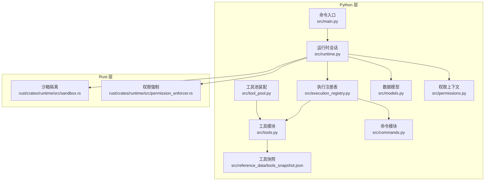
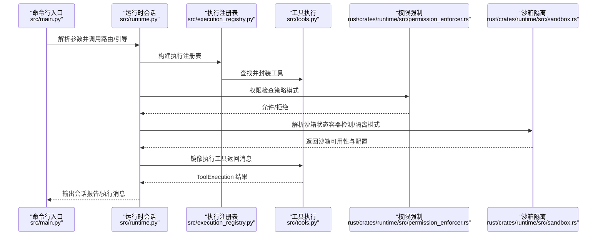
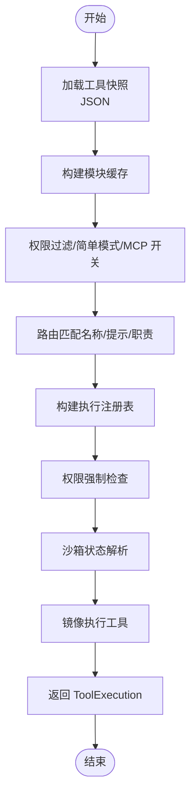
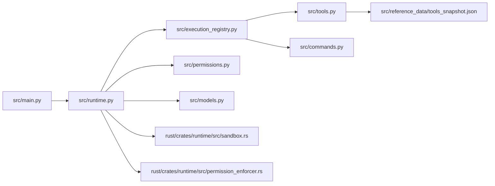
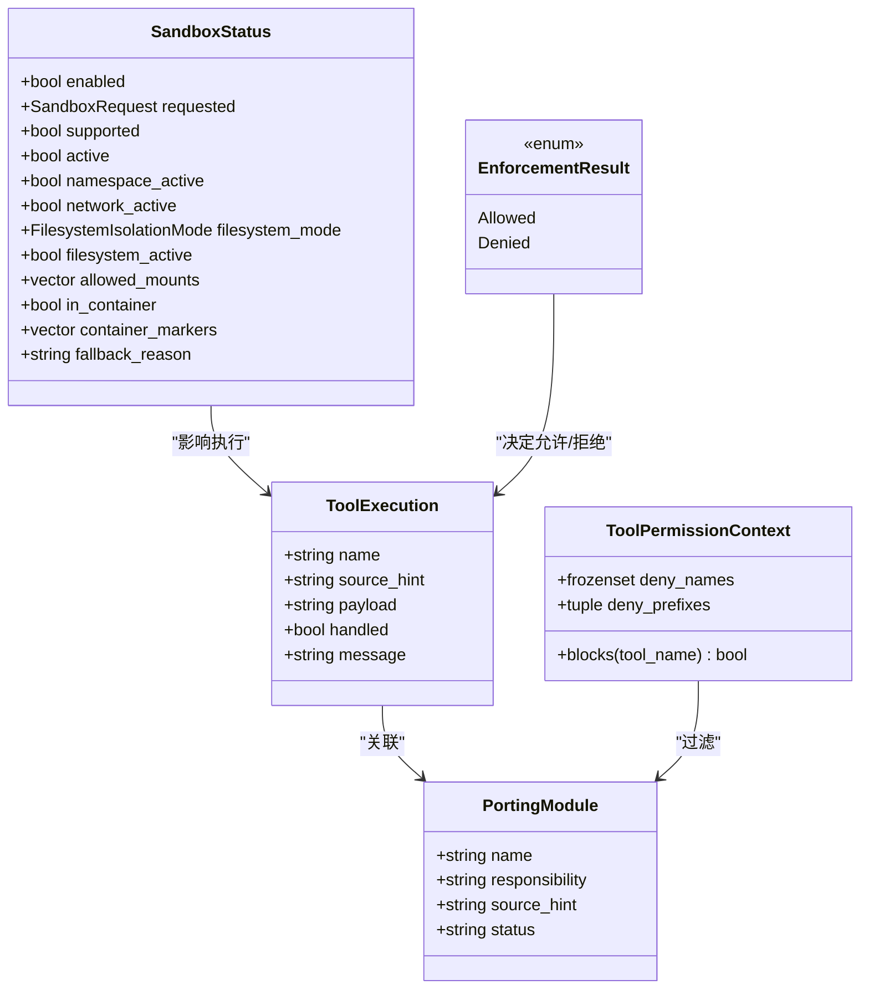

# 工具执行流程

<cite>
**本文档引用的文件**
- [src/tools.py](file://src/tools.py)
- [src/tool_pool.py](file://src/tool_pool.py)
- [src/execution_registry.py](file://src/execution_registry.py)
- [src/models.py](file://src/models.py)
- [src/permissions.py](file://src/permissions.py)
- [src/commands.py](file://src/commands.py)
- [src/runtime.py](file://src/runtime.py)
- [src/main.py](file://src/main.py)
- [src/reference_data/tools_snapshot.json](file://src/reference_data/tools_snapshot.json)
- [rust/crates/runtime/src/sandbox.rs](file://rust/crates/runtime/src/sandbox.rs)
- [rust/crates/runtime/src/permission_enforcer.rs](file://rust/crates/runtime/src/permission_enforcer.rs)
</cite>

## 目录
1. [简介](#简介)
2. [项目结构](#项目结构)
3. [核心组件](#核心组件)
4. [架构总览](#架构总览)
5. [详细组件分析](#详细组件分析)
6. [依赖关系分析](#依赖关系分析)
7. [性能考量](#性能考量)
8. [故障排除指南](#故障排除指南)
9. [结论](#结论)
10. [附录](#附录)

## 简介
本文件系统性阐述工具执行流程，覆盖从输入验证、权限检查、执行调度到结果处理的全生命周期；解释并发控制、资源限制与超时处理；提供错误处理策略（异常捕获、错误传播与恢复）；说明性能监控与日志记录；给出调试技巧与安全考虑（沙箱隔离）。内容基于仓库中的 Python 与 Rust 实现进行归纳总结。

## 项目结构
该仓库采用分层设计：Python 层负责工具清单加载、路由匹配、会话构建与执行注册；Rust 层提供权限强制、沙箱隔离与 MCP 工具调用等能力。工具清单来自 JSON 快照文件，通过 Python 模块动态装配为可执行的镜像工具集合。

**图表来源**
- [src/main.py:1-214](file://src/main.py#L1-L214)
- [src/runtime.py:1-193](file://src/runtime.py#L1-L193)
- [src/execution_registry.py:1-52](file://src/execution_registry.py#L1-L52)
- [src/tools.py:1-97](file://src/tools.py#L1-L97)
- [src/tool_pool.py:1-38](file://src/tool_pool.py#L1-L38)
- [src/models.py:1-50](file://src/models.py#L1-L50)
- [src/permissions.py:1-21](file://src/permissions.py#L1-L21)
- [src/commands.py:1-91](file://src/commands.py#L1-L91)
- [src/reference_data/tools_snapshot.json:1-800](file://src/reference_data/tools_snapshot.json#L1-L800)
- [rust/crates/runtime/src/sandbox.rs:1-386](file://rust/crates/runtime/src/sandbox.rs#L1-L386)
- [rust/crates/runtime/src/permission_enforcer.rs:1-586](file://rust/crates/runtime/src/permission_enforcer.rs#L1-L586)

**章节来源**
- [src/main.py:1-214](file://src/main.py#L1-L214)
- [src/runtime.py:1-193](file://src/runtime.py#L1-L193)
- [src/execution_registry.py:1-52](file://src/execution_registry.py#L1-L52)
- [src/tools.py:1-97](file://src/tools.py#L1-L97)
- [src/tool_pool.py:1-38](file://src/tool_pool.py#L1-L38)
- [src/models.py:1-50](file://src/models.py#L1-L50)
- [src/permissions.py:1-21](file://src/permissions.py#L1-L21)
- [src/commands.py:1-91](file://src/commands.py#L1-L91)
- [src/reference_data/tools_snapshot.json:1-800](file://src/reference_data/tools_snapshot.json#L1-L800)
- [rust/crates/runtime/src/sandbox.rs:1-386](file://rust/crates/runtime/src/sandbox.rs#L1-L386)
- [rust/crates/runtime/src/permission_enforcer.rs:1-586](file://rust/crates/runtime/src/permission_enforcer.rs#L1-L586)

## 核心组件
- 工具清单与执行
  - 工具快照加载：从 JSON 文件读取工具条目，转换为模块对象，缓存以提升性能。
  - 工具查询与过滤：支持按名称、源路径提示、权限上下文过滤，以及简单模式与 MCP 包含开关。
  - 工具执行：根据名称查找对应模块，返回“镜像执行”消息，不实际执行外部命令。
- 执行注册表
  - 将工具与命令封装为可执行对象，提供统一的 execute 接口，便于运行时调度。
- 运行时会话
  - 路由提示词，收集匹配的命令与工具，构建执行消息列表，并与查询引擎交互生成会话输出。
- 权限与沙箱
  - Python 层：工具权限上下文用于黑名单/前缀过滤。
  - Rust 层：权限强制器根据策略模式判断允许/拒绝；沙箱模块提供容器化隔离与环境变量注入。

**章节来源**
- [src/tools.py:23-86](file://src/tools.py#L23-L86)
- [src/execution_registry.py:18-51](file://src/execution_registry.py#L18-L51)
- [src/runtime.py:89-152](file://src/runtime.py#L89-L152)
- [src/permissions.py:6-21](file://src/permissions.py#L6-L21)
- [rust/crates/runtime/src/permission_enforcer.rs:31-174](file://rust/crates/runtime/src/permission_enforcer.rs#L31-L174)
- [rust/crates/runtime/src/sandbox.rs:85-208](file://rust/crates/runtime/src/sandbox.rs#L85-L208)

## 架构总览
工具执行在 Python 层完成路由与会话编排，在 Rust 层完成权限与隔离控制。整体流程如下：

**图表来源**
- [src/main.py:94-214](file://src/main.py#L94-L214)
- [src/runtime.py:89-152](file://src/runtime.py#L89-L152)
- [src/execution_registry.py:47-52](file://src/execution_registry.py#L47-L52)
- [src/tools.py:81-86](file://src/tools.py#L81-L86)
- [rust/crates/runtime/src/permission_enforcer.rs:31-100](file://rust/crates/runtime/src/permission_enforcer.rs#L31-L100)
- [rust/crates/runtime/src/sandbox.rs:155-208](file://rust/crates/runtime/src/sandbox.rs#L155-L208)

## 详细组件分析

### 工具执行生命周期
- 输入验证
  - 名称解析：大小写不敏感匹配工具快照中的名称或源路径提示。
  - 查询过滤：支持关键词模糊匹配与权限上下文过滤。
- 权限检查
  - Python 层：ToolPermissionContext 支持精确名黑名单与前缀白名单/黑名单组合。
  - Rust 层：PermissionEnforcer 基于 PermissionPolicy 的 Active Mode 与 Required Mode 决策，支持 Bash 只读启发式与文件写入边界检查。
- 执行调度
  - ExecutionRegistry 将工具封装为可执行对象，统一暴露 execute 接口。
  - RuntimeSession 在路由后批量执行匹配的工具，生成执行消息列表。
- 结果处理
  - 工具执行返回 ToolExecution 对象，包含是否已处理与描述性消息。
  - 运行时将执行消息与查询引擎输出合并，形成最终会话报告。

**图表来源**
- [src/tools.py:23-86](file://src/tools.py#L23-L86)
- [src/tool_pool.py:28-37](file://src/tool_pool.py#L28-L37)
- [src/execution_registry.py:47-51](file://src/execution_registry.py#L47-L51)
- [src/runtime.py:109-152](file://src/runtime.py#L109-L152)
- [rust/crates/runtime/src/permission_enforcer.rs:31-174](file://rust/crates/runtime/src/permission_enforcer.rs#L31-L174)
- [rust/crates/runtime/src/sandbox.rs:155-208](file://rust/crates/runtime/src/sandbox.rs#L155-L208)

**章节来源**
- [src/tools.py:23-86](file://src/tools.py#L23-L86)
- [src/tool_pool.py:28-37](file://src/tool_pool.py#L28-L37)
- [src/execution_registry.py:47-51](file://src/execution_registry.py#L47-L51)
- [src/runtime.py:109-152](file://src/runtime.py#L109-L152)
- [src/permissions.py:11-21](file://src/permissions.py#L11-L21)
- [rust/crates/runtime/src/permission_enforcer.rs:31-174](file://rust/crates/runtime/src/permission_enforcer.rs#L31-L174)
- [rust/crates/runtime/src/sandbox.rs:155-208](file://rust/crates/runtime/src/sandbox.rs#L155-L208)

### 并发执行控制、资源限制与超时处理
- 并发控制
  - Python 层：当前实现为同步执行镜像工具消息，未见显式并发队列或锁管理。
  - Rust 层：存在对慢工具调用的超时测试（MCP 工具调用），表明在异步环境中具备超时控制能力。
- 资源限制
  - 沙箱隔离：支持命名空间隔离、网络隔离与文件系统隔离模式，允许挂载白名单路径。
  - 容器检测：自动识别 Docker/Podman/Kubernetes 等容器环境标记。
- 超时处理
  - Rust 层：MCP 工具调用支持超时配置，测试覆盖慢调用场景下的超时行为。

**章节来源**
- [rust/crates/runtime/src/sandbox.rs:85-208](file://rust/crates/runtime/src/sandbox.rs#L85-L208)
- [rust/crates/runtime/src/sandbox.rs:108-153](file://rust/crates/runtime/src/sandbox.rs#L108-L153)
- [rust/crates/runtime/src/sandbox.rs:210-262](file://rust/crates/runtime/src/sandbox.rs#L210-L262)
- [rust/crates/tools/src/lib.rs:6133-6171](file://rust/crates/tools/src/lib.rs#L6133-L6171)

### 错误处理策略
- 异常捕获与传播
  - 工具执行：当工具不存在时返回未处理状态与错误消息；运行时会话中将执行消息与查询引擎输出合并，便于上层聚合。
  - 权限拒绝：返回包含工具名、当前模式、所需模式与原因的拒绝信息，便于用户理解与升级权限。
- 恢复机制
  - Prompt 模式：在权限策略为 Prompt 时，允许放行以交由交互流程确认。
  - 沙箱回退：当请求的隔离特性不可用时，记录回退原因，保持功能可用性。

**章节来源**
- [src/tools.py:81-86](file://src/tools.py#L81-L86)
- [rust/crates/runtime/src/permission_enforcer.rs:37-100](file://rust/crates/runtime/src/permission_enforcer.rs#L37-L100)
- [rust/crates/runtime/src/sandbox.rs:168-208](file://rust/crates/runtime/src/sandbox.rs#L168-L208)

### 性能监控与日志记录
- Python 层
  - 运行时会话记录历史事件（路由、执行、回合、会话存储），便于审计与问题定位。
  - 工具与命令索引渲染支持限制数量与查询过滤，便于快速定位。
- Rust 层
  - 沙箱状态包含启用/请求/支持/激活等字段，便于监控隔离能力。
  - 权限强制器输出拒绝原因，辅助性能与安全策略优化。

**章节来源**
- [src/runtime.py:139-152](file://src/runtime.py#L139-L152)
- [src/tools.py:89-97](file://src/tools.py#L89-L97)
- [src/commands.py:83-91](file://src/commands.py#L83-L91)
- [rust/crates/runtime/src/sandbox.rs:52-68](file://rust/crates/runtime/src/sandbox.rs#L52-L68)

### 调试技巧与故障排除
- 调试技巧
  - 使用命令行子命令查看工具池、路由结果与会话持久化路径，快速定位问题。
  - 启用简单模式与排除 MCP 工具，缩小问题范围。
  - 使用权限上下文的黑名单/前缀过滤，验证权限策略影响。
- 故障排除
  - 工具未找到：检查工具快照与名称大小写；使用查询参数筛选。
  - 权限被拒：确认当前模式与所需模式；在 Prompt 模式下交由交互确认。
  - 沙箱不可用：检查容器环境标记与隔离模式配置，关注回退原因。

**章节来源**
- [src/main.py:132-151](file://src/main.py#L132-L151)
- [src/permissions.py:11-21](file://src/permissions.py#L11-L21)
- [rust/crates/runtime/src/sandbox.rs:108-153](file://rust/crates/runtime/src/sandbox.rs#L108-L153)

### 安全考虑与沙箱隔离
- 沙箱隔离
  - 支持关闭、仅工作区、白名单三种文件系统隔离模式。
  - 提供命名空间与网络隔离选项，Linux 环境下通过 unshare 用户命名空间实现。
- 权限强制
  - 基于策略的 Active Mode 与 Required Mode 比较，拒绝不满足要求的工具调用。
  - Bash 只读启发式与文件写入边界检查，防止越权操作。
- 容器检测
  - 综合检测 /proc/1/cgroup、/run/.containerenv、环境变量等标记，识别容器运行环境。

**章节来源**
- [rust/crates/runtime/src/sandbox.rs:8-68](file://rust/crates/runtime/src/sandbox.rs#L8-L68)
- [rust/crates/runtime/src/sandbox.rs:108-208](file://rust/crates/runtime/src/sandbox.rs#L108-L208)
- [rust/crates/runtime/src/permission_enforcer.rs:107-174](file://rust/crates/runtime/src/permission_enforcer.rs#L107-L174)

## 依赖关系分析

**图表来源**
- [src/main.py:1-214](file://src/main.py#L1-L214)
- [src/runtime.py:1-193](file://src/runtime.py#L1-L193)
- [src/execution_registry.py:1-52](file://src/execution_registry.py#L1-L52)
- [src/tools.py:1-97](file://src/tools.py#L1-L97)
- [src/commands.py:1-91](file://src/commands.py#L1-L91)
- [src/reference_data/tools_snapshot.json:1-800](file://src/reference_data/tools_snapshot.json#L1-L800)
- [src/permissions.py:1-21](file://src/permissions.py#L1-L21)
- [src/models.py:1-50](file://src/models.py#L1-L50)
- [rust/crates/runtime/src/sandbox.rs:1-386](file://rust/crates/runtime/src/sandbox.rs#L1-L386)
- [rust/crates/runtime/src/permission_enforcer.rs:1-586](file://rust/crates/runtime/src/permission_enforcer.rs#L1-L586)

**章节来源**
- [src/main.py:1-214](file://src/main.py#L1-L214)
- [src/runtime.py:1-193](file://src/runtime.py#L1-L193)
- [src/execution_registry.py:1-52](file://src/execution_registry.py#L1-L52)
- [src/tools.py:1-97](file://src/tools.py#L1-L97)
- [src/commands.py:1-91](file://src/commands.py#L1-L91)
- [src/reference_data/tools_snapshot.json:1-800](file://src/reference_data/tools_snapshot.json#L1-L800)
- [src/permissions.py:1-21](file://src/permissions.py#L1-L21)
- [src/models.py:1-50](file://src/models.py#L1-L50)
- [rust/crates/runtime/src/sandbox.rs:1-386](file://rust/crates/runtime/src/sandbox.rs#L1-L386)
- [rust/crates/runtime/src/permission_enforcer.rs:1-586](file://rust/crates/runtime/src/permission_enforcer.rs#L1-L586)

## 性能考量
- 缓存与索引
  - 工具快照使用 LRU 缓存，避免重复解析 JSON。
  - 工具与命令名称与职责的多字段评分，提高路由效率。
- 并发与超时
  - Python 层为同步执行；建议在需要时引入线程/进程池与超时控制。
  - Rust 层提供 MCP 工具调用超时示例，可借鉴到 Python 工具执行链路。
- 日志与可观测性
  - 运行时会话记录历史事件，便于性能瓶颈定位与回放。

**章节来源**
- [src/tools.py:23-34](file://src/tools.py#L23-L34)
- [src/runtime.py:139-152](file://src/runtime.py#L139-L152)
- [rust/crates/tools/src/lib.rs:2300-2331](file://rust/crates/tools/src/lib.rs#L2300-L2331)

## 故障排除指南
- 工具未找到
  - 检查工具快照文件与名称大小写；使用查询参数或简单模式缩小范围。
- 权限被拒
  - 确认当前模式与所需模式；在 Prompt 模式下交由交互确认；调整 ToolPermissionContext。
- 沙箱不可用
  - 检查容器标记与 unshare 可用性；查看回退原因；调整隔离模式。
- 执行无响应
  - 检查是否存在慢工具调用；为工具调用设置合理超时。

**章节来源**
- [src/tools.py:81-86](file://src/tools.py#L81-L86)
- [src/permissions.py:11-21](file://src/permissions.py#L11-L21)
- [rust/crates/runtime/src/sandbox.rs:168-208](file://rust/crates/runtime/src/sandbox.rs#L168-L208)
- [rust/crates/tools/src/lib.rs:2300-2331](file://rust/crates/tools/src/lib.rs#L2300-L2331)

## 结论
本项目通过 Python 与 Rust 的协同，实现了工具执行的镜像化路由与执行、严格的权限控制与灵活的沙箱隔离。当前 Python 层侧重于工具清单与会话编排，Rust 层提供安全与隔离保障。建议后续在 Python 层引入并发与超时控制，并完善错误传播与恢复机制，以进一步提升稳定性与可观测性。

## 附录
- 关键数据结构
  - ToolExecution：工具执行结果载体。
  - PortingModule：工具/命令模块元数据。
  - ToolPermissionContext：工具权限上下文。
  - SandboxStatus：沙箱状态与配置。
  - EnforcementResult：权限强制结果。

**图表来源**
- [src/models.py:6-20](file://src/models.py#L6-L20)
- [src/tools.py:14-21](file://src/tools.py#L14-L21)
- [src/permissions.py:6-21](file://src/permissions.py#L6-L21)
- [rust/crates/runtime/src/sandbox.rs:52-68](file://rust/crates/runtime/src/sandbox.rs#L52-L68)
- [rust/crates/runtime/src/permission_enforcer.rs:12-24](file://rust/crates/runtime/src/permission_enforcer.rs#L12-L24)