# 工具注册机制

<cite>
**本文档引用的文件**
- [lib.rs](file://rust/crates/tools/src/lib.rs)
- [main.rs](file://rust/crates/rusty-claude-cli/src/main.rs)
- [lib.rs](file://rust/crates/plugins/src/lib.rs)
- [tools.py](file://src/tools.py)
- [tool_pool.py](file://src/tool_pool.py)
</cite>

## 目录
1. [简介](#简介)
2. [项目结构](#项目结构)
3. [核心组件](#核心组件)
4. [架构概览](#架构概览)
5. [详细组件分析](#详细组件分析)
6. [依赖关系分析](#依赖关系分析)
7. [性能考虑](#性能考虑)
8. [故障排除指南](#故障排除指南)
9. [结论](#结论)

## 简介

本文件详细阐述了代码库中工具注册机制的设计与实现，重点分析 GlobalToolRegistry 和 RuntimeToolDefinition 的架构设计，包括插件工具和运行时工具的注册流程、工具名称规范化、冲突检测与去重机制、工具搜索索引的构建与查询优化策略，以及工具注册的错误处理和异常情况处理。

该系统支持三种类型的工具：
- 内置工具（Built-in Tools）：预定义的标准工具集
- 插件工具（Plugin Tools）：通过插件系统动态加载的工具
- 运行时工具（Runtime Tools）：在运行时动态注册的工具定义

## 项目结构

工具注册机制主要分布在以下模块中：

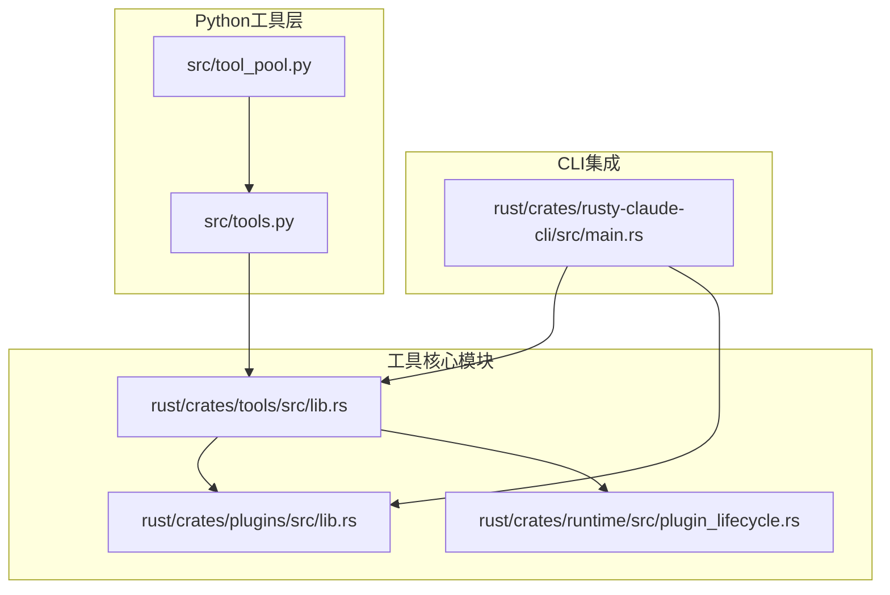

**图表来源**
- [lib.rs:108-121](file://rust/crates/tools/src/lib.rs#L108-L121)
- [lib.rs:259-277](file://rust/crates/plugins/src/lib.rs#L259-L277)
- [main.rs:6119-6147](file://rust/crates/rusty-claude-cli/src/main.rs#L6119-L6147)

**章节来源**
- [lib.rs:1-100](file://rust/crates/tools/src/lib.rs#L1-L100)
- [lib.rs:1-100](file://rust/crates/plugins/src/lib.rs#L1-L100)

## 核心组件

### GlobalToolRegistry 设计架构

GlobalToolRegistry 是工具注册机制的核心组件，负责统一管理所有类型的工具：

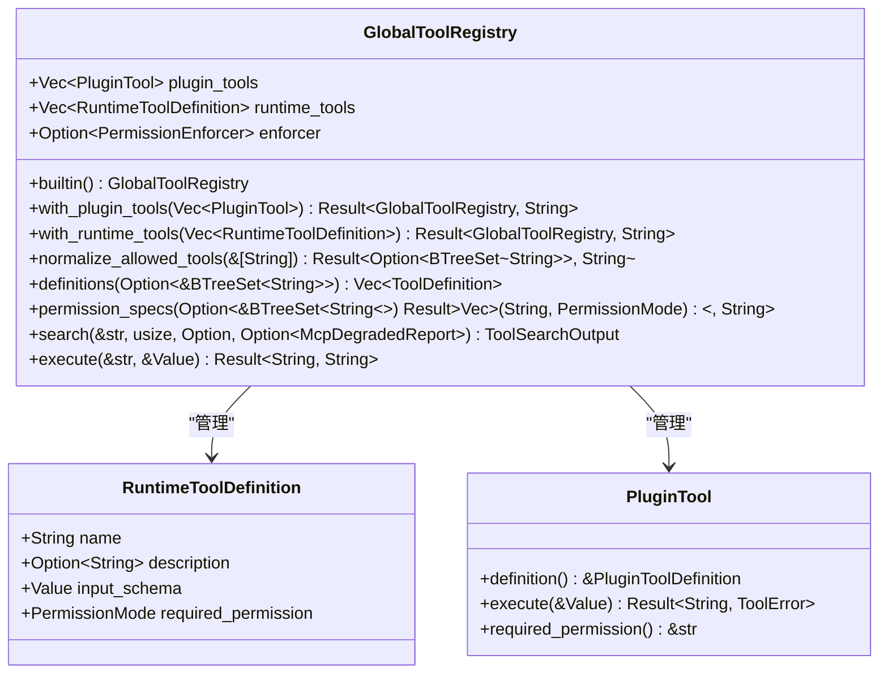

**图表来源**
- [lib.rs:108-121](file://rust/crates/tools/src/lib.rs#L108-L121)
- [lib.rs:115-121](file://rust/crates/tools/src/lib.rs#L115-L121)
- [lib.rs:259-277](file://rust/crates/plugins/src/lib.rs#L259-L277)

### 工具规范与权限系统

系统采用统一的工具规范结构，支持不同级别的权限控制：

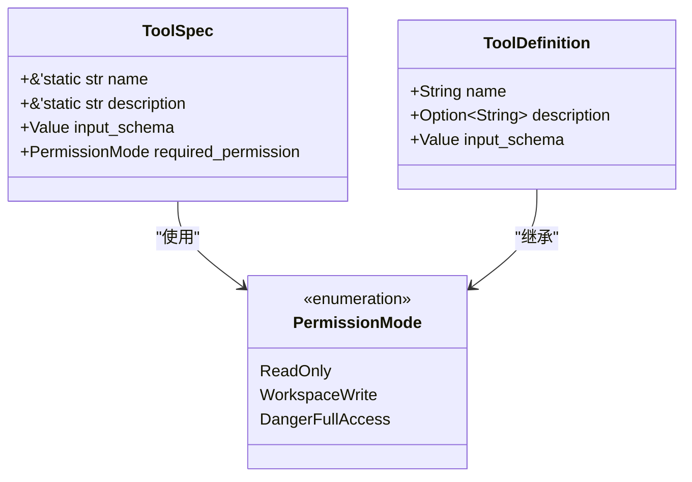

**图表来源**
- [lib.rs:100-106](file://rust/crates/tools/src/lib.rs#L100-L106)
- [lib.rs:280-306](file://rust/crates/tools/src/lib.rs#L280-L306)

**章节来源**
- [lib.rs:108-368](file://rust/crates/tools/src/lib.rs#L108-L368)
- [lib.rs:370-381](file://rust/crates/tools/src/lib.rs#L370-L381)

## 架构概览

工具注册机制的整体架构如下：

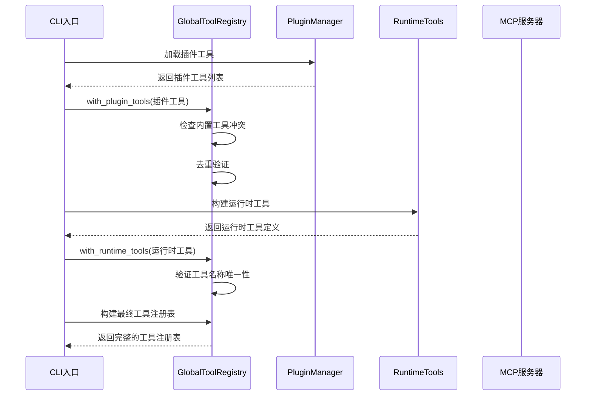

**图表来源**
- [main.rs:6119-6147](file://rust/crates/rusty-claude-cli/src/main.rs#L6119-L6147)
- [lib.rs:133-184](file://rust/crates/tools/src/lib.rs#L133-L184)

## 详细组件分析

### 工具注册流程

#### 插件工具注册流程

插件工具的注册包含严格的冲突检测和去重机制：

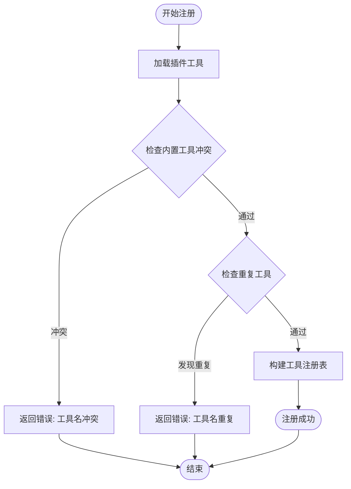

**图表来源**
- [lib.rs:133-150](file://rust/crates/tools/src/lib.rs#L133-L150)

#### 运行时工具注册流程

运行时工具注册同样遵循严格的验证规则：

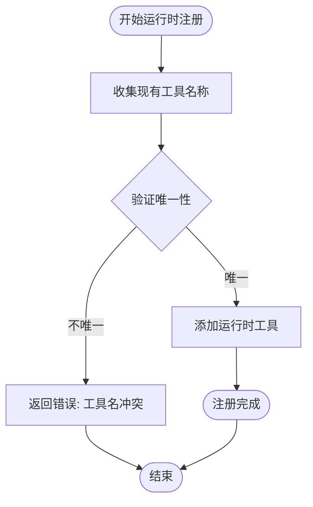

**图表来源**
- [lib.rs:159-184](file://rust/crates/tools/src/lib.rs#L159-L184)

**章节来源**
- [lib.rs:133-184](file://rust/crates/tools/src/lib.rs#L133-L184)

### 工具名称规范化机制

系统实现了多层名称规范化和别名映射机制：

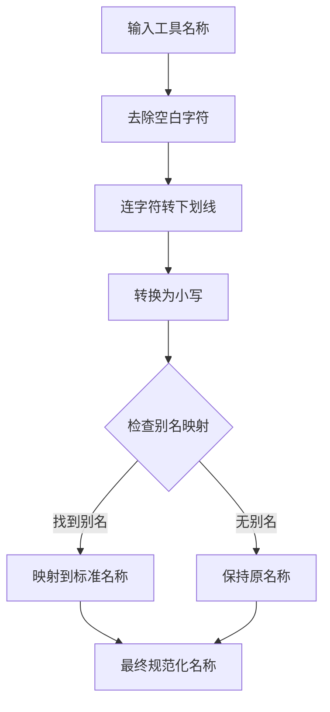

**图表来源**
- [lib.rs:370-372](file://rust/crates/tools/src/lib.rs#L370-L372)
- [lib.rs:216-224](file://rust/crates/tools/src/lib.rs#L216-L224)

#### 工具别名映射表

系统支持以下工具别名映射：

| 别名 | 标准名称 |
|------|----------|
| read | read_file |
| write | write_file |
| edit | edit_file |
| glob | glob_search |
| grep | grep_search |

**章节来源**
- [lib.rs:216-224](file://rust/crates/tools/src/lib.rs#L216-L224)
- [lib.rs:370-372](file://rust/crates/tools/src/lib.rs#L370-L372)

### 工具搜索索引构建

工具搜索功能通过以下步骤构建索引：

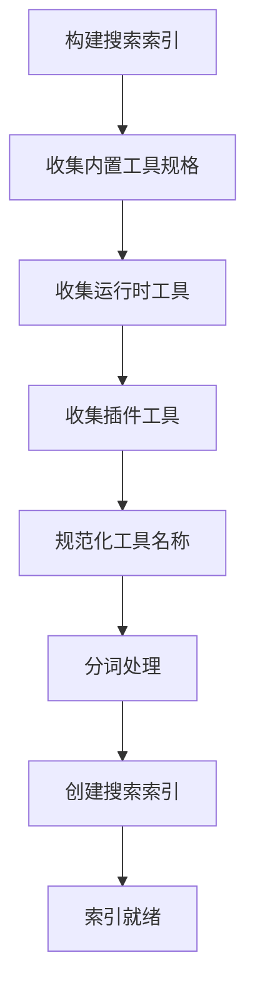

**图表来源**
- [lib.rs:351-367](file://rust/crates/tools/src/lib.rs#L351-L367)

#### 搜索查询处理

搜索查询支持多种语法和特性：

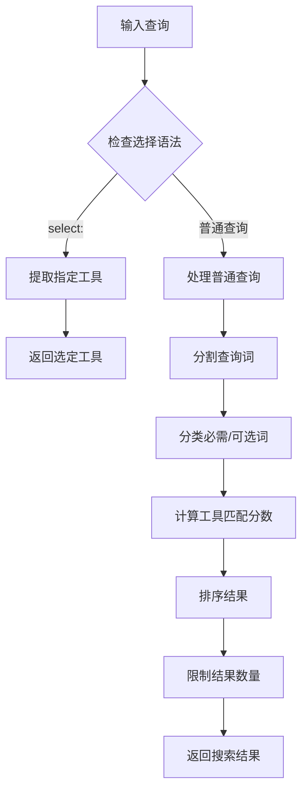

**图表来源**
- [lib.rs:4883-4966](file://rust/crates/tools/src/lib.rs#L4883-L4966)

**章节来源**
- [lib.rs:351-367](file://rust/crates/tools/src/lib.rs#L351-L367)
- [lib.rs:4883-4966](file://rust/crates/tools/src/lib.rs#L4883-L4966)

### 权限控制系统

系统实现了多层次的权限控制机制：

```mermaid
classDiagram
class PermissionEnforcer {
+check(&str, &str) EnforcementResult
+check_with_required_mode(&str, &str, PermissionMode) EnforcementResult
}
class EnforcementResult {
<<enumeration>>
Allowed
Denied {reason}
}
class PermissionMode {
<<enumeration>>
ReadOnly
WorkspaceWrite
DangerFullAccess
}
PermissionEnforcer --> EnforcementResult : "返回"
PermissionEnforcer --> PermissionMode : "使用"
```

**图表来源**
- [lib.rs:1174-1187](file://rust/crates/tools/src/lib.rs#L1174-L1187)
- [lib.rs:1293-1324](file://rust/crates/tools/src/lib.rs#L1293-L1324)

**章节来源**
- [lib.rs:1174-1324](file://rust/crates/tools/src/lib.rs#L1174-L1324)

### 工具执行流程

工具执行采用统一的执行器模式：

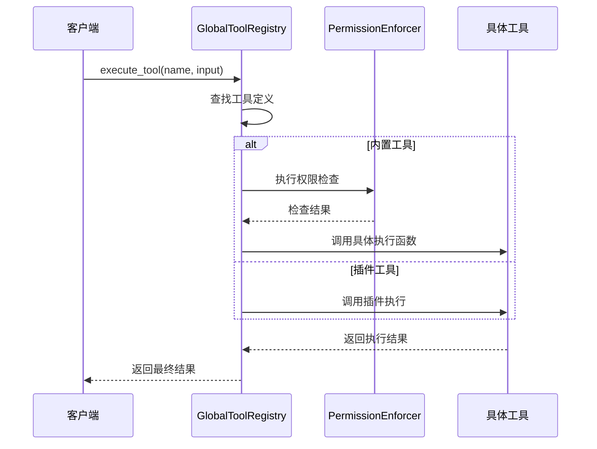

**图表来源**
- [lib.rs:339-349](file://rust/crates/tools/src/lib.rs#L339-L349)
- [lib.rs:1189-1291](file://rust/crates/tools/src/lib.rs#L1189-L1291)

**章节来源**
- [lib.rs:339-349](file://rust/crates/tools/src/lib.rs#L339-L349)
- [lib.rs:1189-1291](file://rust/crates/tools/src/lib.rs#L1189-L1291)

## 依赖关系分析

工具注册机制的依赖关系如下：

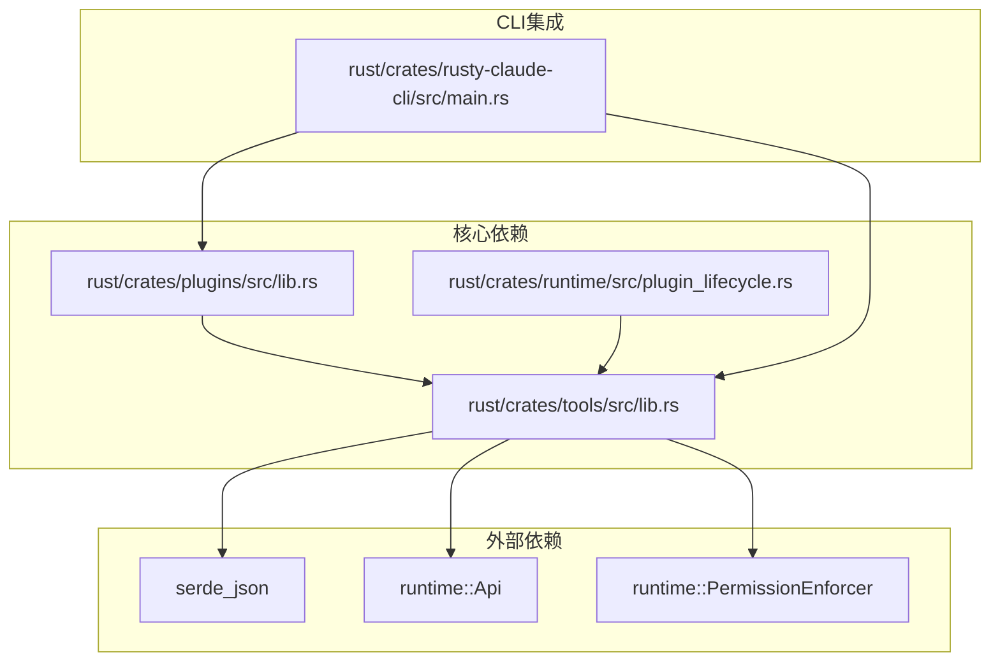

**图表来源**
- [lib.rs:1-32](file://rust/crates/tools/src/lib.rs#L1-L32)
- [main.rs:55-55](file://rust/crates/rusty-claude-cli/src/main.rs#L55-L55)

**章节来源**
- [lib.rs:1-32](file://rust/crates/tools/src/lib.rs#L1-L32)
- [main.rs:55-55](file://rust/crates/rusty-claude-cli/src/main.rs#L55-L55)

## 性能考虑

### 搜索算法优化

工具搜索算法采用了多级评分机制：

1. **精确匹配优先**：完全匹配工具名称得8分
2. **部分匹配**：包含匹配得4分  
3. **规范化匹配**：规范化后完全匹配得12分
4. **描述匹配**：描述中包含得3分
5. **必需词匹配**：额外得2分

### 缓存策略

- 使用 BTreeSet 进行工具名称的快速查找
- LRU缓存用于工具快照数据
- OnceLock确保全局单例的线程安全初始化

### 内存管理

- 所有工具定义使用Clone语义，便于跨模块传递
- 输入参数使用引用避免不必要的内存拷贝
- 结果数据结构采用紧凑的JSON序列化格式

## 故障排除指南

### 常见错误类型

1. **工具名冲突错误**
   - 发生场景：插件工具与内置工具同名
   - 解决方案：修改插件工具名称或移除冲突的内置工具

2. **重复工具名错误**
   - 发生场景：同一注册表中存在重复的工具名称
   - 解决方案：确保每个工具名称的唯一性

3. **不支持的工具错误**
   - 发生场景：尝试执行未注册的工具
   - 解决方案：检查工具注册流程或工具名称拼写

4. **权限拒绝错误**
   - 发生场景：工具执行违反权限策略
   - 解决方案：调整权限配置或使用具有足够权限的工具

### 调试建议

1. 使用 `normalize_allowed_tools` 方法验证工具名称规范化
2. 检查 `searchable_tool_specs` 方法确认工具索引构建正确
3. 通过 `permission_specs` 方法验证权限配置
4. 使用 `ToolSearch` 工具测试搜索功能

**章节来源**
- [lib.rs:142-149](file://rust/crates/tools/src/lib.rs#L142-L149)
- [lib.rs:233-238](file://rust/crates/tools/src/lib.rs#L233-L238)
- [lib.rs:1174-1187](file://rust/crates/tools/src/lib.rs#L1174-L1187)

## 结论

该工具注册机制通过 GlobalToolRegistry 提供了统一的工具管理接口，支持插件工具和运行时工具的动态注册。系统实现了完善的工具名称规范化、冲突检测和去重机制，以及高效的工具搜索索引构建和查询优化策略。

关键优势包括：
- **模块化设计**：清晰分离内置工具、插件工具和运行时工具
- **安全性**：完整的权限控制系统和执行前验证
- **可扩展性**：支持动态工具注册和插件系统集成
- **性能优化**：多级缓存和优化的搜索算法

该机制为整个系统的工具生态提供了坚实的基础，支持从简单工具到复杂MCP服务器工具的全范围集成。