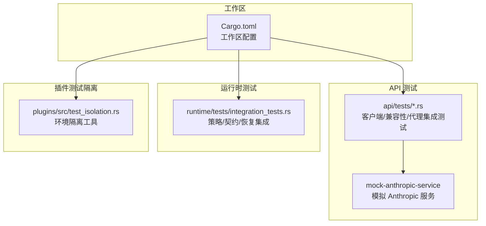
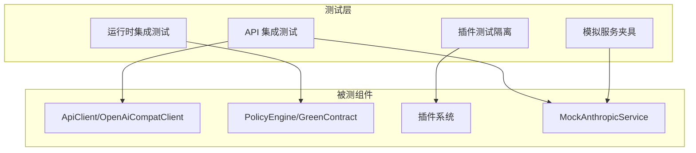
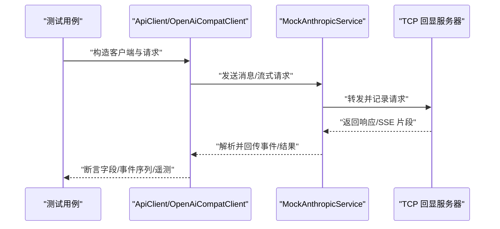
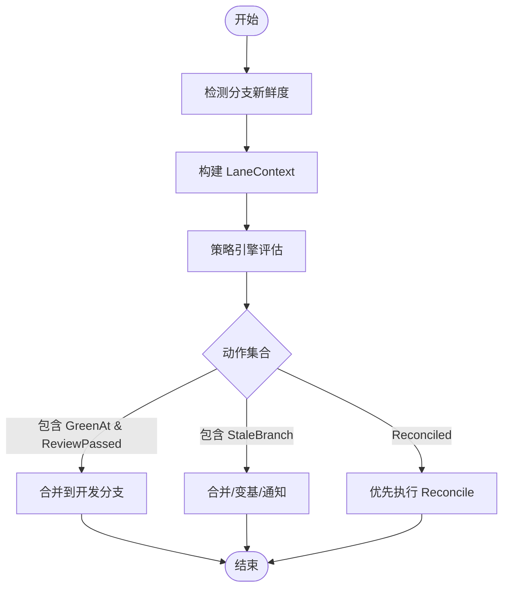
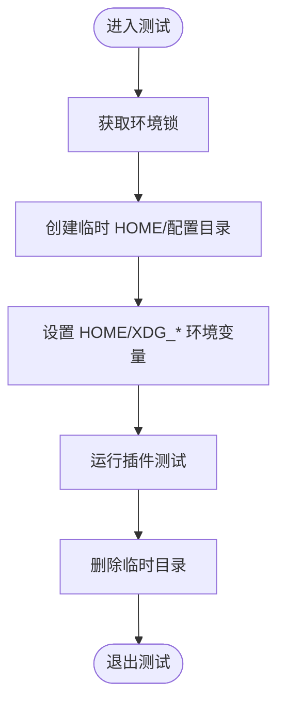
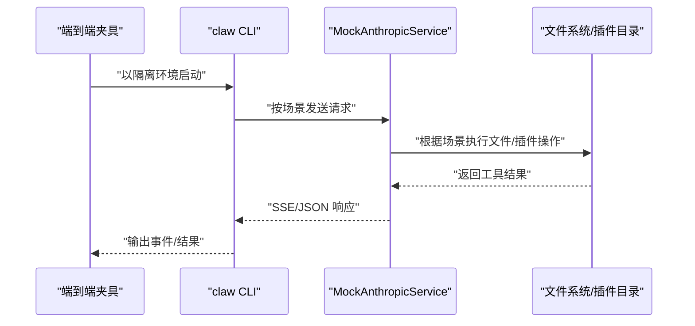
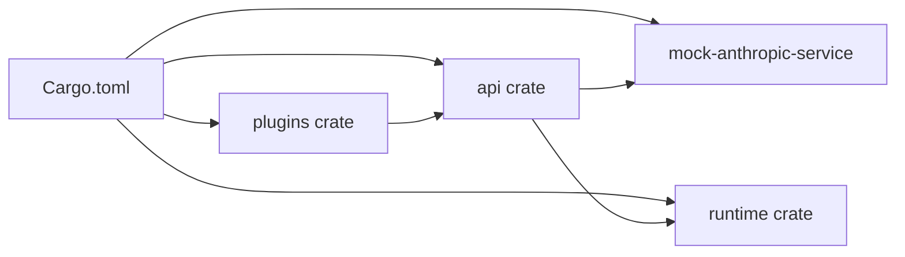

# 工具测试与调试

<cite>
**本文引用的文件**
- [README.md](file://README.md)
- [Cargo.toml](file://rust/Cargo.toml)
- [client_integration.rs](file://rust/crates/api/tests/client_integration.rs)
- [openai_compat_integration.rs](file://rust/crates/api/tests/openai_compat_integration.rs)
- [provider_client_integration.rs](file://rust/crates/api/tests/provider_client_integration.rs)
- [proxy_integration.rs](file://rust/crates/api/tests/proxy_integration.rs)
- [integration_tests.rs](file://rust/crates/runtime/tests/integration_tests.rs)
- [test_isolation.rs](file://rust/crates/plugins/src/test_isolation.rs)
- [lib.rs（mock-anthropic-service）](file://rust/crates/mock-anthropic-service/src/lib.rs)
- [MOCK_PARITY_HARNESS.md](file://rust/MOCK_PARITY_HARNESS.md)
</cite>

## 目录
1. [简介](#简介)
2. [项目结构](#项目结构)
3. [核心组件](#核心组件)
4. [架构总览](#架构总览)
5. [详细组件分析](#详细组件分析)
6. [依赖关系分析](#依赖关系分析)
7. [性能考虑](#性能考虑)
8. [故障排查指南](#故障排查指南)
9. [结论](#结论)
10. [附录](#附录)

## 简介
本指南聚焦于工具测试与调试的实践方法，覆盖单元测试设计、模拟对象与断言策略、集成测试（端到端与兼容性）、调试技巧（日志、性能与内存）、常见问题诊断与修复、最佳实践与代码覆盖率建议，以及测试自动化与持续集成配置思路。内容基于仓库中的 Rust 测试套件与配套工具，确保可操作且贴近实际工程。

## 项目结构
该仓库采用多 crate 的工作区布局，测试主要集中在 api、runtime、plugins、mock-anthropic-service 等 crate 的 tests 目录中，并通过统一的 Cargo 工作区进行管理。README 提供了构建与运行测试的基本命令；MOCK_PARITY_HARNESS 文档描述了确定性模拟服务与端到端夹具。

**图表来源**
- [Cargo.toml:1-23](file://rust/Cargo.toml#L1-L23)
- [client_integration.rs:1-120](file://rust/crates/api/tests/client_integration.rs#L1-L120)
- [integration_tests.rs:1-60](file://rust/crates/runtime/tests/integration_tests.rs#L1-L60)
- [test_isolation.rs:1-40](file://rust/crates/plugins/src/test_isolation.rs#L1-L40)
- [lib.rs（mock-anthropic-service）:34-87](file://rust/crates/mock-anthropic-service/src/lib.rs#L34-L87)

**章节来源**
- [README.md:102-107](file://README.md#L102-L107)
- [Cargo.toml:1-23](file://rust/Cargo.toml#L1-L23)

## 核心组件
- API 客户端与兼容层：提供 Anthropic 与 OpenAI 兼容客户端，支持流式事件解析、重试策略、提示缓存与遥测。
- 运行时策略引擎：验证跨模块连接，如分支新鲜度、绿色契约、策略规则与恢复流程。
- 插件测试隔离：为插件测试提供独立的 HOME/XDG 配置目录，避免环境污染。
- 模拟服务：提供确定性的 Anthropic 兼容响应，支持多种场景（流式文本、工具调用、权限提示等），用于端到端与兼容性测试。

**章节来源**
- [client_integration.rs:25-140](file://rust/crates/api/tests/client_integration.rs#L25-L140)
- [openai_compat_integration.rs:17-120](file://rust/crates/api/tests/openai_compat_integration.rs#L17-L120)
- [integration_tests.rs:19-83](file://rust/crates/runtime/tests/integration_tests.rs#L19-L83)
- [test_isolation.rs:18-53](file://rust/crates/plugins/src/test_isolation.rs#L18-L53)
- [lib.rs（mock-anthropic-service）:34-140](file://rust/crates/mock-anthropic-service/src/lib.rs#L34-L140)

## 架构总览
下图展示了测试与被测组件之间的交互关系，重点体现“测试驱动的模拟服务”和“跨模块集成验证”。

**图表来源**
- [client_integration.rs:47-104](file://rust/crates/api/tests/client_integration.rs#L47-L104)
- [openai_compat_integration.rs:37-64](file://rust/crates/api/tests/openai_compat_integration.rs#L37-L64)
- [integration_tests.rs:19-83](file://rust/crates/runtime/tests/integration_tests.rs#L19-L83)
- [test_isolation.rs:18-53](file://rust/crates/plugins/src/test_isolation.rs#L18-L53)
- [lib.rs（mock-anthropic-service）:34-87](file://rust/crates/mock-anthropic-service/src/lib.rs#L34-L87)

## 详细组件分析

### API 客户端单元与集成测试
- 测试目标
  - 正常消息发送与响应解析、头部与请求体校验。
  - 上下文窗口预检与超限保护。
  - 请求配置（身份、Beta 标记、额外参数）与遥测记录。
  - SSE 流式事件解析与工具使用序列。
  - 重试策略与指数退避/抖动。
  - 提示缓存命中/写入与异常中断追踪。
  - OpenAI 兼容端点、工具调用归一化、usage 块。
  - 代理配置从环境变量读取与客户端构建。
- 关键断言策略
  - 结构体字段断言（ID、角色、内容类型、令牌用量）。
  - 头部断言（鉴权、版本、用户代理、Beta 标记）。
  - 请求体 JSON 断言（模型、工具定义、选择策略）。
  - 流事件序列断言（MessageStart/ContentBlock*/MessageDelta/MessageStop）。
  - 错误断言（上下文超限、重试耗尽、持久性错误）。
  - 缓存统计断言（命中/未命中/写入、意外中断原因）。
- 模拟对象
  - TCP 回显服务器捕获请求并返回定制响应。
  - MockAnthropicService 解析场景标记，生成对应 SSE 或 JSON 响应。
- 最佳实践
  - 使用独立临时目录与隔离环境变量，避免跨测试干扰。
  - 对流式场景设置 CLAUDE_CONFIG_HOME，确保缓存路径可控。
  - 重试测试中验证尝试次数与总耗时上界。

**图表来源**
- [client_integration.rs:47-104](file://rust/crates/api/tests/client_integration.rs#L47-L104)
- [openai_compat_integration.rs:37-64](file://rust/crates/api/tests/openai_compat_integration.rs#L37-L64)
- [lib.rs（mock-anthropic-service）:142-164](file://rust/crates/mock-anthropic-service/src/lib.rs#L142-L164)

**章节来源**
- [client_integration.rs:25-140](file://rust/crates/api/tests/client_integration.rs#L25-L140)
- [openai_compat_integration.rs:17-120](file://rust/crates/api/tests/openai_compat_integration.rs#L17-L120)
- [provider_client_integration.rs:6-48](file://rust/crates/api/tests/provider_client_integration.rs#L6-L48)
- [proxy_integration.rs:38-173](file://rust/crates/api/tests/proxy_integration.rs#L38-L173)
- [lib.rs（mock-anthropic-service）:34-140](file://rust/crates/mock-anthropic-service/src/lib.rs#L34-L140)

### 运行时集成测试（策略/契约/恢复）
- 测试目标
  - 分支新鲜度触发策略动作（合并/变基/警告）。
  - 绿色契约满足与否对合并的影响。
  - 会话完成失败后的恢复流程与后续策略评估。
- 断言策略
  - 条件匹配（StaleBranch、GreenAt、ReviewPassed 等）。
  - 动作优先级与顺序（Reconcile 优先于 Closeout）。
  - 恢复成功后上下文下的策略结果（如 MergeToDev）。
- 最佳实践
  - 使用 LaneContext 组合真实信号（绿色等级、评审状态、差异范围）。
  - 将恢复步骤与策略决策解耦，便于独立验证。

**图表来源**
- [integration_tests.rs:19-83](file://rust/crates/runtime/tests/integration_tests.rs#L19-L83)
- [integration_tests.rs:197-257](file://rust/crates/runtime/tests/integration_tests.rs#L197-L257)
- [integration_tests.rs:291-386](file://rust/crates/runtime/tests/integration_tests.rs#L291-L386)

**章节来源**
- [integration_tests.rs:19-83](file://rust/crates/runtime/tests/integration_tests.rs#L19-L83)
- [integration_tests.rs:197-257](file://rust/crates/runtime/tests/integration_tests.rs#L197-L257)
- [integration_tests.rs:291-386](file://rust/crates/runtime/tests/integration_tests.rs#L291-L386)

### 插件测试隔离工具
- 目标
  - 为插件测试提供独立的 HOME/XDG 配置目录，避免全局状态污染。
- 行为
  - 创建临时目录并设置 HOME/XDG_* 变量。
  - 在测试结束后清理临时目录。
- 最佳实践
  - 在每个测试前调用 EnvLock::lock() 获取隔离锁。
  - 明确插件安装目录路径，确保测试可重复。

**图表来源**
- [test_isolation.rs:18-53](file://rust/crates/plugins/src/test_isolation.rs#L18-L53)

**章节来源**
- [test_isolation.rs:18-53](file://rust/crates/plugins/src/test_isolation.rs#L18-L53)

### 模拟服务与端到端夹具
- 目标
  - 提供确定性响应，覆盖流式文本、工具调用、权限提示、多轮工具等场景。
- 能力
  - 场景识别（通过请求中的场景标记）。
  - SSE/JSON 响应生成与请求记录。
  - 支持 CLI 端到端夹具脚本与差异检查。
- 最佳实践
  - 使用固定绑定地址与一次性端口分配。
  - 在测试中注入场景标记，确保响应可预测。
  - 通过环境变量覆盖基础 URL，实现测试可配置。

**图表来源**
- [lib.rs（mock-anthropic-service）:34-87](file://rust/crates/mock-anthropic-service/src/lib.rs#L34-L87)
- [lib.rs（mock-anthropic-service）:311-330](file://rust/crates/mock-anthropic-service/src/lib.rs#L311-L330)
- [MOCK_PARITY_HARNESS.md:1-50](file://rust/MOCK_PARITY_HARNESS.md#L1-L50)

**章节来源**
- [lib.rs（mock-anthropic-service）:34-140](file://rust/crates/mock-anthropic-service/src/lib.rs#L34-L140)
- [MOCK_PARITY_HARNESS.md:1-50](file://rust/MOCK_PARITY_HARNESS.md#L1-L50)

## 依赖关系分析
- 工作区与包管理
  - 工作区成员集中于 crates/*，统一 lint 规则与依赖版本。
- 测试耦合与内聚
  - API 测试与模拟服务强耦合，但通过接口抽象降低实现耦合。
  - 运行时测试关注模块间契约与行为，不直接依赖外部服务。
  - 插件测试隔离工具提供环境解耦，提升测试稳定性。
- 外部依赖与集成点
  - 代理配置从环境变量读取，支持 HTTP/HTTPS/NO_PROXY。
  - OpenAI 兼容客户端支持 include_usage 选项与工具调用归一化。

**图表来源**
- [Cargo.toml:1-23](file://rust/Cargo.toml#L1-L23)

**章节来源**
- [Cargo.toml:1-23](file://rust/Cargo.toml#L1-L23)
- [proxy_integration.rs:38-173](file://rust/crates/api/tests/proxy_integration.rs#L38-L173)
- [openai_compat_integration.rs:236-310](file://rust/crates/api/tests/openai_compat_integration.rs#L236-L310)

## 性能考虑
- 重试策略
  - 指数退避与抖动控制总等待时间，避免雪崩效应。
  - 限制最大重试次数与单次睡眠上限，保证测试快速失败。
- 流式处理
  - SSE 事件解析需逐帧处理，注意内存占用与事件聚合。
  - 合理设置超时与取消机制，防止阻塞。
- 缓存与磁盘
  - 提示缓存写入与读取需在临时目录进行，避免磁盘 IO 影响。
  - 缓存统计断言帮助定位异常中断与命中率问题。

**章节来源**
- [client_integration.rs:549-612](file://rust/crates/api/tests/client_integration.rs#L549-L612)
- [openai_compat_integration.rs:236-310](file://rust/crates/api/tests/openai_compat_integration.rs#L236-L310)
- [client_integration.rs:614-664](file://rust/crates/api/tests/client_integration.rs#L614-L664)

## 故障排查指南
- 常见问题与诊断
  - 上下文窗口超限：在发送前进行本地预检，避免不必要的网络请求。
  - 重试耗尽：检查错误类型是否可重试，确认重试次数与退避参数。
  - 流式事件缺失：核对 SSE 事件顺序与工具调用归一化逻辑。
  - 代理配置无效：优先读取大写环境变量，确认空值被视为未设置。
  - 插件状态污染：使用 EnvLock::lock() 与临时 HOME 目录。
- 调试技巧
  - 日志：启用更详细的日志级别，观察请求 ID 与事件序列。
  - 性能：使用基准测试与火焰图定位热点；控制重试与超时。
  - 内存：监控临时目录大小与缓存条目数量，及时清理。
- 修复建议
  - 对可重试错误增加退避与抖动，限制总耗时。
  - 对流式事件增加超时与取消通道，避免死等。
  - 对代理配置增加容错与回退策略。

**章节来源**
- [client_integration.rs:106-140](file://rust/crates/api/tests/client_integration.rs#L106-L140)
- [client_integration.rs:501-547](file://rust/crates/api/tests/client_integration.rs#L501-L547)
- [openai_compat_integration.rs:138-234](file://rust/crates/api/tests/openai_compat_integration.rs#L138-L234)
- [proxy_integration.rs:38-173](file://rust/crates/api/tests/proxy_integration.rs#L38-L173)
- [test_isolation.rs:18-53](file://rust/crates/plugins/src/test_isolation.rs#L18-L53)

## 结论
本指南总结了工具测试与调试的关键方法：以模拟服务驱动的端到端与兼容性测试、跨模块集成验证、环境隔离与断言策略、以及性能与稳定性保障。结合仓库现有测试与工具，可形成稳定可靠的测试体系，并为持续集成与自动化提供坚实基础。

## 附录

### 单元测试编写要点
- 用例设计
  - 正向与反向用例并重，覆盖边界条件（空 usage、超长请求、空环境变量）。
  - 流式场景拆分事件序列断言，确保顺序与完整性。
- 模拟对象
  - 使用 TCP 回显服务器或 MockAnthropicService，注入场景标记与定制响应。
- 断言策略
  - 字段断言 + 结构断言 + 事件序列断言 + 错误类型断言。

**章节来源**
- [client_integration.rs:25-140](file://rust/crates/api/tests/client_integration.rs#L25-L140)
- [openai_compat_integration.rs:17-120](file://rust/crates/api/tests/openai_compat_integration.rs#L17-L120)
- [provider_client_integration.rs:6-48](file://rust/crates/api/tests/provider_client_integration.rs#L6-L48)
- [proxy_integration.rs:38-173](file://rust/crates/api/tests/proxy_integration.rs#L38-L173)

### 集成测试与端到端测试
- 端到端夹具
  - 使用模拟服务与 CLI 启动脚本，覆盖多场景（流式、工具、权限、多轮）。
- 兼容性测试
  - OpenAI 兼容客户端的端点、头部与工具调用归一化。
- 最佳实践
  - 严格隔离环境变量与临时目录。
  - 使用固定场景标记与断言请求 ID 与事件序列。

**章节来源**
- [MOCK_PARITY_HARNESS.md:1-50](file://rust/MOCK_PARITY_HARNESS.md#L1-L50)
- [lib.rs（mock-anthropic-service）:34-140](file://rust/crates/mock-anthropic-service/src/lib.rs#L34-L140)
- [openai_compat_integration.rs:17-120](file://rust/crates/api/tests/openai_compat_integration.rs#L17-L120)

### 调试技巧与工具
- 日志分析
  - 通过请求 ID 串联请求/响应与事件，定位问题节点。
- 性能分析
  - 控制重试与超时，使用基准测试与火焰图识别瓶颈。
- 内存泄漏检测
  - 监控临时目录与缓存条目数量，确保测试结束后清理。

**章节来源**
- [client_integration.rs:142-241](file://rust/crates/api/tests/client_integration.rs#L142-L241)
- [openai_compat_integration.rs:236-310](file://rust/crates/api/tests/openai_compat_integration.rs#L236-L310)

### 代码覆盖率与测试自动化
- 覆盖率建议
  - 单元测试：核心业务逻辑与边界条件覆盖 > 80%。
  - 集成测试：关键模块交互与错误路径覆盖 > 70%。
  - 端到端：关键场景与回归用例覆盖 > 90%。
- 自动化与 CI
  - 使用工作区命令批量运行测试，结合模拟服务与隔离环境。
  - 在 CI 中固定场景与超时，确保可重复性与稳定性。

**章节来源**
- [README.md:102-107](file://README.md#L102-L107)
- [Cargo.toml:1-23](file://rust/Cargo.toml#L1-L23)