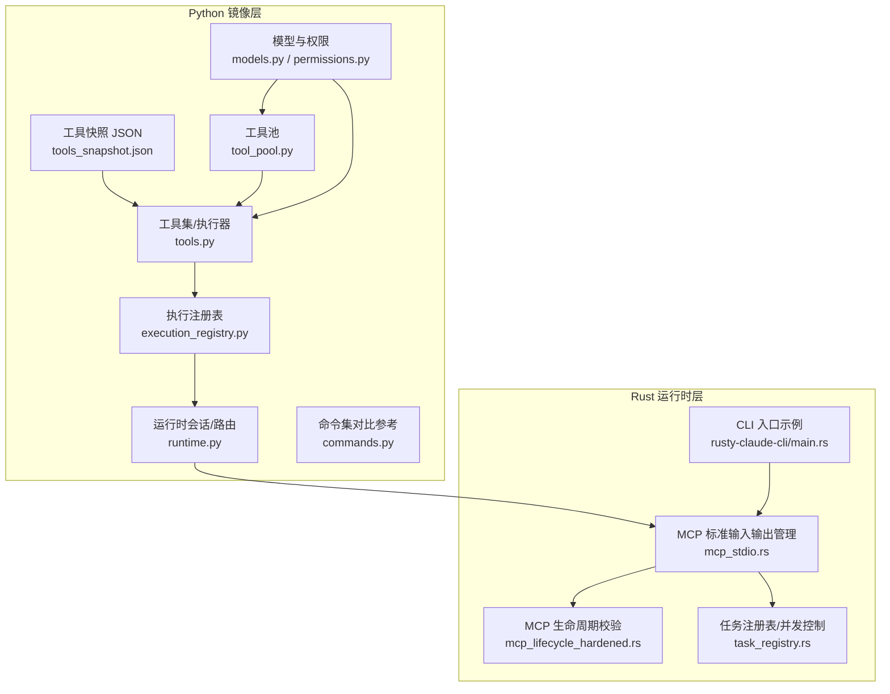
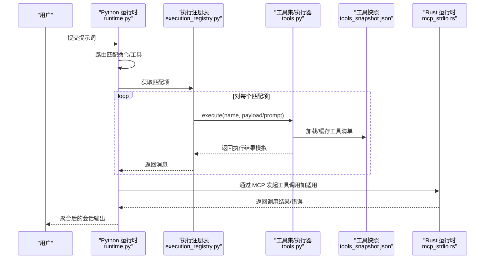
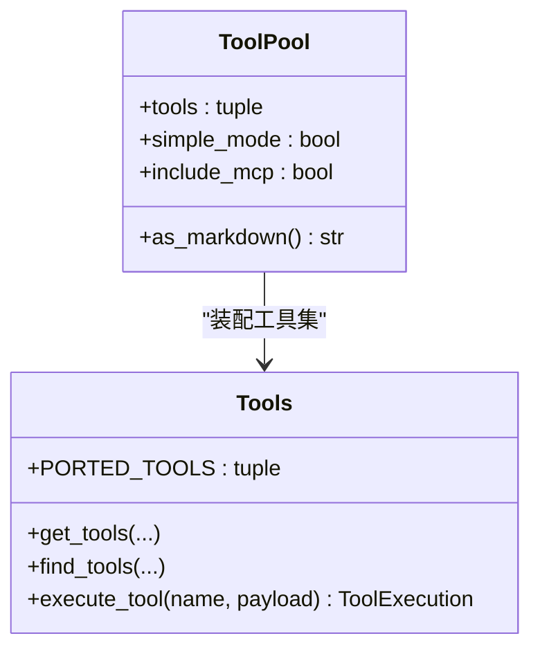
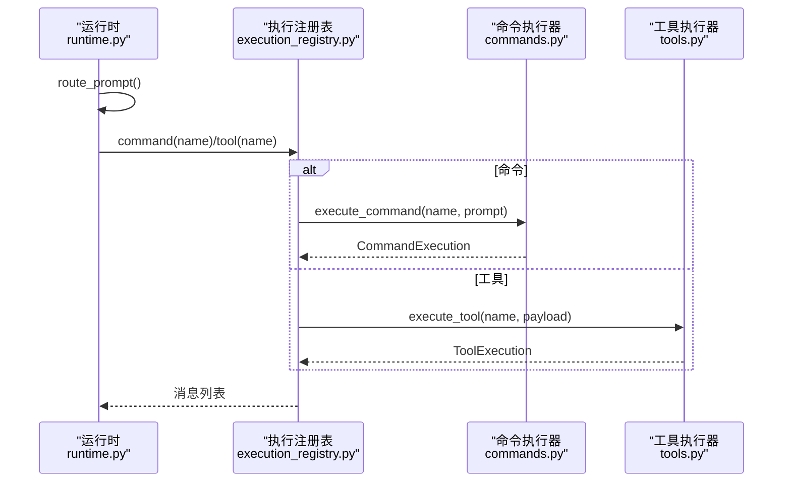
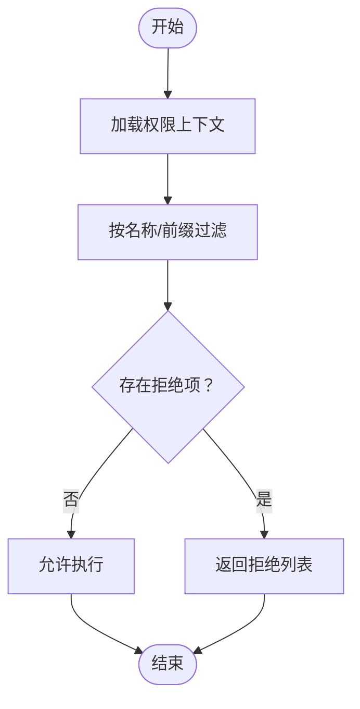
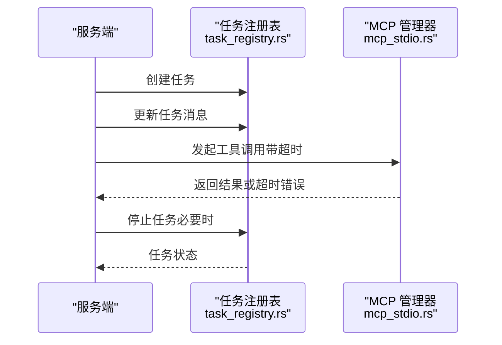
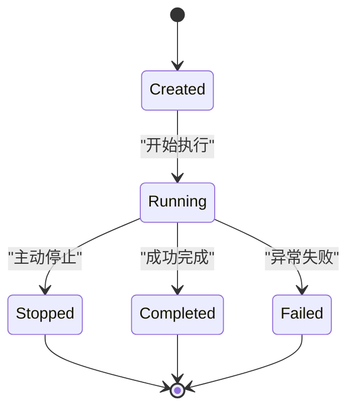
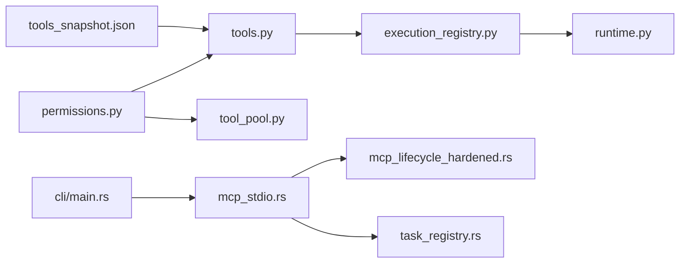

# 工具执行机制

<cite>
**本文引用的文件**
- [src/tool_pool.py](file://src/tool_pool.py)
- [src/tools.py](file://src/tools.py)
- [src/execution_registry.py](file://src/execution_registry.py)
- [src/models.py](file://src/models.py)
- [src/permissions.py](file://src/permissions.py)
- [src/runtime.py](file://src/runtime.py)
- [src/remote_runtime.py](file://src/remote_runtime.py)
- [src/reference_data/tools_snapshot.json](file://src/reference_data/tools_snapshot.json)
- [src/commands.py](file://src/commands.py)
- [rust/crates/runtime/src/mcp_stdio.rs](file://rust/crates/runtime/src/mcp_stdio.rs)
- [rust/crates/runtime/src/mcp_lifecycle_hardened.rs](file://rust/crates/runtime/src/mcp_lifecycle_hardened.rs)
- [rust/crates/runtime/src/task_registry.rs](file://rust/crates/runtime/src/task_registry.rs)
- [rust/crates/rusty-claude-cli/src/main.rs](file://rust/crates/rusty-claude-cli/src/main.rs)
</cite>

## 目录
1. [引言](#引言)
2. [项目结构](#项目结构)
3. [核心组件](#核心组件)
4. [架构总览](#架构总览)
5. [详细组件分析](#详细组件分析)
6. [依赖分析](#依赖分析)
7. [性能考虑](#性能考虑)
8. [故障排除指南](#故障排除指南)
9. [结论](#结论)
10. [附录](#附录)

## 引言
本文件系统性阐述工具执行机制，覆盖从工具发现与权限过滤、到执行注册表与路由决策、再到生命周期管理与错误恢复、并发与资源限制、以及安全隔离与审计日志等全链路能力。文档以“Python 端镜像工具层”和“Rust 运行时工具层”两条主线展开，并结合实际源码路径进行说明，帮助读者快速理解并高效使用与扩展工具执行体系。

## 项目结构
围绕工具执行的关键模块分布于 Python 与 Rust 两部分：
- Python 镜像层：负责工具清单加载、权限过滤、执行注册表构建、会话路由与执行结果聚合。
- Rust 运行时层：负责 MCP 协议交互、工具调用生命周期、并发与超时控制、沙箱隔离与资源限制。

图表来源
- [src/tool_pool.py:1-38](file://src/tool_pool.py#L1-L38)
- [src/tools.py:1-97](file://src/tools.py#L1-L97)
- [src/execution_registry.py:1-52](file://src/execution_registry.py#L1-L52)
- [src/runtime.py:1-193](file://src/runtime.py#L1-L193)
- [src/models.py:1-50](file://src/models.py#L1-L50)
- [src/permissions.py:1-21](file://src/permissions.py#L1-L21)
- [src/reference_data/tools_snapshot.json:1-800](file://src/reference_data/tools_snapshot.json#L1-L800)
- [src/commands.py:1-91](file://src/commands.py#L1-L91)
- [rust/crates/runtime/src/mcp_stdio.rs:2262-2918](file://rust/crates/runtime/src/mcp_stdio.rs#L2262-L2918)
- [rust/crates/runtime/src/mcp_lifecycle_hardened.rs:508-543](file://rust/crates/runtime/src/mcp_lifecycle_hardened.rs#L508-L543)
- [rust/crates/runtime/src/task_registry.rs:92-174](file://rust/crates/runtime/src/task_registry.rs#L92-L174)
- [rust/crates/rusty-claude-cli/src/main.rs](file://rust/crates/rusty-claude-cli/src/main.rs)

章节来源
- [src/tool_pool.py:1-38](file://src/tool_pool.py#L1-L38)
- [src/tools.py:1-97](file://src/tools.py#L1-L97)
- [src/execution_registry.py:1-52](file://src/execution_registry.py#L1-L52)
- [src/runtime.py:1-193](file://src/runtime.py#L1-L193)
- [src/models.py:1-50](file://src/models.py#L1-L50)
- [src/permissions.py:1-21](file://src/permissions.py#L1-L21)
- [src/reference_data/tools_snapshot.json:1-800](file://src/reference_data/tools_snapshot.json#L1-L800)
- [src/commands.py:1-91](file://src/commands.py#L1-L91)
- [rust/crates/runtime/src/mcp_stdio.rs:2262-2918](file://rust/crates/runtime/src/mcp_stdio.rs#L2262-L2918)
- [rust/crates/runtime/src/mcp_lifecycle_hardened.rs:508-543](file://rust/crates/runtime/src/mcp_lifecycle_hardened.rs#L508-L543)
- [rust/crates/runtime/src/task_registry.rs:92-174](file://rust/crates/runtime/src/task_registry.rs#L92-L174)
- [rust/crates/rusty-claude-cli/src/main.rs](file://rust/crates/rusty-claude-cli/src/main.rs)

## 核心组件
- 工具池与工具集
  - 工具池封装工具集合、简单模式与是否包含 MCP 的开关，并可渲染为 Markdown 摘要。
  - 工具集负责从快照加载工具元数据、按权限上下文过滤、按名称/查询检索、执行模拟返回。
- 执行注册表
  - 将已镜像的工具与命令包装为可执行对象，提供按名称查找与执行。
- 权限与模型
  - 权限上下文支持基于名称与前缀的拒绝策略；模型定义了模块、回溯清单、使用统计等。
- 运行时会话与路由
  - 路由根据提示词分词匹配工具/命令，构建会话并收集执行消息；支持多轮对话与停止条件。
- Rust 运行时工具层
  - 提供 MCP 工具调用、生命周期校验、并发任务注册表、超时控制与沙箱隔离等能力。

章节来源
- [src/tool_pool.py:10-38](file://src/tool_pool.py#L10-L38)
- [src/tools.py:14-97](file://src/tools.py#L14-L97)
- [src/execution_registry.py:9-52](file://src/execution_registry.py#L9-L52)
- [src/models.py:6-50](file://src/models.py#L6-L50)
- [src/permissions.py:6-21](file://src/permissions.py#L6-L21)
- [src/runtime.py:89-193](file://src/runtime.py#L89-L193)
- [rust/crates/runtime/src/mcp_stdio.rs:2262-2918](file://rust/crates/runtime/src/mcp_stdio.rs#L2262-L2918)
- [rust/crates/runtime/src/mcp_lifecycle_hardened.rs:508-543](file://rust/crates/runtime/src/mcp_lifecycle_hardened.rs#L508-L543)
- [rust/crates/runtime/src/task_registry.rs:92-174](file://rust/crates/runtime/src/task_registry.rs#L92-L174)

## 架构总览
下图展示从用户提示到工具执行与结果聚合的端到端流程，以及与 Rust 运行时的交互边界。

图表来源
- [src/runtime.py:89-152](file://src/runtime.py#L89-L152)
- [src/execution_registry.py:18-25](file://src/execution_registry.py#L18-L25)
- [src/tools.py:81-87](file://src/tools.py#L81-L87)
- [src/reference_data/tools_snapshot.json:1-800](file://src/reference_data/tools_snapshot.json#L1-L800)
- [rust/crates/runtime/src/mcp_stdio.rs:2262-2918](file://rust/crates/runtime/src/mcp_stdio.rs#L2262-L2918)

## 详细组件分析

### 工具池与工具集
- 工具池
  - 组织工具集合、简单模式与是否包含 MCP 的开关，支持渲染摘要。
- 工具集
  - 从 JSON 快照加载工具元数据，构建只读工具列表。
  - 支持按简单模式筛选（如 Bash、文件读写等），按是否包含 MCP 过滤。
  - 支持按权限上下文过滤，拒绝指定名称或前缀的工具。
  - 提供按名称/查询检索、执行模拟（返回消息而非真实执行）。

图表来源
- [src/tool_pool.py:10-38](file://src/tool_pool.py#L10-L38)
- [src/tools.py:23-97](file://src/tools.py#L23-L97)

章节来源
- [src/tool_pool.py:10-38](file://src/tool_pool.py#L10-L38)
- [src/tools.py:23-97](file://src/tools.py#L23-L97)

### 执行注册表与路由
- 执行注册表
  - 将工具与命令封装为可执行对象，提供按名称查找与执行。
- 路由与会话
  - 基于提示词分词匹配工具/命令，优先选择高分项，支持多轮对话。
  - 会话中记录匹配、执行、权限拒绝、持久化会话路径等信息。

图表来源
- [src/runtime.py:89-152](file://src/runtime.py#L89-L152)
- [src/execution_registry.py:18-44](file://src/execution_registry.py#L18-L44)
- [src/commands.py:75-81](file://src/commands.py#L75-L81)
- [src/tools.py:81-87](file://src/tools.py#L81-L87)

章节来源
- [src/execution_registry.py:18-52](file://src/execution_registry.py#L18-L52)
- [src/runtime.py:89-152](file://src/runtime.py#L89-L152)
- [src/commands.py:75-81](file://src/commands.py#L75-L81)
- [src/tools.py:81-87](file://src/tools.py#L81-L87)

### 权限与安全隔离
- 权限上下文
  - 支持基于名称与前缀的拒绝策略，用于在工具执行前进行预过滤。
- 安全与隔离（Rust 层）
  - MCP 工具调用具备生命周期校验，确保阶段转换合法。
  - 提供超时测试用例，体现对慢调用的防护能力。
  - 沙箱配置（如文件系统隔离、网络隔离、挂载限制）在 Bash 工具输入结构中可见，用于限制工具执行风险。

图表来源
- [src/permissions.py:11-21](file://src/permissions.py#L11-L21)
- [src/tools.py:56-60](file://src/tools.py#L56-L60)
- [rust/crates/runtime/src/mcp_lifecycle_hardened.rs:508-543](file://rust/crates/runtime/src/mcp_lifecycle_hardened.rs#L508-L543)
- [rust/crates/runtime/src/mcp_stdio.rs:2300-2300](file://rust/crates/runtime/src/mcp_stdio.rs#L2300-L2300)

章节来源
- [src/permissions.py:11-21](file://src/permissions.py#L11-L21)
- [src/tools.py:56-60](file://src/tools.py#L56-L60)
- [rust/crates/runtime/src/mcp_lifecycle_hardened.rs:508-543](file://rust/crates/runtime/src/mcp_lifecycle_hardened.rs#L508-L543)
- [rust/crates/runtime/src/mcp_stdio.rs:2300-2300](file://rust/crates/runtime/src/mcp_stdio.rs#L2300-L2300)

### 并发控制与任务队列
- Rust 任务注册表
  - 提供任务创建、查询、更新、停止、输出等操作，内部使用互斥锁保护状态。
  - 支持按状态过滤列出任务，便于实现队列与调度。
- 并发与超时
  - MCP 管理器对慢工具调用具备超时处理能力，避免阻塞。
  - Bash 工具输入结构包含超时字段，便于在调用侧设置执行时限。

图表来源
- [rust/crates/runtime/src/task_registry.rs:92-174](file://rust/crates/runtime/src/task_registry.rs#L92-L174)
- [rust/crates/runtime/src/mcp_stdio.rs:2262-2918](file://rust/crates/runtime/src/mcp_stdio.rs#L2262-L2918)

章节来源
- [rust/crates/runtime/src/task_registry.rs:92-174](file://rust/crates/runtime/src/task_registry.rs#L92-L174)
- [rust/crates/runtime/src/mcp_stdio.rs:2262-2918](file://rust/crates/runtime/src/mcp_stdio.rs#L2262-L2918)

### 生命周期管理与状态跟踪
- Python 层
  - 会话对象记录路由匹配、执行消息、流事件、持久化路径等，便于审计与回放。
- Rust 层
  - MCP 生命周期校验保障阶段转换合法性，防止非法状态推进。
  - 任务注册表维护任务状态机（创建、运行、停止、完成、失败），统一状态变更入口。

图表来源
- [rust/crates/runtime/src/task_registry.rs:92-174](file://rust/crates/runtime/src/task_registry.rs#L92-L174)
- [rust/crates/runtime/src/mcp_lifecycle_hardened.rs:508-543](file://rust/crates/runtime/src/mcp_lifecycle_hardened.rs#L508-L543)

章节来源
- [src/runtime.py:24-86](file://src/runtime.py#L24-L86)
- [rust/crates/runtime/src/task_registry.rs:92-174](file://rust/crates/runtime/src/task_registry.rs#L92-L174)
- [rust/crates/runtime/src/mcp_lifecycle_hardened.rs:508-543](file://rust/crates/runtime/src/mcp_lifecycle_hardened.rs#L508-L543)

### 错误恢复与超时处理
- 工具执行
  - Python 层的工具执行返回结构包含“已处理/未处理”与消息字段，便于上层统一处理未知工具或执行失败。
- 超时与错误传播
  - Rust 层对慢调用进行超时处理；未知工具名等错误有明确返回，便于上层进行重试或降级。
- 权限拒绝
  - 对破坏性工具（如 Bash）在 Python 层进行显式拒绝并记录原因，避免越权执行。

章节来源
- [src/tools.py:14-21](file://src/tools.py#L14-L21)
- [src/tools.py:81-87](file://src/tools.py#L81-L87)
- [rust/crates/runtime/src/mcp_stdio.rs:2894-2918](file://rust/crates/runtime/src/mcp_stdio.rs#L2894-L2918)
- [src/runtime.py:169-174](file://src/runtime.py#L169-L174)

### 性能监控与资源限制
- Python 层
  - 使用 LRU 缓存加载工具快照，减少重复 IO。
  - 使用冻结数据类，降低内存占用与拷贝成本。
- Rust 层
  - 互斥锁保护的任务注册表适合中低并发场景；若需更高吞吐，可引入无锁队列或通道。
  - Bash 工具输入结构提供超时、后台运行、沙箱隔离等参数，便于精细化资源限制。

章节来源
- [src/tools.py:23-34](file://src/tools.py#L23-L34)
- [rust/crates/runtime/src/task_registry.rs:92-174](file://rust/crates/runtime/src/task_registry.rs#L92-L174)
- [rust/crates/tools/src/lib.rs:149-199](file://rust/crates/tools/src/lib.rs#L149-L199)

### 安全隔离、权限验证与审计日志
- 权限验证
  - Python 层：权限上下文支持名称与前缀拒绝；工具集按上下文过滤。
  - Rust 层：MCP 生命周期校验，防止非法状态推进；工具调用具备超时与错误报告。
- 审计日志
  - Python 层：会话对象记录历史、匹配、执行、持久化路径等，便于审计与复盘。
  - 远程模式占位：远程/SSH/Teleport 模式报告可用于外部审计集成。

章节来源
- [src/permissions.py:11-21](file://src/permissions.py#L11-L21)
- [src/tools.py:56-60](file://src/tools.py#L56-L60)
- [rust/crates/runtime/src/mcp_lifecycle_hardened.rs:508-543](file://rust/crates/runtime/src/mcp_lifecycle_hardened.rs#L508-L543)
- [src/runtime.py:24-86](file://src/runtime.py#L24-L86)
- [src/remote_runtime.py:16-26](file://src/remote_runtime.py#L16-L26)

## 依赖分析
- Python 端
  - 工具池依赖工具集与权限上下文；工具集依赖快照 JSON；执行注册表依赖工具集；运行时会话依赖注册表与查询引擎。
- Rust 端
  - MCP 管理器依赖生命周期校验与任务注册表；CLI 示例作为入口接入 MCP 管理器。

图表来源
- [src/reference_data/tools_snapshot.json:1-800](file://src/reference_data/tools_snapshot.json#L1-L800)
- [src/tools.py:1-10](file://src/tools.py#L1-L10)
- [src/permissions.py:1-10](file://src/permissions.py#L1-L10)
- [src/tool_pool.py:1-10](file://src/tool_pool.py#L1-L10)
- [src/execution_registry.py:1-10](file://src/execution_registry.py#L1-L10)
- [src/runtime.py:1-15](file://src/runtime.py#L1-L15)
- [rust/crates/runtime/src/mcp_stdio.rs:2262-2918](file://rust/crates/runtime/src/mcp_stdio.rs#L2262-L2918)
- [rust/crates/runtime/src/mcp_lifecycle_hardened.rs:508-543](file://rust/crates/runtime/src/mcp_lifecycle_hardened.rs#L508-L543)
- [rust/crates/runtime/src/task_registry.rs:92-174](file://rust/crates/runtime/src/task_registry.rs#L92-L174)
- [rust/crates/rusty-claude-cli/src/main.rs](file://rust/crates/rusty-claude-cli/src/main.rs)

章节来源
- [src/tools.py:1-10](file://src/tools.py#L1-L10)
- [src/permissions.py:1-10](file://src/permissions.py#L1-L10)
- [src/tool_pool.py:1-10](file://src/tool_pool.py#L1-L10)
- [src/execution_registry.py:1-10](file://src/execution_registry.py#L1-L10)
- [src/runtime.py:1-15](file://src/runtime.py#L1-L15)
- [rust/crates/runtime/src/mcp_stdio.rs:2262-2918](file://rust/crates/runtime/src/mcp_stdio.rs#L2262-L2918)
- [rust/crates/runtime/src/mcp_lifecycle_hardened.rs:508-543](file://rust/crates/runtime/src/mcp_lifecycle_hardened.rs#L508-L543)
- [rust/crates/runtime/src/task_registry.rs:92-174](file://rust/crates/runtime/src/task_registry.rs#L92-L174)
- [rust/crates/rusty-claude-cli/src/main.rs](file://rust/crates/rusty-claude-cli/src/main.rs)

## 性能考虑
- 缓存与序列化
  - 工具快照采用 LRU 缓存，避免重复解析 JSON。
- 数据结构
  - 冻结数据类减少运行时开销；元组用于不可变集合，利于共享与并发访问。
- 并发与队列
  - 当前任务注册表使用互斥锁，适合中小规模并发；高并发场景建议引入通道或无锁队列。
- 资源限制
  - Bash 工具输入结构提供超时、后台运行、沙箱隔离等参数，建议在生产环境默认启用沙箱与合理超时。

章节来源
- [src/tools.py:23-34](file://src/tools.py#L23-L34)
- [rust/crates/tools/src/lib.rs:149-199](file://rust/crates/tools/src/lib.rs#L149-L199)

## 故障排除指南
- 工具未找到
  - 现象：返回“未知镜像工具”消息。
  - 排查：确认工具名称大小写、是否被权限上下文拒绝、是否包含 MCP。
- 权限拒绝
  - 现象：针对破坏性工具（如 Bash）返回拒绝原因。
  - 排查：检查权限上下文配置与前缀规则。
- 超时与慢调用
  - 现象：MCP 工具调用超时或返回未知工具名错误。
  - 排查：调整超时阈值、检查工具服务器可用性、确认工具名称与命名空间。
- 会话无法持久化
  - 现象：会话持久化路径为空或失败。
  - 排查：检查工作区权限与存储路径。

章节来源
- [src/tools.py:81-87](file://src/tools.py#L81-L87)
- [src/runtime.py:169-174](file://src/runtime.py#L169-L174)
- [rust/crates/runtime/src/mcp_stdio.rs:2300-2300](file://rust/crates/runtime/src/mcp_stdio.rs#L2300-L2300)
- [rust/crates/runtime/src/mcp_stdio.rs:2894-2918](file://rust/crates/runtime/src/mcp_stdio.rs#L2894-L2918)

## 结论
该工具执行机制通过“Python 镜像层 + Rust 运行时层”的协同设计，实现了从工具发现、权限过滤、执行注册、路由决策到生命周期管理与安全隔离的完整闭环。Python 层负责易扩展与快速迭代，Rust 层负责高性能与强约束。结合缓存、并发控制、超时与沙箱等手段，可在保证安全性的同时满足多样化的工具执行需求。

## 附录
- 远程模式占位
  - 提供远程/SSH/Teleport 模式报告，便于后续集成外部控制与审计。

章节来源
- [src/remote_runtime.py:16-26](file://src/remote_runtime.py#L16-L26)