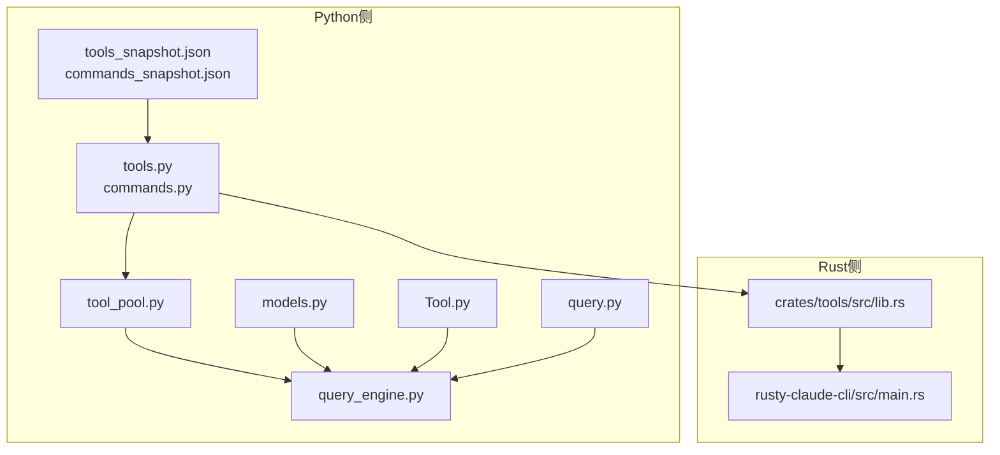
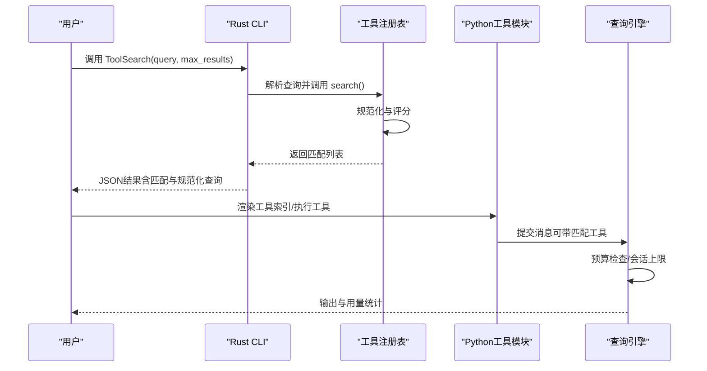
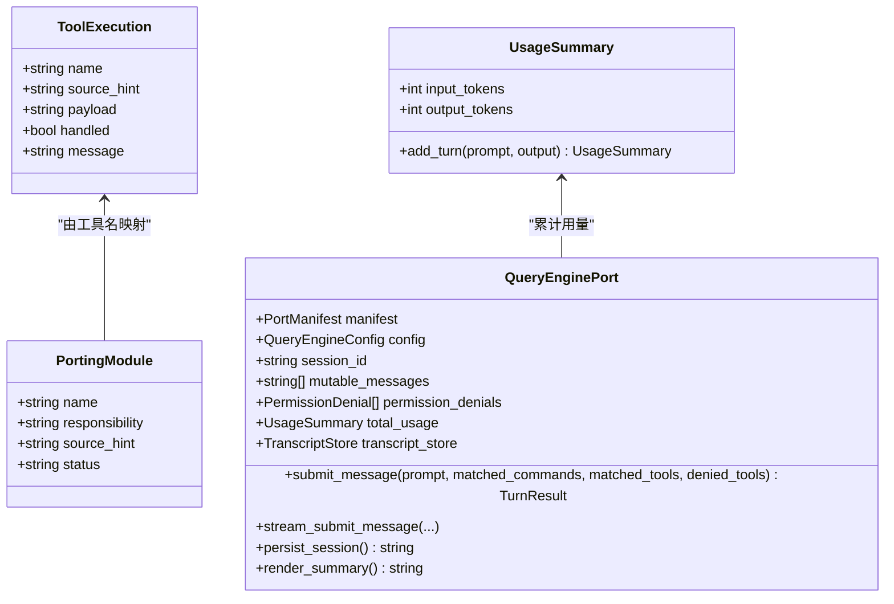
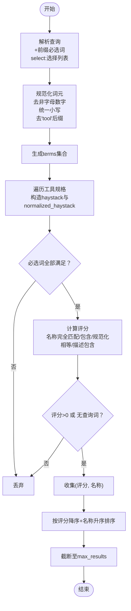
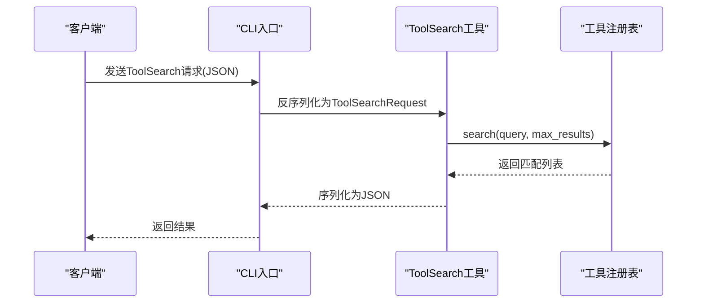
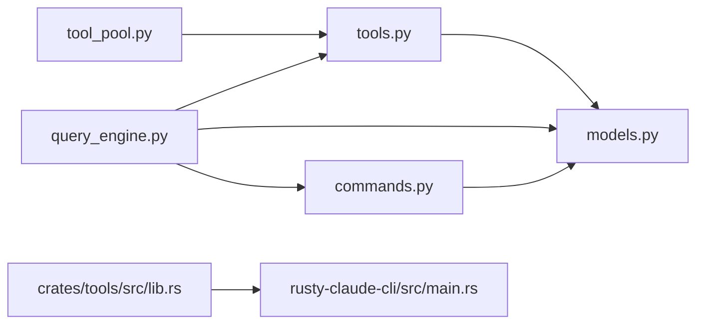

# 工具搜索与发现

<cite>
**本文引用的文件**   
- [src/query_engine.py](file://src/query_engine.py)
- [src/tool_pool.py](file://src/tool_pool.py)
- [src/tools.py](file://src/tools.py)
- [src/commands.py](file://src/commands.py)
- [src/models.py](file://src/models.py)
- [src/Tool.py](file://src/Tool.py)
- [src/query.py](file://src/query.py)
- [src/reference_data/tools_snapshot.json](file://src/reference_data/tools_snapshot.json)
- [src/reference_data/commands_snapshot.json](file://src/reference_data/commands_snapshot.json)
- [rust/crates/tools/src/lib.rs](file://rust/crates/tools/src/lib.rs)
- [rust/crates/rusty-claude-cli/src/main.rs](file://rust/crates/rusty-claude-cli/src/main.rs)
</cite>

## 目录
1. [简介](#简介)
2. [项目结构](#项目结构)
3. [核心组件](#核心组件)
4. [架构总览](#架构总览)
5. [详细组件分析](#详细组件分析)
6. [依赖分析](#依赖分析)
7. [性能考虑](#性能考虑)
8. [故障排查指南](#故障排查指南)
9. [结论](#结论)
10. [附录](#附录)

## 简介
本文件系统性阐述工具搜索与发现能力，覆盖以下方面：
- 搜索算法：Python侧的简单子串匹配与Rust侧的规范化、关键词加权与排序
- 匹配机制：大小写不敏感、名称与描述字段、别名与选择式查询
- 排序策略：基于词元规范化、精确度与权重的综合评分
- 名称规范化：去除非字母数字字符、统一小写、去“tool”后缀等
- 查询处理与结果过滤：支持“+前缀必选词”“select:”选择列表、“最大结果数”等
- 性能优化：LRU缓存、快照加载、分页/限制返回数量
- 缓存与索引：Python侧JSON快照+LRU；Rust侧全局注册表与内建规范
- API接口：Python侧工具索引渲染；Rust侧ToolSearch工具执行
- 会话管理与智能推荐：结合对话上下文进行会话压缩与摘要输出
- 错误处理与边界：未知工具、权限拒绝、预算超限、会话上限

## 项目结构
该仓库同时包含Python与Rust两套实现：
- Python侧：工具清单快照、命令清单快照、工具池装配、查询引擎（会话与用量）
- Rust侧：工具搜索算法、规范化与排序、工具执行入口、CLI工具调用

**图表来源**
- [src/tools.py:1-97](file://src/tools.py#L1-L97)
- [src/commands.py:1-91](file://src/commands.py#L1-L91)
- [src/tool_pool.py:1-38](file://src/tool_pool.py#L1-L38)
- [src/query_engine.py:1-194](file://src/query_engine.py#L1-L194)
- [src/models.py:1-50](file://src/models.py#L1-L50)
- [src/Tool.py:1-16](file://src/Tool.py#L1-L16)
- [src/query.py:1-14](file://src/query.py#L1-L14)
- [rust/crates/tools/src/lib.rs:4866-4966](file://rust/crates/tools/src/lib.rs#L4866-L4966)
- [rust/crates/rusty-claude-cli/src/main.rs:7948-7964](file://rust/crates/rusty-claude-cli/src/main.rs#L7948-L7964)

**章节来源**
- [src/tools.py:1-97](file://src/tools.py#L1-L97)
- [src/commands.py:1-91](file://src/commands.py#L1-L91)
- [src/tool_pool.py:1-38](file://src/tool_pool.py#L1-L38)
- [src/query_engine.py:1-194](file://src/query_engine.py#L1-L194)
- [src/models.py:1-50](file://src/models.py#L1-L50)
- [src/Tool.py:1-16](file://src/Tool.py#L1-L16)
- [src/query.py:1-14](file://src/query.py#L1-L14)
- [rust/crates/tools/src/lib.rs:4866-4966](file://rust/crates/tools/src/lib.rs#L4866-L4966)
- [rust/crates/rusty-claude-cli/src/main.rs:7948-7964](file://rust/crates/rusty-claude-cli/src/main.rs#L7948-L7964)

## 核心组件
- Python工具与命令快照与检索
  - 工具快照：从JSON加载，构建PortingModule列表，提供名称、职责、来源提示、状态
  - 命令快照：同上，用于命令检索
  - 工具检索：大小写不敏感子串匹配，支持简单模式与MCP过滤，支持权限上下文过滤
  - 命令检索：同上
- Python工具池装配
  - 组装工具池，支持简单模式、是否包含MCP、权限上下文
- Python查询引擎
  - 会话管理：消息存储、用量统计、预算控制、会话持久化
  - 输出格式：普通或结构化（JSON），带重试与回退
- Rust工具搜索算法
  - 规范化：词元提取、去非ASCII字母数字、统一小写、去“tool”后缀
  - 查询解析：空格/逗号分词、+前缀必选词、select:选择列表
  - 排序：名称完全匹配、名称包含、规范化名称相等、描述包含等多维加权
  - 结果：按分数降序、名称字典序次优排序，限制返回数量
- Rust CLI工具调用
  - ToolSearch工具执行：接收查询与最大结果数，返回匹配列表与规范化查询

**章节来源**
- [src/tools.py:1-97](file://src/tools.py#L1-L97)
- [src/commands.py:1-91](file://src/commands.py#L1-L91)
- [src/tool_pool.py:1-38](file://src/tool_pool.py#L1-L38)
- [src/query_engine.py:1-194](file://src/query_engine.py#L1-L194)
- [rust/crates/tools/src/lib.rs:4883-4966](file://rust/crates/tools/src/lib.rs#L4883-L4966)
- [rust/crates/rusty-claude-cli/src/main.rs:7948-7964](file://rust/crates/rusty-claude-cli/src/main.rs#L7948-L7964)

## 架构总览
工具搜索与发现贯穿“数据源—检索—排序—呈现—执行”的链路。

**图表来源**
- [rust/crates/tools/src/lib.rs:4866-4966](file://rust/crates/tools/src/lib.rs#L4866-L4966)
- [rust/crates/rusty-claude-cli/src/main.rs:7948-7964](file://rust/crates/rusty-claude-cli/src/main.rs#L7948-L7964)
- [src/tools.py:89-97](file://src/tools.py#L89-L97)
- [src/query_engine.py:61-127](file://src/query_engine.py#L61-L127)

## 详细组件分析

### Python工具检索与会话管理
- 快照加载与缓存
  - 工具与命令均通过LRU缓存加载JSON快照，避免重复IO
  - 工具快照路径指向tools_snapshot.json，命令快照指向commands_snapshot.json
- 工具检索
  - 大小写不敏感子串匹配，支持限制返回数量
  - 支持简单模式（仅少数内置工具）、排除MCP、按权限上下文过滤
- 命令检索
  - 同工具检索，支持排除插件/技能来源
- 工具池装配
  - 组装ToolPool，提供Markdown概览
- 查询引擎
  - 会话消息存储、用量统计（按词数估算）、预算控制、紧凑化策略
  - 支持流式提交消息，逐步返回匹配命令/工具、权限拒绝与最终输出

**图表来源**
- [src/models.py:14-49](file://src/models.py#L14-L49)
- [src/tools.py:14-21](file://src/tools.py#L14-L21)
- [src/query_engine.py:15-44](file://src/query_engine.py#L15-L44)
- [src/query_engine.py:61-127](file://src/query_engine.py#L61-L127)

**章节来源**
- [src/tools.py:23-37](file://src/tools.py#L23-L37)
- [src/commands.py:22-36](file://src/commands.py#L22-L36)
- [src/tool_pool.py:28-38](file://src/tool_pool.py#L28-L38)
- [src/query_engine.py:15-194](file://src/query_engine.py#L15-L194)

### Rust工具搜索算法与排序
- 查询解析
  - 规范化：空白与逗号分词，去非ASCII字母数字，统一小写，去除“tool”后缀
  - “+前缀”表示必选词，“select:”表示直接选择列表
- 匹配与评分
  - 在名称、规范化名称、描述中查找关键词
  - 多维加权：完全匹配名称、包含名称、规范化名称相等、描述包含
  - 若未命中且存在查询词，则丢弃
- 排序与截断
  - 先按分数降序，再按名称字典序次序
  - 截取最多max_results条

**图表来源**
- [rust/crates/tools/src/lib.rs:4883-4966](file://rust/crates/tools/src/lib.rs#L4883-L4966)
- [rust/crates/tools/src/lib.rs:4968-4988](file://rust/crates/tools/src/lib.rs#L4968-L4988)

**章节来源**
- [rust/crates/tools/src/lib.rs:4883-4966](file://rust/crates/tools/src/lib.rs#L4883-L4966)
- [rust/crates/tools/src/lib.rs:4968-4988](file://rust/crates/tools/src/lib.rs#L4968-L4988)

### API与返回格式
- Python侧
  - 工具索引渲染：支持按查询过滤与限制数量
  - 命令索引渲染：同上
- Rust侧
  - ToolSearch工具：输入为查询字符串与最大结果数，输出为匹配列表与规范化查询
  - CLI执行入口：将请求解析为ToolSearchRequest，调用工具注册表search并序列化返回

**图表来源**
- [rust/crates/rusty-claude-cli/src/main.rs:7948-7964](file://rust/crates/rusty-claude-cli/src/main.rs#L7948-L7964)
- [rust/crates/tools/src/lib.rs:4866-4869](file://rust/crates/tools/src/lib.rs#L4866-L4869)

**章节来源**
- [src/tools.py:89-97](file://src/tools.py#L89-L97)
- [src/commands.py:83-91](file://src/commands.py#L83-L91)
- [rust/crates/rusty-claude-cli/src/main.rs:7948-7964](file://rust/crates/rusty-claude-cli/src/main.rs#L7948-L7964)
- [rust/crates/tools/src/lib.rs:4866-4869](file://rust/crates/tools/src/lib.rs#L4866-L4869)

### 会话管理与智能推荐
- 会话存储与紧凑化
  - 存储用户消息与用量，超过阈值时仅保留最近若干轮并压缩历史
- 智能推荐
  - 基于会话上下文与工具/命令快照，可作为后续工具选择的参考
  - 权限与预算控制防止过度消耗

**章节来源**
- [src/query_engine.py:129-139](file://src/query_engine.py#L129-L139)
- [src/query_engine.py:171-194](file://src/query_engine.py#L171-L194)

## 依赖分析
- Python侧
  - tools.py依赖models与权限上下文，依赖JSON快照
  - commands.py依赖models与JSON快照
  - tool_pool.py依赖tools与权限上下文
  - query_engine.py依赖commands、models、port_manifest、session_store、tools、transcript
- Rust侧
  - crates/tools/src/lib.rs提供工具搜索算法与执行入口
  - rusty-claude-cli/src/main.rs对接CLI请求，调用工具注册表search

**图表来源**
- [src/tools.py:1-97](file://src/tools.py#L1-L97)
- [src/commands.py:1-91](file://src/commands.py#L1-L91)
- [src/tool_pool.py:1-38](file://src/tool_pool.py#L1-L38)
- [src/query_engine.py:1-194](file://src/query_engine.py#L1-L194)
- [rust/crates/tools/src/lib.rs:4866-4966](file://rust/crates/tools/src/lib.rs#L4866-L4966)
- [rust/crates/rusty-claude-cli/src/main.rs:7948-7964](file://rust/crates/rusty-claude-cli/src/main.rs#L7948-L7964)

**章节来源**
- [src/tools.py:1-97](file://src/tools.py#L1-L97)
- [src/commands.py:1-91](file://src/commands.py#L1-L91)
- [src/tool_pool.py:1-38](file://src/tool_pool.py#L1-L38)
- [src/query_engine.py:1-194](file://src/query_engine.py#L1-L194)
- [rust/crates/tools/src/lib.rs:4866-4966](file://rust/crates/tools/src/lib.rs#L4866-L4966)
- [rust/crates/rusty-claude-cli/src/main.rs:7948-7964](file://rust/crates/rusty-claude-cli/src/main.rs#L7948-L7964)

## 性能考虑
- 缓存策略
  - Python：工具与命令快照使用LRU缓存，避免重复读取
  - Rust：工具搜索在注册表层面对查询进行高效处理
- IO与内存
  - JSON快照一次性加载，运行期只做内存查找
- 排序复杂度
  - Rust侧对候选集评分与排序，时间复杂度近似O(N·K)，N为候选数，K为查询词数
- 限制与截断
  - 默认限制返回数量，避免大结果集带来的渲染与传输开销
- 会话压缩
  - 超过阈值自动压缩历史消息，降低上下文长度与成本

**章节来源**
- [src/tools.py:23-37](file://src/tools.py#L23-L37)
- [src/commands.py:22-36](file://src/commands.py#L22-L36)
- [rust/crates/tools/src/lib.rs:4883-4966](file://rust/crates/tools/src/lib.rs#L4883-L4966)
- [src/query_engine.py:129-139](file://src/query_engine.py#L129-L139)

## 故障排查指南
- 未知工具
  - Python：execute_tool/get_tool返回未识别提示
  - Rust：ToolSearch返回匹配列表为空或规范化查询
- 权限拒绝
  - Python：QueryEnginePort在提交消息时记录权限拒绝
- 预算超限/会话上限
  - Python：达到预算或轮次上限时提前停止并返回原因
- CLI参数错误
  - Rust：ToolSearch请求JSON反序列化失败时抛出错误

**章节来源**
- [src/tools.py:81-86](file://src/tools.py#L81-L86)
- [src/query_engine.py:68-104](file://src/query_engine.py#L68-L104)
- [rust/crates/rusty-claude-cli/src/main.rs:7948-7964](file://rust/crates/rusty-claude-cli/src/main.rs#L7948-L7964)

## 结论
该系统在Python与Rust两端分别提供了稳定的工具检索与会话管理能力。Python端以快照+LRU缓存实现高效检索，Rust端以规范化与加权评分实现更精细的排序。两者通过CLI工具调用形成闭环，既可用于交互式查询，也可嵌入到会话流程中实现智能推荐与预算控制。

## 附录

### 查询语法与示例
- Rust工具搜索
  - 关键词查询：直接传入查询字符串
  - 必选词：使用“+词”形式
  - 选择式：使用“select:名称1,名称2”
  - 最大结果数：通过请求参数指定
- Python工具索引
  - 支持按查询过滤与限制数量

**章节来源**
- [rust/crates/tools/src/lib.rs:4883-4916](file://rust/crates/tools/src/lib.rs#L4883-L4916)
- [src/tools.py:89-97](file://src/tools.py#L89-L97)