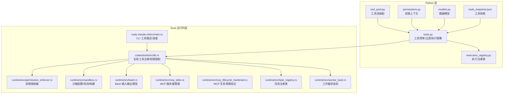
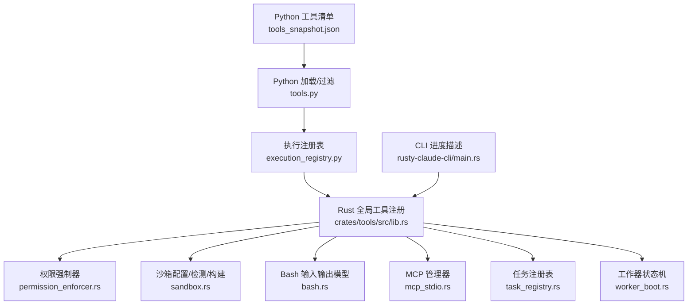
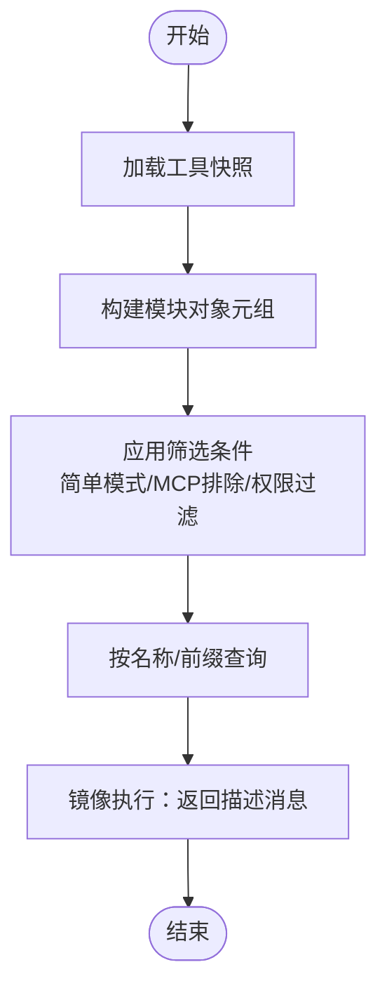
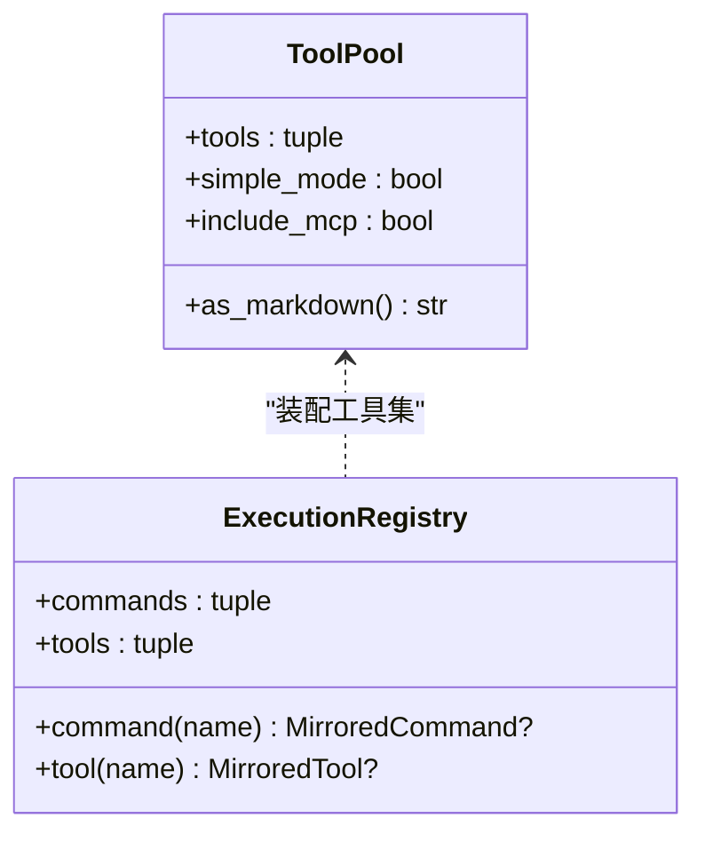
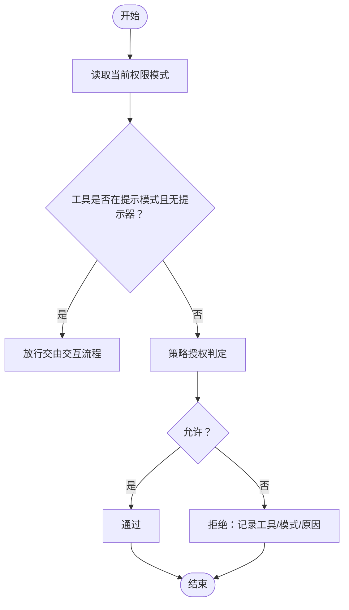
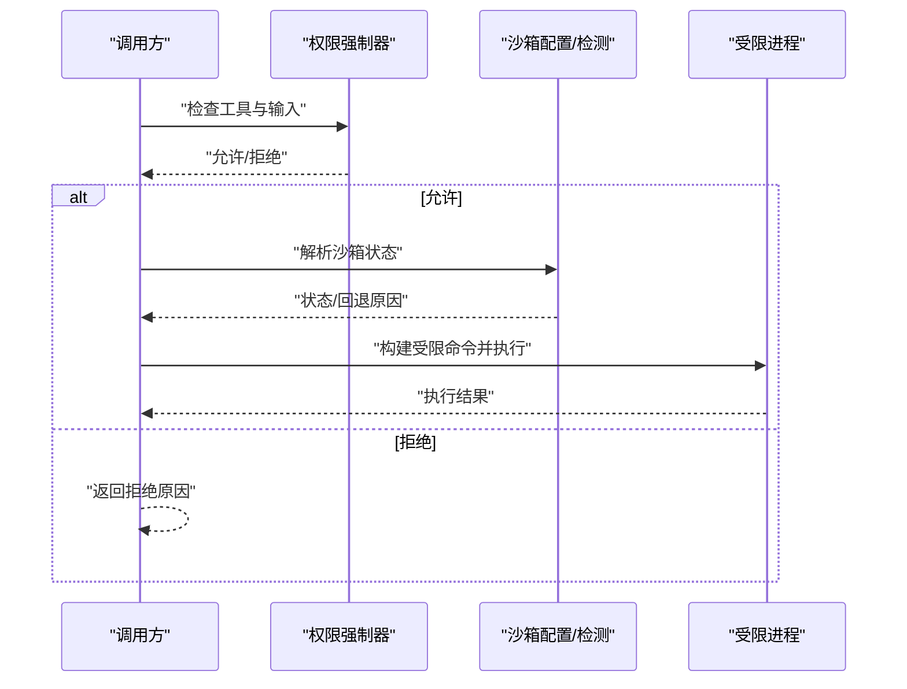
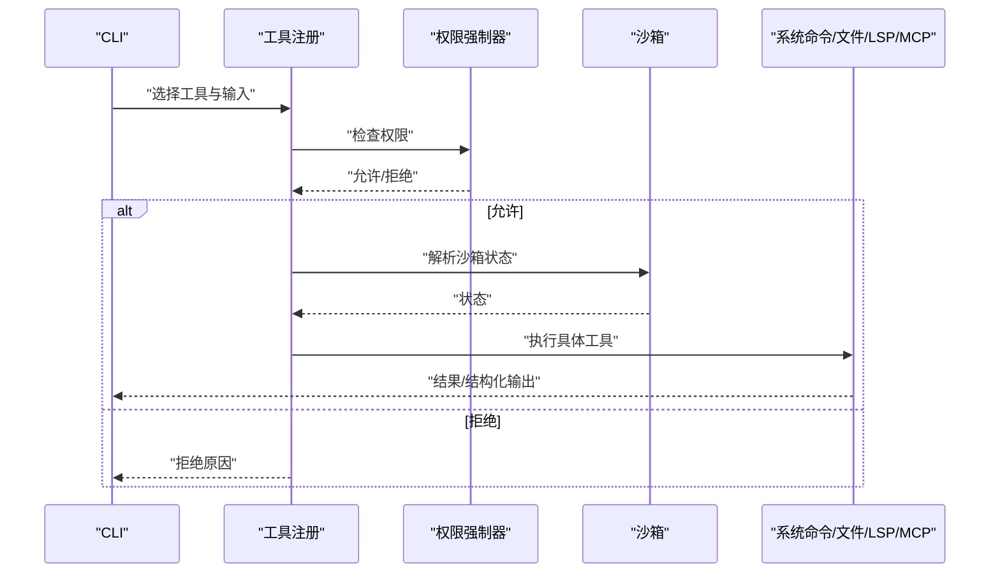
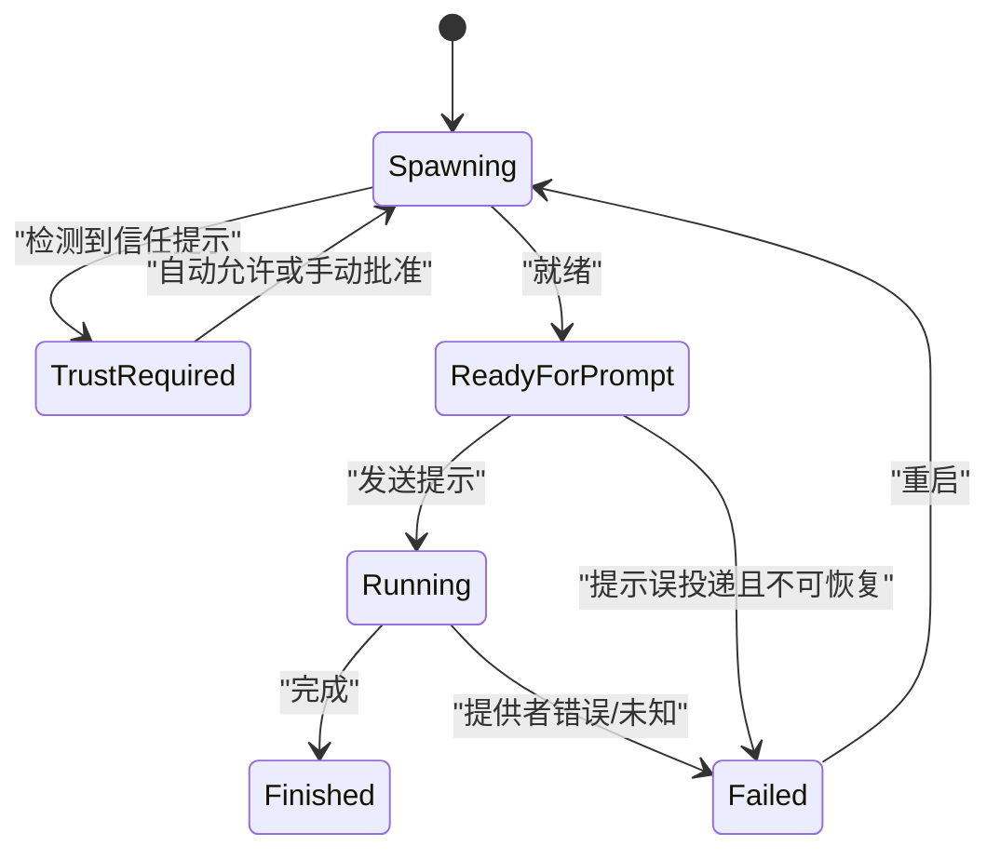
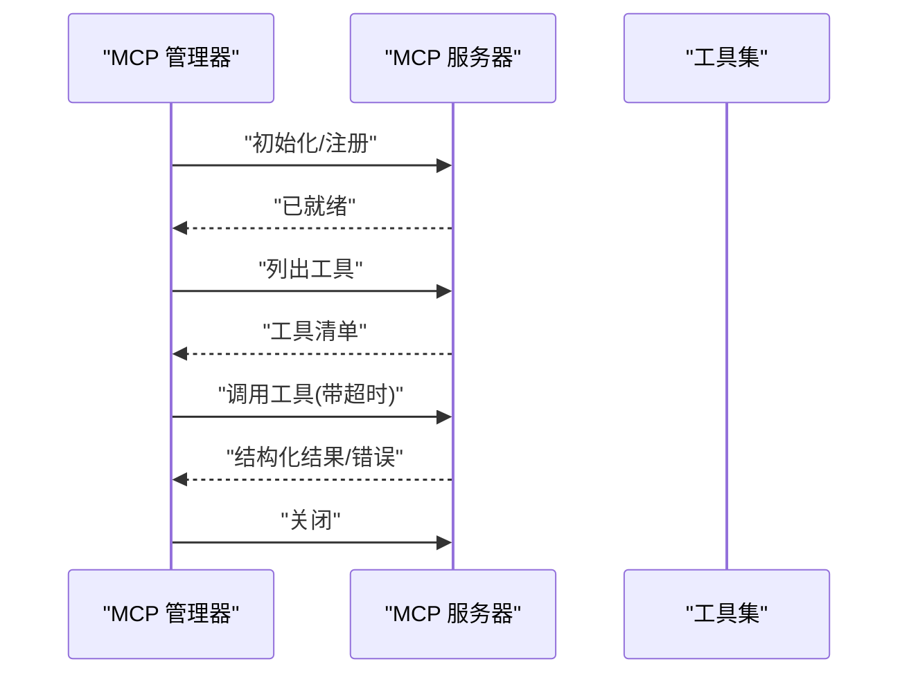
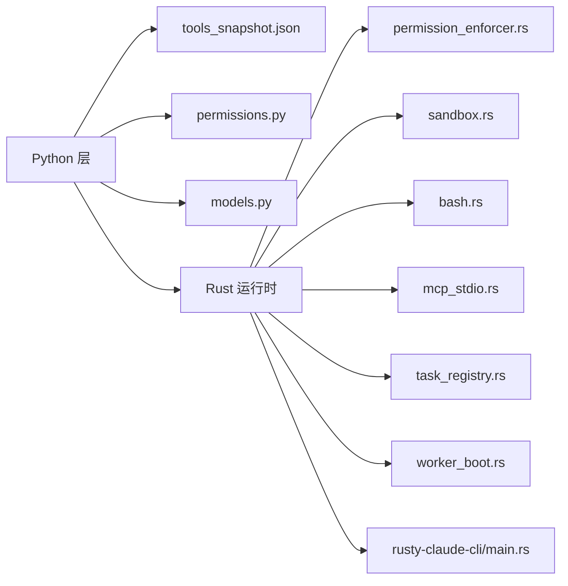

# 工具系统

<cite>
**本文引用的文件**
- [src/tools.py](file://src/tools.py)
- [src/tool_pool.py](file://src/tool_pool.py)
- [src/Tool.py](file://src/Tool.py)
- [src/execution_registry.py](file://src/execution_registry.py)
- [src/permissions.py](file://src/permissions.py)
- [src/models.py](file://src/models.py)
- [src/reference_data/tools_snapshot.json](file://src/reference_data/tools_snapshot.json)
- [rust/crates/tools/src/lib.rs](file://rust/crates/tools/src/lib.rs)
- [rust/crates/rusty-claude-cli/src/main.rs](file://rust/crates/rusty-claude-cli/src/main.rs)
- [rust/crates/runtime/src/permission_enforcer.rs](file://rust/crates/runtime/src/permission_enforcer.rs)
- [rust/crates/runtime/src/sandbox.rs](file://rust/crates/runtime/src/sandbox.rs)
- [rust/crates/runtime/src/bash.rs](file://rust/crates/runtime/src/bash.rs)
- [rust/crates/runtime/src/mcp_stdio.rs](file://rust/crates/runtime/src/mcp_stdio.rs)
- [rust/crates/runtime/src/mcp_lifecycle_hardened.rs](file://rust/crates/runtime/src/mcp_lifecycle_hardened.rs)
- [rust/crates/runtime/src/task_registry.rs](file://rust/crates/runtime/src/task_registry.rs)
- [rust/crates/runtime/src/worker_boot.rs](file://rust/crates/runtime/src/worker_boot.rs)
</cite>

## 目录
1. [简介](#简介)
2. [项目结构](#项目结构)
3. [核心组件](#核心组件)
4. [架构总览](#架构总览)
5. [详细组件分析](#详细组件分析)
6. [依赖分析](#依赖分析)
7. [性能考量](#性能考量)
8. [故障排查指南](#故障排查指南)
9. [结论](#结论)
10. [附录](#附录)

## 简介
本文件系统性梳理工具系统的定义规范、执行流程与生命周期管理，覆盖内置工具（文件操作、系统命令、网络工具）与 MCP 工具的集成机制，并给出自定义工具开发指南、工具注册与权限控制策略、工具池管理、并发执行与资源限制的实现细节，以及最佳实践、性能优化与安全注意事项。

## 项目结构
工具系统由三层组成：
- Python 层：工具清单加载、过滤、查询与镜像执行入口，负责将历史工具快照映射为可执行对象。
- Rust 运行时层：内置工具实现（文件读写、系统命令、搜索、LSP、MCP）、权限强制、沙箱隔离、任务与工作器生命周期管理。
- CLI 层：命令行工具桥接运行时能力，展示工具进度与结果。

**图表来源**
- [src/tools.py:1-97](file://src/tools.py#L1-L97)
- [src/tool_pool.py:1-38](file://src/tool_pool.py#L1-L38)
- [src/execution_registry.py:1-52](file://src/execution_registry.py#L1-L52)
- [src/permissions.py:1-21](file://src/permissions.py#L1-L21)
- [src/models.py:1-50](file://src/models.py#L1-L50)
- [src/reference_data/tools_snapshot.json:1-922](file://src/reference_data/tools_snapshot.json#L1-L922)
- [rust/crates/tools/src/lib.rs:1-200](file://rust/crates/tools/src/lib.rs#L1-L200)
- [rust/crates/runtime/src/permission_enforcer.rs:1-586](file://rust/crates/runtime/src/permission_enforcer.rs#L1-L586)
- [rust/crates/runtime/src/sandbox.rs:1-386](file://rust/crates/runtime/src/sandbox.rs#L1-L386)
- [rust/crates/runtime/src/bash.rs:1-41](file://rust/crates/runtime/src/bash.rs#L1-L41)
- [rust/crates/runtime/src/mcp_stdio.rs:2262-2628](file://rust/crates/runtime/src/mcp_stdio.rs#L2262-L2628)
- [rust/crates/runtime/src/mcp_lifecycle_hardened.rs:263-543](file://rust/crates/runtime/src/mcp_lifecycle_hardened.rs#L263-L543)
- [rust/crates/runtime/src/task_registry.rs:1-504](file://rust/crates/runtime/src/task_registry.rs#L1-L504)
- [rust/crates/runtime/src/worker_boot.rs:1-800](file://rust/crates/runtime/src/worker_boot.rs#L1-L800)
- [rust/crates/rusty-claude-cli/src/main.rs:6458-6493](file://rust/crates/rusty-claude-cli/src/main.rs#L6458-L6493)

**章节来源**
- [src/tools.py:1-97](file://src/tools.py#L1-L97)
- [src/tool_pool.py:1-38](file://src/tool_pool.py#L1-L38)
- [src/execution_registry.py:1-52](file://src/execution_registry.py#L1-L52)
- [src/permissions.py:1-21](file://src/permissions.py#L1-L21)
- [src/models.py:1-50](file://src/models.py#L1-L50)
- [src/reference_data/tools_snapshot.json:1-922](file://src/reference_data/tools_snapshot.json#L1-L922)

## 核心组件
- 工具清单与镜像执行
  - 工具清单来自 JSON 快照，通过 Python 层加载为模块对象，支持按名称/前缀检索、简单模式筛选与 MCP 过滤。
  - 执行采用“镜像执行”策略：返回可执行消息而非真实执行，便于统一管控与审计。
- 权限控制
  - 基于权限模式（只读、工作区写入、危险全权、提示确认、允许）与工具粒度要求进行强制检查。
  - 支持动态分类（如 Bash 命令分类）与策略组合。
- 沙箱与资源限制
  - 提供用户命名空间隔离、网络隔离、文件系统隔离模式与挂载白名单。
  - 在 Linux 上通过 unshare 构建受限执行环境。
- 工具池与注册
  - 工具池封装工具集合与装配参数；执行注册表将工具映射为可调用对象。
- 并发与生命周期
  - 任务注册表管理子任务生命周期；工作器状态机管理启动、信任门、提示投递与完成/失败状态。
  - MCP 工具通过标准 IO 管理器并发调用，支持超时与错误传播。

**章节来源**
- [src/tools.py:23-97](file://src/tools.py#L23-L97)
- [src/tool_pool.py:10-38](file://src/tool_pool.py#L10-L38)
- [src/execution_registry.py:9-52](file://src/execution_registry.py#L9-L52)
- [src/permissions.py:6-21](file://src/permissions.py#L6-L21)
- [rust/crates/runtime/src/permission_enforcer.rs:26-174](file://rust/crates/runtime/src/permission_enforcer.rs#L26-L174)
- [rust/crates/runtime/src/sandbox.rs:27-208](file://rust/crates/runtime/src/sandbox.rs#L27-L208)
- [rust/crates/runtime/src/task_registry.rs:55-231](file://rust/crates/runtime/src/task_registry.rs#L55-L231)
- [rust/crates/runtime/src/worker_boot.rs:160-563](file://rust/crates/runtime/src/worker_boot.rs#L160-L563)

## 架构总览
工具系统以“Python 清单 + Rust 实现”的双层架构运行，通过权限强制与沙箱隔离保障安全，通过任务与工作器生命周期管理确保可控并发。

**图表来源**
- [src/reference_data/tools_snapshot.json:1-922](file://src/reference_data/tools_snapshot.json#L1-L922)
- [src/tools.py:23-97](file://src/tools.py#L23-L97)
- [src/execution_registry.py:47-52](file://src/execution_registry.py#L47-L52)
- [rust/crates/tools/src/lib.rs:108-190](file://rust/crates/tools/src/lib.rs#L108-L190)
- [rust/crates/runtime/src/permission_enforcer.rs:26-174](file://rust/crates/runtime/src/permission_enforcer.rs#L26-L174)
- [rust/crates/runtime/src/sandbox.rs:27-208](file://rust/crates/runtime/src/sandbox.rs#L27-L208)
- [rust/crates/runtime/src/bash.rs:17-41](file://rust/crates/runtime/src/bash.rs#L17-L41)
- [rust/crates/runtime/src/mcp_stdio.rs:2262-2628](file://rust/crates/runtime/src/mcp_stdio.rs#L2262-L2628)
- [rust/crates/runtime/src/task_registry.rs:55-231](file://rust/crates/runtime/src/task_registry.rs#L55-L231)
- [rust/crates/runtime/src/worker_boot.rs:160-563](file://rust/crates/runtime/src/worker_boot.rs#L160-L563)
- [rust/crates/rusty-claude-cli/src/main.rs:6458-6493](file://rust/crates/rusty-claude-cli/src/main.rs#L6458-L6493)

## 详细组件分析

### 组件一：工具清单与镜像执行（Python）
- 责任边界
  - 加载工具快照为模块对象，提供名称匹配、前缀过滤、简单模式与 MCP 排除等筛选。
  - 将工具名解析为模块对象后，构造“镜像执行”消息，避免真实副作用。
- 关键流程
  - 加载快照 → 构造模块对象元组 → 过滤/查询 → 镜像执行返回消息。
- 数据结构
  - 工具模块对象包含名称、职责、来源提示与状态字段。
- 安全与可观测性
  - 镜像执行仅返回描述信息，便于审计与策略落地。

**图表来源**
- [src/tools.py:23-97](file://src/tools.py#L23-L97)
- [src/models.py:14-20](file://src/models.py#L14-L20)
- [src/reference_data/tools_snapshot.json:1-922](file://src/reference_data/tools_snapshot.json#L1-L922)

**章节来源**
- [src/tools.py:23-97](file://src/tools.py#L23-L97)
- [src/models.py:14-20](file://src/models.py#L14-L20)
- [src/reference_data/tools_snapshot.json:1-922](file://src/reference_data/tools_snapshot.json#L1-L922)

### 组件二：工具池与执行注册表（Python）
- 工具池
  - 封装工具集合、简单模式与 MCP 包含标志，生成 Markdown 概览。
- 执行注册表
  - 将工具模块映射为可执行对象，提供按名称查找与执行委托。

**图表来源**
- [src/tool_pool.py:10-38](file://src/tool_pool.py#L10-L38)
- [src/execution_registry.py:9-52](file://src/execution_registry.py#L9-L52)

**章节来源**
- [src/tool_pool.py:10-38](file://src/tool_pool.py#L10-L38)
- [src/execution_registry.py:9-52](file://src/execution_registry.py#L9-L52)

### 组件三：权限控制（Rust）
- 权限模式
  - 只读、工作区写入、危险全权、提示确认、允许。
- 强制检查
  - 对工具与输入进行授权判定；支持动态所需模式（如 Bash 分类）。
  - 文件写入与 Bash 命令有专门检查逻辑，结合工作区边界判断。
- 错误信息
  - 拒绝时返回工具名、当前模式、所需模式与原因，便于诊断。

**图表来源**
- [rust/crates/runtime/src/permission_enforcer.rs:31-100](file://rust/crates/runtime/src/permission_enforcer.rs#L31-L100)
- [rust/crates/runtime/src/permission_enforcer.rs:107-174](file://rust/crates/runtime/src/permission_enforcer.rs#L107-L174)

**章节来源**
- [rust/crates/runtime/src/permission_enforcer.rs:26-174](file://rust/crates/runtime/src/permission_enforcer.rs#L26-L174)

### 组件四：沙箱与资源限制（Rust）
- 隔离模式
  - 关闭、仅工作区、白名单三种文件系统模式；支持命名空间与网络隔离。
- 状态解析
  - 根据请求与环境检测可用性，计算激活状态与回退原因。
- Linux 启动器
  - 使用 unshare 构建受限进程，设置 HOME/TMP、文件系统模式与挂载列表。

**图表来源**
- [rust/crates/runtime/src/permission_enforcer.rs:107-174](file://rust/crates/runtime/src/permission_enforcer.rs#L107-L174)
- [rust/crates/runtime/src/sandbox.rs:155-208](file://rust/crates/runtime/src/sandbox.rs#L155-L208)
- [rust/crates/runtime/src/sandbox.rs:210-262](file://rust/crates/runtime/src/sandbox.rs#L210-L262)

**章节来源**
- [rust/crates/runtime/src/sandbox.rs:27-208](file://rust/crates/runtime/src/sandbox.rs#L27-L208)
- [rust/crates/runtime/src/sandbox.rs:210-262](file://rust/crates/runtime/src/sandbox.rs#L210-L262)

### 组件五：内置工具（文件、系统命令、搜索、LSP、MCP）
- 文件工具
  - 读取、写入、编辑、范围读取等；权限强制器按工作区边界与模式检查。
- 系统命令（Bash）
  - 输入模型包含命令、超时、描述、后台运行、沙箱开关、网络隔离、文件系统模式与挂载列表。
- 搜索与 LSP
  - 支持通配符搜索与内容检索；与 LSP 注册表协同。
- MCP 工具
  - 通过标准 IO 管理器发现与调用工具，支持超时与多服务器并发。

**图表来源**
- [rust/crates/tools/src/lib.rs:1165-1191](file://rust/crates/tools/src/lib.rs#L1165-L1191)
- [rust/crates/runtime/src/bash.rs:17-41](file://rust/crates/runtime/src/bash.rs#L17-L41)
- [rust/crates/runtime/src/mcp_stdio.rs:2262-2628](file://rust/crates/runtime/src/mcp_stdio.rs#L2262-L2628)
- [rust/crates/rusty-claude-cli/src/main.rs:6458-6493](file://rust/crates/rusty-claude-cli/src/main.rs#L6458-L6493)

**章节来源**
- [rust/crates/tools/src/lib.rs:1165-1191](file://rust/crates/tools/src/lib.rs#L1165-L1191)
- [rust/crates/runtime/src/bash.rs:17-41](file://rust/crates/runtime/src/bash.rs#L17-L41)
- [rust/crates/runtime/src/mcp_stdio.rs:2262-2628](file://rust/crates/runtime/src/mcp_stdio.rs#L2262-L2628)
- [rust/crates/rusty-claude-cli/src/main.rs:6458-6493](file://rust/crates/rusty-claude-cli/src/main.rs#L6458-L6493)

### 组件六：任务与工作器生命周期管理（Rust）
- 任务注册表
  - 创建、查询、更新消息、追加输出、变更状态、分配团队、删除等。
- 工作器状态机
  - Spawning → TrustRequired → ReadyForPrompt → Running → Finished/Failed。
  - 支持信任门检测、提示误投递识别与自动重播、完成/失败分类。

**图表来源**
- [rust/crates/runtime/src/worker_boot.rs:28-81](file://rust/crates/runtime/src/worker_boot.rs#L28-L81)
- [rust/crates/runtime/src/worker_boot.rs:225-371](file://rust/crates/runtime/src/worker_boot.rs#L225-L371)
- [rust/crates/runtime/src/worker_boot.rs:508-563](file://rust/crates/runtime/src/worker_boot.rs#L508-L563)

**章节来源**
- [rust/crates/runtime/src/task_registry.rs:55-231](file://rust/crates/runtime/src/task_registry.rs#L55-L231)
- [rust/crates/runtime/src/worker_boot.rs:160-563](file://rust/crates/runtime/src/worker_boot.rs#L160-L563)

### 组件七：MCP 生命周期与工具发现（Rust）
- 生命周期阶段
  - 配置加载 → 服务器注册 → 子进程连接 → 初始化握手 → 工具发现 → 资源发现 → 就绪 → 调用 → 错误浮出 → 关闭 → 清理。
- 工具发现与调用
  - 多服务器并发调用，支持超时与日志记录。

**图表来源**
- [rust/crates/runtime/src/mcp_lifecycle_hardened.rs:263-543](file://rust/crates/runtime/src/mcp_lifecycle_hardened.rs#L263-L543)
- [rust/crates/runtime/src/mcp_stdio.rs:2262-2628](file://rust/crates/runtime/src/mcp_stdio.rs#L2262-L2628)

**章节来源**
- [rust/crates/runtime/src/mcp_lifecycle_hardened.rs:263-543](file://rust/crates/runtime/src/mcp_lifecycle_hardened.rs#L263-L543)
- [rust/crates/runtime/src/mcp_stdio.rs:2262-2628](file://rust/crates/runtime/src/mcp_stdio.rs#L2262-L2628)

### 组件八：自定义工具开发指南
- 工具注册
  - 在全局工具注册中添加插件工具或运行时工具，确保名称不冲突。
- 规范与约束
  - 定义输入/输出模式（JSON Schema），声明所需权限模式。
- 权限与沙箱
  - 明确工具的危险等级与边界，必要时启用沙箱与网络隔离。
- 测试与验证
  - 使用生命周期测试与超时测试保证稳定性。

**章节来源**
- [rust/crates/tools/src/lib.rs:133-190](file://rust/crates/tools/src/lib.rs#L133-L190)

## 依赖分析
- Python 层依赖
  - 工具清单 JSON 快照；权限上下文；模型定义。
- Rust 运行时依赖
  - 权限策略与强制器；沙箱配置；Bash 输入输出模型；MCP 管理器；任务与工作器注册表。
- 外部系统集成
  - MCP 服务器通过标准 IO 协议交互；CLI 用于进度与结果展示。

**图表来源**
- [src/tools.py:1-97](file://src/tools.py#L1-L97)
- [src/permissions.py:1-21](file://src/permissions.py#L1-L21)
- [src/models.py:1-50](file://src/models.py#L1-L50)
- [src/reference_data/tools_snapshot.json:1-922](file://src/reference_data/tools_snapshot.json#L1-L922)
- [rust/crates/tools/src/lib.rs:1-200](file://rust/crates/tools/src/lib.rs#L1-L200)
- [rust/crates/runtime/src/permission_enforcer.rs:1-586](file://rust/crates/runtime/src/permission_enforcer.rs#L1-L586)
- [rust/crates/runtime/src/sandbox.rs:1-386](file://rust/crates/runtime/src/sandbox.rs#L1-L386)
- [rust/crates/runtime/src/bash.rs:1-41](file://rust/crates/runtime/src/bash.rs#L1-L41)
- [rust/crates/runtime/src/mcp_stdio.rs:2262-2628](file://rust/crates/runtime/src/mcp_stdio.rs#L2262-L2628)
- [rust/crates/runtime/src/task_registry.rs:1-504](file://rust/crates/runtime/src/task_registry.rs#L1-L504)
- [rust/crates/runtime/src/worker_boot.rs:1-800](file://rust/crates/runtime/src/worker_boot.rs#L1-L800)
- [rust/crates/rusty-claude-cli/src/main.rs:6458-6493](file://rust/crates/rusty-claude-cli/src/main.rs#L6458-L6493)

**章节来源**
- [src/tools.py:1-97](file://src/tools.py#L1-L97)
- [rust/crates/tools/src/lib.rs:1-200](file://rust/crates/tools/src/lib.rs#L1-L200)

## 性能考量
- 并发与超时
  - MCP 工具调用支持超时控制，避免阻塞；任务注册表与工作器状态机减少锁竞争。
- 资源隔离
  - 沙箱隔离降低系统级开销与风险；文件系统白名单减少 I/O 成本。
- 权限预检
  - 在执行前进行权限判定，避免无效系统调用与失败重试成本。
- CLI 进度
  - CLI 层根据输入摘要生成简要描述，提升可观测性与用户体验。

**章节来源**
- [rust/crates/runtime/src/mcp_stdio.rs:2300-2331](file://rust/crates/runtime/src/mcp_stdio.rs#L2300-L2331)
- [rust/crates/runtime/src/task_registry.rs:55-231](file://rust/crates/runtime/src/task_registry.rs#L55-L231)
- [rust/crates/runtime/src/worker_boot.rs:160-563](file://rust/crates/runtime/src/worker_boot.rs#L160-L563)
- [rust/crates/rusty-claude-cli/src/main.rs:6458-6493](file://rust/crates/rusty-claude-cli/src/main.rs#L6458-L6493)

## 故障排查指南
- 权限拒绝
  - 检查工具所需模式与当前模式；查看拒绝原因中的工具名、活动模式与所需模式。
- Bash 命令被拒
  - 确认命令是否属于只读命令集合；在只读模式下禁止修改类命令。
- 文件写入越界
  - 确认路径是否位于工作区内；超出工作区需更高权限。
- 提示误投递
  - 检查工作器状态机事件与最后错误；必要时启用自动重播。
- MCP 调用超时
  - 调整工具调用超时配置；检查服务器健康与日志。

**章节来源**
- [rust/crates/runtime/src/permission_enforcer.rs:414-440](file://rust/crates/runtime/src/permission_enforcer.rs#L414-L440)
- [rust/crates/runtime/src/permission_enforcer.rs:144-173](file://rust/crates/runtime/src/permission_enforcer.rs#L144-L173)
- [rust/crates/runtime/src/permission_enforcer.rs:107-142](file://rust/crates/runtime/src/permission_enforcer.rs#L107-L142)
- [rust/crates/runtime/src/worker_boot.rs:225-371](file://rust/crates/runtime/src/worker_boot.rs#L225-L371)
- [rust/crates/runtime/src/mcp_stdio.rs:2300-2331](file://rust/crates/runtime/src/mcp_stdio.rs#L2300-L2331)

## 结论
工具系统通过“Python 清单 + Rust 实现”的分层设计，在保证安全与可控的前提下，提供了强大的工具扩展能力。权限强制与沙箱隔离确保了执行边界，任务与工作器生命周期管理提升了并发与可靠性，MCP 集成则打通了外部工具生态。遵循本文规范与最佳实践，可在复杂场景中稳定地扩展与使用工具。

## 附录
- 工具快照字段
  - 名称、来源提示、职责描述。
- 权限模式
  - 只读、工作区写入、危险全权、提示确认、允许。
- 沙箱模式
  - 关闭、仅工作区、白名单。
- CLI 工具描述
  - 根据输入生成简要描述，便于用户理解执行意图。

**章节来源**
- [src/reference_data/tools_snapshot.json:1-922](file://src/reference_data/tools_snapshot.json#L1-L922)
- [rust/crates/runtime/src/permission_enforcer.rs:26-174](file://rust/crates/runtime/src/permission_enforcer.rs#L26-L174)
- [rust/crates/runtime/src/sandbox.rs:7-25](file://rust/crates/runtime/src/sandbox.rs#L7-L25)
- [rust/crates/rusty-claude-cli/src/main.rs:6458-6493](file://rust/crates/rusty-claude-cli/src/main.rs#L6458-L6493)