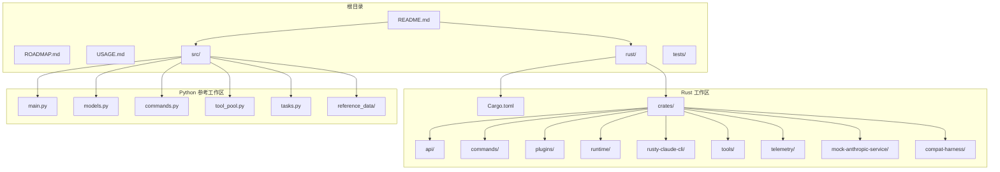
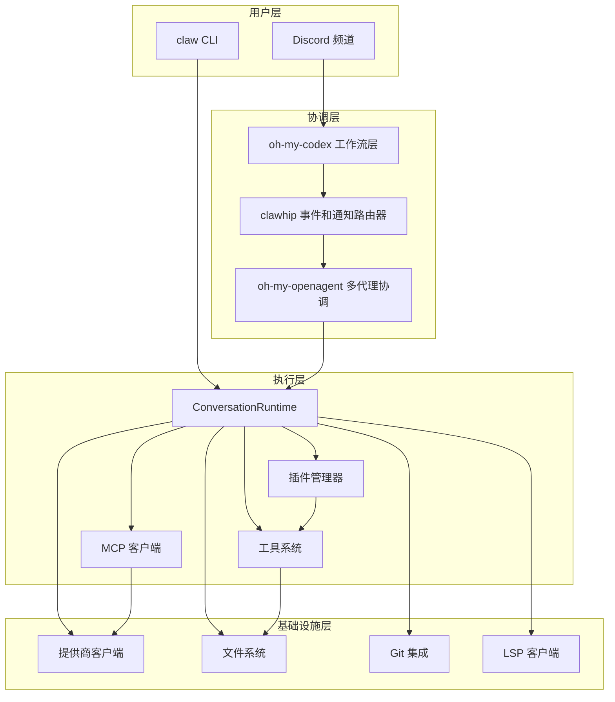
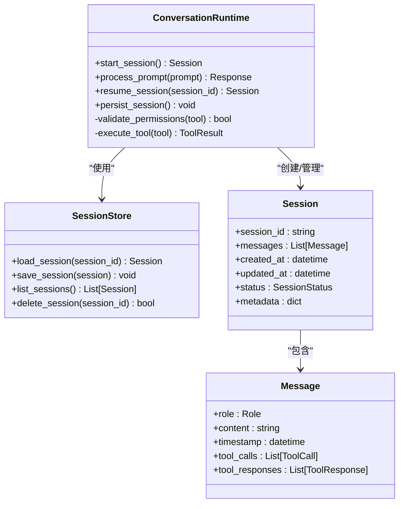
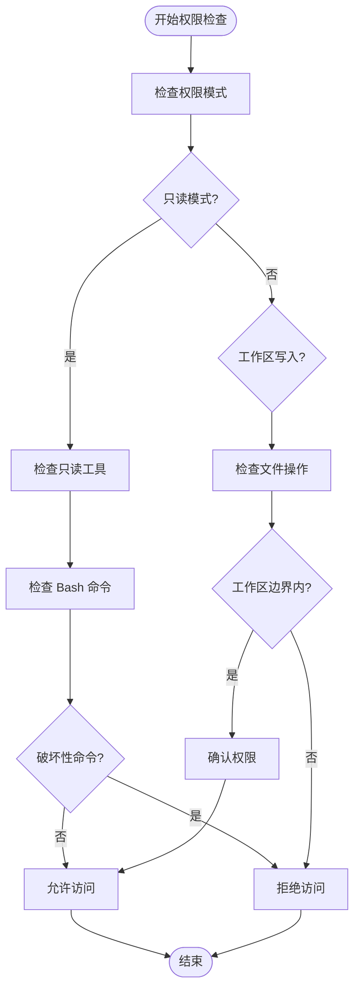
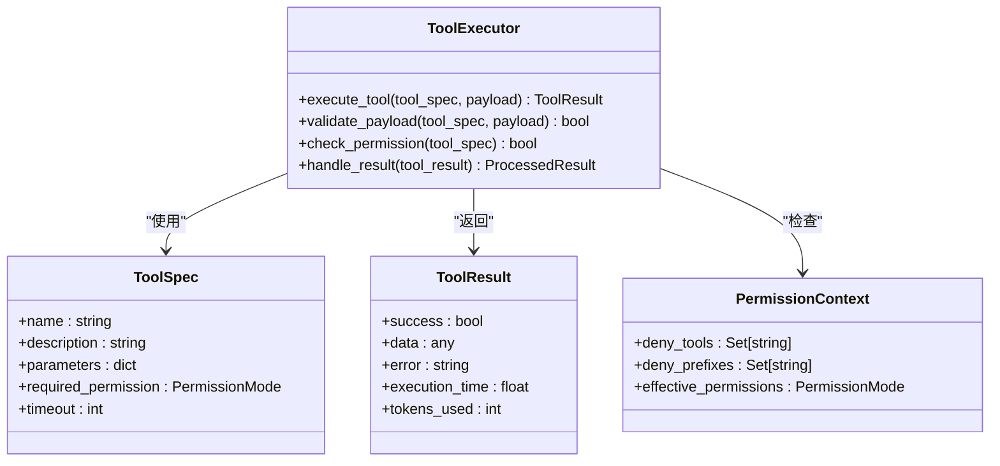
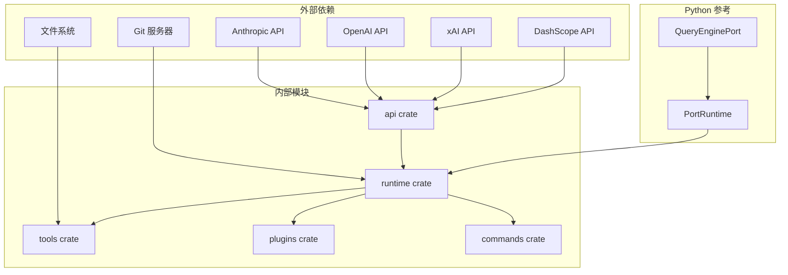
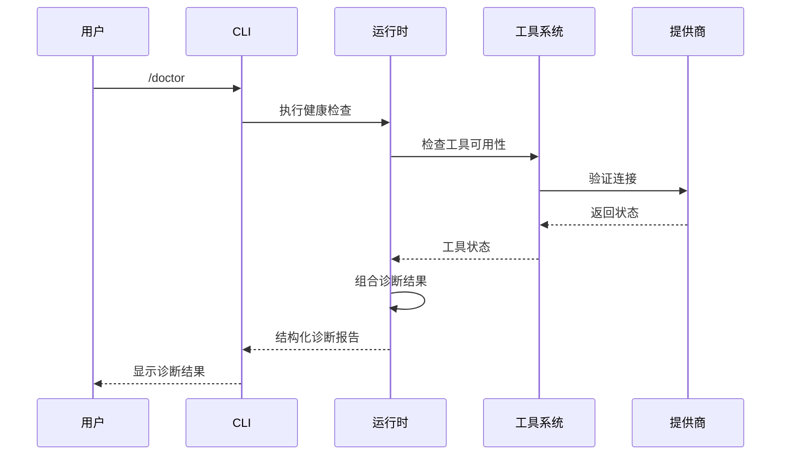

# 产品需求文档

<cite>
**本文档中引用的文件**
- [README.md](file://README.md)
- [ROADMAP.md](file://ROADMAP.md)
- [USAGE.md](file://USAGE.md)
- [rust/README.md](file://rust/README.md)
- [PARITY.md](file://PARITY.md)
- [PHILOSOPHY.md](file://PHILOSOPHY.md)
- [src/main.py](file://src/main.py)
- [src/models.py](file://src/models.py)
- [src/commands.py](file://src/commands.py)
- [src/tool_pool.py](file://src/tool_pool.py)
- [src/tasks.py](file://src/tasks.py)
- [rust/Cargo.toml](file://rust/Cargo.toml)
</cite>

## 目录
1. [项目概述](#项目概述)
2. [项目结构](#项目结构)
3. [核心组件](#核心组件)
4. [架构概览](#架构概览)
5. [详细组件分析](#详细组件分析)
6. [依赖关系分析](#依赖关系分析)
7. [性能考虑](#性能考虑)
8. [故障排除指南](#故障排除指南)
9. [结论](#结论)

## 项目概述

Claw Code 是一个开源的 Rust 实现的 CLI 代理工具箱，旨在提供可爪able（clawable）的编码工作台。该项目的核心目标是消除人类对终端的假设、脆弱的提示注入时序、不透明的会话状态、隐藏的插件或 MCP 失败，以及手动看护日常恢复的需求。

### 核心理念

根据哲学文档，Claw Code 代表了自主软件开发的演示：人类提供方向，爪子协调、构建、测试、恢复并推送。该系统强调：
- 人类提供明确指导
- 多个编码代理并行协调
- 通知路由被推到代理上下文窗口之外
- 自动化的规划、执行、审查和重试循环
- 人类不再坐在终端里微观管理每个步骤

### 当前仓库形态

- **`rust/`** — 规范的 Rust 工作区和 `claw` CLI 二进制文件
- **`USAGE.md`** — 面向任务的使用指南
- **`PARITY.md`** — Rust 移植一致性状态和迁移说明
- **`ROADMAP.md`** — 活跃路线图和清理积压
- **`PHILOSOPHY.md`** — 项目意图和系统设计框架
- **`src/` + `tests/`** — 伴随的 Python/参考工作区和审计助手

## 项目结构

**图表来源**
- [README.md:39-46](file://README.md#L39-L46)
- [rust/README.md:178-194](file://rust/README.md#L178-L194)
- [src/main.py:1-214](file://src/main.py#L1-L214)

**章节来源**
- [README.md:39-46](file://README.md#L39-L46)
- [rust/README.md:178-194](file://rust/README.md#L178-L194)
- [src/main.py:1-214](file://src/main.py#L1-L214)

## 核心组件

### Rust 工作区组件

Claw Code 的 Rust 实现包含以下核心 crate：

| Crate 名称 | 职责 | 主要功能 |
|-----------|------|----------|
| **api** | 提供商客户端 + 流式传输 + 请求预检 | Anthropic/OpenAI 兼容提供商支持，SSE 流式传输，请求大小/上下文窗口预检 |
| **commands** | 切Slash 命令定义、解析、帮助文本生成 | 命令注册表、JSON/文本命令渲染、帮助文本生成 |
| **compat-harness** | 从上游 TypeScript 源提取工具/提示清单 | 类型安全的清单提取和验证 |
| **mock-anthropic-service** | 确定性的本地 Anthropic 兼容模拟服务 | CLI 一致性测试和本地测试运行 |
| **plugins** | 插件元数据、管理器、安装/启用/禁用界面 | 插件生命周期管理、工具定义、钩子集成接口 |
| **runtime** | 会话、配置、权限、MCP、提示、认证/运行时循环 | ConversationRuntime、配置加载、会话持久化、权限策略 |
| **rusty-claude-cli** | 主 CLI 二进制 (`claw`) | 交互式 REPL、一次性提示、直接 CLI 子命令、流式显示 |
| **telemetry** | 会话跟踪和使用遥测类型 | 事件记录、使用统计、性能监控 |
| **tools** | 内置工具、技能解析、工具搜索、代理运行时界面 | Bash、ReadFile、WriteFile、EditFile、GlobSearch、GrepSearch 等 |

### Python 参考工作区组件

Python 实现作为移植工作区，提供：
- **命令镜像**：基于快照的命令条目镜像
- **工具池**：权限上下文感知的工具集合
- **查询引擎**：端口运行时的提示路由
- **设置报告**：启动/预取设置报告
- **引导图**：镜像的引导/运行时图阶段

**章节来源**
- [rust/README.md:196-206](file://rust/README.md#L196-L206)
- [src/models.py:6-50](file://src/models.py#L6-L50)
- [src/commands.py:13-91](file://src/commands.py#L13-L91)
- [src/tool_pool.py:10-38](file://src/tool_pool.py#L10-L38)

## 架构概览

**图表来源**
- [PHILOSOPHY.md:27-57](file://PHILOSOPHY.md#L27-L57)
- [ROADMAP.md:148-181](file://ROADMAP.md#L148-L181)
- [rust/README.md:196-206](file://rust/README.md#L196-L206)

## 详细组件分析

### 会话管理系统

会话管理系统是 Claw Code 的核心组件之一，负责维护用户交互状态和历史记录。

**图表来源**
- [src/main.py:15-16](file://src/main.py#L15-L16)
- [rust/README.md:203-204](file://rust/README.md#L203-L204)

### 权限控制系统

权限控制系统确保工具调用的安全性和适当的访问级别。

**图表来源**
- [PARITY.md:131-143](file://PARITY.md#L131-L143)
- [src/models.py:22-26](file://src/models.py#L22-L26)

### 工具系统架构

工具系统提供了丰富的内置工具集，支持文件操作、网络搜索、代理协作等功能。

**图表来源**
- [src/tool_pool.py:10-38](file://src/tool_pool.py#L10-L38)
- [src/models.py:14-21](file://src/models.py#L14-L21)

**章节来源**
- [src/main.py:1-214](file://src/main.py#L1-L214)
- [src/models.py:6-50](file://src/models.py#L6-L50)
- [src/commands.py:13-91](file://src/commands.py#L13-L91)
- [src/tool_pool.py:10-38](file://src/tool_pool.py#L10-L38)

## 依赖关系分析

**图表来源**
- [rust/Cargo.toml:1-23](file://rust/Cargo.toml#L1-L23)
- [rust/README.md:198-206](file://rust/README.md#L198-L206)

**章节来源**
- [rust/Cargo.toml:1-23](file://rust/Cargo.toml#L1-L23)
- [rust/README.md:198-206](file://rust/README.md#L198-L206)

## 性能考虑

### 启动性能优化

1. **增量编译**：使用 Cargo 工作区进行增量编译，减少重复编译时间
2. **缓存机制**：LRU 缓存用于命令和工具快照的加载
3. **懒加载**：权限上下文和工具池按需构建

### 运行时性能优化

1. **异步处理**：工具执行采用异步模式，避免阻塞主线程
2. **内存管理**：使用冻结数据类减少内存分配
3. **流式输出**：支持 SSE 流式传输，提高响应速度

### 存储优化

1. **会话压缩**：实现会话内容压缩以减少存储空间
2. **增量更新**：只保存必要的状态变更
3. **缓存策略**：合理设置缓存失效时间

## 故障排除指南

### 常见问题诊断

1. **认证失败**
   - 检查环境变量设置是否正确
   - 验证 API 密钥格式（`sk-ant-*` vs OAuth）
   - 确认代理设置是否正确

2. **会话启动失败**
   - 运行 `/doctor` 命令进行健康检查
   - 检查信任提示状态
   - 验证工作区路径和权限

3. **工具执行错误**
   - 检查权限模式设置
   - 验证工具参数格式
   - 查看工具执行日志

### 调试工具

**图表来源**
- [USAGE.md:5-17](file://USAGE.md#L5-L17)
- [ROADMAP.md:131-146](file://ROADMAP.md#L131-L146)

**章节来源**
- [USAGE.md:5-17](file://USAGE.md#L5-L17)
- [ROADMAP.md:131-146](file://ROADMAP.md#L131-L146)

## 结论

Claw Code 代表了自主软件开发系统的成熟实现，通过以下关键特性实现了真正的可爪able 编码工作台：

### 核心优势

1. **确定性启动**：明确的生命周期状态和握手协议
2. **机器可读性**：结构化的事件和状态报告
3. **自动恢复**：已知失败模式的自动修复
4. **分支新鲜度**：强制执行分支更新检测
5. **插件/MCP 生命周期感知**：完整的生命周期管理

### 技术成就

- **9 个 Rust crate** 的完整实现
- **48,599 行 Rust 代码** 的高性能实现
- **40 个暴露的工具规范** 的丰富工具集
- **确定性的模拟服务** 支持端到端一致性测试

### 未来发展方向

根据路线图，Claw Code 将继续演进到：
- 更完善的事件原生集成
- 自动化恢复和故障分类
- 分支/测试意识和自动恢复
- 更精细的权限控制和治理

该项目不仅是一个工具箱，更是一个展示如何构建可扩展、可维护的 AI 协作系统的最佳实践案例。通过消除人类对终端的假设和脆弱的交互模式，Claw Code 为未来的软件开发协作奠定了坚实的基础。