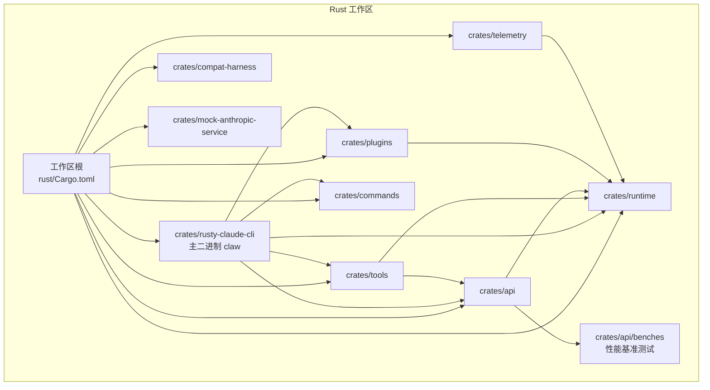
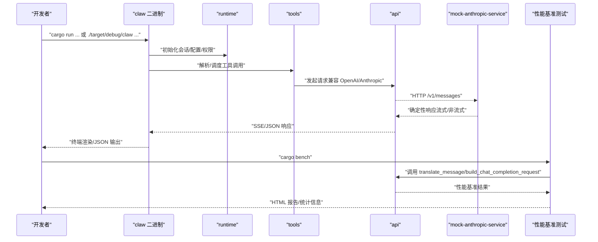
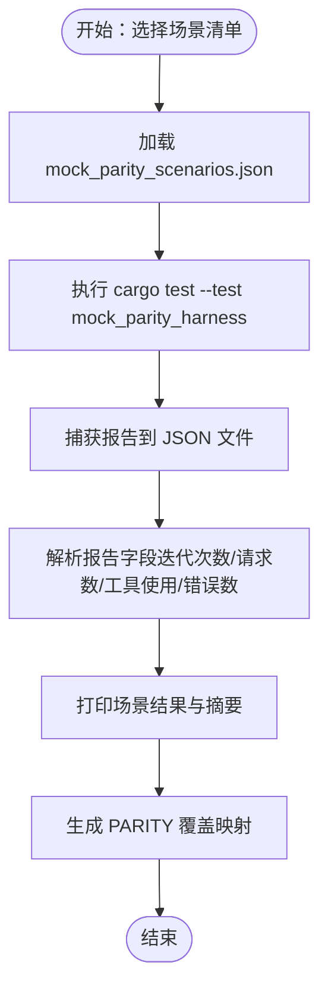
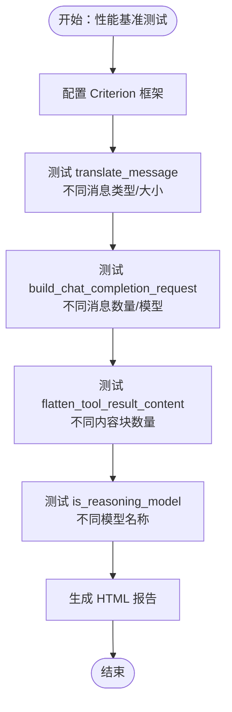
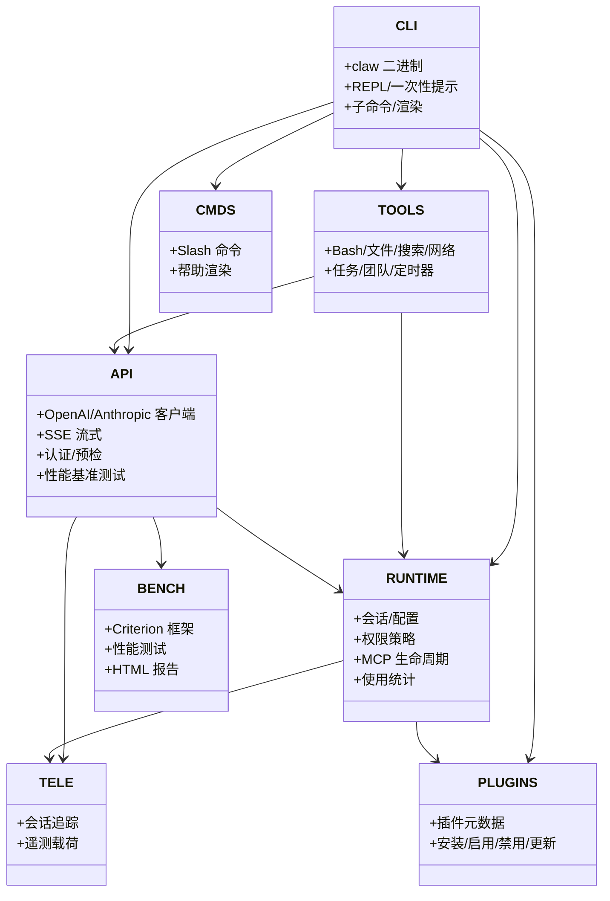
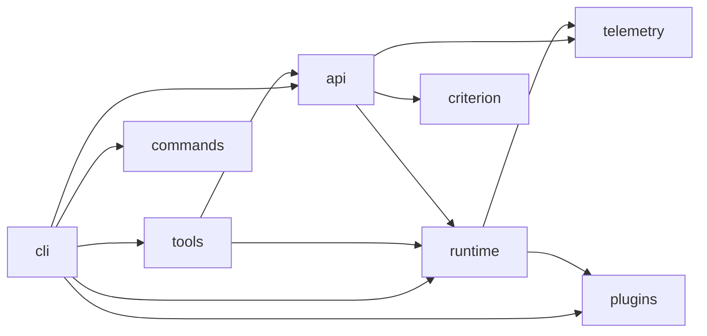

# 开发者指南

<cite>
**本文引用的文件**
- [README.md](file://README.md)
- [rust/README.md](file://rust/README.md)
- [rust/Cargo.toml](file://rust/Cargo.toml)
- [rust/MOCK_PARITY_HARNESS.md](file://rust/MOCK_PARITY_HARNESS.md)
- [rust/PARITY.md](file://rust/PARITY.md)
- [rust/mock_parity_scenarios.json](file://rust/mock_parity_scenarios.json)
- [rust/scripts/run_mock_parity_harness.sh](file://rust/scripts/run_mock_parity_harness.sh)
- [rust/scripts/run_mock_parity_diff.py](file://rust/scripts/run_mock_parity_diff.py)
- [rust/crates/rusty-claude-cli/Cargo.toml](file://rust/crates/rusty-claude-cli/Cargo.toml)
- [rust/crates/runtime/Cargo.toml](file://rust/crates/runtime/Cargo.toml)
- [rust/crates/tools/Cargo.toml](file://rust/crates/tools/Cargo.toml)
- [rust/crates/api/Cargo.toml](file://rust/crates/api/Cargo.toml)
- [rust/crates/plugins/Cargo.toml](file://rust/crates/plugins/Cargo.toml)
- [rust/crates/api/benches/request_building.rs](file://rust/crates/api/benches/request_building.rs)
- [rust/crates/api/src/providers/openai_compat.rs](file://rust/crates/api/src/providers/openai_compat.rs)
- [rust/crates/api/src/lib.rs](file://rust/crates/api/src/lib.rs)
</cite>

## 目录
1. [简介](#简介)
2. [项目结构](#项目结构)
3. [核心组件](#核心组件)
4. [架构总览](#架构总览)
5. [详细组件分析](#详细组件分析)
6. [依赖分析](#依赖分析)
7. [性能考虑](#性能考虑)
8. [故障排查指南](#故障排查指南)
9. [结论](#结论)
10. [附录](#附录)

## 简介
本指南面向贡献者，提供完整的开发环境设置、构建与测试流程、代码风格与提交规范、分支管理策略、调试与性能分析方法，以及 CI/CD 与发布流程的说明。重点覆盖 Rust 工作区结构、各 crate 的职责边界、端到端的模拟一致性测试（Parity Harness）与回归验证，以及新增的性能基准测试基础设施。

## 项目结构
仓库采用"双语言并存"的组织方式：Rust 主实现位于 rust/ 目录，Python 参考与审计辅助位于 src/ 与 tests/。Rust 工作区通过工作区根 Cargo.toml 统一版本与 lint 规则，并以 crates/* 作为子 crate 模块化组织。

- 根目录关键入口
  - README.md 提供快速上手、使用说明与文档索引
  - rust/README.md 提供 Rust 工作区的命令、特性、CLI 表面与工作区布局
  - rust/Cargo.toml 定义工作区成员、统一 lint 与安全策略
- Rust 工作区布局
  - crates/api：提供客户端、SSE 流式传输、请求预检与认证
  - crates/commands：Slash 命令注册与帮助渲染
  - crates/compat-harness：上游 TypeScript 清单提取工具
  - crates/mock-anthropic-service：确定性本地 Anthropic 兼容 mock 服务
  - crates/plugins：插件元数据、安装/启用/禁用/更新与生命周期钩子
  - crates/runtime：会话、配置、权限、MCP 生命周期、提示组装、使用统计
  - crates/rusty-claude-cli：主二进制 claw 的 REPL、一次性提示、子命令与渲染
  - crates/telemetry：会话追踪与使用遥测类型
  - crates/tools：内置工具集（Bash、文件读写、搜索、网络、代理等）
- 测试与一致性验证
  - scripts/run_mock_parity_harness.sh：一键运行模拟一致性测试
  - scripts/run_mock_parity_diff.py：场景清单校验与报告生成
  - mock_parity_scenarios.json：场景映射与 PARITY.md 引用
  - MOCK_PARITY_HARNESS.md：一致性测试里程碑与运行说明
  - PARITY.md：行为一致性状态、缺口与迁移准备度
- **新增** 性能基准测试
  - crates/api/benches/request_building.rs：使用 Criterion 框架的性能基准测试
  - dev-dependencies/criterion：性能测试依赖配置

**图表来源**
- [rust/Cargo.toml:1-23](file://rust/Cargo.toml#L1-L23)
- [rust/crates/rusty-claude-cli/Cargo.toml:1-35](file://rust/crates/rusty-claude-cli/Cargo.toml#L1-L35)
- [rust/crates/api/Cargo.toml:1-25](file://rust/crates/api/Cargo.toml#L1-L25)
- [rust/crates/runtime/Cargo.toml:1-21](file://rust/crates/runtime/Cargo.toml#L1-L21)
- [rust/crates/tools/Cargo.toml:1-21](file://rust/crates/tools/Cargo.toml#L1-L21)
- [rust/crates/plugins/Cargo.toml:1-14](file://rust/crates/plugins/Cargo.toml#L1-L14)
- [rust/crates/api/benches/request_building.rs:1-329](file://rust/crates/api/benches/request_building.rs#L1-L329)

**章节来源**
- [README.md:31-44](file://README.md#L31-L44)
- [rust/README.md:175-211](file://rust/README.md#L175-L211)
- [rust/Cargo.toml:1-23](file://rust/Cargo.toml#L1-L23)

## 核心组件
- rusty-claude-cli（claw 二进制）
  - 负责 REPL、一次性提示、子命令、流式输出渲染与参数解析
  - 依赖 api、runtime、tools、plugins、commands
- api
  - 提供 OpenAI/Anthropic 兼容客户端、SSE 流式响应、请求预检与认证
  - **新增** 性能基准测试：translate_message 和 build_chat_completion_request 函数
- runtime
  - 会话与配置加载、权限策略、MCP 生命周期、系统提示组装、使用统计
- tools
  - 内置工具集：Bash、文件读写/编辑/搜索、网络搜索/抓取、代理工具、任务/团队/定时器等
- plugins
  - 插件元数据、安装/启用/禁用/更新、生命周期钩子与工具桥接
- commands
  - Slash 命令定义、解析、帮助文本生成与渲染
- compat-harness
  - 从上游 TypeScript 源提取工具/提示清单
- mock-anthropic-service
  - 确定性本地 mock 服务，用于一致性测试与回归验证
- telemetry
  - 会话追踪事件与遥测载荷

**章节来源**
- [rust/README.md:193-203](file://rust/README.md#L193-L203)
- [rust/crates/rusty-claude-cli/Cargo.toml:12-25](file://rust/crates/rusty-claude-cli/Cargo.toml#L12-L25)
- [rust/crates/api/Cargo.toml:8-14](file://rust/crates/api/Cargo.toml#L8-L14)
- [rust/crates/runtime/Cargo.toml:8-16](file://rust/crates/runtime/Cargo.toml#L8-L16)
- [rust/crates/tools/Cargo.toml:8-17](file://rust/crates/tools/Cargo.toml#L8-L17)
- [rust/crates/plugins/Cargo.toml:8-11](file://rust/crates/plugins/Cargo.toml#L8-L11)

## 架构总览
下图展示从 CLI 到运行时、工具与外部 API 的调用链路，以及 mock 服务在一致性测试中的角色，**新增** 性能基准测试在独立的测试组中运行。

**图表来源**
- [rust/README.md:43-55](file://rust/README.md#L43-L55)
- [rust/crates/rusty-claude-cli/Cargo.toml:12-25](file://rust/crates/rusty-claude-cli/Cargo.toml#L12-L25)
- [rust/crates/api/Cargo.toml:8-14](file://rust/crates/api/Cargo.toml#L8-L14)
- [rust/crates/api/benches/request_building.rs:1-329](file://rust/crates/api/benches/request_building.rs#L1-L329)

## 详细组件分析

### 组件：模拟一致性测试（Parity Harness）
- 目标
  - 在干净环境中对 claw 进行端到端回归，覆盖流式文本、文件工具、多工具回合、Bash 权限提示、插件路径等关键行为
- 场景清单
  - 包含 baseline、file-tools、permissions、multi-tool-turns、bash、plugin-paths、session-compaction、token-usage 等类别
  - 通过 mock_parity_scenarios.json 映射到 PARITY.md 的行为条目
- 运行方式
  - 一键脚本：./scripts/run_mock_parity_harness.sh
  - 行为差异检查：python3 scripts/run_mock_parity_diff.py
- 报告与覆盖率
  - 通过环境变量将报告写入 JSON 文件，便于汇总统计与首次场景结果展示

**图表来源**
- [rust/scripts/run_mock_parity_harness.sh:1-7](file://rust/scripts/run_mock_parity_harness.sh#L1-L7)
- [rust/scripts/run_mock_parity_diff.py:30-50](file://rust/scripts/run_mock_parity_diff.py#L30-L50)
- [rust/scripts/run_mock_parity_diff.py:73-126](file://rust/scripts/run_mock_parity_diff.py#L73-L126)
- [rust/mock_parity_scenarios.json:1-110](file://rust/mock_parity_scenarios.json#L1-L110)

**章节来源**
- [rust/MOCK_PARITY_HARNESS.md:1-50](file://rust/MOCK_PARITY_HARNESS.md#L1-L50)
- [rust/PARITY.md:1-149](file://rust/PARITY.md#L1-L149)
- [rust/scripts/run_mock_parity_harness.sh:1-7](file://rust/scripts/run_mock_parity_harness.sh#L1-L7)
- [rust/scripts/run_mock_parity_diff.py:1-131](file://rust/scripts/run_mock_parity_diff.py#L1-L131)
- [rust/mock_parity_scenarios.json:1-110](file://rust/mock_parity_scenarios.json#L1-L110)

### 组件：性能基准测试基础设施（新增）
- 目标
  - 使用 Criterion 框架对 API 请求构建的关键函数进行性能评估和优化
  - 提供 HTML 报告生成和详细的性能统计信息
- 测试函数覆盖
  - translate_message：消息翻译与转换性能
  - build_chat_completion_request：聊天补全请求构建性能
  - flatten_tool_result_content：工具结果内容扁平化性能
  - is_reasoning_model：推理模型识别性能
- 基准测试设计
  - 支持多种输入规模和场景组合
  - 包含不同模型类型和消息类型的性能对比
  - 使用 black_box 防止编译器优化干扰
- 运行方式
  - 构建：cargo build --workspace
  - 基准测试：cargo bench
  - HTML 报告：自动在 target/criterion/reports 目录生成

**图表来源**
- [rust/crates/api/benches/request_building.rs:82-204](file://rust/crates/api/benches/request_building.rs#L82-L204)
- [rust/crates/api/benches/request_building.rs:206-320](file://rust/crates/api/benches/request_building.rs#L206-L320)

**章节来源**
- [rust/crates/api/benches/request_building.rs:1-329](file://rust/crates/api/benches/request_building.rs#L1-L329)
- [rust/crates/api/Cargo.toml:16-25](file://rust/crates/api/Cargo.toml#L16-L25)

### 组件：Rust 工作区与构建系统
- 工作区配置
  - 统一 edition、版本、许可证与 lint 设置；禁止不安全代码
  - 成员 crate 通过 crates/* 自动发现
- 关键 crate 依赖关系
  - rusty-claude-cli 依赖 api、runtime、tools、plugins、commands
  - tools 依赖 api、runtime、plugins
  - api 依赖 runtime、telemetry
  - runtime 依赖 plugins、telemetry
- 构建与测试
  - 构建：cargo build --workspace
  - 测试：cargo test --workspace
  - **新增** 基准测试：cargo bench
  - CLI 快速验证：./target/debug/claw doctor

**图表来源**
- [rust/Cargo.toml:1-23](file://rust/Cargo.toml#L1-L23)
- [rust/crates/rusty-claude-cli/Cargo.toml:12-25](file://rust/crates/rusty-claude-cli/Cargo.toml#L12-L25)
- [rust/crates/api/Cargo.toml:8-14](file://rust/crates/api/Cargo.toml#L8-L14)
- [rust/crates/runtime/Cargo.toml:8-16](file://rust/crates/runtime/Cargo.toml#L8-L16)
- [rust/crates/tools/Cargo.toml:8-17](file://rust/crates/tools/Cargo.toml#L8-L17)
- [rust/crates/plugins/Cargo.toml:8-11](file://rust/crates/plugins/Cargo.toml#L8-L11)
- [rust/crates/api/benches/request_building.rs:21-22](file://rust/crates/api/benches/request_building.rs#L21-L22)

**章节来源**
- [rust/README.md:14-25](file://rust/README.md#L14-L25)
- [rust/README.md:175-211](file://rust/README.md#L175-L211)
- [rust/Cargo.toml:1-23](file://rust/Cargo.toml#L1-L23)

## 依赖分析
- 耦合与内聚
  - CLI 对 runtime、tools、api、plugins、commands 的依赖清晰，职责边界明确
  - tools 与 api、runtime 的耦合体现了工具执行的通用基础设施
  - runtime 与 plugins、telemetry 的耦合体现了运行时能力与可观测性
  - **新增** api 与性能基准测试的耦合，通过 dev-dependencies/criterion 实现
- 外部依赖
  - tokio：异步运行时（多线程、信号、IO、进程）
  - serde/serde_json：序列化与 JSON 支持
  - reqwest（无默认特性，启用 rustls-tls）：HTTP 客户端
  - pulldown-cmark、syntect：Markdown/语法高亮渲染
  - rustyline：REPL
  - **新增** criterion：性能基准测试框架（HTML 报告支持）
- 潜在循环依赖
  - 当前依赖方向自上而下，未见循环依赖迹象

**图表来源**
- [rust/crates/rusty-claude-cli/Cargo.toml:12-25](file://rust/crates/rusty-claude-cli/Cargo.toml#L12-L25)
- [rust/crates/tools/Cargo.toml:8-17](file://rust/crates/tools/Cargo.toml#L8-L17)
- [rust/crates/api/Cargo.toml:8-18](file://rust/crates/api/Cargo.toml#L8-L18)
- [rust/crates/runtime/Cargo.toml:8-16](file://rust/crates/runtime/Cargo.toml#L8-L16)
- [rust/crates/plugins/Cargo.toml:8-11](file://rust/crates/plugins/Cargo.toml#L8-L11)
- [rust/crates/api/Cargo.toml:16-17](file://rust/crates/api/Cargo.toml#L16-L17)

**章节来源**
- [rust/crates/rusty-claude-cli/Cargo.toml:12-34](file://rust/crates/rusty-claude-cli/Cargo.toml#L12-L34)
- [rust/crates/tools/Cargo.toml:8-21](file://rust/crates/tools/Cargo.toml#L8-L21)
- [rust/crates/api/Cargo.toml:8-25](file://rust/crates/api/Cargo.toml#L8-L25)
- [rust/crates/runtime/Cargo.toml:8-21](file://rust/crates/runtime/Cargo.toml#L8-L21)
- [rust/crates/plugins/Cargo.toml:8-14](file://rust/crates/plugins/Cargo.toml#L8-L14)

## 性能考虑
- 异步运行时
  - 使用 tokio 的多线程运行时处理 IO、网络与并发任务，避免阻塞主线程
- 流式响应
  - SSE 流式传输减少等待时间，提升交互体验
- TLS 优化
  - reqwest 启用 rustls-tls，兼顾性能与安全性
- 并发工具执行
  - Bash/网络工具并发执行时注意资源限制与超时控制
- 日志与追踪
  - 使用 telemetry 记录会话事件，便于定位热点与瓶颈
- **新增** 性能基准测试
  - 使用 Criterion 框架进行精确的性能测量
  - 支持不同输入规模和场景的基准测试
  - 生成 HTML 报告便于性能分析和优化决策

## 故障排查指南
- 环境与构建
  - 确认 Rust 已安装且在 PATH 中；Windows 下使用 .exe 与正确路径
  - 使用 ./target/debug/claw doctor 进行健康检查
- 认证与代理
  - 设置 ANTHROPIC_API_KEY 或 ANTHROPIC_AUTH_TOKEN
  - 如需代理，设置 ANTHROPIC_BASE_URL
- 一致性测试失败
  - 使用 ./scripts/run_mock_parity_harness.sh 获取完整日志
  - 使用 python3 scripts/run_mock_parity_diff.py 生成场景级报告与覆盖率映射
- 权限与工具执行
  - 检查权限模式与工具白名单；必要时使用危险全权限模式进行验证
- **新增** 性能基准测试问题
  - 确保已安装 Criterion 依赖：cargo install cargo-criterion
  - 使用 cargo bench 运行基准测试
  - 检查 target/criterion/reports 目录下的 HTML 报告
  - 如需更详细的输出，使用 cargo bench -- --save-baseline
- 日志与调试
  - 在测试中添加 --nocapture 查看完整输出
  - 结合 PARITY.md 的缺口项逐项验证

**章节来源**
- [README.md:56-107](file://README.md#L56-L107)
- [rust/README.md:27-42](file://rust/README.md#L27-L42)
- [rust/MOCK_PARITY_HARNESS.md:26-50](file://rust/MOCK_PARITY_HARNESS.md#L26-L50)
- [rust/scripts/run_mock_parity_harness.sh:1-7](file://rust/scripts/run_mock_parity_harness.sh#L1-L7)
- [rust/scripts/run_mock_parity_diff.py:53-126](file://rust/scripts/run_mock_parity_diff.py#L53-L126)

## 结论
本指南提供了从环境搭建、构建测试到行为一致性和性能基准测试的完整开发流程。建议贡献者优先完成本地健康检查与一致性测试，再进行功能开发或缺陷修复。遵循工作区统一 lint 与安全策略，确保代码质量与可维护性。**新增的性能基准测试基础设施**为关键函数的性能优化提供了科学依据和可视化报告。

## 附录

### 开发环境设置
- 安装 Rust（参考 README 的 Windows 与通用步骤）
- 在 rust/ 目录下执行 cargo build --workspace 与 cargo test --workspace
- 使用 ./target/debug/claw doctor 验证安装
- **新增** 安装 Criterion 依赖：cargo install cargo-criterion

**章节来源**
- [README.md:56-107](file://README.md#L56-L107)

### 构建与测试策略
- 构建：cargo build --workspace
- 测试：cargo test --workspace
- **新增** 基准测试：cargo bench
- 一致性测试：./scripts/run_mock_parity_harness.sh
- 行为差异：python3 scripts/run_mock_parity_diff.py

**章节来源**
- [rust/README.md:14-25](file://rust/README.md#L14-L25)
- [rust/scripts/run_mock_parity_harness.sh:1-7](file://rust/scripts/run_mock_parity_harness.sh#L1-L7)
- [rust/scripts/run_mock_parity_diff.py:1-131](file://rust/scripts/run_mock_parity_diff.py#L1-L131)

### 代码风格与提交规范
- 工作区统一 lint
  - 禁止不安全代码
  - Clippy 警告级别为 warn，pedantic 亦为 warn
- 提交建议
  - 小步提交，聚焦单一变更
  - 附带测试与一致性测试通过记录
  - **新增** 性能基准测试通过记录
  - 更新相关文档与 PARITY.md 条目

**章节来源**
- [rust/Cargo.toml:14-22](file://rust/Cargo.toml#L14-L22)

### 分支管理策略
- 主分支保持稳定，仅合并通过一致性测试与审查的变更
- 功能分支基于主分支创建，完成后通过 PR 合并
- 发布前在主分支上打标签并生成发布说明

### CI/CD 与发布流程
- CI 要求
  - 所有提交必须通过 cargo test --workspace
  - 一致性测试通过（模拟场景清单覆盖）
  - **新增** 性能基准测试通过（关键函数性能达标）
- 发布
  - 通过标签触发发布流程（如适用）

**章节来源**
- [rust/PARITY.md:143-149](file://rust/PARITY.md#L143-L149)

### 新功能开发流程
- 设计与规划：在 rust/README.md 与 PARITY.md 中确认行为与缺口
- 实现：在对应 crate 中添加功能，补充单元/集成测试
- **新增** 性能评估：为关键函数添加基准测试，确保性能满足要求
- 验证：运行 cargo test --workspace 与一致性测试
- 文档：更新 USAGE.md、rust/README.md 与相关文档

### Bug 修复流程
- 复现：使用一致性测试场景复现问题
- 定位：结合日志与测试输出定位问题范围
- **新增** 性能回归：使用基准测试验证修复是否引入性能回归
- 修复：最小化修改，补充回归测试
- 验证：重新运行一致性测试与工作区测试

### 调试技巧与性能分析
- 使用 --nocapture 输出完整日志
- 通过 telemetry 事件与会话追踪定位问题
- 使用 tokio 的异步跟踪工具（如 tokio-console）进行性能分析
- **新增** 使用 Criterion 框架进行精确的性能测量和分析
- **新增** 通过 HTML 报告可视化性能数据，识别性能瓶颈

### 开发工具与 IDE 配置建议
- Rust 工具链：rustup、rustc、cargo、rustfmt、clippy
- IDE：VSCode（Rust Analyzer）、IntelliJ IDEA（Rust 插件）
- 格式化：cargo fmt
- Lint：cargo clippy
- 调试：LLDB/GDB（配合 VSCode/IDE）
- **新增** 性能分析：cargo-criterion（Criterion 框架）
- **新增** HTML 报告：自动在 target/criterion/reports 生成性能报告

### 性能基准测试使用指南（新增）
- 运行基准测试：cargo bench
- 查看报告：打开 target/criterion/reports/index.html
- 保存基线：cargo bench -- --save-baseline
- 比较变化：cargo bench -- --baseline <baseline-name>
- 自定义配置：在 crates/api/Cargo.toml 中调整 Criterion 配置
- 添加新测试：在 crates/api/benches/request_building.rs 中扩展基准测试

**章节来源**
- [rust/crates/api/benches/request_building.rs:1-329](file://rust/crates/api/benches/request_building.rs#L1-L329)
- [rust/crates/api/Cargo.toml:16-25](file://rust/crates/api/Cargo.toml#L16-L25)