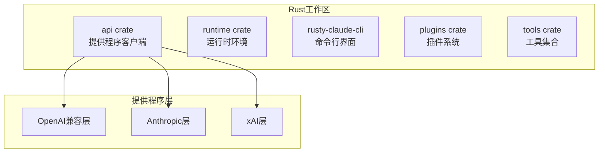
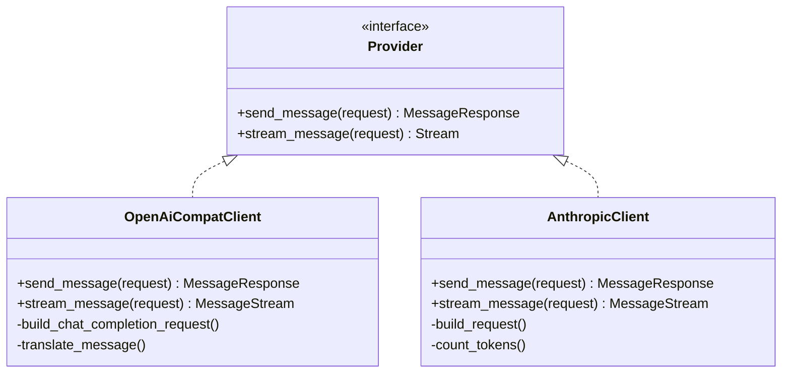
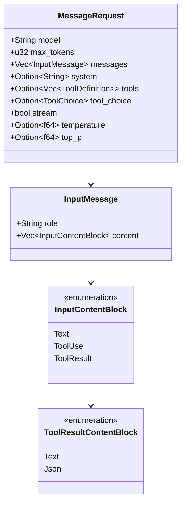
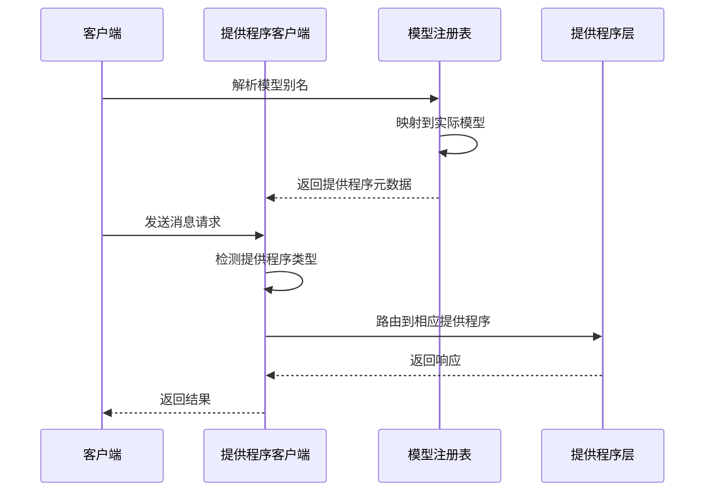
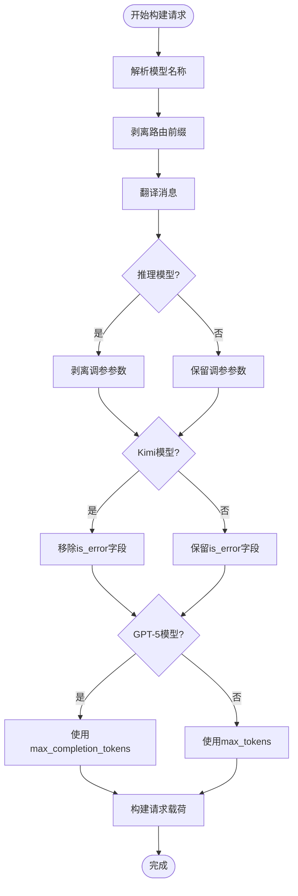
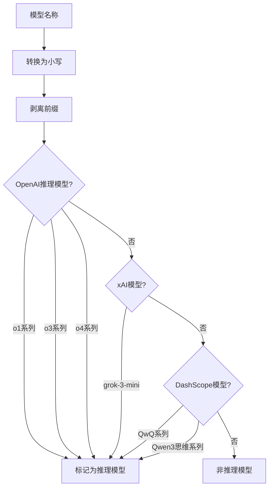
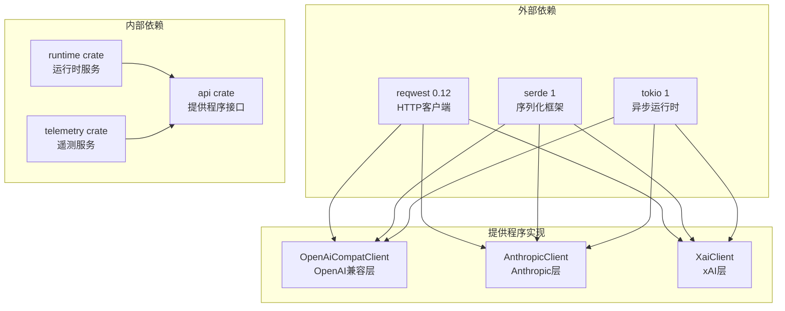
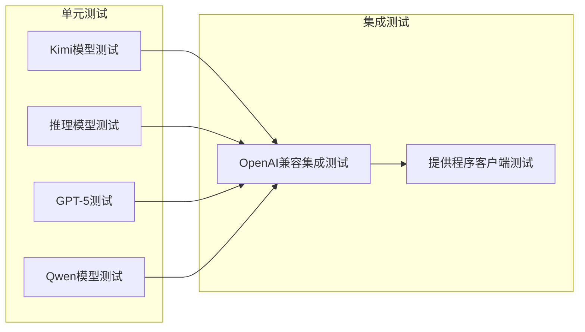
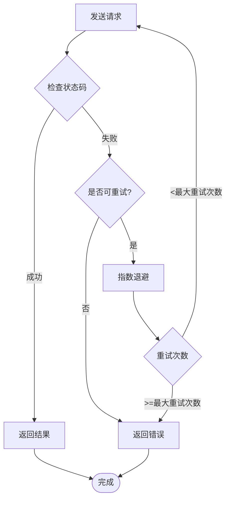
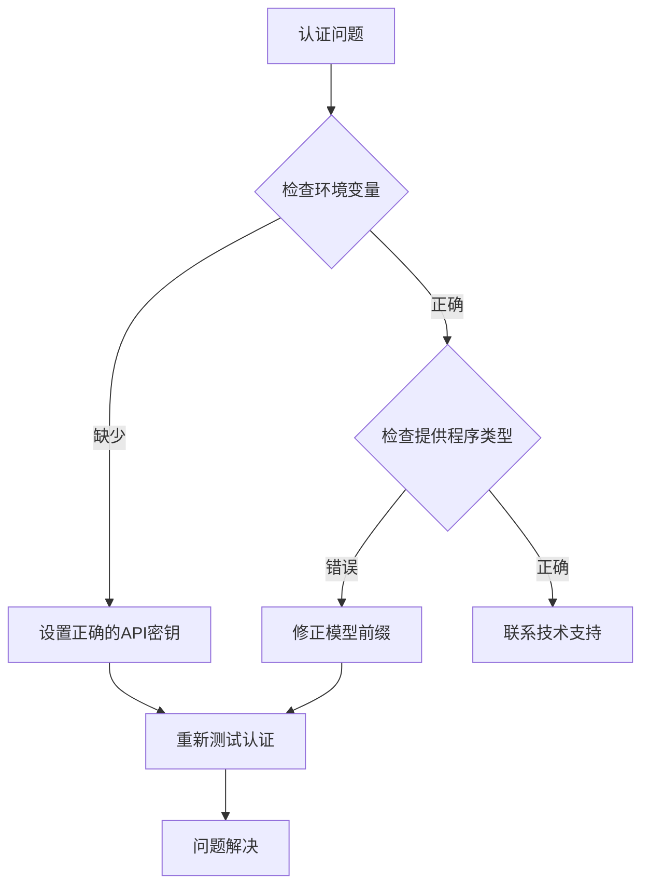

# 模型兼容性文档

<cite>
**本文档引用的文件**
- [MODEL_COMPATIBILITY.md](file://docs/MODEL_COMPATIBILITY.md)
- [openai_compat.rs](file://rust/crates/api/src/providers/openai_compat.rs)
- [mod.rs](file://rust/crates/api/src/providers/mod.rs)
- [types.rs](file://rust/crates/api/src/types.rs)
- [anthropic.rs](file://rust/crates/api/src/providers/anthropic.rs)
- [openai_compat_integration.rs](file://rust/crates/api/tests/openai_compat_integration.rs)
- [provider_client_integration.rs](file://rust/crates/api/tests/provider_client_integration.rs)
- [Cargo.toml](file://rust/Cargo.toml)
- [README.md](file://rust/README.md)
</cite>

## 目录
1. [简介](#简介)
2. [项目结构](#项目结构)
3. [核心组件](#核心组件)
4. [架构概览](#架构概览)
5. [详细组件分析](#详细组件分析)
6. [依赖关系分析](#依赖关系分析)
7. [性能考虑](#性能考虑)
8. [故障排除指南](#故障排除指南)
9. [结论](#结论)

## 简介

本文件详细说明了Claw Code项目中OpenAI兼容提供程序的模型兼容性实现。该项目实现了对多种AI模型的兼容处理，包括Kimi模型、推理模型、GPT-5模型和Qwen模型等特殊处理逻辑。

## 项目结构

Claw Code采用Rust工作区结构，主要包含以下关键组件：



**图表来源**
- [Cargo.toml:1-23](file://rust/Cargo.toml#L1-L23)
- [README.md:178-219](file://rust/README.md#L178-L219)

**章节来源**
- [Cargo.toml:1-23](file://rust/Cargo.toml#L1-L23)
- [README.md:178-219](file://rust/README.md#L178-L219)

## 核心组件

### 提供程序接口定义

提供程序接口定义了统一的消息发送和流式处理能力：



**图表来源**
- [mod.rs:16-29](file://rust/crates/api/src/providers/mod.rs#L16-L29)
- [openai_compat.rs:343-359](file://rust/crates/api/src/providers/openai_compat.rs#L343-L359)
- [anthropic.rs:777-793](file://rust/crates/api/src/providers/anthropic.rs#L777-L793)

### 消息类型系统

消息类型系统支持多种内容块类型和工具调用：



**图表来源**
- [types.rs:5-34](file://rust/crates/api/src/types.rs#L5-L34)
- [types.rs:44-95](file://rust/crates/api/src/types.rs#L44-L95)
- [types.rs:97-102](file://rust/crates/api/src/types.rs#L97-L102)

**章节来源**
- [mod.rs:16-29](file://rust/crates/api/src/providers/mod.rs#L16-L29)
- [types.rs:5-34](file://rust/crates/api/src/types.rs#L5-L34)

## 架构概览

### 模型路由和认证架构



**图表来源**
- [mod.rs:136-163](file://rust/crates/api/src/providers/mod.rs#L136-L163)
- [mod.rs:166-220](file://rust/crates/api/src/providers/mod.rs#L166-L220)

### 请求构建流程



**图表来源**
- [openai_compat.rs:845-927](file://rust/crates/api/src/providers/openai_compat.rs#L845-L927)
- [openai_compat.rs:935-941](file://rust/crates/api/src/providers/openai_compat.rs#L935-L941)

**章节来源**
- [openai_compat.rs:845-927](file://rust/crates/api/src/providers/openai_compat.rs#L845-L927)

## 详细组件分析

### Kimi模型兼容性处理

Kimi模型（通过Moonshot AI和DashScope）需要特殊的兼容性处理：

#### 模型检测逻辑

```mermaid
flowchart TD
Input[输入模型名称] --> LowerCase[转换为小写]
LowerCase --> SplitPrefix[剥离路由前缀]
SplitPrefix --> CheckKimi{是否以"kimi-"开头?}
CheckKimi --> |是| RejectIsError[拒绝is_error字段]
CheckKimi --> |否| AllowIsError[允许is_error字段]
RejectIsError --> Output1[返回true]
AllowIsError --> Output2[返回false]
```

**图表来源**
- [openai_compat.rs:935-941](file://rust/crates/api/src/providers/openai_compat.rs#L935-L941)

#### 工具结果消息处理

对于Kimi模型，工具结果消息不包含`is_error`字段：

| 模型类型 | is_error字段 | 原因 |
|---------|-------------|------|
| Kimi模型 | 不包含 | 400 Bad Request错误 |
| 其他模型 | 包含 | 支持错误状态报告 |

**章节来源**
- [openai_compat.rs:935-941](file://rust/crates/api/src/providers/openai_compat.rs#L935-L941)
- [openai_compat.rs:994-1004](file://rust/crates/api/src/providers/openai_compat.rs#L994-L1004)

### 推理模型参数处理

推理/链式思维模型需要剥离采样参数：

#### 推理模型检测



**图表来源**
- [openai_compat.rs:780-794](file://rust/crates/api/src/providers/openai_compat.rs#L780-L794)

#### 参数剥离策略

推理模型会自动剥离以下参数：

| 参数 | 作用 | 推理模型处理 |
|-----|------|-------------|
| temperature | 控制随机性 | 自动移除 |
| top_p | 核采样参数 | 自动移除 |
| frequency_penalty | 频率惩罚 | 自动移除 |
| presence_penalty | 存在惩罚 | 自动移除 |

**章节来源**
- [openai_compat.rs:780-794](file://rust/crates/api/src/providers/openai_compat.rs#L780-L794)
- [openai_compat.rs:1666-1692](file://rust/crates/api/src/providers/openai_compat.rs#L1666-L1692)

### GPT-5令牌限制处理

GPT-5模型使用不同的令牌限制字段：

#### 字段映射规则

```mermaid
flowchart TD
Input[模型名称] --> CheckGPT5{是否以"gpt-5"开头?}
CheckGPT5 --> |是| UseMaxCompletion[使用max_completion_tokens]
CheckGPT5 --> |否| UseMaxTokens[使用max_tokens]
UseMaxCompletion --> Payload[构建请求载荷]
UseMaxTokens --> Payload
Payload --> Output[发送请求]
```

**图表来源**
- [openai_compat.rs:873-877](file://rust/crates/api/src/providers/openai_compat.rs#L873-L877)

#### 兼容性差异

| 模型系列 | 令牌限制字段 | 用途 |
|---------|-------------|------|
| GPT-5系列 | max_completion_tokens | 限制生成令牌数 |
| 其他OpenAI模型 | max_tokens | 限制总令牌数 |

**章节来源**
- [openai_compat.rs:873-877](file://rust/crates/api/src/providers/openai_compat.rs#L873-L877)
- [openai_compat.rs:1742-1762](file://rust/crates/api/src/providers/openai_compat.rs#L1742-L1762)

### Qwen模型路由处理

Qwen模型通过DashScope兼容模式进行路由：

#### 路由配置

| 组件 | 默认值 | 环境变量 |
|------|--------|----------|
| 基础URL | https://dashscope.aliyuncs.com/compatible-mode/v1 | DASHSCOPE_BASE_URL |
| API密钥 | DASHSCOPE_API_KEY | DASHSCOPE_API_KEY |

#### 模型前缀识别

```mermaid
flowchart TD
Input[模型名称] --> CheckPrefix{是否以"qwen/"开头?}
CheckPrefix --> |是| RouteDashScope[路由到DashScope]
CheckPrefix --> |否| CheckBare{是否以"qwen-"开头?}
CheckBare --> |是| RouteDashScope
CheckBare --> |否| OtherModels[其他模型处理]
RouteDashScope --> Output[使用DashScope配置]
OtherModels --> Output2[使用默认配置]
```

**图表来源**
- [mod.rs:196-218](file://rust/crates/api/src/providers/mod.rs#L196-L218)

**章节来源**
- [mod.rs:196-218](file://rust/crates/api/src/providers/mod.rs#L196-L218)
- [openai_compat.rs:19-21](file://rust/crates/api/src/providers/openai_compat.rs#L19-L21)

## 依赖关系分析

### 提供程序依赖图



**图表来源**
- [Cargo.toml:8-14](file://rust/crates/api/Cargo.toml#L8-L14)

### 测试覆盖范围



**图表来源**
- [openai_compat_integration.rs:1-532](file://rust/crates/api/tests/openai_compat_integration.rs#L1-L532)
- [provider_client_integration.rs:1-89](file://rust/crates/api/tests/provider_client_integration.rs#L1-L89)

**章节来源**
- [openai_compat_integration.rs:1-532](file://rust/crates/api/tests/openai_compat_integration.rs#L1-L532)
- [provider_client_integration.rs:1-89](file://rust/crates/api/tests/provider_client_integration.rs#L1-L89)

## 性能考虑

### 请求体大小预检

不同提供程序有不同的请求体大小限制：

| 提供程序 | 最大大小限制 | 触发条件 |
|---------|-------------|----------|
| DashScope | 6MB (6,291,456字节) | 请求体超过限制 |
| OpenAI | 100MB (104,857,600字节) | 请求体超过限制 |
| xAI | 50MB (52,428,800字节) | 请求体超过限制 |

### 重试机制

提供程序实现包含指数退避重试机制：



**图表来源**
- [openai_compat.rs:234-263](file://rust/crates/api/src/providers/openai_compat.rs#L234-L263)

## 故障排除指南

### 常见兼容性问题

#### 400 Bad Request错误

| 错误原因 | 解决方案 |
|---------|---------|
| Kimi模型中的is_error字段 | 移除is_error字段或使用DashScope路由 |
| 推理模型的采样参数 | 移除temperature、top_p等参数 |
| GPT-5模型的令牌限制字段 | 使用max_completion_tokens而非max_tokens |
| DashScope请求体过大 | 减少请求内容或分批发送 |

#### 认证问题



**图表来源**
- [mod.rs:336-401](file://rust/crates/api/src/providers/mod.rs#L336-L401)

### 调试建议

1. **启用详细日志**：检查请求和响应的完整内容
2. **验证模型前缀**：确保使用正确的模型前缀进行路由
3. **检查令牌限制**：确认请求符合目标提供程序的限制
4. **测试最小复现**：创建最简单的请求来隔离问题

**章节来源**
- [mod.rs:336-401](file://rust/crates/api/src/providers/mod.rs#L336-L401)

## 结论

Claw Code项目的模型兼容性设计体现了以下特点：

1. **模块化架构**：清晰分离不同提供程序的实现
2. **灵活路由**：支持多种模型前缀和别名解析
3. **健壮的错误处理**：包含完整的错误检测和恢复机制
4. **全面的测试覆盖**：涵盖各种模型兼容性场景

该实现为多模型、多提供程序的AI应用提供了可靠的基础设施，支持从简单的文本生成到复杂的推理任务的各种需求。