# 路线图进展跟踪

<cite>
**本文档引用的文件**
- [ROADMAP.md](file://ROADMAP.md)
- [progress.txt](file://progress.txt)
- [README.md](file://README.md)
- [rust/README.md](file://rust/README.md)
- [Cargo.toml](file://rust/Cargo.toml)
- [src/main.py](file://src/main.py)
- [rust/crates/runtime/src/worker_boot.rs](file://rust/crates/runtime/src/worker_boot.rs)
- [rust/crates/runtime/src/lane_events.rs](file://rust/crates/runtime/src/lane_events.rs)
- [rust/crates/runtime/src/stale_branch.rs](file://rust/crates/runtime/src/stale_branch.rs)
- [rust/crates/runtime/src/recovery_recipes.rs](file://rust/crates/runtime/src/recovery_recipes.rs)
- [rust/crates/runtime/src/policy_engine.rs](file://rust/crates/runtime/src/policy_engine.rs)
</cite>

## 目录
1. [项目概述](#项目概述)
2. [路线图架构总览](#路线图架构总览)
3. [已完成里程碑](#已完成里程碑)
4. [核心实现组件](#核心实现组件)
5. [事件系统架构](#事件系统架构)
6. [分支检测机制](#分支检测机制)
7. [自动恢复机制](#自动恢复机制)
8. [策略引擎](#策略引擎)
9. [实施进度跟踪](#实施进度跟踪)
10. [未来发展方向](#未来发展方向)

## 项目概述

Claw Code 是一个高性能的 Rust 重写项目，旨在创建最"爪able"(clawable)的编码工具箱。该项目专注于消除人类优先的终端假设、脆弱的提示注入时机、不透明的会话状态等痛点。

### 核心目标

根据路线图定义，clawable 的核心特征包括：
- **确定性启动**：可靠的 worker 启动流程
- **机器可读性**：状态和故障模式的清晰表达
- **可恢复性**：无需人工监控的自动恢复能力
- **分支感知**：对工作树和分支状态的智能处理
- **事件驱动**：以事件而非日志为中心的架构

### 项目结构

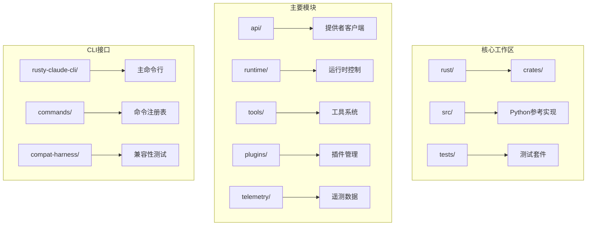

**图表来源**
- [rust/README.md:178-194](file://rust/README.md#L178-L194)
- [Cargo.toml:1-23](file://rust/Cargo.toml#L1-L23)

**章节来源**
- [README.md:1-134](file://README.md#L1-L134)
- [rust/README.md:1-219](file://rust/README.md#L1-L219)

## 路线图架构总览

路线图分为三个主要阶段，每个阶段都有明确的技术目标和验收标准：

### 阶段划分

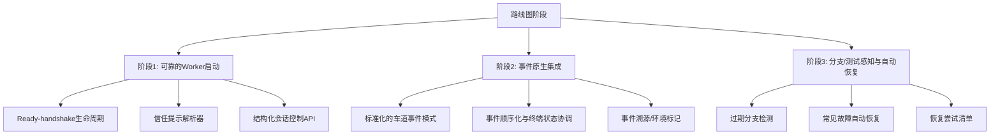

**图表来源**
- [ROADMAP.md:71-774](file://ROADMAP.md#L71-L774)

### 技术原则

路线图确立了七个核心产品原则：
1. **状态机优先** - 每个worker都有明确的生命周期状态
2. **事件优于文本** - 通道输出应来自类型化事件
3. **恢复优先于升级** - 已知失败模式应在求助前自动修复
4. **分支新鲜度优先于归咎** - 在将红色测试视为新回归之前检测过期分支
5. **部分成功是一等公民** - MCP启动可以对某些服务器成功而对其他服务器失败
6. **终端是传输，不是真相** - tmux/TUI可能保持实现细节，但编排状态必须位于其上
7. **策略是可执行的** - 合并、重试、变基、过期清理和升级规则应是机器强制执行的

**章节来源**
- [ROADMAP.md:61-70](file://ROADMAP.md#L61-L70)

## 已完成里程碑

根据进度跟踪文件，当前已完成7个主要故事点：

### 实现概要

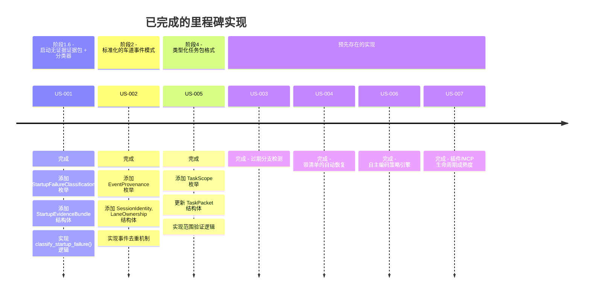

**图表来源**
- [progress.txt:1-84](file://progress.txt#L1-L84)

### 测试验证

所有实现都通过了全面的测试验证：
- **单元测试**：476+ 个测试用例
- **集成测试**：12 个集成测试
- **构建验证**：cargo build --workspace 通过
- **代码检查**：cargo clippy --workspace 通过

**章节来源**
- [progress.txt:77-84](file://progress.txt#L77-L84)

## 核心实现组件

### Worker 启动控制平面

Worker 启动控制平面提供了可靠的工作器启动基础，包括信任门检测、就绪提示握手和提示误投递检测。

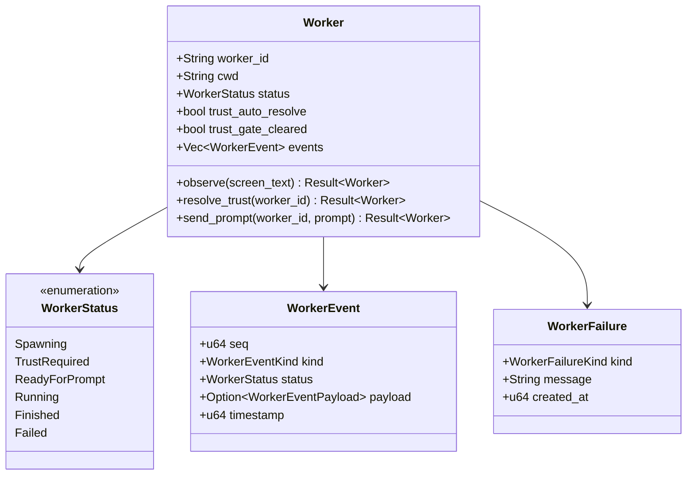

**图表来源**
- [rust/crates/runtime/src/worker_boot.rs:188-204](file://rust/crates/runtime/src/worker_boot.rs#L188-L204)

### 事件系统设计

事件系统提供了标准化的车道事件模式，支持事件溯源、环境标记和所有权绑定。

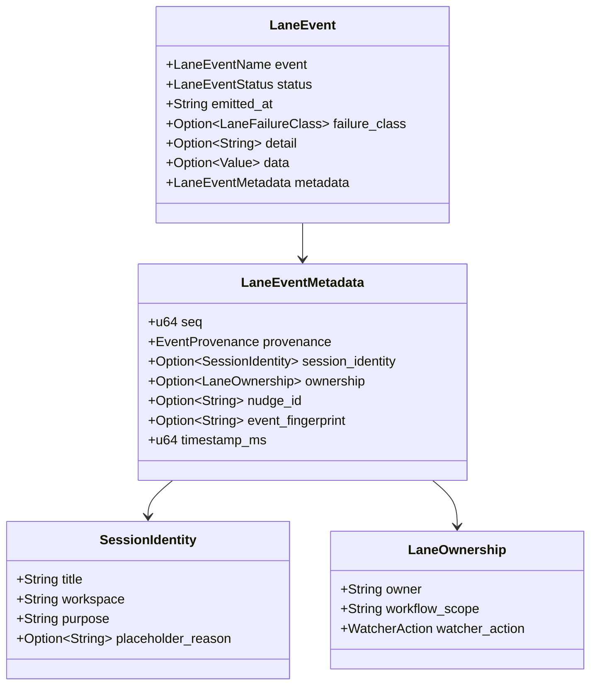

**图表来源**
- [rust/crates/runtime/src/lane_events.rs:408-421](file://rust/crates/runtime/src/lane_events.rs#L408-L421)

**章节来源**
- [rust/crates/runtime/src/worker_boot.rs:1-800](file://rust/crates/runtime/src/worker_boot.rs#L1-L800)
- [rust/crates/runtime/src/lane_events.rs:1-800](file://rust/crates/runtime/src/lane_events.rs#L1-L800)

## 事件系统架构

### 事件分类体系

事件系统定义了完整的事件分类体系，包括车道事件、分支事件和故障分类。

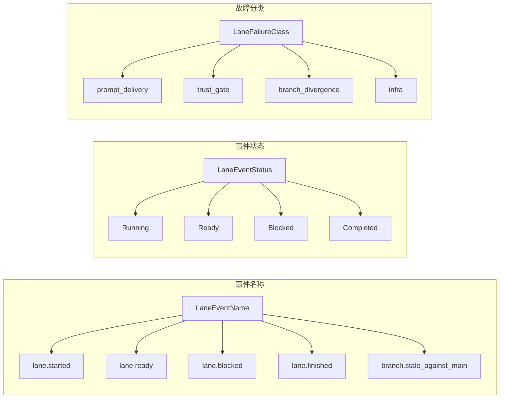

**图表来源**
- [rust/crates/runtime/src/lane_events.rs:5-41](file://rust/crates/runtime/src/lane_events.rs#L5-L41)

### 事件元数据管理

事件元数据提供了事件溯源、时间戳管理和去重机制。

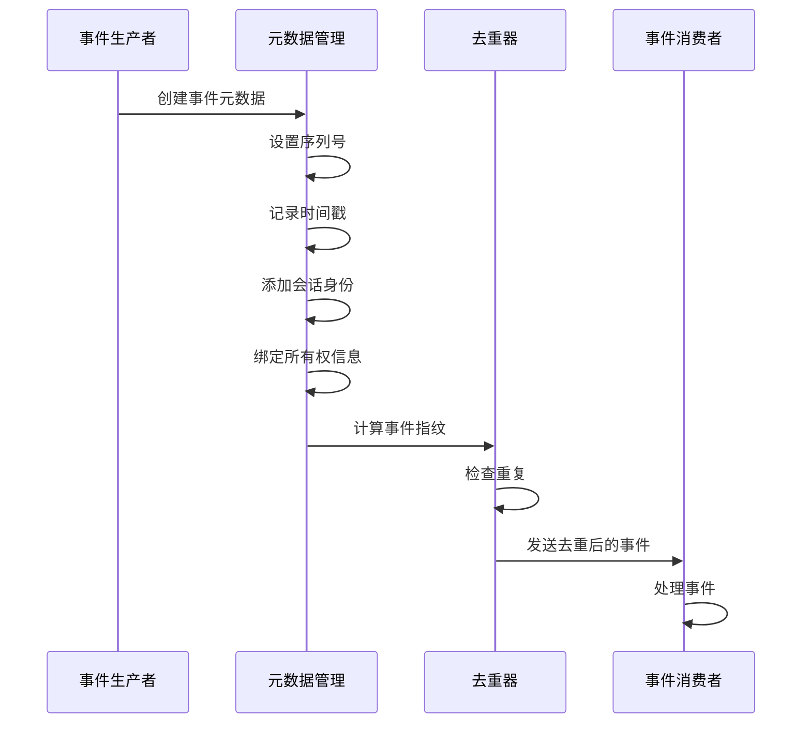

**图表来源**
- [rust/crates/runtime/src/lane_events.rs:330-384](file://rust/crates/runtime/src/lane_events.rs#L330-L384)

**章节来源**
- [rust/crates/runtime/src/lane_events.rs:1-800](file://rust/crates/runtime/src/lane_events.rs#L1-L800)

## 分支检测机制

### 分支新鲜度评估

分支检测机制提供了精确的分支新鲜度评估，支持多种策略模式。

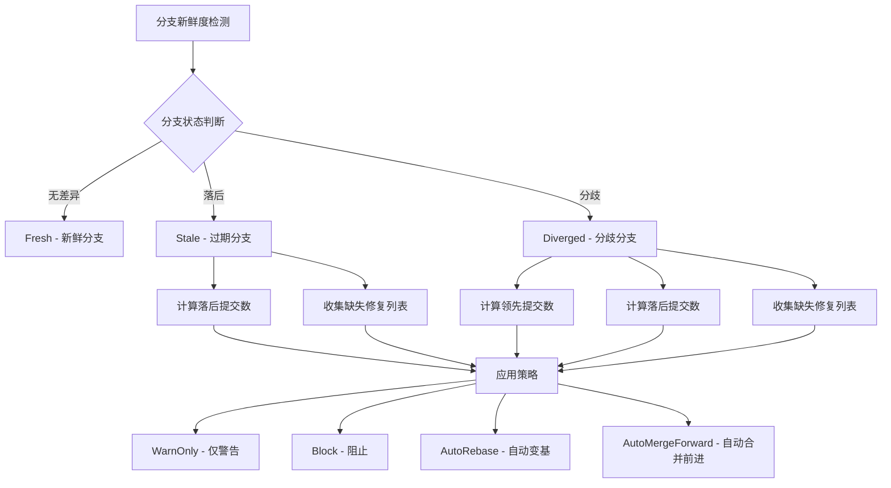

**图表来源**
- [rust/crates/runtime/src/stale_branch.rs:53-130](file://rust/crates/runtime/src/stale_branch.rs#L53-L130)

### 策略应用机制

不同的分支状态对应不同的策略应用：

| 分支状态 | 策略选项 | 行为描述 |
|---------|---------|----------|
| Fresh | WarnOnly/Block/AutoRebase/AutoMergeForward | 新鲜分支，可选择不同处理方式 |
| Stale | WarnOnly/Block/AutoRebase/AutoMergeForward | 过期分支，显示落后信息 |
| Diverged | WarnOnly/Block | 分歧分支，需要解决分歧 |

**章节来源**
- [rust/crates/runtime/src/stale_branch.rs:1-418](file://rust/crates/runtime/src/stale_branch.rs#L1-L418)

## 自动恢复机制

### 故障场景识别

自动恢复机制针对六种已知故障场景提供恢复方案：

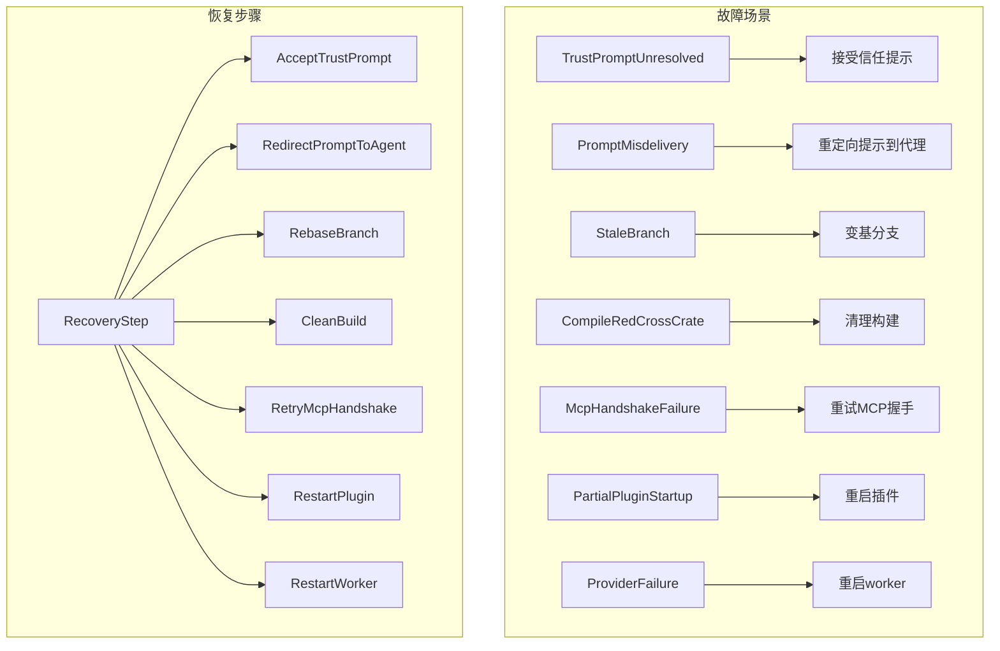

**图表来源**
- [rust/crates/runtime/src/recovery_recipes.rs:16-56](file://rust/crates/runtime/src/recovery_recipes.rs#L16-L56)

### 恢复执行流程

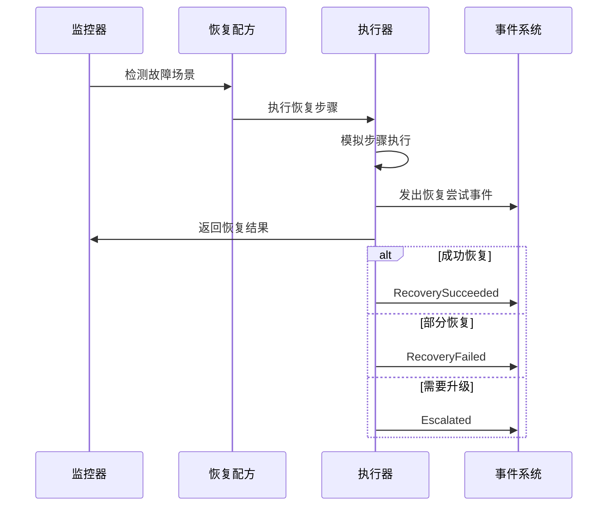

**图表来源**
- [rust/crates/runtime/src/recovery_recipes.rs:229-308](file://rust/crates/runtime/src/recovery_recipes.rs#L229-L308)

**章节来源**
- [rust/crates/runtime/src/recovery_recipes.rs:1-634](file://rust/crates/runtime/src/recovery_recipes.rs#L1-L634)

## 策略引擎

### 规则条件系统

策略引擎提供了灵活的规则匹配系统，支持复杂的条件组合。

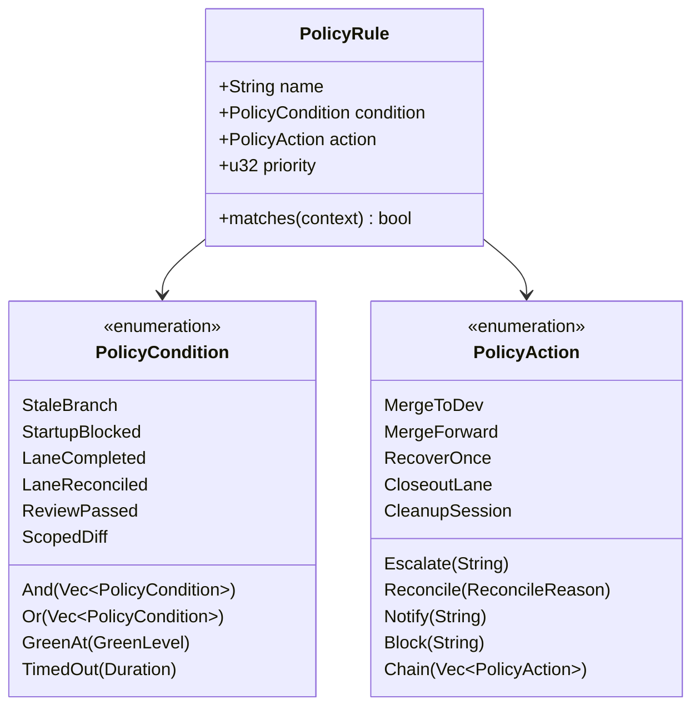

**图表来源**
- [rust/crates/runtime/src/policy_engine.rs:8-111](file://rust/crates/runtime/src/policy_engine.rs#L8-L111)

### 上下文管理

策略引擎通过 LaneContext 提供统一的执行上下文：

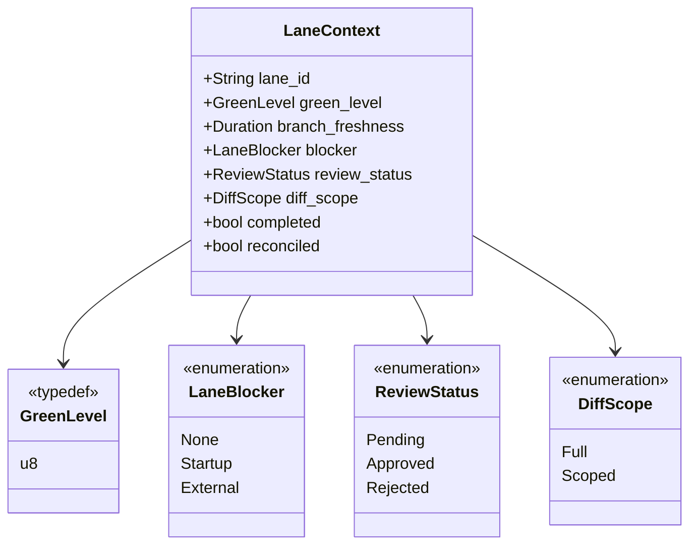

**图表来源**
- [rust/crates/runtime/src/policy_engine.rs:134-182](file://rust/crates/runtime/src/policy_engine.rs#L134-L182)

**章节来源**
- [rust/crates/runtime/src/policy_engine.rs:1-582](file://rust/crates/runtime/src/policy_engine.rs#L1-L582)

## 实施进度跟踪

### 当前实现状态

根据进度跟踪文件，项目当前实现了以下关键功能：

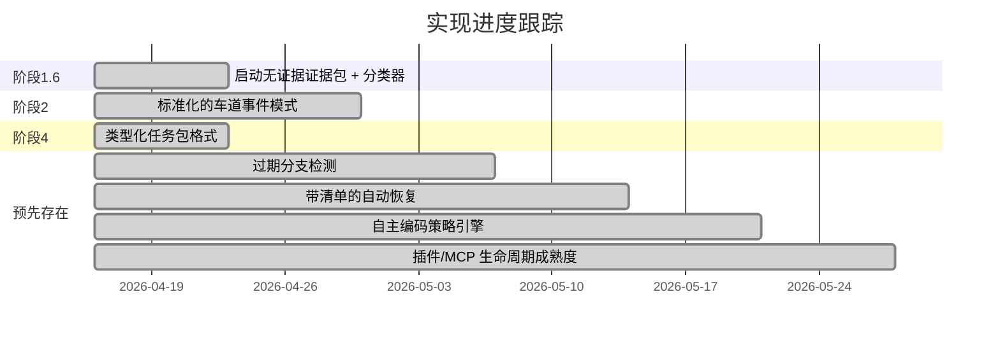

**图表来源**
- [progress.txt:4-84](file://progress.txt#L4-L84)

### 质量保证

所有实现都通过了严格的质量保证：
- **构建验证**：cargo build --workspace PASSED
- **测试验证**：cargo test --workspace 476+ unit tests + 12 integration tests
- **代码质量**：cargo clippy --workspace PASSED
- **需求满足**：所有 prd.json 中的故事点都通过了验证

**章节来源**
- [progress.txt:77-84](file://progress.txt#L77-L84)

## 未来发展方向

### 待完成的功能

根据路线图，还有多个高级功能需要实现：

```mermaid
mindmap
root((路线图待办事项))
高级事件功能
事件原子性报告
跨爬虫指针去重
证据附件契约
优先级/严重性契约
报告系统
结构化报告版本控制
消费者能力协商
自描述报告模式
投影失效/陈旧视图缓存
政策系统
政策阻止动作交接
政策例外/所有者批准令牌
令牌优化/仓库范围指导
用户体验
令牌风险预检
安全范围快速应用
```

### 技术债务清理

项目还包含多个清理和改进任务：
- **错误分类规范化**：统一故障类别
- **传输故障边界**：区分主机级故障和车道本地故障
- **可操作摘要压缩**：将嘈杂的事件流压缩为机器可读的状态更新

**章节来源**
- [ROADMAP.md:714-774](file://ROADMAP.md#L714-L774)

## 总结

Claw Code 项目在路线图指引下取得了显著进展，特别是在事件系统、分支检测和自动恢复方面。通过实现标准化的事件模式、完善的分支新鲜度检测和智能的自动恢复机制，项目正在向"clawable"的目标稳步迈进。

当前的实现为后续的高级功能奠定了坚实基础，包括更精细的事件契约、报告系统的结构化输出以及更复杂的策略执行。随着这些功能的逐步实现，Claw Code 将成为真正可靠的自动化编码工具箱。